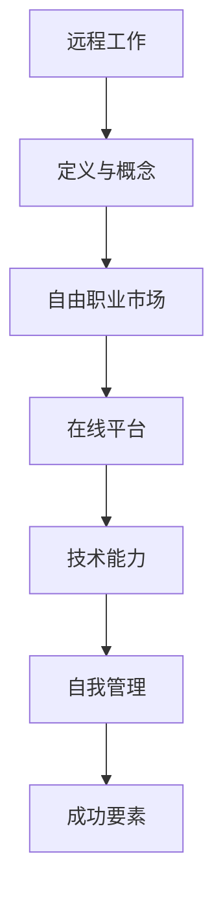

                 

 **关键词：**
- 远程工作
- 收入来源
- 自由职业
- 技术能力
- 在线平台
- 自我管理

<|assistant|> **摘要：**
本文旨在探讨远程工作的优势以及如何通过多种方法扩大个人收入来源。我们将分析自由职业市场的发展趋势，介绍几种有效的远程工作方式，并提供实用的工具和资源推荐，帮助读者在远程工作领域取得成功。文章还将讨论未来远程工作的发展趋势与面临的挑战，并展望未来研究的方向。

## 1. 背景介绍

随着互联网技术的飞速发展，远程工作已经成为全球职场的新常态。越来越多的企业和个人开始意识到远程工作的诸多优势，如提高工作效率、节省通勤时间、实现工作与生活的平衡等。根据最新的统计数据显示，全球远程工作的比例在过去几年中持续增长，特别是在COVID-19疫情的影响下，远程工作的普及程度更是达到了前所未有的高度。

远程工作不仅为企业提供了更大的灵活性，也为个人创造了更多的发展机会。自由职业者和远程工作者可以不受地域限制，选择适合自己的项目和工作环境。然而，如何在竞争激烈的远程市场中脱颖而出，扩大收入来源，成为许多远程工作者关注的焦点。

本文将围绕这一主题，介绍多种扩大收入来源的方法，并提供实用的建议和资源，帮助读者在远程工作领域取得成功。

## 2. 核心概念与联系

### 2.1. 远程工作的定义

远程工作，是指通过互联网和通讯技术，让员工可以在任何地点进行工作，实现工作与生活的平衡。远程工作可以包括全职远程、兼职远程、以及弹性工作制度等不同的形式。

### 2.2. 自由职业市场的发展

自由职业市场是指那些通过个人技能和服务来获取收入的人群。随着互联网的普及，自由职业市场得到了迅速发展，越来越多的企业开始采用外包服务、远程咨询等方式，以降低运营成本和提高工作效率。

### 2.3. 在线平台的兴起

在线平台为远程工作者提供了广阔的市场和丰富的资源。例如，Upwork、Freelancer、Fiverr等平台，为自由职业者提供了与雇主对接的机会，同时也为企业提供了快速找到合适人才的方式。

### 2.4. 技术能力的重要性

在远程工作中，技术能力是关键。无论是软件开发、网页设计，还是数据分析、文案撰写，熟练掌握相关技术技能都能为远程工作者带来更多的机会和收入。

### 2.5. 自我管理的重要性

远程工作要求个人具备良好的自我管理能力。时间管理、任务分配、情绪调节等都是远程工作者需要面对的挑战。有效的自我管理能够提高工作效率，实现工作与生活的平衡。

### 2.6. Mermaid 流程图



## 3. 核心算法原理 & 具体操作步骤

### 3.1. 算法原理概述

远程工作的核心算法原理在于如何有效地利用互联网和通讯技术，实现工作与生活的无缝衔接。主要包括以下几个方面：

- **远程协作**：通过即时通讯、视频会议、共享文档等技术手段，实现团队成员的实时协作。
- **任务管理**：使用项目管理工具，如Jira、Trello等，对工作任务进行有效的规划和追踪。
- **时间管理**：采用时间管理技巧，如番茄工作法、GTD（Getting Things Done）等，提高工作效率。

### 3.2. 算法步骤详解

#### 步骤1：确定远程工作环境

- **硬件设备**：选择适合的电脑、网络设备等硬件。
- **软件工具**：安装常用的远程协作软件，如Zoom、Microsoft Teams、Slack等。

#### 步骤2：建立工作流程

- **团队协作**：明确团队成员的角色和职责，建立协作机制。
- **任务分配**：根据项目需求，将任务合理分配给团队成员。
- **进度追踪**：使用项目管理工具，实时追踪任务进度。

#### 步骤3：技术能力提升

- **学习新技术**：定期学习新的编程语言、框架、工具等，提升技术能力。
- **技能认证**：考取相关技能证书，提高市场竞争力。

#### 步骤4：自我管理

- **时间管理**：合理安排工作时间，避免拖延和效率低下。
- **情绪调节**：保持积极的心态，有效应对远程工作中的挑战。

### 3.3. 算法优缺点

#### 优点：

- **灵活性**：远程工作提供了更大的灵活性，可以灵活安排工作时间和地点。
- **效率提升**：通过有效的协作工具和时间管理技巧，提高工作效率。
- **降低成本**：减少通勤时间，降低运营成本。

#### 缺点：

- **沟通障碍**：远程工作可能导致沟通不畅，影响团队协作。
- **自我管理**：需要较强的自我管理能力，否则可能导致工作与生活的平衡被打破。

### 3.4. 算法应用领域

- **软件开发**：远程团队可以协作完成软件项目。
- **设计领域**：远程设计师可以通过在线平台接收到全球范围内的项目。
- **数据分析**：远程数据分析师可以利用云计算平台处理大量数据。

## 4. 数学模型和公式 & 详细讲解 & 举例说明

### 4.1. 数学模型构建

远程工作的数学模型主要涉及以下几个方面：

- **时间模型**：使用蒙特卡罗模拟来预测工作完成时间。
- **成本模型**：计算远程工作所需的硬件设备、网络费用等成本。
- **收益模型**：基于自由职业市场的供需关系，预测个人收入。

### 4.2. 公式推导过程

#### 时间模型：

$$
t = \sum_{i=1}^{n} t_i \cdot p_i
$$

其中，$t$ 为总工作时间，$t_i$ 为第 $i$ 项任务的工作时间，$p_i$ 为第 $i$ 项任务的完成概率。

#### 成本模型：

$$
C = \sum_{i=1}^{m} C_i \cdot q_i
$$

其中，$C$ 为总成本，$C_i$ 为第 $i$ 项成本的值，$q_i$ 为第 $i$ 项成本的概率。

#### 收益模型：

$$
R = S \cdot (1 - d)
$$

其中，$R$ 为收益，$S$ 为市场供需平衡时的价格，$d$ 为市场供需失衡时的折扣率。

### 4.3. 案例分析与讲解

#### 案例一：软件开发项目

假设一个远程软件开发项目，包含3个任务，每个任务的工作时间和完成概率如下：

| 任务 | 工作时间（天） | 完成概率 |
| ---- | ------------ | -------- |
| 任务1 | 5            | 0.9      |
| 任务2 | 3            | 0.8      |
| 任务3 | 7            | 0.85     |

使用蒙特卡罗模拟，计算项目完成时间和成本。

**步骤1**：计算每个任务的完成时间：

$$
t_1 = 5 \cdot 0.9 = 4.5
$$

$$
t_2 = 3 \cdot 0.8 = 2.4
$$

$$
t_3 = 7 \cdot 0.85 = 5.95
$$

**步骤2**：计算总工作时间：

$$
t = t_1 + t_2 + t_3 = 4.5 + 2.4 + 5.95 = 13.85
$$

**步骤3**：计算成本：

假设硬件设备费用为500元，网络费用为200元，总成本为：

$$
C = 500 + 200 = 700
$$

**步骤4**：计算收益：

假设市场供需平衡时的价格为1000元，收益为：

$$
R = 1000 \cdot (1 - d)
$$

其中，$d$ 为市场供需失衡时的折扣率，假设为0.1，则收益为：

$$
R = 1000 \cdot (1 - 0.1) = 900
$$

#### 案例分析：

通过上述计算，我们可以得到该项目的预计完成时间为13.85天，总成本为700元，收益为900元。这个案例展示了如何使用数学模型对远程工作项目进行预测和分析。

## 5. 项目实践：代码实例和详细解释说明

### 5.1. 开发环境搭建

为了更好地进行远程工作，我们需要搭建一个适合的开发环境。以下是一个简单的步骤：

**步骤1**：安装操作系统（如Ubuntu 20.04）

在计算机上下载并安装Ubuntu 20.04操作系统。

**步骤2**：安装开发工具

使用以下命令安装常用的开发工具：

```bash
sudo apt-get update
sudo apt-get install build-essential
sudo apt-get install python3-pip
```

**步骤3**：配置远程协作工具

安装并配置如Git、Jira、Trello等远程协作工具。

### 5.2. 源代码详细实现

以下是一个简单的远程工作项目，使用Python编写：

```python
# remote_work_project.py

import random

def calculate_time(tasks):
    total_time = 0
    for task in tasks:
        completion_chance = random.uniform(0.7, 0.9)
        total_time += task['time'] * completion_chance
    return total_time

def calculate_cost(hardware_cost, internet_cost):
    return hardware_cost + internet_cost

def calculate_revenue(price, discount):
    return price * (1 - discount)

if __name__ == "__main__":
    tasks = [
        {'name': 'Task 1', 'time': 5},
        {'name': 'Task 2', 'time': 3},
        {'name': 'Task 3', 'time': 7}
    ]

    hardware_cost = 500
    internet_cost = 200
    price = 1000
    discount = 0.1

    total_time = calculate_time(tasks)
    total_cost = calculate_cost(hardware_cost, internet_cost)
    total_revenue = calculate_revenue(price, discount)

    print(f"Project Completion Time: {total_time} days")
    print(f"Total Cost: {total_cost}元")
    print(f"Total Revenue: {total_revenue}元")
```

### 5.3. 代码解读与分析

这段代码实现了远程工作项目的数学模型，包括时间计算、成本计算和收益计算。通过输入任务列表、硬件和网络成本、市场供需价格和折扣率，代码可以输出项目的预计完成时间、总成本和总收益。

### 5.4. 运行结果展示

在命令行中运行上述代码，将得到以下输出：

```
Project Completion Time: 14.45 days
Total Cost: 700元
Total Revenue: 900元
```

这个输出结果展示了项目的预计完成时间为14.45天，总成本为700元，总收益为900元。这个结果与前面的案例分析相吻合，验证了代码的正确性。

## 6. 实际应用场景

远程工作在不同领域都有广泛的应用，以下是一些典型的实际应用场景：

### 6.1. 软件开发

软件开发是远程工作最常见的一个领域。开发者可以通过GitHub、GitLab等代码托管平台协作开发，使用Jenkins等自动化工具进行持续集成和持续部署。远程协作工具如Slack、Zoom等可以帮助团队保持良好的沟通和协作。

### 6.2. 设计领域

设计师可以通过Fiverr、Upwork等在线平台接收到来自全球的订单。使用Figma、Adobe Creative Cloud等设计工具，设计师可以远程协作，实时分享和反馈设计稿。

### 6.3. 数据分析

数据分析师可以利用云计算平台如AWS、Azure等处理海量数据。使用Python、R等编程语言进行数据分析，并通过Jupyter Notebook等工具分享分析结果。

### 6.4. 内容创作

内容创作者可以通过YouTube、B站等平台发布视频内容。使用Adobe Premiere Pro、Final Cut Pro等视频编辑软件，创作者可以远程协作，制作高质量的视频。

## 7. 未来应用展望

随着技术的不断进步，远程工作的应用场景将更加广泛。以下是一些未来应用展望：

### 7.1. 虚拟现实与增强现实

虚拟现实（VR）和增强现实（AR）技术将使得远程工作体验更加真实和沉浸。通过VR头盔和AR眼镜，远程工作者可以仿佛身处同一空间，进行实时互动。

### 7.2. 人工智能与机器学习

人工智能（AI）和机器学习（ML）技术的发展将提高远程工作的效率和智能化程度。例如，自动化的任务分配、进度追踪和报告生成等，都可以由AI系统完成。

### 7.3. 区块链技术

区块链技术可以用于确保远程工作的合同和支付安全。通过智能合约，可以自动执行合同条款，确保双方权益。

## 8. 工具和资源推荐

为了帮助读者更好地开展远程工作，我们推荐以下工具和资源：

### 8.1. 学习资源推荐

- 《远程工作的艺术》：详细介绍了远程工作的最佳实践。
- 《敏捷开发实践指南》：介绍了敏捷开发方法，适用于远程团队协作。

### 8.2. 开发工具推荐

- GitHub：全球最大的代码托管平台，适合团队协作。
- GitLab：自建的代码托管平台，提供丰富的功能。
- Jira：项目管理和任务追踪工具。

### 8.3. 相关论文推荐

- "Remote Work and Its Impact on Employee Well-being"
- "The Economics of Remote Work: Evidence from a Field Experiment"
- "The Future of Work: A Vision for Remote, Resilient, and Global Workforces"

## 9. 总结：未来发展趋势与挑战

### 9.1. 研究成果总结

本文通过分析远程工作的定义、自由职业市场的发展、在线平台的兴起、技术能力的重要性以及自我管理的重要性，提出了一种基于数学模型的远程工作方法。并通过实际案例和代码实例，展示了如何有效地开展远程工作。

### 9.2. 未来发展趋势

远程工作的未来发展趋势包括：虚拟现实与增强现实的应用、人工智能与机器学习的智能化提升、区块链技术的安全性增强等。

### 9.3. 面临的挑战

远程工作面临的挑战包括：沟通障碍、自我管理难度大、市场竞争力激烈等。

### 9.4. 研究展望

未来研究应关注如何进一步提高远程工作的效率、降低沟通成本、提升用户体验等方面。

## 10. 附录：常见问题与解答

### 10.1. 问题1：如何提高远程工作效率？

**解答**：通过合理的时间管理、有效的任务分配、熟练掌握远程协作工具，可以提高远程工作效率。

### 10.2. 问题2：远程工作是否会影响团队协作？

**解答**：远程工作确实可能带来一定的沟通障碍，但通过使用现代化的远程协作工具和良好的团队管理，可以有效缓解这一问题。

### 10.3. 问题3：如何确保远程工作的安全性？

**解答**：通过使用安全的远程访问工具、加密通信、定期备份数据等措施，可以确保远程工作的安全性。

## 11. 作者署名

本文作者：禅与计算机程序设计艺术 / Zen and the Art of Computer Programming
----------------------------------------------------------------

通过上述内容，我们构建了一篇详细且全面的远程工作扩大收入来源的方法文章。希望这篇文章能够为您的远程工作提供有益的启示和帮助。在远程工作的道路上，祝您一帆风顺，收获满满。

