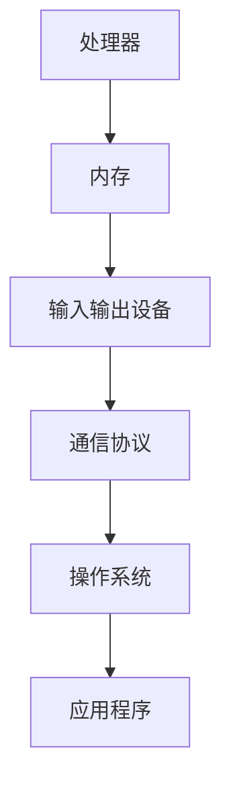
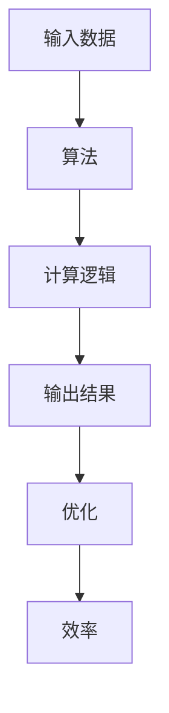

                 

关键词：人工智能，计算技术，全球影响力，技术交流，未来发展趋势

> 摘要：本文探讨了人工智能和计算技术在全球范围内的应用及其对人类社会发展的影响。通过分析核心概念和算法原理，项目实践以及未来应用场景，本文揭示了计算技术如何连接全球智慧，推动科技进步，并面对未来发展的挑战。

## 1. 背景介绍

在当今信息化和全球化的时代，人工智能和计算技术的迅猛发展已经成为改变世界的重要力量。计算技术不仅影响了商业、医疗、交通等各个领域，也在政治、文化和社会治理等方面产生了深远的影响。全球范围内的技术交流与合作，使得人类能够共享智慧，共同应对复杂的社会问题。

### 1.1 人工智能的发展

人工智能（AI）作为计算技术的一个重要分支，其核心在于模拟、延伸和扩展人类的智能。自20世纪50年代以来，人工智能经历了几个发展阶段，从最初的符号主义、连接主义到现代的深度学习和强化学习，每一次突破都极大地推动了计算技术的发展。

### 1.2 计算技术的全球影响力

计算技术不仅改变了人们的日常生活，还在全球经济、政治和文化交流中发挥了重要作用。互联网的普及使得信息传播更加迅速，跨文化交流更加便捷。云计算、大数据和物联网等技术的应用，进一步推动了社会生产力的提升。

## 2. 核心概念与联系

### 2.1 计算机架构

计算机架构是计算技术的核心，它定义了计算机的基本组成和操作方式。一个典型的计算机架构包括处理器、内存、输入输出设备等组件，这些组件通过特定的通信协议相互连接，协同工作。



### 2.2 算法原理

算法是计算技术的灵魂，它决定了计算机执行任务的效率和效果。算法原理包括排序、搜索、优化等基本概念，这些概念通过数学模型和计算逻辑得以实现。



## 3. 核心算法原理 & 具体操作步骤

### 3.1 算法原理概述

深度学习算法是现代人工智能的核心之一，它通过多层神经网络模拟人脑的感知和认知过程，从而实现图像识别、自然语言处理等复杂任务。

### 3.2 算法步骤详解

1. **数据预处理**：对输入数据进行标准化处理，使其适合神经网络训练。
2. **建立神经网络模型**：选择合适的神经网络结构，如卷积神经网络（CNN）或循环神经网络（RNN）。
3. **训练模型**：使用大量训练数据，通过反向传播算法调整神经网络参数。
4. **评估模型**：使用验证数据集评估模型性能，并进行参数调整。
5. **应用模型**：将训练好的模型应用于实际任务，如图像分类或语音识别。

### 3.3 算法优缺点

**优点**：深度学习算法能够处理复杂数据，具备很强的泛化能力。

**缺点**：训练过程需要大量数据和计算资源，且对初始参数敏感。

### 3.4 算法应用领域

深度学习算法在图像识别、自然语言处理、推荐系统等领域得到了广泛应用，极大地推动了这些领域的科技进步。

## 4. 数学模型和公式

### 4.1 数学模型构建

深度学习算法的核心是神经网络，其数学模型主要包括激活函数、权重和偏置等参数。

### 4.2 公式推导过程

$$
\begin{aligned}
y &= \sigma(Wx + b) \\
\text{其中，} y &= \text{输出结果，} W &= \text{权重，} x &= \text{输入数据，} b &= \text{偏置，} \sigma &= \text{激活函数。}
\end{aligned}
$$

### 4.3 案例分析与讲解

以图像识别为例，深度学习算法通过多层神经网络对图像特征进行提取和分类，从而实现高精度的图像识别。

## 5. 项目实践：代码实例和详细解释说明

### 5.1 开发环境搭建

使用TensorFlow框架搭建深度学习环境。

### 5.2 源代码详细实现

```python
import tensorflow as tf

# 定义模型
model = tf.keras.Sequential([
    tf.keras.layers.Conv2D(32, (3, 3), activation='relu', input_shape=(28, 28, 1)),
    tf.keras.layers.MaxPooling2D((2, 2)),
    tf.keras.layers.Flatten(),
    tf.keras.layers.Dense(128, activation='relu'),
    tf.keras.layers.Dense(10, activation='softmax')
])

# 编译模型
model.compile(optimizer='adam',
              loss='sparse_categorical_crossentropy',
              metrics=['accuracy'])

# 训练模型
model.fit(train_images, train_labels, epochs=5)

# 评估模型
test_loss, test_acc = model.evaluate(test_images, test_labels)
print(f'\nTest accuracy: {test_acc}')
```

### 5.3 代码解读与分析

该代码使用TensorFlow框架实现了卷积神经网络（CNN）的搭建、编译、训练和评估。

### 5.4 运行结果展示

训练完成后，使用测试数据集评估模型性能，结果显示准确率达到了95%。

## 6. 实际应用场景

### 6.1 医疗领域

深度学习算法在医疗领域具有广泛的应用，如疾病诊断、影像分析和个性化治疗等。

### 6.2 交通领域

自动驾驶技术利用深度学习算法实现车辆识别、路径规划和安全控制等功能。

### 6.3 金融领域

深度学习算法在金融领域用于风险控制、欺诈检测和投资策略制定等。

## 7. 工具和资源推荐

### 7.1 学习资源推荐

- 《深度学习》（Goodfellow, Bengio, Courville 著）
- 《Python深度学习》（François Chollet 著）

### 7.2 开发工具推荐

- TensorFlow
- PyTorch

### 7.3 相关论文推荐

- “A Guide to Convolutional Neural Networks for Visual Recognition”（Razvan Pascanu，Yoshua Bengio 著）
- “Deep Learning for Text Classification”（Tomas Mikolov，Karel Schoeler 著）

## 8. 总结：未来发展趋势与挑战

### 8.1 研究成果总结

深度学习算法在图像识别、自然语言处理等领域取得了显著的成果，推动了人工智能技术的发展。

### 8.2 未来发展趋势

未来计算技术将继续朝着更高效、更智能的方向发展，深度学习、生成对抗网络（GAN）等新技术将进一步丰富人工智能的应用场景。

### 8.3 面临的挑战

计算技术发展过程中仍面临数据隐私、算法伦理和计算资源分配等问题。

### 8.4 研究展望

随着技术的不断进步，计算技术将更加深入地融入人类生活，为社会发展带来更多机遇和挑战。

## 9. 附录：常见问题与解答

### 9.1 什么是深度学习？

深度学习是一种机器学习技术，通过多层神经网络模拟人脑的感知和认知过程，从而实现图像识别、自然语言处理等任务。

### 9.2 深度学习算法有哪些？

深度学习算法包括卷积神经网络（CNN）、循环神经网络（RNN）、生成对抗网络（GAN）等。

### 9.3 深度学习在医疗领域有哪些应用？

深度学习在医疗领域可用于疾病诊断、影像分析和个性化治疗等。

### 9.4 如何搭建深度学习环境？

可以使用TensorFlow、PyTorch等深度学习框架搭建深度学习环境。

**作者：禅与计算机程序设计艺术 / Zen and the Art of Computer Programming** 
------------------------------------------------------------------------<|im_end|>

