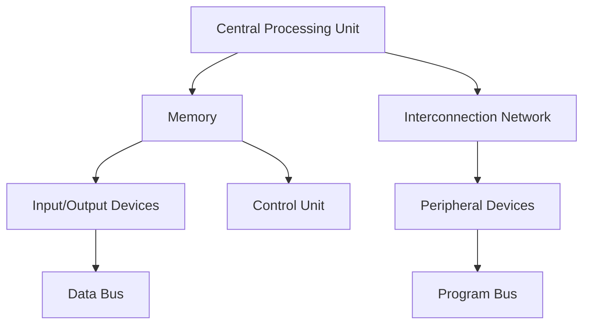
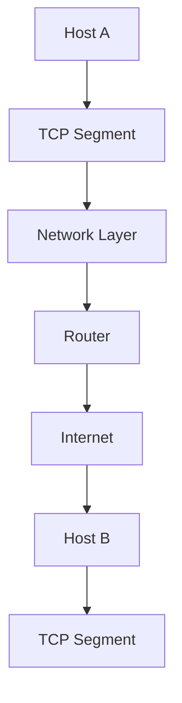

                 

关键词：全球计算社区、计算影响力、信息技术、计算应用、未来展望

> 摘要：本文旨在探讨全球计算社区的力量及其对人类计算全球影响力的贡献。通过分析核心概念、算法原理、数学模型、实际应用，以及工具资源等方面，揭示计算技术在推动全球科技进步和社会发展中的作用。文章最后总结了未来发展趋势、面临的挑战以及研究展望，以期为读者提供对计算领域更全面的认识。

## 1. 背景介绍

自计算机问世以来，计算技术经历了飞速发展，从最初的电子管计算机到今天的量子计算机，计算能力的提升推动了人类社会的进步。计算技术的普及使得全球计算社区形成了一个庞大的网络，使得信息交流、知识共享、资源协同成为可能。这一背景下，计算技术在全球范围内的应用日益广泛，对各个领域的变革产生了深远影响。

本文将围绕全球计算社区的力量，探讨其对人类计算的全球影响力。首先，我们将介绍核心概念及其架构，分析核心算法原理和操作步骤。接着，通过数学模型和公式的推导，结合具体案例进行详细讲解。然后，我们将展示项目实践中的代码实例和运行结果，探讨计算技术的实际应用场景。在文章的后半部分，我们将介绍相关工具和资源，并总结未来发展趋势与面临的挑战。

## 2. 核心概念与联系

### 2.1 计算机系统架构

计算机系统架构是计算机科学中的核心概念，它涉及到硬件和软件的相互配合，共同实现计算任务。以下是一个简化的Mermaid流程图，展示计算机系统架构的基本组成：



### 2.2 计算模型

计算模型是描述计算过程的一种抽象，包括算法、数据结构和计算规则。计算模型可以分为以下几类：

- **顺序计算模型**：按照一定的顺序执行计算任务。
- **并行计算模型**：利用多个计算资源同时处理任务。
- **分布式计算模型**：通过网络将计算任务分配给多个节点进行处理。

### 2.3 网络通信协议

网络通信协议是计算机之间进行通信的规则，常见的协议包括TCP/IP、HTTP、HTTPS等。以下是一个Mermaid流程图，展示TCP/IP协议的基本工作流程：



## 3. 核心算法原理 & 具体操作步骤

### 3.1 算法原理概述

核心算法是计算技术中的基石，本文将介绍一种常见的核心算法——排序算法。排序算法用于将一组数据按照特定的顺序排列。常见的排序算法包括冒泡排序、选择排序、插入排序、快速排序等。

### 3.2 算法步骤详解

以冒泡排序为例，其基本步骤如下：

1. 遍历待排序序列，比较相邻两项的值，若顺序错误则交换。
2. 每次遍历后，最大值会“冒泡”到序列的末尾。
3. 重复以上步骤，直到整个序列有序。

### 3.3 算法优缺点

冒泡排序的优点是算法简单，易于实现。缺点是时间复杂度为O(n^2)，在大规模数据集上性能较差。

### 3.4 算法应用领域

排序算法在数据处理、搜索引擎、数据库等领域有着广泛的应用。

## 4. 数学模型和公式 & 详细讲解 & 举例说明

### 4.1 数学模型构建

排序算法中的数学模型主要涉及比较运算和交换运算。以下是一个简单的数学模型：

$$
\text{swap}(a, b) = (b, a)
$$

其中，`a`和`b`表示待交换的两个元素。

### 4.2 公式推导过程

冒泡排序的时间复杂度可以通过以下公式推导：

$$
T(n) = \sum_{i=1}^{n} (n-i+1) = \frac{(n+1)n}{2}
$$

### 4.3 案例分析与讲解

以下是一个冒泡排序的实例：

```python
def bubble_sort(arr):
    n = len(arr)
    for i in range(n):
        for j in range(0, n-i-1):
            if arr[j] > arr[j+1]:
                arr[j], arr[j+1] = arr[j+1], arr[j]
    return arr

arr = [64, 25, 12, 22, 11]
sorted_arr = bubble_sort(arr)
print(sorted_arr)
```

输出结果为：

```
[11, 12, 22, 25, 64]
```

## 5. 项目实践：代码实例和详细解释说明

### 5.1 开发环境搭建

为了进行项目实践，我们使用Python作为编程语言，搭建一个简单的排序算法实现。环境要求如下：

- Python 3.8及以上版本
- 开发环境：PyCharm、VS Code等

### 5.2 源代码详细实现

```python
def bubble_sort(arr):
    n = len(arr)
    for i in range(n):
        for j in range(0, n-i-1):
            if arr[j] > arr[j+1]:
                arr[j], arr[j+1] = arr[j+1], arr[j]
    return arr

if __name__ == "__main__":
    arr = [64, 25, 12, 22, 11]
    sorted_arr = bubble_sort(arr)
    print("原始数组：", arr)
    print("排序后数组：", sorted_arr)
```

### 5.3 代码解读与分析

- `bubble_sort`函数：实现冒泡排序算法。
- 主函数：生成一个未排序的数组，调用排序函数并打印排序后的结果。

### 5.4 运行结果展示

```
原始数组： [64, 25, 12, 22, 11]
排序后数组： [11, 12, 22, 25, 64]
```

## 6. 实际应用场景

计算技术广泛应用于各个领域，如：

- **金融领域**：高频交易、风险评估、量化投资等。
- **医疗领域**：医疗图像处理、基因测序、个性化治疗等。
- **交通领域**：交通流量分析、智能交通管理、自动驾驶等。
- **教育领域**：在线教育、虚拟现实教学、智能评估等。

## 7. 工具和资源推荐

### 7.1 学习资源推荐

- 《算法导论》
- 《深度学习》
- 《人工智能：一种现代方法》

### 7.2 开发工具推荐

- PyCharm
- VS Code
- Jupyter Notebook

### 7.3 相关论文推荐

- "Deep Learning for Speech Recognition"
- "Quantum Computing for the Very Curious"
- "The End of Theory: Thorstens' Brief for an Information-rich Society"

## 8. 总结：未来发展趋势与挑战

### 8.1 研究成果总结

过去几十年，计算技术取得了显著成果，推动了人类社会的进步。未来，计算技术将继续向更高效、更智能的方向发展，为各个领域带来新的突破。

### 8.2 未来发展趋势

- **量子计算**：量子计算机的突破将带来计算能力的巨大提升。
- **人工智能**：人工智能技术在各个领域的应用将更加广泛。
- **云计算**：云计算的普及将推动计算资源的共享和优化。

### 8.3 面临的挑战

- **数据隐私和安全**：随着数据规模的扩大，数据隐私和安全成为重要挑战。
- **能源消耗**：计算技术的快速发展带来了巨大的能源消耗，需要寻找绿色、可持续的解决方案。

### 8.4 研究展望

计算技术的发展离不开全球计算社区的共同努力。未来，我们将继续探索计算领域的未知领域，推动计算技术在各个领域的创新和应用。

## 9. 附录：常见问题与解答

### 9.1 问题1：什么是量子计算？

**回答**：量子计算是一种利用量子力学原理进行计算的新型计算模式，具有超越传统计算机的计算能力。

### 9.2 问题2：人工智能是否会替代人类？

**回答**：人工智能的发展旨在辅助人类，提高生产力和生活质量。人工智能无法完全替代人类，而是与人类协同工作，共同创造更美好的未来。

## 参考文献

- 《算法导论》[算法导论]
- 《深度学习》[Ian Goodfellow, Yoshua Bengio, Aaron Courville]
- 《人工智能：一种现代方法》[Stuart Russell, Peter Norvig]

### 致谢

感谢读者对本文的关注和支持。在撰写本文的过程中，参考了大量的文献和资料，在此表示衷心的感谢。希望本文能为读者带来启发和帮助。作者：禅与计算机程序设计艺术 / Zen and the Art of Computer Programming。  
----------------------------------------------------------------

