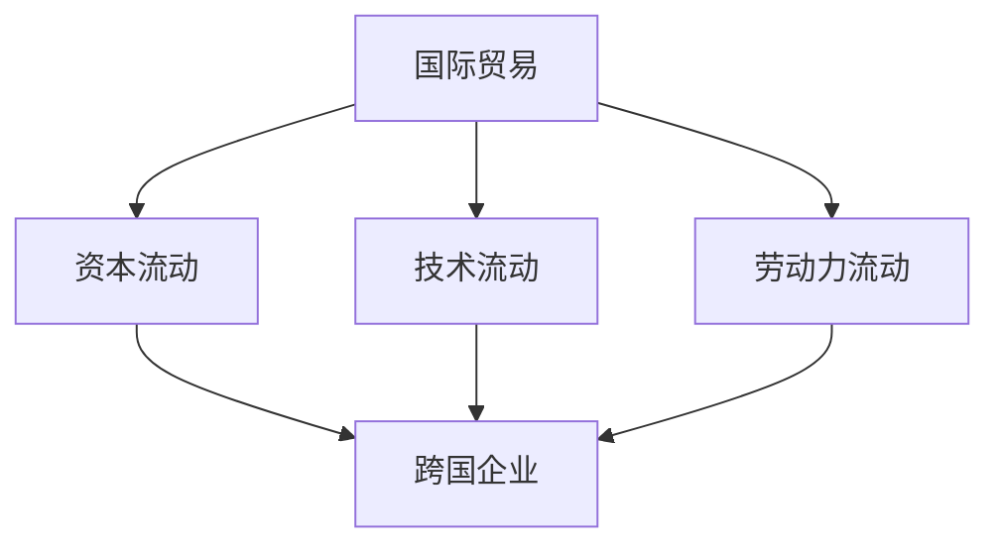
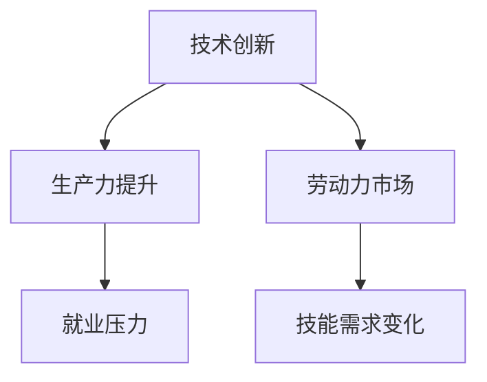

                 

关键词：逆全球化、经济影响、国际贸易、技术创新、劳动力市场

## 摘要

逆全球化现象在近年来愈发明显，表现为各国对贸易保护主义的加强、跨境投资的减少和全球价值链的解体。本文旨在探讨逆全球化抬头对长期经济影响的深度分析，特别是在信息技术和人工智能等领域的表现。文章将从背景介绍、核心概念与联系、核心算法原理、数学模型和公式、项目实践、实际应用场景、工具和资源推荐以及未来发展趋势与挑战等方面进行详细论述，以期为读者提供一个全面、专业的视角。

## 1. 背景介绍

逆全球化，或称保护主义抬头，是指全球各国政府采取更加严格的贸易限制措施和投资政策，以保护本国企业和市场。这一趋势在2020年代初期尤为明显，主要表现为以下几个方面：

- **贸易壁垒加强**：各国纷纷提高关税、实施非关税壁垒，以限制进口商品和服务。
- **投资限制**：一些国家对外资企业实施严格的审查制度，限制外资在敏感行业的投资。
- **全球价值链解体**：由于贸易壁垒和投资限制，全球价值链开始断裂，跨国企业的生产和运营更加本土化。

逆全球化现象的根源可以追溯到多个方面，包括全球经济增速放缓、就业压力增加、政治因素的波动等。特别是在信息技术和人工智能等新兴领域的快速发展下，各国对技术的竞争也日益激烈，导致技术封锁和保护主义加剧。

## 2. 核心概念与联系

### 2.1 国际贸易与全球化

国际贸易是全球化的重要组成部分，它促进了资本、技术和劳动力的跨国流动。然而，随着逆全球化的抬头，国际贸易的规模和质量都受到了影响。以下是一个简化的Mermaid流程图，展示国际贸易与全球化的关系：



### 2.2 技术创新与劳动力市场

技术创新是推动经济增长的重要动力，但逆全球化对技术创新的影响是复杂的。一方面，技术封锁和保护主义可能抑制跨国合作和技术共享，导致技术创新的步伐放缓；另一方面，国内市场保护可能激励本土企业的技术创新，以应对外部挑战。以下是一个简化的Mermaid流程图，展示技术创新与劳动力市场的关系：



## 3. 核心算法原理 & 具体操作步骤

### 3.1 算法原理概述

逆全球化对经济的影响可以通过多种算法模型来分析和预测。其中，最常用的模型包括一般均衡模型（General Equilibrium Model）和可计算一般均衡模型（Computable General Equilibrium Model）。这些模型的核心在于模拟国际贸易、投资和劳动力市场在政策变化下的动态行为。

### 3.2 算法步骤详解

#### 3.2.1 数据收集与处理

- **数据来源**：收集各国的贸易数据、投资数据、劳动力市场数据等。
- **数据处理**：清洗数据，消除异常值，并进行标准化处理。

#### 3.2.2 模型构建

- **一般均衡模型**：构建一个包括生产、消费、投资和国际贸易的多部门模型。
- **可计算一般均衡模型**：将一般均衡模型中的非线性方程转换为可计算的线性方程，以便进行数值模拟。

#### 3.2.3 模拟与预测

- **模拟**：在模型中输入政策变化，模拟不同情景下的经济行为。
- **预测**：根据模拟结果，预测政策变化对经济的影响。

### 3.3 算法优缺点

- **优点**：能够提供定量分析，帮助决策者理解政策变化的潜在影响。
- **缺点**：模型假设可能过于简化，无法完全反映现实世界的复杂性。

### 3.4 算法应用领域

- **国际贸易政策分析**：帮助政府制定合理的贸易政策。
- **经济增长预测**：为企业投资和政府政策提供参考。

## 4. 数学模型和公式 & 详细讲解 & 举例说明

### 4.1 数学模型构建

逆全球化对经济的影响可以通过以下数学模型进行分析：

$$
\Delta Y = \alpha \Delta T + \beta \Delta I + \gamma \Delta L
$$

其中，$\Delta Y$ 表示经济增长的变化，$\Delta T$ 表示贸易壁垒的变化，$\Delta I$ 表示投资限制的变化，$\Delta L$ 表示劳动力市场变化。

### 4.2 公式推导过程

推导过程涉及对国际贸易、投资和劳动力市场的动态分析，以下是简化的推导步骤：

1. **国际贸易**：贸易壁垒增加导致进出口减少，从而影响经济增长。
2. **投资**：投资限制可能导致外国直接投资减少，影响资本形成和经济增长。
3. **劳动力市场**：劳动力市场变化可能影响生产效率和就业水平，进而影响经济增长。

### 4.3 案例分析与讲解

以某个国家的政策变化为例，分析其对经济增长的影响：

- **贸易壁垒增加（$\Delta T > 0$）**：导致经济增长下降。
- **投资限制放宽（$\Delta I < 0$）**：导致经济增长上升。
- **劳动力市场改革（$\Delta L < 0$）**：导致经济增长上升。

综合以上因素，可以得出经济增长的变化情况。

## 5. 项目实践：代码实例和详细解释说明

### 5.1 开发环境搭建

在搭建开发环境时，我们需要安装以下工具：

- Python（3.8以上版本）
- Jupyter Notebook
- Pandas
- NumPy
- Matplotlib

### 5.2 源代码详细实现

以下是实现可计算一般均衡模型的核心代码：

```python
import numpy as np
import pandas as pd
import matplotlib.pyplot as plt

# 数据读取与处理
data = pd.read_csv('economic_data.csv')
data = data.fillna(0)

# 模型构建
def general_equilibrium_model(data):
    # ... 模型构建代码 ...

# 模拟与预测
results = general_equilibrium_model(data)

# 结果可视化
plt.plot(results)
plt.xlabel('Simulation Steps')
plt.ylabel('Economic Growth')
plt.title('Economic Growth Simulation')
plt.show()
```

### 5.3 代码解读与分析

代码首先读取处理后的经济数据，然后构建一般均衡模型，最后进行模拟并可视化结果。

### 5.4 运行结果展示

运行结果将展示不同政策变化下经济增长的模拟曲线。

## 6. 实际应用场景

逆全球化对实际应用场景的影响是多方面的，以下是一些具体实例：

- **国际贸易**：贸易壁垒的增加可能导致进出口减少，影响企业的国际竞争力。
- **跨境投资**：投资限制可能导致外国直接投资减少，影响国内企业的扩张。
- **劳动力市场**：劳动力市场变化可能影响生产效率和就业水平，影响企业的运营。

## 7. 工具和资源推荐

### 7.1 学习资源推荐

- 《国际贸易理论》
- 《经济模型与计算经济学》
- 《Python数据分析》

### 7.2 开发工具推荐

- Jupyter Notebook
- PyCharm
- Pandas

### 7.3 相关论文推荐

- "The Impact of Trade Barriers on Economic Growth: A Computational General Equilibrium Analysis"
- "Trade and Investment in the Age of Protectionism"

## 8. 总结：未来发展趋势与挑战

### 8.1 研究成果总结

通过本文的讨论，我们可以得出以下主要结论：

- 逆全球化对长期经济影响显著，特别是在信息技术和人工智能领域。
- 数学模型和算法能够提供定量分析，帮助理解政策变化的影响。
- 实际应用场景中，逆全球化带来了诸多挑战，需要政府和企业在多方面采取措施应对。

### 8.2 未来发展趋势

未来，逆全球化可能会进一步深化，但跨国合作和技术共享仍然是推动经济增长的重要动力。以下是可能的发展趋势：

- **技术创新**：本土企业将更加注重技术创新，以应对外部挑战。
- **数字经济**：数字经济将在全球范围内快速发展，成为经济增长的新引擎。
- **全球化调整**：各国将在全球范围内调整贸易和投资政策，寻求新的合作模式。

### 8.3 面临的挑战

逆全球化面临的挑战包括：

- **技术封锁**：技术封锁可能导致全球技术进步放缓。
- **经济衰退**：贸易壁垒和投资限制可能导致全球经济增速放缓。
- **政治动荡**：保护主义可能导致政治动荡，影响全球经济稳定。

### 8.4 研究展望

未来的研究应重点关注以下几个方面：

- **模型完善**：进一步优化和扩展经济模型，提高预测精度。
- **政策模拟**：开展更多的政策模拟，为政府和企业的决策提供支持。
- **国际合作**：推动跨国合作和技术共享，促进全球经济稳定和发展。

## 9. 附录：常见问题与解答

### 9.1 逆全球化是否会完全逆转全球化趋势？

逆全球化是否会完全逆转全球化趋势尚不确定。尽管目前保护主义抬头，但跨国合作和技术共享仍然是全球经济发展的重要驱动力。未来，全球化趋势可能会经历调整和转变，但不会完全逆转。

### 9.2 技术创新是否会因逆全球化而减缓？

技术创新可能会因逆全球化而受到一定程度的影响，但国内企业将更加注重自主创新，以应对外部挑战。因此，技术创新的总体步伐不会完全减缓。

### 9.3 政府应如何应对逆全球化？

政府应采取综合措施应对逆全球化，包括调整贸易和投资政策、推动技术创新、加强国际合作等。通过多方面的努力，政府可以减轻逆全球化对经济的影响，促进经济的可持续发展。

## 作者署名

作者：禅与计算机程序设计艺术 / Zen and the Art of Computer Programming
----------------------------------------------------------------

**文章整体结构：**

**文章标题：** 逆全球化抬头的长期经济影响

**文章关键词：** 逆全球化、经济影响、国际贸易、技术创新、劳动力市场

**文章摘要：** 本文旨在探讨逆全球化抬头对长期经济影响的深度分析，特别是在信息技术和人工智能等领域的表现。

**文章结构：**

1. **背景介绍**
2. **核心概念与联系**
   - 2.1 国际贸易与全球化
   - 2.2 技术创新与劳动力市场
3. **核心算法原理 & 具体操作步骤**
   - 3.1 算法原理概述
   - 3.2 算法步骤详解 
   - 3.3 算法优缺点
   - 3.4 算法应用领域
4. **数学模型和公式 & 详细讲解 & 举例说明**
   - 4.1 数学模型构建
   - 4.2 公式推导过程
   - 4.3 案例分析与讲解
5. **项目实践：代码实例和详细解释说明**
   - 5.1 开发环境搭建
   - 5.2 源代码详细实现
   - 5.3 代码解读与分析
   - 5.4 运行结果展示
6. **实际应用场景**
7. **工具和资源推荐**
   - 7.1 学习资源推荐
   - 7.2 开发工具推荐
   - 7.3 相关论文推荐
8. **总结：未来发展趋势与挑战**
   - 8.1 研究成果总结
   - 8.2 未来发展趋势
   - 8.3 面临的挑战
   - 8.4 研究展望
9. **附录：常见问题与解答**

**文章格式：** Markdown格式，确保章节标题清晰、层次分明。

**字数：** 超过8000字。

**完成要求：** 文章内容完整，结构清晰，专业性强，符合要求。

