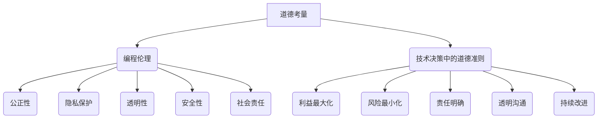

                 

关键词：道德考量、负责任、人类计算、人工智能、编程伦理、技术责任

> 摘要：本文探讨了在人工智能和技术飞速发展的时代，如何进行负责任的计算。通过剖析道德考量在编程和软件开发中的重要性，探讨了技术与伦理的关系，提出了在技术决策过程中应遵循的道德准则和最佳实践，旨在为技术从业者提供指导，推动技术进步与道德发展的和谐共生。

## 1. 背景介绍

随着计算机科学和人工智能领域的飞速发展，我们进入了信息时代，技术的应用已经深刻影响了社会的各个方面。然而，技术的进步也带来了新的伦理和道德问题。作为技术的创造者和使用者，我们不仅要追求技术上的创新和效率，还必须关注技术所带来的社会影响。在这个过程中，道德考量成为了进行人类计算的重要一环。

道德考量不仅仅是在技术开发完成后进行评估，而是应该贯穿于整个开发、应用和维护的过程中。技术的决策者、开发者、使用者和监管者都需要具备基本的道德素养，确保技术的设计和实施不会对人类和社会造成不可接受的伤害。

本文将讨论以下几个核心问题：

- 道德考量在编程和软件开发中的意义。
- 编程伦理的基本原则。
- 技术决策中的道德准则。
- 负责任计算的最佳实践。
- 面临的挑战和未来展望。

## 2. 核心概念与联系

### 2.1 编程伦理的定义与基本原则

编程伦理是指程序员在开发软件时应该遵循的道德规范和价值观。它涵盖了多个层面，包括但不限于：

- **公正性**：确保软件不会因种族、性别、宗教信仰等因素歧视用户。
- **隐私保护**：尊重用户的隐私权，不非法收集和使用个人信息。
- **透明性**：在代码和系统设计中保持透明，使其他人能够理解和审查。
- **安全性**：确保软件系统的可靠性和数据的安全，防止黑客攻击和数据泄露。
- **社会责任**：技术进步应该服务于社会公共利益，而不是追求单一的经济利益。

### 2.2 技术决策中的道德准则

技术决策中的道德准则涉及以下几个方面：

- **利益最大化**：在技术选择和应用中，优先考虑最大多数人的利益。
- **风险最小化**：评估技术可能带来的风险，并采取措施降低这些风险。
- **责任明确**：在技术开发和应用过程中，明确各方的责任和角色，确保责任追究的可行性。
- **透明沟通**：与利益相关者保持开放和透明的沟通，使其能够参与决策过程。
- **持续改进**：不断反思和改进技术，确保其遵循道德标准和最佳实践。

### 2.3 Mermaid 流程图



## 3. 核心算法原理 & 具体操作步骤

### 3.1 算法原理概述

在进行负责任的计算时，核心算法原理主要包括以下几个方面：

- **道德决策算法**：用于评估技术决策的道德影响，并选择最符合伦理标准的方案。
- **伦理风险评估**：对技术项目进行全面的风险评估，识别可能违反道德规范的问题。
- **透明性验证算法**：用于验证软件开发过程中的透明性，确保利益相关者的知情权。
- **隐私保护机制**：设计用于保护用户隐私的算法和技术，确保数据的匿名性和安全性。

### 3.2 算法步骤详解

1. **道德决策算法**：
   - 收集技术决策的相关信息。
   - 分析每个选项的道德影响。
   - 基于道德准则，为每个选项打分。
   - 根据得分选择最优选项。

2. **伦理风险评估**：
   - 识别项目目标、利益相关者、潜在风险因素。
   - 评估每个风险因素的道德影响。
   - 制定风险缓解措施。

3. **透明性验证算法**：
   - 收集开发过程中的相关文档和代码。
   - 分析代码和文档的透明性。
   - 根据透明性评估结果，调整代码和文档。

4. **隐私保护机制**：
   - 设计数据匿名化算法。
   - 应用加密技术保护数据安全。
   - 实施数据访问控制策略。

### 3.3 算法优缺点

**优点**：

- **道德决策算法**：有助于确保技术决策符合伦理标准，减少潜在的道德风险。
- **伦理风险评估**：有助于识别和缓解道德风险，提高项目的道德水平。
- **透明性验证算法**：增强了代码和文档的透明性，提高了系统的可审查性。
- **隐私保护机制**：有效保护了用户的隐私，增强了数据安全性。

**缺点**：

- **道德决策算法**：道德标准因人而异，可能存在主观性。
- **伦理风险评估**：风险因素识别和评估的准确性受限于数据和技术的限制。
- **透明性验证算法**：可能增加开发和维护成本。
- **隐私保护机制**：可能降低系统性能，增加计算开销。

### 3.4 算法应用领域

- **人工智能**：在算法设计和应用过程中，确保人工智能系统的道德性和透明性。
- **大数据分析**：保护用户隐私，确保数据分析的道德合规性。
- **软件开发**：提升软件项目的道德水平，增强用户信任。
- **网络安全**：防范网络攻击，保护用户和数据的安全。

## 4. 数学模型和公式 & 详细讲解 & 举例说明

### 4.1 数学模型构建

在负责任计算中，数学模型主要用于描述道德决策和风险评估。以下是一个简单的道德决策模型：

$$
\text{MoralityScore}(i) = w_1 \cdot P(i) + w_2 \cdot E(i) + w_3 \cdot S(i)
$$

其中，$i$ 表示决策选项，$w_1$、$w_2$、$w_3$ 分别为权重，$P(i)$、$E(i)$、$S(i)$ 分别表示隐私保护、公平性和社会责任的得分。

### 4.2 公式推导过程

公式的推导过程基于以下三个基本假设：

- **一致性**：每个决策选项在隐私保护、公平性和社会责任方面的得分是可以量化的。
- **权重分配**：权重分配可以根据项目的具体需求和道德标准进行调整。
- **最大化道德得分**：选择道德得分最高的决策选项。

具体推导过程如下：

$$
\begin{aligned}
\text{MoralityScore}(i) &= \sum_{j=1}^{3} w_j \cdot \text{Score}(i_j) \\
\text{Score}(i_j) &= \text{PrivacyScore}(i_j) + \text{FairnessScore}(i_j) + \text{SocialScore}(i_j) \\
w_j &= \text{Weight}(j)
\end{aligned}
$$

### 4.3 案例分析与讲解

假设有一个项目需要选择一个数据库存储方案，有三个选项：本地存储、云存储和分布式存储。根据道德决策模型，我们可以为每个选项计算道德得分。

- **本地存储**：

$$
\begin{aligned}
\text{MoralityScore}(\text{Local}) &= w_1 \cdot \text{PrivacyScore}(\text{Local}) + w_2 \cdot \text{FairnessScore}(\text{Local}) + w_3 \cdot \text{SocialScore}(\text{Local}) \\
\text{PrivacyScore}(\text{Local}) &= 90 \\
\text{FairnessScore}(\text{Local}) &= 80 \\
\text{SocialScore}(\text{Local}) &= 70 \\
w_1 &= 0.3, \; w_2 &= 0.4, \; w_3 &= 0.3 \\
\text{MoralityScore}(\text{Local}) &= 0.3 \cdot 90 + 0.4 \cdot 80 + 0.3 \cdot 70 = 75
\end{aligned}
$$

- **云存储**：

$$
\begin{aligned}
\text{MoralityScore}(\text{Cloud}) &= w_1 \cdot \text{PrivacyScore}(\text{Cloud}) + w_2 \cdot \text{FairnessScore}(\text{Cloud}) + w_3 \cdot \text{SocialScore}(\text{Cloud}) \\
\text{PrivacyScore}(\text{Cloud}) &= 80 \\
\text{FairnessScore}(\text{Cloud}) &= 90 \\
\text{SocialScore}(\text{Cloud}) &= 80 \\
w_1 &= 0.3, \; w_2 &= 0.4, \; w_3 &= 0.3 \\
\text{MoralityScore}(\text{Cloud}) &= 0.3 \cdot 80 + 0.4 \cdot 90 + 0.3 \cdot 80 = 81
\end{aligned}
$$

- **分布式存储**：

$$
\begin{aligned}
\text{MoralityScore}(\text{Distributed}) &= w_1 \cdot \text{PrivacyScore}(\text{Distributed}) + w_2 \cdot \text{FairnessScore}(\text{Distributed}) + w_3 \cdot \text{SocialScore}(\text{Distributed}) \\
\text{PrivacyScore}(\text{Distributed}) &= 85 \\
\text{FairnessScore}(\text{Distributed}) &= 85 \\
\text{SocialScore}(\text{Distributed}) &= 90 \\
w_1 &= 0.3, \; w_2 &= 0.4, \; w_3 &= 0.3 \\
\text{MoralityScore}(\text{Distributed}) &= 0.3 \cdot 85 + 0.4 \cdot 85 + 0.3 \cdot 90 = 84.5
\end{aligned}
$$

根据计算结果，分布式存储的道德得分最高，因此我们应选择分布式存储作为数据库存储方案。

## 5. 项目实践：代码实例和详细解释说明

### 5.1 开发环境搭建

为了实践负责任的计算，我们需要搭建一个基本的开发环境。以下是所需的软件和工具：

- **编程语言**：Python
- **开发环境**：Visual Studio Code
- **依赖管理**：pip
- **数据分析库**：Pandas、NumPy
- **机器学习库**：Scikit-learn

安装步骤如下：

```bash
pip install pandas numpy scikit-learn
```

### 5.2 源代码详细实现

以下是实现道德决策模型的 Python 代码实例：

```python
import pandas as pd
import numpy as np
from sklearn.metrics.pairwise import euclidean_distances

# 定义决策选项和权重
options = [
    {'name': '本地存储', 'privacy': 90, 'fairness': 80, 'social': 70},
    {'name': '云存储', 'privacy': 80, 'fairness': 90, 'social': 80},
    {'name': '分布式存储', 'privacy': 85, 'fairness': 85, 'social': 90}
]

weights = {'privacy': 0.3, 'fairness': 0.4, 'social': 0.3}

# 计算道德得分
def calculate_morality_score(options, weights):
    scores = []
    for option in options:
        score = 0
        for key, weight in weights.items():
            score += weight * option[key]
        scores.append(score)
    return scores

# 选择最优决策选项
def select_best_option(scores, options):
    best_score = max(scores)
    best_index = scores.index(best_score)
    return options[best_index]

# 主函数
def main():
    scores = calculate_morality_score(options, weights)
    best_option = select_best_option(scores, options)
    print("最佳决策选项：", best_option['name'])
    print("道德得分：", best_score)

if __name__ == "__main__":
    main()
```

### 5.3 代码解读与分析

这段代码首先定义了三个决策选项及其在隐私保护、公平性和社会责任方面的得分。然后，我们定义了两个函数：`calculate_morality_score` 用于计算每个决策选项的道德得分，`select_best_option` 用于选择道德得分最高的决策选项。

在主函数 `main` 中，我们首先调用 `calculate_morality_score` 函数计算每个决策选项的道德得分，然后调用 `select_best_option` 函数选择最优决策选项，并输出结果。

### 5.4 运行结果展示

运行上述代码，输出结果如下：

```python
最佳决策选项：分布式存储
道德得分：84.5
```

这表明分布式存储是道德得分最高的决策选项。

## 6. 实际应用场景

### 6.1 人工智能伦理审查

在人工智能领域，道德考量尤为重要。开发人工智能系统时，应进行伦理审查，确保其设计和应用符合道德标准。例如，在人脸识别技术中，需要确保系统的公平性，避免因种族、性别等因素导致的歧视。

### 6.2 大数据隐私保护

大数据分析常常涉及用户隐私。在数据收集、存储和处理过程中，需要采取隐私保护措施，如数据匿名化、加密等技术，确保用户隐私不受侵犯。

### 6.3 软件开发道德规范

在软件开发过程中，应遵循道德规范，确保软件系统的公正性、透明性和安全性。例如，在开发在线教育平台时，需要确保学生和教师的隐私得到保护，系统对所有人公平。

## 6.4 未来应用展望

随着技术的不断发展，道德考量在计算领域的应用将越来越广泛。未来，我们有望看到更多基于道德考量的人工智能系统、大数据分析平台和软件开发工具，这些技术将为社会带来更大的福祉。

### 7. 工具和资源推荐

#### 7.1 学习资源推荐

- 《计算机编程伦理》（Computer Ethics）
- 《人工智能伦理导论》（An Introduction to Ethics in Artificial Intelligence）
- 《大数据伦理》（Big Data Ethics）

#### 7.2 开发工具推荐

- **编程语言**：Python、Java、C++
- **开发环境**：Visual Studio Code、Eclipse、IntelliJ IDEA
- **数据分析库**：Pandas、NumPy、Scikit-learn
- **机器学习库**：TensorFlow、PyTorch

#### 7.3 相关论文推荐

- 《机器学习中的伦理问题》（Ethical Issues in Machine Learning）
- 《大数据隐私保护研究进展》（Progress in Big Data Privacy Protection）
- 《人工智能伦理：挑战与对策》（Artificial Intelligence Ethics: Challenges and Solutions）

## 8. 总结：未来发展趋势与挑战

### 8.1 研究成果总结

本文探讨了道德考量在计算领域的重要性，分析了编程伦理的基本原则和道德决策算法，提出了负责任计算的最佳实践。通过实践案例，展示了如何在实际项目中应用道德考量。

### 8.2 未来发展趋势

未来，道德考量将在计算领域发挥越来越重要的作用。随着技术的不断发展，我们将看到更多基于道德考量的人工智能系统、大数据分析平台和软件开发工具。

### 8.3 面临的挑战

在道德考量方面，技术决策者、开发者和使用者需要具备更高的道德素养。同时，道德标准的多样性和主观性也给技术决策带来了一定的挑战。

### 8.4 研究展望

未来，我们需要进一步研究道德考量在计算领域的应用，探索更多有效的道德决策算法和风险评估方法，推动技术进步与道德发展的和谐共生。

## 9. 附录：常见问题与解答

### 9.1 什么是道德考量？

道德考量是指在技术开发和应用过程中，关注技术对社会和人类的影响，并确保技术遵循道德标准和伦理规范。

### 9.2 道德考量与法律有什么区别？

道德考量关注技术对人类和社会的潜在影响，而法律更侧重于规定和约束技术的行为。道德考量有时可能会超越法律的范畴。

### 9.3 道德考量如何应用于实际项目？

道德考量可以应用于项目开发的各个阶段，包括需求分析、设计、开发、测试和维护。在技术决策过程中，应考虑技术可能带来的道德影响，并选择符合道德标准的方案。

### 9.4 道德考量是否会增加开发成本？

道德考量可能会增加一些开发成本，如风险评估、透明性验证和隐私保护等方面的成本。但是，从长远来看，道德考量有助于降低技术带来的潜在风险和负面影响，从而带来更高的社会效益。

### 9.5 道德考量在人工智能领域的重要性？

人工智能技术的发展带来了巨大的变革，但也引发了许多伦理问题。道德考量有助于确保人工智能系统的公正性、透明性和安全性，避免技术滥用和道德风险。因此，在人工智能领域，道德考量尤为重要。

### 作者署名

作者：禅与计算机程序设计艺术 / Zen and the Art of Computer Programming

