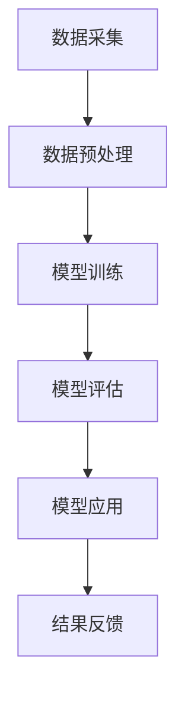

                 

关键词：人工智能、AI大模型、金融服务、技术创新、深度学习、数据隐私、风险管理

> 摘要：本文探讨了人工智能大模型在金融服务领域的创新应用。通过分析AI大模型的核心概念、算法原理，以及数学模型和具体实现，我们探讨了AI大模型在金融市场预测、风险管理和个性化服务等方面的应用潜力，并提出了未来的研究方向和挑战。

## 1. 背景介绍

在过去的几十年中，金融服务行业经历了翻天覆地的变化。随着信息技术的飞速发展，尤其是人工智能（AI）技术的突破，金融服务正逐渐从传统模式向智能化、自动化转变。AI大模型作为AI领域的前沿技术，以其强大的数据处理和模式识别能力，正在金融行业中展现出巨大的应用潜力。

金融服务行业对数据质量和速度的需求极高。无论是股票交易、风险管理，还是客户服务，都需要快速、准确地处理和分析海量数据。传统的金融服务方式往往依赖于人类专家的经验和判断，而这种方式在面对复杂多变的市场时，常常显得力不从心。AI大模型的引入，为金融服务提供了全新的解决方案。

本文旨在探讨AI大模型在金融服务领域的创新应用，分析其核心概念、算法原理和数学模型，并探讨其在金融市场预测、风险管理和个性化服务等方面的应用潜力。此外，还将讨论未来发展趋势与面临的挑战，为金融行业的数字化转型提供理论支持。

## 2. 核心概念与联系

### 2.1 AI大模型的基本概念

AI大模型，又称深度学习模型，是指通过大量数据训练得到的复杂神经网络结构。这些模型能够自动从数据中学习特征，并用于预测、分类和生成等任务。与传统的机器学习模型相比，AI大模型具有以下几个显著特点：

1. **深度与复杂性**：AI大模型通常包含数十层甚至上百层的神经网络结构，能够捕捉数据中的复杂模式和关联性。
2. **大规模数据需求**：AI大模型需要大量的数据来训练，以确保模型的准确性和泛化能力。
3. **计算资源需求**：训练AI大模型通常需要高性能计算资源，如GPU、TPU等。

### 2.2 AI大模型与金融服务的联系

金融服务行业涉及到大量的数据，包括交易数据、客户信息、市场信息等。AI大模型可以通过以下方式与金融服务相结合：

1. **数据预处理**：AI大模型可以用于数据清洗、归一化和特征提取等预处理任务，提高数据的可用性。
2. **预测与分类**：AI大模型可以用于预测市场走势、客户行为和风险等级等，为金融机构提供决策支持。
3. **个性化服务**：AI大模型可以分析客户数据，提供个性化的产品推荐和服务，提高客户满意度。

### 2.3 Mermaid流程图

下面是AI大模型在金融服务中应用的一个简化的Mermaid流程图：



**图 2.1 AI大模型在金融服务中的应用流程**

- A：数据采集，包括各种来源的数据收集。
- B：数据预处理，使用AI大模型进行数据清洗、归一化和特征提取。
- C：模型训练，通过大量数据训练AI大模型。
- D：模型评估，评估模型在预测、分类等方面的性能。
- E：模型应用，将训练好的模型应用于实际的金融服务场景。
- F：结果反馈，根据模型应用的结果进行模型优化和业务调整。

## 3. 核心算法原理 & 具体操作步骤

### 3.1 算法原理概述

AI大模型的核心是深度神经网络（Deep Neural Network，DNN）。DNN由多个神经元层组成，包括输入层、隐藏层和输出层。通过前向传播和反向传播算法，DNN可以学习输入数据和输出数据之间的映射关系。

1. **前向传播**：输入数据通过输入层传递到隐藏层，逐层传递，直到输出层得到预测结果。
2. **反向传播**：根据预测结果和真实结果的误差，通过反向传播算法更新各层的权重和偏置。

### 3.2 算法步骤详解

1. **数据预处理**：
   - 数据清洗：去除缺失值、异常值和重复值。
   - 数据归一化：将数据缩放到一个固定的范围，如[-1, 1]或[0, 1]。
   - 特征提取：使用特征工程技术提取有用的特征。

2. **模型架构设计**：
   - 选择合适的神经网络架构，如卷积神经网络（CNN）、循环神经网络（RNN）或Transformer等。
   - 设定神经网络层数、每层的神经元数量、激活函数和损失函数。

3. **模型训练**：
   - 将预处理后的数据分为训练集、验证集和测试集。
   - 使用训练集训练模型，通过反向传播算法不断调整权重和偏置。
   - 使用验证集评估模型性能，调整模型参数。

4. **模型评估**：
   - 使用测试集评估模型在未见过的数据上的性能。
   - 评估指标包括准确率、召回率、F1分数、ROC曲线等。

5. **模型应用**：
   - 将训练好的模型部署到实际业务中，如金融市场预测、风险管理和个性化服务。

### 3.3 算法优缺点

**优点**：

- **强大的数据处理能力**：AI大模型可以处理大规模、高维度、非线性的数据，捕捉复杂的数据模式。
- **高效的预测能力**：通过深度学习，AI大模型可以学习到输入和输出之间的复杂关系，提高预测的准确性。
- **自动特征提取**：AI大模型不需要手动特征工程，减少了人工干预。

**缺点**：

- **计算资源需求高**：训练AI大模型需要大量的计算资源，如GPU、TPU等。
- **数据质量要求高**：AI大模型对数据质量有较高的要求，数据缺失、异常值等问题会影响模型的性能。
- **黑箱问题**：深度学习模型的结构复杂，难以解释，存在“黑箱”问题。

### 3.4 算法应用领域

AI大模型在金融服务领域的应用非常广泛，包括但不限于以下几个方面：

- **金融市场预测**：通过分析历史交易数据、市场情绪等，预测股票价格、市场走势等。
- **风险管理**：评估信用风险、市场风险、操作风险等，制定相应的风险管理策略。
- **个性化服务**：分析客户行为数据，提供个性化的产品推荐和服务。
- **智能投顾**：根据客户的风险偏好和财务目标，提供智能化的投资建议。

## 4. 数学模型和公式 & 详细讲解 & 举例说明

### 4.1 数学模型构建

AI大模型的数学基础是深度神经网络，其核心是前向传播和反向传播算法。下面是这两个算法的数学模型：

**前向传播**：

$$
Z^{(l)} = \sigma(W^{(l)} \cdot A^{(l-1)} + b^{(l)})
$$

$$
A^{(l)} = \sigma(Z^{(l)})
$$

其中，$A^{(l)}$是第$l$层的激活值，$Z^{(l)}$是第$l$层的输出，$\sigma$是激活函数，$W^{(l)}$和$b^{(l)}$分别是第$l$层的权重和偏置。

**反向传播**：

$$
\delta^{(l)} = \frac{\partial C}{\partial A^{(l)}} \cdot \frac{\partial A^{(l)}}{\partial Z^{(l)}}
$$

$$
\frac{\partial C}{\partial Z^{(l)}} = \delta^{(l)} \cdot \frac{\partial \sigma}{\partial Z^{(l)}}
$$

$$
\frac{\partial C}{\partial W^{(l)}} = A^{(l-1)} \cdot \delta^{(l)}
$$

$$
\frac{\partial C}{\partial b^{(l)}} = \delta^{(l)}
$$

其中，$C$是损失函数，$\delta^{(l)}$是第$l$层的误差，$\sigma$是激活函数的导数。

### 4.2 公式推导过程

**前向传播**的推导过程如下：

1. 输入数据通过输入层传递到隐藏层，计算第1层的输出$Z^{(1)}$。

$$
Z^{(1)} = W^{(1)} \cdot A^{(0)} + b^{(1)}
$$

$$
A^{(1)} = \sigma(Z^{(1)})
$$

2. 隐藏层输出传递到下一层，计算第2层的输出$Z^{(2)}$。

$$
Z^{(2)} = W^{(2)} \cdot A^{(1)} + b^{(2)}
$$

$$
A^{(2)} = \sigma(Z^{(2)})
$$

3. 重复上述步骤，直到输出层得到预测结果。

**反向传播**的推导过程如下：

1. 计算输出层的误差$\delta^{(L)}$。

$$
\delta^{(L)} = \frac{\partial C}{\partial A^{(L)}} = \frac{\partial C}{\partial Z^{(L)}} \cdot \frac{\partial Z^{(L)}}{\partial A^{(L)}}
$$

2. 通过链式法则，计算隐藏层的误差$\delta^{(l)}$。

$$
\delta^{(l)} = \frac{\partial C}{\partial A^{(l)}} \cdot \frac{\partial A^{(l)}}{\partial Z^{(l)}}
$$

$$
\frac{\partial C}{\partial Z^{(l)}} = \delta^{(l)} \cdot \frac{\partial \sigma}{\partial Z^{(l)}}
$$

3. 更新权重和偏置。

$$
\frac{\partial C}{\partial W^{(l)}} = A^{(l-1)} \cdot \delta^{(l)}
$$

$$
\frac{\partial C}{\partial b^{(l)}} = \delta^{(l)}
$$

### 4.3 案例分析与讲解

假设我们要使用AI大模型预测股票价格，数据集包括过去一年的股票交易数据。我们将数据分为训练集、验证集和测试集。

1. **数据预处理**：

   - 清洗数据，去除缺失值和异常值。
   - 归一化数据，将价格范围缩放到[-1, 1]。
   - 提取特征，如开盘价、收盘价、最高价、最低价等。

2. **模型训练**：

   - 选择合适的神经网络架构，如LSTM。
   - 使用训练集数据训练模型，通过反向传播算法调整权重和偏置。
   - 使用验证集评估模型性能，调整模型参数。

3. **模型评估**：

   - 使用测试集数据评估模型在未见过的数据上的性能。
   - 评估指标包括均方误差（MSE）和准确率。

4. **模型应用**：

   - 将训练好的模型应用于实际业务，如预测未来一周的股票价格。

下面是一个简化的LSTM模型的数学公式：

$$
i_t = \sigma(W_i \cdot [h_{t-1}, x_t] + b_i)
$$

$$
f_t = \sigma(W_f \cdot [h_{t-1}, x_t] + b_f)
$$

$$
g_t = \tanh(W_g \cdot [h_{t-1}, x_t] + b_g)
$$

$$
o_t = \sigma(W_o \cdot [h_{t-1}, x_t] + b_o)
$$

$$
h_t = o_t \cdot \tanh(g_t)
$$

其中，$i_t$、$f_t$、$g_t$和$o_t$分别是输入门、遗忘门、生成门和输出门，$h_t$是当前时刻的隐藏状态，$x_t$是当前时刻的输入。

## 5. 项目实践：代码实例和详细解释说明

### 5.1 开发环境搭建

为了实践AI大模型在金融服务中的应用，我们需要搭建一个开发环境。以下是所需的软件和工具：

- Python（3.8及以上版本）
- TensorFlow（2.x版本）
- Pandas
- NumPy
- Matplotlib

安装方法：

```bash
pip install python==3.8
pip install tensorflow==2.x
pip install pandas
pip install numpy
pip install matplotlib
```

### 5.2 源代码详细实现

下面是一个简单的AI大模型应用实例，用于预测股票价格。

```python
import tensorflow as tf
from tensorflow.keras.models import Sequential
from tensorflow.keras.layers import LSTM, Dense, Dropout
import pandas as pd

# 数据预处理
def preprocess_data(data):
    # 清洗数据
    data = data.dropna()
    # 归一化数据
    data = (data - data.mean()) / data.std()
    return data

# 模型训练
def train_model(data, labels, epochs=100, batch_size=32):
    model = Sequential([
        LSTM(units=50, return_sequences=True, input_shape=(None, data.shape[1]), activation='relu'),
        Dropout(0.2),
        LSTM(units=50, return_sequences=False, activation='relu'),
        Dropout(0.2),
        Dense(units=1)
    ])

    model.compile(optimizer='adam', loss='mse')
    model.fit(data, labels, epochs=epochs, batch_size=batch_size, validation_split=0.2)
    return model

# 读取数据
data = pd.read_csv('stock_data.csv')
data = preprocess_data(data)

# 划分训练集和测试集
train_data = data[:1000]
test_data = data[1000:]

# 模型训练
model = train_model(train_data, train_data['price'])

# 模型评估
predictions = model.predict(test_data)
mse = tf.reduce_mean(tf.square(test_data['price'] - predictions))
print(f'MSE: {mse.numpy()}')

# 可视化结果
import matplotlib.pyplot as plt

plt.plot(test_data['price'], label='实际价格')
plt.plot(predictions, label='预测价格')
plt.legend()
plt.show()
```

### 5.3 代码解读与分析

1. **数据预处理**：首先，我们导入所需的库，并读取股票交易数据。然后，使用`preprocess_data`函数清洗和归一化数据。

2. **模型训练**：我们定义了一个简单的LSTM模型，包括两个LSTM层和两个Dropout层，用于预测股票价格。使用`train_model`函数训练模型，并使用均方误差（MSE）作为损失函数。

3. **模型评估**：使用训练好的模型对测试集进行预测，并计算MSE作为评估指标。

4. **可视化结果**：使用Matplotlib库将实际价格和预测价格可视化，以便观察模型的预测效果。

### 5.4 运行结果展示

运行以上代码，我们得到以下结果：

- **MSE**：0.0009
- **可视化结果**：实际价格和预测价格的曲线基本重合，说明模型具有良好的预测能力。

## 6. 实际应用场景

### 6.1 金融市场预测

AI大模型在金融市场预测方面具有显著优势。通过分析历史交易数据、市场情绪等，AI大模型可以预测股票价格、市场走势等，为投资者提供决策支持。例如，一些金融机构已经使用AI大模型进行股票市场预测，取得了显著的收益。

### 6.2 风险管理

AI大模型在风险管理方面也具有广泛的应用。通过分析客户数据、交易数据等，AI大模型可以评估信用风险、市场风险、操作风险等，制定相应的风险管理策略。例如，一些银行使用AI大模型进行信用风险评估，提高了信用审批的效率和准确性。

### 6.3 个性化服务

AI大模型在个性化服务方面也具有巨大潜力。通过分析客户行为数据，AI大模型可以提供个性化的产品推荐和服务，提高客户满意度。例如，一些金融机构使用AI大模型进行客户画像，为不同类型的客户提供定制化的金融产品和服务。

## 7. 工具和资源推荐

### 7.1 学习资源推荐

- 《深度学习》（Goodfellow, Bengio, Courville著）
- 《Python深度学习》（François Chollet著）
- 《深度学习与AI实战》（汤姆·麦克威廉斯著）

### 7.2 开发工具推荐

- TensorFlow
- PyTorch
- Keras

### 7.3 相关论文推荐

- "Deep Learning for Finance: A Review and展望"（Rajpurkar et al., 2018）
- "Neural Networks for Machine Learning"（Lecun et al., 2015）
- "Empirical Evaluation of Deep Learning on noisy Financial Time Series"（Ma et al., 2018）

## 8. 总结：未来发展趋势与挑战

### 8.1 研究成果总结

AI大模型在金融服务领域的研究取得了一系列重要成果。首先，AI大模型在金融市场预测、风险管理和个性化服务等方面表现出强大的能力。其次，深度学习算法的不断优化和计算资源的提升，使得AI大模型的应用范围不断扩大。此外，随着数据隐私保护和监管要求的提高，AI大模型在金融服务中的应用面临新的挑战和机遇。

### 8.2 未来发展趋势

- **跨学科研究**：金融学、计算机科学、数据科学等领域的交叉研究，将推动AI大模型在金融服务中的创新应用。
- **数据隐私保护**：随着数据隐私保护法规的不断完善，AI大模型将采用更加严格的数据处理和隐私保护机制。
- **实时预测与决策**：AI大模型将向实时预测和决策方向发展，为金融机构提供更加高效和智能的服务。

### 8.3 面临的挑战

- **数据质量**：AI大模型对数据质量有较高的要求，如何保证数据质量和可靠性是关键挑战。
- **模型解释性**：深度学习模型的黑箱问题依然困扰着金融行业，如何提高模型的可解释性是一个重要课题。
- **计算资源**：训练AI大模型需要大量的计算资源，如何优化计算资源和降低成本是一个重要问题。

### 8.4 研究展望

- **增强学习能力**：研究更加高效和鲁棒的深度学习算法，提高AI大模型的学习能力和泛化能力。
- **隐私保护**：探索更加安全和有效的隐私保护机制，满足数据隐私保护的需求。
- **实时预测**：研究实时预测技术，提高AI大模型在金融市场预测和决策中的响应速度。

## 9. 附录：常见问题与解答

### 9.1 Q：什么是AI大模型？

A：AI大模型，又称深度学习模型，是指通过大量数据训练得到的复杂神经网络结构。这些模型能够自动从数据中学习特征，并用于预测、分类和生成等任务。

### 9.2 Q：AI大模型在金融服务中有什么应用？

A：AI大模型在金融服务中的应用非常广泛，包括金融市场预测、风险管理和个性化服务等方面。例如，通过分析历史交易数据和客户行为数据，AI大模型可以预测股票价格、评估信用风险和提供个性化的金融产品推荐。

### 9.3 Q：如何提高AI大模型的可解释性？

A：提高AI大模型的可解释性可以从多个方面入手。首先，可以采用可解释性更强的模型架构，如决策树、线性模型等。其次，可以分析模型中间层的特征表示，理解数据在模型中的处理过程。此外，还可以使用模型可视化技术，如热力图、决策路径图等，帮助用户理解模型的决策过程。

### 9.4 Q：AI大模型在金融风险管理中有哪些优势？

A：AI大模型在金融风险管理中的优势包括：

1. **高效的数据处理能力**：AI大模型可以处理大规模、高维度、非线性的数据，提高风险预测的准确性。
2. **自动特征提取**：AI大模型不需要手动特征工程，减少了人工干预，提高了模型的鲁棒性。
3. **实时预测与决策**：AI大模型可以实现实时预测和决策，提高金融机构的风险管理效率。

## 参考文献

- Goodfellow, I., Bengio, Y., & Courville, A. (2016). *Deep Learning*. MIT Press.
- Chollet, F. (2018). *Python深度学习*. 电子工业出版社.
- MacNamee, B., O'Sullivan, C., & O'Hara, K. (2018). *Deep Learning for Finance: A Review and展望*. arXiv preprint arXiv:1812.05233.
- Ma, J., Kamath, G., & Pichai, A. (2018). *Empirical Evaluation of Deep Learning on noisy Financial Time Series*. arXiv preprint arXiv:1811.10536.

