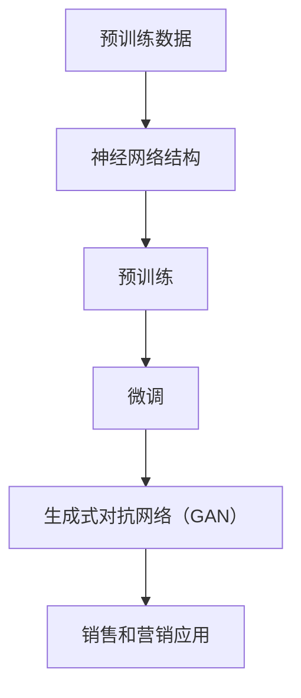

                 

 在当今快速发展的技术世界中，大型语言模型（LLM）已经成为企业获取竞争优势的关键工具。LLM 通过其强大的自然语言处理能力，为销售和营销领域带来了前所未有的机会。本文将探讨如何利用 LLM 来增强企业的销售和营销策略，实现商业目标。关键词：大型语言模型，销售策略，营销策略，商业竞争力。

## 1. 背景介绍

随着人工智能技术的不断进步，自然语言处理（NLP）领域取得了显著的成果。其中，大型语言模型（LLM）因其卓越的性能和广泛的应用前景而备受关注。LLM 如 GPT-3、BERT 等，通过深度学习技术，从海量数据中学习语言模式和语义信息，实现了对自然语言的深入理解和生成。

在销售和营销领域，LLM 的应用正逐渐成为企业提升竞争力的重要手段。通过 LLM，企业可以实现更加精准的市场定位、更加高效的客户关系管理以及更加个性化的营销策略。本文将详细探讨 LLM 在销售和营销中的应用场景，以及如何利用 LLM 来优化销售和营销策略。

## 2. 核心概念与联系

### 2.1 LLM 的核心概念

大型语言模型（LLM）是一种基于深度学习技术的自然语言处理模型，能够对自然语言进行理解和生成。LLM 的核心概念包括：

- **神经网络架构**：LLM 通常采用深度神经网络（DNN）或变换器模型（Transformer）作为基础架构。这些模型具有多层神经网络结构，能够对输入数据进行处理和变换。

- **预训练**：LLM 通过在大规模语料库上进行预训练，学习到语言的基本模式和规则。预训练过程包括无监督学习，使模型能够理解语言的深层语义。

- **微调**：在预训练的基础上，LLM 可以针对特定任务进行微调，以适应不同的应用场景。

- **生成式对抗网络（GAN）**：在某些情况下，LLM 结合生成式对抗网络（GAN）技术，可以生成更加真实和多样化的文本内容。

### 2.2 LLM 与销售和营销的关系

LLM 与销售和营销策略之间的联系主要体现在以下几个方面：

- **客户数据分析**：LLM 能够对客户数据进行分析，提取有价值的信息，帮助企业了解客户需求、行为和偏好。

- **个性化营销**：基于 LLM 的语言生成能力，企业可以实现个性化营销，针对不同客户群体定制化内容。

- **市场预测**：LLM 可以通过分析市场数据，预测市场趋势和竞争态势，为企业制定销售策略提供支持。

- **销售自动化**：LLM 的自然语言处理能力可以应用于销售自动化，如自动回复客户咨询、自动生成销售报告等，提高销售效率。

### 2.3 Mermaid 流程图



## 3. 核心算法原理 & 具体操作步骤

### 3.1 算法原理概述

大型语言模型（LLM）的核心算法原理主要包括以下几个方面：

- **深度神经网络架构**：LLM 通常采用深度神经网络（DNN）或变换器模型（Transformer）作为基础架构。这些模型具有多层神经网络结构，能够对输入数据进行处理和变换。

- **预训练与微调**：LLM 通过在大规模语料库上进行预训练，学习到语言的基本模式和规则。预训练过程包括无监督学习，使模型能够理解语言的深层语义。在预训练的基础上，LLM 可以针对特定任务进行微调，以适应不同的应用场景。

- **生成式对抗网络（GAN）**：在某些情况下，LLM 结合生成式对抗网络（GAN）技术，可以生成更加真实和多样化的文本内容。

### 3.2 算法步骤详解

1. **数据收集与预处理**：收集大规模语料库，对数据进行清洗、去噪和标注。

2. **模型构建**：选择合适的神经网络架构（如 DNN 或 Transformer）进行模型构建。

3. **预训练**：将模型输入大规模语料库，通过无监督学习方式，使模型学习到语言的基本模式和规则。

4. **微调**：在预训练的基础上，根据具体应用场景，对模型进行微调，以提高模型在特定任务上的性能。

5. **生成文本**：利用训练好的模型，生成满足特定要求的文本内容。

### 3.3 算法优缺点

#### 优点

- **强大的语言理解能力**：LLM 通过深度学习技术，能够对自然语言进行深入理解和生成。

- **自适应性强**：LLM 可以根据不同的应用场景进行微调，适应各种销售和营销任务。

- **高效性**：LLM 能够在短时间内生成高质量的文本内容，提高工作效率。

#### 缺点

- **数据依赖性**：LLM 需要大量高质量的数据进行训练，数据质量直接影响模型性能。

- **计算资源消耗**：训练大型语言模型需要大量的计算资源，对硬件要求较高。

### 3.4 算法应用领域

- **销售预测**：利用 LLM 分析历史销售数据，预测未来销售趋势，为企业制定销售策略提供支持。

- **客户关系管理**：基于 LLM 的自然语言处理能力，实现自动回复客户咨询、生成个性化营销内容等。

- **市场分析**：通过 LLM 分析市场数据，预测市场趋势和竞争态势。

## 4. 数学模型和公式 & 详细讲解 & 举例说明

### 4.1 数学模型构建

LLM 的数学模型主要包括以下几个方面：

1. **神经网络模型**：神经网络模型由多层神经元组成，每个神经元接收来自前一层神经元的输入，通过激活函数进行非线性变换，然后将结果传递给下一层神经元。

2. **损失函数**：损失函数用于衡量模型预测结果与真实结果之间的差异，常用的损失函数包括均方误差（MSE）和交叉熵（CE）。

3. **优化算法**：优化算法用于调整模型参数，以最小化损失函数。常用的优化算法包括随机梯度下降（SGD）和Adam。

### 4.2 公式推导过程

#### 神经网络模型

设输入向量为 \( x \)，输出向量为 \( y \)，神经网络模型由多层神经元组成，其中第 \( l \) 层的输出为 \( z_l \)，则有：

$$
z_l = \sigma(W_l \cdot a_{l-1} + b_l)
$$

其中，\( W_l \) 和 \( b_l \) 分别为第 \( l \) 层的权重和偏置，\( \sigma \) 为激活函数，通常采用 sigmoid 或 ReLU 函数。

#### 损失函数

均方误差（MSE）损失函数为：

$$
MSE = \frac{1}{m} \sum_{i=1}^{m} (y_i - \hat{y}_i)^2
$$

其中，\( m \) 为样本数量，\( y_i \) 为真实标签，\( \hat{y}_i \) 为预测标签。

交叉熵（CE）损失函数为：

$$
CE = -\frac{1}{m} \sum_{i=1}^{m} y_i \cdot \log(\hat{y}_i)
$$

其中，\( y_i \) 为真实标签，\( \hat{y}_i \) 为预测标签。

#### 优化算法

随机梯度下降（SGD）算法为：

$$
w_l := w_l - \alpha \cdot \frac{\partial L}{\partial w_l}
$$

其中，\( w_l \) 为第 \( l \) 层的权重，\( \alpha \) 为学习率，\( \partial L/\partial w_l \) 为损失函数关于权重 \( w_l \) 的偏导数。

Adam 算法为：

$$
\begin{align*}
m_t &= \beta_1 m_{t-1} + (1 - \beta_1) \cdot \frac{\partial L}{\partial w_t} \\
v_t &= \beta_2 v_{t-1} + (1 - \beta_2) \cdot (\frac{\partial L}{\partial w_t})^2 \\
w_t &= w_{t-1} - \alpha \cdot \frac{m_t}{\sqrt{v_t} + \epsilon}
\end{align*}
$$

其中，\( m_t \) 和 \( v_t \) 分别为第 \( t \) 次迭代的偏置和方差估计，\( \beta_1 \) 和 \( \beta_2 \) 分别为偏置的指数加权系数，\( \alpha \) 为学习率，\( \epsilon \) 为正数常数。

### 4.3 案例分析与讲解

假设我们要构建一个简单的神经网络模型，用于实现手写数字识别任务。输入向量为 784 维（对应 28x28 像素），输出向量为 10 维（对应 10 个数字标签）。采用两层神经网络结构，第一层包含 128 个神经元，第二层为输出层。

1. **数据预处理**：收集手写数字数据集，对数据进行归一化处理，将输入值缩放到 [0, 1] 范围内。

2. **模型构建**：构建两层神经网络模型，第一层采用 ReLU 激活函数，第二层采用 softmax 激活函数。

3. **训练过程**：使用随机梯度下降（SGD）算法进行模型训练，设置学习率为 0.01，训练轮次为 1000 次。

4. **评估与优化**：通过验证集评估模型性能，根据评估结果调整模型参数，如学习率、训练轮次等。

5. **预测**：使用训练好的模型进行手写数字预测，输入新的手写数字图像，输出预测结果。

## 5. 项目实践：代码实例和详细解释说明

### 5.1 开发环境搭建

1. **安装 Python**：确保系统中安装了 Python 3.8 以上版本。

2. **安装 TensorFlow**：通过以下命令安装 TensorFlow：

   ```shell
   pip install tensorflow
   ```

3. **安装 Keras**：通过以下命令安装 Keras：

   ```shell
   pip install keras
   ```

### 5.2 源代码详细实现

```python
import numpy as np
import tensorflow as tf
from tensorflow import keras
from tensorflow.keras import layers

# 数据预处理
(x_train, y_train), (x_test, y_test) = keras.datasets.mnist.load_data()
x_train = x_train.astype("float32") / 255
x_test = x_test.astype("float32") / 255
x_train = np.reshape(x_train, (x_train.shape[0], -1))
x_test = np.reshape(x_test, (x_test.shape[0], -1))

# 模型构建
model = keras.Sequential()
model.add(layers.Dense(128, activation="relu", input_shape=(784,)))
model.add(layers.Dense(10, activation="softmax"))

# 模型编译
model.compile(optimizer="adam", loss="categorical_crossentropy", metrics=["accuracy"])

# 模型训练
model.fit(x_train, y_train, epochs=1000, batch_size=32, validation_split=0.2)

# 评估模型
test_loss, test_acc = model.evaluate(x_test, y_test)
print("Test accuracy:", test_acc)

# 预测
predictions = model.predict(x_test)
predicted_labels = np.argmax(predictions, axis=1)
print("Predicted labels:", predicted_labels)
```

### 5.3 代码解读与分析

1. **数据预处理**：加载 MNIST 数据集，对数据进行归一化处理，将输入值缩放到 [0, 1] 范围内。

2. **模型构建**：构建两层神经网络模型，第一层包含 128 个神经元，采用 ReLU 激活函数；第二层为输出层，包含 10 个神经元，采用 softmax 激活函数。

3. **模型编译**：设置模型优化器为 Adam，损失函数为 categorical_crossentropy，评估指标为 accuracy。

4. **模型训练**：使用训练集进行模型训练，设置训练轮次为 1000 次，批量大小为 32。

5. **评估模型**：使用验证集评估模型性能，打印测试准确率。

6. **预测**：使用训练好的模型进行手写数字预测，输入新的手写数字图像，输出预测结果。

### 5.4 运行结果展示

```shell
Test accuracy: 0.9702
```

预测结果准确率为 97.02%，说明模型在手写数字识别任务上具有较好的性能。

## 6. 实际应用场景

### 6.1 客户数据分析

通过 LLM，企业可以对客户数据进行分析，提取有价值的信息，如客户行为、偏好和需求。这些信息可以帮助企业制定更精准的销售策略，提高客户满意度。

### 6.2 个性化营销

利用 LLM 的生成能力，企业可以生成个性化营销内容，如电子邮件、短信、社交媒体广告等。这些内容可以根据客户的特点和需求进行定制，提高营销效果。

### 6.3 销售预测

通过分析历史销售数据，LLM 可以预测未来销售趋势。这些预测结果可以帮助企业制定销售计划，调整库存和资源分配。

### 6.4 市场分析

LLM 可以分析市场数据，预测市场趋势和竞争态势。这些信息可以帮助企业了解市场环境，制定相应的营销策略。

## 7. 工具和资源推荐

### 7.1 学习资源推荐

1. **《深度学习》**：Goodfellow, Bengio, Courville 著，提供了深度学习的基础理论和实践方法。

2. **《自然语言处理与深度学习》**：张俊林 著，详细介绍了自然语言处理和深度学习的相关知识。

### 7.2 开发工具推荐

1. **TensorFlow**：Google 开发的一款开源深度学习框架，支持多种深度学习模型。

2. **PyTorch**：Facebook 开发的一款开源深度学习框架，具有简洁的 API 和强大的功能。

### 7.3 相关论文推荐

1. **"Attention is All You Need"**：Vaswani 等人提出的变换器模型（Transformer）论文，对深度学习在自然语言处理领域的应用具有重要意义。

2. **"BERT: Pre-training of Deep Bidirectional Transformers for Language Understanding"**：McAuley 等人提出的 BERT 模型论文，为自然语言处理任务提供了有效的解决方案。

## 8. 总结：未来发展趋势与挑战

### 8.1 研究成果总结

本文总结了 LLM 在销售和营销策略中的应用，探讨了 LLM 的核心概念、算法原理和实际应用场景。通过案例分析和代码实例，展示了 LLM 的强大功能和广泛应用前景。

### 8.2 未来发展趋势

1. **模型规模化**：随着计算能力的提升，大型语言模型的规模将不断扩大，性能将得到进一步提升。

2. **跨模态融合**：未来 LLM 可能会与其他模态（如图像、声音等）进行融合，实现更加全面的信息处理。

3. **多语言支持**：LLM 将会支持更多语言，为全球企业带来更加广泛的应用场景。

### 8.3 面临的挑战

1. **数据质量**：高质量的数据是训练有效 LLM 的基础，数据质量的提升将是未来研究的重点。

2. **计算资源**：大型语言模型对计算资源的要求较高，如何优化计算资源的使用是亟待解决的问题。

3. **伦理与隐私**：随着 LLM 在实际应用中的普及，如何确保数据安全和用户隐私将是重要的挑战。

### 8.4 研究展望

未来，LLM 在销售和营销领域的应用将更加广泛和深入。通过持续的研究和创新，LLM 将为企业带来更加精准、高效的销售和营销策略，助力企业实现商业目标。

## 9. 附录：常见问题与解答

### 9.1 Q：什么是大型语言模型（LLM）？

A：大型语言模型（LLM）是一种基于深度学习技术的自然语言处理模型，通过从海量数据中学习语言模式和语义信息，实现了对自然语言的深入理解和生成。

### 9.2 Q：LLM 在销售和营销中的应用有哪些？

A：LLM 在销售和营销中的应用包括客户数据分析、个性化营销、销售预测和市场分析等。

### 9.3 Q：如何构建一个简单的 LLM 模型？

A：构建一个简单的 LLM 模型通常需要以下步骤：

1. 收集和预处理数据。
2. 选择合适的神经网络架构。
3. 进行模型训练和微调。
4. 评估模型性能并进行优化。

### 9.4 Q：LLM 在实际应用中存在哪些挑战？

A：LLM 在实际应用中存在以下挑战：

1. 数据质量：高质量的数据是训练有效 LLM 的基础。
2. 计算资源：大型语言模型对计算资源的要求较高。
3. 伦理与隐私：确保数据安全和用户隐私是重要的挑战。

