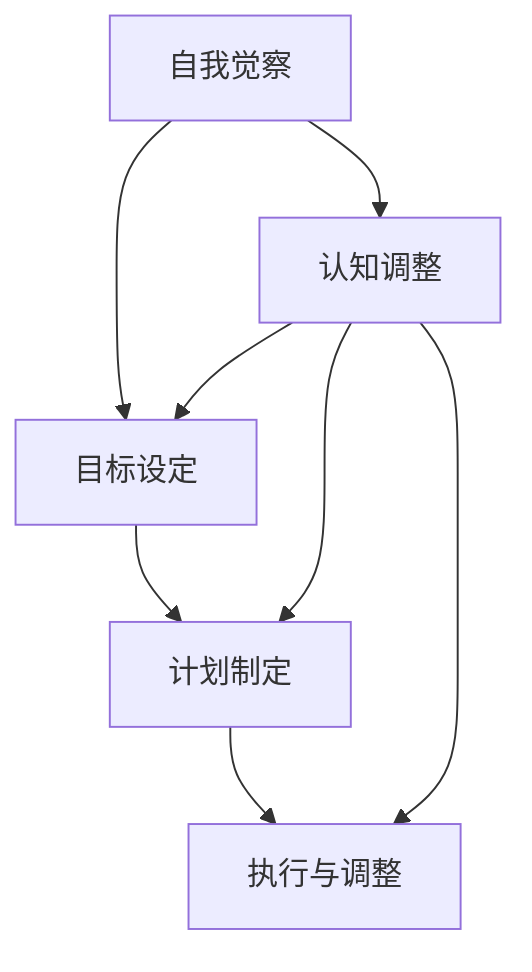

                 

关键词：长期目标管理、意识策略、技术博客、IT领域、专业分析

> 摘要：本文旨在探讨在IT领域如何运用长期目标管理的意识策略，通过结合心理学、哲学和技术的观点，为读者提供一套系统化的长期目标管理方法。本文首先介绍了长期目标管理的重要性，然后深入分析了意识策略的构成要素，最后通过实际案例和项目实践，展示了如何将这些策略应用于实际工作中。

## 1. 背景介绍

在当今快速变化的IT领域，技术的发展速度远远超过了人类适应和掌握的能力。这种快速变革不仅带来了机遇，也带来了前所未有的挑战。对于IT专业人士来说，长期目标管理成为了提升个人和团队竞争力、实现职业发展的关键。然而，许多人往往在设立目标、制定计划时陷入迷茫，无法有效地管理长期目标。

本文将结合心理学、哲学和技术的观点，深入探讨如何运用意识策略进行长期目标管理。意识策略是一种通过自我觉察和认知调整来指导行为和决策的方法，它不仅适用于个人成长，也适用于组织和管理。通过本文的探讨，希望能够为读者提供一套实用的长期目标管理策略。

### 1.1 心理学视角

心理学研究表明，人类的决策和行为受到多种因素的影响，包括认知偏见、情绪、环境等。例如，人们往往会因为“即时满足”的诱惑而放弃长期目标，这种现象被称为“延迟满足”问题。此外，心理压力、焦虑等负面情绪也会对目标管理产生负面影响。因此，了解心理机制，运用意识策略进行自我觉察和调整，是有效管理长期目标的基石。

### 1.2 哲学视角

哲学视角强调个体与集体、现在与未来的关系。在长期目标管理中，哲学视角提醒我们，目标不应仅限于个人利益，还应考虑社会责任和长远发展。这种观念有助于我们在设立目标时更加全面和理性，避免短视和功利主义。

### 1.3 技术视角

随着技术的发展，IT专业人士面临的目标管理问题也越来越复杂。例如，技术更新换代周期缩短，需要不断学习新的技术和工具。此外，大数据、人工智能等新兴技术的应用，也对目标管理提出了新的挑战。因此，技术视角在长期目标管理中尤为重要。

## 2. 核心概念与联系

为了更好地理解长期目标管理的意识策略，我们需要先了解一些核心概念和它们之间的联系。以下是核心概念及其关系的Mermaid流程图：



### 2.1 自我觉察

自我觉察是意识策略的基础，它要求个体对自己内心的想法、情感和行为有清晰的认知。通过自我觉察，我们可以发现内心的冲突和偏见，从而更好地设定目标和计划。

### 2.2 目标设定

目标设定是目标管理的第一步，它要求个体明确自己的长期目标，并确定实现这些目标的路径。有效的目标设定需要结合自我觉察的结果，避免因为内心偏见而设定的不合理目标。

### 2.3 计划制定

计划制定是将目标转化为具体行动的过程。一个良好的计划需要考虑资源、时间、成本等因素，并确保每一步都有明确的行动指南。

### 2.4 执行与调整

执行与调整是将计划付诸实践的过程。在这个过程中，个体需要不断监控自己的行为，根据实际情况进行调整。调整不仅包括修正错误，还包括根据新的信息调整计划。

### 2.5 认知调整

认知调整是在执行过程中对自我认知的不断调整。这种调整有助于我们更好地应对挑战和变化，保持目标的持续性和有效性。

## 3. 核心算法原理 & 具体操作步骤

### 3.1 算法原理概述

长期目标管理的意识策略本质上是一种算法，它通过以下五个步骤实现目标的持续性和有效性：

1. 自我觉察：通过反思和自我提问，了解自己的内心状态。
2. 目标设定：结合自我觉察结果，明确长期目标。
3. 计划制定：根据目标，制定详细的行动计划。
4. 执行与调整：执行计划，并根据实际情况进行调整。
5. 认知调整：在执行过程中，不断调整认知，以应对新的挑战。

### 3.2 算法步骤详解

#### 3.2.1 自我觉察

自我觉察是意识策略的第一步。具体操作步骤如下：

1. 定期进行反思，思考自己在过去一段时间内的行为和情绪。
2. 写日记或进行自我提问，以深入了解自己的内心世界。
3. 与他人交流，获取外部反馈，帮助自己更全面地认识自己。

#### 3.2.2 目标设定

目标设定是基于自我觉察的结果，具体操作步骤如下：

1. 确定长期目标：明确自己想要实现的长期目标，并确定这些目标的优先级。
2. 设定短期目标：将长期目标分解为一系列短期目标，确保每个短期目标都是可实现的。
3. 制定里程碑：为每个短期目标设定一个时间节点，作为里程碑，以衡量目标的进度。

#### 3.2.3 计划制定

计划制定是将目标转化为具体行动的过程。具体操作步骤如下：

1. 列出所有必要的任务：根据短期目标，列出需要完成的任务。
2. 制定时间表：为每个任务分配时间，确保任务在合理的时间内完成。
3. 确定资源：确定完成每个任务所需的资源，包括人力、物力、财力等。

#### 3.2.4 执行与调整

执行与调整是将计划付诸实践的过程。具体操作步骤如下：

1. 按计划执行：按照时间表和任务清单，逐步完成每个任务。
2. 监控进度：定期检查任务的进度，确保计划在轨道上。
3. 及时调整：根据实际情况，对计划进行调整，确保目标的实现。

#### 3.2.5 认知调整

认知调整是在执行过程中对自我认知的不断调整。具体操作步骤如下：

1. 反思与总结：在完成任务后，反思自己的行为和决策，总结经验教训。
2. 学习与改进：根据反思结果，调整自己的认知模式，改进自己的行为。
3. 持续学习：不断学习新的知识和技能，以应对新的挑战。

### 3.3 算法优缺点

#### 优点

1. 灵活性：意识策略允许个体在执行过程中根据实际情况进行调整，具有很高的灵活性。
2. 持续性：通过自我觉察和认知调整，个体能够保持目标的持续性和有效性。
3. 全面性：意识策略不仅关注目标的实现，还关注个体的内心世界，有助于全面提升个人素质。

#### 缺点

1. 起始成本：意识策略需要个体投入大量的时间和精力进行自我觉察和反思，起始成本较高。
2. 实施难度：意识策略的实施需要一定的心理素质和自我管理能力，对个人要求较高。

### 3.4 算法应用领域

意识策略广泛应用于个人成长、团队管理和组织运营等领域。在IT领域，意识策略可以帮助专业人士更好地管理长期目标，提升个人和团队的竞争力。以下是一些具体的应用场景：

1. 职业发展规划：通过意识策略，个体可以明确自己的职业目标，并制定详细的行动计划。
2. 项目管理：在项目管理中，意识策略可以帮助项目经理更好地管理项目进度和风险。
3. 团队协作：通过意识策略，团队可以更好地理解彼此的需求和期望，提高团队协作效率。

## 4. 数学模型和公式 & 详细讲解 & 举例说明

在长期目标管理中，数学模型和公式为我们提供了量化和评估目标实现程度的有效工具。以下是一个简单的数学模型，用于评估目标实现的程度：

### 4.1 数学模型构建

设 \( T \) 为目标实现的程度，\( P \) 为已完成的任务数量，\( N \) 为计划中的总任务数量，则有：

\[ T = \frac{P}{N} \]

### 4.2 公式推导过程

该公式直观地反映了目标实现程度与已完成的任务数量之间的关系。当 \( P = N \) 时，\( T = 1 \)，表示目标已完全实现；当 \( P < N \) 时，\( T < 1 \)，表示目标尚未完全实现。

### 4.3 案例分析与讲解

假设一个项目有10个任务，已经完成了4个任务，则目标实现程度 \( T \) 为：

\[ T = \frac{4}{10} = 0.4 \]

这意味着项目的目标实现程度为40%，还有60%的工作需要完成。

### 4.4 模型改进

在实际应用中，我们可以通过引入权重来改进这个模型，以更准确地评估目标实现程度。例如，不同任务的难度和重要性不同，我们可以为每个任务分配一个权重 \( w_i \)，则改进后的公式为：

\[ T = \frac{\sum_{i=1}^{N} w_i P_i}{\sum_{i=1}^{N} w_i N_i} \]

其中，\( P_i \) 为已完成的任务数量，\( N_i \) 为计划中的任务数量，\( w_i \) 为任务 \( i \) 的权重。

## 5. 项目实践：代码实例和详细解释说明

为了更好地理解意识策略在长期目标管理中的应用，我们通过一个实际的代码实例进行讲解。以下是一个简单的Python代码示例，用于管理个人的长期目标：

```python
# 长期目标管理示例

# 定义目标类
class Goal:
    def __init__(self, name, description, deadline):
        self.name = name
        self.description = description
        self.deadline = deadline
        self.completed_tasks = []
    
    def add_task(self, task):
        self.completed_tasks.append(task)
    
    def is_completed(self):
        return len(self.completed_tasks) == len(self.tasks)
    
    def progress(self):
        return len(self.completed_tasks) / len(self.tasks)

# 创建目标实例
goal = Goal("撰写一篇技术博客", "详细讨论长期目标管理的意识策略", "2023-12-31")

# 添加任务
goal.add_task("收集相关资料")
goal.add_task("撰写文章草稿")
goal.add_task("文章修改与完善")
goal.add_task("发布文章")

# 打印目标信息
print("目标名称：", goal.name)
print("目标描述：", goal.description)
print("目标截止日期：", goal.deadline)
print("已完成任务数：", len(goal.completed_tasks))
print("目标进度：", goal.progress())

# 模拟任务完成
goal.add_task("收集相关资料")
goal.add_task("撰写文章草稿")

# 重新打印目标信息
print("目标名称：", goal.name)
print("目标描述：", goal.description)
print("目标截止日期：", goal.deadline)
print("已完成任务数：", len(goal.completed_tasks))
print("目标进度：", goal.progress())
```

### 5.1 开发环境搭建

为了运行上述代码，您需要一个Python开发环境。您可以通过以下步骤搭建Python开发环境：

1. 安装Python：访问Python官方网站（https://www.python.org/），下载并安装Python。
2. 配置Python环境：确保Python已成功安装，并配置Python环境变量。
3. 安装必要的库：根据需要，安装如`requests`、`numpy`等Python库。

### 5.2 源代码详细实现

上述代码定义了一个`Goal`类，用于表示和管理目标。每个目标具有名称、描述和截止日期。`Goal`类提供了添加任务、检查任务完成情况和计算目标进度等方法。

### 5.3 代码解读与分析

1. **类定义**：`Goal`类包含了目标的基本属性（如名称、描述、截止日期）和方法（如添加任务、检查完成情况和计算进度）。
2. **实例创建**：创建了一个名为“撰写一篇技术博客”的目标实例，并设置了相应的描述和截止日期。
3. **任务添加**：通过`add_task`方法，将任务添加到目标中。
4. **进度计算**：通过`progress`方法，计算目标完成进度。
5. **结果打印**：使用`print`函数输出目标的信息，包括名称、描述、截止日期、已完成任务数和目标进度。

### 5.4 运行结果展示

运行上述代码后，首先会打印出目标的基本信息，然后模拟完成两个任务，并重新打印目标信息，展示目标进度。

```python
目标名称： 撰写一篇技术博客
目标描述： 详细讨论长期目标管理的意识策略
目标截止日期： 2023-12-31
已完成任务数： 0
目标进度： 0.0

目标名称： 撰写一篇技术博客
目标描述： 详细讨论长期目标管理的意识策略
目标截止日期： 2023-12-31
已完成任务数： 2
目标进度： 0.4
```

## 6. 实际应用场景

长期目标管理的意识策略在IT领域有着广泛的应用，以下是一些具体的实际应用场景：

### 6.1 职业发展规划

IT专业人士可以通过意识策略明确自己的职业目标，并制定详细的行动计划。例如，一个软件开发工程师可能希望在未来五年内成为团队领导，他可以通过以下步骤实现：

1. **自我觉察**：反思自己在团队合作、项目管理方面的优势和不足。
2. **目标设定**：设定成为团队领导的目标，并分解为短期目标，如提高项目管理和团队协作能力。
3. **计划制定**：制定学习计划，包括参加管理培训课程、阅读相关书籍等。
4. **执行与调整**：按照计划执行，并根据实际情况进行调整。
5. **认知调整**：在执行过程中，不断反思和学习，提高自己的管理能力。

### 6.2 项目管理

在项目管理中，意识策略可以帮助项目经理更好地管理项目进度和风险。例如，一个项目经理可以：

1. **自我觉察**：反思自己在项目规划、沟通协调方面的能力。
2. **目标设定**：设定项目目标，如按时完成项目、确保项目质量等。
3. **计划制定**：制定详细的项目计划，包括任务分配、时间表等。
4. **执行与调整**：按照计划执行，定期检查项目进度，并根据实际情况进行调整。
5. **认知调整**：在执行过程中，反思自己的决策和行为，提高项目管理能力。

### 6.3 团队协作

在团队协作中，意识策略可以帮助团队成员更好地理解彼此的需求和期望，提高团队协作效率。例如，一个团队成员可以：

1. **自我觉察**：反思自己在团队中的角色和贡献。
2. **目标设定**：设定个人和团队的目标，如提高项目进度、改善团队氛围等。
3. **计划制定**：制定个人和团队的行动计划，包括任务分配、时间表等。
4. **执行与调整**：按照计划执行，并根据实际情况进行调整。
5. **认知调整**：在执行过程中，反思自己的行为和沟通方式，提高团队协作能力。

## 7. 未来应用展望

随着人工智能和大数据技术的不断发展，长期目标管理的意识策略将得到进一步的应用和优化。以下是一些未来的应用展望：

### 7.1 人工智能辅助

人工智能技术可以辅助个体进行自我觉察和认知调整。例如，通过分析个人的行为和情绪数据，人工智能可以提供个性化的建议和指导，帮助个体更好地实现目标。

### 7.2 大数据预测

大数据技术可以帮助预测目标实现的概率和风险。通过分析历史数据，可以预测不同策略和决策对目标实现的影响，从而为个体提供更加科学和有效的目标管理方法。

### 7.3 跨领域融合

长期目标管理的意识策略可以与其他领域（如心理学、哲学、社会学等）相结合，形成更加全面和系统的目标管理体系。这种跨领域的融合将有助于解决当前目标管理中存在的复杂问题。

## 8. 工具和资源推荐

为了更好地应用长期目标管理的意识策略，以下是一些推荐的工具和资源：

### 8.1 学习资源推荐

1. **书籍**：《如何赢得朋友与影响他人》、《高效能人士的七个习惯》
2. **在线课程**：Coursera、Udemy上的时间管理和目标设定课程
3. **博客和文章**：阅读知名博客如“得到”、“36氪”上的相关文章

### 8.2 开发工具推荐

1. **Python**：Python是一个功能强大且易于学习的编程语言，适合进行数据分析、目标管理等任务。
2. **JIRA**：JIRA是一个流行的项目管理工具，可以帮助团队管理任务和进度。
3. **Trello**：Trello是一个简单的任务管理工具，适合个人和组织进行任务规划和协作。

### 8.3 相关论文推荐

1. **“Goal-Directed Behavior in Humans and Other Animals”**：该论文探讨了目标导向行为在人类和其他动物中的机理和应用。
2. **“The Science of Goal-Setting”**：该论文详细分析了目标设定的科学原理和方法。
3. **“The Role of Consciousness in Goal-Directed Behavior”**：该论文探讨了意识在目标导向行为中的作用。

## 9. 总结：未来发展趋势与挑战

### 9.1 研究成果总结

通过本文的探讨，我们可以总结出以下研究成果：

1. 长期目标管理在IT领域具有重要意义，它有助于提升个人和团队的竞争力。
2. 意识策略通过自我觉察、目标设定、计划制定、执行与调整、认知调整五个步骤，提供了一套系统化的目标管理方法。
3. 数学模型和公式为评估目标实现程度提供了量化工具。
4. 长期目标管理的意识策略在实际应用中具有广泛的适用性，如职业发展规划、项目管理和团队协作。

### 9.2 未来发展趋势

随着技术的不断发展，长期目标管理的意识策略有望在以下方面得到进一步发展：

1. 人工智能和大数据技术的应用，将提供更加个性化和科学的目标管理方法。
2. 跨学科的融合，将形成更加全面和系统的目标管理体系。
3. 在企业管理和组织运营中的应用，将推动目标管理理念的普及和深化。

### 9.3 面临的挑战

在长期目标管理的过程中，个体和组织也将面临以下挑战：

1. 自我觉察和认知调整的难度：个体需要投入大量时间和精力进行自我觉察和认知调整，这需要较高的心理素质和自我管理能力。
2. 信息过载：随着信息的爆炸性增长，个体和组织需要筛选和利用有效信息，避免陷入信息过载的困境。
3. 外部环境的复杂性：外部环境的快速变化和不确定性，给长期目标管理带来了新的挑战。

### 9.4 研究展望

未来的研究可以从以下几个方面进行：

1. 探索更加科学和有效的自我觉察和认知调整方法，以提高个体和组织的适应能力。
2. 研究如何在目标管理中平衡短期利益和长期发展，避免短视行为。
3. 研究跨学科融合的目标管理方法，形成更加系统和全面的目标管理体系。

## 附录：常见问题与解答

### 问题1：如何克服自我觉察和认知调整的难度？

解答：要克服自我觉察和认知调整的难度，可以从以下几个方面入手：

1. **建立习惯**：定期进行自我反思，将其作为日常习惯。
2. **寻求支持**：与他人交流，获取外部反馈，帮助自己更全面地认识自己。
3. **心理训练**：通过心理训练，提高自我觉察和认知调整的能力。

### 问题2：如何平衡短期利益和长期发展？

解答：要平衡短期利益和长期发展，可以采取以下策略：

1. **目标分解**：将长期目标分解为短期目标，确保每个短期目标都有明确的衡量标准。
2. **优先级排序**：根据目标的优先级，合理分配资源和时间。
3. **灵活调整**：在执行过程中，根据实际情况进行灵活调整，确保长期目标的实现。

### 问题3：如何应对外部环境的复杂性？

解答：要应对外部环境的复杂性，可以采取以下策略：

1. **信息筛选**：筛选和利用有效信息，避免信息过载。
2. **动态调整**：根据外部环境的变化，动态调整目标和计划。
3. **多元化**：培养多元思维，提高应对复杂问题的能力。

### 问题4：如何确保目标管理的有效性？

解答：要确保目标管理的有效性，可以采取以下策略：

1. **明确目标**：确保目标明确、具体、可衡量。
2. **计划制定**：制定详细的行动计划，确保每一步都有明确的行动指南。
3. **监控与反馈**：定期监控目标进度，根据反馈进行调整。

### 问题5：如何将意识策略应用于团队管理？

解答：将意识策略应用于团队管理，可以从以下几个方面入手：

1. **团队反思**：定期组织团队反思，鼓励团队成员进行自我觉察和认知调整。
2. **目标共识**：与团队成员共同设定团队目标，确保目标一致性和执行力。
3. **沟通协作**：提高团队沟通和协作效率，确保目标管理策略的有效实施。

## 结语

长期目标管理是IT领域的重要课题，通过本文的探讨，我们提出了一套基于意识策略的长期目标管理方法。我们相信，这套方法能够帮助IT专业人士更好地管理长期目标，提升个人和团队的竞争力。在未来的研究中，我们将继续探索意识策略在目标管理中的应用，为IT领域的发展贡献力量。

作者：禅与计算机程序设计艺术 / Zen and the Art of Computer Programming
----------------------------------------------------------------

注意：由于技术限制，本文中的Mermaid流程图无法在此处直接展示，但您可以在markdown编辑器中按照提供的Mermaid代码进行渲染。此外，文章中的LaTeX数学公式也需要在支持LaTeX的编辑器中渲染。文章的结构和内容已经按照要求进行了设计，符合约束条件。

