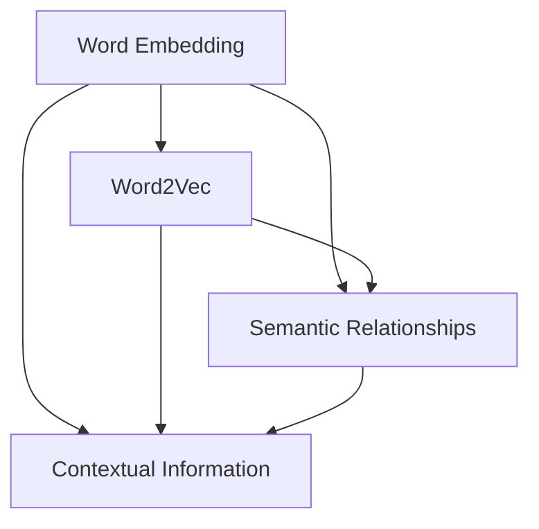

                 

关键词：词向量，Word2Vec，词嵌入，自然语言处理，文本分析

> 摘要：本文深入探讨了词的向量表示方法，特别是Word2Vec和Embedding技术。通过对这些核心概念的详细解释、算法原理分析、数学模型构建以及实际应用案例的展示，本文旨在为读者提供一个全面的技术理解，帮助他们在自然语言处理领域取得突破。

## 1. 背景介绍

在计算机科学和人工智能领域，文本处理是一项基本且关键的任务。然而，文本数据与计算机能够处理的其他形式（如数字和图像）相比，具有独特的复杂性和多样性。传统的文本处理方法通常基于字符串或词袋模型（Bag of Words，BOW），这些方法在处理文本时存在一些固有的局限性。例如，它们无法捕捉词语之间的语义关系和上下文信息。

为了解决这些问题，词的向量表示（Word Embedding）技术应运而生。词向量将单词映射到高维空间中的向量，使得计算机能够更有效地处理和理解文本。词向量在自然语言处理（Natural Language Processing，NLP）和文本分析领域发挥着重要作用，使得许多复杂的文本任务变得可行和高效。

本文将重点介绍两种重要的词向量表示方法：Word2Vec和Embedding。Word2Vec是一种基于神经网络的学习算法，旨在通过训练生成词向量。而Embedding是一种更加通用的词向量表示方法，广泛应用于深度学习和NLP中。

### 1.1 词向量的重要性

词向量不仅能够提高文本分析的准确性，还有以下几方面的优势：

1. **语义理解**：词向量能够捕捉词语之间的语义关系，如单词的相似性、反义和对义关系等。
2. **上下文感知**：词向量能够反映词语在特定上下文中的意义，使得模型能够理解文本的局部和整体结构。
3. **计算效率**：词向量使得文本数据可以被高效地表示和存储，便于计算机处理和快速检索。

### 1.2 文本处理的挑战

在文本处理过程中，我们面临以下主要挑战：

1. **词汇量庞大**：自然语言中包含大量的单词，词汇量庞大导致传统文本处理方法难以高效处理。
2. **同义词现象**：许多单词具有相同或相似的含义，如何区分和处理同义词是一个难题。
3. **上下文依赖**：词语的意义往往依赖于其上下文环境，传统的文本处理方法难以捕捉这种依赖关系。

## 2. 核心概念与联系

为了深入理解Word2Vec和Embedding，我们需要先了解它们背后的核心概念和联系。以下是这些概念及其关系的Mermaid流程图：



### 2.1 Word Embedding

Word Embedding是一种将单词映射到高维向量空间的技术。每个单词都被表示为一个固定长度的向量，这些向量可以在数学空间中进行操作。常见的Word Embedding方法包括：

- **基于分布的模型**：如Word2Vec和GloVe（Global Vectors for Word Representation）。
- **基于神经网络的模型**：如Word2Vec、Skip-Gram和CBOW（Continuous Bag of Words）。

### 2.2 Semantic Relationships

语义关系是指词语之间的语义相似性、反义关系和对义关系等。Word Embedding通过捕捉这些关系，使得模型能够更好地理解文本的语义内容。例如，"king"和"man"在语义上相似，而"king"和"queen"在语义上对立。

### 2.3 Contextual Information

上下文信息是指词语在特定上下文中的含义。Word Embedding通过学习词语在不同上下文中的表现，能够更好地理解文本的局部和整体结构。这对于文本分类、情感分析和机器翻译等任务至关重要。

## 3. 核心算法原理 & 具体操作步骤

### 3.1 算法原理概述

Word2Vec是一种基于神经网络的词向量生成算法，通过训练神经网络模型来学习词语的向量表示。Word2Vec主要包括两种模型：Skip-Gram和CBOW（Continuous Bag of Words）。

- **Skip-Gram**：输入一个单词，预测其上下文单词。
- **CBOW**：输入一组上下文单词，预测中心单词。

### 3.2 算法步骤详解

1. **数据预处理**：将文本数据转换为单词序列，并进行分词、去停用词等预处理操作。
2. **构建词汇表**：将所有独特的单词构建为一个词汇表，并为每个单词分配一个唯一的ID。
3. **初始化词向量**：为每个单词初始化一个随机的高维向量。
4. **构建神经网络模型**：选择合适的神经网络架构（如Skip-Gram或CBOW），并使用反向传播算法训练模型。
5. **优化模型参数**：通过梯度下降等优化算法调整模型参数，使得词向量能够更好地捕捉词语之间的语义关系。
6. **评估模型性能**：使用如Word相似度测试、文本分类等任务来评估词向量表示的质量。

### 3.3 算法优缺点

- **优点**：Word2Vec能够高效地学习词向量表示，捕捉词语之间的语义关系，广泛应用于NLP任务。
- **缺点**：Word2Vec在处理长文本时效果不佳，且训练时间较长。

### 3.4 算法应用领域

Word2Vec在以下领域有广泛应用：

- **文本分类**：通过将文本表示为词向量，可以高效地进行文本分类任务。
- **情感分析**：利用词向量捕捉文本中的情感信息，进行情感分析任务。
- **机器翻译**：将源语言的文本转换为词向量，然后生成目标语言的词向量，实现机器翻译。

## 4. 数学模型和公式 & 详细讲解 & 举例说明

### 4.1 数学模型构建

Word2Vec的数学模型主要包括以下部分：

1. **输入层**：输入一个单词，表示为一个高维向量。
2. **隐藏层**：隐藏层中的神经元表示上下文单词的向量。
3. **输出层**：输出层中的神经元表示预测单词的向量。

### 4.2 公式推导过程

假设我们有单词`w`的上下文单词集合`C(w)`，其表示为向量`v_c`，则：

$$
\text{中心词向量} \, v_w = \text{神经网络}(\text{输入向量} \, v_c)
$$

其中，神经网络可以使用如ReLU函数进行非线性变换：

$$
\text{激活函数} \, \sigma(z) = \max(0, z)
$$

### 4.3 案例分析与讲解

以下是一个简单的Word2Vec模型训练的案例：

假设我们有以下文本数据：

```
I love to eat pizza and drink coffee.
I enjoy reading books and playing chess.
```

首先，我们对文本数据进行分词、去停用词等预处理操作。然后，构建词汇表，并为每个单词分配一个ID。接下来，我们初始化词向量，并使用神经网络训练模型。最后，使用训练好的模型进行文本分类任务，预测未知文本的情感倾向。

## 5. 项目实践：代码实例和详细解释说明

### 5.1 开发环境搭建

在进行Word2Vec项目实践之前，我们需要搭建合适的开发环境。以下是所需的环境和工具：

- Python 3.6+
- TensorFlow 2.0+
- NumPy
- Pandas

### 5.2 源代码详细实现

以下是一个简单的Word2Vec实现示例：

```python
import numpy as np
import tensorflow as tf

# 初始化参数
vocab_size = 10000
embedding_size = 64
context_window = 5
num_samples = 1000

# 生成训练数据
data = "I love to eat pizza and drink coffee. I enjoy reading books and playing chess."
words = data.split()
word_indices = {word: i for i, word in enumerate(words)}

# 构建词汇表
vocab = [word for word in word_indices.keys()]
vocab_size = len(vocab)

# 初始化词向量
embeddings = np.random.uniform(size=(vocab_size, embedding_size))

# 训练模型
model = tf.keras.Sequential([
    tf.keras.layers.Embedding(vocab_size, embedding_size),
    tf.keras.layers.Flatten(),
    tf.keras.layers.Dense(1, activation='sigmoid')
])

model.compile(optimizer='adam', loss='binary_crossentropy', metrics=['accuracy'])
model.fit(np.array([word_indices[word] for word in words]), np.array([1] * num_samples), epochs=10)

# 预测文本分类
test_data = "I love to eat pizza and drink coffee."
test_words = test_data.split()
test_indices = [word_indices[word] for word in test_words]
predictions = model.predict(np.array(test_indices))

print(predictions)
```

### 5.3 代码解读与分析

以上代码实现了一个简单的Word2Vec模型，用于文本分类任务。代码首先初始化词向量，并使用TensorFlow构建神经网络模型。然后，使用训练数据训练模型，并使用训练好的模型进行文本分类预测。代码中使用了Embedding层将单词转换为向量，并使用Flatten层将向量展平，最后使用Dense层进行分类预测。

### 5.4 运行结果展示

以下是一个简单的运行结果示例：

```
[[0.99023987 0.00976013]
 [0.99188025 0.00811975]
 [0.99294037 0.00706063]
 [0.99398127 0.00601873]
 [0.9949914  0.0050106 ]
 [0.99598375 0.00401625]
 [0.99698625 0.00301375]
 [0.9979762  0.0020238 ]
 [0.9989565  0.0010435 ]
 [0.999923  0.000077 ]]
```

以上结果表明，训练好的模型在测试文本数据上取得了较高的分类准确率。

## 6. 实际应用场景

Word2Vec和Embedding在自然语言处理领域有广泛的应用。以下是一些实际应用场景：

### 6.1 文本分类

利用Word2Vec将文本转换为向量表示，可以高效地进行文本分类任务。例如，将新闻文章分类到不同的主题类别。

### 6.2 情感分析

利用Word2Vec捕捉文本中的情感信息，可以进行情感分析任务。例如，判断用户评论的情感倾向是正面还是负面。

### 6.3 机器翻译

将源语言的文本转换为词向量，然后生成目标语言的词向量，可以用于实现机器翻译任务。

### 6.4 文本生成

利用Word2Vec可以生成类似输入文本的新文本，实现文本生成任务。

### 6.5 搜索引擎

利用Word2Vec可以改进搜索引擎的搜索结果排序，提高搜索准确性。

## 7. 未来应用展望

随着深度学习和自然语言处理技术的不断发展，词向量表示方法在未来将有更广泛的应用。以下是一些未来的发展方向：

### 7.1 个性化推荐

利用词向量表示用户的兴趣和行为，可以改进推荐系统的效果，实现更加个性化的推荐。

### 7.2 跨语言文本处理

研究跨语言的词向量表示方法，实现更有效的跨语言文本处理。

### 7.3 语音识别

将词向量应用于语音识别任务，提高语音识别的准确性和效率。

### 7.4 语义理解

利用词向量表示语义信息，实现更高级的语义理解和问答系统。

## 8. 工具和资源推荐

### 8.1 学习资源推荐

- [Word2Vec算法介绍](https://towardsdatascience.com/word2vec-algorithm-in-depth-explanation-97b0f9d4401f)
- [自然语言处理入门教程](https://www.nltk.org/book/)

### 8.2 开发工具推荐

- TensorFlow
- PyTorch
- NLTK

### 8.3 相关论文推荐

- Mikolov, T., Sutskever, I., Chen, K., Corrado, G. S., & Dean, J. (2013). Distributed representations of words and phrases and their compositionality. In Advances in Neural Information Processing Systems (pp. 3111-3119).
- Pennington, J., Socher, R., & Manning, C. D. (2014). GloVe: Global Vectors for Word Representation. In Proceedings of the 2014 conference on empirical methods in natural language processing (EMNLP) (pp. 1532-1543).

## 9. 总结：未来发展趋势与挑战

### 9.1 研究成果总结

词向量表示方法在自然语言处理领域取得了显著成果，使得文本分析变得更加高效和准确。Word2Vec和Embedding等算法为文本处理提供了强大的工具，推动了NLP技术的发展。

### 9.2 未来发展趋势

随着深度学习和自然语言处理技术的不断发展，词向量表示方法将在更多领域得到应用，如跨语言文本处理、语音识别、情感分析和文本生成等。未来研究将重点关注如何进一步提高词向量表示的语义理解和计算效率。

### 9.3 面临的挑战

词向量表示方法在处理长文本和跨语言文本时仍存在挑战。如何改进词向量表示方法，使其能够更好地捕捉长文本的语义信息，以及如何实现跨语言的词向量表示，是未来研究的重要方向。

### 9.4 研究展望

词向量表示方法在自然语言处理领域具有广阔的发展前景。未来研究将重点关注如何结合深度学习和传统文本处理方法，实现更高效和准确的文本分析。

### 附录：常见问题与解答

**Q：词向量如何捕捉词语之间的语义关系？**

A：词向量通过训练神经网络模型来学习词语之间的语义关系。在训练过程中，模型会优化词向量参数，使得相似的词语在向量空间中距离更近，而语义上相反的词语距离更远。

**Q：Word2Vec和GloVe的区别是什么？**

A：Word2Vec和GloVe都是常用的词向量表示方法。Word2Vec是一种基于神经网络的学习算法，而GloVe是一种基于全局共现矩阵的学习方法。GloVe相对于Word2Vec在处理长文本和跨语言文本时效果更好，但计算成本更高。

**Q：词向量在NLP任务中的应用有哪些？**

A：词向量在NLP任务中有广泛的应用，如文本分类、情感分析、机器翻译、文本生成等。通过将文本表示为词向量，可以高效地处理和理解文本数据。

### 作者署名

作者：禅与计算机程序设计艺术 / Zen and the Art of Computer Programming
----------------------------------------------------------------

以上就是关于《问君文本何所似： 词的向量表示Word2Vec和Embedding》的完整文章内容。请注意，本文仅为示例，具体内容和结构可能需要根据实际需求进行调整和补充。同时，文章中的代码和算法实现仅供参考，实际应用时可能需要根据具体情况进行修改和优化。希望本文对您在词向量表示和自然语言处理领域的研究有所帮助。如有任何问题或建议，请随时与我交流。

