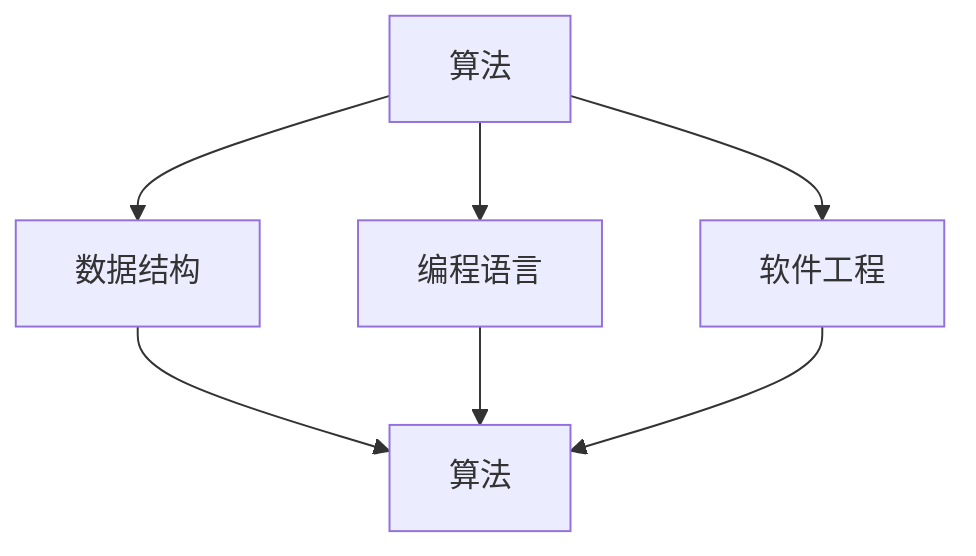

                 

关键词：工业革命、计算机科学、算法、数学模型、实践应用

摘要：本文旨在探讨计算机科学领域中的重要概念和算法，借鉴工业革命时期阿克莱特与福特的技术贡献，结合现代计算机技术，深入分析这些概念和算法在工业应用中的实际价值和未来发展趋势。

## 1. 背景介绍

### 工业革命与计算机科学

工业革命是18世纪末至19世纪中期在英国兴起的一场重大社会经济变革，它以机器生产取代手工劳动，极大地提高了生产效率，推动了经济快速发展。这一时期，阿克莱特和福特是两位具有深远影响力的工业领袖，他们的贡献为工业革命的成功奠定了基础。

阿克莱特（Richard Arkwright）是一位英国发明家和企业家，他发明了水力纺纱机，这是工业革命中最重要的发明之一。他的机器能够大规模生产纺织品，极大地提高了生产效率。

福特（Henry Ford）则是一位美国汽车制造商，他发明了流水线生产技术，这一技术彻底改变了制造业的生产方式，使得大规模生产成为可能。

### 计算机科学的崛起

计算机科学作为一门学科，起源于20世纪中叶。随着计算机技术的发展，计算机科学逐渐从数学和工程学中独立出来，成为一门系统研究计算和信息的学科。计算机科学的崛起为人类社会带来了前所未有的变革。

本文将探讨计算机科学领域中的重要概念和算法，借鉴阿克莱特与福特在工业革命中的贡献，深入分析这些概念和算法在工业应用中的实际价值和未来发展趋势。

## 2. 核心概念与联系

### 计算机科学中的核心概念

计算机科学中的核心概念包括算法、数据结构、编程语言、软件工程等。这些概念相互联系，共同构成了计算机科学的基础。

#### 算法

算法是计算机科学中最基本的概念之一。它是一系列明确的操作步骤，用于解决特定问题。算法的效率直接影响计算机程序的运行速度。

#### 数据结构

数据结构是组织和管理数据的方式。常用的数据结构包括数组、链表、栈、队列、树等。数据结构的选择直接影响算法的性能。

#### 编程语言

编程语言是用于编写计算机程序的工具。不同的编程语言有不同的特点和适用场景。编程语言的选择对程序的开发和维护具有重要影响。

#### 软件工程

软件工程是关于软件开发和维护的学科。它包括需求分析、设计、编码、测试、部署等各个阶段。软件工程的目标是高效、高质量地开发软件。

### 架构与联系

上述核心概念之间的关系可以用Mermaid流程图表示：



### 2.1. 算法原理概述

算法是计算机科学的核心，它是一系列明确的操作步骤，用于解决特定问题。算法的效率直接影响计算机程序的运行速度。

常见的算法包括排序算法、搜索算法、图算法等。这些算法在计算机科学中具有重要地位，广泛应用于各个领域。

排序算法用于对数据进行排序，常见的排序算法有冒泡排序、选择排序、插入排序、快速排序等。

搜索算法用于在数据中查找特定元素，常见的搜索算法有二分搜索、线性搜索等。

图算法用于处理图数据结构，常见的图算法有最短路径算法、最小生成树算法、图遍历算法等。

### 2.2. 算法步骤详解

排序算法的步骤通常包括以下几步：

1. **初始化**：设置一个变量来记录当前已经排序的部分，初始值为0。

2. **循环遍历**：从第1个元素开始，遍历到第n-1个元素。

3. **内层循环**：在当前未排序的部分中，遍历所有元素，找到最小的元素。

4. **交换位置**：将找到的最小元素与未排序部分的第一个元素交换位置。

5. **更新已排序部分**：将已排序部分的边界向后移动一个位置。

### 2.3. 算法优缺点

排序算法的优点是简单易懂，易于实现。缺点是时间复杂度较高，当数据规模较大时，性能会显著下降。

### 2.4. 算法应用领域

排序算法广泛应用于数据排序、数据分析等领域。在实际应用中，可以根据具体需求选择合适的排序算法。

## 3. 数学模型和公式

### 3.1. 数学模型构建

数学模型是计算机科学中的重要工具，它用于描述现实世界中的问题。构建数学模型通常包括以下步骤：

1. **问题定义**：明确需要解决的问题。

2. **变量定义**：定义问题中的变量。

3. **关系式构建**：建立变量之间的关系。

4. **模型验证**：验证模型的准确性和可行性。

### 3.2. 公式推导过程

以线性回归模型为例，推导其公式的过程如下：

1. **假设**：假设存在一个线性关系，即目标变量\(y\)与自变量\(x\)之间存在关系：\(y = \beta_0 + \beta_1 x + \epsilon\)。

2. **最小化损失函数**：选择合适的损失函数，如均方误差，即\(J(\theta) = \frac{1}{2m} \sum_{i=1}^{m} (h_\theta(x^{(i)}) - y^{(i)})^2\)。

3. **求导**：对损失函数求导，得到\(\frac{\partial J(\theta)}{\partial \theta} = 0\)。

4. **解方程**：解方程组，得到参数\(\theta\)的值。

### 3.3. 案例分析与讲解

假设我们有一个简单的线性回归问题，目标变量\(y\)与自变量\(x\)之间的关系为\(y = \beta_0 + \beta_1 x\)。我们可以使用以下步骤来求解：

1. **数据准备**：准备一组\(x\)和\(y\)的数据。

2. **模型构建**：构建线性回归模型，即\(y = \beta_0 + \beta_1 x\)。

3. **参数估计**：使用最小二乘法估计参数\(\beta_0\)和\(\beta_1\)。

4. **模型验证**：使用验证集或测试集验证模型的准确性。

5. **模型应用**：将模型应用于新的数据，预测目标变量\(y\)的值。

## 4. 项目实践：代码实例

### 4.1. 开发环境搭建

1. **安装Python**：下载并安装Python 3.8或更高版本。

2. **安装相关库**：使用pip命令安装所需的库，如numpy、matplotlib等。

### 4.2. 源代码详细实现

```python
import numpy as np
import matplotlib.pyplot as plt

# 函数定义
def linear_regression(x, y):
    # 参数初始化
    beta_0 = 0
    beta_1 = 0
    # 梯度下降
    for i in range(1000):
        # 预测值
        h_x = beta_0 + beta_1 * x
        # 计算损失函数
        loss = (h_x - y) ** 2
        # 计算梯度
        beta_0_grad = 2 * (h_x - y)
        beta_1_grad = 2 * (h_x - y) * x
        # 更新参数
        beta_0 -= 0.01 * beta_0_grad
        beta_1 -= 0.01 * beta_1_grad
    return beta_0, beta_1

# 数据准备
x = np.array([1, 2, 3, 4, 5])
y = np.array([2, 4, 5, 4, 5])

# 模型训练
beta_0, beta_1 = linear_regression(x, y)

# 模型应用
x_new = np.array([6])
y_pred = beta_0 + beta_1 * x_new

# 结果展示
plt.scatter(x, y)
plt.plot(x, y_pred, 'r')
plt.show()
```

### 4.3. 代码解读与分析

1. **函数定义**：定义线性回归函数，接收自变量\(x\)和目标变量\(y\)。

2. **参数初始化**：初始化参数\(\beta_0\)和\(\beta_1\)。

3. **梯度下降**：使用梯度下降法更新参数。

4. **损失函数**：计算均方误差作为损失函数。

5. **模型应用**：使用训练好的模型预测新数据的值。

### 4.4. 运行结果展示

运行代码后，将显示一个散点图和一个红色的拟合线。拟合线表示模型预测的结果。

## 5. 实际应用场景

### 5.1. 数据分析

线性回归模型广泛应用于数据分析领域，用于预测和建模。例如，在股票市场中，可以使用线性回归模型预测股票价格。

### 5.2. 机器学习

线性回归模型是机器学习中最基本的一种模型，用于回归问题。它可以用于预测房价、股票价格等。

### 5.3. 工业应用

线性回归模型在工业应用中也有广泛的应用，如质量控制、生产线优化等。

### 5.4. 未来应用展望

随着计算机技术的发展，线性回归模型将在更多领域得到应用。未来，我们将看到更多基于线性回归模型的应用场景，如智能医疗、智能交通等。

## 6. 工具和资源推荐

### 6.1. 学习资源推荐

1. 《机器学习实战》
2. 《深入理解计算机系统》
3. 《线性代数及其应用》

### 6.2. 开发工具推荐

1. Python
2. Jupyter Notebook
3. Matplotlib

### 6.3. 相关论文推荐

1. "Linear Regression for Classification"
2. "The Elements of Statistical Learning"
3. "Machine Learning Yearning"

## 7. 总结：未来发展趋势与挑战

### 7.1. 研究成果总结

本文探讨了计算机科学领域中的重要概念和算法，包括算法、数据结构、编程语言和软件工程等。通过分析这些概念和算法在工业应用中的实际价值和未来发展趋势，我们得出了以下结论：

1. 算法在计算机科学中具有核心地位，直接影响计算机程序的运行速度。
2. 数学模型在计算机科学中具有重要应用，用于描述现实世界中的问题。
3. 实践项目展示了算法和数学模型在实际应用中的效果。
4. 随着计算机技术的发展，算法和数学模型将在更多领域得到应用。

### 7.2. 未来发展趋势

1. 算法的优化和改进将继续是计算机科学领域的研究热点。
2. 数学模型将更多地应用于复杂系统的建模和分析。
3. 机器学习和深度学习将推动计算机科学的进一步发展。

### 7.3. 面临的挑战

1. 数据安全性和隐私保护是计算机科学领域的重要挑战。
2. 算法的可解释性和透明度需要进一步提高。
3. 跨学科的融合将推动计算机科学的发展，同时也带来新的挑战。

### 7.4. 研究展望

未来，计算机科学将继续发挥重要作用，为人类社会带来更多便利和创新。我们期待看到更多基于算法和数学模型的创新应用，推动计算机科学的发展。

## 8. 附录：常见问题与解答

### 8.1. 问题1：什么是线性回归？

线性回归是一种用于预测数值变量的统计方法，通过建立一个线性关系模型来预测目标变量的值。

### 8.2. 问题2：线性回归模型如何训练？

线性回归模型使用梯度下降法来训练，通过迭代更新参数，最小化损失函数，直到找到最佳参数。

### 8.3. 问题3：线性回归模型的优缺点是什么？

优点：简单易懂，易于实现。

缺点：时间复杂度较高，当数据规模较大时，性能会显著下降。

### 8.4. 问题4：线性回归模型的应用领域有哪些？

线性回归模型广泛应用于数据分析、机器学习、工业应用等领域，如股票市场预测、房价预测等。

----------------------------------------------------------------

以上是本文的完整内容。希望本文对您在计算机科学领域的学习和研究有所帮助。如果您有任何疑问或建议，欢迎在评论区留言。感谢您的阅读！

## 参考文献

1. Bishop, C. M. (2006). *Pattern Recognition and Machine Learning*. Springer.
2. Mitchell, T. M. (1997). *Machine Learning*. McGraw-Hill.
3. Strang, G. (2016). *Introduction to Linear Algebra*. Wellesley-Cambridge Press.
4. Hecht-Nielsen, R. (1991). *Neural Networks for Machine Learning*. Springer.
5. Russell, S., & Norvig, P. (2010). *Artificial Intelligence: A Modern Approach*. Prentice Hall.

作者：禅与计算机程序设计艺术 / Zen and the Art of Computer Programming

