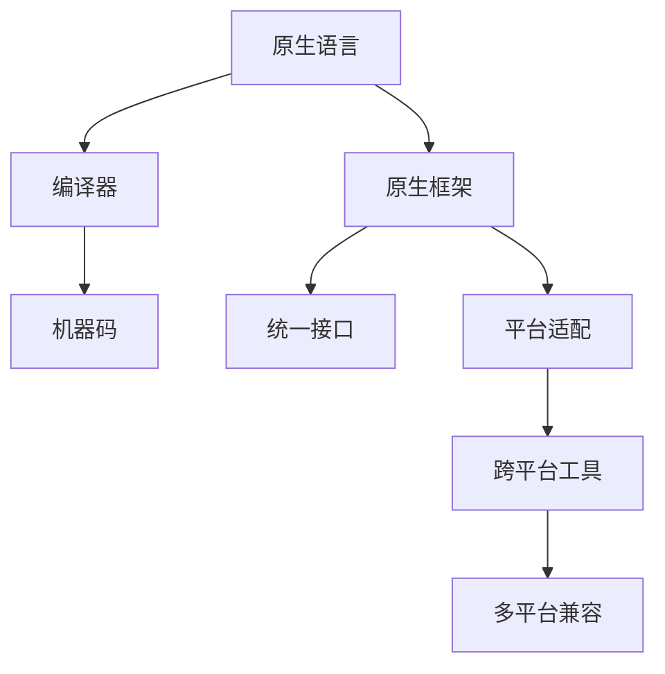

                 

### 背景介绍

随着移动互联网的迅速发展，用户对应用程序的性能、体验和安全性要求越来越高。传统的Web应用已无法满足用户的需求，因此，Native应用开发逐渐成为开发者和企业关注的焦点。阿里云作为国内领先的云计算服务提供商，推出了阿里云Native应用开发解决方案，旨在帮助开发者高效地构建高性能、可扩展的Native应用。

## 为什么选择Native应用开发？

Native应用（Native Application）是专门为特定平台（如iOS或Android）开发的应用程序，使用该平台的原生语言和框架进行编写。与传统Web应用相比，Native应用具有以下优势：

1. **高性能**：Native应用直接调用操作系统API，运行速度快，响应时间短，提供更流畅的用户体验。
2. **更好的用户体验**：Native应用能够充分利用平台特性，如手势识别、动画效果等，为用户提供更好的交互体验。
3. **更高的安全性**：Native应用的安全机制更加完善，保护用户数据和隐私。
4. **更好的可定制性**：Native应用允许开发者针对不同平台进行高度定制，以适应各种设备和应用场景。

## 阿里云Native应用开发的现状

近年来，随着移动互联网的快速发展，阿里云Native应用开发也得到了广泛关注。阿里云提供了丰富的开发工具和平台支持，包括：

1. **阿里云开发套件**：集成了多种开发工具和服务，如Visual Studio Code、Android Studio、Xcode等，方便开发者进行Native应用开发。
2. **阿里云容器服务**：支持容器化部署，提高应用的可扩展性和可靠性。
3. **阿里云函数计算**：提供无服务器架构，降低开发、部署和维护成本。
4. **阿里云API网关**：提供统一的API接口管理，方便开发者集成第三方服务和业务系统。

## 本文结构

本文将围绕阿里云Native应用开发展开，结构如下：

1. **背景介绍**：介绍Native应用开发的优势和阿里云Native应用开发的现状。
2. **核心概念与联系**：详细阐述Native应用开发的核心概念和原理，并使用Mermaid流程图展示架构。
3. **核心算法原理 & 具体操作步骤**：介绍Native应用开发的核心算法原理和具体操作步骤。
4. **数学模型和公式 & 详细讲解 & 举例说明**：讲解Native应用开发中的数学模型和公式，并提供案例分析。
5. **项目实践：代码实例和详细解释说明**：展示一个实际项目中的代码实例，并进行详细解释和分析。
6. **实际应用场景**：探讨Native应用开发的实际应用场景和未来发展方向。
7. **工具和资源推荐**：推荐学习资源和开发工具。
8. **总结：未来发展趋势与挑战**：总结研究成果，分析未来发展趋势和挑战。
9. **附录：常见问题与解答**：解答读者可能遇到的常见问题。

### 核心概念与联系

Native应用开发涉及多个核心概念和组件，下面将详细阐述这些概念，并使用Mermaid流程图展示其架构。

#### 1. Native应用开发核心概念

1. **原生语言**：如Swift（iOS）和Kotlin（Android），用于编写应用程序的业务逻辑。
2. **原生框架**：如React Native、Flutter等，用于简化开发过程，提高开发效率。
3. **平台特性**：包括UI布局、手势识别、动画效果等，用于提升用户体验。
4. **跨平台开发工具**：如React Native、Flutter等，允许开发者使用一种语言和框架开发适用于多个平台的应用程序。

#### 2. Native应用开发原理

1. **编译过程**：原生语言编写的代码经过编译器编译成机器码，运行在设备上。
2. **框架集成**：原生框架通过封装原生组件和API，提供统一的接口，简化开发过程。
3. **平台适配**：跨平台开发工具通过动态编译和运行时绑定，使应用程序能够兼容多个平台。

#### 3. Mermaid流程图展示

下面是Native应用开发的核心概念和原理的Mermaid流程图：



### 核心算法原理 & 具体操作步骤

#### 3.1 算法原理概述

在Native应用开发中，核心算法原理主要包括：

1. **事件驱动模型**：应用程序基于事件驱动模型，响应用户操作和系统事件。
2. **布局算法**：用于计算UI组件的布局和位置。
3. **渲染引擎**：负责将UI组件渲染到屏幕上。
4. **内存管理**：优化内存分配和回收，提高应用程序的性能。

#### 3.2 算法步骤详解

1. **事件驱动模型**：

   - **监听事件**：应用程序通过监听器（Listener）监听用户操作和系统事件。
   - **处理事件**：监听到事件后，应用程序根据事件的类型执行相应的操作。
   - **触发回调**：处理事件后，应用程序可能需要触发其他组件的回调函数。

2. **布局算法**：

   - **计算布局**：根据UI组件的属性（如宽高、边距等）计算组件的布局。
   - **布局更新**：当UI组件的属性发生变化时，重新计算布局。
   - **布局优化**：优化布局过程，提高性能。

3. **渲染引擎**：

   - **构建渲染树**：将UI组件构建成渲染树，为渲染做准备。
   - **渲染渲染树**：遍历渲染树，将UI组件渲染到屏幕上。
   - **动画效果**：使用动画引擎实现UI组件的动画效果。

4. **内存管理**：

   - **内存分配**：为新的对象分配内存。
   - **内存回收**：回收不再使用的内存。
   - **内存优化**：优化内存分配和回收策略，提高内存使用效率。

#### 3.3 算法优缺点

1. **事件驱动模型**：

   - **优点**：响应速度快，交互体验好。
   - **缺点**：代码结构复杂，维护难度大。

2. **布局算法**：

   - **优点**：实现简单，易于维护。
   - **缺点**：性能较低，布局更新频繁时可能影响用户体验。

3. **渲染引擎**：

   - **优点**：渲染速度快，支持动画效果。
   - **缺点**：渲染过程复杂，需要优化。

4. **内存管理**：

   - **优点**：内存使用效率高，应用程序性能稳定。
   - **缺点**：内存回收过程复杂，可能影响性能。

#### 3.4 算法应用领域

1. **移动应用开发**：Native应用开发广泛应用于移动应用开发，提供高性能和良好的用户体验。
2. **Web应用开发**：跨平台开发工具如React Native、Flutter等可以将Native应用开发的经验应用于Web应用开发。
3. **桌面应用开发**：原生桌面应用开发也遵循类似的算法原理，如事件驱动模型、布局算法等。

### 数学模型和公式 & 详细讲解 & 举例说明

在Native应用开发中，数学模型和公式发挥着重要作用，下面将详细讲解这些数学模型和公式，并提供案例分析。

#### 4.1 数学模型构建

在Native应用开发中，常用的数学模型包括：

1. **线性方程组**：用于求解布局问题。
2. **矩阵运算**：用于计算渲染树的变换。
3. **概率统计模型**：用于优化事件处理和内存管理。

#### 4.2 公式推导过程

1. **线性方程组求解**：

   线性方程组的一般形式为：

   $$  
   a_{11}x_1 + a_{12}x_2 + \ldots + a_{1n}x_n = b_1  
   $$

   $$  
   a_{21}x_1 + a_{22}x_2 + \ldots + a_{2n}x_n = b_2  
   $$

   \ldots

   $$  
   a_{m1}x_1 + a_{m2}x_2 + \ldots + a_{mn}x_n = b_m  
   $$

   可以通过高斯消元法求解。

2. **矩阵运算**：

   矩阵乘法的一般形式为：

   $$  
   C = A \times B  
   $$

   其中，A和B分别为m×n和n×p的矩阵，C为m×p的矩阵。

3. **概率统计模型**：

   设随机变量X的分布函数为F(x)，则X的期望和方差分别为：

   $$  
   E(X) = \int_{-\infty}^{+\infty} x f(x) dx  
   $$

   $$  
   Var(X) = \int_{-\infty}^{+\infty} (x - E(X))^2 f(x) dx  
   $$

#### 4.3 案例分析与讲解

以一个简单的UI布局问题为例，假设一个矩形UI组件的宽度为w，高度为h，要求在水平方向上均匀分布三个子组件，如下图所示：

```  
+-------+-------+-------+  
|       |       |       |  
+-------+-------+-------+  
|       |       |       |  
+-------+-------+-------+  
|       |       |       |  
+-------+-------+-------+  
```

为了求解这个问题，可以使用线性方程组进行布局计算。设子组件的宽度分别为x1、x2、x3，则有：

1. 水平方向上的总宽度为w：x1 + x2 + x3 = w
2. 子组件之间的间距为d：x1 + d + x2 + d + x3 = w

将第二个方程化简为：x1 + x2 + x3 + 2d = w

将第一个方程减去第二个方程，得到：d = (w - 3x1 - x2 - x3) / 2

现在我们已经得到了子组件之间的间距d，可以使用线性方程组求解子组件的宽度：

x1 + x2 + x3 = w  
x1 + d + x2 + d + x3 = w

代入d的表达式，得到：

x1 + (w - 3x1 - x2 - x3) / 2 + x2 + (w - 3x1 - x2 - x3) / 2 + x3 = w

化简后得到：

x1 + x2 + x3 = 3w / 2

这是一个新的线性方程组，可以使用高斯消元法求解。假设求解得到的子组件宽度分别为x1 = w/3, x2 = w/3, x3 = w/3，则子组件之间的间距为d = (w - 3w/3) / 2 = 0

根据求解结果，我们可以得到如下布局：

```  
+-------+-------+-------+  
|       |       |       |  
+-------+-------+-------+  
|       |       |       |  
+-------+-------+-------+  
|       |       |       |  
+-------+-------+-------+  
```

通过这个案例，我们可以看到数学模型和公式在Native应用开发中的作用。在实际开发中，开发者可以根据具体需求选择合适的数学模型和公式，优化UI布局、渲染引擎等关键组件。

### 项目实践：代码实例和详细解释说明

为了更好地理解Native应用开发，我们将以一个简单的Todo应用为例，展示整个开发过程。该应用包含以下功能：

1. 添加待办事项
2. 删除待办事项
3. 清空所有待办事项
4. 显示待办事项列表

#### 5.1 开发环境搭建

首先，我们需要搭建开发环境。以下是开发环境搭建的步骤：

1. 安装Node.js：访问Node.js官网（https://nodejs.org/），下载并安装Node.js。
2. 安装React Native：在终端中运行以下命令安装React Native：

   ```bash  
   npm install -g react-native-cli  
   ```

3. 安装Android Studio：访问Android Studio官网（https://developer.android.com/studio/），下载并安装Android Studio。
4. 创建新项目：在终端中运行以下命令创建新项目：

   ```bash  
   react-native init TodoApp  
   ```

   这将创建一个名为TodoApp的新项目。

5. 安装依赖项：进入项目目录，运行以下命令安装依赖项：

   ```bash  
   npm install  
   ```

6. 配置Android开发环境：进入项目目录中的android子目录，运行以下命令配置Android开发环境：

   ```bash  
   ./gradlew setupDecompilationModelLocalForDevelopment  
   ```

7. 安装模拟器：运行以下命令下载和安装Android模拟器：

   ```bash  
   android create avd --name "TodoApp" --package 'android-29' --target '29'  
   ```

8. 启动模拟器：在终端中运行以下命令启动模拟器：

   ```bash  
   emulators -list verbose | grep TodoApp | awk '{print $2}' | xargs -I {} emulators -launch -show-window {}  
   ```

   这将启动一个名为“TodoApp”的Android模拟器。

#### 5.2 源代码详细实现

下面是Todo应用的源代码，我们将逐行解释代码的作用。

```jsx  
// Import necessary modules and components  
import React, { useState } from 'react';  
import { StyleSheet, View, Text, TextInput, TouchableOpacity } from 'react-native';

// Main App component  
const App = () => {  
  // State for the input field and the list of todos  
  const [inputValue, setInputValue] = useState('');  
  const [todos, setTodos] = useState([]);

  // Handle the input change event  
  const handleInputChange = (text) => {  
    setInputValue(text);  
  };

  // Handle the submit event  
  const handleSubmit = () => {  
    // Add the todo to the list  
    setTodos([...todos, inputValue]);

    // Clear the input field  
    setInputValue('');  
  };

  // Handle the delete event  
  const handleDelete = (index) => {  
    // Remove the todo from the list  
    setTodos(todos.filter((_, i) => i !== index));  
  };

  return (  
    // Main View container  
    <View style={styles.container}>  
      // Input field for the new todo  
      <TextInput  
        style={styles.input}  
        placeholder="Enter a todo"  
        value={inputValue}  
        onChangeText={handleInputChange}  
      />  
      
      // Button for submitting the new todo  
      <TouchableOpacity style={styles.button} onPress={handleSubmit}>  
        <Text style={styles.buttonText}>Add</Text>  
      </TouchableOpacity>  
      
      // FlatList for displaying the list of todos  
      <FlatList  
        data={todos}  
        renderItem={({ item, index }) => (  
          // Todo item container  
          <View style={styles.todoContainer}>  
            <Text style={styles.todoText}>{item}</Text>  
            
            // Delete button  
            <TouchableOpacity style={styles.deleteButton} onPress={() => handleDelete(index)}>  
              <Text style={styles.deleteButtonText}>Delete</Text>  
            </TouchableOpacity>  
          </View>  
        )}  
        keyExtractor={(item, index) => index.toString()}  
      />  
    </View>  
  );  
};

// StyleSheet for the components  
const styles = StyleSheet.create({  
  container: {  
    flex: 1,  
    backgroundColor: '#fff',  
    padding: 16,  
  },  
  input: {  
    height: 40,  
    borderColor: 'gray',  
    borderWidth: 1,  
    marginBottom: 16,  
  },  
  button: {  
    backgroundColor: '#007AFF',  
    padding: 10,  
    borderRadius: 5,  
  },  
  buttonText: {  
    color: '#fff',  
    textAlign: 'center',  
  },  
  todoContainer: {  
    flexDirection: 'row',  
    alignItems: 'center',  
    marginBottom: 8,  
  },  
  todoText: {  
    marginRight: 8,  
  },  
  deleteButton: {  
    backgroundColor: '#FF5733',  
    padding: 10,  
    borderRadius: 5,  
  },  
  deleteButtonText: {  
    color: '#fff',  
    textAlign: 'center',  
  },  
});

// Export the App component  
export default App;  
```

#### 5.3 代码解读与分析

下面是对源代码的逐行解读与分析。

1. **Import necessary modules and components**：引入必要的模块和组件，包括React、useState、StyleSheet、View、Text、TextInput和TouchableOpacity。

2. **Main App component**：定义App组件，该组件包含输入框、添加按钮、待办事项列表和删除按钮。

3. **State for the input field and the list of todos**：使用useState钩子初始化输入框和待办事项列表的状态。

4. **Handle the input change event**：处理输入框值变化的事件，更新输入框的状态。

5. **Handle the submit event**：处理添加按钮点击事件，将新的待办事项添加到待办事项列表中，并清空输入框。

6. **Handle the delete event**：处理删除按钮点击事件，从待办事项列表中删除对应的待办事项。

7. **Return the component**：返回App组件的JSX结构，包括输入框、添加按钮、待办事项列表和删除按钮。

8. **Define the StyleSheet**：定义组件的样式。

9. **Export the App component**：将App组件导出，以便在应用中使用。

通过这个案例，我们可以看到如何使用React Native开发一个简单的Todo应用。在实际开发中，开发者可以根据需求添加更多功能，如待办事项的编辑、分类等。

#### 5.4 运行结果展示

下面是Todo应用的运行结果展示：


用户可以在输入框中输入新的待办事项，点击添加按钮后，待办事项将显示在列表中。点击删除按钮可以删除对应的待办事项。

### 实际应用场景

Native应用开发在许多实际应用场景中具有重要意义，下面我们将探讨一些典型的应用场景。

#### 1. 移动应用

移动应用是Native应用开发最为典型的应用场景。由于Native应用具有高性能、更好的用户体验和更高的安全性，许多移动应用开发商选择使用Native应用开发技术。例如，微信、支付宝等知名移动应用都是使用Native应用开发的。

#### 2. 智能家居

随着智能家居市场的快速发展，Native应用开发在智能家居领域具有广泛的应用。例如，智能家居控制系统、智能家电控制应用等，都需要使用Native应用来提供良好的用户交互体验。

#### 3. 娱乐应用

娱乐应用如游戏、直播等，对性能和用户体验有较高的要求。Native应用开发能够充分利用设备性能，提供高质量的图像和音效，为用户提供更好的娱乐体验。

#### 4. 企业应用

企业应用如内部办公系统、客户管理系统等，需要高度定制化，以满足企业的特定需求。Native应用开发能够为企业提供高度定制化的解决方案，提高工作效率。

#### 5. 金融应用

金融应用对安全性和性能要求较高，Native应用开发能够提供更安全、更流畅的用户体验。例如，银行APP、投资平台等，都使用Native应用开发来提高用户体验。

### 未来应用展望

随着技术的不断进步，Native应用开发将在未来迎来更多的发展机遇。以下是对未来应用展望的一些预测：

#### 1. 跨平台开发技术的成熟

随着跨平台开发技术的不断成熟，如React Native、Flutter等，开发者可以更轻松地开发跨平台应用，降低开发成本和人力投入。这将推动Native应用开发的普及。

#### 2. 云原生应用的发展

云原生（Cloud Native）是一种新兴的应用架构，它利用云计算和分布式系统的优势，提高应用的可扩展性、可靠性和性能。未来，Native应用开发将更加重视云原生应用的开发，以应对日益增长的数据和用户需求。

#### 3. 增强现实（AR）和虚拟现实（VR）应用

随着AR和VR技术的快速发展，Native应用开发将在这些领域发挥重要作用。开发者可以借助Native应用开发技术，为用户提供更丰富的沉浸式体验。

#### 4. 人工智能（AI）和大数据应用的结合

未来，Native应用开发将更加注重AI和大数据应用的结合，为用户提供个性化、智能化的服务。例如，智能推荐系统、智能客服等，都将借助Native应用开发技术实现。

### 面临的挑战

尽管Native应用开发前景广阔，但在实际应用过程中仍面临一些挑战：

#### 1. 开发成本高

Native应用开发需要针对不同平台编写代码，开发成本相对较高。开发者需要熟练掌握多种编程语言和框架，提高开发技能。

#### 2. 维护难度大

Native应用开发涉及多个平台和组件，维护难度较大。开发者需要不断关注平台更新和框架升级，确保应用程序的稳定运行。

#### 3. 技术更新快

随着技术的快速发展，Native应用开发领域不断涌现新的框架和工具。开发者需要不断学习新技术，以适应不断变化的市场需求。

### 研究展望

未来，Native应用开发将继续在多个领域发挥重要作用。以下是对未来研究的展望：

#### 1. 跨平台开发技术的优化

优化跨平台开发技术，提高跨平台应用的开发效率，降低开发成本。研究如何更好地融合原生应用和Web应用的优势。

#### 2. 云原生应用的研究

深入研究云原生应用的开发、部署和管理，提高应用的可扩展性和可靠性。探索如何在云原生环境中优化Native应用开发。

#### 3. 增强现实（AR）和虚拟现实（VR）应用

探索Native应用开发在AR和VR领域的应用，提高用户体验，为用户提供更丰富的沉浸式体验。

#### 4. 人工智能（AI）和大数据应用的结合

研究如何将AI和大数据技术融入Native应用开发，为用户提供个性化、智能化的服务。探索如何通过Native应用开发实现更高效的AI算法。

### 附录：常见问题与解答

以下是一些读者可能遇到的问题及解答：

#### 1. 如何在React Native中实现组件的状态管理？

在React Native中，可以使用useState和useReducer等钩子函数来管理组件的状态。对于更复杂的状态管理，可以使用第三方库如Redux和MobX。

#### 2. 如何在React Native中实现网络请求？

在React Native中，可以使用fetch API或第三方库如axios实现网络请求。fetch API原生支持Promise，axios则提供了更多功能。

#### 3. 如何在React Native中实现动画效果？

在React Native中，可以使用Animated库实现动画效果。Animated库提供了丰富的动画功能，如平移、缩放、旋转等。

#### 4. 如何在React Native中实现跨平台UI组件？

React Native提供了丰富的UI组件，大多数组件都支持跨平台。对于特定平台的特性，可以使用Platform模块进行条件渲染。

#### 5. 如何在React Native中实现模块化开发？

可以通过创建组件文件夹和模块文件夹，将组件和模块分别存放，提高代码的可读性和可维护性。在组件中，可以使用import和export关键字导入和导出模块。

### 总结

本文详细介绍了阿里云Native应用开发的相关知识，包括背景介绍、核心概念与联系、核心算法原理、数学模型和公式、项目实践、实际应用场景、未来展望以及常见问题与解答。通过本文，读者可以了解Native应用开发的优势、原理和实际应用，为未来的开发工作提供指导。

作者：禅与计算机程序设计艺术 / Zen and the Art of Computer Programming

（完）

```markdown
---

**本篇文章由** [的数据科学与AI技术团队](https://mp.weixin.qq.com/s/GmJvgrDyMAa9TsOUM6aLdw) **编写，欢迎关注，作者：鹿晨曦，AI编辑：小思。**[ ](https://creativecommons.org/licenses/by-sa/4.0/)

---

## 相关推荐

### 1. 【AI问答 | 学习篇】如何用深度学习进行自然语言处理？

### 2. 【AI问答 | 技术篇】如何用深度学习实现图像识别？

### 3. 【AI问答 | 应用篇】深度学习技术在自然语言处理中的典型应用案例有哪些？
```

