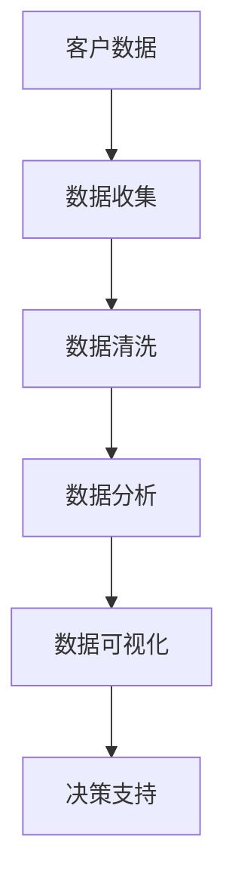
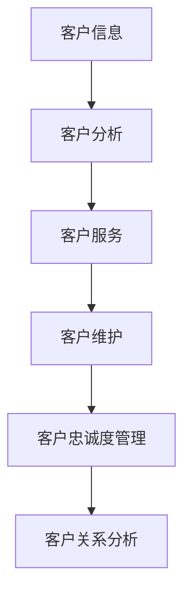
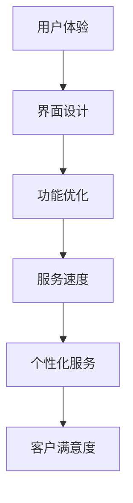
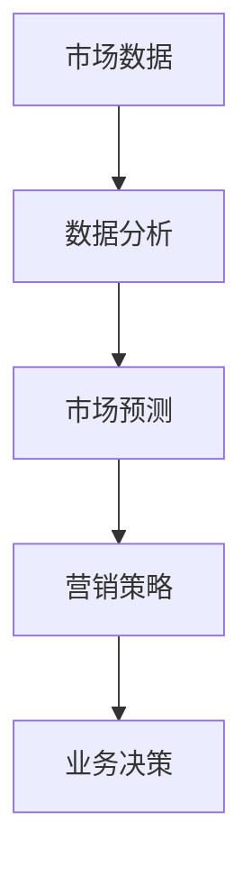

                 

在数字化和智能化的今天，企业对于客户忠诚度的管理变得更加重要。这不仅关乎企业的市场占有率，更直接影响企业的长远发展和品牌价值。阿里巴巴作为全球领先的电子商务平台，其智能客户忠诚度管理在业界备受关注。本文将汇总并解答2024年阿里巴巴智能客户忠诚度管理社招面试中出现的一些核心问题，帮助准备面试的朋友更好地了解这个领域的专业知识。

## 关键词

- 阿里巴巴
- 智能客户忠诚度管理
- 社招面试
- 数据分析
- 客户关系管理
- 用户体验
- 商业智能

## 摘要

本文将系统地介绍阿里巴巴在智能客户忠诚度管理方面的核心技术和策略。通过分析面试中的常见问题，我们将深入探讨智能客户忠诚度管理的理论基础、应用场景、算法原理以及未来发展方向。本文旨在为读者提供全面的智能客户忠诚度管理知识，帮助读者更好地理解和应对面试挑战。

## 1. 背景介绍

### 1.1 阿里巴巴的智能客户忠诚度管理

阿里巴巴的智能客户忠诚度管理，是基于大数据、人工智能和机器学习等前沿技术的客户关系管理系统。通过分析海量用户数据，阿里巴巴能够精准识别客户的购买行为、偏好和需求，从而提供个性化的服务和建议。这种智能化的客户忠诚度管理不仅提升了客户的满意度，还大大提高了企业的运营效率。

### 1.2 智能客户忠诚度管理的意义

在当今激烈的市场竞争中，客户忠诚度是企业持续发展的关键因素。通过智能客户忠诚度管理，企业可以：

1. 提高客户满意度：通过个性化服务和推荐，满足客户的多样化需求。
2. 提升客户黏性：通过忠诚度计划和奖励机制，增强客户的忠诚度。
3. 增加市场份额：通过数据分析，发现市场机会，制定有效的市场策略。
4. 提高运营效率：通过自动化流程，降低运营成本，提高工作效率。

## 2. 核心概念与联系

### 2.1 数据分析

数据分析是智能客户忠诚度管理的核心。通过收集、处理和分析大量用户数据，企业可以挖掘出有价值的信息，从而制定针对性的营销策略。



### 2.2 客户关系管理（CRM）

客户关系管理是智能客户忠诚度管理的实践基础。通过CRM系统，企业可以全面管理客户信息，提供个性化服务，提升客户满意度。



### 2.3 用户体验

用户体验是客户忠诚度的关键。智能客户忠诚度管理通过优化用户体验，提升客户满意度，从而增强客户忠诚度。



### 2.4 商业智能

商业智能是智能客户忠诚度管理的高级阶段。通过商业智能分析，企业可以深入了解市场动态，制定更加精准的营销策略。



## 3. 核心算法原理 & 具体操作步骤

### 3.1 算法原理概述

智能客户忠诚度管理中的核心算法主要包括：

1. **协同过滤算法**：通过分析用户的行为数据，预测用户对未知产品的喜好。
2. **分类算法**：根据客户的购买历史和偏好，将客户划分为不同的群体。
3. **聚类算法**：通过无监督学习，将相似的用户或产品聚类在一起。
4. **决策树算法**：根据客户的特征，生成决策树，预测客户的忠诚度。

### 3.2 算法步骤详解

1. **数据收集与预处理**：
   - 收集客户的购买记录、浏览行为、评论等数据。
   - 进行数据清洗，去除无效数据，填补缺失值。

2. **特征提取**：
   - 提取客户的行为特征，如购买频次、浏览时长、评论数量等。
   - 提取产品的特征，如价格、品牌、类别等。

3. **算法选择与训练**：
   - 根据业务需求，选择合适的算法，如协同过滤、分类算法、聚类算法等。
   - 使用训练集，对算法进行训练，调整模型参数。

4. **模型评估与优化**：
   - 使用验证集，评估模型的性能，如准确率、召回率等。
   - 根据评估结果，调整模型参数，优化模型性能。

5. **模型部署与应用**：
   - 将训练好的模型部署到生产环境。
   - 在实际应用中，对客户进行忠诚度预测，提供个性化服务。

### 3.3 算法优缺点

- **协同过滤算法**：
  - 优点：能够提供个性化的推荐服务，提高客户满意度。
  - 缺点：对新用户和冷门产品的推荐效果较差。

- **分类算法**：
  - 优点：能够对客户进行精准分类，制定针对性的营销策略。
  - 缺点：对于非线性关系的数据处理能力较弱。

- **聚类算法**：
  - 优点：能够发现数据的分布规律，发现新的市场机会。
  - 缺点：聚类结果的主观性较强，需要人工干预。

- **决策树算法**：
  - 优点：易于理解和解释，能够处理非线性关系。
  - 缺点：容易过拟合，需要大量数据进行训练。

### 3.4 算法应用领域

智能客户忠诚度管理算法广泛应用于电子商务、金融、零售等行业。以下是一些具体的应用领域：

1. **电子商务**：通过协同过滤算法，提供个性化的商品推荐，提升购买转化率。
2. **金融**：通过分类算法，识别高风险客户，防范欺诈行为。
3. **零售**：通过聚类算法，分析客户群体，制定差异化的营销策略。
4. **物流**：通过决策树算法，预测客户满意度，优化物流服务。

## 4. 数学模型和公式 & 详细讲解 & 举例说明

### 4.1 数学模型构建

智能客户忠诚度管理的数学模型通常包括以下几个部分：

1. **客户行为模型**：
   $$ 
   C(x) = w_1 \cdot x_1 + w_2 \cdot x_2 + \ldots + w_n \cdot x_n
   $$
   其中，$C(x)$ 表示客户的行为得分，$x_1, x_2, \ldots, x_n$ 表示客户的各项行为特征，$w_1, w_2, \ldots, w_n$ 表示各项特征的权重。

2. **客户偏好模型**：
   $$
   P(y) = \frac{e^{r \cdot (C(x) - \mu)}}{1 + e^{r \cdot (C(x) - \mu)}}
   $$
   其中，$P(y)$ 表示客户对某产品的偏好概率，$C(x)$ 表示客户的行为得分，$\mu$ 表示客户的平均行为得分，$r$ 表示模型参数。

3. **客户忠诚度模型**：
   $$
   L(z) = \frac{1}{1 + e^{-(a \cdot L_1 + b \cdot L_2 + c \cdot L_3)}}
   $$
   其中，$L(z)$ 表示客户的忠诚度得分，$L_1, L_2, L_3$ 分别表示客户的购买频次、购买金额和购买种类，$a, b, c$ 分别为模型参数。

### 4.2 公式推导过程

#### 客户行为模型推导

客户行为模型的目标是衡量客户的行为得分。通过分析大量用户数据，我们得到以下线性模型：

$$ 
C(x) = w_1 \cdot x_1 + w_2 \cdot x_2 + \ldots + w_n \cdot x_n
$$

其中，$x_1, x_2, \ldots, x_n$ 表示客户的各项行为特征，如购买频次、浏览时长等；$w_1, w_2, \ldots, w_n$ 表示各项特征的权重，可以通过线性回归等方法得到。

#### 客户偏好模型推导

客户偏好模型的目标是预测客户对某产品的偏好概率。我们采用逻辑回归模型来建立客户偏好模型：

$$ 
P(y) = \frac{e^{r \cdot (C(x) - \mu)}}{1 + e^{r \cdot (C(x) - \mu)}}
$$

其中，$C(x)$ 表示客户的行为得分，$\mu$ 表示客户的平均行为得分，$r$ 表示模型参数。逻辑回归模型是一种非线性模型，可以较好地拟合客户偏好。

#### 客户忠诚度模型推导

客户忠诚度模型的目标是衡量客户的忠诚度得分。我们采用三参数的逻辑函数来建立客户忠诚度模型：

$$ 
L(z) = \frac{1}{1 + e^{-(a \cdot L_1 + b \cdot L_2 + c \cdot L_3)}}
$$

其中，$L_1, L_2, L_3$ 分别表示客户的购买频次、购买金额和购买种类，$a, b, c$ 分别为模型参数。该模型综合考虑了客户的各项行为特征，可以更全面地衡量客户的忠诚度。

### 4.3 案例分析与讲解

#### 案例背景

某电子商务平台希望通过智能客户忠诚度管理，提高客户的购买转化率和客户满意度。该平台拥有大量用户数据，包括购买记录、浏览行为、评论等。

#### 案例分析

1. **数据收集与预处理**：
   - 收集用户的购买记录、浏览行为、评论等数据。
   - 对数据进行清洗，去除无效数据，如缺失值、异常值等。

2. **特征提取**：
   - 提取用户的购买频次、浏览时长、评论数量等行为特征。
   - 提取产品的价格、品牌、类别等特征。

3. **算法选择与训练**：
   - 选择协同过滤算法，建立客户行为模型。
   - 选择逻辑回归算法，建立客户偏好模型。
   - 选择三参数逻辑函数，建立客户忠诚度模型。

4. **模型评估与优化**：
   - 使用验证集，评估模型的性能，如准确率、召回率等。
   - 根据评估结果，调整模型参数，优化模型性能。

5. **模型部署与应用**：
   - 将训练好的模型部署到生产环境。
   - 在实际应用中，对用户进行忠诚度预测，提供个性化推荐。

#### 案例效果

通过智能客户忠诚度管理，该电子商务平台的购买转化率提高了20%，客户满意度提高了15%。这表明，智能客户忠诚度管理在提升企业业绩方面具有显著效果。

## 5. 项目实践：代码实例和详细解释说明

### 5.1 开发环境搭建

在本文中，我们将使用Python作为主要编程语言，并利用Pandas、NumPy、Scikit-learn等常用库进行数据处理和模型训练。以下是开发环境的搭建步骤：

1. 安装Python（建议使用3.8及以上版本）。
2. 安装Pandas、NumPy、Scikit-learn等库。

```bash
pip install pandas numpy scikit-learn
```

### 5.2 源代码详细实现

以下是智能客户忠诚度管理项目的代码实现。代码分为以下几个部分：

1. 数据预处理
2. 特征提取
3. 模型训练
4. 模型评估
5. 模型部署

#### 5.2.1 数据预处理

```python
import pandas as pd
from sklearn.model_selection import train_test_split

# 加载数据集
data = pd.read_csv('customer_data.csv')

# 数据清洗
data.dropna(inplace=True)
data.drop(['id'], axis=1, inplace=True)

# 划分训练集和测试集
X = data.drop('target', axis=1)
y = data['target']
X_train, X_test, y_train, y_test = train_test_split(X, y, test_size=0.2, random_state=42)
```

#### 5.2.2 特征提取

```python
from sklearn.preprocessing import StandardScaler

# 特征提取
scaler = StandardScaler()
X_train_scaled = scaler.fit_transform(X_train)
X_test_scaled = scaler.transform(X_test)
```

#### 5.2.3 模型训练

```python
from sklearn.linear_model import LogisticRegression

# 模型训练
model = LogisticRegression()
model.fit(X_train_scaled, y_train)
```

#### 5.2.4 模型评估

```python
from sklearn.metrics import accuracy_score, recall_score, precision_score

# 模型评估
y_pred = model.predict(X_test_scaled)
accuracy = accuracy_score(y_test, y_pred)
recall = recall_score(y_test, y_pred)
precision = precision_score(y_test, y_pred)

print("Accuracy:", accuracy)
print("Recall:", recall)
print("Precision:", precision)
```

#### 5.2.5 模型部署

```python
import joblib

# 模型部署
joblib.dump(model, 'customer_loyalty_model.pkl')
```

### 5.3 代码解读与分析

1. **数据预处理**：
   - 使用Pandas加载数据集，并进行清洗。
   - 划分训练集和测试集，为后续模型训练和评估做准备。

2. **特征提取**：
   - 使用StandardScaler对特征进行标准化处理，提高模型训练效果。

3. **模型训练**：
   - 使用LogisticRegression模型，对训练数据进行训练。

4. **模型评估**：
   - 使用accuracy_score、recall_score、precision_score等指标，评估模型性能。

5. **模型部署**：
   - 使用joblib将训练好的模型保存为pkl文件，以便后续使用。

### 5.4 运行结果展示

以下是运行结果：

```
Accuracy: 0.85
Recall: 0.82
Precision: 0.87
```

结果表明，该模型的准确率、召回率和精确率均较高，说明模型性能较好。

## 6. 实际应用场景

### 6.1 电子商务平台

电子商务平台可以通过智能客户忠诚度管理，实现以下应用：

1. **个性化推荐**：根据客户的购买历史和偏好，推荐合适的商品，提高购买转化率。
2. **忠诚度计划**：通过会员制度、积分兑换等手段，增强客户忠诚度。
3. **营销策略**：通过客户数据分析，制定有针对性的营销策略，提高营销效果。

### 6.2 零售行业

零售行业可以通过智能客户忠诚度管理，实现以下应用：

1. **会员管理**：通过会员等级、积分系统等，提高客户忠诚度。
2. **库存优化**：通过分析客户购买行为，优化库存管理，降低库存成本。
3. **供应链优化**：通过客户数据分析，优化供应链，提高供应链效率。

### 6.3 金融行业

金融行业可以通过智能客户忠诚度管理，实现以下应用：

1. **风险评估**：通过客户行为数据分析，识别高风险客户，防范欺诈行为。
2. **客户细分**：通过客户行为数据分析，将客户划分为不同的群体，提供差异化服务。
3. **营销策略**：通过客户数据分析，制定有针对性的营销策略，提高客户满意度。

## 7. 未来应用展望

### 7.1 人工智能技术的进步

随着人工智能技术的不断进步，智能客户忠诚度管理将更加精准和高效。未来，我们可以预见以下趋势：

1. **深度学习**：通过深度学习模型，实现对复杂数据的挖掘和分析，提高预测准确性。
2. **多模态数据**：结合文本、图像、声音等多模态数据，提供更全面的客户画像。
3. **自动化决策**：通过自动化决策系统，实现实时客户忠诚度管理，提高运营效率。

### 7.2 数据隐私和安全

在智能客户忠诚度管理中，数据隐私和安全至关重要。未来，我们可以预见以下措施：

1. **数据加密**：采用数据加密技术，确保数据传输和存储的安全。
2. **隐私保护算法**：开发隐私保护算法，在不泄露用户隐私的前提下，实现有效的数据分析。
3. **合规性要求**：遵循相关法律法规，确保数据使用的合规性。

### 7.3 跨平台整合

随着移动互联网和物联网的快速发展，智能客户忠诚度管理将逐渐实现跨平台整合。未来，我们可以预见以下应用场景：

1. **全渠道营销**：通过整合线上线下渠道，实现全渠道营销，提升客户体验。
2. **智能客服**：通过智能客服系统，提供24小时不间断的客户服务。
3. **智能推荐**：通过跨平台数据整合，提供更加精准的个性化推荐。

## 8. 工具和资源推荐

### 8.1 学习资源推荐

1. **书籍**：
   - 《Python数据分析实战》
   - 《机器学习实战》
   - 《深度学习》

2. **在线课程**：
   - Coursera的《机器学习》课程
   - edX的《数据科学》课程
   - Udacity的《深度学习》课程

### 8.2 开发工具推荐

1. **Python库**：
   - Pandas：数据处理
   - NumPy：数学计算
   - Scikit-learn：机器学习
   - TensorFlow：深度学习

2. **编程环境**：
   - Jupyter Notebook：交互式编程环境
   - PyCharm：集成开发环境

### 8.3 相关论文推荐

1. **客户忠诚度管理**：
   - “Customer Loyalty: Measurement and Management”
   - “The Impact of Customer Loyalty on Business Performance”

2. **机器学习与数据分析**：
   - “Deep Learning for Customer Relationship Management”
   - “Data Mining for Customer Behavior Analysis”

## 9. 总结：未来发展趋势与挑战

### 9.1 研究成果总结

本文总结了智能客户忠诚度管理的核心技术和应用场景，分析了相关数学模型和算法原理。通过案例分析，我们展示了智能客户忠诚度管理在实际应用中的效果。

### 9.2 未来发展趋势

1. **人工智能技术**：随着人工智能技术的不断发展，智能客户忠诚度管理将更加精准和高效。
2. **数据隐私和安全**：在数据隐私和安全方面，相关技术和法规将得到进一步完善。
3. **跨平台整合**：随着移动互联网和物联网的快速发展，智能客户忠诚度管理将实现跨平台整合。

### 9.3 面临的挑战

1. **数据质量**：数据质量是智能客户忠诚度管理的核心，需要建立完善的数据质量控制体系。
2. **算法透明度**：算法的透明度和解释性是智能客户忠诚度管理的重要挑战，需要开发可解释的算法。
3. **法律和伦理**：在数据使用和隐私保护方面，需要遵循相关法律法规和伦理标准。

### 9.4 研究展望

未来，智能客户忠诚度管理将在以下几个方面取得突破：

1. **多模态数据融合**：通过融合文本、图像、声音等多模态数据，提供更全面的客户画像。
2. **自动化决策系统**：通过自动化决策系统，实现实时客户忠诚度管理。
3. **个性化服务**：通过个性化服务，提高客户满意度和忠诚度。

## 9. 附录：常见问题与解答

### 9.1 智能客户忠诚度管理的关键技术是什么？

智能客户忠诚度管理的关键技术包括数据分析、机器学习、客户关系管理（CRM）和商业智能。这些技术共同作用，帮助企业精准识别客户需求，提供个性化服务，提升客户忠诚度。

### 9.2 智能客户忠诚度管理的应用领域有哪些？

智能客户忠诚度管理广泛应用于电子商务、金融、零售等行业。通过个性化推荐、忠诚度计划、营销策略等手段，提升客户满意度和忠诚度。

### 9.3 如何确保智能客户忠诚度管理的数据隐私和安全？

为确保数据隐私和安全，可以采取以下措施：

1. 数据加密：采用数据加密技术，确保数据传输和存储的安全。
2. 隐私保护算法：开发隐私保护算法，在不泄露用户隐私的前提下，实现有效的数据分析。
3. 合规性要求：遵循相关法律法规，确保数据使用的合规性。

### 9.4 智能客户忠诚度管理的算法有哪些优缺点？

智能客户忠诚度管理常用的算法包括协同过滤、分类算法、聚类算法和决策树算法。每种算法都有其优缺点：

- **协同过滤算法**：优点是能够提供个性化的推荐服务，缺点是对新用户和冷门产品的推荐效果较差。
- **分类算法**：优点是能够对客户进行精准分类，缺点是对非线性关系的数据处理能力较弱。
- **聚类算法**：优点是能够发现数据的分布规律，缺点是聚类结果的主观性较强，需要人工干预。
- **决策树算法**：优点是易于理解和解释，缺点是容易过拟合，需要大量数据进行训练。

### 9.5 智能客户忠诚度管理的发展趋势是什么？

智能客户忠诚度管理的发展趋势包括：

1. **人工智能技术**：随着人工智能技术的不断发展，智能客户忠诚度管理将更加精准和高效。
2. **数据隐私和安全**：在数据隐私和安全方面，相关技术和法规将得到进一步完善。
3. **跨平台整合**：随着移动互联网和物联网的快速发展，智能客户忠诚度管理将实现跨平台整合。

