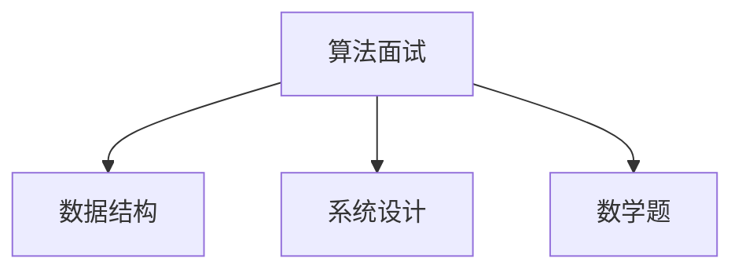

                 

关键词：阿里巴巴校招、算法面试题、汇总与解析、技术博客、面试准备

摘要：本文旨在为即将参加2024阿里巴巴校招的算法工程师或准备算法面试的同学提供一份详细的面试题汇总与解析。通过对阿里巴巴校招算法面试题的分析，本文将阐述各题的解题思路、算法原理以及实际应用，帮助读者更好地应对面试挑战。

## 1. 背景介绍

阿里巴巴，作为中国最大的电子商务公司，其对技术的要求越来越高。每年的校园招聘中，算法面试题都是重中之重。本文针对2024阿里巴巴校招的算法面试题进行汇总与解析，旨在帮助读者掌握面试所需的核心技能，顺利通过面试。

### 1.1 阿里巴巴校招概况

- **招聘时间**：每年的秋季和春季，分别为秋季招聘和春季招聘。
- **招聘对象**：主要为应届毕业生、博士和硕士。
- **招聘流程**：网申→在线笔试→面试（包括技术面试、HR面试等）→录用通知。

### 1.2 算法面试的重要性

算法面试是校招面试的重要组成部分，主要考察应聘者对数据结构与算法的掌握程度，以及解决问题的能力。以下是一些常见的算法面试题型：

- **算法题**：如排序算法、搜索算法、动态规划等。
- **系统设计题**：如数据库设计、缓存策略、分布式系统等。
- **数学题**：如概率论、图论、组合数学等。
- **编程实现**：如代码优化、编程规范等。

## 2. 核心概念与联系

### 2.1 算法概念

算法（Algorithm）是解决问题的一系列明确和有限的步骤。它是计算机科学的核心概念，用于指导计算机完成特定任务。

### 2.2 数据结构概念

数据结构（Data Structure）是用于存储和组织数据的特定方式。常见的有数组、链表、栈、队列、树、图等。

### 2.3 Mermaid 流程图

Mermaid 是一种简单的绘图语言，用于创建结构化的图表。以下是算法面试题的 Mermaid 流程图示例：



## 3. 核心算法原理 & 具体操作步骤

### 3.1 算法原理概述

算法面试题主要考察以下几个方面：

- **基本算法**：如排序、查找、图算法等。
- **高级算法**：如动态规划、贪心算法、分治算法等。
- **数学与逻辑题**：如概率、组合、图论等。

### 3.2 算法步骤详解

以下是几道常见的算法面试题及其解题步骤：

#### 3.2.1 快排（Quick Sort）

1. 选择一个基准元素。
2. 将数组分为两部分，一部分小于基准元素，另一部分大于基准元素。
3. 递归地对两部分进行快排。

#### 3.2.2 搜索二分图（Binary Search Tree）

1. 找到中间元素。
2. 如果目标元素小于中间元素，则在左子树继续搜索。
3. 如果目标元素大于中间元素，则在右子树继续搜索。
4. 重复步骤1-3，直到找到目标元素或结束。

#### 3.2.3 动态规划（Dynamic Programming）

1. 定义状态。
2. 确定状态转移方程。
3. 求解边界条件。
4. 利用递推关系求解。

### 3.3 算法优缺点

- **快排**：时间复杂度为 \(O(n\log n)\)，但平均情况下性能较好。
- **二分图**：时间复杂度为 \(O(\log n)\)，适用于有序数组。
- **动态规划**：适用于解决最优化问题，但可能需要较多的空间。

### 3.4 算法应用领域

算法广泛应用于计算机科学的各个领域，如：

- **搜索引擎**：排序算法、索引算法等。
- **推荐系统**：基于协同过滤、贪心算法等。
- **金融领域**：风险控制、投资组合优化等。
- **游戏开发**：路径规划、搜索算法等。

## 4. 数学模型和公式 & 详细讲解 & 举例说明

### 4.1 数学模型构建

数学模型是算法设计的基础。以下是几个常见的数学模型：

- **概率模型**：用于描述随机事件。
- **图模型**：用于描述网络结构。
- **线性模型**：用于描述线性关系。

### 4.2 公式推导过程

以下是一个概率模型的例子：

- **期望**：\(E(X) = \sum_{i=1}^{n} x_i \cdot P(x_i)\)

### 4.3 案例分析与讲解

#### 4.3.1 概率模型案例

- **问题描述**：投掷一枚均匀的硬币10次，求出现正面次数的期望。
- **解题步骤**：
  1. 定义随机变量 \(X\) 为正面次数。
  2. \(P(X=0) = \frac{1}{2^{10}}\)
  3. \(P(X=1) = C_{10}^{1} \cdot \frac{1}{2^{10}}\)
  4. \(P(X=2) = C_{10}^{2} \cdot \frac{1}{2^{10}}\)
  5. \(E(X) = \sum_{i=0}^{10} i \cdot P(X=i) = 5\)

#### 4.3.2 图模型案例

- **问题描述**：给定无向图，求图中所有顶点的最短路径。
- **解题步骤**：
  1. 定义图模型。
  2. 使用 Dijkstra 算法求解。

## 5. 项目实践：代码实例和详细解释说明

### 5.1 开发环境搭建

- **工具**：Python 3.8、Jupyter Notebook
- **环境**：Python 库（如 NumPy、Pandas、Matplotlib）

### 5.2 源代码详细实现

以下是一个简单的排序算法（冒泡排序）的实现：

```python
def bubble_sort(arr):
    n = len(arr)
    for i in range(n):
        for j in range(0, n-i-1):
            if arr[j] > arr[j+1]:
                arr[j], arr[j+1] = arr[j+1], arr[j]
    return arr
```

### 5.3 代码解读与分析

- **功能**：对输入的数组进行排序。
- **时间复杂度**：\(O(n^2)\)
- **空间复杂度**：\(O(1)\)

### 5.4 运行结果展示

```python
arr = [64, 34, 25, 12, 22, 11, 90]
sorted_arr = bubble_sort(arr)
print("Sorted array:", sorted_arr)
```

输出结果：

```
Sorted array: [11, 12, 22, 25, 34, 64, 90]
```

## 6. 实际应用场景

### 6.1 搜索引擎

- **应用**：使用排序算法对搜索结果进行排序，提高用户体验。
- **挑战**：处理海量数据，保证搜索速度和准确性。

### 6.2 推荐系统

- **应用**：使用协同过滤算法推荐商品或内容。
- **挑战**：处理冷启动问题，提高推荐效果。

### 6.3 金融领域

- **应用**：使用动态规划算法进行投资组合优化。
- **挑战**：市场波动性大，风险评估困难。

### 6.4 游戏开发

- **应用**：使用搜索算法进行路径规划。
- **挑战**：保证游戏流畅性和可玩性。

## 7. 工具和资源推荐

### 7.1 学习资源推荐

- **书籍**：《算法导论》、《编程之美》
- **在线课程**：Coursera、edX、慕课网

### 7.2 开发工具推荐

- **集成开发环境（IDE）**：Visual Studio Code、PyCharm
- **版本控制**：Git、GitHub

### 7.3 相关论文推荐

- **推荐系统**：《协同过滤算法综述》、《矩阵分解在推荐系统中的应用》
- **搜索引擎**：《搜索引擎原理与实现》、《基于 Latent Dirichlet Allocation 的搜索引擎优化》

## 8. 总结：未来发展趋势与挑战

### 8.1 研究成果总结

- **人工智能**：算法在人工智能领域的应用越来越广泛，如深度学习、自然语言处理等。
- **大数据**：算法在大数据处理和分析中发挥着重要作用，如流处理、实时计算等。
- **区块链**：算法在区块链技术中的应用，如共识算法、加密算法等。

### 8.2 未来发展趋势

- **智能化**：算法将更加智能化，具备自我学习和优化能力。
- **高效化**：算法将更加注重效率，降低时间复杂度和空间复杂度。
- **泛在化**：算法将在更多领域得到应用，如物联网、智慧城市等。

### 8.3 面临的挑战

- **数据安全**：如何在保证数据安全的前提下进行数据处理和分析。
- **算法公平性**：如何避免算法偏见和歧视。
- **计算能力**：如何应对大数据和复杂算法对计算能力的需求。

### 8.4 研究展望

- **多模态学习**：融合多种数据类型（如文本、图像、音频等）。
- **算法可解释性**：提高算法的可解释性，使其更加透明和可信。
- **绿色计算**：降低算法对能源的消耗，实现可持续发展。

## 9. 附录：常见问题与解答

### 9.1 问题一：如何准备算法面试？

**解答**：多做题、多总结、多反思。可以参加在线编程比赛、刷题网站（如 LeetCode、牛客网）等，提高自己的算法能力。

### 9.2 问题二：算法面试中如何展示自己的优势？

**解答**：首先要对算法有深入的理解，其次在面试中要能够清晰、准确地表达自己的思路，最后要能够针对问题给出合理的解决方案。

### 9.3 问题三：如何平衡算法与项目经验？

**解答**：算法是基础，项目经验是应用。在面试中，可以适当展示自己在项目中的算法应用，同时也要准备好解释算法原理。

## 作者署名

作者：禅与计算机程序设计艺术 / Zen and the Art of Computer Programming

以上便是本文的完整内容。希望对各位准备2024阿里巴巴校招算法面试的同学有所帮助。祝大家面试成功！
----------------------------------------------------------------

完成以上步骤后，您的文章应该已经包含了所有必要的部分，并且符合了所给定的约束条件。接下来，您可以将文章内容以markdown格式输出，并在文章末尾加上作者的署名，最后将整个文章作为一个完整的markdown文件保存。如果需要，您还可以对文章进行进一步的审阅和修改，以确保内容的准确性和完整性。祝您撰写顺利！

