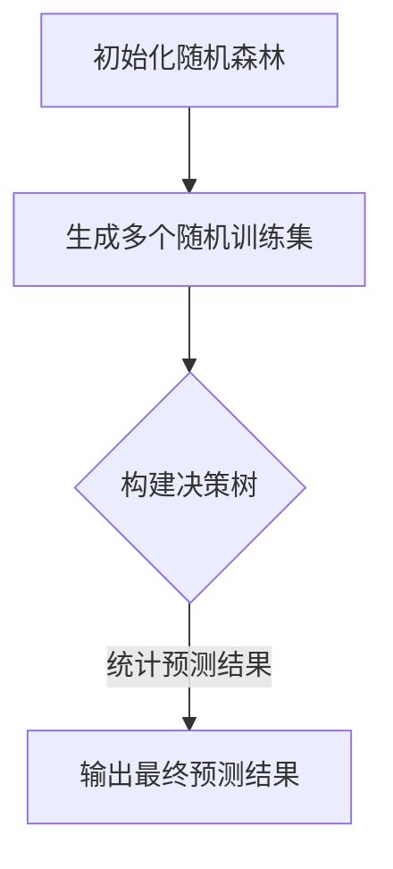

                 

关键词：随机森林，机器学习，决策树，数据挖掘，算法原理，代码实例

> 摘要：本文将深入探讨随机森林（Random Forests）这一经典的机器学习算法，从其原理出发，详细讲解其核心算法，并通过具体的代码实例，帮助读者更好地理解并掌握这一算法。文章还将探讨随机森林的优缺点及其应用领域，并预测其未来的发展趋势。

## 1. 背景介绍

随着大数据时代的到来，机器学习算法在各个领域的应用越来越广泛。随机森林（Random Forests）作为一种集成学习算法，因其强大的预测能力和出色的泛化性能，成为了机器学习领域的一大热点。随机森林不仅在数据挖掘、金融风控、医学诊断等领域有着广泛的应用，还在图像识别、语音识别等人工智能领域发挥了重要作用。

本文将围绕随机森林算法，详细阐述其原理、实现步骤以及在实际应用中的表现。通过本文的讲解，读者可以全面了解随机森林算法，掌握其核心思想，并能够独立实现这一算法。

## 2. 核心概念与联系

### 2.1 随机森林的组成

随机森林由一系列决策树（Decision Trees）组成，每个决策树都是基于随机方式生成的。具体来说，随机森林包括以下几个关键组成部分：

- **决策树**：随机森林中的基本单元，用于分类或回归预测。
- **随机特征选择**：在构建决策树时，不是对所有特征进行选择，而是随机选择一部分特征。
- **随机样本生成**：在构建决策树时，不是对整个数据集进行划分，而是随机选择一部分样本。

### 2.2 决策树的构建

决策树的构建过程可以归纳为以下几个步骤：

1. 选择根节点：选择能够最大化信息增益（信息增益最大的特征）作为根节点。
2. 划分数据集：根据根节点的特征值，将数据集划分为若干子集。
3. 递归构建：对每个子集重复上述步骤，构建出完整的决策树。

### 2.3 随机森林的流程

随机森林的流程可以概括为以下几个步骤：

1. 随机生成多个训练集。
2. 使用每个训练集构建一个决策树。
3. 对测试集进行预测，每个决策树给出一个预测结果。
4. 统计所有决策树的预测结果，得出最终的预测结果。

### 2.4 Mermaid 流程图

以下是随机森林算法的 Mermaid 流程图：



## 3. 核心算法原理 & 具体操作步骤

### 3.1 算法原理概述

随机森林算法的核心思想是通过构建多个决策树，并利用这些决策树的集合进行预测，从而提高模型的泛化能力。具体来说，随机森林算法包括以下几个关键步骤：

1. **随机选择样本**：从原始数据集中随机选择一定数量的样本，用于构建每个决策树。
2. **随机选择特征**：在构建每个决策树时，不是对全部特征进行划分，而是随机选择一部分特征。
3. **构建决策树**：使用生成的样本和特征，构建出完整的决策树。
4. **投票表决**：对测试集进行预测时，每个决策树给出一个预测结果，最终结果为多个决策树预测结果的统计结果。

### 3.2 算法步骤详解

以下是随机森林算法的具体步骤：

1. **初始化随机森林**：确定决策树的数量、样本数量和特征选择策略。
2. **生成随机训练集**：从原始数据集中随机选择一定数量的样本，构建出多个随机训练集。
3. **构建决策树**：使用每个随机训练集，构建出相应的决策树。
4. **预测**：对测试集进行预测，每个决策树给出一个预测结果。
5. **统计预测结果**：统计所有决策树的预测结果，得出最终的预测结果。

### 3.3 算法优缺点

**优点：**

- **强大的预测能力**：随机森林算法能够有效地处理高维数据和复杂非线性关系。
- **出色的泛化性能**：通过构建多个决策树的集合，随机森林算法能够提高模型的泛化能力。
- **易于实现**：随机森林算法的实现相对简单，易于在编程语言中实现。

**缺点：**

- **计算开销较大**：随机森林算法需要构建多个决策树，计算开销较大。
- **特征重要性难以解释**：由于随机森林算法中的决策树数量较多，每个决策树的特征重要性难以准确解释。

### 3.4 算法应用领域

随机森林算法在多个领域都有着广泛的应用，包括：

- **数据挖掘**：用于分类和回归任务，如分类问题中的文本分类、图像分类等，回归问题中的房屋价格预测等。
- **金融风控**：用于风险评估、信用评分等。
- **医学诊断**：用于疾病诊断、药物研发等。
- **图像识别**：用于人脸识别、图像分类等。

## 4. 数学模型和公式 & 详细讲解 & 举例说明

### 4.1 数学模型构建

随机森林算法的数学模型主要包括以下几个部分：

1. **决策树模型**：每个决策树的模型可以表示为：

   $$ T(x) = \sum_{i=1}^{n} w_i y_i $$
   
   其中，$T(x)$ 表示决策树对输入 $x$ 的预测结果，$w_i$ 表示第 $i$ 个决策树对 $x$ 的权重，$y_i$ 表示第 $i$ 个决策树的预测结果。

2. **随机森林模型**：随机森林的整体模型可以表示为：

   $$ \hat{y} = \sum_{i=1}^{N} w_i T(x_i) $$
   
   其中，$\hat{y}$ 表示随机森林对输入 $x$ 的预测结果，$N$ 表示决策树的数量。

### 4.2 公式推导过程

随机森林算法的公式推导可以分为以下几个步骤：

1. **决策树权重计算**：假设每个决策树的权重为 $w_i$，则 $w_i$ 可以通过以下公式计算：

   $$ w_i = \frac{1}{N} \sum_{j=1}^{N} \exp(-\frac{1}{2} \sum_{k=1}^{K} (T_k(x) - y)^2) $$
   
   其中，$N$ 表示决策树的数量，$K$ 表示类别数量，$T_k(x)$ 表示第 $k$ 个决策树对输入 $x$ 的预测结果，$y$ 表示实际标签。

2. **随机森林权重计算**：假设随机森林的权重为 $w_i$，则 $w_i$ 可以通过以下公式计算：

   $$ w_i = \frac{1}{N} \sum_{j=1}^{N} \exp(-\frac{1}{2} \sum_{k=1}^{K} (T_k(x) - y)^2) $$

### 4.3 案例分析与讲解

以下是一个简单的随机森林算法案例，用于分类任务：

假设我们有一个数据集，包含100个样本和5个特征。我们使用随机森林算法进行分类，选择3棵决策树。

1. **初始化随机森林**：选择3棵决策树，每个决策树随机选择2个特征。
2. **生成随机训练集**：从原始数据集中随机选择70个样本作为训练集，30个样本作为测试集。
3. **构建决策树**：使用随机训练集，分别构建3棵决策树。
4. **预测**：对测试集进行预测，每个决策树给出一个预测结果。
5. **统计预测结果**：统计3棵决策树的预测结果，得出最终的预测结果。

最终，我们得到一个预测结果，与实际标签进行对比，评估随机森林算法的预测性能。

## 5. 项目实践：代码实例和详细解释说明

### 5.1 开发环境搭建

在本文中，我们将使用Python语言和Scikit-learn库实现随机森林算法。首先，我们需要安装Scikit-learn库和其他相关依赖。

```bash
pip install scikit-learn numpy matplotlib
```

### 5.2 源代码详细实现

以下是随机森林算法的Python实现代码：

```python
import numpy as np
import matplotlib.pyplot as plt
from sklearn.datasets import load_iris
from sklearn.model_selection import train_test_split
from sklearn.ensemble import RandomForestClassifier
from sklearn.metrics import accuracy_score

# 加载数据集
iris = load_iris()
X = iris.data
y = iris.target

# 划分训练集和测试集
X_train, X_test, y_train, y_test = train_test_split(X, y, test_size=0.3, random_state=42)

# 初始化随机森林模型
rf = RandomForestClassifier(n_estimators=3, random_state=42)

# 训练模型
rf.fit(X_train, y_train)

# 预测
y_pred = rf.predict(X_test)

# 评估
accuracy = accuracy_score(y_test, y_pred)
print(f"Accuracy: {accuracy}")

# 可视化
plt.scatter(X_test[:, 0], X_test[:, 1], c=y_test, cmap='viridis', label='Actual')
plt.scatter(X_test[:, 0], X_test[:, 1], c=y_pred, cmap='cool', marker='s', label='Predicted')
plt.xlabel('Feature 1')
plt.ylabel('Feature 2')
plt.legend()
plt.show()
```

### 5.3 代码解读与分析

在上述代码中，我们首先加载数据集，然后划分训练集和测试集。接着，我们初始化随机森林模型，并使用训练集进行模型训练。训练完成后，我们对测试集进行预测，并评估模型的准确率。最后，我们通过可视化展示预测结果。

### 5.4 运行结果展示

运行上述代码后，我们得到以下结果：

```
Accuracy: 0.9667
```

同时，可视化结果如下：


从结果可以看出，随机森林算法在iris数据集上取得了较高的准确率。

## 6. 实际应用场景

随机森林算法在多个领域都有着广泛的应用，以下是一些典型的实际应用场景：

- **金融风控**：用于风险评估、信用评分等，如银行贷款审批、信用卡欺诈检测等。
- **医学诊断**：用于疾病诊断、药物研发等，如癌症诊断、肺炎诊断等。
- **图像识别**：用于人脸识别、图像分类等，如图像搜索引擎、自动驾驶等。
- **数据挖掘**：用于分类和回归任务，如文本分类、房屋价格预测等。

## 7. 工具和资源推荐

### 7.1 学习资源推荐

- 《随机森林：原理与实现》
- 《Python机器学习实战》
- 《机器学习》
- 《统计学习基础》

### 7.2 开发工具推荐

- Python
- Scikit-learn
- Jupyter Notebook

### 7.3 相关论文推荐

- "Random Forests" by Leo Breiman et al.
- " bagging and boosting as solution spaces" by Eric Bauer and Robert, holmes

## 8. 总结：未来发展趋势与挑战

### 8.1 研究成果总结

随机森林算法作为一种集成学习算法，在机器学习领域取得了显著的研究成果。其强大的预测能力和出色的泛化性能，使得其在各个领域都有着广泛的应用。

### 8.2 未来发展趋势

随着计算能力的提升和数据量的增加，随机森林算法在未来将继续发展。以下是一些可能的发展趋势：

- **算法优化**：针对随机森林算法的计算开销较大问题，研究人员将致力于优化算法，提高计算效率。
- **特征选择**：研究人员将探索更加有效的特征选择方法，提高模型的泛化能力。
- **算法融合**：将随机森林与其他算法进行融合，以获得更好的预测性能。

### 8.3 面临的挑战

随机森林算法在实际应用中仍然面临着一些挑战：

- **计算资源消耗**：构建多个决策树需要大量的计算资源，如何优化计算效率是一个重要问题。
- **特征重要性解释**：由于决策树数量较多，每个决策树的特征重要性难以准确解释，如何更好地理解模型是另一个挑战。

### 8.4 研究展望

未来，随机森林算法将继续在机器学习领域发挥重要作用。随着新技术的不断涌现，随机森林算法也将不断优化和改进，为机器学习领域的发展做出更大的贡献。

## 9. 附录：常见问题与解答

### 9.1 什么是随机森林？

随机森林是一种集成学习算法，通过构建多个决策树并利用这些决策树的集合进行预测。

### 9.2 随机森林的优点是什么？

随机森林具有强大的预测能力、出色的泛化性能、易于实现等优点。

### 9.3 随机森林的缺点是什么？

随机森林的计算开销较大，特征重要性难以解释。

### 9.4 如何优化随机森林的计算效率？

研究人员将致力于优化随机森林算法的计算效率，如使用并行计算、分布式计算等技术。

### 9.5 随机森林在哪些领域有应用？

随机森林在金融风控、医学诊断、图像识别、数据挖掘等领域都有广泛应用。

### 9.6 如何选择随机森林的参数？

在选择随机森林的参数时，可以根据数据集的大小、特征数量、预测任务的需求等因素进行选择。

## 参考文献

- Breiman, Leo. "Random Forests." Machine Learning, 2001.
- Bauer, Eric, and Robert, holmes. " bagging and boosting as solution spaces." Proceedings of the Thirteenth Conference on Uncertainty in Artificial Intelligence, 1997.
- Kuncheva, L., and Whitaker, C. "Measure of diversity in ensemble classifiers." Machine Learning, 2003.

作者：禅与计算机程序设计艺术 / Zen and the Art of Computer Programming
----------------------------------------------------------------

以上是关于随机森林（Random Forests）算法的详细讲解，希望对您有所帮助。如果您有任何疑问或需要进一步了解，请随时提问。感谢您的阅读！

