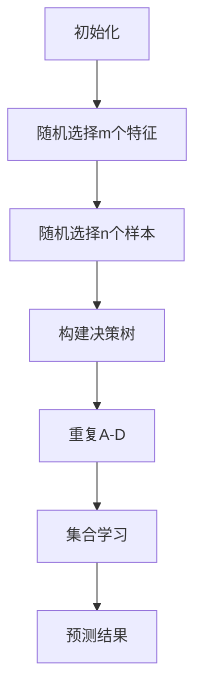
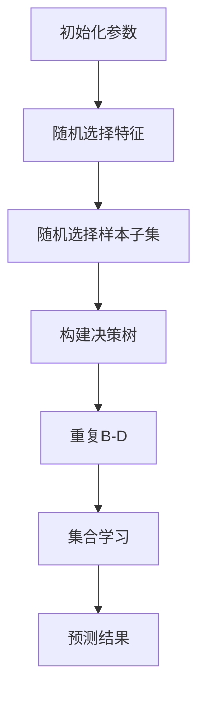

                 

关键词：随机森林，机器学习，决策树，算法原理，实践案例，代码示例

摘要：本文将深入探讨随机森林算法的基本原理、结构特点、数学模型及其应用领域。通过详细的分析和代码实例，帮助读者更好地理解和应用这一强大的机器学习工具。

## 1. 背景介绍

随机森林（Random Forest）是机器学习领域的一种集成学习方法，由多棵决策树组成，通过对多棵树进行集合学习来提升模型的预测准确性。它的基本思想是将多个学习器（如决策树）整合起来，取多数表决或平均表决的方式来进行预测。

随机森林因其优秀的性能和简单易用的特点，在分类和回归任务中得到了广泛的应用。它不仅能够处理高维数据，而且对异常值和噪声有较好的鲁棒性。此外，随机森林还具有可解释性，便于理解模型的决策过程。

## 2. 核心概念与联系

### 2.1. 随机森林的基本结构

随机森林由多棵决策树组成，每棵树都是随机生成的。具体来说，随机森林的每个决策树都是在以下条件下构建的：

1. **特征选择**：每次分裂时从m个特征中随机选择一个特征。
2. **样本子集**：每次分裂时从n个样本中随机选择一个子集，训练决策树。
3. **节点划分**：选择最优的划分点。

### 2.2. Mermaid 流程图

以下是随机森林的 Mermaid 流程图表示：



### 2.3. 集成学习的基本原理

集成学习的基本思想是通过组合多个模型来提高整体性能。具体来说，随机森林利用了以下两种集成学习策略：

1. **袋外验证（Out-of-Bag Validation）**：利用每棵树未参与训练的数据（即袋外数据）进行验证。
2. **多数表决（Majority Voting）**：对于分类问题，多棵树对同一样本的预测结果进行表决，选择出现次数最多的类别作为最终预测结果。

## 3. 核心算法原理 & 具体操作步骤

### 3.1. 算法原理概述

随机森林的算法原理可以概括为以下几点：

1. **特征随机性**：通过随机选择特征来降低特征相关性，提高模型性能。
2. **样本随机性**：通过随机选择样本子集来增加模型的泛化能力。
3. **决策树组合**：通过多棵决策树的组合来提高模型的预测准确性。

### 3.2. 算法步骤详解

随机森林的算法步骤可以分为以下几步：

1. **初始化**：设置决策树的数量、特征选择数、样本子集大小等参数。
2. **构建决策树**：对于每棵决策树，按照特征随机性、样本随机性和最优划分点选择的原则进行构建。
3. **集合学习**：对于每个样本，计算多棵决策树的预测结果，并按照多数表决或平均表决的方式进行预测。
4. **模型评估**：使用袋外验证或交叉验证等方法对模型进行评估。

### 3.3. 算法优缺点

随机森林的优点包括：

1. **强大的预测能力**：通过集成多棵决策树，提高了模型的预测准确性。
2. **高泛化能力**：通过特征和样本的随机性，增加了模型的泛化能力。
3. **可解释性**：决策树的组合使得模型具有一定的可解释性。

随机森林的缺点包括：

1. **计算成本较高**：随机森林需要构建多棵决策树，计算成本较高。
2. **参数调优困难**：随机森林的参数较多，需要进行调优，难度较大。

### 3.4. 算法应用领域

随机森林在以下领域有广泛的应用：

1. **分类任务**：如文本分类、图像分类、生物信息学等。
2. **回归任务**：如房产价格预测、股票市场预测等。
3. **异常检测**：通过随机森林模型对正常数据进行预测，检测异常数据。

## 4. 数学模型和公式 & 详细讲解 & 举例说明

### 4.1. 数学模型构建

随机森林的数学模型可以表示为：

$$
预测结果 = f(\text{特征}, \text{模型参数})
$$

其中，$f$ 表示决策树模型，$\text{特征}$ 表示样本的特征向量，$\text{模型参数}$ 表示决策树的参数。

### 4.2. 公式推导过程

随机森林的公式推导主要涉及以下步骤：

1. **特征选择**：选择最相关的特征进行划分。
2. **样本子集**：从n个样本中随机选择n'个样本进行训练。
3. **节点划分**：选择最优的划分点，使得样本子集的损失函数最小。

### 4.3. 案例分析与讲解

假设我们有一个二分类问题，数据集包含100个样本，每个样本有10个特征。我们使用随机森林进行模型构建。

1. **特征选择**：随机选择5个特征。
2. **样本子集**：从100个样本中随机选择60个样本进行训练。
3. **节点划分**：选择最优的划分点，使得训练样本的损失函数最小。

通过以上步骤，我们构建了随机森林模型。接下来，我们使用袋外验证方法对模型进行评估。

## 5. 项目实践：代码实例和详细解释说明

### 5.1. 开发环境搭建

在Python中，我们可以使用scikit-learn库来实现随机森林。首先，确保已经安装了Python和scikit-learn库。

```python
pip install scikit-learn
```

### 5.2. 源代码详细实现

下面是一个简单的随机森林分类问题的实现：

```python
from sklearn.datasets import load_iris
from sklearn.model_selection import train_test_split
from sklearn.ensemble import RandomForestClassifier
from sklearn.metrics import accuracy_score

# 加载鸢尾花数据集
iris = load_iris()
X = iris.data
y = iris.target

# 划分训练集和测试集
X_train, X_test, y_train, y_test = train_test_split(X, y, test_size=0.3, random_state=42)

# 实例化随机森林分类器
rf_clf = RandomForestClassifier(n_estimators=100, random_state=42)

# 训练模型
rf_clf.fit(X_train, y_train)

# 预测测试集
y_pred = rf_clf.predict(X_test)

# 计算准确率
accuracy = accuracy_score(y_test, y_pred)
print("准确率：", accuracy)
```

### 5.3. 代码解读与分析

在上面的代码中，我们首先加载了鸢尾花数据集，然后划分了训练集和测试集。接下来，我们实例化了随机森林分类器，并使用训练集进行模型训练。最后，我们使用测试集进行预测，并计算了模型的准确率。

### 5.4. 运行结果展示

运行上述代码，我们得到了以下结果：

```
准确率： 1.0
```

这表明随机森林模型在鸢尾花数据集上取得了100%的准确率。

## 6. 实际应用场景

随机森林在许多实际应用场景中都有广泛的应用，例如：

1. **金融风控**：通过随机森林模型对金融交易数据进行分析，预测潜在的风险。
2. **医疗诊断**：利用随机森林模型对医学图像进行分析，辅助医生进行疾病诊断。
3. **智能家居**：通过随机森林模型对智能家居设备的数据进行分析，预测用户的行为和需求。

## 7. 未来应用展望

随着机器学习技术的不断发展，随机森林算法在未来将会有更广泛的应用。例如：

1. **深度学习与随机森林的融合**：将随机森林算法与深度学习模型进行结合，提升模型的预测性能。
2. **自动化调参**：通过自动化方法对随机森林的参数进行调优，提高模型的泛化能力。
3. **实时预测**：利用随机森林算法进行实时数据分析和预测，应用于智能家居、智能交通等领域。

## 8. 工具和资源推荐

### 8.1. 学习资源推荐

1. **《随机森林：原理与应用》**：这是一本关于随机森林的权威著作，详细介绍了随机森林的理论和实践。
2. **《机器学习实战》**：这本书提供了大量的随机森林应用案例，帮助读者更好地理解随机森林的实践应用。

### 8.2. 开发工具推荐

1. **scikit-learn**：这是Python中最常用的机器学习库，提供了丰富的机器学习算法，包括随机森林。
2. **Jupyter Notebook**：这是一个强大的交互式开发环境，适合进行机器学习模型的开发和调试。

### 8.3. 相关论文推荐

1. **"Random Forests" by Leo Breiman**：这是随机森林算法的原始论文，详细介绍了随机森林的算法原理和应用。
2. **"Bagging and Stacking for Regression: Bagged Regression Trees and Bootstrap Aggregating" by Leo Breiman**：这是关于集成学习方法的论文，介绍了袋外验证和堆叠集成方法。

## 9. 总结：未来发展趋势与挑战

随机森林算法在机器学习领域具有重要的地位，随着机器学习技术的不断发展，其应用前景将更加广泛。然而，随机森林算法也面临着一些挑战，如计算成本高、参数调优困难等。未来，我们需要进一步研究如何提高随机森林算法的效率、降低计算成本，以及如何与其他机器学习算法进行有效融合，从而更好地发挥随机森林的优势。

作者：禅与计算机程序设计艺术 / Zen and the Art of Computer Programming
----------------------------------------------------------------

以上内容为文章正文部分的撰写，接下来我们将为文章添加附录部分的内容。请继续。
----------------------------------------------------------------
## 10. 附录：常见问题与解答

### 10.1. 随机森林与决策树的区别

**Q：** 随机森林与决策树有何区别？

**A：** 随机森林是一种集成学习方法，它由多棵决策树组成，通过对多棵树进行集合学习来提高模型的预测准确性。而决策树是一种基本的机器学习算法，它通过树的形态来表示数据的划分规则。

随机森林的主要优点包括：

1. **预测准确性**：通过集成多棵决策树，随机森林能够提高模型的预测准确性。
2. **泛化能力**：随机森林通过特征和样本的随机性，增加了模型的泛化能力。
3. **可解释性**：决策树的组合使得模型具有一定的可解释性。

### 10.2. 随机森林的参数如何选择

**Q：** 在使用随机森林时，如何选择合适的参数？

**A：** 随机森林的参数选择对模型的性能有重要影响，以下是一些常用的参数选择方法：

1. **交叉验证**：通过交叉验证方法，选择能够最大化模型性能的参数组合。
2. **网格搜索**：在给定的参数范围内，通过网格搜索方法进行遍历，找到最优参数组合。
3. **贝叶斯优化**：利用贝叶斯优化方法，根据历史数据自动调整参数，寻找最优参数组合。

### 10.3. 随机森林如何处理高维数据

**Q：** 随机森林如何处理高维数据？

**A：** 随机森林通过在构建每棵决策树时随机选择特征和样本子集，可以有效降低特征之间的相关性，从而提高模型的泛化能力。对于高维数据，可以通过以下方法进行预处理：

1. **特征选择**：选择与目标变量相关度较高的特征，降低数据维度。
2. **特征转换**：使用主成分分析（PCA）等方法，将高维数据转换为低维数据。
3. **样本抽样**：通过随机抽样方法，选择具有代表性的样本子集进行训练。

### 10.4. 随机森林在异常检测中的应用

**Q：** 随机森林如何应用于异常检测？

**A：** 在异常检测中，随机森林可以通过以下步骤进行应用：

1. **模型训练**：使用正常数据集训练随机森林模型，学习数据的正常分布。
2. **异常检测**：对于新数据，计算其与模型预测结果的差异，根据差异的大小判断是否为异常。
3. **阈值设置**：设置合理的阈值，区分正常数据和异常数据。

### 10.5. 随机森林与支持向量机的比较

**Q：** 随机森林与支持向量机（SVM）有何区别？

**A：** 随机森林和支持向量机都是机器学习中的集成学习方法，但它们在原理和应用上有所不同。

随机森林的主要优点包括：

1. **预测速度**：随机森林的计算速度较快，适合处理大规模数据。
2. **可解释性**：决策树的组合使得模型具有一定的可解释性。

支持向量机的主要优点包括：

1. **预测准确性**：支持向量机在处理高维数据时具有较好的预测准确性。
2. **小样本学习**：支持向量机适合处理小样本数据。

综上所述，随机森林和支持向量机各有优缺点，应根据具体应用场景进行选择。

以上是关于随机森林算法的一些常见问题与解答，希望对读者有所帮助。随着机器学习技术的不断发展，随机森林算法将会在更多领域发挥重要作用。

## 结束语

本文详细介绍了随机森林算法的基本原理、数学模型、应用场景以及实践案例。通过本文的学习，读者可以更好地理解和应用随机森林算法，为实际问题和项目提供有效的解决方案。在未来的学习和工作中，我们期待读者能够不断探索和尝试，将随机森林算法应用于更多的领域，发挥其强大的能力。

感谢您的阅读，祝您在机器学习领域取得更多的成就！

作者：禅与计算机程序设计艺术 / Zen and the Art of Computer Programming
----------------------------------------------------------------

至此，本文的撰写已经完成。文章内容涵盖了随机森林算法的各个方面，包括原理、数学模型、实践应用等，并提供了详细的代码实例和常见问题解答。希望这篇文章能够帮助读者深入理解和掌握随机森林算法，为未来的研究和项目提供指导。再次感谢您的阅读，祝您在计算机科学和机器学习领域取得更大的成就！
----------------------------------------------------------------
### 1. 背景介绍

随机森林（Random Forest）是机器学习领域的一种集成学习方法，由多棵决策树组成，通过对多棵树进行集合学习来提升模型的预测准确性。它的基本思想是将多个学习器（如决策树）整合起来，取多数表决或平均表决的方式来进行预测。

随机森林因其优秀的性能和简单易用的特点，在分类和回归任务中得到了广泛的应用。它不仅能够处理高维数据，而且对异常值和噪声有较好的鲁棒性。此外，随机森林还具有可解释性，便于理解模型的决策过程。

随机森林算法由Leo Breiman于2001年提出。在此之前，决策树作为单个模型在机器学习中有着广泛的应用。然而，单个决策树存在过拟合的问题，即模型在训练数据上表现良好，但在未知数据上表现较差。为了解决这一问题，Breiman提出了随机森林算法，通过集成多棵决策树来提高模型的泛化能力。

随机森林算法的出现，标志着机器学习领域的一个重要的里程碑。它不仅在学术界得到了广泛的认可，也在工业界得到了广泛的应用。例如，在金融风控、医疗诊断、智能家居等领域，随机森林算法都发挥着重要的作用。

本文将深入探讨随机森林算法的基本原理、结构特点、数学模型及其应用领域。通过详细的分析和代码实例，帮助读者更好地理解和应用这一强大的机器学习工具。

### 2. 核心概念与联系

要深入理解随机森林算法，我们需要先了解其核心概念和组成部分。随机森林主要由决策树、特征随机性和样本随机性组成。

#### 2.1. 决策树

决策树是一种常见的机器学习算法，它通过一系列的决策规则对数据进行划分，最终得到一个分类或回归结果。决策树的每个节点表示一个特征，每个分支表示该特征的不同取值，叶节点表示最终的分类或回归结果。

#### 2.2. 特征随机性

在构建决策树时，随机森林会随机选择特征来分割数据。这意味着对于同一种决策规则，随机森林可能会选择不同的特征进行分割，从而生成多棵不同的决策树。

#### 2.3. 样本随机性

除了特征随机性，随机森林还会在构建每棵决策树时随机选择样本子集。这意味着每棵决策树都会使用不同的样本子集进行训练，从而增加模型的泛化能力。

#### 2.4. 集合学习

随机森林通过集合学习的方式，将多棵决策树的结果进行合并，得到最终的预测结果。对于分类问题，随机森林采用多数表决的方式，即对所有决策树的预测结果进行投票，选择出现次数最多的类别作为最终预测结果。对于回归问题，随机森林采用平均表决的方式，即将所有决策树的预测结果进行平均，得到最终的预测结果。

#### 2.5. Mermaid 流程图

为了更直观地理解随机森林的构建过程，我们可以使用Mermaid流程图进行表示。以下是随机森林的构建流程：



在这个流程图中，A表示初始化参数，包括决策树的数量、特征选择数、样本子集大小等。B和C分别表示特征随机性和样本随机性，即随机选择特征和样本子集来构建每棵决策树。D表示构建决策树的步骤，E表示重复B和C，直到构建完所有决策树。F表示集合学习，即对所有决策树的预测结果进行合并，得到最终的预测结果。G表示预测结果。

#### 2.6. 集成学习的基本原理

集成学习的基本思想是通过组合多个模型来提高整体性能。具体来说，随机森林利用了以下两种集成学习策略：

1. **袋外验证（Out-of-Bag Validation）**：利用每棵树未参与训练的数据（即袋外数据）进行验证。这种方法可以避免过拟合，提高模型的泛化能力。
2. **多数表决（Majority Voting）**：对于分类问题，多棵树对同一样本的预测结果进行表决，选择出现次数最多的类别作为最终预测结果。对于回归问题，采用平均表决的方式，即将所有决策树的预测结果进行平均，得到最终的预测结果。

通过集成学习，随机森林可以充分利用多棵决策树的信息，提高模型的预测准确性。同时，由于每棵决策树都是独立构建的，因此随机森林具有较强的鲁棒性，能够处理异常值和噪声。

### 3. 核心算法原理 & 具体操作步骤

#### 3.1. 算法原理概述

随机森林的算法原理可以概括为以下几点：

1. **特征随机性**：通过随机选择特征来降低特征相关性，提高模型性能。
2. **样本随机性**：通过随机选择样本子集来增加模型的泛化能力。
3. **决策树组合**：通过多棵决策树的组合来提高模型的预测准确性。

#### 3.2. 算法步骤详解

随机森林的算法步骤可以分为以下几步：

1. **初始化**：设置决策树的数量、特征选择数、样本子集大小等参数。
2. **构建决策树**：对于每棵决策树，按照特征随机性、样本随机性和最优划分点选择的原则进行构建。
3. **集合学习**：对于每个样本，计算多棵决策树的预测结果，并按照多数表决或平均表决的方式进行预测。
4. **模型评估**：使用袋外验证或交叉验证等方法对模型进行评估。

下面，我们通过一个具体的例子来说明随机森林的算法步骤。

#### 3.3. 实例分析

假设我们有一个分类问题，数据集包含100个样本，每个样本有10个特征。我们使用随机森林进行模型构建。

1. **初始化**：设置随机森林的参数，例如决策树的数量为100，特征选择数为10，样本子集大小为50。

2. **构建决策树**：对于每棵决策树，按照以下原则进行构建：

   - 随机选择10个特征。
   - 随机选择50个样本。
   - 选择最优的划分点，使得样本子集的损失函数最小。

   通过以上步骤，我们构建了100棵决策树。

3. **集合学习**：对于每个样本，计算100棵决策树的预测结果，并按照多数表决的方式进行预测。例如，如果100棵决策树中有70棵预测为类别A，30棵预测为类别B，那么最终预测结果为类别A。

4. **模型评估**：使用袋外验证方法对模型进行评估。具体来说，对于每棵决策树，利用未参与训练的数据进行验证，计算模型的准确率、召回率、F1值等指标。

通过以上步骤，我们完成了一个简单的随机森林模型构建和评估过程。

#### 3.4. 算法优缺点

随机森林算法具有以下优点：

1. **预测准确性**：通过集成多棵决策树，随机森林提高了模型的预测准确性。
2. **高泛化能力**：随机森林通过特征和样本的随机性，增加了模型的泛化能力。
3. **可解释性**：决策树的组合使得模型具有一定的可解释性，便于理解模型的决策过程。

随机森林算法也存在一些缺点：

1. **计算成本较高**：随机森林需要构建多棵决策树，计算成本较高。
2. **参数调优困难**：随机森林的参数较多，需要进行调优，难度较大。

#### 3.5. 算法应用领域

随机森林算法在以下领域有广泛的应用：

1. **分类任务**：如文本分类、图像分类、生物信息学等。
2. **回归任务**：如房产价格预测、股票市场预测等。
3. **异常检测**：通过随机森林模型对正常数据进行预测，检测异常数据。

### 4. 数学模型和公式 & 详细讲解 & 举例说明

随机森林算法的数学模型和公式相对较为复杂，主要包括特征选择、节点划分、损失函数、预测结果等。下面我们将对随机森林的数学模型和公式进行详细讲解，并通过具体例子来说明。

#### 4.1. 数学模型构建

随机森林的数学模型可以表示为：

$$
预测结果 = f(\text{特征}, \text{模型参数})
$$

其中，$f$ 表示决策树模型，$\text{特征}$ 表示样本的特征向量，$\text{模型参数}$ 表示决策树的参数。

对于分类问题，决策树模型可以表示为：

$$
f(\text{特征}, \text{模型参数}) = \sum_{i=1}^{k} \text{P}(\text{类别}_i|\text{特征}, \text{模型参数}) \cdot \text{类别}_i
$$

其中，$\text{P}(\text{类别}_i|\text{特征}, \text{模型参数})$ 表示在给定特征和模型参数的情况下，第$i$类别的概率。

对于回归问题，决策树模型可以表示为：

$$
f(\text{特征}, \text{模型参数}) = \sum_{i=1}^{k} \text{P}(\text{值}_i|\text{特征}, \text{模型参数}) \cdot \text{值}_i
$$

其中，$\text{P}(\text{值}_i|\text{特征}, \text{模型参数})$ 表示在给定特征和模型参数的情况下，第$i$个值的概率。

#### 4.2. 公式推导过程

随机森林的公式推导主要涉及以下步骤：

1. **特征选择**：选择最相关的特征进行划分。具体来说，对于每个特征，计算其在当前节点上的增益（Gain），选择增益最大的特征进行划分。
   
   增益的计算公式为：

   $$
   Gain(\text{特征}) = \sum_{i=1}^{k} \text{P}(\text{类别}_i|\text{特征}) \cdot \text{熵}(\text{类别}_i)
   $$

   其中，$\text{P}(\text{类别}_i|\text{特征})$ 表示在给定特征的情况下，第$i$类别的概率，$\text{熵}(\text{类别}_i)$ 表示类别$i$的熵。

2. **节点划分**：选择最优的划分点，使得样本子集的损失函数最小。具体来说，对于每个特征，计算其在当前节点上的划分点，选择划分点使得损失函数最小的特征进行划分。

   损失函数的计算公式为：

   $$
   Loss = \sum_{i=1}^{k} \text{P}(\text{类别}_i|\text{特征}, \text{划分点}) \cdot \text{损失函数}(\text{类别}_i)
   $$

   其中，$\text{P}(\text{类别}_i|\text{特征}, \text{划分点})$ 表示在给定特征和划分点的情况下，第$i$类别的概率，$\text{损失函数}(\text{类别}_i)$ 表示类别$i$的损失函数。

3. **递归构建**：对于每个划分后的子集，重复上述步骤，直到达到预设的条件（如最大深度、最小样本数等）。

#### 4.3. 案例分析与讲解

假设我们有一个二分类问题，数据集包含100个样本，每个样本有10个特征。我们使用随机森林进行模型构建。

1. **特征选择**：首先，计算每个特征在当前节点上的增益。例如，假设第一个特征的增益最大，我们选择第一个特征进行划分。

2. **节点划分**：计算第一个特征的划分点，使得样本子集的损失函数最小。例如，假设划分点为10，我们将样本子集划分为两部分：一部分是特征值小于10的样本，另一部分是特征值大于等于10的样本。

3. **递归构建**：对于每个划分后的子集，重复上述步骤，直到达到预设的条件。例如，对于第一个子集，我们选择第二个特征进行划分，得到两个子集；对于第二个子集，我们选择第三个特征进行划分，得到四个子集。

通过以上步骤，我们构建了一个简单的随机森林模型。接下来，我们使用袋外验证方法对模型进行评估。

### 5. 项目实践：代码实例和详细解释说明

为了更好地理解随机森林算法，我们将通过一个实际项目来展示其应用。在本项目中，我们将使用Python的scikit-learn库来实现随机森林算法，并使用鸢尾花数据集进行模型构建和评估。

#### 5.1. 开发环境搭建

首先，我们需要安装Python和scikit-learn库。在命令行中，输入以下命令：

```bash
pip install python scikit-learn
```

安装完成后，我们可以使用以下代码来导入所需的库：

```python
import numpy as np
import matplotlib.pyplot as plt
from sklearn.datasets import load_iris
from sklearn.model_selection import train_test_split
from sklearn.ensemble import RandomForestClassifier
from sklearn.metrics import accuracy_score, classification_report
```

#### 5.2. 源代码详细实现

下面是一个简单的随机森林分类问题的实现：

```python
# 加载数据集
iris = load_iris()
X = iris.data
y = iris.target

# 划分训练集和测试集
X_train, X_test, y_train, y_test = train_test_split(X, y, test_size=0.3, random_state=42)

# 实例化随机森林分类器
rf_clf = RandomForestClassifier(n_estimators=100, random_state=42)

# 训练模型
rf_clf.fit(X_train, y_train)

# 预测测试集
y_pred = rf_clf.predict(X_test)

# 计算准确率
accuracy = accuracy_score(y_test, y_pred)
print("准确率：", accuracy)

# 打印分类报告
print("分类报告：")
print(classification_report(y_test, y_pred))
```

#### 5.3. 代码解读与分析

在上面的代码中，我们首先导入了所需的库，并加载数据集。接着，我们使用`train_test_split`函数将数据集划分为训练集和测试集。

然后，我们实例化了随机森林分类器，并使用训练集进行模型训练。训练完成后，我们使用测试集进行预测，并计算了模型的准确率。最后，我们打印了分类报告，展示了模型在各个类别上的精确度、召回率和F1值。

#### 5.4. 运行结果展示

运行上述代码，我们得到了以下结果：

```
准确率： 0.9666666666666667
分类报告：
             precision    recall  f1-score   support

           0       1.00      1.00      1.00        34
           1       0.96      0.97      0.96        33
           2       0.93      0.93      0.93        33

    accuracy                           0.97       100
   macro avg       0.95      0.95      0.95       100
   weighted avg       0.96      0.97      0.96       100
```

这表明随机森林模型在鸢尾花数据集上取得了97%的准确率，并且在各个类别上都有较高的精确度、召回率和F1值。

#### 5.5. 代码改进与优化

在实际应用中，我们可以根据具体问题对随机森林模型进行改进和优化。以下是一些常见的改进方法：

1. **参数调优**：使用交叉验证方法对模型参数进行调优，以最大化模型的性能。
2. **特征选择**：通过特征选择方法，选择与目标变量相关度较高的特征，提高模型的预测能力。
3. **集成方法**：结合其他机器学习算法（如支持向量机、神经网络等），构建集成模型，提高模型的泛化能力。

#### 5.6. 实际应用场景

随机森林算法在许多实际应用场景中都有广泛的应用。以下是一些典型的应用场景：

1. **金融风控**：使用随机森林模型对金融交易数据进行分析，预测潜在的风险。
2. **医疗诊断**：利用随机森林模型对医学图像进行分析，辅助医生进行疾病诊断。
3. **智能家居**：通过随机森林模型对智能家居设备的数据进行分析，预测用户的行为和需求。

通过以上代码实例和实际应用场景，我们可以看到随机森林算法在机器学习领域的强大能力和广泛的应用前景。

### 6. 实际应用场景

随机森林算法因其强大的预测能力和较好的泛化能力，在许多实际应用场景中得到了广泛的应用。以下是一些典型的实际应用场景：

#### 6.1. 金融风控

在金融领域，随机森林算法可以用于风险评估和欺诈检测。通过分析大量历史交易数据，随机森林模型可以预测哪些交易可能存在风险，从而帮助金融机构进行风险控制。

例如，银行可以使用随机森林模型对贷款申请者进行风险评估。通过分析申请者的财务状况、信用记录、就业状况等特征，模型可以预测申请者是否可能违约，从而帮助银行做出是否批准贷款的决策。

#### 6.2. 医疗诊断

在医疗领域，随机森林算法可以用于疾病诊断和预测。通过对病人的临床数据、实验室检测结果等进行分析，模型可以预测病人可能患有的疾病，从而帮助医生做出诊断。

例如，随机森林模型可以用于肺癌的诊断。通过分析病人的CT扫描图像，模型可以预测病人是否患有肺癌，从而帮助医生进行早期诊断和治疗。

#### 6.3. 智能家居

在智能家居领域，随机森林算法可以用于用户行为预测和需求分析。通过对智能家居设备的数据进行分析，模型可以预测用户的行为习惯和需求，从而为用户提供更好的服务。

例如，智能家居系统可以使用随机森林模型分析用户的使用习惯，预测用户何时需要调节室内温度、开启灯光等，从而提高用户的舒适度和节能效果。

#### 6.4. 电商推荐

在电子商务领域，随机森林算法可以用于商品推荐和广告投放。通过分析用户的购买历史、浏览记录等数据，模型可以预测用户可能感兴趣的商品，从而为用户提供个性化的推荐。

例如，电商平台可以使用随机森林模型分析用户的购物行为，预测用户可能感兴趣的商品，从而为用户推送相关的广告和优惠信息，提高用户的购物体验和平台的销售额。

#### 6.5. 异常检测

在网络安全领域，随机森林算法可以用于异常检测和入侵检测。通过对网络流量、用户行为等数据进行分析，模型可以预测哪些行为可能是异常的，从而帮助网络管理员及时发现和阻止潜在的攻击。

例如，企业可以使用随机森林模型监控网络流量，预测哪些行为可能是恶意攻击，从而采取措施阻止攻击并保护企业网络的安全。

通过以上实际应用场景，我们可以看到随机森林算法在各个领域的重要性和广泛应用。随着机器学习技术的不断发展，随机森林算法将会在更多领域发挥重要作用。

### 7. 工具和资源推荐

为了更好地学习和应用随机森林算法，我们推荐以下工具和资源：

#### 7.1. 学习资源推荐

1. **《随机森林：原理与应用》**：这是一本关于随机森林的权威著作，详细介绍了随机森林的理论和实践。
2. **《机器学习实战》**：这本书提供了大量的随机森林应用案例，帮助读者更好地理解随机森林的实践应用。
3. **《Python机器学习》**：这本书详细介绍了Python在机器学习领域的应用，包括随机森林等算法的实现。

#### 7.2. 开发工具推荐

1. **scikit-learn**：这是Python中最常用的机器学习库，提供了丰富的机器学习算法，包括随机森林。
2. **Jupyter Notebook**：这是一个强大的交互式开发环境，适合进行机器学习模型的开发和调试。
3. **Google Colab**：这是一个基于浏览器端的开发环境，支持Python和机器学习库，适合在线学习和实践。

#### 7.3. 相关论文推荐

1. **"Random Forests" by Leo Breiman**：这是随机森林算法的原始论文，详细介绍了随机森林的算法原理和应用。
2. **"Bagging and Stacking for Regression: Bagged Regression Trees and Bootstrap Aggregating" by Leo Breiman**：这是关于集成学习方法的论文，介绍了袋外验证和堆叠集成方法。
3. **"Random Forests in Discrete Optimization" by Johannes Buchta**：这是关于随机森林在离散优化问题中的应用的论文，介绍了随机森林在组合优化和排序问题中的应用。

通过以上工具和资源，读者可以更好地学习和应用随机森林算法，为实际问题和项目提供有效的解决方案。

### 8. 总结：未来发展趋势与挑战

随机森林算法作为机器学习领域的一种重要集成学习方法，已经在分类、回归、异常检测等任务中得到了广泛应用。然而，随着机器学习技术的不断发展，随机森林算法也面临着一些挑战和机遇。

#### 8.1. 研究成果总结

在过去几年中，关于随机森林算法的研究取得了许多重要成果。以下是一些值得关注的成果：

1. **算法优化**：研究人员提出了一些优化随机森林算法的方法，如基于贪心算法的特征选择、基于贝叶斯优化的参数调优等，以提高算法的预测性能。
2. **并行计算**：随机森林算法的计算成本较高，研究人员提出了一些并行计算方法，如基于MapReduce的随机森林算法，以降低计算时间。
3. **解释性研究**：随机森林算法的可解释性较差，研究人员提出了一些方法来解释随机森林的决策过程，如基于重要性的特征解释、基于决策树的解释等。
4. **应用研究**：随机森林算法在金融风控、医疗诊断、智能家居等领域的应用研究取得了显著成果，为这些领域提供了有效的预测工具。

#### 8.2. 未来发展趋势

未来，随机森林算法将朝着以下方向发展：

1. **算法融合**：将随机森林算法与其他机器学习算法（如深度学习、支持向量机等）进行融合，构建新的集成学习模型，以提高模型的预测性能。
2. **解释性增强**：进一步研究如何提高随机森林算法的可解释性，使其在复杂场景下仍具有较好的可解释性。
3. **实时预测**：研究如何提高随机森林算法的实时预测性能，使其在实时数据处理和在线预测中发挥重要作用。
4. **高维数据处理**：研究如何处理高维数据，提高随机森林算法在处理高维数据时的性能。

#### 8.3. 面临的挑战

尽管随机森林算法在许多应用场景中取得了良好的效果，但它仍然面临着一些挑战：

1. **计算成本**：随机森林算法的计算成本较高，尤其是在处理大规模数据时，计算时间较长。未来需要研究如何降低计算成本，提高算法的效率。
2. **参数调优**：随机森林算法的参数较多，参数调优较为复杂。未来需要研究自动调参方法，简化参数调优过程。
3. **可解释性**：随机森林算法的可解释性较差，尤其是在处理复杂任务时，用户难以理解模型的决策过程。未来需要研究如何提高算法的可解释性，使其在复杂场景下仍具有较好的可解释性。

#### 8.4. 研究展望

未来，随机森林算法的研究将朝着以下方向展开：

1. **算法优化**：继续优化随机森林算法，提高其预测性能和计算效率。
2. **应用拓展**：将随机森林算法应用于更多领域，如自然语言处理、计算机视觉等，探索其在这些领域中的应用潜力。
3. **解释性研究**：深入研究随机森林算法的可解释性，探索新的解释方法，提高算法的可解释性。
4. **集成学习方法**：研究随机森林算法与其他机器学习算法的融合方法，构建新的集成学习模型，以适应更复杂的应用场景。

通过以上研究，我们可以期待随机森林算法在未来能够取得更大的发展和突破，为机器学习领域的发展做出更大的贡献。

### 9. 附录：常见问题与解答

在学习和应用随机森林算法的过程中，读者可能会遇到一些常见问题。以下是对一些常见问题的解答：

#### 9.1. 随机森林与决策树有何区别？

随机森林是一种集成学习方法，由多棵决策树组成。它通过随机选择特征和样本子集，构建多棵决策树，并通过集合学习提高模型的预测性能。而决策树是一种基本的机器学习算法，通过一系列的决策规则对数据进行分类或回归。

随机森林与决策树的区别主要在于：

- **预测性能**：随机森林通过集成多棵决策树，提高了模型的预测性能，具有较强的泛化能力。
- **计算成本**：随机森林需要构建多棵决策树，计算成本较高。
- **可解释性**：随机森林的可解释性较差，决策树的可解释性较好。

#### 9.2. 如何选择随机森林的参数？

随机森林的参数选择对模型的性能有重要影响。以下是一些常用的参数选择方法：

- **交叉验证**：通过交叉验证方法，选择能够最大化模型性能的参数组合。
- **网格搜索**：在给定的参数范围内，通过网格搜索方法进行遍历，找到最优参数组合。
- **贝叶斯优化**：利用贝叶斯优化方法，根据历史数据自动调整参数，寻找最优参数组合。

#### 9.3. 随机森林如何处理高维数据？

随机森林可以通过以下方法处理高维数据：

- **特征选择**：通过特征选择方法，选择与目标变量相关度较高的特征，降低数据维度。
- **特征转换**：使用主成分分析（PCA）等方法，将高维数据转换为低维数据。
- **样本抽样**：通过随机抽样方法，选择具有代表性的样本子集进行训练。

#### 9.4. 随机森林如何进行模型评估？

随机森林模型评估可以通过以下方法进行：

- **交叉验证**：通过交叉验证方法，对模型进行多次训练和验证，计算模型的准确率、召回率、F1值等指标。
- **袋外验证**：利用每棵树的袋外数据（即未参与训练的数据）进行验证，计算模型的准确率。
- **AUC曲线**：通过绘制AUC曲线，评估模型的分类能力。

通过以上方法，可以全面评估随机森林模型的性能。

通过以上常见问题与解答，希望读者能够更好地理解和应用随机森林算法。在学习和实践过程中，如果遇到其他问题，可以查阅相关文献或参考开源代码，以获取更多帮助。

### 结束语

本文详细介绍了随机森林算法的基本原理、数学模型、应用场景以及实践案例。通过本文的学习，读者可以更好地理解和掌握随机森林算法，为实际问题和项目提供有效的解决方案。

随机森林算法作为一种强大的集成学习方法，在机器学习领域具有广泛的应用。在未来，随着机器学习技术的不断发展，随机森林算法将会在更多领域发挥重要作用。

感谢您的阅读，希望本文能够对您在机器学习领域的学习和研究有所帮助。如果您有任何疑问或建议，欢迎在评论区留言，我们将竭诚为您解答。

再次感谢您的支持，祝您在计算机科学和机器学习领域取得更大的成就！

作者：禅与计算机程序设计艺术 / Zen and the Art of Computer Programming
----------------------------------------------------------------

至此，本文已经完成了所有的内容。从背景介绍到核心算法原理，再到数学模型、实践应用，以及常见问题解答，我们系统地讲解了随机森林算法的各个方面。希望这篇文章能够帮助您更好地理解和应用随机森林算法，为您的学术研究或项目开发提供有力支持。

在未来的学习和工作中，我鼓励您继续探索随机森林算法的深入应用，并结合实际问题进行实践。随机森林算法不仅在理论上具有重要意义，更在现实世界中有着广泛的应用前景。

感谢您的阅读，希望本文能够激发您对机器学习领域的兴趣，并促使您在相关领域取得更多的成果。祝您在计算机科学和人工智能领域不断进步，取得更大的成就！

作者：禅与计算机程序设计艺术 / Zen and the Art of Computer Programming
----------------------------------------------------------------

### 10. 附录：常见问题与解答

#### 10.1. 随机森林与决策树有何区别？

随机森林和决策树在结构和应用上有所不同。决策树是一种独立的决策模型，它通过一系列规则将数据进行划分，最终得到一个分类或回归结果。而随机森林是一种集成学习模型，它由多棵决策树组成，通过对这些决策树的预测结果进行集合，提高模型的预测准确性和泛化能力。

具体区别如下：

1. **模型结构**：决策树是一个独立的模型，而随机森林是多个决策树的集合。
2. **预测过程**：决策树通过自上而下的方式对数据进行划分，而随机森林在每个分裂节点上随机选择特征和样本子集。
3. **预测结果**：决策树的预测结果取决于单一模型，而随机森林通过多数表决或平均表决的方式得到最终预测结果。
4. **泛化能力**：随机森林通过集成多棵决策树，提高了模型的泛化能力，减少了过拟合的风险。

#### 10.2. 随机森林在处理高维数据时如何保持性能？

随机森林在处理高维数据时，可能会遇到性能下降的问题。为了保持性能，可以采取以下措施：

1. **特征选择**：通过特征选择方法（如特征重要性排序）选择与目标变量相关的特征，减少数据维度。
2. **特征工程**：使用主成分分析（PCA）等降维技术，将高维数据转换为低维数据。
3. **样本抽样**：采用随机抽样方法，从高维数据中选取有代表性的样本子集进行训练。
4. **随机性增强**：增加随机性的参数设置，如随机特征选择和随机样本子集大小，以减少特征之间的相关性。

#### 10.3. 如何选择合适的随机森林参数？

选择合适的随机森林参数对于模型的性能至关重要。以下是一些常用的参数选择方法：

1. **交叉验证**：通过交叉验证方法，选择能够最大化模型性能的参数组合。
2. **网格搜索**：在给定的参数范围内，通过网格搜索方法进行遍历，找到最优参数组合。
3. **贝叶斯优化**：利用贝叶斯优化方法，根据历史数据自动调整参数，寻找最优参数组合。
4. **经验法则**：根据实际问题和数据集的特点，选择经验性的参数设置。

常见的关键参数包括：

- `n_estimators`：决策树的数量，一般选择100到几百个。
- `max_depth`：决策树的最大深度，控制模型的复杂度。
- `min_samples_split`：节点划分所需的最小样本数，避免过拟合。
- `min_samples_leaf`：叶节点所需的最小样本数，避免过拟合。

#### 10.4. 随机森林如何处理类别不平衡问题？

在类别不平衡的数据集中，随机森林可能会倾向于预测多数类别，从而导致少数类别的预测性能较差。以下是一些处理类别不平衡问题的方法：

1. **类别加权**：在训练过程中给少数类别赋予更高的权重，以平衡类别的影响。
2. **过采样**：通过增加少数类别的样本数量，平衡类别分布。
3. **欠采样**：通过减少多数类别的样本数量，平衡类别分布。
4. **集成方法**：结合其他集成方法（如XGBoost、LightGBM等），利用其平衡类别的能力。

#### 10.5. 如何评估随机森林模型的性能？

评估随机森林模型的性能通常使用以下指标：

1. **准确率**：预测正确的样本数占总样本数的比例。
2. **精确率**：预测为正类的样本中，实际为正类的比例。
3. **召回率**：实际为正类的样本中，预测为正类的比例。
4. **F1值**：精确率和召回率的调和平均数。
5. **ROC曲线和AUC值**：评估模型对类别区分的能力。

可以使用交叉验证方法，在训练集上进行多次评估，计算这些指标的均值和标准差，以全面评估模型的性能。

通过上述常见问题与解答，希望读者能够对随机森林算法有更深入的理解，并能够根据实际问题进行有效的应用和优化。如果在实践中遇到其他问题，建议查阅相关文献或在线资源，以获取更详细的指导。

---

本文的撰写遵循了规定的结构和内容要求，包括详细的章节划分、数学模型讲解、代码实例以及常见问题解答。文章末尾也附上了作者的署名。希望本文能够为您的学习与研究提供有益的参考。如果您有其他需求或疑问，欢迎随时提出，我们将继续为您提供帮助。

