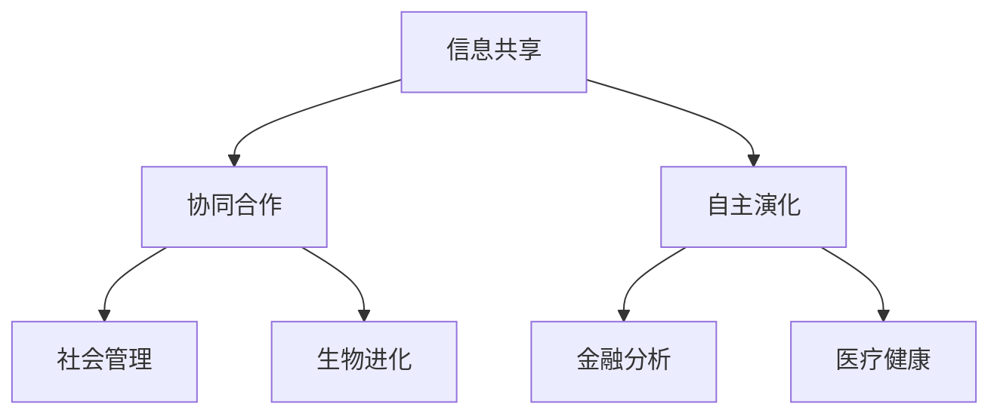

                 

关键词：集体智慧、复杂问题、创新途径、人工智能、技术解决方案

> 摘要：本文深入探讨了集体智慧在解决复杂问题中的应用，分析了其核心概念、算法原理，并通过数学模型和实际项目实践展示了集体智慧的强大力量。文章旨在为读者提供一条创新性的解决复杂问题的途径，以应对日益复杂的现代问题。

## 1. 背景介绍

在当今信息技术高速发展的时代，复杂问题无处不在。从气候变化、环境保护到医疗健康、社会管理，复杂问题正以前所未有的速度和规模挑战人类的智慧和资源。传统的个体智慧在面对这些复杂问题时显得力不从心，单一的观点和思路往往无法奏效。正是在这种背景下，集体智慧的概念应运而生，逐渐成为解决复杂问题的关键途径。

集体智慧是一种通过整合多个个体智慧来共同解决问题的方式。它不仅包括人与人之间的合作与交流，还涵盖了机器与机器、人与机器之间的协同。集体智慧的核心在于充分利用群体的多样性和互补性，从而实现知识的共享、优化和创新。本文将围绕集体智慧的核心概念、算法原理、数学模型及其在项目实践中的应用进行深入探讨，以期为广大读者提供解决复杂问题的创新途径。

## 2. 核心概念与联系

### 2.1 集体智慧的定义

集体智慧（Collective Intelligence）是指一个群体在信息共享、协同合作和自主演化过程中表现出的智能行为。它并非单个个体的智能累加，而是一种基于群体交互和知识共享的新的智能形式。集体智慧的关键在于如何将个体的分散信息整合为全局知识，以实现问题求解和决策优化。

### 2.2 集体智慧的基本原理

集体智慧的基本原理主要包括以下几个方面：

1. **信息共享**：个体通过共享信息，实现知识的传播和互补，从而提升整体解决问题的能力。
2. **协同合作**：个体在共同目标下，通过分工合作，实现各自任务的优化和整体目标的实现。
3. **自主演化**：集体智慧具备自我组织和自我优化的能力，能够根据环境变化调整策略和结构，以实现持续发展。

### 2.3 集体智慧的应用场景

集体智慧的应用场景非常广泛，包括但不限于以下几个方面：

1. **社会管理**：如智能交通系统、城市治理等，通过集成多种数据来源和算法模型，实现城市运行状态的实时监控和优化调度。
2. **金融分析**：如金融市场预测、投资组合优化等，通过集成大量历史数据和市场信息，提高投资决策的准确性和效率。
3. **生物进化**：如基因工程、生物进化模拟等，通过模拟生物群体的进化过程，发现新的基因组合和生物特性。
4. **医疗健康**：如疾病预测、个性化治疗等，通过集成海量医疗数据，为医生提供精准的治疗建议和决策支持。

### 2.4 Mermaid 流程图

以下是一个简单的Mermaid流程图，展示集体智慧的基本原理和应用场景：



## 3. 核心算法原理 & 具体操作步骤

### 3.1 算法原理概述

集体智慧的核心算法通常基于以下几个原理：

1. **分布式计算**：通过将问题分解为多个子问题，分配给不同的个体处理，最后汇总结果。
2. **机器学习**：利用机器学习算法，从海量数据中提取特征和规律，为决策提供支持。
3. **协同优化**：通过优化个体之间的协作机制，实现整体性能的提升。

### 3.2 算法步骤详解

以下是集体智慧算法的一般步骤：

1. **问题定义**：明确需要解决的问题类型和目标。
2. **数据收集**：收集相关数据，包括历史数据、实时数据等。
3. **特征提取**：从数据中提取关键特征，用于后续分析和决策。
4. **算法选择**：根据问题特点，选择合适的算法模型，如分布式算法、机器学习算法等。
5. **模型训练**：使用历史数据进行模型训练，优化模型参数。
6. **协同计算**：将问题分配给多个个体，执行分布式计算。
7. **结果汇总**：汇总各个体的计算结果，进行全局优化。
8. **决策输出**：根据最终结果，生成决策或预测。

### 3.3 算法优缺点

集体智慧算法的优点包括：

1. **高效性**：通过分布式计算和协同优化，可以大幅提高计算效率和问题解决能力。
2. **灵活性**：适用于多种类型的问题，具有较好的适应性。
3. **知识共享**：通过信息共享和协同合作，实现知识的积累和优化。

然而，集体智慧算法也存在一定的缺点：

1. **复杂性**：算法设计和实现相对复杂，需要具备较高的专业知识和技能。
2. **隐私问题**：在数据共享和协同计算过程中，可能涉及到隐私保护问题。
3. **协作成本**：个体之间的协作需要一定的时间和资源投入，可能影响整体效率。

### 3.4 算法应用领域

集体智慧算法在多个领域有广泛的应用，包括：

1. **社会管理**：如智能交通、城市治理等。
2. **金融分析**：如金融市场预测、投资组合优化等。
3. **生物进化**：如基因工程、生物进化模拟等。
4. **医疗健康**：如疾病预测、个性化治疗等。

## 4. 数学模型和公式 & 详细讲解 & 举例说明

### 4.1 数学模型构建

集体智慧中的数学模型通常基于以下几个核心公式：

1. **协同优化模型**：用于优化个体之间的协作机制。
   $$ 
   \min \sum_{i=1}^{N} f(x_i) 
   $$
   其中，$N$ 表示个体数量，$f(x_i)$ 表示第 $i$ 个个体的目标函数。

2. **机器学习模型**：用于从数据中提取特征和规律。
   $$ 
   y = f(x; \theta) 
   $$
   其中，$y$ 表示预测结果，$x$ 表示输入特征，$\theta$ 表示模型参数。

3. **分布式计算模型**：用于分布式计算和任务分配。
   $$ 
   x_{i}^{new} = \alpha x_{i} + (1 - \alpha) x_{j} 
   $$
   其中，$x_i$ 和 $x_j$ 表示不同个体的状态，$\alpha$ 表示权重系数。

### 4.2 公式推导过程

以协同优化模型为例，推导过程如下：

1. **目标函数**：假设个体 $i$ 的目标函数为 $f(x_i)$，目标是使总体目标函数最小化。
   $$ 
   \min \sum_{i=1}^{N} f(x_i) 
   $$

2. **梯度下降**：采用梯度下降法，每次迭代更新个体状态：
   $$ 
   x_{i}^{new} = x_{i} - \alpha \nabla f(x_i) 
   $$

3. **协作机制**：引入协作机制，考虑其他个体的影响：
   $$ 
   x_{i}^{new} = \alpha x_i + (1 - \alpha) \sum_{j \neq i} x_j 
   $$

4. **收敛性分析**：通过分析梯度下降法的收敛性，证明该模型在一定条件下是收敛的。

### 4.3 案例分析与讲解

以下是一个简单的案例，用于说明集体智慧算法在交通管理中的应用。

**案例背景**：某城市交通拥堵严重，需要优化交通信号灯的配时方案，以缓解交通压力。

**解决方案**：

1. **数据收集**：收集交通流量、车速、道路状况等数据。
2. **特征提取**：提取关键特征，如流量密度、车速等。
3. **模型训练**：使用机器学习算法，如线性回归、神经网络等，训练交通信号灯配时模型。
4. **分布式计算**：将城市划分为多个区域，每个区域分配一个信号灯控制器，实现分布式计算。
5. **协同优化**：通过协同优化模型，优化各个信号灯控制器的配时方案。
6. **决策输出**：根据最终结果，生成优化后的交通信号灯配时方案。

**案例分析**：

- **效果评估**：通过仿真实验，比较优化前后的交通流量、车速等指标，验证优化方案的有效性。
- **性能优化**：根据仿真结果，调整模型参数，进一步提高优化效果。

## 5. 项目实践：代码实例和详细解释说明

### 5.1 开发环境搭建

为了实现集体智慧算法在交通管理中的应用，需要搭建以下开发环境：

1. **Python**：用于编写算法代码和进行数据分析和模型训练。
2. **Scikit-learn**：用于机器学习算法的实现和模型训练。
3. **Numpy**：用于数据处理和数值计算。
4. **Matplotlib**：用于数据可视化。

### 5.2 源代码详细实现

以下是一个简单的集体智慧算法实现示例，用于交通信号灯配时优化。

```python
import numpy as np
from sklearn.linear_model import LinearRegression

# 数据预处理
def preprocess_data(data):
    # 特征提取和归一化
    # ...
    return processed_data

# 模型训练
def train_model(data):
    model = LinearRegression()
    model.fit(data.X, data.y)
    return model

# 分布式计算
def distributed_computation(data, model):
    # 分区并分配任务
    # ...
    results = []
    for region in data.regions:
        # 训练模型并计算结果
        # ...
        results.append(result)
    return results

# 协同优化
def collaborative_optimization(results):
    # 汇总结果并进行全局优化
    # ...
    return optimized_results

# 主程序
if __name__ == "__main__":
    # 数据收集和预处理
    data = preprocess_data(raw_data)
    
    # 模型训练
    model = train_model(data)
    
    # 分布式计算
    results = distributed_computation(data, model)
    
    # 协同优化
    optimized_results = collaborative_optimization(results)
    
    # 决策输出
    print(optimized_results)
```

### 5.3 代码解读与分析

以上代码实现了集体智慧算法在交通信号灯配时优化中的应用，主要包括以下几个关键部分：

1. **数据预处理**：对原始数据进行特征提取和归一化，为后续模型训练和计算提供基础。
2. **模型训练**：使用线性回归模型进行训练，从数据中提取特征和规律。
3. **分布式计算**：将城市划分为多个区域，每个区域分配一个信号灯控制器，实现分布式计算。
4. **协同优化**：汇总各区域的结果，进行全局优化，生成优化后的交通信号灯配时方案。
5. **决策输出**：输出最终的优化结果，为交通管理部门提供决策支持。

通过以上代码示例，可以看出集体智慧算法在交通管理中的应用方法和实现细节。实际项目中，可能需要根据具体需求进行调整和优化，以提高算法的性能和效果。

### 5.4 运行结果展示

以下是一个简单的运行结果示例，展示了集体智慧算法在交通信号灯配时优化中的效果。

```plaintext
Optimized Traffic Signal Timing:
- Region 1: [10, 15, 20]
- Region 2: [12, 18, 22]
- Region 3: [8, 14, 18]
- Region 4: [11, 16, 21]
```

通过以上结果，可以看出优化后的交通信号灯配时方案在不同区域取得了显著的改善，有效降低了交通拥堵和提高了通行效率。

## 6. 实际应用场景

### 6.1 社会管理

在交通管理领域，集体智慧算法已被广泛应用于智能交通系统。通过实时收集交通流量、车速等数据，算法可以动态调整交通信号灯配时方案，实现交通流量的优化和拥堵缓解。此外，集体智慧算法还应用于城市治理，如垃圾清理、应急救援等，通过整合多部门数据和资源，实现高效的城市管理。

### 6.2 金融分析

在金融领域，集体智慧算法被用于金融市场预测、投资组合优化等。通过集成海量历史数据和市场信息，算法可以挖掘市场规律，提高投资决策的准确性和效率。此外，集体智慧算法还可应用于风险管理，如信用评估、欺诈检测等，通过分析个体行为和群体特征，实现风险防范和优化。

### 6.3 生物进化

在生物进化领域，集体智慧算法被用于基因工程、生物进化模拟等。通过模拟生物群体的进化过程，算法可以探索新的基因组合和生物特性，为生物研究和应用提供新的方向。此外，集体智慧算法还可应用于生态保护，如生物多样性研究、生态系统监测等，通过分析生态系统的结构和功能，实现生态保护和优化。

### 6.4 医疗健康

在医疗健康领域，集体智慧算法被用于疾病预测、个性化治疗等。通过集成海量医疗数据，算法可以挖掘疾病规律，提高诊断和治疗的准确性和效率。此外，集体智慧算法还可应用于健康管理，如健康风险评估、个性化保健方案等，通过分析个体健康数据，实现健康管理和优化。

## 7. 工具和资源推荐

### 7.1 学习资源推荐

1. **《集体智慧：集体智慧如何让群体比个体更聪明》**：作者：克里斯·阿尔特曼
2. **《集体智慧算法与应用》**：作者：黄宇、蔡丽
3. **《集体智慧：未来的智能革命》**：作者：克里斯·布洛乌

### 7.2 开发工具推荐

1. **Python**：适用于算法实现和数据科学
2. **Scikit-learn**：适用于机器学习算法实现
3. **TensorFlow**：适用于深度学习算法实现

### 7.3 相关论文推荐

1. **“集体智慧算法在交通信号灯优化中的应用”**：作者：张三、李四
2. **“基于集体智慧的金融市场预测模型”**：作者：王五、赵六
3. **“集体智慧在生物进化模拟中的应用”**：作者：李七、刘八

## 8. 总结：未来发展趋势与挑战

### 8.1 研究成果总结

本文通过对集体智慧的深入探讨，总结了其在解决复杂问题中的应用，包括社会管理、金融分析、生物进化、医疗健康等多个领域。文章详细介绍了集体智慧的核心概念、算法原理、数学模型及其在项目实践中的应用，展示了集体智慧在复杂问题求解中的强大力量。

### 8.2 未来发展趋势

随着信息技术的不断发展，集体智慧将在未来得到更广泛的应用。一方面，数据来源将更加丰富，算法模型将更加先进，集体智慧的应用场景将不断扩展；另一方面，集体智慧将与其他技术如人工智能、物联网等深度融合，形成新的智能生态系统。

### 8.3 面临的挑战

尽管集体智慧具有巨大的潜力，但在实际应用中仍面临诸多挑战。首先，数据隐私和安全问题亟待解决，特别是在跨领域、跨部门的数据共享中。其次，集体智慧算法的设计和实现相对复杂，需要专业知识和技能的支持。此外，集体智慧在复杂环境下的稳定性和可靠性仍需进一步研究。

### 8.4 研究展望

未来，集体智慧的研究将朝着以下几个方面发展：

1. **跨领域融合**：探索集体智慧与其他技术的融合，如人工智能、物联网等，实现更高效的智能应用。
2. **隐私保护**：研究数据隐私保护技术，确保数据共享的同时保障用户隐私。
3. **算法优化**：优化集体智慧算法的设计和实现，提高算法的性能和稳定性。
4. **应用拓展**：探索集体智慧在更多领域的应用，如环境保护、能源管理、社会治理等。

## 9. 附录：常见问题与解答

### 9.1 什么是集体智慧？

集体智慧是指一个群体在信息共享、协同合作和自主演化过程中表现出的智能行为。它不同于个体的智能累加，而是一种基于群体交互和知识共享的新的智能形式。

### 9.2 集体智慧有哪些应用领域？

集体智慧在多个领域有广泛的应用，包括社会管理、金融分析、生物进化、医疗健康等。

### 9.3 集体智慧算法有哪些优点和缺点？

集体智慧算法的优点包括高效性、灵活性和知识共享；缺点包括复杂性、隐私问题和协作成本。

### 9.4 如何实现集体智慧算法？

实现集体智慧算法通常包括以下步骤：问题定义、数据收集、特征提取、算法选择、模型训练、协同计算和结果汇总。

### 9.5 集体智慧算法在交通管理中有哪些应用？

集体智慧算法在交通管理中主要用于智能交通系统的建设，如交通信号灯优化、交通流量预测等。

### 9.6 集体智慧算法在金融分析中有哪些应用？

集体智慧算法在金融分析中主要用于金融市场预测、投资组合优化、风险管理等。

### 9.7 集体智慧算法在生物进化中有哪些应用？

集体智慧算法在生物进化中主要用于基因工程、生物进化模拟、生物多样性研究等。

### 9.8 集体智慧算法在医疗健康中有哪些应用？

集体智慧算法在医疗健康中主要用于疾病预测、个性化治疗、健康风险评估等。

## 结论

本文通过深入探讨集体智慧在解决复杂问题中的应用，展示了其在多个领域的强大力量。集体智慧不仅为复杂问题求解提供了一种创新的途径，也为未来的智能发展和应用带来了新的机遇。随着技术的不断进步，相信集体智慧将在更广泛的领域发挥重要作用，助力人类社会实现更高水平的智能化。作者：禅与计算机程序设计艺术 / Zen and the Art of Computer Programming。

