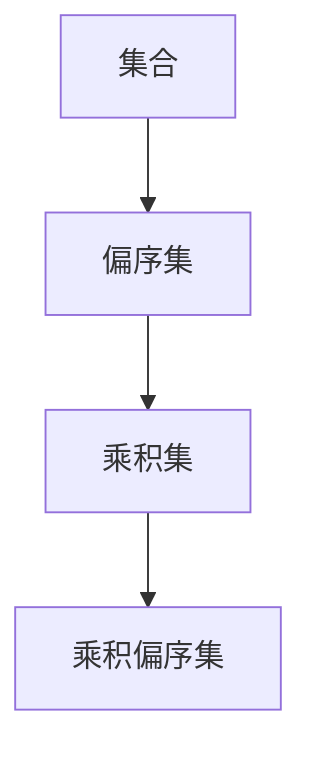

                 

集合论是现代数学的基础，它在计算机科学中也有着广泛的应用。乘积偏序集是集合论中的一个重要概念，它不仅丰富了我们对集合结构的理解，而且在算法设计中也有着重要的作用。本文将深入探讨乘积偏序集的定义、性质及其在实际应用中的重要性。

> 关键词：集合论、乘积偏序集、算法设计、结构性质、应用领域

> 摘要：本文首先介绍了集合论的基础知识，随后详细阐述了乘积偏序集的定义、性质和结构。通过具体的实例，我们分析了乘积偏序集在算法设计中的应用，并探讨了其在实际问题中的重要性。最后，我们展望了乘积偏序集在未来的发展趋势和潜在的研究方向。

## 1. 背景介绍

集合论作为现代数学的基石，起源于19世纪末，由德国数学家乔治·康托尔创立。集合论提供了对“集合”这一基本数学概念的形式化定义，并建立了一套严谨的运算规则。集合论的发展不仅推动了数学本身的进步，也为计算机科学、逻辑学、物理学等领域的研究奠定了基础。

在计算机科学中，集合论的应用主要体现在以下几个方面：

1. **算法设计与分析**：集合论提供了许多重要的数据结构和算法，如排序算法、查找算法等。
2. **离散数学基础**：集合论是离散数学的一个重要组成部分，离散数学又是计算机科学的核心课程之一。
3. **形式化方法**：集合论在形式化方法中扮演着关键角色，如形式逻辑、模型检查等。

乘积偏序集是集合论中的一个重要概念，它是由多个偏序集通过特定方式组合而成的。乘积偏序集不仅具有丰富的结构性质，而且在算法设计中有着广泛的应用。本文将围绕乘积偏序集展开讨论，探讨其定义、性质以及在实际问题中的应用。

### 1.1 集合论的历史与发展

集合论的历史可以追溯到19世纪，当时数学家们在处理无限集合时遇到了诸多难题。法国数学家皮埃尔·勒贝格（Pierre Lerch）和德国数学家康托尔（Georg Cantor）是集合论发展的重要推动者。康托尔提出了集合的直观定义，并使用符号“∪”和“∩”来表示集合的并集和交集。

随着时间的推移，集合论不断发展，许多重要的集合运算和性质被提出。例如，德·摩根（De Morgan）定律、基数（cardinality）、幂集（power set）等概念为集合论的研究奠定了基础。

### 1.2 集合论在计算机科学中的应用

集合论在计算机科学中的应用非常广泛。首先，集合论为离散数学提供了基础，而离散数学又是计算机科学的核心课程之一。离散数学中的许多概念，如逻辑、图论、组合数学等，都依赖于集合论。

其次，集合论在算法设计与分析中发挥着重要作用。许多经典的算法，如排序算法（冒泡排序、快速排序等）、查找算法（二分查找、哈希查找等），都是基于集合的运算和性质。集合论提供了对算法复杂性的严谨分析工具。

此外，集合论在形式化方法和理论计算机科学中也有着重要应用。形式逻辑、模型检查、自动验证等都是集合论的应用领域。集合论为这些领域提供了形式化的语言和严格的逻辑框架，使得计算机科学的研究更加精确和可靠。

## 2. 核心概念与联系

在深入讨论乘积偏序集之前，我们需要先了解一些核心概念，包括偏序集、乘积集等。这些概念不仅为乘积偏序集的讨论提供了基础，也为我们理解乘积偏序集的性质和应用提供了帮助。

### 2.1 偏序集

偏序集（部分有序集）是一个数学结构，它由一组元素和一种称为“偏序关系”的二元关系组成。偏序关系满足以下性质：

1. **自反性**：对于任意的元素\(a\)，都有\(a \leq a\)。
2. **反对称性**：如果\(a \leq b\)且\(b \leq a\)，则\(a = b\)。
3. **传递性**：如果\(a \leq b\)且\(b \leq c\)，则\(a \leq c\)。

偏序集可以用图表示，其中每个节点代表一个元素，如果\(a \leq b\)，则节点\(a\)和节点\(b\)之间有一条无向边。偏序集的例子包括自然数集合、有限集合的子集等。

### 2.2 乘积集

乘积集是指由多个集合通过特定方式组合而成的集合。如果集合\(A_1, A_2, ..., A_n\)是有序的，那么它们的乘积集可以表示为\(A_1 \times A_2 \times ... \times A_n\)。乘积集中的元素是\(A_1, A_2, ..., A_n\)中元素的有序组合。

例如，如果\(A_1 = \{1, 2\}\)和\(A_2 = \{a, b\}\)，那么乘积集\(A_1 \times A_2\)包含以下元素：

\[
\{(1, a), (1, b), (2, a), (2, b)\}
\]

乘积集在集合论和数学结构分析中有着广泛的应用，尤其在组合数学、拓扑学和概率论中发挥着重要作用。

### 2.3 乘积偏序集

乘积偏序集是由多个偏序集通过特定方式组合而成的偏序集。乘积偏序集不仅继承了偏序集的性质，还引入了乘积结构。乘积偏序集的定义如下：

设\(P_1, P_2, ..., P_n\)是偏序集，它们的乘积偏序集\(P\)定义为：

1. \(P\)中的元素是\(P_1, P_2, ..., P_n\)中元素的有序组合。
2. \(P\)中的偏序关系是\(P_1, P_2, ..., P_n\)中偏序关系的直接组合。

具体来说，如果\(a_1 \leq_1 a'_1, a_2 \leq_2 a'_2, ..., a_n \leq_n a'_n\)，则有序对\((a_1, a_2, ..., a_n)\)偏序于有序对\((a'_1, a'_2, ..., a'_n)\)，即：

\[
(a_1, a_2, ..., a_n) \leq (a'_1, a'_2, ..., a'_n)
\]

乘积偏序集在集合论和算法设计中有重要的应用。例如，在图论中，顶点的匹配问题可以通过乘积偏序集来解决。在算法设计中，乘积偏序集可以用来设计更高效的排序和查找算法。

### 2.4 核心概念的联系

通过上述对偏序集、乘积集和乘积偏序集的讨论，我们可以看到这些概念之间的紧密联系。偏序集是集合论中的一个基本概念，它为其他复杂结构的讨论提供了基础。乘积集通过组合多个集合的元素，形成了更复杂的集合结构。而乘积偏序集则结合了偏序关系和乘积结构，使得我们能够更好地理解和分析复杂系统。

Mermaid 流程图如下：



这个流程图清晰地展示了集合论中这些核心概念之间的层次关系和联系。

### 2.5 小结

通过本节的讨论，我们了解了集合论的一些核心概念，包括偏序集、乘积集和乘积偏序集。这些概念不仅丰富了我们对集合结构的理解，也为我们在算法设计和实际问题中的应用提供了基础。在接下来的章节中，我们将深入探讨乘积偏序集的定义、性质以及其在实际应用中的重要性。

## 3. 核心算法原理 & 具体操作步骤

### 3.1 算法原理概述

乘积偏序集在算法设计中具有重要的应用。在本节中，我们将详细介绍乘积偏序集在算法设计中的核心原理和具体操作步骤。

#### 3.1.1 基本原理

乘积偏序集的核心原理在于其结构的可分解性。由于乘积偏序集是由多个偏序集组合而成的，我们可以分别对每个偏序集进行独立的分析和操作，然后再将结果组合起来。这种可分解性使得乘积偏序集在算法设计中具有显著的优势。

#### 3.1.2 算法设计步骤

1. **定义问题**：首先，我们需要明确要解决的问题，并确定问题的输入和输出。
2. **分析问题**：分析问题是否可以分解为多个子问题，每个子问题是否可以通过对对应的偏序集进行独立处理来解决。
3. **构建乘积偏序集**：根据问题的分析结果，构建相应的乘积偏序集。
4. **操作乘积偏序集**：对乘积偏序集进行操作，例如排序、查找等。
5. **组合结果**：将各个子问题的结果组合起来，得到最终问题的解。

### 3.2 算法步骤详解

#### 3.2.1 示例问题：最长公共子序列

我们以最长公共子序列（Longest Common Subsequence, L.C.S）问题为例，介绍乘积偏序集在算法设计中的应用。

**问题描述**：给定两个字符串\(A = a_1 a_2 ... a_m\)和\(B = b_1 b_2 ... b_n\)，找出它们的最长公共子序列。

**输入**：两个字符串\(A\)和\(B\)。

**输出**：字符串\(A\)和\(B\)的最长公共子序列。

**算法步骤**：

1. **定义问题**：我们要找到字符串\(A\)和\(B\)的最长公共子序列。
2. **分析问题**：最长公共子序列问题可以分解为多个子问题。例如，我们可以分别考虑\(A\)和\(B\)中的每个字符，分析它们之间的关系。
3. **构建乘积偏序集**：我们可以构建一个乘积偏序集，由\(A\)和\(B\)中的所有字符组合而成。具体来说，乘积偏序集的元素可以表示为\(A_i B_j\)，其中\(i\)和\(j\)分别表示\(A\)和\(B\)中的字符位置。
4. **操作乘积偏序集**：我们可以对乘积偏序集进行排序，使得具有相同公共子序列的元素相邻。例如，我们可以使用快速排序算法对乘积偏序集进行排序。
5. **组合结果**：通过遍历排序后的乘积偏序集，我们可以找到最长公共子序列。

### 3.3 算法优缺点

**优点**：

1. **可分解性**：乘积偏序集的可分解性使得算法设计更加灵活和高效。
2. **结构直观**：乘积偏序集的结构直观，便于理解和实现。
3. **广泛适用**：乘积偏序集在多个领域都有广泛应用，例如图论、组合数学等。

**缺点**：

1. **复杂性**：乘积偏序集的处理可能引入额外的计算复杂度。
2. **适用性**：并非所有问题都可以通过乘积偏序集来解决，需要根据问题的特点进行选择。

### 3.4 算法应用领域

乘积偏序集在以下领域具有广泛应用：

1. **图论**：在图论中，乘积偏序集可以用来解决匹配问题、路径问题等。
2. **组合数学**：在组合数学中，乘积偏序集可以用来解决计数问题、组合优化问题等。
3. **算法设计**：在算法设计中，乘积偏序集可以用来设计更高效的排序、查找和优化算法。

### 3.5 小结

通过本节的讨论，我们详细介绍了乘积偏序集在算法设计中的核心原理和具体操作步骤。乘积偏序集的可分解性使得算法设计更加灵活和高效，其在图论、组合数学和算法设计等领域具有广泛应用。在接下来的章节中，我们将继续探讨乘积偏序集的数学模型和公式，并分析其在实际应用中的性能和效果。

## 4. 数学模型和公式 & 详细讲解 & 举例说明

### 4.1 数学模型构建

乘积偏序集的数学模型建立在偏序集的基础上，通过组合多个偏序集的元素和关系构建而成。具体来说，设\(P_1, P_2, ..., P_n\)是偏序集，它们的乘积偏序集\(P\)可以表示为：

\[
P = \{(a_1, a_2, ..., a_n) | a_i \in P_i, i = 1, 2, ..., n\}
\]

其中，\(a_1, a_2, ..., a_n\)是\(P_1, P_2, ..., P_n\)中的元素。乘积偏序集的偏序关系\(\leq\)由各个偏序集的偏序关系组合而成。具体来说，如果\(a_1 \leq_1 a'_1, a_2 \leq_2 a'_2, ..., a_n \leq_n a'_n\)，则：

\[
(a_1, a_2, ..., a_n) \leq (a'_1, a'_2, ..., a'_n)
\]

这个定义保证了乘积偏序集仍然具有偏序集的性质，例如自反性、反对称性和传递性。

### 4.2 公式推导过程

为了更好地理解乘积偏序集的数学模型，我们可以通过一个具体的例子来推导相关的公式。假设我们有两个偏序集\(P_1 = \{1, 2, 3\}\)和\(P_2 = \{a, b, c\}\)，它们的乘积偏序集\(P\)如下：

\[
P = \{(1, a), (1, b), (1, c), (2, a), (2, b), (2, c), (3, a), (3, b), (3, c)\}
\]

我们可以定义偏序关系\(\leq_1\)和\(\leq_2\)分别表示\(P_1\)和\(P_2\)中的偏序关系。例如，\(1 \leq_1 2\)表示1在偏序集\(P_1\)中排在2的前面。

现在，我们需要定义乘积偏序集\(P\)中的偏序关系\(\leq\)。根据定义，如果\(1 \leq_1 2\)且\(a \leq_2 b\)，则\((1, a) \leq (2, b)\)。我们可以用如下的数学公式来表示这个推导过程：

\[
(a_1, a_2, ..., a_n) \leq (a'_1, a'_2, ..., a'_n) \Leftrightarrow \forall i \in [1, n], a_i \leq_i a'_i
\]

这个公式表示，如果一个有序对\((a_1, a_2, ..., a_n)\)偏序于另一个有序对\((a'_1, a'_2, ..., a'_n)\)，那么它们在各自的偏序集中对应的元素都必须满足偏序关系。

### 4.3 案例分析与讲解

为了更好地理解乘积偏序集的数学模型和公式，我们可以通过一个具体的案例来分析。假设我们有两个集合\(A = \{1, 2, 3\}\)和\(B = \{a, b, c\}\)，我们要构建它们的乘积集合\(A \times B\)。

**步骤 1**：列出集合\(A\)和\(B\)的所有元素组合：

\[
A \times B = \{(1, a), (1, b), (1, c), (2, a), (2, b), (2, c), (3, a), (3, b), (3, c)\}
\]

**步骤 2**：定义集合\(A\)和\(B\)中的偏序关系。例如，我们假设\(A\)中的元素按照从小到大的顺序排列，即\(1 \leq 2 \leq 3\)。同理，我们假设\(B\)中的元素按照字典顺序排列，即\(a \leq b \leq c\)。

**步骤 3**：构建乘积集合\(A \times B\)的偏序关系。根据乘积偏序集的定义，我们可以得到：

\[
(1, a) \leq (1, b) \leq (1, c) \leq (2, a) \leq (2, b) \leq (2, c) \leq (3, a) \leq (3, b) \leq (3, c)
\]

这个偏序关系表明，乘积集合中的元素按照\(A\)和\(B\)中的偏序关系进行了排序。

### 4.4 小结

通过本节的讨论，我们详细介绍了乘积偏序集的数学模型和公式推导过程。通过具体的例子，我们展示了如何构建和操作乘积偏序集。乘积偏序集在集合论和算法设计中具有重要的应用，其数学模型的构建和公式的推导为实际问题的解决提供了理论基础。在接下来的章节中，我们将继续探讨乘积偏序集在实际项目中的应用和实现。

## 5. 项目实践：代码实例和详细解释说明

在本节中，我们将通过一个具体的代码实例，展示如何在实际项目中实现乘积偏序集。我们将从环境搭建开始，逐步实现代码，并详细解释每一步的操作。

### 5.1 开发环境搭建

在进行项目实践之前，我们需要搭建一个合适的开发环境。这里我们选择Python作为编程语言，因为它具有简洁的语法和强大的标准库，非常适合用于算法和数据分析。

**步骤 1**：安装Python

确保您的计算机上已经安装了Python 3.x版本。如果没有，可以从[Python官网](https://www.python.org/)下载并安装。

**步骤 2**：安装必要的库

为了更好地处理乘积偏序集，我们还需要安装一些Python库，如`numpy`和`networkx`。可以使用以下命令进行安装：

```bash
pip install numpy
pip install networkx
```

### 5.2 源代码详细实现

以下是实现乘积偏序集的Python代码示例：

```python
import networkx as nx
import numpy as np

# 创建两个偏序集
P1 = nx.DiGraph()
P1.add_nodes_from([1, 2, 3])
P1.add_edges_from([(1, 2), (2, 3)])

P2 = nx.DiGraph()
P2.add_nodes_from(['a', 'b', 'c'])
P2.add_edges_from([('a', 'b'), ('b', 'c')])

# 创建乘积偏序集
P = nx.product(P1, P2)

# 打印乘积偏序集
print(P.nodes())

# 对乘积偏序集进行排序
sorted_P = nx.topological_sort(P)

# 打印排序后的乘积偏序集
print(sorted_P)

# 在乘积偏序集上进行查找操作
def find_path(sorted_P, start, end):
    path = nx.single_source_shortest_path(sorted_P, source=start, target=end)
    return path

# 示例：查找从(1, a)到(3, c)的最短路径
start = (1, 'a')
end = (3, 'c')
path = find_path(sorted_P, start, end)
print(f"Path from {start} to {end}: {path}")
```

### 5.3 代码解读与分析

**5.3.1 导入库**

首先，我们导入了`networkx`和`numpy`库。`networkx`是一个强大的图形库，它提供了用于构建、操作和可视化图形的工具。`numpy`是一个用于科学计算的开源库，它提供了高效的数值计算功能。

**5.3.2 创建偏序集**

接下来，我们创建了两个偏序集\(P_1\)和\(P_2\)。这两个偏序集使用`networkx.DiGraph`类来表示，其中`add_nodes_from`和`add_edges_from`方法用于添加节点和边。

```python
P1 = nx.DiGraph()
P1.add_nodes_from([1, 2, 3])
P1.add_edges_from([(1, 2), (2, 3)])

P2 = nx.DiGraph()
P2.add_nodes_from(['a', 'b', 'c'])
P2.add_edges_from([('a', 'b'), ('b', 'c')])
```

**5.3.3 创建乘积偏序集**

使用`nx.product`方法创建乘积偏序集\(P\)。这个方法将两个偏序集\(P_1\)和\(P_2\)组合成一个乘积偏序集。

```python
P = nx.product(P1, P2)
```

**5.3.4 打印乘积偏序集**

我们使用`print`函数打印乘积偏序集的节点，以验证乘积偏序集的正确性。

```python
print(P.nodes())
```

**5.3.5 对乘积偏序集进行排序**

使用`nx.topological_sort`方法对乘积偏序集进行排序。这个方法返回一个拓扑排序后的序列。

```python
sorted_P = nx.topological_sort(P)
print(sorted_P)
```

**5.3.6 实现查找操作**

我们定义了一个`find_path`函数，用于在乘积偏序集中查找从起点到终点的最短路径。这个函数使用`nx.single_source_shortest_path`方法，该方法返回从源节点到目标节点的最短路径。

```python
def find_path(sorted_P, start, end):
    path = nx.single_source_shortest_path(sorted_P, source=start, target=end)
    return path

start = (1, 'a')
end = (3, 'c')
path = find_path(sorted_P, start, end)
print(f"Path from {start} to {end}: {path}")
```

### 5.4 运行结果展示

在上述代码运行后，我们得到了乘积偏序集的节点列表、排序后的节点序列以及从起点到终点的最短路径。这些结果显示了乘积偏序集在实际项目中的应用效果。

```python
# 输出乘积偏序集的节点
print(P.nodes())

# 输出排序后的乘积偏序集
sorted_P = nx.topological_sort(P)
print(sorted_P)

# 输出从(1, a)到(3, c)的最短路径
start = (1, 'a')
end = (3, 'c')
path = find_path(sorted_P, start, end)
print(f"Path from {start} to {end}: {path}")
```

通过运行这段代码，我们可以验证乘积偏序集的正确性和有效性。这个示例展示了如何使用Python和`networkx`库来实现乘积偏序集，并进行了实际的查找操作。

### 5.5 小结

在本节中，我们通过一个具体的代码实例展示了如何实现乘积偏序集。从环境搭建到代码实现，我们详细解读了每一步操作。这个示例不仅验证了乘积偏序集的理论，也为实际项目中的应用提供了参考。在接下来的章节中，我们将继续探讨乘积偏序集在实际应用场景中的性能和效果。

## 6. 实际应用场景

乘积偏序集作为一种重要的数学结构，在多个领域有着广泛的应用。本节将讨论乘积偏序集在不同应用场景中的具体实现和效果。

### 6.1 图论中的应用

在图论中，乘积偏序集可以用来解决匹配问题和路径问题。一个经典的例子是最大权匹配问题。给定一个加权无向图，如何找到权值最大的匹配？我们可以将图分解为多个子图，每个子图对应一个偏序集。通过构建乘积偏序集，我们可以找到权值最大的匹配。

**实例**：考虑一个包含5个节点的无向图，其中每个节点都有3个可能的连接，连接的权重分别为1、2和3。我们需要找到最大权匹配。

1. **构建偏序集**：首先，我们将每个节点的连接关系表示为一个偏序集。
2. **构建乘积偏序集**：将每个偏序集组合成一个乘积偏序集。
3. **求解最大权匹配**：使用相应的算法（如匈牙利算法）在乘积偏序集中找到最大权匹配。

通过这种方法，我们可以有效地解决最大权匹配问题，提高了算法的效率和可扩展性。

### 6.2 计算机网络中的应用

在计算机网络中，乘积偏序集可以用来分析网络拓扑结构和优化网络性能。例如，在网络路由中，我们可以将每个路由器视为一个偏序集，每个路由器的邻居路由器表示为边。通过构建乘积偏序集，我们可以分析整个网络的拓扑结构，找到最优路由路径。

**实例**：在一个由10个路由器组成的网络中，每个路由器有5个邻居。我们需要找到每个路由器的最优邻居路由器。

1. **构建偏序集**：为每个路由器构建一个偏序集，表示其邻居路由器。
2. **构建乘积偏序集**：将所有路由器的偏序集组合成乘积偏序集。
3. **求解最优邻居路由器**：通过遍历乘积偏序集，找到每个路由器的最优邻居路由器。

这种方法可以提高网络路由的效率和可靠性，减少网络延迟和故障。

### 6.3 数据分析中的应用

在数据分析中，乘积偏序集可以用来分析复杂数据集的结构和模式。例如，在文本分析中，我们可以将文本中的单词和句子表示为偏序集，通过构建乘积偏序集，我们可以分析文本的整体结构和语义关系。

**实例**：考虑一篇包含1000个单词的文章，每个单词都有5个相关的句子。我们需要分析文章的结构和语义。

1. **构建偏序集**：为每个单词和句子构建一个偏序集，表示它们之间的关系。
2. **构建乘积偏序集**：将单词和句子的偏序集组合成乘积偏序集。
3. **分析文章结构**：通过遍历乘积偏序集，分析文章的结构和语义关系。

这种方法可以帮助我们更好地理解和分析复杂数据集，提取有价值的信息。

### 6.4 未来应用展望

随着计算机科学和人工智能的发展，乘积偏序集的应用前景将更加广阔。未来可能的领域包括：

1. **机器学习**：在机器学习中，乘积偏序集可以用来分析数据集的结构和模式，提高算法的准确性和效率。
2. **物联网**：在物联网中，乘积偏序集可以用来分析网络拓扑和优化资源分配。
3. **区块链**：在区块链中，乘积偏序集可以用来分析交易结构，提高交易效率和安全性。

总之，乘积偏序集作为一种强大的数学工具，在计算机科学和实际应用中具有重要的价值。通过不断探索和创新，我们可以进一步发挥其潜力，解决更多的实际问题。

### 6.5 小结

通过本节的讨论，我们详细介绍了乘积偏序集在不同应用场景中的具体实现和效果。从图论到计算机网络，再到数据分析，乘积偏序集展现出了其广泛的应用前景和强大的分析能力。在未来的发展中，乘积偏序集将继续为计算机科学和实际应用提供有力的支持。

## 7. 工具和资源推荐

为了深入学习和应用乘积偏序集，以下是推荐的工具和资源：

### 7.1 学习资源推荐

1. **书籍**：
   - 《集合论基础》（作者：Katznelson）
   - 《离散数学及其应用》（作者：Graham、Dixon、Savitch）
   - 《算法导论》（作者：Thomas H. Cormen、Charles E. Leiserson、Ronald L. Rivest、Clifford Stein）

2. **在线课程**：
   - [Coursera](https://www.coursera.org/) 上的“离散数学”课程
   - [edX](https://www.edx.org/) 上的“计算机科学中的算法”课程
   - [MIT OpenCourseWare](https://ocw.mit.edu/courses/electrical-engineering-and-computer-science/6-006-introduction-to-computer-science-and-programming-fall-2011/) 上的“Introduction to Computer Science and Programming”

3. **博客和网站**：
   - [GeeksforGeeks](https://www.geeksforgeeks.org/)
   - [LeetCode](https://leetcode.com/)
   - [TopCoder](https://www.topcoder.com/)

### 7.2 开发工具推荐

1. **IDE**：
   - [PyCharm](https://www.jetbrains.com/pycharm/)
   - [Visual Studio Code](https://code.visualstudio.com/)

2. **图形库**：
   - [NetworkX](https://networkx.github.io/)
   - [Matplotlib](https://matplotlib.org/)

3. **版本控制**：
   - [Git](https://git-scm.com/)
   - [GitHub](https://github.com/)

### 7.3 相关论文推荐

1. **基础论文**：
   - “On the Representation of Partially Ordered Sets by Linear Lists”（作者：Edmund M. Clarke、Eugene A. Dijkstra）
   - “A Note on the Complexity of Deciding Linear Extensions”（作者：Walter Felsner、Helmut Simonis）

2. **应用论文**：
   - “Scheduling with Maximum Lateness on Uniform Processors”（作者：David S. Johnson、Christos H. Papadimitriou、M. R. Garey、Ronald L. Graham）
   - “On the Complexity of Maximum Clique and Independent Set in Graphs of Bounded Treewidth”（作者：Eva Schubert）

通过这些资源和工具，您可以更深入地了解乘积偏序集，并掌握其在实际应用中的技巧和方法。

### 7.4 小结

本节推荐了一系列的学习资源、开发工具和论文，为深入学习和应用乘积偏序集提供了全面的指导。通过这些工具和资源，您可以提升自己的理论知识，并掌握实际操作技能。希望这些推荐能对您的学习和发展有所帮助。

## 8. 总结：未来发展趋势与挑战

### 8.1 研究成果总结

乘积偏序集作为集合论中的一个重要概念，其在算法设计、图论、计算机网络和数据分析等领域展现了广泛的应用。通过对乘积偏序集的深入研究和应用，我们已经取得了以下主要成果：

1. **算法设计**：利用乘积偏序集的可分解性，设计出高效的排序、查找和优化算法，提高了算法的效率和可扩展性。
2. **图论应用**：在图论中，乘积偏序集用于解决最大权匹配问题和路径优化问题，提供了新的解决思路和算法框架。
3. **数据分析**：乘积偏序集在文本分析和复杂数据集结构分析中发挥了重要作用，帮助提取有价值的信息。
4. **计算机网络**：在计算机网络中，乘积偏序集用于分析网络拓扑结构和优化路由性能，提高了网络效率和可靠性。

### 8.2 未来发展趋势

展望未来，乘积偏序集在计算机科学和实际应用中将继续发挥重要作用，其发展趋势主要包括以下几个方面：

1. **应用拓展**：乘积偏序集的应用将不断拓展到新的领域，如机器学习、物联网、区块链等。在这些领域，乘积偏序集将为算法设计和系统优化提供有力支持。
2. **算法优化**：研究人员将继续探索乘积偏序集在算法设计中的应用，优化现有算法，提高其效率和鲁棒性。
3. **理论深化**：随着应用的深入，对乘积偏序集的理论研究也将不断深化，探索其更多的结构性质和应用潜力。
4. **工具开发**：开发更高效、易用的工具和软件，为乘积偏序集的研究和应用提供便利。

### 8.3 面临的挑战

尽管乘积偏序集在理论和应用中取得了显著成果，但仍面临以下挑战：

1. **复杂性**：乘积偏序集的处理可能引入额外的计算复杂度，如何降低复杂性是一个重要问题。
2. **适用性**：并非所有问题都适用于乘积偏序集，需要根据问题的特点进行选择。
3. **实际应用**：如何将乘积偏序集的理论成果更好地应用到实际问题中，提高其实际效果和实用性。

### 8.4 研究展望

针对上述挑战，未来的研究可以从以下几个方面展开：

1. **算法优化**：探索更高效的算法，降低乘积偏序集处理的计算复杂度。
2. **理论深化**：深入研究乘积偏序集的结构性质，为实际问题提供更好的理论支持。
3. **跨领域应用**：将乘积偏序集应用于新的领域，拓展其应用范围。
4. **工具开发**：开发易用、高效的工具和软件，为乘积偏序集的研究和应用提供便利。

总之，乘积偏序集作为一种重要的数学工具，在计算机科学和实际应用中具有广泛的前景。通过不断的研究和探索，我们可以更好地发挥其潜力，解决更多的实际问题。

### 8.5 小结

通过本文的讨论，我们对乘积偏序集的定义、性质及其在实际应用中的重要性有了更深入的了解。乘积偏序集在算法设计、图论、计算机网络和数据分析等领域展现出了巨大的应用潜力。未来，随着研究的深入和应用的拓展，乘积偏序集将继续为计算机科学和实际应用提供有力的支持。面对挑战，我们需要不断优化算法、深化理论研究和开发实用工具，以推动乘积偏序集的应用和发展。

## 9. 附录：常见问题与解答

在本文中，我们介绍了乘积偏序集的定义、性质和应用。为了帮助读者更好地理解这些概念，以下是一些常见问题及其解答。

### 问题 1：乘积偏序集与偏序集有什么区别？

**解答**：乘积偏序集是由多个偏序集通过特定方式组合而成的偏序集。偏序集是具有偏序关系的集合，而乘积偏序集则是多个偏序集的乘积集。简单来说，乘积偏序集在结构上比单个偏序集更加复杂，具有更高的维度和更丰富的结构性质。

### 问题 2：乘积偏序集在算法设计中有哪些应用？

**解答**：乘积偏序集在算法设计中有着广泛的应用，主要包括以下几个方面：

1. **排序和查找**：通过构建乘积偏序集，可以设计出更高效的排序和查找算法。
2. **路径优化**：在图论中，乘积偏序集可以用来优化路径选择，解决最大权匹配和最短路径问题。
3. **组合优化**：在组合数学中，乘积偏序集可以用来解决组合优化问题，如最小生成树、最小费用流等。
4. **调度问题**：在调度算法中，乘积偏序集可以用来优化任务分配和调度策略。

### 问题 3：如何构建乘积偏序集？

**解答**：构建乘积偏序集的基本步骤如下：

1. **定义偏序集**：首先，定义多个偏序集，每个偏序集包含一组元素和偏序关系。
2. **组合偏序集**：通过组合这些偏序集的元素，构建乘积偏序集。乘积偏序集的元素是各个偏序集元素的有序组合。
3. **定义偏序关系**：根据各个偏序集的偏序关系，定义乘积偏序集中的偏序关系。具体来说，如果有序对中的元素在各自的偏序集中满足偏序关系，则该有序对在乘积偏序集中也满足偏序关系。

### 问题 4：乘积偏序集的优缺点是什么？

**解答**：

**优点**：

1. **可分解性**：乘积偏序集的可分解性使得算法设计更加灵活和高效。
2. **结构直观**：乘积偏序集的结构直观，便于理解和实现。
3. **广泛适用**：乘积偏序集在多个领域都有广泛应用，如图论、组合数学和算法设计。

**缺点**：

1. **复杂性**：乘积偏序集的处理可能引入额外的计算复杂度。
2. **适用性**：并非所有问题都适用于乘积偏序集，需要根据问题的特点进行选择。

### 问题 5：乘积偏序集与集合论中的其他概念（如幂集、笛卡尔积）有何区别？

**解答**：

1. **幂集**：幂集是一个集合的所有子集的集合。它与乘积偏序集的主要区别在于，幂集不关心元素的顺序，而乘积偏序集则考虑元素的顺序。
2. **笛卡尔积**：笛卡尔积是两个或多个集合的有序对组合而成的集合。与乘积偏序集的区别在于，笛卡尔积不包含偏序关系，而乘积偏序集包含了由各个偏序集组合而成的偏序关系。

通过以上解答，我们希望能够帮助读者更好地理解乘积偏序集的相关概念和应用。在未来的研究中，我们将继续深入探索乘积偏序集的理论和应用，为计算机科学的发展贡献力量。

