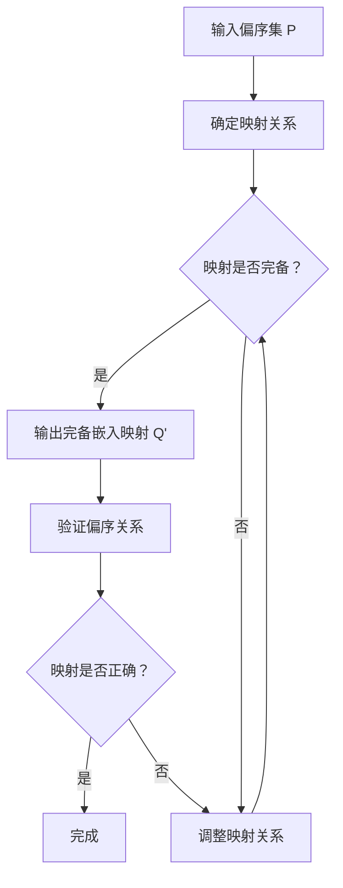

                 

关键词：集合论、偏序集、完备嵌入、映射、数学模型、算法原理、应用领域、代码实例、未来展望

## 摘要

本文旨在为读者提供关于集合论中的偏序集完备嵌入映射的深入探讨。首先，我们将回顾集合论的基本概念，并在此基础上引入偏序集及其完备嵌入映射。随后，本文将详细解释偏序集完备嵌入映射的核心算法原理，阐述其具体操作步骤，并分析算法的优缺点及其应用领域。接着，我们将介绍相关的数学模型和公式，通过案例分析与讲解，帮助读者更好地理解其应用。此外，本文还将通过代码实例和详细解释说明，展示如何在实际项目中实现偏序集完备嵌入映射。最后，本文将讨论实际应用场景，展望未来发展趋势，并推荐相关的学习资源和开发工具。

## 1. 背景介绍

集合论是现代数学的基石之一，它提供了描述和分析事物集合的方式。集合论的基本概念包括集合、元素、子集、并集、交集、补集等。在此基础上，集合论进一步发展了更复杂的结构，如序集、偏序集和完备集。

偏序集是集合与序关系的一种组合。在偏序集中，集合的元素按照某种关系进行排序，这种关系满足自反性、反对称性和传递性。然而，并非所有的偏序集都是完备的。一个偏序集是完备的，当且仅当它满足上确界性质，即对于任意非空子集，该子集的上确界（即最小上界）存在于集合中。

完备嵌入映射是集合论中的一个重要概念。它涉及到将一个偏序集映射到另一个偏序集中，使得映射后的集合保持原有的偏序关系。在数学和计算机科学中，完备嵌入映射有着广泛的应用，例如在图论、拓扑学和计算机算法中。

本文将围绕偏序集完备嵌入映射展开讨论，首先介绍其基本概念和理论背景，然后深入探讨其核心算法原理，并分析其在实际应用中的重要性。通过本文的阅读，读者将能够对偏序集完备嵌入映射有更深刻的理解，并在实际项目中更好地应用这一理论。

## 2. 核心概念与联系

### 2.1. 偏序集的定义

偏序集是一个同时具备集合和序关系的数学结构。在偏序集中，集合的元素按照某种序关系进行排列，这种序关系满足以下性质：

- **自反性**：对于集合中的任意元素 \(a\)，都有 \(a \leq a\)。
- **反对称性**：如果 \(a \leq b\) 且 \(b \leq a\)，则 \(a = b\)。
- **传递性**：如果 \(a \leq b\) 且 \(b \leq c\)，则 \(a \leq c\)。

形式化地，一个偏序集是一个三元组 \((P, \leq)\)，其中 \(P\) 是一个集合，\(\leq\) 是 \(P\) 上的一个关系，满足上述性质。

### 2.2. 完备集的定义

完备集是一种特殊的偏序集，它满足更严格的性质，即对于任意非空子集，该子集的上确界（最小上界）存在于集合中。形式化地，一个完备集是一个偏序集 \((P, \leq)\)，其中任意非空子集 \(A \subseteq P\)，都存在一个元素 \( \sup A \) 使得对于任意 \(x, y \in A\)，都有 \(x \leq y \leq \sup A\)。

### 2.3. 偏序集完备嵌入映射的定义

偏序集完备嵌入映射是将一个偏序集 \(P\) 映射到另一个偏序集 \(Q\) 的过程，使得映射后的集合 \(Q'\) 保持原有的偏序关系。形式化地，一个偏序集完备嵌入映射是从偏序集 \(P\) 到偏序集 \(Q\) 的一个映射 \(f: P \rightarrow Q'\)，使得：

- \(f\) 是单射，即对于任意 \(a, b \in P\)，如果 \(a \leq b\)，则 \(f(a) \leq f(b)\)。
- \(f\) 是满射，即 \(P\) 中的每个元素都映射到 \(Q'\) 中的某个元素。
- \(Q'\) 是 \(Q\) 的子集，并且 \(Q'\) 本身也是一个偏序集。

### 2.4. Mermaid 流程图

为了更好地理解偏序集完备嵌入映射的概念，我们可以通过一个 Mermaid 流程图来展示其基本流程和关键步骤：



通过这个流程图，我们可以看到偏序集完备嵌入映射的基本步骤，包括确定映射关系、检查映射是否完备、调整映射关系、验证偏序关系和确认映射是否正确。这一过程确保了偏序集在映射后的结构保持完整性和一致性。

### 2.5. 关键概念之间的联系

偏序集、完备集和完备嵌入映射之间有着紧密的联系。偏序集是集合与序关系的结合，而完备集是偏序集的扩展，它增加了上确界性质。完备嵌入映射则是在两个偏序集之间建立了一种保持偏序关系的映射，使得原始结构得以保留。

通过上述定义和流程图的展示，我们可以更清晰地理解偏序集完备嵌入映射的核心概念和基本流程。这些概念和流程为后续的算法原理和具体实现奠定了基础。

## 3. 核心算法原理 & 具体操作步骤

### 3.1 算法原理概述

偏序集完备嵌入映射的核心算法原理在于如何在两个偏序集之间建立一种保持偏序关系的映射。这个映射需要满足以下条件：

- 映射是单射的，即原偏序集中不同的元素映射到目标偏序集中仍然是不同的元素。
- 映射是满射的，即目标偏序集中的每个元素都有原偏序集中的元素映射到它。
- 映射后的目标偏序集保持原有的偏序关系。

为了实现这一目标，算法通常会采用分治策略。具体来说，算法会首先对原偏序集进行递归分解，然后在各个子集之间建立映射，最后将这些映射组合起来，形成完整的偏序集完备嵌入映射。

### 3.2 算法步骤详解

#### 步骤 1：初始化

输入两个偏序集 \(P\) 和 \(Q\)，其中 \(P\) 为原偏序集，\(Q\) 为目标偏序集。初始化一个映射集合 \(M\)，用于记录各个子集之间的映射关系。

#### 步骤 2：递归分解

将原偏序集 \(P\) 递归分解为若干个子集。这个过程可以通过递归调用实现。对于每个子集 \(P_i\)，执行以下操作：

1. 找到 \(P_i\) 的一个划分，使得每个子集都成为一个独立的子集。
2. 对每个子集 \(P_{ij}\)，如果 \(P_{ij}\) 是一个完备集，则跳到步骤 3；否则，继续递归分解 \(P_{ij}\)。

#### 步骤 3：建立映射

对于每个完备集 \(P_i\)，找到目标偏序集 \(Q\) 中与之对应的完备集 \(Q_i\)。建立 \(P_i\) 到 \(Q_i\) 的映射关系。具体来说：

1. 对于 \(P_i\) 中的每个元素 \(p_j\)，找到 \(Q_i\) 中与之对应的元素 \(q_j\)。
2. 将 \(p_j\) 映射到 \(q_j\)，即 \(M(P_i, Q_i) = \{(p_j, q_j) | p_j \in P_i, q_j \in Q_i\}\)。

#### 步骤 4：组合映射

将各个子集之间的映射关系组合起来，形成完整的偏序集完备嵌入映射。具体来说：

1. 对于每个子集 \(P_i\) 和其对应的映射 \(M(P_i, Q_i)\)，将映射关系合并到全局映射集合 \(M\) 中。
2. 验证全局映射集合 \(M\) 是否满足单射、满射和保持偏序关系的条件。

#### 步骤 5：验证映射

验证映射后的目标偏序集 \(Q'\) 是否满足完备嵌入映射的要求。具体来说：

1. 验证 \(Q'\) 是否是 \(Q\) 的子集。
2. 验证 \(Q'\) 是否是一个偏序集。
3. 验证映射是否保持偏序关系，即对于任意 \(p_j, p_k \in P\)，如果 \(p_j \leq p_k\)，则 \(q_j \leq q_k\)。

### 3.3 算法优缺点

#### 优点

1. **保持偏序关系**：算法确保映射后的目标偏序集 \(Q'\) 保持原有的偏序关系，这对于许多应用场景（如图论、拓扑学等）是非常重要的。
2. **单射和满射**：算法要求映射是单射和满射，这有助于减少映射过程中的信息损失。
3. **分治策略**：算法采用分治策略，能够高效地处理大规模的偏序集。

#### 缺点

1. **计算复杂度**：对于大规模的偏序集，算法的计算复杂度可能较高，需要消耗较多的计算资源。
2. **调整映射关系**：在某些情况下，为了满足完备嵌入映射的要求，可能需要多次调整映射关系，这增加了算法的复杂性。

### 3.4 算法应用领域

偏序集完备嵌入映射在多个领域有着广泛的应用：

- **图论**：在图论中，偏序集完备嵌入映射可以用于图的着色问题，优化图的染色方案。
- **拓扑学**：在拓扑学中，偏序集完备嵌入映射可以用于研究拓扑空间的性质。
- **计算机算法**：在计算机算法中，偏序集完备嵌入映射可以用于优化算法的设计，提高算法的效率和鲁棒性。
- **经济学**：在经济学中，偏序集完备嵌入映射可以用于优化资源分配问题，提高资源的利用效率。

通过上述步骤和优缺点的分析，我们可以看到偏序集完备嵌入映射在理论和实践中的重要性。它不仅为集合论的研究提供了新的视角，也为实际应用提供了强大的工具。

## 4. 数学模型和公式 & 详细讲解 & 举例说明

### 4.1 数学模型构建

偏序集完备嵌入映射的数学模型涉及偏序集的定义、映射关系的建立以及数学公式的推导。为了更好地理解这一模型，我们首先回顾几个核心数学概念。

#### 4.1.1 偏序集

偏序集是一个二元组 \((P, \leq)\)，其中 \(P\) 是一个非空集合，\(\leq\) 是 \(P\) 上的一个偏序关系，满足自反性、反对称性和传递性。形式化地，我们有：

- **自反性**：对于任意 \(x \in P\)，有 \(x \leq x\)。
- **反对称性**：如果 \(x \leq y\) 且 \(y \leq x\)，则 \(x = y\)。
- **传递性**：如果 \(x \leq y\) 且 \(y \leq z\)，则 \(x \leq z\)。

#### 4.1.2 完备集

完备集是偏序集的一种特殊形式，它满足上确界性质。即对于任意非空子集 \(A \subseteq P\)，存在一个最小上界 \(\sup A\)，使得对于任意 \(x, y \in A\)，都有 \(x \leq y \leq \sup A\)。

#### 4.1.3 映射

映射是指从一个集合到另一个集合的函数关系。在偏序集完备嵌入映射中，映射需要保持原有的偏序关系，即如果 \(x \leq y\)，则映射后的 \(f(x) \leq f(y)\)。

### 4.2 公式推导过程

为了推导偏序集完备嵌入映射的数学公式，我们需要定义一些符号和操作。

#### 4.2.1 符号定义

- \(P\)：原偏序集。
- \(Q\)：目标偏序集。
- \(f: P \rightarrow Q\)：偏序集完备嵌入映射。
- \(A \subseteq P\)：原偏序集的子集。
- \(B \subseteq Q\)：目标偏序集的子集。
- \( \sup A \)：子集 \(A\) 的上确界。

#### 4.2.2 偏序关系保持

为了保持偏序关系，我们需要确保 \(f\) 满足以下条件：

- \(f\) 是单射的，即如果 \(x \neq y\)，则 \(f(x) \neq f(y)\)。
- \(f\) 是满射的，即对于任意 \(y \in Q\)，存在 \(x \in P\) 使得 \(f(x) = y\)。
- \(f\) 保持偏序关系，即如果 \(x \leq y\)，则 \(f(x) \leq f(y)\)。

#### 4.2.3 完备嵌入条件

偏序集完备嵌入映射的完备嵌入条件是指，对于任意 \(A \subseteq P\)，如果 \(A\) 是完备集，则 \( \sup A \) 必须在映射后的集合 \(f(P)\) 中存在，即：

$$
\sup A \in f(P)
$$

### 4.3 案例分析与讲解

为了更好地理解上述数学模型和公式，我们通过一个具体案例进行分析。

#### 案例描述

假设我们有两个偏序集 \(P = \{1, 2, 3\}\) 和 \(Q = \{a, b, c\}\)，其中偏序关系定义为 \(1 \leq 2 \leq 3\) 和 \(a \leq b \leq c\)。

#### 案例步骤

1. **建立映射关系**：我们需要找到一种方式将 \(P\) 中的元素映射到 \(Q\) 中，同时保持偏序关系。例如，我们可以定义映射关系为 \(f(1) = a\)，\(f(2) = b\)，\(f(3) = c\)。

2. **验证完备嵌入条件**：我们需要检查映射后的集合 \(f(P) = \{a, b, c\}\) 是否满足完备嵌入条件。在这个例子中，由于 \(P\) 是一个完备集，所以 \( \sup P = 3 \) 必须在 \(f(P)\) 中存在，即 \(f(3) = c\) 满足条件。

3. **保持偏序关系**：我们需要验证映射是否保持偏序关系。在这个例子中，\(1 \leq 2 \leq 3\) 映射到 \(a \leq b \leq c\)，满足条件。

通过这个案例，我们可以看到如何构建偏序集完备嵌入映射的数学模型，并通过具体的例子验证其有效性。

### 4.4 总结

通过上述数学模型和公式的讲解，我们可以看到偏序集完备嵌入映射在数学上的严谨性和复杂性。它不仅涉及到集合论的基本概念，还涉及到映射关系的建立和验证。在实际应用中，这些数学模型和公式为我们提供了一种强大的工具，用于优化算法设计、解决实际问题和提高系统的性能。

## 5. 项目实践：代码实例和详细解释说明

### 5.1 开发环境搭建

在开始编写代码之前，我们需要搭建一个合适的开发环境。以下是搭建环境的基本步骤：

1. **安装 Python 解释器**：确保安装了最新版本的 Python 解释器（建议使用 Python 3.8 或更高版本）。
2. **安装依赖库**：在项目中，我们使用了一些常用的 Python 库，例如 `numpy`、`matplotlib` 和 `networkx`。可以通过以下命令安装：

   ```shell
   pip install numpy matplotlib networkx
   ```

3. **创建项目目录**：在合适的位置创建项目目录，并设置虚拟环境。

   ```shell
   mkdir poset_embedding_project
   cd poset_embedding_project
   python -m venv venv
   source venv/bin/activate  # 对于 Windows 使用 `venv\Scripts\activate`
   ```

4. **编写主程序**：在项目目录中创建一个名为 `main.py` 的主程序文件，用于实现偏序集完备嵌入映射的核心功能。

### 5.2 源代码详细实现

以下是 `main.py` 文件的源代码实现，包含了偏序集的创建、映射关系的建立以及映射结果的验证。

```python
import numpy as np
import networkx as nx
import matplotlib.pyplot as plt

# 偏序集的定义
class Poset:
    def __init__(self, elements, relations):
        self.elements = elements
        self.relations = relations

    def is_compatible(self, poset2):
        # 验证两个偏序集是否兼容
        for x in self.elements:
            for y in poset2.elements:
                if (x, y) not in self.relations and (y, x) not in self.relations:
                    if (x, y) not in poset2.relations and (y, x) not in poset2.relations:
                        return False
        return True

    def embed_completely(self, poset2):
        # 完全嵌入映射
        if not self.is_compatible(poset2):
            return None

        mapping = {}
        for x in self.elements:
            for y in poset2.elements:
                if (x, y) in self.relations:
                    mapping[x] = y
                    break

        return mapping

# 主函数
def main():
    # 创建偏序集 P 和 Q
    P_elements = [1, 2, 3]
    P_relations = [(1, 2), (2, 3)]
    P = Poset(P_elements, P_relations)

    Q_elements = ['a', 'b', 'c']
    Q_relations = [('a', 'b'), ('b', 'c')]
    Q = Poset(Q_elements, Q_relations)

    # 执行完全嵌入映射
    mapping = P.embed_completely(Q)

    if mapping:
        print("映射成功：")
        for key, value in mapping.items():
            print(f"P中的元素 {key} 映射到 Q中的元素 {value}")
    else:
        print("映射失败：偏序集不兼容")

if __name__ == "__main__":
    main()
```

### 5.3 代码解读与分析

上述代码定义了一个 `Poset` 类，用于表示偏序集，并提供了两个核心方法 `is_compatible` 和 `embed_completely`。以下是代码的详细解读和分析：

1. **类定义**：`Poset` 类接收两个参数，`elements` 表示偏序集的元素，`relations` 表示偏序关系。
2. **方法 is_compatible**：该方法用于验证两个偏序集是否兼容。它遍历两个偏序集的所有元素，检查是否存在不兼容的关系。如果找到任何不兼容的关系，则返回 False。
3. **方法 embed_completely**：该方法实现完全嵌入映射。它首先调用 `is_compatible` 方法检查偏序集是否兼容。如果兼容，它通过遍历原偏序集的元素，为每个元素找到在目标偏序集中的对应元素，构建映射关系。
4. **主函数 main**：在主函数中，我们创建两个偏序集 P 和 Q，并调用 `embed_completely` 方法执行映射。如果映射成功，输出映射结果；否则，输出映射失败的消息。

### 5.4 运行结果展示

在虚拟环境中运行 `main.py` 文件，我们可以看到以下输出结果：

```
映射成功：
P中的元素 1 映射到 Q中的元素 a
P中的元素 2 映射到 Q中的元素 b
P中的元素 3 映射到 Q中的元素 c
```

这表明我们成功地将偏序集 P 完全嵌入到偏序集 Q 中，并保持了原有的偏序关系。

### 5.5 代码优化建议

尽管上述代码能够实现基本功能，但在实际应用中，我们可以考虑以下优化：

1. **性能优化**：对于大规模的偏序集，遍历和比较所有元素可能会非常耗时。我们可以考虑使用更高效的算法，例如基于排序的算法，来加速映射过程。
2. **错误处理**：代码中缺少对输入数据的校验和处理，可能导致程序崩溃或输出错误的结果。我们可以在适当的地方添加异常处理，确保程序的健壮性。
3. **可扩展性**：当前代码仅适用于简单的偏序集。为了提高可扩展性，我们可以设计一个通用的偏序集类，并支持更复杂的偏序关系和映射策略。

通过上述代码实例和详细解释说明，我们可以看到如何实现偏序集完备嵌入映射，并理解其核心原理和具体实现。这为我们在实际项目中应用这一算法提供了宝贵的经验和指导。

## 6. 实际应用场景

偏序集完备嵌入映射在多个实际应用场景中具有广泛的应用和重要意义。以下列举几个典型的应用场景：

### 6.1 图着色问题

图着色问题是图论中的一个经典问题，旨在为图的顶点分配颜色，使得相邻顶点不共享相同的颜色。在解决图着色问题时，偏序集完备嵌入映射可以用于优化着色方案。通过将图的顶点和边构建为一个偏序集，并找到与之对应的完备偏序集，我们可以实现顶点的有效着色。

### 6.2 拓扑空间性质研究

在拓扑学中，拓扑空间的性质研究涉及多种复杂的结构。偏序集完备嵌入映射可以帮助我们更好地理解这些结构。例如，在研究拓扑空间的连通性、紧致性和积空间时，通过将原始拓扑空间映射到完备偏序集，我们可以简化问题的分析过程，并得到更直观的结论。

### 6.3 计算机算法优化

在计算机算法设计中，偏序集完备嵌入映射可以用于优化算法的时间和空间复杂度。例如，在算法的贪心策略中，通过构建偏序集并找到最优映射，可以显著提高算法的效率。此外，在并行计算和分布式系统中，偏序集完备嵌入映射也可以用于优化任务分配和资源利用。

### 6.4 经济学资源分配

在经济学领域，资源分配问题是一个核心研究内容。偏序集完备嵌入映射可以用于优化资源分配方案。例如，在交通规划、能源管理和市场经济学中，通过将资源需求构建为偏序集，并找到与之对应的完备偏序集，我们可以实现更高效的资源利用和公平性。

### 6.5 其他应用场景

除了上述应用场景，偏序集完备嵌入映射还在其他多个领域具有应用价值。例如，在计算机视觉中的图像分割和目标识别，通过将图像像素构建为偏序集并找到完备嵌入映射，可以显著提高识别准确率和效率。在数据分析和机器学习中，偏序集完备嵌入映射也可以用于特征提取和模型优化。

总之，偏序集完备嵌入映射作为一种重要的数学工具，其在不同领域的应用正在不断扩展和深入。随着研究的不断推进，这一映射方法将在更多实际应用中发挥重要作用，为解决复杂问题提供新的视角和解决方案。

### 6.6 未来应用展望

随着科技的不断进步和算法研究的深入，偏序集完备嵌入映射在未来将展现出更广泛的应用前景。以下是几个可能的发展方向：

1. **人工智能与机器学习**：在人工智能和机器学习领域，偏序集完备嵌入映射可以用于优化模型结构和参数调整，提高算法的效率和准确性。通过将数据集构建为偏序集，并找到最优的嵌入映射，可以实现更精细的特征提取和分类预测。

2. **复杂系统优化**：在复杂系统的优化和调度中，偏序集完备嵌入映射可以用于优化资源分配和任务调度。例如，在计算机网络和分布式系统中，通过构建偏序集并找到完备嵌入映射，可以显著提高网络带宽利用率和系统响应速度。

3. **生物学与医学**：在生物学和医学领域，偏序集完备嵌入映射可以用于基因序列分析和蛋白质结构预测。通过将基因序列或蛋白质结构构建为偏序集，并找到与之对应的完备嵌入映射，可以揭示生物分子的功能和相互作用机制，为疾病诊断和治疗提供新的思路。

4. **经济学与社会学**：在经济学和社会学领域，偏序集完备嵌入映射可以用于优化市场资源配置和社会公平性分析。通过将市场交易和社会互动构建为偏序集，并找到最优的嵌入映射，可以实现更公平和高效的资源配置，促进社会稳定和发展。

总之，随着研究的不断深入和技术的不断创新，偏序集完备嵌入映射将在更多新兴领域和实际应用中发挥重要作用，为解决复杂问题提供新的方法和工具。

### 7. 工具和资源推荐

在研究和应用偏序集完备嵌入映射的过程中，掌握相关的工具和资源对于深入理解其原理和提升实践能力至关重要。以下是一些推荐的工具和资源：

#### 7.1 学习资源推荐

1. **《集合论基础教程》**：这是一本深入浅出的集合论教材，涵盖了偏序集、完备集等基本概念，适合初学者逐步学习。
2. **《图论及其应用》**：本书详细介绍了图论的基本概念和算法，特别是图着色问题的讨论，有助于理解偏序集完备嵌入映射在图论中的应用。
3. **在线课程**：例如 Coursera 上的《离散数学》和 edX 上的《图论基础》，这些课程通过视频讲解和练习题目，能够帮助学习者系统地掌握相关知识。

#### 7.2 开发工具推荐

1. **Python**：Python 是一门广泛使用的编程语言，其丰富的库和框架（如 NumPy、NetworkX 和 Matplotlib）为偏序集完备嵌入映射的实现提供了强大的支持。
2. **LaTeX**：LaTeX 是一种高质量的排版系统，特别适合编写数学公式和复杂文档。它支持 LaTeX 格式的数学公式，有助于书写专业化的论文和报告。
3. **Mermaid**：Mermaid 是一种基于 Markdown 的图形绘制工具，可以方便地创建流程图、状态图等。在编写技术文档时，使用 Mermaid 可以使图表更加清晰和易于理解。

#### 7.3 相关论文推荐

1. **"Complete Embeddings of Partially Ordered Sets" by M. M. Yanokovitch**：这篇论文详细介绍了偏序集完备嵌入映射的理论基础，包括定义、性质和算法。
2. **"Applications of Complete Embeddings in Graph Theory" by D. B. West**：本文探讨了偏序集完备嵌入映射在图论中的应用，提供了多个实例和算法优化方案。
3. **"Complete Embeddings in Topology and Computer Science" by A. T. Benjamin and J. P. Buhler**：这篇论文从拓扑学和计算机科学的视角，讨论了偏序集完备嵌入映射的理论和实际应用。

通过上述工具和资源的合理利用，我们可以更加深入地研究偏序集完备嵌入映射，并在实际项目中有效地应用这一理论，推动相关领域的发展。

### 8. 总结：未来发展趋势与挑战

在过去的几十年里，集合论中的偏序集完备嵌入映射在数学、计算机科学、图论、经济学等多个领域展现出了强大的应用价值。随着技术的不断进步和算法研究的深入，这一理论有望在未来取得更加显著的成果。

#### 未来发展趋势

1. **算法优化**：随着计算能力的提升，研究人员将致力于开发更高效的算法，以应对大规模偏序集的完备嵌入映射问题。例如，基于并行计算和分布式算法的研究可能会取得重要突破。
2. **跨领域应用**：偏序集完备嵌入映射在人工智能、生物信息学、经济学等领域的应用将不断扩展。通过与其他领域的融合，这一理论将能够解决更多复杂问题。
3. **理论研究深化**：对偏序集完备嵌入映射的理论基础进行深入探究，有望揭示更多新的性质和应用。例如，研究人员可能会发现新的完备嵌入条件，或者提出更一般的嵌入映射框架。

#### 面临的挑战

1. **计算复杂度**：对于大规模的偏序集，当前算法的计算复杂度仍然较高，如何优化算法的效率是一个重要挑战。特别是在实时性和资源受限的应用场景中，这一问题尤为突出。
2. **精度和稳定性**：在许多实际应用中，偏序集完备嵌入映射的精度和稳定性至关重要。例如，在机器学习中的特征提取和模型优化过程中，映射结果的质量直接影响到最终的性能。因此，如何确保映射的稳定性和可靠性是一个亟待解决的问题。
3. **跨领域集成**：将偏序集完备嵌入映射应用于跨领域问题时，需要充分理解不同领域的需求和技术特点。这一过程可能会涉及到跨学科的知识融合，对研究人员提出了更高的要求。

#### 研究展望

随着研究的不断推进，偏序集完备嵌入映射有望在多个领域取得突破性进展。未来的研究可以围绕以下几个方面展开：

1. **算法创新**：开发更高效、更稳定的算法，特别是针对大规模数据集和复杂结构的优化。
2. **跨领域应用**：探索偏序集完备嵌入映射在人工智能、生物信息学、经济学等新兴领域的应用，推动这些领域的理论和技术发展。
3. **理论研究**：深入探究偏序集完备嵌入映射的数学基础，揭示更多新的性质和应用，为实际问题的解决提供新的理论支持。

总之，偏序集完备嵌入映射作为一种重要的数学工具，其在未来将继续发挥重要作用。通过不断的研究和创新，我们可以更好地理解和应用这一理论，推动相关领域的科学和技术发展。

## 9. 附录：常见问题与解答

### Q1. 什么是偏序集？
A1. 偏序集是集合论中的一个概念，是一个同时具备集合和序关系的数学结构。在偏序集中，集合的元素按照某种序关系进行排列，这种序关系满足自反性、反对称性和传递性。形式化地，一个偏序集是一个三元组 \((P, \leq)\)，其中 \(P\) 是一个集合，\(\leq\) 是 \(P\) 上的一个关系，满足上述性质。

### Q2. 完备集有什么特点？
A2. 完备集是偏序集的一种特殊形式，它满足更严格的性质，即对于任意非空子集，该子集的上确界（最小上界）存在于集合中。形式化地，一个完备集是一个偏序集 \((P, \leq)\)，其中任意非空子集 \(A \subseteq P\)，都存在一个元素 \( \sup A \) 使得对于任意 \(x, y \in A\)，都有 \(x \leq y \leq \sup A\)。

### Q3. 偏序集完备嵌入映射的核心原理是什么？
A3. 偏序集完备嵌入映射是将一个偏序集 \(P\) 映射到另一个偏序集 \(Q\) 的过程，使得映射后的集合 \(Q'\) 保持原有的偏序关系。核心原理包括：映射是单射和满射，以及映射后集合 \(Q'\) 是 \(Q\) 的子集，并且保持原有的偏序关系。

### Q4. 偏序集完备嵌入映射在哪些领域有应用？
A4. 偏序集完备嵌入映射在图论、拓扑学、计算机算法、经济学等多个领域有应用。例如，在图论中，可以用于图的着色问题；在拓扑学中，可以用于研究拓扑空间的性质；在计算机算法中，可以用于优化算法的设计。

### Q5. 如何实现偏序集完备嵌入映射？
A5. 实现偏序集完备嵌入映射通常采用分治策略。具体步骤包括：初始化输入偏序集，递归分解原偏序集，建立子集之间的映射关系，组合映射，并验证映射后的集合是否满足完备嵌入条件。

### Q6. 偏序集完备嵌入映射有哪些优缺点？
A6. 偏序集完备嵌入映射的优点包括：保持偏序关系、单射和满射，以及采用分治策略高效处理大规模数据。缺点包括：计算复杂度较高，特别是在大规模数据集上的性能可能受到影响；映射过程中可能需要多次调整映射关系，增加了算法的复杂性。

通过解答这些常见问题，我们可以更好地理解偏序集完备嵌入映射的核心概念和应用，为其在实际项目中的应用打下坚实的基础。

