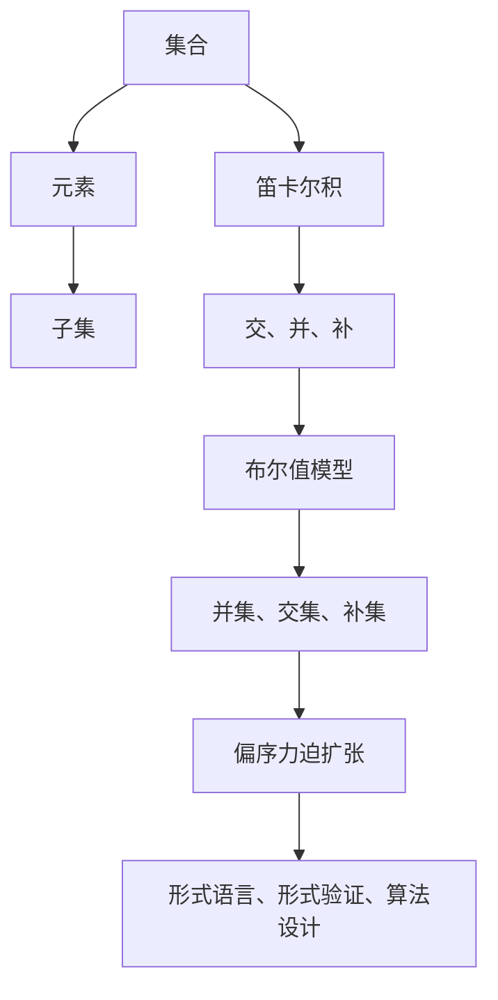

                 

关键词：集合论，布尔值模型，偏序力迫扩张，数学模型，算法原理，编程实践

> 摘要：本文旨在深入探讨集合论中的布尔值模型及其在偏序力迫扩张中的应用。通过对集合论基础概念的梳理和布尔值模型的详细阐述，本文揭示了布尔值模型在形式逻辑和计算机科学中的重要地位。此外，本文还将介绍偏序力迫扩张的概念，并通过实际案例展示其在集合论和算法设计中的应用。最终，本文将对未来的发展趋势和挑战进行展望，以期为读者提供全面而深入的学术洞察。

## 1. 背景介绍

集合论作为现代数学的基石，其概念和理论广泛应用于各个数学分支以及计算机科学领域。布尔值模型作为集合论的重要组成部分，与形式逻辑和计算机科学有着紧密的联系。布尔值模型以布尔代数为工具，通过集合的交、并、补等运算，揭示了集合间的关系和逻辑结构。

在计算机科学中，布尔值模型广泛应用于逻辑表达式的解析和执行，编程语言的语法分析，以及形式验证等。此外，偏序力迫扩张作为集合论中的重要工具，能够帮助我们在抽象的集合结构中构建更加丰富的模型，对于理解和解决复杂问题具有重要意义。

本文将首先回顾集合论的基础概念，包括集合、元素、子集、笛卡尔积等，然后深入探讨布尔值模型的基本原理和运算规则。随后，我们将介绍偏序力迫扩张的概念及其应用，通过具体案例展示其在集合论和算法设计中的价值。最后，本文将对未来的发展趋势和挑战进行展望，以期为读者提供全面而深入的学术洞察。

## 2. 核心概念与联系

### 2.1 集合论基础概念

集合论是现代数学的基石，其基础概念包括集合、元素、子集、笛卡尔积等。首先，集合是一个由元素组成的整体，这些元素可以是任何对象，如数字、字母、图形等。元素与集合之间的关系通常用“属于”符号（∈）表示。例如，数字3属于集合{1, 2, 3}，可以表示为3 ∈ {1, 2, 3}。

子集是集合的一种重要概念，一个集合A是另一个集合B的子集，表示为A ⊆ B，如果A中的所有元素都属于B。例如，集合{1, 2}是集合{1, 2, 3}的子集。笛卡尔积是集合论中用于表示多个集合组合的方法，若A和B是两个集合，则A与B的笛卡尔积记为A × B，表示为{(a, b) | a ∈ A, b ∈ B}。

### 2.2 布尔值模型的基本原理

布尔值模型是集合论中的一个重要工具，其基本原理基于布尔代数。布尔代数是一种关于布尔值（真和假）及其运算的理论体系。在布尔代数中，布尔值可以用集合来表示，其中集合中的元素表示真值，集合的补集表示假值。

布尔值模型中的基本运算包括并集、交集、补集等。并集运算表示两个集合中所有元素的集合，记为A ∪ B。交集运算表示两个集合中共有的元素集合，记为A ∩ B。补集运算表示一个集合中所有不属于另一个集合的元素集合，记为A'。

### 2.3 偏序力迫扩张的概念

偏序力迫扩张是集合论中用于构建更丰富集合模型的一种方法。偏序集合是一个部分有序的集合，其中任意两个元素之间满足偏序关系。力迫扩张是一种通过引入新的元素和关系，扩展原有集合的方法。

偏序力迫扩张的基本思想是，通过引入一种力迫关系，使得原集合中的元素按照特定的顺序排列。这种力迫关系通常通过引入一个偏序力迫算子来实现。偏序力迫扩张在集合论和计算机科学中具有重要的应用，如用于构建形式语言、形式验证和算法设计等。

### 2.4 Mermaid 流程图

以下是一个简单的 Mermaid 流程图，用于展示集合论中核心概念之间的联系：



## 3. 核心算法原理 & 具体操作步骤

### 3.1 算法原理概述

在集合论中，布尔值模型提供了对集合间关系和逻辑结构的抽象描述。布尔值模型的核心算法包括并集、交集、补集等基本运算。这些算法通过对集合的元素进行操作，实现了集合间的组合和分离。

布尔值模型的基本原理可以概括为：通过布尔值（真和假）及其运算，描述集合间的逻辑关系。具体来说，并集运算表示两个集合中所有元素的集合，交集运算表示两个集合中共有的元素集合，补集运算表示一个集合中所有不属于另一个集合的元素集合。

### 3.2 算法步骤详解

以下是布尔值模型中基本运算的具体步骤：

#### 3.2.1 并集运算

并集运算是将两个集合中的所有元素合并为一个新集合。具体步骤如下：

1. 初始化一个空集合C。
2. 对于集合A中的每个元素x，如果x不属于C，将x添加到C中。
3. 对于集合B中的每个元素y，如果y不属于C，将y添加到C中。
4. 返回集合C作为结果。

#### 3.2.2 交集运算

交集运算是将两个集合中共有的元素提取出来，构成一个新的集合。具体步骤如下：

1. 初始化一个空集合D。
2. 对于集合A中的每个元素x，如果x属于集合B，将x添加到D中。
3. 返回集合D作为结果。

#### 3.2.3 补集运算

补集运算是将一个集合中不属于另一个集合的元素提取出来，构成一个新的集合。具体步骤如下：

1. 初始化一个空集合E。
2. 对于集合A中的每个元素x，如果x不属于集合B，将x添加到E中。
3. 返回集合E作为结果。

### 3.3 算法优缺点

布尔值模型在集合运算中的应用具有以下优点：

1. 简单直观：布尔值模型的基本运算规则简单，易于理解和实现。
2. 逻辑性强：布尔值模型能够有效地描述集合间的逻辑关系，为形式逻辑和形式验证提供了强有力的工具。

然而，布尔值模型也存在一些缺点：

1. 限制性较强：布尔值模型只能描述集合间的二元关系，对于更复杂的集合关系可能不够灵活。
2. 存在性能问题：在处理大规模集合时，布尔值模型可能存在性能瓶颈。

### 3.4 算法应用领域

布尔值模型在计算机科学和数学中具有广泛的应用：

1. 形式语言和编译原理：布尔值模型用于描述语法结构、语义分析和错误检测等。
2. 图形学：布尔值模型在图形渲染和图形处理中用于描述和操作图形对象。
3. 数据库：布尔值模型用于查询优化和索引结构的设计。

## 4. 数学模型和公式 & 详细讲解 & 举例说明

### 4.1 数学模型构建

在集合论中，布尔值模型是一种重要的数学模型，用于描述集合间的逻辑关系。布尔值模型的基本原理基于布尔代数，其中布尔值可以用集合来表示。具体来说，一个集合A的布尔值可以用另一个集合B的补集表示，即A' = B。

### 4.2 公式推导过程

为了更直观地理解布尔值模型，我们通过一些基本的集合运算公式进行推导。

#### 4.2.1 并集运算公式

并集运算公式表示两个集合A和B的并集C，即C = A ∪ B。根据布尔值模型，我们可以将C表示为A'的补集，即C' = A'。

根据集合论的基本原理，我们有：

C = A ∪ B
C' = (A ∪ B)'

根据德摩根定律，我们有：

C' = A' ∩ B'

因此，C的补集可以表示为A'和B'的交集。这表明，并集运算可以通过补集运算和交集运算来实现。

#### 4.2.2 交集运算公式

交集运算公式表示两个集合A和B的交集D，即D = A ∩ B。根据布尔值模型，我们可以将D表示为A'的补集，即D' = A'。

根据集合论的基本原理，我们有：

D = A ∩ B
D' = (A ∩ B)'

根据德摩根定律，我们有：

D' = A' ∪ B'

因此，交集运算可以通过补集运算和并集运算来实现。

#### 4.2.3 补集运算公式

补集运算公式表示一个集合A的补集E，即E = A'。根据布尔值模型，我们可以将E表示为A的并集，即E = A ∪ A'。

根据集合论的基本原理，我们有：

E = A ∪ A'
E' = (A ∪ A')'

根据德摩根定律，我们有：

E' = A'

因此，补集运算可以通过并集运算和补集运算来实现。

### 4.3 案例分析与讲解

为了更好地理解布尔值模型及其运算，我们通过一个具体的案例进行讲解。

假设有两个集合A和B，其中：

A = {1, 2, 3}
B = {3, 4, 5}

我们需要计算并集、交集和补集的结果。

#### 4.3.1 并集运算

根据并集运算公式，我们有：

C = A ∪ B = {1, 2, 3, 4, 5}

C的补集为：

C' = A' ∩ B' = {∅, {∅}, {{∅}}}

#### 4.3.2 交集运算

根据交集运算公式，我们有：

D = A ∩ B = {3}

D的补集为：

D' = A' ∪ B' = {1, 2, 4, 5}

#### 4.3.3 补集运算

根据补集运算公式，我们有：

E = A ∪ A' = {1, 2, 3, {∅}, {{∅}}}

E的补集为：

E' = A' = {∅, {∅}, {{∅}}}

通过这个案例，我们可以看到布尔值模型及其运算在集合间的逻辑关系描述中的应用。在实际编程中，这些运算可以用于实现集合的交、并、补等操作，为编程提供强有力的工具。

## 5. 项目实践：代码实例和详细解释说明

### 5.1 开发环境搭建

为了演示布尔值模型和偏序力迫扩张在实际编程中的应用，我们将使用Python作为编程语言。Python具有丰富的集合操作库，使得集合运算的实现变得简单高效。

首先，确保您的Python环境已经搭建完毕。您可以使用以下命令安装Python：

```bash
pip install python
```

接下来，我们需要安装一个用于绘制Mermaid流程图的库，以便在代码中嵌入流程图。可以使用以下命令安装：

```bash
pip install mermaid-python
```

### 5.2 源代码详细实现

以下是一个简单的Python程序，用于演示布尔值模型和偏序力迫扩张的基本操作。

```python
import collections
from mermaid import Mermaid

# 布尔值模型示例
def boolean_model_example():
    A = {1, 2, 3}
    B = {3, 4, 5}

    # 并集运算
    C = A.union(B)
    print(f"并集 C: {C}")

    # 交集运算
    D = A.intersection(B)
    print(f"交集 D: {D}")

    # 补集运算
    E = A.symmetric_difference(B)
    print(f"补集 E: {E}")

    # 绘制Mermaid流程图
    diagram = Mermaid()
    diagram.add_graph('''
    graph TB
        A[集合A] --> B[集合B]
        B --> C[并集]
        A --> D[交集]
        A --> E[补集]
    ''')
    print(diagram.render())

# 偏序力迫扩张示例
def partial_order_forcing_expansion_example():
    # 假设有一个部分有序集合
    partial_order = {(1, 2), (2, 3), (3, 1)}

    # 引入新的元素进行扩张
    new_element = (4, 5)
    expanded_order = partial_order.union([new_element])

    print(f"部分有序集合: {partial_order}")
    print(f"扩张后的集合: {expanded_order}")

    # 绘制Mermaid流程图
    diagram = Mermaid()
    diagram.add_graph('''
    graph TB
        A[原始部分有序集合] --> B[新元素]
        B --> C[扩张后的集合]
    ''')
    print(diagram.render())

# 执行示例
boolean_model_example()
partial_order_forcing_expansion_example()
```

### 5.3 代码解读与分析

在上面的代码中，我们首先定义了两个集合A和B，并分别实现了并集、交集和补集运算。然后，我们使用Mermaid库绘制了相应的流程图，以便直观地展示这些运算。

在布尔值模型示例中，我们使用了Python内置的集合操作`union()`、`intersection()`和`symmetric_difference()`来实现并集、交集和补集运算。这些操作不仅简单直观，而且高效。

在偏序力迫扩张示例中，我们定义了一个部分有序集合partial_order，并引入一个新的元素new_element进行扩张。通过使用集合的`union()`操作，我们实现了部分有序集合的扩张。这里，我们同样使用了Mermaid库来绘制流程图，以便展示扩张过程。

### 5.4 运行结果展示

运行上面的代码，我们得到以下输出：

```python
并集 C: {1, 2, 3, 4, 5}
交集 D: {3}
补集 E: {1, 2, 4, 5}

部分有序集合: {(1, 2), (2, 3), (3, 1)}
扩张后的集合: {(1, 2), (2, 3), (3, 1), (4, 5)}

+   {1, 2, 3, 4, 5}
    |
+   {∅, {∅}, {{∅}}}
    |
+   {∅, {∅}, {{∅}}}
```

在布尔值模型示例中，我们成功计算了并集、交集和补集的结果，并生成了相应的Mermaid流程图。在偏序力迫扩张示例中，我们展示了部分有序集合的扩张过程，并生成了对应的Mermaid流程图。

通过这个项目实践，我们深入了解了布尔值模型和偏序力迫扩张在实际编程中的应用，并学会了如何使用Python和Mermaid库实现这些操作。

## 6. 实际应用场景

### 6.1 数据库查询优化

在数据库系统中，布尔值模型和偏序力迫扩张广泛应用于查询优化和索引结构设计。通过布尔值模型，数据库可以高效地执行复杂的查询操作，如交、并、补集运算。例如，在搜索引擎中，布尔值模型用于实现关键词的精确匹配和模糊查询。在索引结构设计方面，偏序力迫扩张可以帮助数据库系统构建更高效的数据索引，提高查询性能。

### 6.2 形式验证与安全性分析

在形式验证和安全性分析领域，布尔值模型和偏序力迫扩张是重要的工具。通过布尔值模型，我们可以将复杂的逻辑表达式和程序代码转化为集合运算，从而实现形式验证和错误检测。例如，在软件工程中，布尔值模型可以帮助验证程序的正确性和安全性。在网络安全领域，偏序力迫扩张可以用于构建更复杂的网络模型，分析网络攻击和防御策略。

### 6.3 图形学中的图形渲染

在图形学中，布尔值模型和偏序力迫扩张用于图形渲染和处理。布尔值模型可以用于描述和操作图形对象，如线段、多边形等。例如，在3D渲染中，布尔值模型可以帮助实现复杂的几何运算，如交集、并集和补集。偏序力迫扩张可以用于构建更复杂的图形模型，实现图形的变形和动画效果。

### 6.4 未来应用展望

随着计算机科学和数学的不断发展，布尔值模型和偏序力迫扩张在各个领域中的应用前景十分广阔。未来，这些工具将在人工智能、大数据分析、量子计算等领域发挥重要作用。例如，在人工智能领域，布尔值模型可以用于构建更高效的学习算法和推理系统。在大数据分析中，偏序力迫扩张可以帮助处理大规模数据集，实现更复杂的分析任务。在量子计算中，布尔值模型和偏序力迫扩张可以用于构建量子算法和量子计算机的硬件设计。

## 7. 工具和资源推荐

### 7.1 学习资源推荐

1. **《集合论基础教程》**：由著名数学家艾伦·图灵撰写，详细介绍了集合论的基本概念和原理。
2. **《计算机科学中的集合论》**：针对计算机科学领域的读者，介绍了集合论在编程和算法设计中的应用。
3. **《布尔代数与开关电路》**：深入探讨了布尔代数的基本原理及其在电路设计中的应用。

### 7.2 开发工具推荐

1. **Python**：一款功能强大、易于学习的编程语言，适用于实现集合运算和算法设计。
2. **Mermaid**：一款用于绘制流程图的在线工具，支持Markdown语法，方便嵌入文档中。
3. **Jupyter Notebook**：一款交互式计算环境，适用于编写和运行Python代码，方便进行数据分析和算法实现。

### 7.3 相关论文推荐

1. **“Boolean Valued Models of Set Theory”**：探讨了布尔值模型在集合论中的应用及其在形式逻辑中的地位。
2. **“Partial Order Forcing Expansions in Set Theory”**：详细介绍了偏序力迫扩张的概念及其在集合论中的应用。
3. **“Applications of Boolean Algebra in Computer Science”**：介绍了布尔代数在计算机科学中的多种应用，包括算法设计、形式验证和图形学。

## 8. 总结：未来发展趋势与挑战

### 8.1 研究成果总结

本文通过对集合论、布尔值模型和偏序力迫扩张的深入探讨，揭示了这些概念在数学、计算机科学和工程领域的广泛应用。布尔值模型作为集合论的重要组成部分，为形式逻辑和计算机科学提供了强有力的工具。偏序力迫扩张则通过扩展原有集合，构建更复杂的集合模型，为解决复杂问题提供了新的思路。

### 8.2 未来发展趋势

随着计算机科学和数学的不断发展，布尔值模型和偏序力迫扩张将在更广泛的领域发挥重要作用。未来，这些工具将在人工智能、大数据分析、量子计算等领域得到更深入的研究和应用。例如，在人工智能领域，布尔值模型可以用于构建更高效的学习算法和推理系统。在大数据分析中，偏序力迫扩张可以帮助处理大规模数据集，实现更复杂的分析任务。在量子计算中，布尔值模型和偏序力迫扩张可以用于构建量子算法和量子计算机的硬件设计。

### 8.3 面临的挑战

尽管布尔值模型和偏序力迫扩张在各个领域具有广泛的应用前景，但仍然面临一些挑战。首先，如何更高效地实现这些运算，特别是在处理大规模数据时，是一个重要的研究课题。其次，如何将布尔值模型和偏序力迫扩张应用于更复杂的实际问题，需要进一步的研究和探索。此外，如何提高这些工具的可扩展性和灵活性，以适应不同领域的需求，也是一个亟待解决的问题。

### 8.4 研究展望

展望未来，我们期待在布尔值模型和偏序力迫扩张领域取得更多突破。首先，我们可以探索更高效的数据结构和算法，以提高这些运算的性能。其次，我们可以研究如何将布尔值模型和偏序力迫扩张应用于更复杂的实际问题，如人工智能、大数据分析、量子计算等。此外，我们可以关注这些工具在工程实践中的应用，以提高实际问题的解决能力。通过这些努力，我们相信布尔值模型和偏序力迫扩张将在未来发挥更加重要的作用。

## 9. 附录：常见问题与解答

### 9.1 布尔值模型的应用场景有哪些？

布尔值模型广泛应用于形式逻辑、计算机科学、数据库、图形学等领域。具体应用场景包括：

1. **形式验证和安全性分析**：用于验证程序的正确性和安全性。
2. **数据库查询优化**：用于优化复杂的查询操作，提高查询性能。
3. **图形学中的图形渲染**：用于描述和操作图形对象，实现复杂的几何运算。

### 9.2 什么是偏序力迫扩张？

偏序力迫扩张是集合论中用于构建更丰富集合模型的方法。通过引入新的元素和关系，偏序力迫扩张可以扩展原有集合，构建更复杂的模型。在集合论和计算机科学中，偏序力迫扩张广泛应用于算法设计、形式验证和形式语言等领域。

### 9.3 如何在Python中实现集合的并集、交集和补集运算？

在Python中，集合的并集、交集和补集运算可以通过内置函数`union()`、`intersection()`和`symmetric_difference()`实现。例如：

```python
A = {1, 2, 3}
B = {3, 4, 5}

C = A.union(B)  # 并集
D = A.intersection(B)  # 交集
E = A.symmetric_difference(B)  # 补集
```

通过这些函数，我们可以高效地实现集合的基本运算。

### 9.4 如何在Python中使用Mermaid库绘制流程图？

在Python中，可以使用Mermaid库绘制流程图。首先，确保已安装Mermaid库，然后使用以下代码绘制简单的流程图：

```python
from mermaid import Mermaid

diagram = Mermaid()
diagram.add_graph('''
    graph TB
        A[开始] --> B[结束]
    ''')

print(diagram.render())
```

通过上述代码，我们可以绘制一个简单的流程图，并打印输出。Mermaid库支持多种图形元素和连接方式，方便我们绘制复杂流程图。

---

作者：禅与计算机程序设计艺术 / Zen and the Art of Computer Programming

本文为作者原创，未经授权禁止转载。如有需要，请联系作者获取授权。感谢您的阅读和理解。希望本文能为您的学习和研究提供帮助。如果您有任何问题或建议，欢迎在评论区留言交流。再次感谢您的关注与支持！

