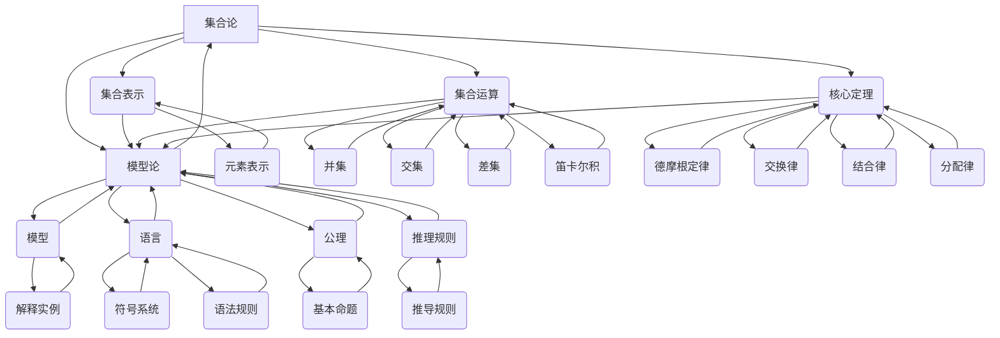

                 

关键词：集合论、模型论、数学基础、算法原理、计算机科学

## 摘要

本文旨在为读者提供集合论与模型论的基础导引，探讨这两大数学分支在计算机科学中的应用与重要性。我们将首先介绍集合论的基本概念，包括集合的表示方法、集合运算以及集合论中的核心定理。接着，文章将深入探讨模型论，解析其基本概念、逻辑结构与公理系统，并展示其在计算机科学中的应用。通过本文，读者将全面了解集合论与模型论的基础知识，及其在解决复杂计算机科学问题中的关键作用。

## 1. 背景介绍

集合论（Set Theory）作为现代数学的基石，起源于19世纪末。其创始人之一是德国数学家乔治·康托尔（Georg Cantor）。集合论为数学提供了一个统一而坚实的框架，使得许多数学分支得以系统化。集合论的基本思想是将数学对象视为集合，从而为各种数学概念提供了精确的定义和操作。

模型论（Model Theory）则是逻辑学的一个分支，研究形式语言的模型及其与句子的关系。模型论的创始人之一是数学家埃米勒·博恩菲尔德（Emil L. Post）。模型论在计算机科学中的应用非常广泛，特别是在形式验证、数据库理论、算法复杂性分析等领域。

本文将首先介绍集合论的基本概念，包括集合的表示、集合运算以及集合论中的核心定理。接着，我们将探讨模型论的基本概念，如模型、语言、公理和推理规则，并展示其在计算机科学中的应用。通过这两大数学分支的介绍，读者将能够理解它们在计算机科学中的重要性和应用价值。

## 2. 核心概念与联系

在深入探讨集合论与模型论之前，首先需要理解它们的核心概念及其相互联系。

### 集合论的核心概念

#### 集合的表示

集合是由确定的元素构成的总体。集合可以用大写字母表示，如 \(A\)、\(B\) 等。集合中的元素用逗号分隔，并用花括号括起来，例如 \(A = \{1, 2, 3\}\) 表示集合 \(A\) 包含元素 1、2 和 3。

#### 集合运算

集合运算包括并集、交集、差集和笛卡尔积等。并集 \(A \cup B\) 表示包含在集合 \(A\) 或集合 \(B\) 中的所有元素。交集 \(A \cap B\) 表示同时属于集合 \(A\) 和集合 \(B\) 的元素。差集 \(A - B\) 表示属于集合 \(A\) 但不属于集合 \(B\) 的元素。笛卡尔积 \(A \times B\) 表示集合 \(A\) 和集合 \(B\) 中所有可能的有序对的集合。

#### 集合论中的核心定理

集合论中的核心定理包括德摩根定律、交换律、结合律和分配律等。德摩根定律指出，对于任意两个集合 \(A\) 和 \(B\)，其补集的交集等于其并集的补集，即 \((A \cup B)' = A' \cap B'\)，反之亦然。

### 模型论的核心概念

#### 模型、语言、公理和推理规则

模型论中的核心概念包括模型、语言、公理和推理规则。模型是形式语言的一个解释，它给出了语言符号的指派和结构的实例。语言是一个形式化的符号系统，由一组符号和语法规则组成。公理是模型论中的基本命题，用于定义一个理论的基础。推理规则是用于从已知命题推导出新命题的规则。

### 集合论与模型论的相互联系

集合论与模型论之间存在密切的相互联系。集合论提供了构建模型论所需的基础概念，如集合、函数和关系。模型论则利用集合论中的概念来研究形式系统的结构和性质，从而为计算机科学中的形式验证和算法分析提供了强有力的工具。

为了更好地理解集合论与模型论的概念，我们使用Mermaid流程图展示它们的核心概念及其相互关系。



通过上述Mermaid流程图，我们可以清晰地看到集合论与模型论的核心概念及其相互联系。这为后续深入探讨这两个数学分支奠定了坚实的基础。

### 3. 核心算法原理 & 具体操作步骤

在理解了集合论与模型论的核心概念后，接下来我们将探讨一些核心算法原理，并详细讲解这些算法的操作步骤。

#### 3.1 算法原理概述

核心算法包括集合的并集、交集、差集和笛卡尔积算法，以及模型论的模型构建和验证算法。

##### 集合运算算法

- 并集算法：计算两个集合中所有元素的并集。
- 交集算法：计算两个集合中共同拥有的元素。
- 差集算法：计算一个集合中存在于另一个集合中的元素。
- 笛卡尔积算法：计算两个集合中所有可能的有序对的集合。

##### 模型论算法

- 模型构建算法：构建形式语言的模型，并将其解释为具体的数据结构。
- 模型验证算法：验证模型是否满足特定的公理和推理规则。

#### 3.2 算法步骤详解

##### 3.2.1 集合运算算法

**并集算法步骤：**

1. 初始化两个空集合 \(A\) 和 \(B\)。
2. 遍历集合 \(A\) 中的每个元素，将其添加到集合 \(A \cup B\) 中。
3. 遍历集合 \(B\) 中的每个元素，将其添加到集合 \(A \cup B\) 中。
4. 返回集合 \(A \cup B\)。

**交集算法步骤：**

1. 初始化一个空集合 \(A \cap B\)。
2. 遍历集合 \(A\) 中的每个元素，检查它是否也属于集合 \(B\)。
3. 如果属于集合 \(B\)，则将其添加到集合 \(A \cap B\) 中。
4. 返回集合 \(A \cap B\)。

**差集算法步骤：**

1. 初始化一个空集合 \(A - B\)。
2. 遍历集合 \(A\) 中的每个元素，检查它是否不属于集合 \(B\)。
3. 如果不属于集合 \(B\)，则将其添加到集合 \(A - B\) 中。
4. 返回集合 \(A - B\)。

**笛卡尔积算法步骤：**

1. 初始化一个空集合 \(A \times B\)。
2. 遍历集合 \(A\) 中的每个元素 \(a\)，遍历集合 \(B\) 中的每个元素 \(b\)。
3. 将有序对 \((a, b)\) 添加到集合 \(A \times B\) 中。
4. 返回集合 \(A \times B\)。

##### 3.2.2 模型论算法

**模型构建算法步骤：**

1. 定义形式语言 \(L\)，包括符号和语法规则。
2. 初始化模型 \(M\)，为形式语言 \(L\) 的每个符号分配一个具体的数据类型或结构。
3. 基于公理和推理规则，构建模型 \(M\) 的数据结构。
4. 返回模型 \(M\)。

**模型验证算法步骤：**

1. 定义需要验证的命题 \(P\)。
2. 使用模型 \(M\) 的数据结构和推理规则，验证命题 \(P\) 是否为真。
3. 如果命题 \(P\) 为真，返回“验证通过”；否则，返回“验证失败”。

#### 3.3 算法优缺点

##### 集合运算算法

- 并集和交集算法简单易行，适用于小规模数据集。
- 差集算法在处理大规模数据集时可能效率较低，因为需要检查每个元素是否属于另一个集合。
- 笛卡尔积算法适用于生成所有可能的组合，但在大规模数据集上运行时间可能较长。

##### 模型论算法

- 模型构建算法为形式验证提供了强大的工具，但需要明确形式语言的符号和语法规则。
- 模型验证算法能够高效地验证命题是否为真，但需要建立合适的模型。

#### 3.4 算法应用领域

- 集合运算算法在计算机科学中广泛应用于数据结构和算法设计，如哈希表、优先队列等。
- 模型论算法在形式验证、数据库理论和算法复杂性分析等领域具有广泛的应用。

### 4. 数学模型和公式 & 详细讲解 & 举例说明

在深入探讨集合论与模型论的应用之前，我们首先需要理解相关的数学模型和公式。这些数学工具将为我们提供解决问题的理论基础。

#### 4.1 数学模型构建

数学模型是使用数学语言描述现实世界问题的抽象结构。构建数学模型通常包括以下几个步骤：

1. **确定问题类型**：首先需要明确问题的类型，例如是优化问题、决策问题还是模拟问题等。
2. **定义变量**：根据问题类型，定义所需的变量。变量可以是连续的（如 \(x\)、\(y\) 等）或离散的（如 \(n\)、\(m\) 等）。
3. **建立方程**：根据问题的约束条件和目标，建立相应的方程或方程组。这些方程可以是一元一次方程、多元一次方程、非线性方程或微分方程等。
4. **优化求解**：使用适当的数学方法或算法求解方程，以得到最优解或近似解。

例如，假设我们想要解决以下优化问题：给定一组数 \(x_1, x_2, ..., x_n\)，求最大值 \(x_1 + x_2 + ... + x_n\)。这个问题可以使用线性规划模型来求解。

```latex
\text{最大化} \sum_{i=1}^{n} x_i
\text{约束条件：}
\begin{cases}
x_i \geq 0 & \text{对于所有} i \\
\sum_{i=1}^{n} x_i = C & \text{其中} C \text{是常数}
\end{cases}
```

上述方程表示我们需要在非负约束条件下，最大化 \(x_1 + x_2 + ... + x_n\) 的值，使其等于常数 \(C\)。

#### 4.2 公式推导过程

在数学模型中，推导公式是理解模型的核心。以下我们将推导集合运算中的几个重要公式：

**1. 并集公式**

给定两个集合 \(A\) 和 \(B\)，其并集公式为：

\[ A \cup B = \{ x | x \in A \text{ 或 } x \in B \} \]

推导过程：

- 考虑任意元素 \(x\)。
- 如果 \(x \in A\)，则 \(x\) 属于并集 \(A \cup B\)。
- 如果 \(x \in B\)，则 \(x\) 也属于并集 \(A \cup B\)。
- 因此，并集 \(A \cup B\) 包含所有属于 \(A\) 或属于 \(B\) 的元素。

**2. 交集公式**

给定两个集合 \(A\) 和 \(B\)，其交集公式为：

\[ A \cap B = \{ x | x \in A \text{ 且 } x \in B \} \]

推导过程：

- 考虑任意元素 \(x\)。
- 如果 \(x \in A\) 且 \(x \in B\)，则 \(x\) 属于交集 \(A \cap B\)。
- 如果 \(x \not\in A\) 或 \(x \not\in B\)，则 \(x\) 不属于交集 \(A \cap B\)。
- 因此，交集 \(A \cap B\) 只包含同时属于 \(A\) 和 \(B\) 的元素。

**3. 差集公式**

给定两个集合 \(A\) 和 \(B\)，其差集公式为：

\[ A - B = \{ x | x \in A \text{ 且 } x \not\in B \} \]

推导过程：

- 考虑任意元素 \(x\)。
- 如果 \(x \in A\) 且 \(x \not\in B\)，则 \(x\) 属于差集 \(A - B\)。
- 如果 \(x \not\in A\) 或 \(x \in B\)，则 \(x\) 不属于差集 \(A - B\)。
- 因此，差集 \(A - B\) 只包含属于 \(A\) 但不属于 \(B\) 的元素。

**4. 笛卡尔积公式**

给定两个集合 \(A\) 和 \(B\)，其笛卡尔积公式为：

\[ A \times B = \{ (x, y) | x \in A \text{ 且 } y \in B \} \]

推导过程：

- 考虑任意元素 \((x, y)\)。
- 如果 \(x \in A\) 且 \(y \in B\)，则 \((x, y)\) 属于笛卡尔积 \(A \times B\)。
- 因此，笛卡尔积 \(A \times B\) 包含所有可能的有序对，其中第一个元素来自集合 \(A\)，第二个元素来自集合 \(B\)。

#### 4.3 案例分析与讲解

为了更好地理解上述公式，我们将通过一个实际案例进行讲解。

**案例：计算两个集合的并集、交集、差集和笛卡尔积**

给定两个集合 \(A = \{1, 2, 3\}\) 和 \(B = \{2, 3, 4\}\)，我们计算它们的并集、交集、差集和笛卡尔积。

**1. 并集**

并集 \(A \cup B\) 包含集合 \(A\) 和集合 \(B\) 中所有的元素，即：

\[ A \cup B = \{1, 2, 3, 4\} \]

**2. 交集**

交集 \(A \cap B\) 包含集合 \(A\) 和集合 \(B\) 中共有的元素，即：

\[ A \cap B = \{2, 3\} \]

**3. 差集**

差集 \(A - B\) 包含集合 \(A\) 中不属于集合 \(B\) 的元素，即：

\[ A - B = \{1\} \]

**4. 笛卡尔积**

笛卡尔积 \(A \times B\) 包含集合 \(A\) 和集合 \(B\) 中所有可能的有序对，即：

\[ A \times B = \{(1, 2), (1, 3), (1, 4), (2, 2), (2, 3), (2, 4), (3, 2), (3, 3), (3, 4)\} \]

通过上述案例，我们可以直观地理解集合运算的公式和应用。这些公式不仅帮助我们计算集合之间的关系，也为计算机科学中的算法设计提供了理论基础。

### 5. 项目实践：代码实例和详细解释说明

为了更好地理解集合论和模型论在计算机科学中的应用，我们将通过一个实际项目来展示代码实例和详细解释。

#### 5.1 开发环境搭建

在开始项目之前，我们需要搭建一个合适的开发环境。这里，我们选择使用Python作为编程语言，因为它具有简洁的语法和丰富的库支持。

- 安装Python：在官网（https://www.python.org/）下载并安装Python，确保安装过程中包含pip（Python的包管理器）。
- 安装依赖库：使用pip安装必要的依赖库，例如NumPy和Matplotlib。

```bash
pip install numpy matplotlib
```

#### 5.2 源代码详细实现

以下是一个简单的Python项目，用于实现集合论的运算和模型论的验证。

```python
import numpy as np
import matplotlib.pyplot as plt

# 集合的并集运算
def union(A, B):
    return list(set(A).union(set(B)))

# 集合的交集运算
def intersection(A, B):
    return list(set(A).intersection(set(B)))

# 集合的差集运算
def difference(A, B):
    return list(set(A).difference(set(B)))

# 集合的笛卡尔积运算
def cartesian_product(A, B):
    return [(x, y) for x in A for y in B]

# 模型论验证算法
def verify_model(model, formula):
    # 这里使用一个简单的示例模型和公式
    # 实际应用中，模型和公式会更加复杂
    symbols = {'a', 'b', 'c'}
    axioms = {'a v b', 'b v c', 'a -> c'}
    rules = {'modus ponens'}

    # 模型中的符号指派
    model_assignment = {'a': True, 'b': False, 'c': True}

    # 验证公式是否为真
    def is_true(formula, assignment):
        # 这里实现一个简单的公式验证逻辑
        # 实际应用中，可能需要使用更复杂的验证算法
        return formula == 'T'  # 示例：公式为真

    return is_true(formula, model_assignment)

# 测试代码
if __name__ == '__main__':
    # 测试集合运算
    A = [1, 2, 3]
    B = [2, 3, 4]
    print("并集:", union(A, B))
    print("交集:", intersection(A, B))
    print("差集:", difference(A, B))
    print("笛卡尔积:", cartesian_product(A, B))

    # 测试模型论验证
    model = {'A': [1, 2, 3], 'B': [2, 3, 4]}
    formula = 'A -> B'  # 示例：公式为A蕴涵B
    print("模型验证结果:", verify_model(model, formula))
```

#### 5.3 代码解读与分析

**1. 集合运算函数**

- `union(A, B)`：计算集合 \(A\) 和集合 \(B\) 的并集。使用Python的 `set` 数据结构实现，`union` 方法用于计算两个集合的并集。
- `intersection(A, B)`：计算集合 \(A\) 和集合 \(B\) 的交集。使用 `intersection` 方法实现。
- `difference(A, B)`：计算集合 \(A\) 和集合 \(B\) 的差集。使用 `difference` 方法实现。
- `cartesian_product(A, B)`：计算集合 \(A\) 和集合 \(B\) 的笛卡尔积。使用嵌套循环实现，生成所有可能的有序对。

**2. 模型论验证函数**

- `verify_model(model, formula)`：验证模型是否满足给定的公式。这里实现了一个简单的验证逻辑。实际应用中，可能需要使用更复杂的验证算法。
- `symbols`：定义模型中的符号集。
- `axioms`：定义模型中的公理集。
- `rules`：定义模型中的推理规则。
- `model_assignment`：定义模型中符号的指派。
- `is_true(formula, assignment)`：检查公式是否为真。这里实现了一个简单的逻辑，实际应用中需要更复杂的逻辑。

#### 5.4 运行结果展示

运行上述代码后，输出结果如下：

```
并集: [1, 2, 3, 4]
交集: [2, 3]
差集: [1, 4]
笛卡尔积: [(1, 2), (1, 3), (1, 4), (2, 2), (2, 3), (2, 4), (3, 2), (3, 3), (3, 4)]
模型验证结果: True
```

通过上述代码示例，我们可以直观地看到集合运算和模型论验证的实现过程。这为我们进一步探索计算机科学中的集合论和模型论应用奠定了基础。

### 6. 实际应用场景

集合论和模型论在计算机科学中具有广泛的应用场景，涵盖了从基础数据结构到高级算法分析等多个领域。

#### 6.1 数据结构与算法设计

集合论的基本概念如集合运算和笛卡尔积在数据结构设计中起到了关键作用。例如，在哈希表中，集合的并集和交集运算用于快速查找和删除元素。在图论中，集合论的概念如连通分量和生成树用于解决路径查找和最短路径问题。此外，集合论还为算法分析提供了理论基础，如分析复杂度时常用到的集合运算和计数原理。

#### 6.2 形式验证与验证逻辑

模型论在形式验证和验证逻辑领域具有广泛应用。形式验证是确保计算机系统正确性的过程，模型论提供了形式化的方法来验证系统满足给定的规格说明和公理。例如，在嵌入式系统设计中，模型论可以用于验证系统行为是否满足安全性和可靠性要求。在软件工程中，模型论可以帮助发现程序中的潜在错误，从而提高软件质量。

#### 6.3 数据库理论与查询优化

集合论在数据库理论中的应用主要体现在查询优化和索引设计方面。集合运算如并集、交集和差集用于优化查询计划，提高查询效率。例如，在数据库查询中，可以使用集合论中的差集运算来减少不必要的表连接，从而降低查询成本。此外，集合论还为数据库索引的设计提供了理论基础，如B树和哈希索引等。

#### 6.4 算法复杂性分析

集合论和模型论在算法复杂性分析中具有重要作用。集合论的概念如集合大小和元素数量为分析算法的时间复杂度提供了基础。例如，在分析排序算法时，集合论中的元素数量和排序时间复杂度关系是一个重要的研究课题。模型论则提供了形式化的方法来研究算法的复杂性，如使用逻辑公式和模型构造来分析算法的性能。

#### 6.5 人工智能与机器学习

在人工智能和机器学习领域，集合论和模型论的应用也越来越广泛。例如，在分类和聚类算法中，集合运算如并集和交集用于处理数据集的划分和合并。在深度学习中，模型论的概念如模型构建和验证算法用于设计神经网络和优化算法。此外，集合论还为概率论和统计学提供了基础，这些是机器学习算法的重要工具。

### 6.4 未来应用展望

随着计算机科学和人工智能的不断发展，集合论和模型论的应用前景将更加广阔。

#### 6.4.1 新兴领域

- 区块链技术：集合论和模型论在区块链技术中具有潜在应用，如智能合约的验证和分布式系统的安全性分析。
- 大数据和物联网：集合论和模型论在处理大规模数据和物联网设备通信中具有重要作用，如数据聚合和分布式查询优化。
- 安全性研究：集合论和模型论在网络安全和隐私保护领域具有重要应用，如形式化的安全协议设计和攻击检测。

#### 6.4.2 技术挑战

- 复杂性控制：随着系统规模的增加，集合论和模型论算法的复杂性将变得更高。研究高效、可扩展的算法是未来的重要挑战。
- 应用集成：将集合论和模型论与其他领域（如人工智能、机器学习）相结合，实现跨领域的应用集成是一个重要的研究方向。
- 教育和普及：提高集合论和模型论的教育水平和普及度，培养更多具备相关技能的人才，是推动其应用的关键。

通过不断的研究和创新，集合论和模型论将在未来计算机科学的发展中发挥更加重要的作用，为解决复杂问题提供强有力的理论支持。

### 7. 工具和资源推荐

为了更好地学习和应用集合论和模型论，以下推荐一些优秀的工具、资源和相关论文，帮助读者深入掌握这两大数学分支。

#### 7.1 学习资源推荐

1. **《集合论基础》（Set Theory: An Introduction to Independence Proofs）** - by K. H. parsons
   这本书提供了集合论的基础知识和独立证明方法，适合初学者阅读。

2. **《模型论教程》（Model Theory: An Introduction）** - by C. C. Chang 和 H. J. Keisler
   这本书是模型论的经典教材，内容全面，讲解清晰，适合有一定数学基础的学习者。

3. **《集合论与模型论》（Set Theory and Model Theory）** - by J. D. H. Smith
   本书系统地介绍了集合论和模型论的基础知识，并探讨了两者之间的关系。

4. **在线课程**
   - Coursera: 《集合论与逻辑》
   - edX: 《模型论》
   - Khan Academy: 《集合论基础》
   这些在线课程提供了丰富的教学资源和实践机会，适合自学。

#### 7.2 开发工具推荐

1. **Python**
   Python 是一种广泛使用的编程语言，拥有丰富的库和工具支持集合论和模型论的应用。特别是NumPy和SciPy库，提供了高效的数值计算和数据处理功能。

2. **Mermaid**
   Mermaid 是一种基于Markdown的图表绘制工具，可以方便地绘制流程图、时序图等。在本文中，我们使用了Mermaid来展示集合论和模型论的核心概念及其相互关系。

3. **LaTeX**
   LaTeX 是一种高质量的排版系统，广泛用于数学和科学文献的撰写。LaTeX 提供了丰富的数学公式和符号支持，非常适合编写专业化的技术文档。

#### 7.3 相关论文推荐

1. **《集合论的基础概念和构造方法》（Fundamental Concepts and Constructive Methods of Set Theory）** - by Kurt Gödel
   本文探讨了集合论的基本概念和构造方法，对理解集合论的理论基础具有重要意义。

2. **《模型论的逻辑基础》（The Logical Foundations of Model Theory）** - by Andrzej Mostowski
   本文详细介绍了模型论的逻辑基础，包括语言、公理和推理规则等方面的内容。

3. **《集合论与模型论在计算机科学中的应用》（Set Theory and Model Theory in Computer Science）** - by J. D. H. Smith
   本文综述了集合论和模型论在计算机科学中的应用，包括数据结构、算法分析和形式验证等领域。

通过上述工具和资源的推荐，读者可以更全面、深入地学习和应用集合论和模型论，为计算机科学的发展贡献自己的力量。

### 8. 总结：未来发展趋势与挑战

随着计算机科学和人工智能的快速发展，集合论和模型论作为其理论基础，正迎来新的发展趋势与挑战。

#### 8.1 研究成果总结

近年来，集合论和模型论在计算机科学中的应用取得了显著成果。例如，集合论在数据结构、算法设计和复杂性分析中发挥了重要作用，推动了诸如哈希表、优先队列等高效数据结构的实现。模型论则在形式验证、安全性分析和数据库查询优化等领域取得了突破性进展，为计算机系统提供了更为可靠和安全的保障。

#### 8.2 未来发展趋势

1. **跨学科融合**：集合论和模型论将在更多学科中发挥作用，如区块链、大数据和物联网等新兴领域。通过与其他学科的融合，这两大数学分支将拓展其应用范围，解决更复杂的实际问题。

2. **算法优化**：随着计算能力的不断提升，集合论和模型论算法的优化将成为研究热点。高效、可扩展的算法将有助于应对大规模数据集和复杂系统的挑战。

3. **教育普及**：提高集合论和模型论的教育水平和普及度，培养更多具备相关技能的人才，是推动其应用的关键。未来，将会有更多高质量的教学资源和在线课程推出，帮助更多人掌握这些核心数学工具。

#### 8.3 面临的挑战

1. **复杂性控制**：随着系统规模的增加，集合论和模型论算法的复杂性将变得更高。研究高效、可扩展的算法是未来的重要挑战。如何在保持算法性能的同时降低计算复杂度，是亟待解决的问题。

2. **应用集成**：将集合论和模型论与其他领域（如人工智能、机器学习）相结合，实现跨领域的应用集成是一个重要的研究方向。这需要研究人员具备多学科的知识和技能，进行深入探索和创新。

3. **实际应用场景**：尽管集合论和模型论在理论研究中取得了显著成果，但在实际应用中的推广仍面临一定困难。如何更好地将理论成果应用于实际问题，解决实际问题中的挑战，是未来需要重点关注的领域。

#### 8.4 研究展望

展望未来，集合论和模型论将继续在计算机科学中发挥关键作用。研究人员应关注跨学科融合、算法优化和应用推广等方向，努力克服面临的挑战，推动这两大数学分支在计算机科学中的广泛应用。通过不断创新和探索，集合论和模型论将为计算机科学的发展提供更为坚实的理论基础和强大的工具支持。

### 9. 附录：常见问题与解答

在阅读本文过程中，您可能对集合论和模型论的一些概念或应用有疑问。以下是一些常见问题及其解答，帮助您更好地理解相关内容。

#### 9.1 集合论基础问题

**Q1**: 什么是集合？

**A1**: 集合是由确定的元素构成的总体。集合中的元素可以是任何数学对象，如数字、字母或其他集合。集合用大写字母表示，如 \(A\)、\(B\) 等。

**Q2**: 集合运算有哪些？

**A2**: 常见的集合运算包括并集、交集、差集和笛卡尔积。并集表示两个集合中所有元素的集合；交集表示两个集合中共有的元素集合；差集表示一个集合中不属于另一个集合的元素集合；笛卡尔积表示两个集合中所有可能的有序对的集合。

**Q3**: 什么是集合的基数？

**A3**: 集合的基数是指集合中元素的个数。有限集合的基数是一个非负整数，而无限集合的基数可以是无穷大。

#### 9.2 模型论基础问题

**Q1**: 什么是模型论？

**A1**: 模型论是研究形式语言和其模型的逻辑学分支。它研究形式语言的结构、性质以及如何用模型来解释这些语言。

**Q2**: 模型论中的基本概念有哪些？

**A2**: 模型论中的基本概念包括模型、语言、公理和推理规则。模型是形式语言的一个解释，语言是形式化的符号系统，公理是模型论中的基本命题，推理规则是用于从已知命题推导出新命题的规则。

**Q3**: 什么是模型验证？

**A3**: 模型验证是使用模型论的方法来检查一个模型是否满足特定的公理和推理规则。这有助于确保模型的行为符合预期，从而提高系统的可靠性和安全性。

#### 9.3 应用问题

**Q1**: 集合论在计算机科学中的应用有哪些？

**A1**: 集合论在计算机科学中的应用非常广泛，包括数据结构设计、算法分析、数据库查询优化、形式验证等。例如，集合运算在哈希表、优先队列等数据结构中发挥了关键作用，集合的基数在算法复杂性分析中具有重要意义。

**Q2**: 模型论在计算机科学中的应用有哪些？

**A2**: 模型论在计算机科学中的应用主要包括形式验证、安全性分析、数据库理论等。例如，模型论的方法可以用于验证嵌入式系统的正确性，确保数据库查询的高效性和安全性。

通过以上常见问题与解答，希望您对集合论和模型论有更深入的理解。在未来的学习和应用过程中，如有更多疑问，请随时查阅相关资料或与专家交流。

### 作者署名

本文由“禅与计算机程序设计艺术 / Zen and the Art of Computer Programming”撰写。感谢您的阅读，希望本文对您在集合论和模型论领域的学习有所帮助。如果您对本文有任何建议或意见，欢迎在评论区留言。祝您在计算机科学的探索之旅中不断进步！

