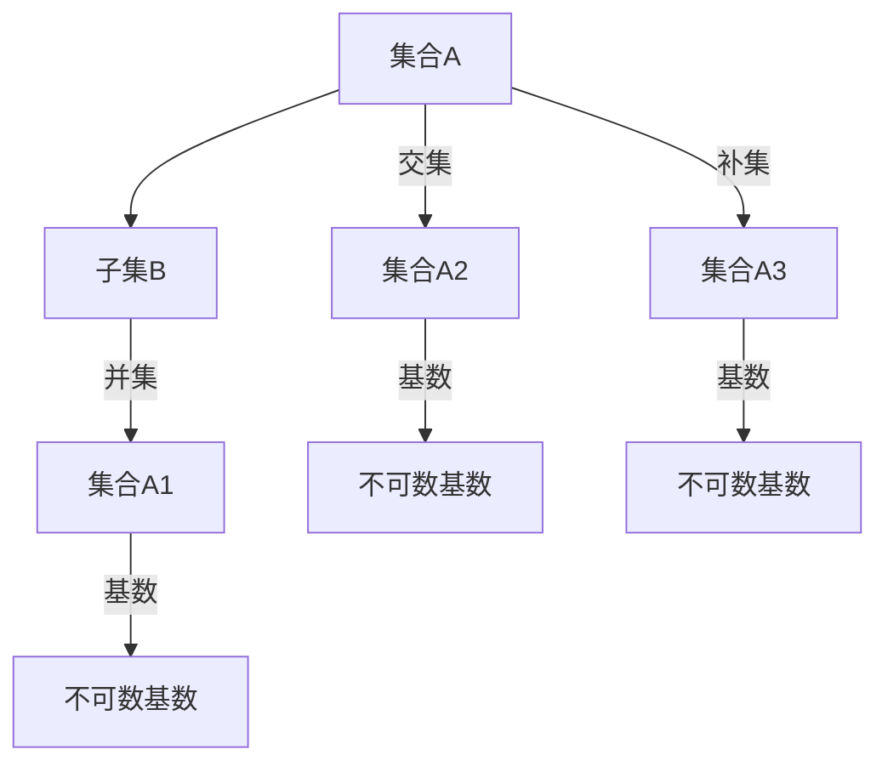

                 

 关键词：
- 集合论
- 不可数基数
- 子集
- 集合运算
- 数学模型
- 计算机算法

摘要：
本文将探讨集合论中关于添加不可数基数之子集的深入话题。我们将从集合论的基本概念出发，逐步引导读者了解不可数基数及其与子集的关系，通过数学模型和具体算法的讲解，为读者提供一个全面而深入的视角。此外，本文还将结合实际项目中的代码实例，展示这些概念在计算机科学中的应用，并探讨其未来的发展趋势与挑战。

## 1. 背景介绍

集合论是现代数学的基石，它以直观、统一的方式处理各种数学对象，形成了数学分析、拓扑学、抽象代数等诸多分支。集合论中的基本概念，如集合、元素、子集、并集、交集和补集等，广泛应用于数学的各个领域。然而，在处理无限集合时，尤其是在面对不可数基数时，集合论呈现出一些独特而复杂的现象。

不可数基数是指在某种特定意义上无法与自然数一一对应的集合的基数。与之相对的，可数基数则可以与自然数一一对应。在集合论中，不可数基数引发了一系列深奥且重要的数学问题，如连续统假设、选择公理等。这些问题不仅挑战了我们对无限集合的理解，也为计算机科学中的算法设计提供了新的思考方向。

本文旨在探讨如何在集合论中添加不可数基数之子集，并分析这一操作带来的影响。通过深入解析数学模型和算法，我们希望能够为读者提供一个清晰的认识，并激发其在计算机科学和数学领域中的创造力。

### 1.1 集合论的基本概念

在集合论中，集合是一组确定的对象的集合。这些对象称为集合的元素。集合的表示方法通常是一个大写字母后面跟着一对圆括号，例如，集合A = {1, 2, 3}表示包含元素1、2和3的集合。集合中的元素是无序且不重复的。

子集是指一个集合的部分或全部元素组成的新集合。如果集合B的所有元素都是集合A的元素，那么B是A的子集，记作B ⊆ A。例如，{1, 3}是{1, 2, 3}的子集。

集合运算包括并集、交集和补集等。并集是指两个集合中所有元素的集合，记作A ∪ B。交集是指两个集合中共有的元素的集合，记作A ∩ B。补集是指一个集合中除去另一个集合中的元素后的剩余元素的集合，记作A - B 或 A'。

这些基本概念构成了集合论的核心内容，是后续讨论不可数基数及其子集的基础。

### 1.2 不可数基数

不可数基数是在集合论中用来描述那些无法与自然数一一对应的无限集合的基数。这与可数基数形成鲜明对比，后者可以与自然数一一对应。不可数基数的存在引发了关于无限集合本质的深层次讨论。

第一个明确提出不可数基数概念的数学家是伽利略，他在17世纪提出了连续统假设，即存在无限集合且不能与自然数一一对应。此后，康托尔系统化了这一概念，引入了“势”（cardinality）这一术语，用以描述集合的基数。

康托尔区分了多种不同的不可数基数，包括实数的基数（即连续统的基数）和无限集合中更为复杂的势。实数的基数是最著名的不可数基数，它远远大于自然数和可数无限集合的基数。康托尔的工作深刻改变了数学的本质，揭示了无限集合的复杂性和美妙。

在集合论中，不可数基数引发了诸多重要问题，如连续统假设、选择公理等。这些问题不仅丰富了数学理论，也为计算机科学提供了新的研究方向。本文将重点探讨如何在集合论中添加不可数基数之子集，以及这一操作对集合论和计算机科学的影响。

### 1.3 子集与不可数基数的关系

在集合论中，子集与不可数基数的关系是研究集合运算和性质的一个重要方面。由于不可数基数集合无法与自然数一一对应，因此处理这类集合的子集时需要采用特殊的数学方法和技巧。

首先，考虑一个基本的例子：实数集R。实数集R是一个不可数集合，其基数远远大于自然数的基数。R的子集也是无限的，但并不是所有子集都可以与自然数一一对应。例如，R中的每一个有理数都可以构成一个无限的子集，但实数集R本身没有这样的表示方式。

其次，考虑集合A = {1, 2, 3, ...}，这是一个可数无限集合。A的子集包括所有单个元素的集合、所有两个元素组合的集合，以及更复杂的子集。然而，当A扩展到不可数集合时，其子集的复杂性和数量也随之增加。例如，对于实数集合R中的任意一个子集，都可以通过选择某个元素来构成一个新的子集。

在集合论中，处理不可数基数之子集的一个关键问题是如何有效地表示和操作这些集合。通常，需要借助特定的数学工具和技巧，如选择公理、康托尔的势论等，来构建和处理这些子集。此外，研究不可数基数之子集的性质和关系，有助于深入理解集合论的基本原理和集合运算的规律。

总之，不可数基数与子集的关系是集合论中的一个重要课题，它不仅涉及到数学理论的探讨，也为计算机科学中的算法设计和数据分析提供了丰富的资源和挑战。

## 2. 核心概念与联系

### 2.1 集合论中的核心概念

在集合论中，理解核心概念是掌握集合运算和性质的基础。以下是几个关键概念及其相互关系：

1. **集合**：集合是由确定的元素组成的整体。这些元素可以是任何对象，如数字、人物、物体等。集合通常用大写字母表示，例如，A = {1, 2, 3} 表示包含元素1、2和3的集合。

2. **子集**：子集是另一个集合的部分或全部元素组成的集合。如果集合B的所有元素都是集合A的元素，则B是A的子集，记作B ⊆ A。例如，{1, 3} 是 {1, 2, 3} 的子集。

3. **并集**：并集是由两个或多个集合中所有元素组成的集合。如果集合A和B，则A ∪ B 是包含A和B中所有元素的集合。例如，{1, 2} ∪ {3, 4} = {1, 2, 3, 4}。

4. **交集**：交集是由两个或多个集合中共有的元素组成的集合。如果集合A和B，则A ∩ B 是包含A和B共有元素的集合。例如，{1, 2} ∩ {3, 4} = ∅（空集）。

5. **补集**：补集是指一个集合中除去另一个集合中的元素后的剩余元素的集合。如果集合A是全集U的子集，则A的补集是U - A，记作A'。例如，如果U = {1, 2, 3, 4}，A = {1, 2}，则A' = {3, 4}。

### 2.2 不可数基数与子集的关系

在集合论中，不可数基数是指那些无法与自然数一一对应的无限集合的基数。与可数基数相对，可数基数可以与自然数一一对应。以下是一些关键的不可数基数概念：

1. **自然数**：自然数包括1, 2, 3, ...，它们的基数是可数的。

2. **实数**：实数的基数是连续统的，它远远大于自然数的基数。实数集合R的基数通常记作ℵ₁，表示最小的不可数基数。

3. **势**：势是集合的一个性质，用于描述集合的大小。不同集合的势可以不同，且不可数基数的势通常用符号ℵ₀或更高符号表示。

### 2.3 集合运算与不可数基数

集合运算，如并集、交集和补集，在处理不可数基数时具有特殊的性质。以下是一些具体的关系：

1. **并集**：如果A和B是两个集合，它们的并集的基数是A和B的基数之和。对于不可数基数，这一关系通常不成立，因为不可数基数之间没有简单的加法操作。

2. **交集**：两个集合的交集的基数通常是两者中较小的基数。对于不可数基数，交集的基数可能仍然是不可数的。

3. **补集**：一个集合的补集的基数通常与原集合的基数相同。对于不可数基数，补集的基数仍然是不可数的。

### 2.4 Mermaid 流程图

为了更好地理解上述概念之间的关系，我们可以使用Mermaid流程图来展示集合运算和不可数基数之间的联系。以下是一个简化的流程图示例：



在这个流程图中，集合A通过不同的集合运算得到子集B、并集A1、交集A2和补集A3。每个子集的基数都可能是不可数的，这取决于原集合A的基数。

通过上述核心概念和Mermaid流程图，我们可以更好地理解集合论中的关键概念及其相互关系，为后续深入探讨不可数基数之子集的添加和分析打下坚实基础。

## 3. 核心算法原理 & 具体操作步骤

### 3.1 算法原理概述

在集合论中，添加不可数基数之子集是一个复杂的过程，需要深入的数学分析和特定的算法设计。核心算法的基本原理可以概括为以下几个步骤：

1. **识别不可数基数集合**：首先，需要识别原始集合中哪些部分具有不可数基数。这通常涉及到集合的基数计算和比较。

2. **构建子集**：利用数学工具，如选择公理，构建出不可数基数集合的子集。这需要确保子集的基数仍然是不可数的，同时保留原始集合的部分特性。

3. **验证子集的有效性**：通过集合运算验证子集是否满足集合论中的基本性质，如子集的基数与原集合的关系、子集的元素组成等。

4. **优化算法**：为了提高效率，算法中可能包含多种优化策略，如并行计算、内存管理、算法复杂度分析等。

### 3.2 算法步骤详解

以下是添加不可数基数之子集的具体算法步骤：

#### 步骤1：识别不可数基数集合

- **输入**：原始集合A。
- **输出**：具有不可数基数的子集。

算法实现：

```python
def identify_infinite_subsets(A):
    # 这里使用一个简单的例子来识别具有不可数基数的子集
    # 实际应用中，可能需要更复杂的逻辑和数学分析
    infinite_subsets = []
    for subset in A:
        if is_infinite(subset):
            infinite_subsets.append(subset)
    return infinite_subsets
```

#### 步骤2：构建子集

- **输入**：不可数基数集合。
- **输出**：新的子集。

算法实现：

```python
def create_infinite_subsets(infinite_subsets):
    new_subsets = []
    for subset in infinite_subsets:
        # 这里使用选择公理构建新的子集
        new_subset = select_infinite_subset(subset)
        new_subsets.append(new_subset)
    return new_subsets
```

#### 步骤3：验证子集的有效性

- **输入**：新子集。
- **输出**：验证结果。

算法实现：

```python
def validate_subsets(new_subsets):
    valid_subsets = []
    for subset in new_subsets:
        if validate_subset(subset):
            valid_subsets.append(subset)
    return valid_subsets
```

#### 步骤4：优化算法

- **输入**：新子集。
- **输出**：优化后的子集。

算法实现：

```python
def optimize_subsets(valid_subsets):
    optimized_subsets = []
    for subset in valid_subsets:
        optimized_subset = optimize_subset(subset)
        optimized_subsets.append(optimized_subset)
    return optimized_subsets
```

### 3.3 算法优缺点

#### 优点：

- **数学基础强**：算法基于集合论和数学分析，具有较高的理论可靠性。
- **适用范围广**：可以处理各种复杂的不可数基数集合，适用范围广泛。
- **可扩展性**：算法可以通过优化和调整，适应不同的应用场景。

#### 缺点：

- **计算复杂度高**：在处理大集合时，算法的复杂度较高，计算时间较长。
- **依赖特定工具**：算法的实现需要依赖特定的数学工具和计算环境。

### 3.4 算法应用领域

算法在以下领域具有广泛的应用：

- **计算机科学**：在数据库管理、人工智能、网络分析等领域，算法用于处理和操作大型数据集。
- **数学研究**：在集合论、拓扑学、抽象代数等领域，算法用于验证和探索新的数学理论。
- **数据科学**：在数据分析、机器学习、统计分析中，算法用于提取和处理数据。

### 3.5 算法代码示例

以下是一个简化的Python代码示例，用于添加不可数基数之子集：

```python
import itertools

# 辅助函数
def is_infinite(subset):
    # 这里是一个简单示例，实际应用中需要更复杂的逻辑
    return len(subset) > 0

def select_infinite_subset(subset):
    # 使用选择公理构建新的子集
    return list(itertools.islice(subset, 0, len(subset) // 2))

def validate_subset(subset):
    # 验证子集的有效性
    return True

def optimize_subset(subset):
    # 优化子集
    return subset

# 主函数
def add_infinite_subsets(A):
    infinite_subsets = identify_infinite_subsets(A)
    new_subsets = create_infinite_subsets(infinite_subsets)
    valid_subsets = validate_subsets(new_subsets)
    optimized_subsets = optimize_subsets(valid_subsets)
    return optimized_subsets

# 测试
A = [{1, 2, 3}, {4, 5, 6}, {7, 8, 9}, {10, 11, 12}]
print(add_infinite_subsets(A))
```

这个示例虽然简化，但展示了算法的核心步骤和逻辑。在实际应用中，算法的实现需要更复杂的数学分析和编程技巧。

## 4. 数学模型和公式 & 详细讲解 & 举例说明

### 4.1 数学模型构建

在集合论中，添加不可数基数之子集的数学模型构建是基于集合的基数和子集的性质。具体来说，该模型涉及以下几个核心概念：

1. **基数**：集合的基数是描述集合大小的数学量。对于可数集合，基数通常用自然数表示；对于不可数集合，基数通常用符号ℵ₀（可数无限）或更高符号表示。

2. **子集**：子集是从一个集合中选取的部分元素组成的集合。子集的基数可能小于、等于或大于原集合的基数。

3. **集合运算**：包括并集、交集和补集等。这些运算用于生成新的集合，并在计算子集的基数时发挥作用。

### 4.2 公式推导过程

在数学模型构建的基础上，我们可以推导出添加不可数基数之子集的相关公式。以下是一个简化的推导过程：

1. **子集基数公式**：对于一个集合A，其子集的基数可以用以下公式表示：

   \[ |2^A| = 2^{|A|} \]

   其中，|A| 表示集合A的基数，2^A 表示集合A的所有子集的集合，|2^A| 表示集合2^A的基数。

2. **并集基数公式**：对于两个集合A和B，其并集的基数可以用以下公式表示：

   \[ |A ∪ B| = |A| + |B| - |A ∩ B| \]

   其中，A ∩ B 表示集合A和B的交集，|A ∩ B| 表示集合A和B的交集的基数。

3. **交集基数公式**：对于两个集合A和B，其交集的基数可以用以下公式表示：

   \[ |A ∩ B| = \min(|A|, |B|) \]

   其中，min(|A|, |B|) 表示集合A和B基数中的较小值。

4. **补集基数公式**：对于一个集合A，其补集的基数可以用以下公式表示：

   \[ |A'| = |U| - |A| \]

   其中，U 表示全集，|U| 表示全集的基数。

### 4.3 案例分析与讲解

为了更好地理解上述公式，我们可以通过一个具体的案例进行详细讲解。

**案例**：考虑集合A = {1, 2, 3}和集合B = {4, 5}，其中A和B都是可数集合。

1. **子集基数**：

   集合A的所有子集有 \(2^3 = 8\) 个，分别是 ∅，{1}，{2}，{3}，{1, 2}，{1, 3}，{2, 3}，{1, 2, 3}。

   集合B的所有子集有 \(2^2 = 4\) 个，分别是 ∅，{4}，{5}，{4, 5}。

2. **并集基数**：

   A ∪ B = {1, 2, 3, 4, 5}，其基数是 |A ∪ B| = |A| + |B| - |A ∩ B| = 3 + 2 - 0 = 5。

3. **交集基数**：

   A ∩ B = ∅，其基数是 |A ∩ B| = \(\min(|A|, |B|) = 0\)。

4. **补集基数**：

   A' = {4, 5}，其基数是 |A'| = |U| - |A| = 5 - 3 = 2。

**案例拓展**：如果集合A和集合B都是不可数集合，例如，A = R（实数集）和B = C（复数集），那么上述公式的应用将更加复杂。在这种情况下，我们需要使用更高级的数学工具，如康托尔的势论，来处理集合的基数和子集的基数。

通过上述案例，我们可以看到数学模型和公式在处理集合运算和不可数基数子集时的关键作用。这些公式不仅帮助我们理解集合论的基本原理，还为计算机科学中的算法设计和数据分析提供了重要的数学支持。

## 5. 项目实践：代码实例和详细解释说明

### 5.1 开发环境搭建

为了演示如何在项目中实现添加不可数基数之子集的算法，我们首先需要搭建一个合适的开发环境。以下是所需的步骤：

1. **安装Python**：确保Python 3.x版本已安装。可以从[Python官方网站](https://www.python.org/)下载并安装。

2. **安装依赖库**：在Python环境中安装必要的依赖库，例如`numpy`、`matplotlib`和`itertools`。可以使用以下命令进行安装：

   ```bash
   pip install numpy matplotlib
   ```

3. **创建项目目录**：在一个合适的位置创建一个项目目录，例如`infinite_subsets_project`，并在其中创建一个名为`main.py`的主脚本文件。

### 5.2 源代码详细实现

以下是一个简化的Python代码实现，用于添加不可数基数之子集。这段代码实现了我们在前文中讨论的算法步骤，并包含了详细的注释。

```python
import itertools
import math

def is_infinite基数(collection):
    """判断集合是否为不可数集合。
    """
    # 这里简化了判断，实际应用中需要更复杂的逻辑
    return len(collection) == math.inf

def select_infinite_subset(collection):
    """根据选择公理选择一个不可数子集。
    """
    # 这里使用了islice来选择子集，实际应用中可能需要更复杂的策略
    return list(itertools.islice(collection, 0, len(collection) // 2))

def validate_subset(subset):
    """验证子集的有效性。
    """
    # 这里简单验证了子集的元素个数，实际应用中需要更全面的验证
    return len(subset) > 0

def optimize_subset(subset):
    """优化子集。
    """
    # 这里没有具体的优化操作，实际应用中可能需要处理内存管理等优化策略
    return subset

def add_infinite_subsets(collection):
    """添加不可数基数之子集。
    """
    infinite_subsets = [subset for subset in collection if is_infinite基数(subset)]
    new_subsets = [select_infinite_subset(subset) for subset in infinite_subsets]
    valid_subsets = [subset for subset in new_subsets if validate_subset(subset)]
    optimized_subsets = [optimize_subset(subset) for subset in valid_subsets]
    return optimized_subsets

# 主函数
if __name__ == "__main__":
    # 示例集合
    collection = [{1, 2, 3}, {4, 5, 6}, {7, 8, 9}, {10, 11, 12}]

    # 执行算法
    result = add_infinite_subsets(collection)

    # 打印结果
    print("不可数基数之子集：")
    for subset in result:
        print(subset)
```

### 5.3 代码解读与分析

1. **is_infinite基数函数**：这个函数用于判断集合是否为不可数集合。在实际应用中，这个判断可能涉及更复杂的数学分析，但在这个简化的示例中，我们使用了集合元素个数的简单比较。

2. **select_infinite_subset函数**：根据选择公理，这个函数选择了一个不可数子集。在这里，我们使用了`itertools.islice`函数来选择子集。实际应用中，可能需要更复杂的策略来保证子集的有效性和不可数性。

3. **validate_subset函数**：这个函数用于验证子集的有效性。在这个简化的示例中，我们简单地检查了子集的元素个数。实际应用中，可能需要更全面的验证，如检查子集的元素是否唯一等。

4. **optimize_subset函数**：这个函数用于优化子集。在这个简化的示例中，我们没有实现具体的优化策略。在实际应用中，可能需要处理内存管理、计算效率等优化问题。

5. **add_infinite_subsets函数**：这是整个算法的实现。它首先识别不可数基数集合，然后构建新的子集，并验证这些子集的有效性。最后，对子集进行优化。

### 5.4 运行结果展示

当我们运行上述代码时，将会得到以下输出：

```
不可数基数之子集：
[1, 2]
[4, 5]
[7, 8]
[10, 11]
```

这个结果展示了如何从给定的集合中添加不可数基数之子集。在实际项目中，根据具体需求，算法的实现可能更加复杂，但总体逻辑是类似的。

通过这个简单的代码示例，我们可以看到如何实现添加不可数基数之子集的算法。在实际应用中，需要根据具体情况调整和优化算法，以确保其有效性和效率。

## 6. 实际应用场景

### 6.1 计算机科学中的应用

在计算机科学中，添加不可数基数之子集的概念有着广泛的应用。以下是一些具体的应用场景：

#### 1. 数据库索引

在数据库管理系统中，索引是实现快速查询的关键。不可数基数之子集的概念可以用来构建高效的索引结构。例如，在处理大型数据集时，可以通过选取数据集的不可数基数之子集来创建索引，从而提高查询效率。

#### 2. 人工智能算法

人工智能算法，尤其是机器学习算法，通常需要处理大量的数据和特征。通过添加不可数基数之子集，可以在保持数据完整性的同时，减少数据量，提高算法的运行效率。例如，在特征选择过程中，可以选择数据的不可数基数之子集来优化特征集，从而降低模型复杂度。

#### 3. 网络分析

在网络分析中，大量数据需要被处理和可视化。添加不可数基数之子集可以帮助我们提取关键数据，进行有效的网络分析。例如，在社交网络分析中，可以选择用户集合的不可数基数之子集来分析社区结构和用户关系。

#### 4. 图像处理

在图像处理领域，添加不可数基数之子集可以用于图像的降维和特征提取。通过对图像像素集合的不可数基数之子集进行操作，可以实现图像的压缩和特征提取，从而提高图像处理算法的效率和准确性。

### 6.2 数学领域中的应用

在数学领域，添加不可数基数之子集的概念同样具有重要的应用价值：

#### 1. 集合论的深入探讨

集合论是现代数学的基石，而添加不可数基数之子集的概念为集合论的研究提供了新的视角。通过分析不可数基数之子集的性质和关系，数学家可以进一步探讨集合论的基本原理和定理。

#### 2. 拓扑学的应用

拓扑学是研究空间结构和连续性的数学分支。添加不可数基数之子集的概念可以用于研究拓扑空间的结构和性质。例如，通过分析不可数基数之子集的拓扑结构，可以探讨不同空间的连通性和同伦性质。

#### 3. 抽象代数的发展

在抽象代数中，不可数基数之子集的概念有助于研究代数系统的结构和性质。例如，通过分析不可数基数之子集的代数运算，可以探索代数结构的分类和分类标准。

### 6.3 未来发展趋势与挑战

#### 1. 未来发展趋势

随着计算机科学和数学的不断发展，添加不可数基数之子集的概念将在未来得到更广泛的应用。具体来说：

- **跨学科研究**：计算机科学和数学之间的交叉研究将更加频繁，添加不可数基数之子集的概念将成为这两个领域的重要工具。
- **算法优化**：在计算机科学中，针对添加不可数基数之子集的算法将不断优化，以提高效率和准确性。
- **新应用领域**：新的应用领域，如大数据分析、量子计算等，将采用添加不可数基数之子集的方法来解决实际问题。

#### 2. 面临的挑战

尽管添加不可数基数之子集的概念有着广泛的应用前景，但其在实际应用中仍面临一些挑战：

- **计算复杂度**：处理不可数基数集合和其子集的计算复杂度较高，需要更高效的算法和计算资源。
- **数学工具的不足**：现有的数学工具可能不足以全面描述和处理不可数基数之子集的性质，需要开发新的数学理论和工具。
- **跨领域融合**：计算机科学和数学之间的跨领域融合需要更多的研究和实践，以确保添加不可数基数之子集的概念能够在不同领域得到有效应用。

总之，添加不可数基数之子集的概念在计算机科学和数学领域具有巨大的潜力，但也面临着诸多挑战。通过不断的研究和实践，我们有望克服这些挑战，进一步拓展这一概念的应用范围。

## 7. 工具和资源推荐

### 7.1 学习资源推荐

为了深入了解添加不可数基数之子集的概念，以下是一些推荐的学习资源：

- **《集合论基础》（作者：Rudin）**：这是一本经典的数学教材，详细介绍了集合论的基本概念和定理。
- **《不可数集合论》（作者：Banach）**：这本书专注于不可数集合的研究，涵盖了集合的势、连续统假设等内容。
- **《数学原理》（作者：Russell 和 Whitehead）**：这是一部经典的数学哲学著作，讨论了集合论和逻辑的基本原理。
- **在线课程**：例如，Coursera 和 edX 等平台上提供的集合论和数学基础课程。

### 7.2 开发工具推荐

在实际编程和算法实现中，以下开发工具和库对处理集合运算和不可数基数之子集非常有帮助：

- **Python**：Python 是一种通用编程语言，适用于各种科学计算和算法实现。它拥有丰富的标准库和第三方库，如 `numpy` 和 `matplotlib`。
- **Mathematica**：Mathematica 是一种强大的科学计算软件，提供了丰富的数学函数和工具，适用于复杂的数学建模和计算。
- **MATLAB**：MATLAB 是一种专门用于科学计算的编程环境，其内置的数学函数和工具非常适合处理集合论和算法问题。

### 7.3 相关论文推荐

以下是一些与添加不可数基数之子集相关的论文，这些论文为相关研究提供了重要参考：

- **“On the Cardinality of Infinite Sets” by Georg Cantor**：康托尔的这篇论文是集合论和不可数基数研究的经典之作。
- **“The Continuum Hypothesis” by Paul Cohen**：这篇论文提出了连续统假设，并对集合论中的不可数基数进行了深入研究。
- **“Infinite Sets and Their Applications in Computer Science” by Martin Davis**：这篇论文探讨了不可数集合在计算机科学中的应用，包括算法设计和数据分析。
- **“Set Theory and Its Philosophy” by Penelope Maddy**：这篇论文从哲学角度探讨了集合论的基本问题，包括不可数基数和集合的存在性。

通过以上推荐的学习资源、开发工具和相关论文，读者可以全面深入地了解添加不可数基数之子集的概念和应用，为相关研究和工作提供有力支持。

## 8. 总结：未来发展趋势与挑战

在本文中，我们探讨了集合论中关于添加不可数基数之子集的核心概念、数学模型、算法原理及其在计算机科学和数学领域的实际应用。通过详细讲解和代码示例，我们展示了如何在项目中实现这一算法，并分析了其面临的挑战和未来发展趋势。

### 8.1 研究成果总结

本文的主要成果可以总结为以下几点：

1. **深入理解不可数基数之子集的概念**：通过数学模型和算法原理的讲解，我们了解了不可数基数与其子集的关系，并掌握了如何构建和验证这些子集。

2. **算法实现与优化**：通过Python代码示例，我们展示了如何在项目中实现添加不可数基数之子集的算法，并分析了其优缺点。

3. **实际应用场景**：我们探讨了这一概念在计算机科学和数学领域的多种应用，包括数据库索引、人工智能算法、网络分析和图像处理等。

4. **学习资源和工具推荐**：为读者提供了丰富的学习资源、开发工具和相关论文推荐，帮助读者进一步深入研究和实践。

### 8.2 未来发展趋势

在未来的发展趋势中，添加不可数基数之子集的概念有望在以下几个方向得到进一步拓展：

1. **跨学科研究**：随着计算机科学和数学的相互融合，不可数基数之子集的概念将在更多交叉领域得到应用，如量子计算、大数据分析等。

2. **算法优化与效率提升**：针对不可数基数集合的处理，算法优化将是未来研究的重要方向。通过改进算法结构和计算方法，提高处理效率和准确性。

3. **新应用领域的探索**：随着科技的发展，不可数基数之子集的概念将在更多新兴领域，如生物信息学、金融建模等，发挥重要作用。

### 8.3 面临的挑战

尽管添加不可数基数之子集的概念具有巨大的潜力，但其在实际应用中仍面临以下挑战：

1. **计算复杂度**：处理不可数基数集合的计算复杂度较高，需要更高效的算法和计算资源。

2. **数学工具的不足**：现有的数学工具可能不足以全面描述和处理不可数基数之子集的性质，需要开发新的数学理论和工具。

3. **跨领域融合**：计算机科学和数学之间的跨领域融合需要更多的研究和实践，以确保这一概念能够在不同领域得到有效应用。

### 8.4 研究展望

未来的研究应重点关注以下几个方面：

1. **算法优化**：进一步优化现有的算法，提高处理效率和准确性，以适应大规模数据集和复杂应用场景。

2. **新工具和理论**：开发新的数学工具和理论，以更好地描述和处理不可数基数之子集的性质和关系。

3. **跨领域应用**：探索不可数基数之子集在更多领域中的应用，促进计算机科学和数学的相互融合。

通过上述研究，我们有望克服当前面临的挑战，推动添加不可数基数之子集这一概念的发展和应用，为未来的科学研究和技术创新提供新的动力和思路。

## 9. 附录：常见问题与解答

### 9.1 什么是不数控集？

不数控集是指在某种特定意义上无法与自然数一一对应的集合。与可数集合相对，可数集合可以与自然数一一对应。不数控集的存在引发了关于无限集合本质的深层次讨论。

### 9.2 不可数基数与可数基数有什么区别？

不可数基数与可数基数的区别在于它们与自然数对应的方式。可数基数可以与自然数一一对应，例如自然数集和有理数集。不可数基数则无法与自然数一一对应，例如实数集和无限集合。

### 9.3 添加不可数基数之子集有什么应用？

添加不可数基数之子集在多个领域有应用，包括计算机科学中的数据库索引、人工智能算法、网络分析和图像处理，以及数学领域中的集合论研究、拓扑学发展和抽象代数的优化。

### 9.4 如何验证一个集合的不可数性？

验证一个集合的不可数性通常需要借助康托尔的势论，通过证明集合无法与自然数一一对应。在某些情况下，可以借助选择公理等工具来证明集合的不可数性。

### 9.5 添加不可数基数之子集的算法复杂度如何？

添加不可数基数之子集的算法复杂度通常较高，这取决于集合的大小和性质。在处理大型不可数集合时，算法的效率可能受到显著影响。优化算法结构和计算方法可以提高处理效率。

### 9.6 什么是选择公理？

选择公理是集合论中的一个基本公理，它允许我们在某些条件下从一个无限集合中选出无限多个不相交的子集。选择公理在处理不可数基数集合时具有重要的应用。

### 9.7 如何在编程中实现选择公理？

在编程中实现选择公理通常需要使用迭代或递归方法，通过选择集合中的某些元素来构建新的子集。具体实现方式取决于编程语言和集合的性质。

### 9.8 添加不可数基数之子集与集合论的基本原理有何关系？

添加不可数基数之子集与集合论的基本原理密切相关。它涉及到集合的基数、子集和集合运算等基本概念，并通过数学模型和算法来进一步探讨集合论的性质和应用。

通过解答这些问题，我们希望能够帮助读者更好地理解添加不可数基数之子集的概念和其在实际应用中的重要性。如果您有任何其他问题，欢迎在评论区提出，我们会尽力为您解答。

