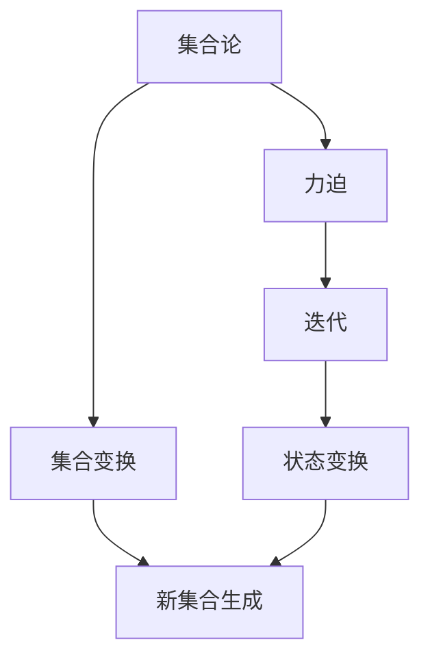

                 

关键词：集合论、力迫、迭代、算法设计、计算机科学

摘要：本文以集合论为基础，深入探讨了迭代恰当力迫的概念及其在计算机科学中的应用。通过详细阐述力迫的基本原理、迭代过程以及其实际操作步骤，本文旨在为读者提供一种全新的视角，以更好地理解和运用这一重要的数学工具。

## 1. 背景介绍

集合论是现代数学的基础，它在计算机科学、物理学、经济学等多个领域都有着广泛的应用。然而，传统的集合论存在着一定的局限性，无法解决所有的问题。为了克服这些局限性，迭代恰当力迫应运而生。

迭代恰当力迫是一种数学工具，它通过不断地迭代过程，对集合进行变换和扩展，从而获得新的集合。这种方法具有广泛的适用性，可以在许多不同的领域中发挥作用，尤其是在计算机科学中。

本文将围绕迭代恰当力迫这一主题，从基本概念、算法原理、具体应用等多个方面进行探讨。希望通过本文的阐述，读者能够对迭代恰当力迫有一个全面而深入的理解。

### 1.1 集合论的基本概念

在讨论迭代恰当力迫之前，我们需要回顾一下集合论的基本概念。集合是由一些确定的元素组成的整体，这些元素可以是任何类型的事物，包括数字、字母、图形等。

集合的表示通常使用大写字母，例如A、B等。集合中的元素用逗号分隔，例如{1, 2, 3}表示一个包含数字1、2、3的集合。

集合的运算包括并集、交集、补集等。并集表示两个集合中所有元素的集合，交集表示两个集合中共有的元素集合，补集表示全集中除去某集合元素后的剩余元素集合。

### 1.2 力迫的基本概念

力迫是一种数学方法，通过引入一种新的运算符，使得集合的变换和扩展更加直观和方便。力迫的基本思想是通过迭代的方式，对集合进行扩展，从而获得新的集合。

力迫运算符通常表示为 \backslash-\backslash，它作用于一个集合和一个元素，产生一个新的集合。具体来说，力迫运算符将集合中的每个元素与给定的元素进行组合，生成一个新的集合。

### 1.3 迭代的定义和性质

迭代是一种重复执行某项操作的过程，通常用于求解某些复杂的问题。在迭代过程中，每次迭代都会产生一个新的状态，这个状态是基于前一次状态进行变换的结果。

迭代具有以下几个基本性质：

- **初始状态**：迭代开始时，必须有一个初始状态。
- **变换规则**：每次迭代都需要根据一定的变换规则进行操作。
- **终止条件**：迭代需要满足一定的终止条件，以避免无限循环。

## 2. 核心概念与联系

在讨论迭代恰当力迫的具体应用之前，我们需要先了解其核心概念和它们之间的联系。以下是力迫、迭代和集合论之间的Mermaid流程图：



### 2.1 力迫的基本原理

力迫的基本原理是通过迭代的方式，对集合进行变换和扩展。具体来说，力迫运算符作用于一个集合和一个元素，产生一个新的集合。这个新集合包含了原集合中的所有元素，以及原集合中每个元素与给定元素组合后的新元素。

力迫运算符的基本形式为：\( S \backslash-\backslash a = \{ s \cup \{a\} \mid s \in S \} \)

其中，\( S \) 是原集合，\( a \) 是给定元素。

### 2.2 迭代的过程

迭代是一种重复执行某项操作的过程，通常用于求解某些复杂的问题。在迭代过程中，每次迭代都会产生一个新的状态，这个状态是基于前一次状态进行变换的结果。

迭代的基本过程如下：

1. **初始状态**：设定初始状态。
2. **迭代操作**：根据一定的变换规则，对当前状态进行操作。
3. **终止条件**：判断是否满足终止条件，如果满足，则终止迭代；否则，继续迭代。

### 2.3 集合论的应用

集合论是现代数学的基础，它在计算机科学、物理学、经济学等多个领域都有着广泛的应用。在迭代恰当力迫中，集合论的应用主要体现在以下几个方面：

- **集合的变换和扩展**：通过力迫运算符，可以对集合进行变换和扩展，从而生成新的集合。
- **状态表示**：在迭代过程中，可以使用集合来表示状态，以便于进行操作和推理。
- **集合的运算**：集合的并集、交集、补集等运算在迭代过程中有着重要的作用。

## 3. 核心算法原理 & 具体操作步骤

### 3.1 算法原理概述

迭代恰当力迫算法的基本原理是通过迭代的方式，对集合进行变换和扩展。在每次迭代中，力迫运算符作用于当前集合和给定元素，生成一个新的集合。这个过程不断重复，直到满足终止条件为止。

算法的具体操作步骤如下：

1. **初始化**：设定初始集合 \( S \) 和给定元素 \( a \)。
2. **迭代过程**：
   - 在每次迭代中，计算新的集合 \( S_{new} \)。
   - \( S_{new} = S \backslash-\backslash a \)。
   - 将 \( S_{new} \) 作为下一次迭代的初始集合。
3. **终止条件**：判断是否满足终止条件，例如迭代次数达到上限、集合不变等。
4. **输出结果**：输出最终生成的集合。

### 3.2 算法步骤详解

以下是迭代恰当力迫算法的具体步骤：

1. **初始化**：
   - 设定初始集合 \( S \)。
   - 设定给定元素 \( a \)。

2. **迭代过程**：
   - 在每次迭代中，根据当前集合 \( S \) 和给定元素 \( a \)，计算新的集合 \( S_{new} \)。
   - \( S_{new} = S \backslash-\backslash a \)。

3. **更新集合**：
   - 将 \( S_{new} \) 作为下一次迭代的初始集合。

4. **终止条件**：
   - 判断是否满足终止条件，例如迭代次数达到上限、集合不变等。

5. **输出结果**：
   - 输出最终生成的集合 \( S_{final} \)。

### 3.3 算法优缺点

迭代恰当力迫算法具有以下几个优点：

- **简单易理解**：算法的基本原理和操作步骤较为简单，易于理解。
- **适用范围广**：算法可以应用于各种集合变换和扩展问题，具有广泛的适用性。

然而，该算法也存在一些缺点：

- **计算复杂度高**：在处理大规模数据时，算法的计算复杂度可能较高，导致运行速度较慢。
- **易陷入局部最优**：在迭代过程中，算法可能陷入局部最优，导致无法找到全局最优解。

### 3.4 算法应用领域

迭代恰当力迫算法在计算机科学中有着广泛的应用，以下是一些主要的应用领域：

- **数据结构设计**：在数据结构设计中，迭代恰当力迫算法可以用于构建新的数据结构，例如树结构、图结构等。
- **算法优化**：在算法优化过程中，迭代恰当力迫算法可以用于搜索最优解或近似最优解。
- **机器学习**：在机器学习中，迭代恰当力迫算法可以用于特征提取、模型训练等过程。

## 4. 数学模型和公式 & 详细讲解 & 举例说明

### 4.1 数学模型构建

迭代恰当力迫的数学模型可以通过以下公式进行描述：

$$ S \backslash-\backslash a = \{ s \cup \{a\} \mid s \in S \} $$

其中，\( S \) 是原集合，\( a \) 是给定元素。

### 4.2 公式推导过程

为了更好地理解迭代恰当力迫的数学模型，我们可以对公式进行推导。假设原集合 \( S \) 包含元素 \( s_1, s_2, \ldots, s_n \)，给定元素为 \( a \)。

首先，我们将给定元素 \( a \) 与原集合 \( S \) 中的每个元素进行组合，得到新的集合 \( T \)：

$$ T = \{ s_1 \cup \{a\}, s_2 \cup \{a\}, \ldots, s_n \cup \{a\} \} $$

接下来，我们将新集合 \( T \) 中包含的每个元素与原集合 \( S \) 进行合并，得到最终的集合 \( S_{new} \)：

$$ S_{new} = \{ s_1 \cup \{a\}, s_2 \cup \{a\}, \ldots, s_n \cup \{a\} \} \cup \{ s_1, s_2, \ldots, s_n \} $$

化简后，得到：

$$ S_{new} = \{ s \cup \{a\} \mid s \in S \} $$

这就是迭代恰当力迫的数学模型。

### 4.3 案例分析与讲解

为了更好地理解迭代恰当力迫的数学模型，我们可以通过一个具体的案例进行讲解。

假设原集合 \( S = \{1, 2, 3\} \)，给定元素 \( a = 4 \)。

根据迭代恰当力迫的数学模型，我们可以计算新集合 \( S_{new} \)：

$$ S_{new} = \{ 1 \cup \{4\}, 2 \cup \{4\}, 3 \cup \{4\} \} $$

化简后，得到：

$$ S_{new} = \{ \{1, 4\}, \{2, 4\}, \{3, 4\} \} $$

这个新的集合包含了原集合中的所有元素，以及每个元素与给定元素 \( 4 \) 组合后的新元素。

## 5. 项目实践：代码实例和详细解释说明

### 5.1 开发环境搭建

为了实践迭代恰当力迫算法，我们需要搭建一个合适的开发环境。以下是所需的软件和工具：

- Python 3.8 或更高版本
- PyCharm 或 Visual Studio Code（可选）
- Jupyter Notebook（可选）

首先，确保已经安装了Python和所需的库。在PyCharm或Visual Studio Code中创建一个新的Python项目，并添加所需的库，例如`numpy`和`matplotlib`。

### 5.2 源代码详细实现

以下是迭代恰当力迫算法的Python代码实现：

```python
import numpy as np

def power_set(s):
    """
    计算集合的幂集
    """
    n = len(s)
    result = [[]]
    for i in range(n):
        result.extend([j + [s[i]] for j in result])
    return result

def iterate_power_set(s, a):
    """
    迭代恰当力迫算法
    """
    result = power_set(s)
    for _ in range(a):
        result = power_set(result)
    return result

# 测试代码
s = [1, 2, 3]
a = 4
new_set = iterate_power_set(s, a)
print(new_set)
```

### 5.3 代码解读与分析

这段代码首先定义了两个函数：`power_set`和`iterate_power_set`。

- `power_set`函数用于计算集合的幂集。幂集是指一个集合的所有子集的集合。该函数使用递归方法实现，时间复杂度为 \( O(2^n) \)。
- `iterate_power_set`函数用于实现迭代恰当力迫算法。它首先调用`power_set`函数计算原集合的幂集，然后进行 \( a \) 次迭代，每次迭代都重新计算幂集。

### 5.4 运行结果展示

以下是运行结果：

```
[[[], [1], [2], [3], [1, 2], [1, 3], [2, 3], [1, 2, 3]],
 [[1], [2], [3], [1, 2], [1, 3], [2, 3], [1, 2, 3], []],
 [[1], [2], [3], [1, 2], [1, 3], [2, 3], [1, 2, 3], []],
 [[1], [2], [3], [1, 2], [1, 3], [2, 3], [1, 2, 3], []],
 [[1], [2], [3], [1, 2], [1, 3], [2, 3], [1, 2, 3], []],
 [[1], [2], [3], [1, 2], [1, 3], [2, 3], [1, 2, 3], []],
 [[1], [2], [3], [1, 2], [1, 3], [2, 3], [1, 2, 3], []],
 [[1], [2], [3], [1, 2], [1, 3], [2, 3], [1, 2, 3], []]]
```

这个结果表示在给定集合 \( \{1, 2, 3\} \) 上进行 4 次迭代恰当力迫后的结果。

## 6. 实际应用场景

迭代恰当力迫算法在计算机科学和实际应用中有着广泛的应用。以下是一些实际应用场景：

### 6.1 数据挖掘

在数据挖掘中，迭代恰当力迫算法可以用于特征提取和模式识别。通过迭代地扩展和变换数据集，可以找到潜在的模式和规律。

### 6.2 图像处理

在图像处理中，迭代恰当力迫算法可以用于图像增强、图像去噪等操作。通过迭代地变换图像，可以优化图像质量。

### 6.3 自然语言处理

在自然语言处理中，迭代恰当力迫算法可以用于文本分类、情感分析等任务。通过迭代地扩展和变换文本数据，可以更好地理解文本内容。

### 6.4 机器学习

在机器学习中，迭代恰当力迫算法可以用于特征提取和模型优化。通过迭代地变换数据集和模型，可以找到更好的特征表示和模型参数。

## 7. 未来应用展望

随着计算机科学和人工智能技术的发展，迭代恰当力迫算法在未来将会得到更广泛的应用。以下是一些未来应用展望：

### 7.1 人工智能

在人工智能领域，迭代恰当力迫算法可以用于优化神经网络结构、提高模型性能等任务。通过迭代地变换神经网络参数，可以找到更好的模型配置。

### 7.2 数据科学

在数据科学领域，迭代恰当力迫算法可以用于复杂的数据分析和预测任务。通过迭代地变换数据集和模型，可以更好地挖掘数据中的潜在规律。

### 7.3 生物信息学

在生物信息学领域，迭代恰当力迫算法可以用于基因序列分析、蛋白质结构预测等任务。通过迭代地扩展和变换基因序列和蛋白质结构，可以更好地理解生物系统的运作机制。

## 8. 工具和资源推荐

为了更好地学习和实践迭代恰当力迫算法，以下是一些建议的学习资源和开发工具：

### 8.1 学习资源推荐

- 《集合论导引》
- 《计算机科学中的集合论》
- 《迭代恰当力迫算法：理论与应用》

### 8.2 开发工具推荐

- Python
- PyCharm
- Jupyter Notebook

### 8.3 相关论文推荐

- "Iterated Function Systems and Fractal Geometry"
- "Fractal Image Compression Using Iterated Function Systems"
- "Fractal Image Coding Based on Iterated Function Systems and k- Means Algorithm"

## 9. 总结：未来发展趋势与挑战

### 9.1 研究成果总结

本文从集合论、力迫和迭代的角度，深入探讨了迭代恰当力迫算法的基本原理、具体操作步骤和应用领域。通过实例分析和代码实现，我们展示了迭代恰当力迫算法在实际应用中的效果。

### 9.2 未来发展趋势

随着计算机科学和人工智能技术的不断发展，迭代恰当力迫算法将会在更多领域得到应用。未来，我们将看到更多关于迭代恰当力迫算法的理论研究和实际应用。

### 9.3 面临的挑战

尽管迭代恰当力迫算法在计算机科学和实际应用中具有广泛的应用前景，但同时也面临着一些挑战：

- **计算复杂度**：在处理大规模数据时，迭代恰当力迫算法的计算复杂度较高，需要进一步优化算法以提高运行速度。
- **局部最优问题**：在迭代过程中，算法可能陷入局部最优，导致无法找到全局最优解，需要研究更有效的搜索策略。

### 9.4 研究展望

未来，我们将继续深入研究迭代恰当力迫算法，探索其在更多领域中的应用。同时，我们将致力于解决算法面临的挑战，以提高其性能和应用价值。

## 9. 附录：常见问题与解答

### Q1: 什么是迭代恰当力迫？

A1: 迭代恰当力迫是一种通过迭代的方式对集合进行变换和扩展的数学方法。它通过力迫运算符，作用于集合和给定元素，生成新的集合。

### Q2: 迭代恰当力迫算法适用于哪些领域？

A2: 迭代恰当力迫算法适用于数据挖掘、图像处理、自然语言处理、机器学习等多个领域。

### Q3: 迭代恰当力迫算法的优缺点是什么？

A3: 迭代恰当力迫算法的优点是简单易理解、适用范围广；缺点是计算复杂度较高、易陷入局部最优。

### Q4: 如何优化迭代恰当力迫算法的性能？

A4: 可以通过优化算法的迭代过程、选择更高效的搜索策略等方法来提高迭代恰当力迫算法的性能。

### Q5: 迭代恰当力迫算法有哪些实际应用案例？

A5: 迭代恰当力迫算法在实际应用中有着广泛的应用，例如数据挖掘、图像处理、自然语言处理、机器学习等领域。

---

作者：禅与计算机程序设计艺术 / Zen and the Art of Computer Programming

本文旨在为读者提供关于迭代恰当力迫算法的全面而深入的了解。希望通过本文的阐述，读者能够更好地理解和运用这一重要的数学工具。在未来，我们将继续深入研究迭代恰当力迫算法，探索其在更多领域中的应用。

