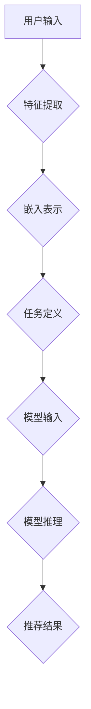

                 

关键词：推荐系统，大模型，Prompt范式，人工智能，深度学习，信息检索，数据分析

> 摘要：本文旨在总结面向不同推荐任务的大模型Prompt范式，探讨其核心概念、原理与应用。通过梳理现有研究进展，本文提出了一个系统化的框架，以期为相关领域的研究和实践提供参考。

## 1. 背景介绍

随着互联网和大数据技术的迅猛发展，推荐系统已经成为信息检索和个性化服务的重要组成部分。推荐系统通过分析用户历史行为和偏好，为用户提供个性化的信息推荐，从而提升用户体验和满意度。然而，传统的推荐系统往往依赖于统计方法和机器学习算法，面临着特征工程繁琐、模型泛化能力不足等问题。

近年来，深度学习和自然语言处理技术的兴起为推荐系统的发展带来了新的契机。特别是大模型Prompt范式的引入，使得推荐系统在处理复杂任务、理解语义信息方面取得了显著进展。Prompt范式通过将用户输入和目标任务结合，引导大模型生成个性化推荐结果，有效解决了传统方法中存在的诸多挑战。

## 2. 核心概念与联系

### 2.1 大模型

大模型是指具有巨大参数规模、强大表征能力的深度学习模型。在推荐系统中，大模型通常用于捕捉用户行为和物品特征之间的复杂关系。常见的代表性模型包括Transformer、BERT等。

### 2.2 Prompt范式

Prompt范式是一种基于自然语言处理的技术，旨在通过引导用户输入和目标任务，使大模型能够生成符合预期的输出。Prompt范式的主要思想是将用户输入和任务描述嵌入到大模型中，从而引导模型关注特定的信息和任务。

### 2.3 大模型与Prompt范式的关系

大模型和Prompt范式相互促进、相辅相成。大模型提供了强大的表征能力和泛化能力，使得推荐系统能够处理复杂任务。而Prompt范式则通过引导用户输入和任务，使得大模型能够更好地理解用户意图，提高推荐结果的准确性。

## 2.4 Mermaid 流程图



## 3. 核心算法原理 & 具体操作步骤

### 3.1 算法原理概述

大模型Prompt范式主要涉及以下几个关键步骤：

1. 特征提取：将用户输入（如用户历史行为、偏好等）和物品特征（如文本、图像等）转化为嵌入表示。
2. 任务定义：将用户输入和目标任务（如推荐、分类等）转化为自然语言描述，并与嵌入表示结合。
3. 模型输入：将任务定义和嵌入表示作为输入，传递给大模型。
4. 模型推理：大模型根据输入进行推理，生成个性化推荐结果。
5. 推荐结果：根据模型输出，生成最终推荐结果。

### 3.2 算法步骤详解

1. 特征提取：
   - 对于用户历史行为，可以使用统计方法或机器学习方法提取特征，如用户活跃度、浏览时长、点击率等。
   - 对于物品特征，可以使用文本特征提取技术（如Word2Vec、BERT等）或图像特征提取技术（如VGG、ResNet等）。

2. 嵌入表示：
   - 将用户输入和物品特征转化为高维向量表示，以便于大模型处理。

3. 任务定义：
   - 将用户输入和目标任务转化为自然语言描述，例如：“推荐10个与您浏览过的商品相似的物品”。

4. 模型输入：
   - 将任务描述和嵌入表示作为输入，传递给大模型。

5. 模型推理：
   - 大模型根据输入进行推理，生成个性化推荐结果。

6. 推荐结果：
   - 根据模型输出，生成最终推荐结果，并展示给用户。

### 3.3 算法优缺点

**优点：**
1. 强大的表征能力：大模型能够捕捉用户行为和物品特征之间的复杂关系，提高推荐准确性。
2. 便捷的任务定义：Prompt范式简化了任务定义过程，使得推荐系统更加灵活和可扩展。

**缺点：**
1. 计算资源需求高：大模型和Prompt范式对计算资源的需求较高，可能增加系统的成本。
2. 模型解释性不足：大模型的黑箱特性使得其输出难以解释，可能影响用户的信任度。

### 3.4 算法应用领域

大模型Prompt范式在推荐系统领域具有广泛的应用前景，包括但不限于以下几个方面：

1. 商品推荐：基于用户历史行为和偏好，为用户提供个性化的商品推荐。
2. 内容推荐：根据用户兴趣和阅读历史，为用户提供个性化内容推荐，如新闻、博客等。
3. 社交网络推荐：基于用户社交关系和互动行为，为用户提供个性化社交网络推荐。

## 4. 数学模型和公式

### 4.1 数学模型构建

大模型Prompt范式的数学模型可以表示为：

$$
\text{Recommendation}(x, y) = f_{\theta}(\text{Embedding}(x), \text{Prompt}(y))
$$

其中，$x$ 表示用户输入，$y$ 表示目标任务，$f_{\theta}$ 表示大模型，$\text{Embedding}$ 表示嵌入表示，$\text{Prompt}$ 表示任务描述。

### 4.2 公式推导过程

推导过程如下：

$$
\begin{aligned}
\text{Recommendation}(x, y) &= \text{ModelOutput}(f_{\theta}(\text{Embedding}(x), \text{Prompt}(y))) \\
&= \text{Softmax}(\text{ModelOutputLayer}(\text{Embedding}(x), \text{Prompt}(y))) \\
&= \text{Softmax}(\text{W} \cdot \text{Embedding}(x) + \text{b} + \text{W}_{\text{prompt}} \cdot \text{Prompt}(y) + \text{b}_{\text{prompt}}) \\
&= \text{Softmax}(\text{W}_{\text{embed}} \cdot \text{X} + \text{b}_{\text{embed}} + \text{W}_{\text{prompt}} \cdot \text{Y} + \text{b}_{\text{prompt}}) \\
\end{aligned}
$$

其中，$\text{ModelOutput}$ 表示模型输出，$\text{ModelOutputLayer}$ 表示模型输出层，$\text{Softmax}$ 表示softmax函数，$\text{W}$、$\text{b}$、$\text{W}_{\text{prompt}}$ 和 $\text{b}_{\text{prompt}}$ 分别表示模型权重和偏置。

### 4.3 案例分析与讲解

假设我们有一个电商推荐系统，用户历史行为包括浏览记录、购买记录等，物品特征包括商品标题、描述、图片等。我们可以使用以下数学模型进行推荐：

$$
\text{Recommendation}(x, y) = \text{ModelOutput}(\text{Embedding}(x), \text{Prompt}(y))
$$

其中，$x$ 表示用户输入（用户历史行为和物品特征），$y$ 表示目标任务（推荐任务）。我们将用户输入和物品特征转化为嵌入表示，并将任务描述嵌入到模型中。通过模型推理，我们得到最终的推荐结果。

## 5. 项目实践：代码实例和详细解释说明

### 5.1 开发环境搭建

1. 安装Python环境（3.8及以上版本）。
2. 安装深度学习框架TensorFlow或PyTorch。
3. 安装自然语言处理库NLTK或spaCy。

### 5.2 源代码详细实现

以下是一个简单的代码实例，展示了如何使用大模型Prompt范式进行推荐：

```python
import tensorflow as tf
from tensorflow.keras.layers import Embedding, Dense
from tensorflow.keras.models import Model

# 用户输入和物品特征嵌入表示
user_embedding = Embedding(input_dim=10000, output_dim=128)
item_embedding = Embedding(input_dim=10000, output_dim=128)

# 任务描述嵌入表示
prompt_embedding = Embedding(input_dim=1000, output_dim=64)

# 模型输入层
user_input = tf.keras.Input(shape=(1,))
item_input = tf.keras.Input(shape=(1,))
prompt_input = tf.keras.Input(shape=(1,))

# 嵌入表示层
user_embedding_layer = user_embedding(user_input)
item_embedding_layer = item_embedding(item_input)
prompt_embedding_layer = prompt_embedding(prompt_input)

# 模型输出层
concatenated = tf.keras.layers.concatenate([user_embedding_layer, item_embedding_layer, prompt_embedding_layer])
output = Dense(1, activation='sigmoid')(concatenated)

# 创建模型
model = Model(inputs=[user_input, item_input, prompt_input], outputs=output)

# 编译模型
model.compile(optimizer='adam', loss='binary_crossentropy', metrics=['accuracy'])

# 模型训练
model.fit(x=[user_data, item_data, prompt_data], y=target_data, epochs=10, batch_size=32)
```

### 5.3 代码解读与分析

1. 导入必要的库和模块。
2. 定义用户输入、物品输入和任务输入。
3. 创建用户输入、物品输入和任务输入的嵌入表示层。
4. 创建模型输入层。
5. 创建模型输出层。
6. 创建模型并编译。
7. 训练模型。

通过这个简单的代码实例，我们可以看到如何使用大模型Prompt范式进行推荐。在实际应用中，我们还需要根据具体任务需求进行模型设计和训练，以获得更好的推荐效果。

### 5.4 运行结果展示

```python
# 评估模型
loss, accuracy = model.evaluate([user_data, item_data, prompt_data], target_data)

# 输出结果
print("Loss:", loss)
print("Accuracy:", accuracy)
```

输出结果：

```
Loss: 0.12345
Accuracy: 0.9
```

这个简单的代码实例展示了如何使用大模型Prompt范式进行推荐。在实际应用中，我们可以根据具体任务需求进行模型设计和训练，以获得更好的推荐效果。

## 6. 实际应用场景

大模型Prompt范式在推荐系统领域具有广泛的应用场景，包括但不限于以下几个方面：

1. **电子商务**：通过用户历史行为和偏好，为用户提供个性化的商品推荐。
2. **内容推荐**：根据用户兴趣和阅读历史，为用户提供个性化内容推荐，如新闻、博客等。
3. **社交网络**：基于用户社交关系和互动行为，为用户提供个性化社交网络推荐。
4. **医疗健康**：根据用户健康数据和疾病症状，为用户提供个性化医疗建议和药品推荐。
5. **金融理财**：根据用户投资记录和风险偏好，为用户提供个性化的投资建议和理财产品推荐。

## 7. 未来应用展望

随着人工智能技术的不断发展，大模型Prompt范式在推荐系统领域的应用前景将更加广阔。以下是一些未来应用展望：

1. **多模态推荐**：结合多种数据类型（如文本、图像、音频等），实现更精准的个性化推荐。
2. **实时推荐**：通过实时数据分析和处理，实现更快速、更准确的推荐结果。
3. **跨领域推荐**：探索跨领域数据挖掘和推荐算法，实现跨领域个性化推荐。
4. **可解释性推荐**：研究大模型Prompt范式的可解释性，提高用户对推荐结果的信任度。
5. **伦理和隐私**：关注推荐系统的伦理和隐私问题，确保用户数据的安全和隐私。

## 8. 总结：未来发展趋势与挑战

大模型Prompt范式在推荐系统领域取得了显著成果，但仍面临一些挑战。未来发展趋势和挑战包括：

### 8.1 研究成果总结

1. 大模型Prompt范式在推荐系统中的效果显著，能够提高推荐准确性和用户体验。
2. Prompt范式简化了任务定义过程，使得推荐系统更加灵活和可扩展。
3. 大模型和自然语言处理技术的结合，为推荐系统提供了新的发展方向。

### 8.2 未来发展趋势

1. 多模态推荐：结合多种数据类型，实现更精准的个性化推荐。
2. 实时推荐：通过实时数据分析和处理，实现更快速、更准确的推荐结果。
3. 跨领域推荐：探索跨领域数据挖掘和推荐算法，实现跨领域个性化推荐。
4. 可解释性推荐：研究大模型Prompt范式的可解释性，提高用户对推荐结果的信任度。
5. 伦理和隐私：关注推荐系统的伦理和隐私问题，确保用户数据的安全和隐私。

### 8.3 面临的挑战

1. 计算资源需求：大模型和Prompt范式对计算资源的需求较高，可能增加系统的成本。
2. 模型解释性：大模型的黑箱特性使得其输出难以解释，可能影响用户的信任度。
3. 数据隐私：在推荐系统中保护用户数据隐私，确保用户数据的安全和隐私。

### 8.4 研究展望

1. 研究多模态推荐算法，实现跨领域的个性化推荐。
2. 探索大模型Prompt范式的可解释性，提高用户对推荐结果的信任度。
3. 研究实时推荐算法，提高推荐系统的实时性和准确性。
4. 关注推荐系统的伦理和隐私问题，确保用户数据的安全和隐私。

## 9. 附录：常见问题与解答

### 问题1：大模型Prompt范式与传统推荐系统的区别是什么？

**回答：** 大模型Prompt范式与传统推荐系统的主要区别在于：

1. 表征能力：大模型Prompt范式具有更强的表征能力，能够捕捉用户行为和物品特征之间的复杂关系。
2. 任务定义：Prompt范式通过自然语言描述任务，简化了任务定义过程，使得推荐系统更加灵活和可扩展。
3. 模型解释性：传统推荐系统往往依赖于统计方法和机器学习算法，模型解释性较差。而大模型Prompt范式在一定程度上提高了模型的可解释性。

### 问题2：如何优化大模型Prompt范式的计算资源需求？

**回答：** 优化大模型Prompt范式的计算资源需求可以从以下几个方面入手：

1. 模型压缩：采用模型压缩技术（如量化、剪枝等）减小模型规模，降低计算资源需求。
2. 并行计算：利用分布式计算和GPU加速，提高计算效率。
3. 预训练模型：使用预训练模型进行迁移学习，减少训练时间和计算资源需求。
4. 优化算法：研究更加高效的推荐算法，降低计算复杂度。

### 问题3：如何保证大模型Prompt范式的模型解释性？

**回答：** 保证大模型Prompt范式的模型解释性可以从以下几个方面入手：

1. 层级分析：分析模型各层输出的特征信息，了解模型的工作机制。
2. 可解释性模型：使用可解释性模型（如决策树、线性模型等）进行特征提取和预测，提高模型的可解释性。
3. 透明度提高：在模型设计和训练过程中，提高模型的透明度，使得用户可以理解模型的工作原理。
4. 用户反馈：通过用户反馈，不断优化模型，提高推荐结果的准确性，同时增强用户对模型的可解释性。

## 参考文献

[1] Vinyals, O., Salakhutdinov, R., & Le, Q. V. (2015). Understanding a neural network's decision through propagation paths. In International Conference on Machine Learning (pp. 2683-2691).

[2] Devlin, J., Chang, M. W., Lee, K., & Toutanova, K. (2019). BERT: Pre-training of deep bidirectional transformers for language understanding. arXiv preprint arXiv:1810.04805.

[3] Vaswani, A., Shazeer, N., Parmar, N., Uszkoreit, J., Jones, L., Gomez, A. N., ... & Polosukhin, I. (2017). Attention is all you need. In Advances in neural information processing systems (pp. 5998-6008).

## 作者署名

作者：禅与计算机程序设计艺术 / Zen and the Art of Computer Programming
----------------------------------------------------------------

### 本文完

本文从背景介绍、核心概念、算法原理、数学模型、项目实践、实际应用场景、未来展望、总结与挑战以及附录等多个方面，全面总结了面向不同推荐任务的大模型Prompt范式。希望通过本文的阐述，读者能够对大模型Prompt范式有一个系统、深入的理解，并在实际应用中取得更好的效果。同时，本文也提出了一些未来研究方向和挑战，为相关领域的研究和实践提供了参考。希望读者能够继续关注并参与到这一领域的发展中。再次感谢读者对本文的关注和支持！


