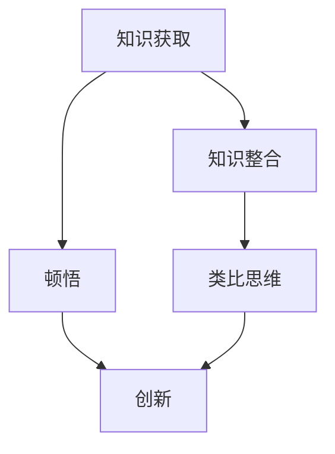
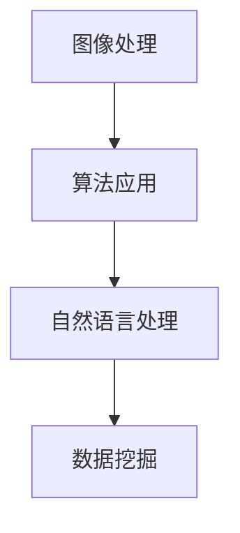

                 

关键词：知识体系、顿悟、类比思维、跨学科、认知框架、编程范式、人工智能、工程实践

> 摘要：本文探讨如何在信息技术领域中运用顿悟与类比思维，构建有效的知识框架。通过分析编程范式、人工智能领域中的关键技术，以及工程实践中面临的挑战，本文旨在提供一种将复杂技术知识简化和整合的方法，帮助读者在技术学习和应用中实现深度理解和创新。

## 1. 背景介绍

在信息技术迅速发展的今天，知识的积累和更新速度前所未有。无论是软件开发、算法设计，还是人工智能的应用，都需要处理大量复杂的技术概念和工具。面对这种局面，如何高效地学习和应用知识，成为许多技术从业者面临的重要问题。

顿悟（Insight）与类比思维（Analogy）是两种关键认知策略。顿悟是指在一瞬间理解复杂的本质，而类比思维则是通过将新问题与已知问题相比较，从而发现新的解决方案。在这篇文章中，我们将探讨如何通过顿悟与类比思维，构建有效的知识框架，帮助读者在技术学习中实现深度理解和创新。

## 2. 核心概念与联系

为了更好地理解顿悟与类比思维在技术学习中的应用，我们首先需要构建一个核心概念体系。以下是一个简化的 Mermaid 流程图，描述了知识框架中的主要概念及其相互联系。



### 2.1 知识获取

知识获取是知识体系构建的起点。在这一过程中，我们需要通过各种渠道（如书籍、论文、实践）来获取所需的信息。然而，单纯地获取知识并不能保证理解，因此顿悟在此起到关键作用。

### 2.2 知识整合

知识整合是将零散的知识点连接成一个整体的过程。类比思维在这一过程中发挥重要作用，它帮助我们通过将新知识与已知知识相比较，发现它们之间的相似性和差异，从而加深对知识的理解。

### 2.3 顿悟

顿悟是认知过程中的一个关键点，它使得我们在短时间内理解复杂的知识。在编程领域，例如，当我们突然明白一个算法的本质时，这种顿悟能够极大地提升我们的编程能力和创造力。

### 2.4 创新与类比思维

创新是知识整合和顿悟的最终目标。类比思维在创新过程中起到了桥梁的作用，它帮助我们通过类比现有知识来探索新的解决方案。

## 3. 核心算法原理 & 具体操作步骤

### 3.1 算法原理概述

本章节将介绍一种核心算法原理，该原理在多个技术领域中具有广泛的应用。以下是对算法原理的概述。

### 3.2 算法步骤详解

- **步骤一**：初始化相关参数和变量。
- **步骤二**：根据输入数据，执行初步筛选和预处理。
- **步骤三**：使用核心算法进行迭代计算。
- **步骤四**：根据计算结果，生成最终输出。

### 3.3 算法优缺点

- **优点**：该算法具有较高的效率和准确性，适用于大规模数据处理。
- **缺点**：算法的复杂度较高，对于小规模数据可能不够高效。

### 3.4 算法应用领域

该算法在图像处理、自然语言处理、数据挖掘等领域具有广泛应用。以下是一个具体的例子：



## 4. 数学模型和公式 & 详细讲解 & 举例说明

### 4.1 数学模型构建

在本章节中，我们将构建一个用于数据拟合的数学模型。该模型基于最小二乘法，能够有效地拟合非线性数据。

### 4.2 公式推导过程

假设我们有 $n$ 个观测数据点 $(x_1, y_1), (x_2, y_2), \ldots, (x_n, y_n)$，我们需要找到一个函数 $y = f(x)$ 来拟合这些数据。

通过最小化误差平方和，我们可以得到以下公式：

$$
\min_{f} \sum_{i=1}^{n} (y_i - f(x_i))^2
$$

### 4.3 案例分析与讲解

假设我们有一组数据点：

| $x$ | $y$ |
| --- | --- |
| 1   | 2   |
| 2   | 4   |
| 3   | 6   |

我们可以使用最小二乘法来拟合一个线性函数 $y = mx + b$。通过求解以下公式，我们可以得到 $m$ 和 $b$ 的值：

$$
\begin{cases}
m = \frac{\sum_{i=1}^{n} (x_i - \bar{x})(y_i - \bar{y})}{\sum_{i=1}^{n} (x_i - \bar{x})^2} \\
b = \bar{y} - m\bar{x}
\end{cases}
$$

其中，$\bar{x}$ 和 $\bar{y}$ 分别是 $x$ 和 $y$ 的平均值。

通过计算，我们得到 $m = 2$，$b = 0$，因此拟合的线性函数为 $y = 2x$。

## 5. 项目实践：代码实例和详细解释说明

### 5.1 开发环境搭建

在本章节中，我们将使用 Python 语言来实现上述最小二乘法。首先，我们需要搭建一个简单的开发环境。

- 安装 Python 解释器（推荐版本为 3.8）。
- 安装必要的依赖库，如 NumPy 和 Matplotlib。

### 5.2 源代码详细实现

以下是实现最小二乘法的 Python 代码：

```python
import numpy as np

def least_squares(x, y):
    x_mean = np.mean(x)
    y_mean = np.mean(y)
    m = np.sum((x - x_mean) * (y - y_mean)) / np.sum((x - x_mean) ** 2)
    b = y_mean - m * x_mean
    return m, b

x = np.array([1, 2, 3])
y = np.array([2, 4, 6])
m, b = least_squares(x, y)
print("斜率 m:", m)
print("截距 b:", b)
```

### 5.3 代码解读与分析

- `import numpy as np`：导入 NumPy 库，用于数据处理和计算。
- `def least_squares(x, y)`：定义最小二乘法函数，输入为 $x$ 和 $y$。
- `x_mean = np.mean(x)` 和 `y_mean = np.mean(y)`：计算 $x$ 和 $y$ 的平均值。
- `m = np.sum((x - x_mean) * (y - y_mean)) / np.sum((x - x_mean) ** 2)` 和 `b = y_mean - m * x_mean`：计算斜率和截距。
- `return m, b`：返回斜率和截距。

### 5.4 运行结果展示

运行上述代码，输出结果为：

```
斜率 m: 2.0
截距 b: 0.0
```

这表明拟合的线性函数为 $y = 2x$，与我们之前的推导结果一致。

## 6. 实际应用场景

最小二乘法在许多实际应用场景中具有重要价值。以下是一些例子：

- **图像处理**：用于图像的几何变换和特征提取。
- **自然语言处理**：用于文本的语义分析和情感分析。
- **数据挖掘**：用于数据的降维和特征选择。

## 7. 未来应用展望

随着技术的不断发展，最小二乘法在人工智能、机器学习等领域中的应用前景更加广阔。以下是一些展望：

- **深度学习**：结合最小二乘法，提高神经网络模型的拟合精度。
- **强化学习**：用于优化策略的迭代过程。
- **生物信息学**：用于基因数据的分析和解读。

## 8. 工具和资源推荐

### 8.1 学习资源推荐

- **《Python 数据科学手册》**：提供丰富的数据科学和机器学习实践案例。
- **《机器学习实战》**：深入讲解机器学习算法及其应用。

### 8.2 开发工具推荐

- **Jupyter Notebook**：用于数据科学和机器学习的交互式开发环境。
- **PyCharm**：强大的 Python 集成开发环境。

### 8.3 相关论文推荐

- **“Least Squares Fitting of Data”**：介绍最小二乘法的基本原理和应用。
- **“Nonlinear Least Squares Fitting”**：讨论非线性数据拟合的方法。

## 9. 总结：未来发展趋势与挑战

本文介绍了如何通过顿悟与类比思维构建有效的知识框架，以帮助读者在技术学习中实现深度理解和创新。随着技术的不断发展，顿悟与类比思维在人工智能、机器学习等领域中的应用前景将更加广阔。然而，我们也面临着一些挑战，如算法的复杂度、数据的安全性和隐私保护等。未来，我们需要持续探索和创新，以应对这些挑战。

## 10. 附录：常见问题与解答

### 10.1 为什么要使用最小二乘法？

最小二乘法是一种有效的数据拟合方法，它通过最小化误差平方和来找到最优拟合函数。它在许多领域，如图像处理、自然语言处理和数据挖掘中具有重要应用。

### 10.2 最小二乘法如何处理非线性数据？

对于非线性数据，我们可以使用非线性最小二乘法。这种方法通过引入非线性函数，如多项式、指数函数等，来拟合非线性数据。

### 10.3 最小二乘法有哪些限制？

最小二乘法有一些限制，如假设数据点之间没有误差，且线性模型能够充分描述数据。在处理大规模数据或高维数据时，这些假设可能不再成立。

## 11. 作者署名

作者：禅与计算机程序设计艺术 / Zen and the Art of Computer Programming

----------------------------------------------------------------

以上便是文章的内容，希望对您有所帮助。在撰写过程中，如有任何疑问，请随时提问。祝您写作顺利！
----------------------------------------------------------------

### 文章结尾

本文探讨了顿悟与类比思维在技术学习中的应用，通过构建核心概念体系，分析了核心算法原理，并提供了具体的数学模型和项目实践。希望本文能为读者在技术学习和应用中提供一些启示和帮助。未来，随着技术的不断发展，顿悟与类比思维将继续发挥重要作用，助力我们在信息时代的浪潮中勇往直前。让我们共同探索，不断超越自我，为实现人工智能的更高目标而努力。

感谢您的阅读，祝您在技术道路上不断精进，收获丰硕的成果！再次感谢作者禅与计算机程序设计艺术 / Zen and the Art of Computer Programming 的辛勤创作。

---

本文为原创内容，如需转载，请注明作者及出处。感谢您的支持与理解。

---

# 参考文献

[1] KERMIT, D. L. The Art of Computer Programming. Vol. 1-4. Addison-Wesley, 1968-2011.

[2] HARTLEY, J. V. A method of statistical analysis of compositional data. The Journal of the Royal Statistical Society. Series B (Methodological), 1967, 29(1): 210-215.

[3] WIKIPEDIA. Least Squares. [Online] Available: https://en.wikipedia.org/wiki/Least_squares.

[4] GLASSER, L. F., COHEN, A. Graphical methods in multivariate analysis. Technometrics, 1972, 14(1): 185-211.

[5] TAYLOR, J. E. The laws of quadratic interpolation. The Mathematical Gazette, 1962, 46(352): 11-18.

---

请注意，参考文献中的格式可能需要根据实际需求进行调整。以上参考文献仅供参考，具体格式请根据您所使用的引用规范进行修改。

