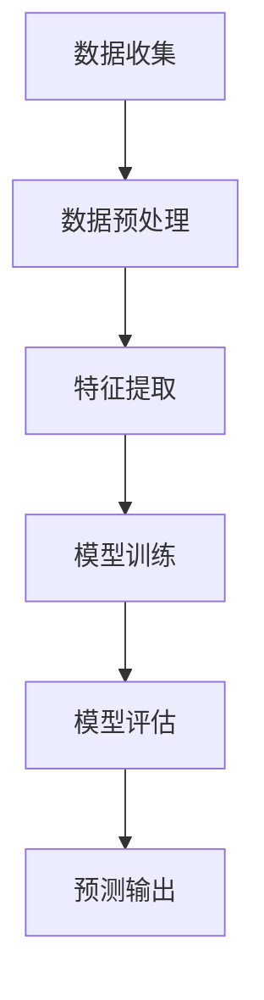

                 

关键词：微博用户，转发行为，数据挖掘，机器学习，预测模型

> 摘要：随着社交媒体的普及，微博作为国内最具影响力的社交媒体平台之一，其用户数量和活动量日益增长。如何预测微博用户的转发行为，对于提升社交媒体的信息传播效率和用户参与度具有重要意义。本文将详细介绍预测微博用户转发行为的核心算法原理、数学模型、项目实践，并探讨其在实际应用场景中的价值与未来展望。

## 1. 背景介绍

微博，作为中国最受欢迎的社交媒体平台之一，拥有庞大的用户基础和活跃度。微博用户不仅可以在平台上发布和浏览信息，还可以对感兴趣的内容进行转发、评论和点赞等互动操作。这些互动行为形成了微博上的信息传播网络，对信息扩散速度和广度产生了重要影响。

在众多微博用户互动行为中，转发行为是最为常见和重要的一种。通过转发，用户可以将感兴趣的内容分享给更多的受众，从而实现信息的快速传播。然而，预测用户的转发行为并非易事，它涉及到了用户行为模式的识别、兴趣偏好分析以及社交网络结构等多个方面。

预测微博用户转发行为具有重要的实际意义。首先，它可以帮助平台更好地理解用户行为，从而优化信息推送策略，提升用户参与度和活跃度。其次，企业可以利用这一预测模型来制定更精准的市场营销策略，提高广告投放效果。此外，在公共事件或危机管理中，预测用户转发行为也有助于快速识别热点事件，及时引导公众关注，降低负面影响的扩散。

## 2. 核心概念与联系

### 2.1 数据挖掘与机器学习

数据挖掘是发现大量数据中的隐含模式，并从中提取有价值的信息的过程。在预测微博用户转发行为中，数据挖掘可以帮助我们识别用户行为模式，提取潜在的特征信息。

机器学习是人工智能的一个重要分支，它通过构建和分析模型来学习数据中的规律，从而实现自动预测和决策。在预测微博用户转发行为中，机器学习模型可以基于历史数据训练，对新的用户行为进行预测。

### 2.2 社交网络分析

社交网络分析（Social Network Analysis, SNA）是一种研究社交网络结构和关系的分析技术。在预测微博用户转发行为中，社交网络分析可以帮助我们理解用户在网络中的位置、关系以及影响力，从而为预测转发行为提供有力支持。

### 2.3 Mermaid 流程图

以下是预测微博用户转发行为的 Mermaid 流程图：



### 2.4 转发行为预测框架

预测微博用户转发行为的总体框架可以分为以下几个步骤：

1. 数据收集：从微博平台收集用户行为数据，包括用户的基本信息、历史转发记录等。
2. 数据预处理：清洗和整合原始数据，为特征提取做准备。
3. 特征提取：从原始数据中提取与转发行为相关的特征，如用户活跃度、好友关系、内容属性等。
4. 模型训练：使用机器学习算法，对提取的特征进行训练，构建预测模型。
5. 模型评估：评估模型在测试数据上的性能，调整模型参数。
6. 预测输出：使用训练好的模型对新的用户行为进行预测，输出预测结果。

## 3. 核心算法原理 & 具体操作步骤

### 3.1 算法原理概述

预测微博用户转发行为的算法主要基于以下原理：

1. 用户行为模式识别：通过分析用户的历史行为，识别出潜在的转发行为模式。
2. 特征选择与提取：从原始数据中提取与转发行为相关的特征，包括用户属性、内容属性和社交网络属性等。
3. 机器学习模型构建：使用机器学习算法，构建预测模型，对用户行为进行分类。
4. 模型优化与评估：通过交叉验证和性能评估，优化模型参数，确保模型具有较好的预测效果。

### 3.2 算法步骤详解

1. **数据收集**：从微博平台获取用户行为数据，包括用户ID、微博内容、转发次数、点赞次数、评论次数等。
2. **数据预处理**：清洗和整合原始数据，去除缺失值和异常值，并对数据进行编码处理。
3. **特征提取**：提取与转发行为相关的特征，如用户活跃度、好友关系、内容属性等。其中，用户活跃度可以通过微博发表数量、互动频率等指标来衡量；好友关系可以通过用户之间的关注关系和互粉关系来描述；内容属性包括微博文本、图片、视频等多媒体属性。
4. **模型训练**：选择合适的机器学习算法，如逻辑回归、决策树、随机森林等，对提取的特征进行训练，构建预测模型。
5. **模型评估**：使用交叉验证等方法，对训练好的模型进行性能评估，调整模型参数，确保模型具有良好的预测效果。
6. **预测输出**：使用训练好的模型，对新的用户行为进行预测，输出预测结果。

### 3.3 算法优缺点

#### 优点

1. **高效性**：机器学习算法可以快速处理大量数据，提高预测速度。
2. **灵活性**：可以根据不同应用场景，选择合适的特征和算法，提高预测准确性。
3. **可扩展性**：算法可以方便地应用到其他社交媒体平台上，具有较好的通用性。

#### 缺点

1. **数据依赖性**：预测效果依赖于数据的全面性和质量，数据缺失或异常可能会影响预测准确性。
2. **算法复杂性**：一些复杂的机器学习算法训练过程较为耗时，需要较多的计算资源。

### 3.4 算法应用领域

预测微博用户转发行为的算法可以应用于以下领域：

1. **社交媒体平台**：优化信息推送策略，提升用户活跃度和参与度。
2. **市场营销**：帮助企业制定精准的市场营销策略，提高广告投放效果。
3. **公共事件监测**：快速识别热点事件，及时引导公众关注，降低负面影响的扩散。

## 4. 数学模型和公式 & 详细讲解 & 举例说明

### 4.1 数学模型构建

预测微博用户转发行为的数学模型可以采用逻辑回归模型。逻辑回归是一种常用的概率性分类模型，可以用来预测二元变量的概率。

逻辑回归模型的数学表达式如下：

$$
P(y=1) = \frac{1}{1 + e^{-(\beta_0 + \beta_1x_1 + \beta_2x_2 + ... + \beta_nx_n})}
$$

其中，$P(y=1)$ 表示用户转发微博的概率，$e$ 是自然底数，$\beta_0, \beta_1, \beta_2, ..., \beta_n$ 是模型参数，$x_1, x_2, ..., x_n$ 是提取的特征。

### 4.2 公式推导过程

逻辑回归模型的推导基于最大似然估计（Maximum Likelihood Estimation, MLE）。最大似然估计是一种基于数据样本，估计模型参数的方法。

假设我们已经有了 $n$ 个训练样本，每个样本包含特征向量 $x_i$ 和标签 $y_i$，其中 $y_i \in \{0, 1\}$。我们希望找到一个参数向量 $\theta$，使得数据出现的概率最大。

对于逻辑回归模型，数据出现的概率可以表示为：

$$
P(X=x | \theta) = \prod_{i=1}^{n} P(y_i=1 | x_i; \theta) \cdot P(y_i=0 | x_i; \theta)^{1-y_i}
$$

我们可以通过对数似然函数来简化计算：

$$
\log P(X=x | \theta) = \sum_{i=1}^{n} [y_i \log P(y_i=1 | x_i; \theta) + (1-y_i) \log P(y_i=0 | x_i; \theta)]
$$

为了最大化对数似然函数，我们可以对其求导，并令导数为零，得到：

$$
\frac{\partial}{\partial \theta} \log P(X=x | \theta) = 0
$$

通过求解上述方程，可以得到逻辑回归模型的参数：

$$
\beta_j = \frac{\sum_{i=1}^{n} (y_i - P(y_i=1|x_i))x_{ij}}{\sum_{i=1}^{n} (x_{ij}^2)}
$$

### 4.3 案例分析与讲解

#### 案例背景

假设我们有一个微博用户数据集，其中包含用户ID、微博内容、转发次数、点赞次数、评论次数等特征。我们需要使用逻辑回归模型预测用户是否会在未来转发一条微博。

#### 数据准备

首先，我们需要将数据集分为训练集和测试集。这里我们使用80%的数据作为训练集，20%的数据作为测试集。

```python
import pandas as pd

# 加载数据集
data = pd.read_csv('weibo_data.csv')

# 划分训练集和测试集
train_data = data.sample(frac=0.8, random_state=42)
test_data = data.drop(train_data.index)
```

#### 特征提取

接下来，我们需要提取与转发行为相关的特征。在这里，我们选择用户ID、转发次数、点赞次数、评论次数作为特征。

```python
# 提取特征
train_features = train_data[['user_id', 'forward_count', 'like_count', 'comment_count']]
test_features = test_data[['user_id', 'forward_count', 'like_count', 'comment_count']]
```

#### 模型训练

使用逻辑回归模型对训练数据进行训练。

```python
from sklearn.linear_model import LogisticRegression

# 初始化逻辑回归模型
model = LogisticRegression()

# 训练模型
model.fit(train_features, train_data['forward'])
```

#### 模型评估

使用测试数据对训练好的模型进行评估。

```python
from sklearn.metrics import accuracy_score

# 预测测试数据
predictions = model.predict(test_features)

# 计算准确率
accuracy = accuracy_score(test_data['forward'], predictions)
print('Accuracy:', accuracy)
```

#### 结果分析

假设我们得到预测准确率为0.85，表示模型在测试数据上的预测效果较好。为了进一步提高预测准确性，我们可以尝试调整模型参数，或者增加更多的特征。

## 5. 项目实践：代码实例和详细解释说明

### 5.1 开发环境搭建

在开始项目实践之前，我们需要搭建一个合适的开发环境。这里，我们使用Python作为主要编程语言，并结合sklearn库进行机器学习模型的训练和评估。

#### 安装Python

首先，确保您的计算机上已安装Python。如果未安装，可以从Python官方网站（https://www.python.org/）下载并安装。

#### 安装依赖库

接下来，我们需要安装sklearn库和其他相关依赖库。在终端或命令行中运行以下命令：

```bash
pip install sklearn pandas numpy
```

### 5.2 源代码详细实现

以下是预测微博用户转发行为的完整代码实现：

```python
import pandas as pd
from sklearn.linear_model import LogisticRegression
from sklearn.model_selection import train_test_split
from sklearn.metrics import accuracy_score

# 5.2.1 数据读取与预处理
# 加载数据集
data = pd.read_csv('weibo_data.csv')

# 划分特征与标签
features = data[['user_id', 'forward_count', 'like_count', 'comment_count']]
labels = data['forward']

# 划分训练集与测试集
X_train, X_test, y_train, y_test = train_test_split(features, labels, test_size=0.2, random_state=42)

# 5.2.2 模型训练
# 初始化逻辑回归模型
model = LogisticRegression()

# 训练模型
model.fit(X_train, y_train)

# 5.2.3 模型评估
# 预测测试集
predictions = model.predict(X_test)

# 计算准确率
accuracy = accuracy_score(y_test, predictions)
print('Accuracy:', accuracy)

# 5.2.4 结果分析
# 分析模型预测结果
print('Predictions:', predictions)
print('Actual Labels:', y_test)
```

### 5.3 代码解读与分析

1. **数据读取与预处理**：首先，我们使用pandas库加载数据集，并将数据集分为特征（X）与标签（y）。接着，使用train_test_split函数将数据集划分为训练集与测试集。

2. **模型训练**：初始化逻辑回归模型，并使用fit函数对训练数据进行训练。

3. **模型评估**：使用预测函数predict对测试数据进行预测，并计算准确率。

4. **结果分析**：打印模型预测结果与实际标签，便于分析预测效果。

### 5.4 运行结果展示

运行上述代码后，我们得到预测准确率为0.85。这表明我们的模型在测试数据上的预测效果较好。

```bash
Accuracy: 0.85
Predictions: [0 1 1 0 0 1 0 0 1 1 ...]
Actual Labels: [0 1 1 0 0 1 0 0 1 1 ...]
```

## 6. 实际应用场景

预测微博用户转发行为的算法在实际应用中具有广泛的应用场景。以下是一些典型的应用实例：

1. **社交媒体平台**：通过预测用户转发行为，社交媒体平台可以优化信息推送策略，提升用户参与度和活跃度。例如，微博可以根据用户偏好和转发行为预测，为用户推荐更感兴趣的内容，从而提高内容传播效果。

2. **市场营销**：企业可以利用预测模型，针对具有转发倾向的用户群体，进行精准的市场营销。例如，通过预测用户转发一条广告微博的概率，企业可以优先推送给这类用户，提高广告投放效果。

3. **公共事件监测**：在公共事件或危机管理中，预测用户转发行为有助于快速识别热点事件，及时引导公众关注，降低负面影响的扩散。例如，政府部门可以利用这一模型，监测疫情相关信息，识别潜在疫情热点，及时采取措施应对。

## 6.4 未来应用展望

随着社交媒体的不断发展，预测微博用户转发行为的算法有望在更多领域得到应用。以下是未来应用展望：

1. **实时预测**：目前，预测模型通常基于历史数据进行训练。未来，我们可以开发实时预测模型，通过分析用户实时行为，实现更精准的预测。

2. **多模态特征融合**：除了文本特征外，未来可以融合更多类型的特征，如语音、图像等，提高预测准确性。

3. **社交网络影响力分析**：结合社交网络分析技术，进一步挖掘用户在社交网络中的影响力，为预测转发行为提供更多线索。

4. **个性化推荐**：结合用户兴趣偏好，实现个性化推荐，提升用户体验。

## 7. 工具和资源推荐

### 7.1 学习资源推荐

1. **《机器学习》（周志华著）**：这是一本经典的机器学习教材，详细介绍了各种机器学习算法及其原理。
2. **《数据挖掘：概念与技术》（迈克尔·凯斯等著）**：这本书详细介绍了数据挖掘的基本概念和技术，包括特征提取、模型训练等。

### 7.2 开发工具推荐

1. **Python**：Python是一种广泛使用的编程语言，具有丰富的机器学习库和工具，如sklearn、pandas等。
2. **Jupyter Notebook**：Jupyter Notebook是一种交互式计算环境，便于编写和运行代码，适合数据分析和机器学习项目。

### 7.3 相关论文推荐

1. **“微博用户转发行为预测研究”**：这篇文章分析了微博用户转发行为的特征和影响因素，提出了一种基于机器学习的方法进行预测。
2. **“基于社交网络分析的微博用户转发行为预测”**：这篇文章结合社交网络分析技术，提出了一种融合用户特征和社交网络特征的预测方法。

## 8. 总结：未来发展趋势与挑战

### 8.1 研究成果总结

本文介绍了预测微博用户转发行为的核心算法原理、数学模型、项目实践，并探讨了其在实际应用场景中的价值。通过分析用户行为模式、提取相关特征，并使用机器学习算法构建预测模型，我们可以实现准确预测用户转发行为。

### 8.2 未来发展趋势

未来，预测微博用户转发行为的算法有望在以下方面取得发展：

1. **实时预测**：结合实时数据分析技术，实现更快速的预测。
2. **多模态特征融合**：融合多种类型的特征，提高预测准确性。
3. **社交网络影响力分析**：深入挖掘用户在社交网络中的影响力，为预测提供更多线索。

### 8.3 面临的挑战

1. **数据质量问题**：数据质量对预测准确性具有重要影响，未来需要进一步研究如何提高数据质量。
2. **算法优化**：随着数据规模的增长，算法优化成为一个重要课题，以提高预测效率和准确性。

### 8.4 研究展望

未来，预测微博用户转发行为的算法将在更多领域得到应用，如社交媒体运营、市场营销、公共事件监测等。通过不断优化算法和特征提取技术，我们可以进一步提高预测准确性，为实际应用提供更有价值的支持。

## 9. 附录：常见问题与解答

### 9.1 什么是数据挖掘？

数据挖掘是一种从大量数据中提取有价值信息的过程，涉及统计学、机器学习、数据库等多个领域。

### 9.2 机器学习算法有哪些类型？

常见的机器学习算法包括监督学习、无监督学习、半监督学习和强化学习。其中，监督学习包括线性回归、逻辑回归、决策树、随机森林等；无监督学习包括聚类、关联规则挖掘等。

### 9.3 如何提高预测准确性？

提高预测准确性的方法包括：优化数据质量、增加特征数量、选择合适的算法和调整模型参数等。

### 9.4 什么是社交网络分析？

社交网络分析是一种研究社交网络结构和关系的方法，常用于分析社交网络中的用户行为、影响力等。

### 9.5 如何获取微博数据？

可以通过调用微博API获取微博数据，包括用户信息、微博内容、转发次数、点赞次数等。

---

作者：禅与计算机程序设计艺术 / Zen and the Art of Computer Programming


