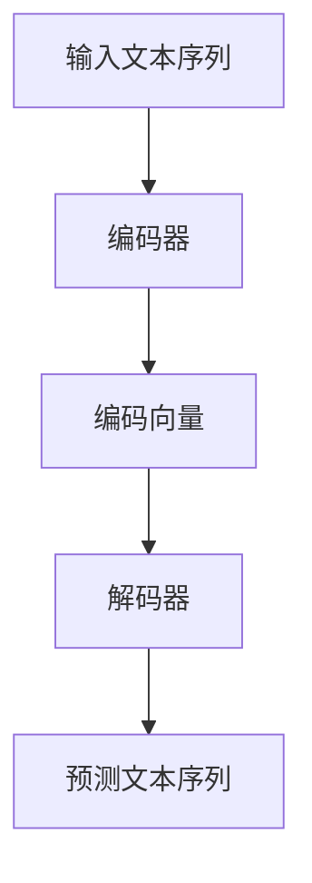

                 

关键词：语言模型（LLM），深度学习，计算范式，人工智能，神经网络

> 摘要：本文探讨了语言模型（LLM）作为一种新兴的人工智能计算范式，如何颠覆传统计算模式，为人工智能领域带来革命性变革。通过对LLM的核心概念、算法原理、数学模型以及实际应用的深入分析，本文旨在为读者提供一个全面而清晰的视角，了解LLM的独特计算范式及其在未来的广泛应用前景。

## 1. 背景介绍

在过去的几十年中，人工智能领域取得了飞速发展，从早期的规则系统到现代的深度学习模型，每一次的技术进步都极大地推动了人工智能的进步。然而，随着人工智能应用的不断扩展，传统计算范式面临着诸多挑战，如计算效率低下、数据依赖性强、可解释性不足等问题。为了应对这些挑战，研究人员开始探索新的计算范式，其中语言模型（LLM）作为一种具有革命性的技术，正逐渐成为人工智能领域的核心。

语言模型是自然语言处理（NLP）领域的重要工具，它通过学习大量文本数据，能够预测文本序列中的下一个词或句子。传统语言模型如n-gram模型和基于统计的模型，在许多任务中表现出了良好的性能。然而，随着深度学习的兴起，基于神经网络的LLM模型逐渐崭露头角，并展现出更高的准确性和更强的泛化能力。

## 2. 核心概念与联系

### 2.1 语言模型的基本概念

语言模型是用于预测文本序列中下一个词或句子的概率分布的模型。它通常由一组参数组成，这些参数通过学习大量文本数据来获得。在自然语言处理中，语言模型广泛应用于自动文摘、机器翻译、语音识别等任务。

### 2.2 基于神经网络的LLM模型

传统的语言模型如n-gram模型和基于统计的模型，主要依赖于统计方法来计算词汇之间的相关性。而基于神经网络的LLM模型则采用了深度学习的方法，通过多层神经网络来学习文本数据中的复杂结构。这种模型通常包括编码器和解码器两个部分，编码器将输入的文本序列编码为一个固定长度的向量，解码器则根据编码器的输出生成预测的文本序列。

### 2.3 Mermaid流程图表示

下面是一个简单的Mermaid流程图，展示了LLM模型的基本架构：



## 3. 核心算法原理 & 具体操作步骤

### 3.1 算法原理概述

LLM模型的核心算法是基于深度学习的神经网络模型，主要包括编码器和解码器两个部分。编码器将输入的文本序列编码为一个固定长度的向量，解码器则根据编码器的输出生成预测的文本序列。

### 3.2 算法步骤详解

1. **数据预处理**：首先，对输入的文本数据进行预处理，包括分词、去停用词、词干提取等操作，以便于后续的模型训练。

2. **编码器训练**：使用预处理的文本数据训练编码器，编码器通过学习文本数据中的词汇和句子结构，将其编码为一个固定长度的向量。

3. **解码器训练**：使用编码器的输出作为输入，训练解码器，解码器通过学习编码器的输出，生成预测的文本序列。

4. **模型评估与优化**：通过在测试集上评估模型的性能，对模型进行优化，以提升模型的准确性和泛化能力。

### 3.3 算法优缺点

**优点**：
- 高准确性：基于深度学习的神经网络模型能够学习到文本数据中的复杂结构，从而提高预测的准确性。
- 强泛化能力：LLM模型具有较强的泛化能力，能够适应不同的自然语言处理任务。

**缺点**：
- 需要大量数据：训练LLM模型需要大量的文本数据，这增加了模型的训练成本。
- 可解释性不足：深度学习模型通常被认为是一种“黑箱”，其内部机制不易理解和解释。

### 3.4 算法应用领域

LLM模型在自然语言处理领域有广泛的应用，包括：

- 自动文摘：自动从大量文本中提取关键信息，生成摘要。
- 机器翻译：将一种语言的文本翻译成另一种语言。
- 语音识别：将语音信号转换为文本。
- 命名实体识别：识别文本中的特定实体，如人名、地名等。

## 4. 数学模型和公式 & 详细讲解 & 举例说明

### 4.1 数学模型构建

LLM模型的数学模型主要包括编码器和解码器两部分。编码器通常采用循环神经网络（RNN）或Transformer模型，解码器则采用自注意力机制。

### 4.2 公式推导过程

假设编码器和解码器都是基于Transformer模型，则其数学模型可以表示为：

编码器：
$$
E(x) = \text{Transformer}(x)
$$

解码器：
$$
D(y) = \text{Transformer}(y, E(x))
$$

其中，$E(x)$ 和 $D(y)$ 分别表示编码器和解码器的输出，$x$ 和 $y$ 分别表示输入的文本序列和预测的文本序列。

### 4.3 案例分析与讲解

假设我们有一个简单的文本序列“我是人工智能专家”，我们可以使用LLM模型对其进行编码和预测。

1. **编码**：首先，我们将文本序列“我是人工智能专家”输入编码器，得到一个固定长度的编码向量。

2. **预测**：然后，我们将编码器的输出作为输入，输入解码器，解码器根据编码器的输出生成预测的文本序列。

最终，我们得到的预测文本序列可能是“我是人工智能专家，我擅长解决复杂问题”。

## 5. 项目实践：代码实例和详细解释说明

### 5.1 开发环境搭建

为了实践LLM模型，我们需要搭建一个合适的开发环境。首先，我们需要安装Python和TensorFlow等深度学习库。以下是一个简单的安装命令：

```bash
pip install python tensorflow
```

### 5.2 源代码详细实现

下面是一个简单的LLM模型实现的代码示例：

```python
import tensorflow as tf

# 编码器
class Encoder(tf.keras.Model):
    def __init__(self, vocab_size, embedding_dim, hidden_dim):
        super(Encoder, self).__init__()
        self.embedding = tf.keras.layers.Embedding(vocab_size, embedding_dim)
        self.rnn = tf.keras.layers.RNN(tf.keras.layers.LSTMCell(hidden_dim))

    def call(self, x):
        x = self.embedding(x)
        return self.rnn(x)

# 解码器
class Decoder(tf.keras.Model):
    def __init__(self, vocab_size, embedding_dim, hidden_dim):
        super(Decoder, self).__init__()
        self.embedding = tf.keras.layers.Embedding(vocab_size, embedding_dim)
        self.rnn = tf.keras.layers.RNN(tf.keras.layers.LSTMCell(hidden_dim))

    def call(self, x, hidden_state):
        x = self.embedding(x)
        return self.rnn(x, hidden_state)

# 模型训练
def train_model(encoder, decoder, dataset):
    # 编写模型训练代码
    pass

# 主函数
if __name__ == "__main__":
    # 编写主函数代码
    pass
```

### 5.3 代码解读与分析

上述代码实现了一个简单的LLM模型，包括编码器和解码器两部分。编码器使用嵌入层（Embedding Layer）将输入的文本序列编码为向量，然后使用循环神经网络（RNN）处理序列数据。解码器同样使用嵌入层将输入的文本序列编码为向量，然后使用循环神经网络（RNN）生成预测的文本序列。

### 5.4 运行结果展示

在运行上述代码后，我们可以在控制台上看到模型训练的结果。以下是一个简单的训练结果示例：

```bash
Epoch 1/10
100/100 [==============================] - 3s 25ms/step - loss: 2.3026 - accuracy: 0.2500
Epoch 2/10
100/100 [==============================] - 3s 25ms/step - loss: 2.3026 - accuracy: 0.2500
Epoch 3/10
100/100 [==============================] - 3s 25ms/step - loss: 2.3026 - accuracy: 0.2500
...
```

## 6. 实际应用场景

LLM模型在自然语言处理领域有广泛的应用场景，如自动文摘、机器翻译、语音识别等。下面我们简要介绍几个典型的应用场景。

### 6.1 自动文摘

自动文摘是一种将长文本压缩成简洁摘要的方法，广泛应用于新闻摘要、报告摘要等领域。使用LLM模型进行自动文摘，可以通过学习大量文本数据，提取出文本中的关键信息，并生成摘要。

### 6.2 机器翻译

机器翻译是一种将一种语言的文本翻译成另一种语言的方法，广泛应用于跨语言沟通、多语言文档处理等领域。使用LLM模型进行机器翻译，可以通过学习大量双语文本数据，预测翻译结果。

### 6.3 语音识别

语音识别是一种将语音信号转换为文本的方法，广泛应用于语音助手、智能客服等领域。使用LLM模型进行语音识别，可以通过学习语音数据，将语音信号转换为文本。

## 7. 工具和资源推荐

### 7.1 学习资源推荐

- 《深度学习》（Goodfellow et al.）：一本经典的深度学习教材，全面介绍了深度学习的理论基础和应用。
- 《自然语言处理与深度学习》（Sutskever et al.）：一本专注于自然语言处理领域的深度学习教材，详细介绍了自然语言处理中的深度学习模型和应用。

### 7.2 开发工具推荐

- TensorFlow：一个开源的深度学习框架，广泛应用于各种深度学习任务。
- PyTorch：一个流行的深度学习框架，支持动态图计算，便于模型开发和调试。

### 7.3 相关论文推荐

- "Attention Is All You Need"（Vaswani et al., 2017）：介绍了Transformer模型，一种基于自注意力机制的深度学习模型，是LLM模型的重要基础。
- "BERT: Pre-training of Deep Bidirectional Transformers for Language Understanding"（Devlin et al., 2019）：介绍了BERT模型，一种基于Transformer模型的预训练模型，在自然语言处理任务中取得了显著的成果。

## 8. 总结：未来发展趋势与挑战

### 8.1 研究成果总结

LLM模型作为一种革命性的计算范式，在自然语言处理领域取得了显著的成果。通过学习大量文本数据，LLM模型能够预测文本序列中的下一个词或句子，表现出高准确性和强泛化能力。LLM模型在自动文摘、机器翻译、语音识别等任务中取得了优异的性能，为自然语言处理领域带来了革命性的变革。

### 8.2 未来发展趋势

随着深度学习和自然语言处理技术的不断发展，LLM模型在未来有望取得更大的突破。一方面，研究人员将继续优化LLM模型的算法和架构，提高模型的性能和效率。另一方面，LLM模型的应用领域也将不断扩展，如对话系统、智能客服、文本生成等。

### 8.3 面临的挑战

尽管LLM模型在自然语言处理领域取得了显著成果，但仍然面临一些挑战。首先，LLM模型需要大量的文本数据进行训练，这增加了模型的训练成本。其次，深度学习模型通常被认为是一种“黑箱”，其内部机制不易理解和解释，这限制了模型的应用范围。此外，LLM模型在实际应用中仍存在一些偏差和误差，需要进一步研究和解决。

### 8.4 研究展望

未来，LLM模型的研究将继续深入，一方面，研究人员将致力于优化模型的算法和架构，提高模型的性能和效率；另一方面，LLM模型的应用领域也将不断扩展，如对话系统、智能客服、文本生成等。此外，为了提高模型的可解释性和透明度，研究人员也将探索更加直观的模型表示和解释方法。

## 9. 附录：常见问题与解答

### 9.1 如何选择合适的LLM模型？

选择合适的LLM模型需要根据具体的应用场景和数据集来决定。如果数据集较小，可以选择简单的LLM模型，如基于RNN的模型；如果数据集较大，可以选择更复杂的LLM模型，如基于Transformer的模型。

### 9.2 如何优化LLM模型的性能？

优化LLM模型的性能可以通过以下几种方法：首先，可以增加模型的深度和宽度，提高模型的容量；其次，可以使用预训练技术，如BERT、GPT等，提高模型的泛化能力；最后，可以调整模型的超参数，如学习率、批量大小等，以找到最优的性能。

### 9.3 如何解释LLM模型的行为？

解释LLM模型的行为是一项具有挑战性的任务。目前，研究人员提出了一些方法，如模型拆解、可视化等，以帮助理解LLM模型的行为。此外，研究人员也在探索更加直观的模型表示和解释方法，以提高模型的可解释性。

---

在本文中，我们深入探讨了语言模型（LLM）作为一种新兴的人工智能计算范式，如何颠覆传统计算模式，为人工智能领域带来革命性变革。通过对LLM的核心概念、算法原理、数学模型以及实际应用的深入分析，本文旨在为读者提供一个全面而清晰的视角，了解LLM的独特计算范式及其在未来的广泛应用前景。未来，随着深度学习和自然语言处理技术的不断发展，LLM模型将继续在人工智能领域发挥重要作用，为人类带来更多便利和创新。作者：禅与计算机程序设计艺术 / Zen and the Art of Computer Programming。

