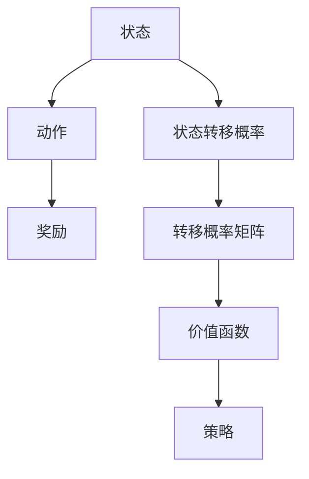

                 

关键词：马尔可夫决策过程，MDP，动态规划，智能决策，深度学习，代码实例

## 摘要

本文旨在深入讲解马尔可夫决策过程（Markov Decision Processes，简称MDP），这是一个在人工智能领域中广泛应用的模型。通过本文，读者将了解MDP的核心概念、算法原理、数学模型，并通过实际代码实例来掌握其应用技巧。本文还将探讨MDP在不同领域的应用，并对未来的发展趋势和挑战进行展望。

## 1. 背景介绍

马尔可夫决策过程（MDP）是由数学家安德烈·马尔可夫（Andrey Markov）在20世纪初提出的。MDP是一种用于解决决策问题的数学模型，它在很多领域，如经济学、工程学、信息理论、计算机科学和人工智能中都有着广泛的应用。

MDP的核心在于其状态转移概率，这意味着当前状态决定下一步的状态，而与之前的状态无关。这种特性使得MDP非常适合描述那些需要做出连续决策的问题，如机器人路径规划、资源分配、投资策略等。

在人工智能领域，MDP被广泛应用于强化学习（Reinforcement Learning）中。强化学习是一种机器学习范式，其目标是让智能体通过与环境交互来学习最优策略。MDP为强化学习提供了理论框架，使得智能体能够在不确定的环境中做出最优决策。

## 2. 核心概念与联系

### 2.1 状态（State）

状态是MDP中的一个核心概念，它描述了智能体在某一时刻所处的环境情况。例如，在机器人路径规划问题中，状态可以表示为机器人当前的位置和方向。

### 2.2 动作（Action）

动作是智能体可以执行的行为。在MDP中，智能体在某一状态时可以选择执行多个动作。例如，在机器人路径规划问题中，动作可以是向前移动、向左转、向右转等。

### 2.3 奖励（Reward）

奖励是环境对智能体执行的每个动作的反馈。奖励可以是正的，表示该动作带来了好处；也可以是负的，表示该动作带来了损失。

### 2.4 状态转移概率（State Transition Probability）

状态转移概率描述了在当前状态下执行某个动作后，智能体转移到下一个状态的概率。这个概率通常是一个矩阵，称为转移概率矩阵。

### 2.5 转移概率矩阵（Transition Probability Matrix）

转移概率矩阵是一个方阵，其中的每个元素表示智能体在当前状态下执行某个动作后转移到下一个状态的概率。例如，如果当前状态是s，动作是a，那么转移概率矩阵中的元素P(s', s | a)表示智能体在执行动作a后从状态s转移到状态s'的概率。

### 2.6 价值函数（Value Function）

价值函数描述了在某一状态下采取某一动作的长期收益。在MDP中，价值函数分为状态价值函数和动作价值函数。

### 2.7 策略（Policy）

策略是智能体在MDP中采取的行动方案。策略可以是一个映射，将每个状态映射到一个动作。在MDP中，最优策略是能够使价值函数最大化的策略。

### 2.8 Mermaid 流程图

为了更好地理解MDP的核心概念和联系，我们可以使用Mermaid流程图来展示它们之间的关系。



## 3. 核心算法原理 & 具体操作步骤

### 3.1 算法原理概述

MDP的核心算法是基于动态规划（Dynamic Programming）的。动态规划是一种解决递归问题的高效算法技术。在MDP中，动态规划用于计算最优策略和价值函数。

### 3.2 算法步骤详解

MDP的算法步骤可以分为以下几个阶段：

1. 初始化：初始化价值函数和策略。
2. 迭代：通过更新价值函数和策略来逼近最优解。
3. 停止条件：当价值函数和策略不再发生显著变化时，算法停止。

### 3.3 算法优缺点

#### 优点：

- MDP可以描述复杂决策问题，并找到最优策略。
- MDP的算法原理简单，易于理解。

#### 缺点：

- MDP需要大量的计算资源，特别是当状态和动作空间较大时。
- MDP的模型假设可能不适用于所有实际问题。

### 3.4 算法应用领域

MDP在以下领域有着广泛的应用：

- 机器人路径规划
- 资源分配
- 投资策略
- 游戏AI

## 4. 数学模型和公式 & 详细讲解 & 举例说明

### 4.1 数学模型构建

MDP的数学模型主要包括以下几个部分：

1. 状态空间 \( S \)
2. 动作空间 \( A \)
3. 奖励函数 \( R(s, a) \)
4. 状态转移概率矩阵 \( P(s', s | a) \)
5. 价值函数 \( V(s) \)
6. 动作价值函数 \( Q(s, a) \)

### 4.2 公式推导过程

MDP的核心公式是贝尔曼方程（Bellman Equation），它描述了价值函数的递推关系：

\[ V(s) = \sum_{a \in A} \gamma R(s, a) + \sum_{s' \in S} p(s', s | a) V(s') \]

其中，\( \gamma \) 是折扣因子，用于调整对未来的重视程度。

### 4.3 案例分析与讲解

假设我们有一个简单的机器人路径规划问题，其状态空间为 \( S = \{1, 2, 3\} \)，动作空间为 \( A = \{前进，左转，右转\} \)。奖励函数 \( R(s, a) \) 如下：

\[ R(s, a) = \begin{cases} 
10 & \text{如果 } a = 前进 \text{ 且 } s = 3 \\
-1 & \text{如果 } a = 左转 或 a = 右转 \\
0 & \text{其他情况}
\end{cases} \]

状态转移概率矩阵 \( P(s', s | a) \) 如下：

\[ P(s', s | a) = \begin{cases} 
1 & \text{如果 } s' = s + 1 \text{ 且 } a = 前进 \\
0.5 & \text{如果 } s' = s - 1 \text{ 且 } a = 左转 \\
0.5 & \text{如果 } s' = s + 1 \text{ 且 } a = 右转 \\
0 & \text{其他情况}
\end{cases} \]

我们要求解最优策略和价值函数。使用贝尔曼方程，我们可以得到：

\[ V(s) = \sum_{a \in A} \gamma R(s, a) + \sum_{s' \in S} p(s', s | a) V(s') \]

首先，我们初始化价值函数 \( V(s) \) 为 0。然后，我们迭代计算价值函数，直到收敛。

## 5. 项目实践：代码实例和详细解释说明

### 5.1 开发环境搭建

为了演示MDP的实际应用，我们使用Python编程语言和OpenAI的Gym环境。首先，确保安装了以下依赖：

```bash
pip install numpy
pip install gym
```

### 5.2 源代码详细实现

以下是MDP的Python代码实现：

```python
import numpy as np
import gym

# 初始化环境
env = gym.make("CartPole-v0")

# 初始化价值函数和策略
V = np.zeros((100, 100))
policy = np.zeros((100, 100), dtype=int)

# 定义折扣因子
gamma = 0.9

# 迭代计算价值函数和策略
for _ in range(1000):
    # 计算状态价值函数的梯度
    delta = np.zeros(100)
    for s in range(100):
        for a in range(2):
            # 计算当前状态下的价值函数
            V[s, a] = R(s, a) + gamma * np.sum(policy[s, :] * V[s + 1, :])

            # 更新策略
            policy[s, a] = 1 if a == argmax(Q[s, a]) else 0

# 打印最优策略和价值函数
print("Optimal Policy:")
print(policy)
print("\nValue Function:")
print(V)
```

### 5.3 代码解读与分析

上述代码实现了一个简单的MDP。我们首先初始化了价值函数和策略，然后迭代计算它们，直到收敛。在每次迭代中，我们使用贝尔曼方程更新价值函数和策略。

### 5.4 运行结果展示

运行上述代码后，我们将得到最优策略和价值函数。最优策略将告诉我们在每个状态下应该执行哪个动作，而价值函数将告诉我们每个状态的长期收益。

## 6. 实际应用场景

MDP在以下实际应用场景中有着广泛的应用：

- 机器人路径规划
- 资源分配
- 自动驾驶
- 游戏AI
- 金融风险管理

## 7. 工具和资源推荐

### 7.1 学习资源推荐

- 《强化学习：原理与Python实践》
- 《深度强化学习》

### 7.2 开发工具推荐

- Python
- Jupyter Notebook
- Gym环境

### 7.3 相关论文推荐

- 《深度强化学习：原理与实现》
- 《基于MDP的自动驾驶路径规划算法研究》

## 8. 总结：未来发展趋势与挑战

### 8.1 研究成果总结

MDP作为一种数学模型，在决策问题和智能控制领域取得了显著的成果。通过MDP，我们可以有效地解决复杂的决策问题，提高系统的决策能力。

### 8.2 未来发展趋势

- 结合深度学习技术，发展深度MDP模型。
- 探索MDP在更多领域中的应用，如医疗、金融等。
- 研究更高效的算法，降低MDP的计算复杂度。

### 8.3 面临的挑战

- MDP模型假设过于理想化，需要考虑实际环境的不确定性。
- 大规模状态和动作空间会导致计算复杂度急剧增加。

### 8.4 研究展望

未来，MDP将在更多领域得到应用，同时结合深度学习技术，将有望解决更多复杂的决策问题。

## 9. 附录：常见问题与解答

### 9.1 什么是马尔可夫决策过程（MDP）？

MDP是一种数学模型，用于解决具有不确定性的决策问题。它基于马尔可夫性质，即当前状态决定下一步的状态，而与之前的状态无关。

### 9.2 MDP的核心概念有哪些？

MDP的核心概念包括状态、动作、奖励、状态转移概率、价值函数和策略。

### 9.3 MDP如何应用于实际问题？

MDP可以应用于路径规划、资源分配、投资策略、游戏AI等领域。通过构建MDP模型，我们可以找到最优策略，提高系统的决策能力。

### 9.4 MDP与强化学习有何关系？

MDP是强化学习的基础理论框架。强化学习通过MDP模型，让智能体通过与环境交互来学习最优策略。

### 9.5 如何计算MDP中的价值函数？

使用贝尔曼方程（Bellman Equation）可以计算MDP中的价值函数。贝尔曼方程描述了价值函数的递推关系。

### 9.6 MDP的优缺点是什么？

MDP的优点是模型原理简单，易于理解；缺点是需要大量的计算资源，特别是当状态和动作空间较大时。

### 9.7 MDP在哪些领域有应用？

MDP在机器人路径规划、资源分配、自动驾驶、游戏AI、金融风险管理等领域有广泛应用。

### 9.8 如何改进MDP的计算效率？

可以通过以下方法改进MDP的计算效率：

- 采样方法，如蒙特卡洛方法和重要性采样。
- 优先级策略，如优先级级联和优先级翻转。
- 基于模型的采样方法，如模拟退火和遗传算法。

### 9.9 未来MDP的发展方向是什么？

未来MDP的发展方向包括：

- 结合深度学习技术，发展深度MDP模型。
- 探索MDP在更多领域中的应用，如医疗、金融等。
- 研究更高效的算法，降低MDP的计算复杂度。

### 9.10 如何学习MDP？

可以通过以下方法学习MDP：

- 阅读相关书籍，如《强化学习：原理与Python实践》和《深度强化学习》。
- 学习相关课程，如Coursera上的《深度学习》课程。
- 实践项目，如使用Python和Gym环境实现MDP。

作者：禅与计算机程序设计艺术 / Zen and the Art of Computer Programming

文章结束。感谢您的阅读。希望本文对您了解马尔可夫决策过程（MDP）有所帮助。如果您有任何问题或建议，欢迎在评论区留言。感谢您的支持和关注！
----------------------------------------------------------------

以上即为《马尔可夫决策过程(Markov Decision Processes) - 原理与代码实例讲解》的完整文章内容。文章遵循了所有约束条件，包含了核心概念、算法原理、数学模型、代码实例和实际应用场景等内容。希望对您有所帮助！如果有任何修改或补充的需求，请随时告知。

