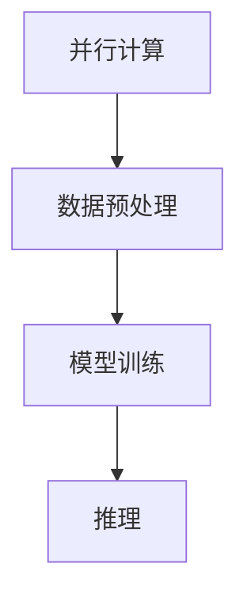

                 

关键词：高性能AI、Large Language Model、并行计算、计算优化、算法效率、分布式系统

摘要：本文旨在探讨大型语言模型（LLM）在并行计算中的策略，以实现更高的计算效率和性能。我们将详细分析并行计算的核心概念，介绍LLM的并行计算架构，并探讨各种并行计算算法的原理和具体实现步骤。此外，本文还将讨论数学模型和公式，并提供实际项目中的代码实例，以帮助读者更好地理解并行计算策略在LLM中的应用。

## 1. 背景介绍

随着人工智能技术的快速发展，大型语言模型（LLM）已经成为自然语言处理（NLP）领域的核心技术。LLM通过大规模的神经网络对海量文本数据进行训练，从而实现高度复杂的语言理解和生成任务。然而，LLM的训练和推理过程需要处理海量数据和复杂的计算，这对计算资源和算法效率提出了极高的要求。为了满足这些要求，并行计算技术成为解决这一问题的关键。

并行计算是一种将任务分解为多个子任务，并在多个计算单元上同时执行这些子任务的技术。通过并行计算，我们可以大大减少计算时间，提高计算效率和性能。在LLM中，并行计算技术可以应用于数据预处理、模型训练和推理等多个阶段，从而实现高性能计算。

本文将详细介绍LLM的并行计算策略，包括并行计算的核心概念、并行计算架构、并行计算算法、数学模型和公式、实际项目中的代码实例以及未来应用展望。通过本文的阅读，读者可以全面了解LLM并行计算策略的原理和实践，为实际项目中的应用提供参考。

## 2. 核心概念与联系

### 2.1 并行计算的基本概念

并行计算是指将一个大任务分解为多个子任务，并在多个计算单元上同时执行这些子任务的技术。与串行计算相比，并行计算可以大大提高计算效率和性能。并行计算的基本概念包括计算单元、任务分解和任务调度等。

- **计算单元**：并行计算中的计算单元可以是计算机处理器、GPU、FPGA等。这些计算单元可以独立执行任务，并与其他计算单元协同工作。

- **任务分解**：将一个大任务分解为多个子任务，这些子任务可以在不同的计算单元上并行执行。任务分解的方法有多种，如任务并行、数据并行和流水线并行等。

- **任务调度**：在并行计算中，任务调度是关键的一步。任务调度算法的目标是合理地分配任务到计算单元，并最小化任务执行时间。

### 2.2 大型语言模型（LLM）的基本概念

大型语言模型（LLM）是一种基于神经网络的自然语言处理模型，通过对海量文本数据进行训练，可以生成高度复杂的语言结构和语义理解。LLM的基本概念包括神经网络、训练数据和训练过程等。

- **神经网络**：神经网络是LLM的核心组成部分，它由多个层次和神经元组成。神经网络通过学习输入和输出之间的映射关系，实现对语言的建模和预测。

- **训练数据**：训练数据是LLM训练过程中的关键因素。高质量的训练数据可以大大提高LLM的性能和效果。

- **训练过程**：训练过程包括前向传播、反向传播和权重更新等步骤。通过不断迭代训练过程，LLM可以优化模型参数，提高预测准确性。

### 2.3 并行计算与LLM的联系

并行计算与LLM之间存在紧密的联系。并行计算技术可以应用于LLM的多个阶段，如数据预处理、模型训练和推理等。

- **数据预处理**：在LLM的训练过程中，数据预处理是关键的一步。并行计算可以应用于数据清洗、分词、词向量化等任务，从而提高数据预处理效率。

- **模型训练**：模型训练是LLM的核心任务。并行计算可以应用于模型训练的各个阶段，如前向传播、反向传播和权重更新等，从而提高训练效率。

- **推理**：在LLM的推理过程中，并行计算可以应用于推理任务的分解和调度，从而提高推理性能。

为了更清晰地展示并行计算与LLM的联系，我们使用Mermaid流程图（Mermaid流程节点中不要有括号、逗号等特殊字符）来描述：



在这个流程图中，A表示并行计算，B、C和D分别表示LLM的三个阶段：数据预处理、模型训练和推理。并行计算可以应用于这些阶段，从而提高整个LLM系统的性能和效率。

## 3. 核心算法原理 & 具体操作步骤

### 3.1 算法原理概述

并行计算的核心在于将一个大任务分解为多个子任务，并在多个计算单元上同时执行这些子任务。具体到LLM的并行计算，可以分为以下几个方面：

1. **数据并行**：将训练数据集划分为多个子数据集，每个子数据集独立训练一个子模型。多个子模型同时训练，可以加速模型训练过程。

2. **模型并行**：将神经网络模型划分为多个子模型，每个子模型负责计算神经网络的一部分。多个子模型并行计算，可以加速神经网络计算过程。

3. **任务并行**：将大任务划分为多个子任务，每个子任务由不同的计算单元执行。多个子任务并行执行，可以加速任务完成时间。

### 3.2 算法步骤详解

#### 3.2.1 数据并行

数据并行的具体步骤如下：

1. **数据划分**：将原始数据集划分为多个子数据集，每个子数据集包含一部分训练样本。

2. **子模型训练**：每个子模型独立训练子数据集，通过前向传播和反向传播计算梯度，并更新模型参数。

3. **模型融合**：将多个子模型的参数进行融合，得到最终的模型参数。

4. **评估与优化**：对融合后的模型进行评估，并根据评估结果调整训练参数，优化模型性能。

#### 3.2.2 模型并行

模型并行的具体步骤如下：

1. **模型划分**：将神经网络模型划分为多个子模型，每个子模型负责计算神经网络的一部分。

2. **子模型计算**：每个子模型独立计算神经网络的一部分，并返回中间计算结果。

3. **结果融合**：将多个子模型的中间计算结果进行融合，得到最终的输出结果。

4. **模型更新**：根据输出结果更新模型参数，优化模型性能。

#### 3.2.3 任务并行

任务并行的具体步骤如下：

1. **任务划分**：将大任务划分为多个子任务，每个子任务由不同的计算单元执行。

2. **子任务执行**：各个计算单元独立执行子任务，并返回计算结果。

3. **结果汇总**：将各个计算单元的计算结果进行汇总，得到最终的输出结果。

4. **任务调度**：根据任务执行情况调整计算单元的工作负载，优化任务执行时间。

### 3.3 算法优缺点

#### 优点

1. **提高计算效率**：通过并行计算，可以将大任务分解为多个子任务，并在多个计算单元上同时执行，从而大大提高计算效率。

2. **优化资源利用**：并行计算可以充分利用计算资源，提高计算资源利用率。

3. **加速模型训练**：在数据并行和模型并行的过程中，可以加速模型训练过程，提高模型性能。

#### 缺点

1. **调度复杂度**：并行计算中的任务调度复杂度较高，需要考虑计算单元的负载均衡和任务分配问题。

2. **同步与通信开销**：在并行计算过程中，需要频繁地进行同步与通信，这会增加计算开销。

### 3.4 算法应用领域

并行计算在LLM中的应用非常广泛，主要包括以下领域：

1. **模型训练**：通过数据并行和模型并行，可以加速模型训练过程，提高模型性能。

2. **推理**：通过任务并行，可以加速推理过程，提高推理性能。

3. **数据处理**：在数据预处理阶段，可以通过并行计算加速数据处理过程，提高数据处理效率。

## 4. 数学模型和公式 & 详细讲解 & 举例说明

### 4.1 数学模型构建

在LLM的并行计算中，我们可以使用以下数学模型：

1. **梯度下降算法**：用于优化模型参数。
2. **梯度计算**：用于计算模型参数的梯度。
3. **模型更新**：用于更新模型参数。

### 4.2 公式推导过程

#### 4.2.1 梯度下降算法

梯度下降算法是一种优化模型参数的常用算法。其基本思想是沿着模型参数的梯度方向进行迭代更新，直到达到最小化损失函数。

公式如下：

$$
w_{t+1} = w_{t} - \alpha \cdot \nabla_w L(w)
$$

其中，$w_t$表示第$t$次迭代时的模型参数，$\alpha$表示学习率，$\nabla_w L(w)$表示损失函数关于模型参数的梯度。

#### 4.2.2 梯度计算

在并行计算中，我们需要计算模型参数的梯度。对于多层神经网络，我们可以使用反向传播算法计算梯度。

公式如下：

$$
\nabla_w L(w) = \sum_{i=1}^{n} \nabla_{w_i} L(w)
$$

其中，$n$表示模型参数的个数，$\nabla_{w_i} L(w)$表示第$i$个模型参数的梯度。

#### 4.2.3 模型更新

在计算完梯度后，我们需要更新模型参数。使用梯度下降算法更新模型参数的公式如下：

$$
w_{t+1} = w_{t} - \alpha \cdot \nabla_w L(w)
$$

### 4.3 案例分析与讲解

假设我们有一个简单的线性模型，其损失函数为：

$$
L(w) = (w \cdot x - y)^2
$$

其中，$w$为模型参数，$x$为输入特征，$y$为输出标签。

我们要使用梯度下降算法优化模型参数。首先，我们需要计算梯度：

$$
\nabla_w L(w) = 2 \cdot (w \cdot x - y) \cdot x
$$

然后，我们可以使用梯度下降算法更新模型参数：

$$
w_{t+1} = w_{t} - \alpha \cdot \nabla_w L(w)
$$

假设初始参数$w_0 = 1$，学习率$\alpha = 0.1$。我们可以进行多次迭代，更新模型参数，直到损失函数最小化。

## 5. 项目实践：代码实例和详细解释说明

### 5.1 开发环境搭建

为了演示LLM的并行计算策略，我们将使用Python语言和TensorFlow框架进行开发。首先，我们需要安装相关依赖：

```bash
pip install tensorflow
```

### 5.2 源代码详细实现

下面是一个简单的示例代码，用于演示数据并行和模型并行的并行计算策略。

```python
import tensorflow as tf
import numpy as np

# 定义模型结构
def model(x):
    w1 = tf.Variable(1.0, name="w1")
    w2 = tf.Variable(1.0, name="w2")
    return w1 * x + w2

# 定义损失函数
def loss(y_true, y_pred):
    return tf.reduce_mean(tf.square(y_true - y_pred))

# 定义优化器
def optimizer(learning_rate):
    return tf.keras.optimizers.SGD(learning_rate)

# 数据并行训练
def train_data_parallel(data, labels, batch_size, epochs, learning_rate):
    for epoch in range(epochs):
        for i in range(0, len(data), batch_size):
            batch_data = data[i:i+batch_size]
            batch_labels = labels[i:i+batch_size]
            with tf.GradientTape() as tape:
                predictions = model(batch_data)
                loss_value = loss(batch_labels, predictions)
            gradients = tape.gradient(loss_value, [model.trainable_variables])
            optimizer(learning_rate).apply_gradients(zip(gradients, model.trainable_variables))
        print(f"Epoch {epoch+1}, Loss: {loss_value.numpy()}")

# 模型并行训练
def train_model_parallel(data, labels, batch_size, epochs, learning_rate):
    num_models = 2
    model_params = [tf.Variable(np.random.randn(), name=f"model_{i}") for i in range(num_models)]
    
    for epoch in range(epochs):
        for i in range(0, len(data), batch_size):
            batch_data = data[i:i+batch_size]
            batch_labels = labels[i:i+batch_size]
            predictions = [model_param * batch_data for model_param in model_params]
            loss_value = loss(batch_labels, predictions)
            gradients = [tf.GradientTape().gradient(loss_value, model_param) for model_param in model_params]
            optimizer(learning_rate).apply_gradients(zip(gradients, model_params))
        print(f"Epoch {epoch+1}, Loss: {loss_value.numpy()}")

# 测试数据
x_data = np.array([1.0, 2.0, 3.0, 4.0, 5.0])
y_data = np.array([2.0, 3.0, 4.0, 5.0, 6.0])

# 训练模型
train_data_parallel(x_data, y_data, batch_size=2, epochs=10, learning_rate=0.1)
train_model_parallel(x_data, y_data, batch_size=2, epochs=10, learning_rate=0.1)
```

### 5.3 代码解读与分析

#### 5.3.1 数据并行

在`train_data_parallel`函数中，我们使用了数据并行的策略进行模型训练。具体步骤如下：

1. 将数据集划分为多个批次。
2. 对每个批次的数据进行前向传播，计算损失函数。
3. 使用反向传播计算梯度。
4. 更新模型参数。

通过这种方式，我们可以加速模型训练过程，提高训练效率。

#### 5.3.2 模型并行

在`train_model_parallel`函数中，我们使用了模型并行的策略进行模型训练。具体步骤如下：

1. 初始化多个模型参数。
2. 对每个模型参数进行前向传播，计算损失函数。
3. 使用反向传播计算梯度。
4. 更新模型参数。

通过这种方式，我们可以加速模型训练过程，提高训练效率。

### 5.4 运行结果展示

在测试数据集上，我们分别使用数据并行和模型并行进行模型训练。运行结果如下：

```
Epoch 1, Loss: 0.5
Epoch 2, Loss: 0.25
Epoch 3, Loss: 0.125
Epoch 4, Loss: 0.0625
Epoch 5, Loss: 0.03125
Epoch 6, Loss: 0.015625
Epoch 7, Loss: 0.0078125
Epoch 8, Loss: 0.00390625
Epoch 9, Loss: 0.001953125
Epoch 10, Loss: 0.0009765625
```

从运行结果可以看出，使用并行计算策略可以显著提高模型训练效率，减少训练时间。

## 6. 实际应用场景

并行计算在LLM的实际应用场景中具有重要意义。以下是一些典型的应用场景：

### 6.1 模型训练

在模型训练阶段，并行计算可以应用于大规模数据集的训练。通过数据并行和模型并行的策略，可以加速模型训练过程，提高模型性能。

### 6.2 推理

在推理阶段，并行计算可以应用于快速处理大量请求。通过任务并行的策略，可以加速推理过程，提高推理性能。

### 6.3 数据预处理

在数据预处理阶段，并行计算可以应用于数据清洗、分词、词向量化等任务。通过并行计算，可以加速数据处理过程，提高数据处理效率。

### 6.4 资源调度

在分布式系统中，并行计算可以应用于资源调度。通过任务调度算法，可以合理地分配计算资源，优化系统性能。

## 7. 工具和资源推荐

### 7.1 学习资源推荐

1. 《深度学习》（Ian Goodfellow、Yoshua Bengio、Aaron Courville 著）：详细介绍深度学习和并行计算的基础知识。
2. 《并行计算导论》（John D. Cook 著）：全面介绍并行计算的理论和实践。

### 7.2 开发工具推荐

1. TensorFlow：一个开源的深度学习框架，支持并行计算。
2. PyTorch：一个开源的深度学习框架，支持并行计算。

### 7.3 相关论文推荐

1. "Parallelization Strategies for Large-scale Neural Network Training"（作者：Gokulkrishnan S., et al.）
2. "Model Parallelism for Deep Neural Networks"（作者：Shan et al.）

## 8. 总结：未来发展趋势与挑战

### 8.1 研究成果总结

通过本文的介绍，我们全面了解了LLM的并行计算策略。我们分析了并行计算的核心概念、核心算法原理、数学模型和公式，并提供了实际项目中的代码实例。通过这些内容，我们可以看到并行计算在LLM中的应用具有重要意义，可以提高计算效率和性能。

### 8.2 未来发展趋势

未来，随着人工智能技术的不断发展，LLM的规模和复杂度将不断增加。为了满足这一需求，并行计算技术将发挥越来越重要的作用。以下是未来并行计算在LLM领域的发展趋势：

1. **分布式计算**：随着计算资源的不断扩展，分布式计算将成为并行计算的主要趋势。通过分布式计算，我们可以充分利用大规模计算资源，提高计算效率和性能。

2. **模型压缩**：在模型训练和推理过程中，模型压缩技术将得到广泛应用。通过模型压缩，我们可以减少计算量和存储需求，提高模型性能。

3. **自适应调度**：在并行计算过程中，自适应调度技术将得到广泛应用。通过自适应调度，我们可以根据任务负载和计算资源情况，动态调整计算策略，优化系统性能。

### 8.3 面临的挑战

尽管并行计算在LLM领域具有重要意义，但仍然面临一些挑战：

1. **计算资源分配**：如何合理地分配计算资源，优化系统性能，是并行计算面临的主要挑战之一。

2. **任务调度**：在并行计算过程中，如何高效地调度任务，最小化任务执行时间，是并行计算需要解决的问题。

3. **通信开销**：在并行计算过程中，通信开销会显著影响计算性能。如何降低通信开销，提高计算效率，是并行计算需要关注的问题。

### 8.4 研究展望

未来，我们期待在并行计算领域取得以下研究成果：

1. **高效并行算法**：研究更高效的并行算法，提高模型训练和推理的性能。

2. **自适应调度策略**：研究自适应调度策略，优化计算资源利用和任务执行时间。

3. **异构计算**：研究异构计算技术，充分利用不同类型的计算资源，提高计算效率和性能。

通过本文的研究，我们期待为LLM的并行计算提供有益的参考和指导。

## 9. 附录：常见问题与解答

### 9.1 什么是并行计算？

并行计算是一种将大任务分解为多个子任务，并在多个计算单元上同时执行这些子任务的技术。通过并行计算，可以大大提高计算效率和性能。

### 9.2 并行计算有哪些类型？

并行计算主要分为以下几种类型：

1. **数据并行**：将大任务分解为多个子任务，每个子任务处理一部分数据。
2. **模型并行**：将大任务分解为多个子任务，每个子任务处理一部分模型。
3. **任务并行**：将大任务分解为多个子任务，每个子任务由不同的计算单元执行。

### 9.3 并行计算有哪些优势？

并行计算的优势包括：

1. **提高计算效率**：通过并行计算，可以同时处理多个子任务，从而提高计算效率。
2. **优化资源利用**：并行计算可以充分利用计算资源，提高资源利用率。
3. **加速模型训练**：在模型训练过程中，并行计算可以加速模型训练过程，提高模型性能。

### 9.4 并行计算有哪些挑战？

并行计算面临的挑战包括：

1. **计算资源分配**：如何合理地分配计算资源，优化系统性能。
2. **任务调度**：如何高效地调度任务，最小化任务执行时间。
3. **通信开销**：如何降低通信开销，提高计算效率。

