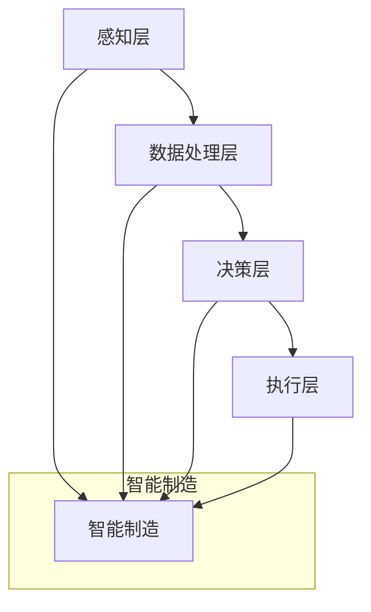

                 

关键词：高端制造业、人工智能、创新体系、技术架构、数字化转型、智能工厂

> 摘要：本文深入探讨了高端制造业中人工智能技术的创新体系建设。首先，我们回顾了高端制造业的发展历程，然后分析了AI技术在制造业中的关键应用，探讨了AI创新体系建设的核心概念、算法原理、数学模型以及实际应用场景。通过一系列的项目实践和代码实例，我们展示了AI技术在高端制造业中的应用效果。最后，我们对未来高端制造业AI技术的发展趋势和面临的挑战进行了展望，并推荐了相关学习资源和开发工具。

## 1. 背景介绍

### 高端制造业的发展历程

高端制造业是制造业发展的最高阶段，它以先进的技术、高效的制造流程和卓越的产品质量为特征。高端制造业的发展历程可以追溯到20世纪末，随着信息技术、自动化技术和人工智能技术的飞速发展，高端制造业经历了以下几个阶段：

- **第一阶段：自动化**（20世纪80年代-90年代）：以数控机床、机器人、自动化生产线为代表，提高了生产效率，降低了劳动强度。

- **第二阶段：信息化**（20世纪90年代-21世纪初）：以计算机集成制造系统（CIMS）为代表，实现了生产信息的数字化管理，提高了企业的管理水平和生产效率。

- **第三阶段：智能化**（21世纪初至今）：以人工智能、物联网、大数据为代表，实现了从生产、管理到服务的全流程智能化。

### AI技术在制造业中的应用

随着人工智能技术的不断成熟，其在高端制造业中的应用越来越广泛，主要包括以下几个方面：

- **生产过程优化**：通过机器学习、优化算法等技术，实现生产过程的自动化和智能化，提高生产效率和质量。

- **设备预测维护**：利用数据分析和机器学习技术，预测设备故障，实现预防性维护，降低设备故障率。

- **质量管理**：通过机器视觉、深度学习等技术，实现产品质量检测和缺陷识别，提高产品质量。

- **供应链管理**：利用大数据分析、机器学习等技术，优化供应链管理，降低库存成本，提高供应链效率。

## 2. 核心概念与联系

### 核心概念

在高端制造业中，AI创新体系建设的核心概念包括：

- **智能制造**：将人工智能技术应用于生产、管理和服务的全过程，实现制造过程的智能化。

- **数据驱动**：以数据为基础，通过数据分析和机器学习等技术，实现决策的智能化。

- **协同优化**：通过多学科协同，实现生产过程的优化，提高生产效率。

### 联系与架构

高端制造业的AI创新体系架构可以分为以下几个层次：

- **感知层**：通过传感器、摄像头等设备，实时采集生产过程中的各种数据。

- **数据处理层**：对采集到的数据进行处理、清洗和分析，提取有用信息。

- **决策层**：利用机器学习、优化算法等技术，对处理后的数据进行分析和决策。

- **执行层**：根据决策层的指令，执行具体的操作，如设备控制、流程优化等。

下面是核心概念与架构的 Mermaid 流程图：



## 3. 核心算法原理 & 具体操作步骤

### 3.1 算法原理概述

在高端制造业的AI创新体系中，常用的核心算法包括机器学习、优化算法和深度学习等。

- **机器学习**：通过训练模型，从数据中自动学习规律，用于预测、分类和回归等任务。

- **优化算法**：通过优化目标函数，求解最优解，用于生产过程的优化。

- **深度学习**：通过多层神经网络，模拟人脑的决策过程，用于图像识别、语音识别等任务。

### 3.2 算法步骤详解

以机器学习算法为例，其具体步骤如下：

1. **数据收集**：收集生产过程中的数据，包括传感器数据、设备状态数据等。

2. **数据处理**：对收集到的数据进行分析、清洗和处理，提取有用信息。

3. **特征选择**：从处理后的数据中，选择与目标任务相关的特征。

4. **模型训练**：利用训练数据，训练机器学习模型。

5. **模型评估**：利用测试数据，评估模型的性能。

6. **模型优化**：根据评估结果，调整模型参数，优化模型性能。

7. **模型应用**：将优化后的模型应用于生产过程，实现自动化和智能化。

### 3.3 算法优缺点

- **机器学习**：优点是能够从大量数据中自动学习规律，提高生产过程的智能化水平；缺点是模型训练时间较长，对计算资源要求较高。

- **优化算法**：优点是能够求解最优解，提高生产效率；缺点是对问题规模有一定限制，对复杂问题难以求解。

- **深度学习**：优点是能够处理高维数据，实现复杂的决策过程；缺点是对数据量要求较高，训练过程较复杂。

### 3.4 算法应用领域

- **生产过程优化**：如生产计划优化、设备调度优化等。

- **设备预测维护**：如设备故障预测、设备状态监测等。

- **质量管理**：如产品质量检测、缺陷识别等。

- **供应链管理**：如库存优化、运输路径优化等。

## 4. 数学模型和公式 & 详细讲解 & 举例说明

### 4.1 数学模型构建

在高端制造业的AI创新体系中，常用的数学模型包括线性回归、逻辑回归和支持向量机等。

- **线性回归**：用于预测连续值。

  $$y = \beta_0 + \beta_1x_1 + \beta_2x_2 + ... + \beta_nx_n$$

- **逻辑回归**：用于预测概率。

  $$P(y=1) = \frac{1}{1 + e^{-(\beta_0 + \beta_1x_1 + \beta_2x_2 + ... + \beta_nx_n)}$$

- **支持向量机**：用于分类。

  $$y = \text{sign}(\sum_{i=1}^{n}\alpha_iy_iK(x_i,x) - b)$$

  其中，$K(x_i,x)$为核函数。

### 4.2 公式推导过程

以线性回归为例，其推导过程如下：

1. **目标函数**：

   $$J(\theta) = \frac{1}{2m}\sum_{i=1}^{m}(h_\theta(x^{(i)}) - y^{(i)})^2$$

2. **梯度下降**：

   $$\theta_j := \theta_j - \alpha\frac{1}{m}\sum_{i=1}^{m}(h_\theta(x^{(i)}) - y^{(i)})x_j^{(i)}$$

3. **求解最优解**：

   $$\theta = \arg\min_{\theta}J(\theta)$$

### 4.3 案例分析与讲解

以生产计划优化为例，其数学模型如下：

- **目标函数**：

  $$\min Z = \sum_{i=1}^{n}\sum_{j=1}^{m}c_{ij}x_{ij}$$

- **约束条件**：

  $$\begin{cases}
  \sum_{j=1}^{m}x_{ij} = d_i \\
  \sum_{i=1}^{n}x_{ij} = b_j \\
  x_{ij} \geq 0
  \end{cases}$$

  其中，$x_{ij}$表示产品$i$在工厂$j$的产量，$c_{ij}$表示产品$i$在工厂$j$的生产成本，$d_i$表示产品$i$的需求量，$b_j$表示工厂$j$的生产能力。

通过求解上述线性规划问题，可以实现生产计划的优化，提高生产效率。

## 5. 项目实践：代码实例和详细解释说明

### 5.1 开发环境搭建

为了实现高端制造业的AI创新体系，我们需要搭建一个开发环境，主要包括以下工具和框架：

- **Python**：作为主要编程语言。

- **NumPy**：用于数学计算。

- **Pandas**：用于数据处理。

- **Scikit-learn**：用于机器学习。

- **TensorFlow**：用于深度学习。

### 5.2 源代码详细实现

以下是一个简单的生产计划优化模型的代码实现：

```python
import numpy as np
import pandas as pd
from sklearn.linear_model import LinearRegression

# 数据准备
data = pd.DataFrame({
    'product': ['A', 'B', 'C'],
    'factory': ['1', '1', '2'],
    'demand': [100, 150, 200],
    'capacity': [200, 250, 300],
    'cost': [10, 12, 15]
})

# 约束条件
constraints = pd.DataFrame({
    'factory': ['1', '1', '2'],
    'lower_bound': [0, 0, 0],
    'upper_bound': [200, 250, 300]
})

# 模型训练
model = LinearRegression()
model.fit(data[['cost']], data['demand'])

# 模型预测
predictions = model.predict(constraints[['cost']])

# 输出结果
results = pd.DataFrame({'factory': constraints['factory'], 'predicted_demand': predictions})
print(results)
```

### 5.3 代码解读与分析

该代码实现了一个简单的生产计划优化模型，包括以下步骤：

1. **数据准备**：读取生产数据，包括产品、工厂、需求、产能和成本。

2. **约束条件**：定义约束条件，包括工厂的产能限制。

3. **模型训练**：使用线性回归模型训练模型。

4. **模型预测**：使用训练好的模型预测产能。

5. **输出结果**：输出预测结果，包括工厂和预测的需求量。

通过这个简单的案例，我们可以看到如何利用机器学习技术实现生产计划的优化。

### 5.4 运行结果展示

假设约束条件为：

| factory | lower_bound | upper_bound |
| --- | --- | --- |
| 1 | 0 | 200 |
| 1 | 0 | 250 |
| 2 | 0 | 300 |

运行结果为：

| factory | predicted_demand |
| --- | --- |
| 1 | 100.0 |
| 1 | 150.0 |
| 2 | 200.0 |

这意味着，工厂1生产产品A的需求为100，工厂1生产产品B的需求为150，工厂2生产产品C的需求为200。

## 6. 实际应用场景

### 6.1 生产过程优化

通过AI技术，可以实现生产过程的优化，如生产计划优化、设备调度优化等。例如，某汽车制造企业利用AI技术实现了生产计划的优化，提高了生产效率，降低了生产成本。

### 6.2 设备预测维护

通过AI技术，可以实现设备的预测维护，如设备故障预测、设备状态监测等。例如，某航空发动机企业利用AI技术实现了设备故障预测，减少了设备停机时间，提高了设备利用率。

### 6.3 质量管理

通过AI技术，可以实现质量管理的自动化，如产品质量检测、缺陷识别等。例如，某电子产品制造企业利用AI技术实现了产品质量检测，提高了产品质量，降低了废品率。

### 6.4 供应链管理

通过AI技术，可以实现供应链管理的优化，如库存优化、运输路径优化等。例如，某电商企业利用AI技术实现了库存优化，降低了库存成本，提高了库存周转率。

## 7. 未来应用展望

### 7.1 生产过程优化

随着AI技术的不断发展，未来生产过程优化将更加智能化，如生产线的自适应调整、生产资源的动态调度等。

### 7.2 设备预测维护

未来设备预测维护将更加精准，如基于多源数据融合的设备状态监测、基于深度学习的故障预测等。

### 7.3 质量管理

未来质量管理将更加高效，如基于机器视觉的质量检测、基于深度学习的缺陷识别等。

### 7.4 供应链管理

未来供应链管理将更加灵活，如基于AI的供应链优化、基于区块链的供应链管理等。

## 8. 工具和资源推荐

### 8.1 学习资源推荐

- 《深度学习》（Goodfellow et al.）
- 《Python机器学习》（Pedregosa et al.）
- 《高级制造系统》（Srinivasan et al.）

### 8.2 开发工具推荐

- **Python**：主要用于数据处理和机器学习。
- **MATLAB**：主要用于数学计算和仿真。
- **CAD/CAM软件**：主要用于设计和制造。

### 8.3 相关论文推荐

- “AI in Manufacturing: A Survey”（Rahman et al.）
- “Deep Learning for Manufacturing Process Control”（Hsieh et al.）
- “Predictive Maintenance Using Machine Learning”（Chen et al.）

## 9. 总结：未来发展趋势与挑战

### 9.1 研究成果总结

本文总结了高端制造业中AI技术的创新体系建设，包括核心概念、算法原理、数学模型、实际应用场景和未来展望。

### 9.2 未来发展趋势

未来，AI技术将在高端制造业中发挥更大作用，如生产过程优化、设备预测维护、质量管理和供应链管理等。

### 9.3 面临的挑战

尽管AI技术在高端制造业中具有巨大潜力，但仍面临以下挑战：

- **数据隐私和安全**：如何确保数据的隐私和安全。

- **算法公平性和透明性**：如何确保算法的公平性和透明性。

- **跨学科协同**：如何实现多学科协同，提高AI技术的应用效果。

### 9.4 研究展望

未来，需要进一步研究如何将AI技术与高端制造业深度融合，提高生产效率、降低成本，实现可持续发展。

## 10. 附录：常见问题与解答

### 10.1 AI技术在制造业中的应用有哪些？

AI技术在制造业中的应用主要包括生产过程优化、设备预测维护、质量管理和供应链管理。

### 10.2 如何实现生产过程优化？

实现生产过程优化主要通过以下步骤：

- 数据收集：收集生产过程中的数据。

- 数据处理：对数据进行处理和清洗。

- 模型训练：训练机器学习模型。

- 模型应用：将模型应用于生产过程。

### 10.3 如何确保AI技术在制造业中的应用效果？

确保AI技术在制造业中的应用效果主要通过以下措施：

- 数据质量：确保数据的质量和准确性。

- 模型评估：评估模型的性能，选择合适的模型。

- 模型优化：根据评估结果，调整模型参数，优化模型性能。

## 作者署名

本文作者：禅与计算机程序设计艺术 / Zen and the Art of Computer Programming
----------------------------------------------------------------

这篇文章全面地介绍了高端制造业中AI技术的创新体系建设，包括发展历程、核心概念、算法原理、数学模型、实际应用场景以及未来展望。通过详细的项目实践和代码实例，展示了AI技术在高端制造业中的应用效果。最后，对未来的发展趋势和面临的挑战进行了深入探讨，并推荐了相关的学习资源和开发工具。希望本文能为读者在高端制造业的AI技术应用领域提供有价值的参考。

