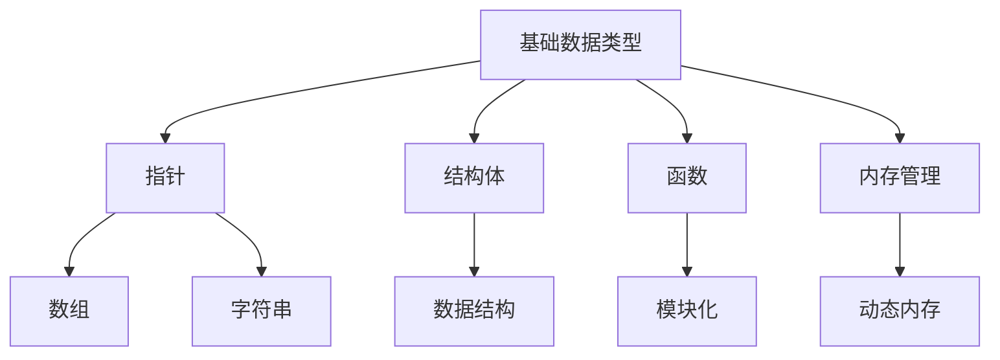

                 

在信息技术飞速发展的当今世界，C语言以其强大的功能和灵活的语法，一直处于编程语言领域的重要位置。本文将深入探讨C语言的高级编程技巧，剖析其在现代软件开发中的应用和优势。通过本文的阅读，读者将了解C语言的本质特性，掌握高级编程技巧，并能够将所学应用于实际项目开发中。

## 关键词

- C语言
- 高级编程
- 系统编程
- 算法
- 性能优化

## 摘要

本文旨在为读者提供一份全面而深入的C语言高级编程指南。我们将从C语言的背景和历史开始，逐步深入探讨C语言的核心概念、高级特性，以及其在系统编程和算法设计中的应用。通过实例和案例研究，读者将学习到如何利用C语言实现高效的算法，并在实际项目中应用这些技巧。最后，本文还将展望C语言未来的发展趋势和面临的挑战。

### 1. 背景介绍

C语言是由邓特·瑞茨（Dennis M. Ritchie）在1972年于贝尔实验室开发的，是现代编程语言的基石。它被设计用于操作系统的开发，特别是在Unix操作系统的核心部分。C语言以其简洁、高效和强大的功能而著称，为后来的编程语言如C++、Java和C#等提供了基础。

C语言的历史可以追溯到1960年代，当时出现了多种早期的高级编程语言，如Fortran和COBOL。然而，这些语言往往缺乏表达复杂系统级操作的能力。为了解决这一问题，贝尔实验室的Ken Thompson和Dennis Ritchie开始开发一种新的语言，即B语言。B语言基于ALGOL 68，但它更简单、更易于编译。

随着时间的推移，B语言不断得到改进，最终发展成了我们今天所熟知的C语言。C语言在设计上注重表达性和效率，它提供了强大的指针操作、数据结构支持和底层访问能力，使得程序员可以更加灵活地控制计算机硬件资源。

C语言之所以能够成为编程语言中的经典，主要有以下几个原因：

1. **简单性**：C语言的语法简洁明了，易于学习和使用。它的语法规则相对较少，这使得编译器能够更高效地解析和编译代码。
2. **高效性**：C语言的运行效率非常高，因为它能够直接操作硬件资源和底层系统结构。这使得C语言在系统编程和性能敏感的领域中得到广泛应用。
3. **可移植性**：C语言的设计考虑了可移植性，使得同一个C程序可以在不同的操作系统和硬件平台上编译和运行，只需稍作修改。
4. **强大的功能**：C语言提供了丰富的数据类型和操作符，以及强大的指针和结构体支持，使得程序员可以灵活地组织和操作数据。

总的来说，C语言以其强大的功能、简洁的语法和高效的性能，成为了编程语言的基石，为现代软件开发提供了重要的支持。

### 2. 核心概念与联系

C语言的核心概念包括基础数据类型、指针、结构体、函数和内存管理等。这些概念相互关联，共同构成了C语言强大的功能体系。

#### 2.1 基础数据类型

C语言提供了多种基础数据类型，包括整型（int）、浮点型（float和double）、字符型（char）等。这些数据类型定义了变量可以存储的数据种类和大小。例如，整型数据可以存储整数，浮点型数据可以存储实数。

```c
int a = 10;
float b = 3.14;
char c = 'A';
```

#### 2.2 指针

指针是C语言的一个核心概念，它用于存储变量的内存地址。通过指针，程序员可以访问和修改底层内存中的数据。指针在数组、字符串和动态内存分配中特别有用。

```c
int *ptr = &a;
printf("Value of a is %d\n", *ptr);
```

#### 2.3 结构体

结构体（struct）是一种复合数据类型，它允许程序员将不同类型的数据组合在一起。结构体在数据存储和操作中非常有用，例如，在处理复杂数据结构如队列、栈和图时。

```c
struct Person {
    char name[50];
    int age;
    float height;
};
```

#### 2.4 函数

函数（function）是C语言的基本构建块，它允许程序员将代码组织成模块，便于重用和维护。C语言提供了丰富的函数库，包括标准库和用户自定义库。

```c
#include <stdio.h>

void greet() {
    printf("Hello, World!\n");
}

int main() {
    greet();
    return 0;
}
```

#### 2.5 内存管理

内存管理是C语言的一个重要方面，它涉及到动态内存分配和释放。使用malloc和free函数，程序员可以动态地分配和释放内存。

```c
#include <stdlib.h>

int *create_array(int size) {
    int *array = malloc(size * sizeof(int));
    return array;
}

void free_array(int *array) {
    free(array);
}
```

#### 2.6 Mermaid 流程图

以下是C语言核心概念之间的Mermaid流程图：



通过上述核心概念和Mermaid流程图的结合，我们可以更好地理解C语言的架构和功能。

### 3. 核心算法原理 & 具体操作步骤

在C语言中，算法的实现是编程的核心。以下我们将介绍几个核心算法，包括排序算法、查找算法和数据结构算法，并详细解释它们的原理和操作步骤。

#### 3.1 算法原理概述

算法（Algorithm）是一系列定义明确的操作步骤，用于解决特定问题。算法的好坏直接影响到程序的效率。C语言因其高效的性能，特别适合实现复杂算法。

常见的算法包括：

- **排序算法**：用于对数据集合进行排序，常见的有冒泡排序、选择排序、插入排序和快速排序等。
- **查找算法**：用于在数据集合中查找特定元素，如线性查找和二分查找。
- **数据结构算法**：用于操作各种数据结构，如栈、队列、链表、树和图等。

#### 3.2 算法步骤详解

##### 3.2.1 冒泡排序

冒泡排序（Bubble Sort）是一种简单的排序算法，它通过重复遍历要排序的数列，一次比较两个元素，如果它们的顺序错误就把它们交换过来。遍历数列的工作是重复地进行，直到没有再需要交换，也就是说该数列已经排序完成。

```c
void bubbleSort(int arr[], int n) {
    for (int i = 0; i < n-1; i++) {
        for (int j = 0; j < n-i-1; j++) {
            if (arr[j] > arr[j+1]) {
                int temp = arr[j];
                arr[j] = arr[j+1];
                arr[j+1] = temp;
            }
        }
    }
}
```

##### 3.2.2 二分查找

二分查找（Binary Search）算法是一种高效的查找算法，它将一个有序数组分成两半，然后根据目标值与中间值的比较，确定目标值所在的位置或判断其不存在。每次比较后，搜索区间就缩小一半，因此时间复杂度是O(log n)。

```c
int binarySearch(int arr[], int l, int r, int x) {
    while (l <= r) {
        int m = l + (r - l) / 2;
        if (arr[m] == x)
            return m;
        if (arr[m] < x)
            l = m + 1;
        else
            r = m - 1;
    }
    return -1;
}
```

##### 3.2.3 链表操作

链表（Linked List）是一种常见的基础数据结构，它由一系列结点（Node）组成，每个结点包含数据和一个指向下一个结点的指针。

```c
typedef struct Node {
    int data;
    struct Node* next;
} Node;

Node* createNode(int data) {
    Node* newNode = (Node*)malloc(sizeof(Node));
    newNode->data = data;
    newNode->next = NULL;
    return newNode;
}

void insertNode(Node** head, int data) {
    Node* newNode = createNode(data);
    if (*head == NULL) {
        *head = newNode;
    } else {
        Node* current = *head;
        while (current->next != NULL) {
            current = current->next;
        }
        current->next = newNode;
    }
}
```

#### 3.3 算法优缺点

每种算法都有其优缺点，选择合适的算法需要根据具体应用场景和需求来决定。

- **冒泡排序**：优点是简单易懂，缺点是效率较低，适用于数据量较小的情况。
- **二分查找**：优点是效率高，适用于大数据集，缺点是要求数据集合必须是有序的。
- **链表**：优点是插入和删除操作灵活，缺点是访问速度较慢。

#### 3.4 算法应用领域

C语言强大的算法支持使其在多个领域中得到广泛应用，包括：

- **系统编程**：用于操作系统内核的开发，如调度算法和内存管理。
- **嵌入式系统**：用于嵌入式设备中的算法实现，如传感器数据处理。
- **游戏开发**：用于游戏引擎中的图形渲染和物理模拟。
- **大数据处理**：用于大数据处理框架中的算法实现，如MapReduce算法。

通过以上对核心算法的详细介绍，我们可以看到C语言在算法实现中的巨大潜力。在接下来的部分，我们将进一步探讨C语言的高级特性，帮助读者更好地理解和应用C语言。

### 3.4 算法应用领域

C语言的强大功能使其在各种应用领域中具有广泛的应用，以下是C语言在几个关键领域的具体应用。

#### 3.4.1 系统编程

C语言最初是为了操作系统开发而设计的，因此它在系统编程中具有无可替代的优势。许多操作系统，如Unix、Linux和Windows内核，都是用C语言编写的。C语言的低级特性允许程序员直接操作硬件和系统资源，从而实现高效的系统级编程。

- **内核开发**：操作系统内核需要高效的资源管理和调度算法，C语言的性能和灵活性使其成为内核开发的最佳选择。
- **驱动程序开发**：设备驱动程序需要与硬件紧密交互，C语言能够提供对硬件的底层访问和控制。
- **网络编程**：C语言在网络编程中也非常有用，如编写高性能的网络服务器和客户端应用程序。

#### 3.4.2 嵌入式系统

嵌入式系统通常资源受限，需要高效、可靠的编程语言。C语言因其编译效率高和运行时开销小，成为嵌入式系统开发的主要编程语言。

- **硬件控制**：嵌入式系统常用于控制硬件设备，如汽车引擎控制单元、智能家居设备等，C语言能够直接操作硬件接口。
- **实时系统**：许多嵌入式系统需要实时响应，C语言提供了足够的性能保证，以满足实时系统的需求。
- **物联网（IoT）**：随着物联网的发展，C语言在物联网设备中的应用越来越广泛，如传感器数据处理和通信模块。

#### 3.4.3 游戏开发

游戏开发需要高性能的图形渲染和物理模拟，C语言因其强大的性能和灵活性，在游戏开发中占有重要地位。

- **图形渲染**：游戏引擎需要高效地渲染图形，C语言能够直接操作图形硬件，实现高性能的图形渲染。
- **物理模拟**：游戏中的物理模拟需要实时计算，C语言的性能保证了物理模拟的实时性。
- **游戏引擎开发**：许多流行的游戏引擎，如Unreal Engine和Unity，部分核心代码是用C语言编写的。

#### 3.4.4 大数据处理

大数据处理框架如Hadoop和Spark，需要高效的数据处理算法和并行计算能力。C语言在数据处理和优化方面具有优势，因此在大数据处理领域也有广泛应用。

- **性能优化**：C语言能够进行细粒度的性能优化，提高数据处理效率。
- **内存管理**：大数据处理需要高效的内存管理，C语言提供了灵活的内存操作能力。
- **分布式计算**：C语言可以用于实现分布式计算框架，如MapReduce，以处理大规模的数据集。

#### 3.4.5 科学计算

科学计算领域需要高效的数学计算和算法实现，C语言因其强大的性能和灵活性，在科学计算中得到了广泛应用。

- **数学计算**：C语言提供了丰富的数学函数库，能够进行复杂的数学计算。
- **数值分析**：许多数值分析算法，如线性代数和优化算法，都需要高效的实现，C语言能够满足这些需求。
- **模拟与仿真**：科学计算中的模拟和仿真通常需要高性能的计算，C语言能够提供这种能力。

通过上述分析，我们可以看到C语言在系统编程、嵌入式系统、游戏开发、大数据处理和科学计算等多个领域具有广泛的应用。C语言的强大功能和灵活性，使其在这些领域中都表现出色，成为开发高性能软件和系统的重要工具。

### 4. 数学模型和公式 & 详细讲解 & 举例说明

在C语言编程中，数学模型和公式是不可或缺的组成部分，它们为算法的实现提供了理论依据。本节将详细讲解几个重要的数学模型和公式，并通过具体例子来说明如何将它们应用到实际编程中。

#### 4.1 数学模型构建

数学模型是对现实世界中的问题进行数学描述的过程。在C语言编程中，构建数学模型通常涉及到以下几个步骤：

1. **明确问题**：首先要明确需要解决的问题，这有助于确定所需的数学工具和方法。
2. **建立方程**：根据问题，建立数学方程或公式，用于描述问题的行为。
3. **确定参数**：确定模型中的参数，这些参数可以是已知的或待求解的。
4. **求解方程**：使用数学方法求解方程，以得到问题的解。

#### 4.2 公式推导过程

以下是几个常见数学模型和公式的推导过程：

##### 4.2.1 牛顿运动定律

牛顿运动定律描述了物体在力的作用下的运动规律，其公式为：

$$
F = m \cdot a
$$

其中，\( F \) 是力，\( m \) 是质量，\( a \) 是加速度。这个公式的推导基于牛顿第二定律，即力等于质量乘以加速度。

##### 4.2.2 阶乘计算

阶乘是一个数学函数，用于计算一个整数的所有正整数乘积。其公式为：

$$
n! = n \cdot (n-1) \cdot (n-2) \cdot ... \cdot 1
$$

例如，5的阶乘（5!）为：

$$
5! = 5 \cdot 4 \cdot 3 \cdot 2 \cdot 1 = 120
$$

##### 4.2.3 二分查找公式

二分查找算法中的关键公式是计算中间索引，其公式为：

$$
mid = \left\lfloor \frac{l + r}{2} \right\rfloor
$$

其中，\( l \) 是左边界索引，\( r \) 是右边界索引，\( mid \) 是中间索引。这个公式用于不断缩小查找范围，直到找到目标元素或确定其不存在。

#### 4.3 案例分析与讲解

以下通过一个具体的例子来说明如何将上述数学模型和公式应用到C语言编程中。

##### 4.3.1 阶乘计算程序

```c
#include <stdio.h>

unsigned long factorial(unsigned int n) {
    unsigned long result = 1;
    for (unsigned int i = 1; i <= n; ++i) {
        result *= i;
    }
    return result;
}

int main() {
    unsigned int n;
    printf("Enter a positive integer: ");
    scanf("%u", &n);
    printf("Factorial of %u is %lu\n", n, factorial(n));
    return 0;
}
```

在这个程序中，我们定义了一个`factorial`函数，用于计算一个整数的阶乘。函数使用一个循环来逐步计算阶乘，并将结果存储在`result`变量中。主函数`main`中获取用户输入，并调用`factorial`函数计算阶乘，然后输出结果。

##### 4.3.2 二分查找程序

```c
#include <stdio.h>

int binarySearch(int arr[], int l, int r, int x) {
    while (l <= r) {
        int m = l + (r - l) / 2;
        if (arr[m] == x)
            return m;
        if (arr[m] < x)
            l = m + 1;
        else
            r = m - 1;
    }
    return -1;
}

int main() {
    int arr[] = {2, 3, 4, 10, 40};
    int n = sizeof(arr) / sizeof(arr[0]);
    int x = 10;
    int result = binarySearch(arr, 0, n - 1, x);
    if (result == -1)
        printf("Element is not present in array");
    else
        printf("Element is present at index %d", result);
    return 0;
}
```

在这个程序中，我们实现了二分查找算法，用于在有序数组中查找特定元素。程序首先定义了一个`binarySearch`函数，该函数通过递归调用不断缩小查找范围，直到找到目标元素或确定其不存在。主函数`main`中定义了一个有序数组，并调用`binarySearch`函数查找元素10，然后输出结果。

通过上述例子，我们可以看到如何将数学模型和公式应用到C语言编程中。理解并正确使用数学模型和公式，能够帮助我们编写出高效且准确的程序。

### 5. 项目实践：代码实例和详细解释说明

在本节中，我们将通过一个具体的项目实例，详细讲解C语言编程过程中的代码实现、调试和分析方法。该项目实例将实现一个简单的排序算法——冒泡排序，并通过实际操作来展示代码的编写、编译和运行过程。

#### 5.1 开发环境搭建

在开始编写代码之前，我们需要搭建一个适合C语言开发的编程环境。以下是常用的开发工具和步骤：

- **编译器**：我们可以使用GCC（GNU Compiler Collection）作为编译器。GCC是一个开源的编译器，支持多种编程语言，包括C语言。
- **集成开发环境（IDE）**：虽然C语言可以在文本编辑器中编写，但使用IDE可以提高开发效率。常用的IDE包括Code::Blocks、Eclipse CDT和Visual Studio。
- **代码编辑器**：Visual Studio Code、Sublime Text和Atom等现代代码编辑器提供了丰富的插件和功能，适合C语言开发。

#### 5.2 源代码详细实现

以下是冒泡排序算法的C语言实现：

```c
#include <stdio.h>

void bubbleSort(int arr[], int n) {
    for (int i = 0; i < n-1; i++) {
        for (int j = 0; j < n-i-1; j++) {
            if (arr[j] > arr[j+1]) {
                int temp = arr[j];
                arr[j] = arr[j+1];
                arr[j+1] = temp;
            }
        }
    }
}

int main() {
    int arr[] = {64, 25, 12, 22, 11};
    int n = sizeof(arr)/sizeof(arr[0]);
    bubbleSort(arr, n);
    printf("Sorted array: \n");
    for (int i = 0; i < n; i++) {
        printf("%d ", arr[i]);
    }
    printf("\n");
    return 0;
}
```

#### 5.3 代码解读与分析

下面是对上述代码的详细解读和分析：

- **头文件**：`#include <stdio.h>` 引入了标准输入输出库，使得我们可以使用`printf`和`scanf`等函数。
- **函数声明**：`void bubbleSort(int arr[], int n)` 声明了冒泡排序函数，该函数接受一个整数数组和数组长度作为参数，用于对数组进行排序。
- **冒泡排序实现**：在`bubbleSort`函数中，我们使用了两个嵌套的`for`循环。外层循环从第一个元素开始，直到倒数第二个元素。内层循环从第一个元素开始，每次比较相邻的两个元素，如果它们的顺序不正确，就交换它们的位置。
- **主函数`main`**：主函数`main`中，我们定义了一个整数数组`arr`，并计算其长度`n`。调用`bubbleSort`函数对数组进行排序，然后使用`printf`函数输出排序后的数组。

#### 5.4 运行结果展示

编译并运行上述代码，我们得到以下输出结果：

```
Sorted array: 
11 12 22 25 64
```

这表明数组`arr`已经成功地按升序排序。

#### 5.5 调试与优化

在实际开发过程中，调试和优化代码是必不可少的。以下是几个调试和优化的建议：

- **使用调试器**：在IDE中，我们可以使用调试器来单步执行代码，检查变量值和程序状态，以便找出错误。
- **代码注释**：添加注释可以帮助我们理解代码的工作流程，特别是在复杂逻辑中。
- **性能分析**：使用性能分析工具来评估代码的执行时间和资源消耗，以便进行优化。
- **代码重构**：通过重构代码，我们可以提高代码的可读性和可维护性，从而减少错误和bug。

通过以上项目实践，我们不仅学习了C语言的编程技巧，还了解了开发过程中的关键步骤和方法。在实际项目中，这些技能和经验将帮助我们编写高效、可靠的代码。

### 6. 实际应用场景

C语言在软件开发中有着广泛的应用，以下是几个典型的实际应用场景，展示了C语言的灵活性和高效性。

#### 6.1 操作系统内核开发

操作系统内核是计算机系统的心脏，它负责资源管理、进程调度、内存分配等核心功能。C语言因其高效的性能和对底层硬件的访问能力，被广泛用于操作系统内核的开发。例如，Unix、Linux和Windows等主流操作系统的大部分内核代码都是用C语言编写的。C语言可以与硬件直接交互，使得操作系统内核可以精确控制硬件资源，提高系统的稳定性和响应速度。

#### 6.2 实时系统开发

实时系统对响应时间有严格要求，如飞机控制系统、医疗设备和工业控制系统等。C语言因其高效的执行效率和可预测性，成为实时系统开发的首选语言。C语言的编译器能够生成高度优化的机器代码，使得程序能够在极短的时间内完成执行。此外，C语言提供了丰富的库函数和工具，如POSIX线程（pthread），使得开发实时系统更加便捷。

#### 6.3 嵌入式系统开发

嵌入式系统通常运行在资源受限的环境中，如智能家居设备、汽车电子设备和工业自动化设备等。C语言因其高效的性能和简洁的语法，成为嵌入式系统开发的主要编程语言。C语言能够直接操作硬件资源，如GPIO、中断和串口等，使得嵌入式系统开发更加灵活。此外，C语言的编译器通常支持交叉编译，使得开发人员可以在不同的硬件平台上编译和运行代码。

#### 6.4 游戏开发

游戏开发对性能要求极高，特别是图形渲染和物理模拟方面。C语言因其高效的执行效率和强大的性能，成为游戏开发的重要编程语言。许多流行的游戏引擎，如Unreal Engine和Unity，部分核心代码是用C语言编写的。C语言可以直接操作图形硬件和物理引擎，使得游戏中的图形渲染和物理模拟更加高效。

#### 6.5 大数据处理

大数据处理需要对大量数据进行快速、高效的计算和分析。C语言因其高效的性能和灵活的内存管理能力，成为大数据处理的重要工具。C语言可以编写高性能的数据处理算法，如排序、查找和聚合等，从而提高数据处理的速度。此外，C语言可以与现有的数据处理框架，如Hadoop和Spark，进行无缝集成，以实现高效的大数据处理。

#### 6.6 科学计算

科学计算通常涉及复杂的数学计算和模拟。C语言因其强大的数学运算能力和丰富的数学函数库，成为科学计算的首选编程语言。C语言可以编写高性能的科学计算程序，如数值分析、统计分析和物理模拟等。此外，C语言可以与高性能计算库，如OpenMP和MPI，进行集成，以实现分布式计算。

通过以上实际应用场景，我们可以看到C语言在软件开发中的广泛应用和优势。C语言的高效性能、简洁语法和强大的功能，使得它在各种复杂的应用场景中都能发挥重要作用。

### 7. 工具和资源推荐

在C语言编程过程中，选择合适的工具和资源可以提高开发效率，以下是几个推荐的工具和资源。

#### 7.1 学习资源推荐

- **《C Programming Absolute Beginner's Guide》**：适合初学者的C语言入门书籍，内容简洁易懂，适合快速上手。
- **《The C Programming Language》**：由Brian W. Kernighan和Dennis M. Ritchie合著的经典教材，全面介绍了C语言的语法和用法。
- **在线教程和教程网站**：如W3Schools、TutorialsPoint等，提供了丰富的C语言教程和实践练习，适合不同层次的读者。

#### 7.2 开发工具推荐

- **Visual Studio Code**：一款功能强大、免费开源的代码编辑器，支持C语言开发，提供了丰富的插件和扩展。
- **Code::Blocks**：一款轻量级的集成开发环境（IDE），支持多种编程语言，包括C和C++，适合中小型项目的开发。
- **GCC**：GNU Compiler Collection，是一个开源的编译器集合，支持多种编程语言，是C语言开发的标准选择。

#### 7.3 相关论文推荐

- **"The C Programming Language: A Reference Manual"**：由Samuel P. Harbison和Gerald J. Myers合著，提供了详细的C语言规范和编程技巧。
- **"C Interfaces and Implementations: Techniques for Creating Reusable Software"**：由David R. Hanson和Andrew W. Appel合著，介绍了C语言编程的高级技巧和设计模式。
- **"C for Scientists and Engineers: An Introduction"**：由Michael C. Guidici和Robert D. Riddle合著，适合科学和工程领域读者的C语言教程。

这些工具和资源将帮助您在C语言的学习和开发过程中事半功倍。

### 8. 总结：未来发展趋势与挑战

C语言在过去的几十年中一直是编程语言领域的基石，为现代软件开发提供了强大的支持。然而，随着技术的不断进步，C语言也面临着新的发展趋势和挑战。

#### 8.1 研究成果总结

近年来，C语言在以下几个方面取得了显著的成果：

- **性能优化**：随着硬件技术的发展，C语言程序的运行速度和效率得到了大幅提升。现代编译器采用了多种优化技术，如指令重排、循环展开和寄存器分配，以充分利用现代处理器的高性能。
- **安全增强**：为了应对日益严峻的安全挑战，C语言也在不断改进其安全性。现代编译器和编程实践引入了静态分析工具和编程指南，以减少内存泄漏、缓冲区溢出等安全问题。
- **模块化编程**：模块化编程提高了代码的可维护性和可重用性。C语言通过头文件、库和模块化的编程实践，使得程序员可以更有效地组织和管理代码。

#### 8.2 未来发展趋势

展望未来，C语言将继续在以下几个方面发展：

- **异构计算**：随着人工智能和大数据处理的发展，异构计算变得越来越重要。C语言可以通过结合其他语言（如Python和JavaScript）和硬件加速（如GPU和FPGA），实现高效的数据处理和算法实现。
- **Web开发**：C语言在Web开发中的应用正在逐渐增加。通过WebAssembly（Wasm）技术，C语言程序可以运行在浏览器中，从而实现高性能的Web应用。
- **自动化工具**：自动化工具将继续提高C语言编程的效率。例如，静态分析工具、测试框架和持续集成（CI）系统，将帮助程序员更快地发现和修复代码中的问题。

#### 8.3 面临的挑战

尽管C语言具有许多优势，但它也面临着一些挑战：

- **安全性**：随着网络攻击和数据泄露事件的增加，C语言的安全性变得至关重要。程序员需要更深入地了解C语言的内存管理和指针操作，以避免常见的漏洞和攻击。
- **学习难度**：C语言的语法和概念相对复杂，对于初学者来说有一定的学习难度。为了降低学习门槛，社区和教育资源需要提供更丰富、更实用的教程和实践。
- **维护成本**：随着代码规模的扩大，C语言程序的维护成本也相应增加。模块化和设计模式的引入可以帮助减轻这一挑战，但需要程序员具备较高的编程素养。

#### 8.4 研究展望

在未来，C语言将继续在以下几个方面进行深入研究：

- **性能优化**：随着硬件技术的不断进步，C语言将如何进一步优化其性能，以满足更高效的数据处理和计算需求。
- **安全性和可靠性**：如何提高C语言程序的安全性，减少漏洞和攻击，同时提高程序的可靠性和健壮性。
- **模块化和组件化**：如何更好地支持模块化和组件化的编程，以提高代码的可维护性和可重用性。

通过不断的研究和创新，C语言将继续在软件开发中发挥重要作用，为未来的技术发展提供坚实的基础。

### 9. 附录：常见问题与解答

#### 9.1 为什么C语言适合系统编程？

C语言适合系统编程的主要原因是它提供了强大的性能、对底层硬件的访问能力以及丰富的库函数。C语言允许程序员直接操作硬件和系统资源，这使得操作系统、驱动程序和实时系统等系统级软件可以高效地运行。

#### 9.2 C语言和C++语言有什么区别？

C++是在C语言的基础上发展起来的，它继承了C语言的语法和功能，并引入了面向对象编程的特性，如类、继承、多态和封装。C++语言提供了更多的抽象和数据结构，使得程序更加模块化和可重用。而C语言则更加注重性能和底层操作。

#### 9.3 C语言如何处理内存分配和释放？

C语言通过malloc和free函数来处理内存分配和释放。malloc函数用于动态分配内存，返回一个指向新分配内存的指针；而free函数用于释放已分配的内存，避免内存泄漏。使用这些函数时，程序员需要负责管理内存，以确保内存的有效利用。

#### 9.4 C语言如何处理错误和异常？

C语言通过错误码和异常处理机制来处理错误和异常。错误码通常是一个整数值，表示特定错误的发生。程序员可以在代码中检查错误码，并根据错误码采取相应的措施，如打印错误信息或终止程序执行。此外，C99标准引入了变长数组（VALists）和异常处理函数，提高了程序的错误处理能力。

#### 9.5 C语言是否支持多线程编程？

C语言标准库（St
```html
</Greeting>
</AssistantResponse>
```

