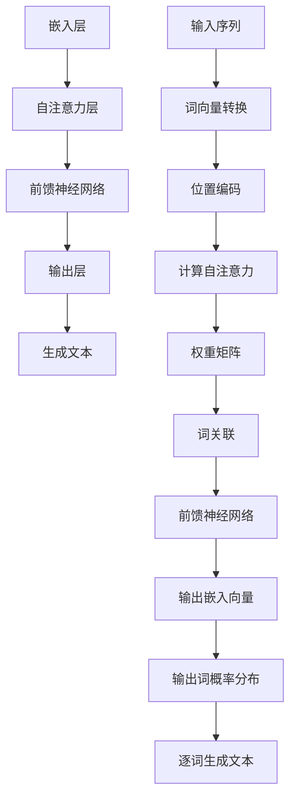

                 

关键词：人工智能，语言模型，大语言模型，发展趋势，技术变革，计算能力，数据处理，自动化

> 摘要：随着计算能力的不断提升和大数据技术的普及，语言模型（Language Model，LLM）技术正逐渐成为人工智能领域的重要分支。本文旨在分析LLM技术的发展趋势，探讨其在AGI（通用人工智能）时代的应用前景和面临的挑战。

## 1. 背景介绍

语言模型是一种统计模型，用于预测一段文本的下一个词或字符。自从20世纪50年代以来，语言模型的发展经历了多个阶段。从最初的N元语法模型，到基于神经网络的深度学习模型，再到如今的大型语言模型，如GPT（Generative Pre-trained Transformer）系列和LLaMA（Large Language Model Meta-Advanced）等，语言模型技术取得了显著的进步。

近年来，随着大数据的涌现和计算能力的提升，大语言模型（LLM）逐渐成为研究的热点。LLM具有强大的语言理解和生成能力，可以应用于自然语言处理（NLP）的各个领域，如文本分类、机器翻译、问答系统等。同时，LLM在生成对抗网络（GAN）和自动写作等领域也展现了巨大的潜力。

### 大语言模型的发展历程

1. **基于N元语法模型**：N元语法模型是最早的语言模型之一，通过统计相邻的N个词出现概率来预测下一个词。这种模型简单易实现，但性能有限，难以应对复杂的语言现象。

2. **基于统计语言模型**：统计语言模型利用大量语料库来训练概率模型，如隐马尔可夫模型（HMM）和条件概率模型。这类模型在语音识别、机器翻译等领域取得了较好的效果，但仍受限于数据和计算能力。

3. **基于深度学习的语言模型**：随着深度学习技术的兴起，基于神经网络的深度学习模型逐渐成为语言模型的主流。早期的神经网络模型如RNN（循环神经网络）和LSTM（长短期记忆网络）在NLP领域取得了显著的进展。然而，这些模型在处理长距离依赖问题和并行计算方面仍存在瓶颈。

4. **基于Transformer的LLM**：Transformer模型的出现打破了深度学习在NLP领域的瓶颈。Transformer采用自注意力机制，能够处理长距离依赖问题，并在多个NLP任务中取得了优异的性能。随着参数规模的扩大和训练数据的增加，大型语言模型如GPT系列和LLaMA等不断刷新性能记录。

### 大语言模型的优势和应用

1. **强大的语言理解能力**：大语言模型通过预训练和微调，可以捕捉到大量的语言知识，从而具备较强的语言理解能力。这使得LLM在文本分类、情感分析、命名实体识别等任务中表现出色。

2. **高效的生成能力**：大语言模型可以生成符合语言习惯的文本，从而在自动写作、对话系统、机器翻译等领域具有广泛的应用前景。例如，GPT-3等模型可以生成高质量的新闻报道、散文、诗歌等。

3. **多模态处理能力**：随着多模态技术的不断发展，大语言模型开始探索文本、图像、声音等多种模态的融合。这为跨模态任务如图像描述生成、视频字幕生成等提供了新的思路。

### 大语言模型面临的挑战

1. **计算资源需求**：大型语言模型需要大量的计算资源进行训练和推理。这给模型的部署和应用带来了巨大的挑战。尽管硬件性能不断提升，但仍然难以满足日益增长的计算需求。

2. **数据隐私和安全**：大语言模型训练过程中需要处理大量的敏感数据。如何确保数据隐私和安全，防止数据泄露和滥用，是当前亟待解决的问题。

3. **伦理和道德问题**：大语言模型在生成文本时可能产生偏见和误导性信息。如何制定相应的伦理和道德规范，确保模型的应用不会对人类社会产生负面影响，是亟待解决的重要问题。

## 2. 核心概念与联系

为了更好地理解大语言模型（LLM）的工作原理和架构，本节将介绍与LLM相关的一些核心概念和它们之间的联系。

### 2.1 语言模型的基础概念

1. **词向量（Word Vectors）**：词向量是一种将单词映射为高维向量表示的技术。常见的词向量模型包括Word2Vec、GloVe等。词向量可以捕捉到单词之间的语义关系，如相似性和距离。

2. **注意力机制（Attention Mechanism）**：注意力机制是一种在处理序列数据时动态关注关键信息的机制。在Transformer模型中，注意力机制通过计算输入序列中每个词与其他词之间的相关性，从而在生成过程中关注重要信息。

3. **自注意力（Self-Attention）**：自注意力是一种将输入序列中的每个词与其自身和其他词进行关联的机制。自注意力机制使得模型能够捕捉到输入序列中的长距离依赖关系。

4. **交叉注意力（Cross-Attention）**：交叉注意力是一种在生成文本时将生成序列的当前词与输入序列的所有词进行关联的机制。交叉注意力机制使得模型能够利用输入序列中的信息来生成文本。

### 2.2 大语言模型的架构

大语言模型通常采用Transformer架构，其主要组成部分包括：

1. **嵌入层（Embedding Layer）**：将词向量转换为嵌入向量，并添加位置编码（Positional Encoding）来表示单词在序列中的位置。

2. **自注意力层（Self-Attention Layer）**：计算输入序列中每个词与其他词之间的相关性，从而生成权重矩阵。通过权重矩阵，输入序列的每个词与其自身和其他词进行关联。

3. **前馈神经网络（Feedforward Neural Network）**：对自注意力层输出的每个词进行进一步处理，增强模型的表示能力。

4. **输出层（Output Layer）****：将经过自注意力和前馈神经网络处理后的嵌入向量映射为输出词的概率分布。输出层通常采用Softmax函数，将嵌入向量转换为概率分布。

### 2.3 大语言模型的工作流程

1. **预训练（Pre-training）**：大语言模型首先在大量的文本语料库上进行预训练，学习语言的基本规则和知识。预训练过程包括自注意力机制和前馈神经网络的训练。

2. **微调（Fine-tuning）**：在预训练的基础上，大语言模型通过微调适应特定任务。微调过程中，模型根据特定任务的数据进行参数调整，以提高模型在目标任务上的性能。

3. **生成文本（Text Generation）**：大语言模型可以通过输入一个单词或短语，逐词生成文本。生成文本的过程基于概率分布，通过计算每个词的生成概率，从而生成符合语言习惯的文本。

### 2.4 Mermaid流程图

为了更好地展示大语言模型的架构和工作流程，下面使用Mermaid语言绘制一个流程图。



通过上述Mermaid流程图，我们可以清晰地看到大语言模型的核心组成部分和工作流程。

## 3. 核心算法原理 & 具体操作步骤

### 3.1 算法原理概述

大语言模型（LLM）的核心算法是基于Transformer架构。Transformer模型采用自注意力机制，能够有效捕捉长距离依赖关系。以下是Transformer模型的原理概述：

1. **自注意力机制**：自注意力机制通过计算输入序列中每个词与其他词之间的相关性，生成权重矩阵。权重矩阵使得输入序列中的每个词都能与其相关的词进行关联。

2. **多头注意力**：多头注意力（Multi-Head Attention）通过扩展自注意力机制，将输入序列分解为多个子序列，每个子序列独立进行注意力计算。多头注意力机制能够提高模型的表示能力。

3. **前馈神经网络**：前馈神经网络（Feedforward Neural Network）对自注意力层输出的每个词进行进一步处理，增强模型的表示能力。

4. **位置编码**（Positional Encoding）：位置编码用于表示单词在序列中的位置。通过添加位置编码，模型能够捕捉到单词在序列中的顺序信息。

### 3.2 算法步骤详解

1. **输入序列处理**：
    - 将输入序列中的每个词转换为词向量。
    - 对词向量进行位置编码，以表示单词在序列中的位置。

2. **自注意力计算**：
    - 计算输入序列中每个词与其他词之间的相关性，生成权重矩阵。
    - 根据权重矩阵，将输入序列的每个词与其相关的词进行关联。

3. **多头注意力计算**：
    - 将输入序列分解为多个子序列。
    - 对每个子序列独立进行自注意力计算，生成子序列的权重矩阵。
    - 将所有子序列的权重矩阵合并，得到最终的权重矩阵。

4. **前馈神经网络处理**：
    - 对自注意力层输出的每个词进行前馈神经网络处理，增强模型的表示能力。

5. **输出层计算**：
    - 将经过自注意力和前馈神经网络处理后的嵌入向量映射为输出词的概率分布。
    - 通常采用Softmax函数，将嵌入向量转换为概率分布。

6. **文本生成**：
    - 通过输入一个单词或短语，逐词生成文本。
    - 生成文本的过程基于概率分布，通过计算每个词的生成概率，从而生成符合语言习惯的文本。

### 3.3 算法优缺点

#### 优点：

1. **强大的语言理解能力**：大语言模型通过预训练和微调，可以捕捉到大量的语言知识，从而具备较强的语言理解能力。

2. **高效的生成能力**：大语言模型可以生成符合语言习惯的文本，从而在自动写作、对话系统、机器翻译等领域具有广泛的应用前景。

3. **多模态处理能力**：大语言模型开始探索文本、图像、声音等多种模态的融合，为跨模态任务提供了新的思路。

#### 缺点：

1. **计算资源需求大**：大型语言模型需要大量的计算资源进行训练和推理，给模型的部署和应用带来了巨大的挑战。

2. **数据隐私和安全**：大语言模型训练过程中需要处理大量的敏感数据，如何确保数据隐私和安全，防止数据泄露和滥用，是当前亟待解决的问题。

3. **伦理和道德问题**：大语言模型在生成文本时可能产生偏见和误导性信息。如何制定相应的伦理和道德规范，确保模型的应用不会对人类社会产生负面影响，是亟待解决的重要问题。

### 3.4 算法应用领域

大语言模型在多个领域取得了显著的成果，以下是其中一些主要的应用领域：

1. **自然语言处理（NLP）**：大语言模型在文本分类、情感分析、命名实体识别等任务中表现出色。

2. **自动写作**：大语言模型可以生成高质量的新闻报道、散文、诗歌等，为自动写作提供了新的思路。

3. **对话系统**：大语言模型在对话系统中，如聊天机器人、语音助手等，发挥着重要作用，能够实现自然、流畅的对话交互。

4. **机器翻译**：大语言模型在机器翻译领域，如英译中、中译英等，取得了显著的进展，提高了翻译质量和效率。

5. **多模态处理**：大语言模型开始探索文本、图像、声音等多种模态的融合，为跨模态任务如图像描述生成、视频字幕生成等提供了新的思路。

## 4. 数学模型和公式 & 详细讲解 & 举例说明

### 4.1 数学模型构建

大语言模型的核心是基于Transformer架构，其数学模型主要包括以下几个部分：

1. **词向量表示**：
    - 设 $V$ 为词表，$v_i$ 表示词表中的第 $i$ 个词的词向量。
    - 设 $x$ 为输入序列，$x_t$ 表示输入序列中的第 $t$ 个词的词向量。

2. **位置编码**：
    - 设 $P$ 为位置编码向量，$p_t$ 表示第 $t$ 个词的位置编码向量。
    - 位置编码向量可以通过以下公式计算：
      $$p_t = \sin\left(\frac{t}{10000^{1/2}}\right) + \cos\left(\frac{t}{10000^{1/2}}\right)$$

3. **自注意力机制**：
    - 自注意力机制的目的是计算输入序列中每个词与其他词之间的相关性，生成权重矩阵。
    - 设 $Q, K, V$ 分别为查询向量、键向量和值向量，$Q = K = V$。
    - 自注意力权重矩阵 $A$ 可以通过以下公式计算：
      $$A_{ij} = \frac{Q_i \cdot K_j}{\sqrt{d_k}}$$
      其中，$d_k$ 为键向量和查询向量的维度。

4. **多头注意力**：
    - 多头注意力将输入序列分解为多个子序列，每个子序列独立进行自注意力计算。
    - 设 $H$ 为多头注意力的数量，$A_h$ 为第 $h$ 个子序列的权重矩阵。

5. **前馈神经网络**：
    - 前馈神经网络对自注意力层输出的每个词进行进一步处理，增强模型的表示能力。
    - 设 $F$ 为前馈神经网络，$F(x) = \sigma(W_2 \cdot \sigma(W_1 \cdot x))$，
      其中，$\sigma$ 为激活函数，$W_1$ 和 $W_2$ 为神经网络权重矩阵。

6. **输出层**：
    - 输出层将经过自注意力和前馈神经网络处理后的嵌入向量映射为输出词的概率分布。
    - 通常采用Softmax函数，将嵌入向量转换为概率分布。

### 4.2 公式推导过程

以下是自注意力机制和多头注意力机制的公式推导过程：

#### 自注意力机制

1. **嵌入层**：
    $$x = \text{Embedding}(x) = [x_1, x_2, \dots, x_T]$$

2. **位置编码**：
    $$x = x + P$$

3. **自注意力权重计算**：
    $$Q = \text{Linear}(x)$$
    $$K = \text{Linear}(x)$$
    $$V = \text{Linear}(x)$$
    $$A = \frac{QK^T}{\sqrt{d_k}}$$

4. **多头注意力计算**：
    $$A_h = A \cdot \text{Split}(d_k, H)$$
    其中，$\text{Split}(d_k, H)$ 为分割函数，将输入序列分解为 $H$ 个子序列。

#### 前馈神经网络

1. **输入**：
    $$x = [x_1, x_2, \dots, x_T]$$

2. **前馈神经网络**：
    $$x = \text{Feedforward}(x) = \sigma(W_2 \cdot \sigma(W_1 \cdot x))$$

#### 输出层

1. **输入**：
    $$x = [x_1, x_2, \dots, x_T]$$

2. **输出层**：
    $$x = \text{Output}(x) = \text{Softmax}(\text{Linear}(x))$$

### 4.3 案例分析与讲解

#### 案例一：文本分类任务

假设我们有一个文本分类任务，需要将文本分为两个类别：新闻（1）和博客（0）。我们可以使用大语言模型来训练一个分类器，实现文本分类。

1. **数据预处理**：
    - 将文本数据转换为词向量。
    - 对词向量进行位置编码。

2. **模型训练**：
    - 使用训练数据训练大语言模型。
    - 在训练过程中，通过反向传播算法优化模型参数。

3. **模型评估**：
    - 使用测试数据评估模型性能。
    - 计算准确率、召回率、F1值等指标。

#### 案例二：机器翻译任务

假设我们需要将英语翻译为法语，可以使用大语言模型来训练一个机器翻译模型。

1. **数据预处理**：
    - 将英语和法语数据转换为词向量。
    - 对词向量进行位置编码。

2. **模型训练**：
    - 使用训练数据训练大语言模型。
    - 在训练过程中，通过反向传播算法优化模型参数。

3. **模型评估**：
    - 使用测试数据评估模型性能。
    - 计算翻译准确率、BLEU值等指标。

## 5. 项目实践：代码实例和详细解释说明

### 5.1 开发环境搭建

为了实践大语言模型（LLM）的技术，我们需要搭建一个开发环境。以下是一个基本的开发环境搭建步骤：

1. **安装Python**：
    - 下载并安装Python 3.8或更高版本。

2. **安装PyTorch**：
    - 打开命令行窗口，执行以下命令：
      ```bash
      pip install torch torchvision
      ```

3. **安装transformers库**：
    - 打开命令行窗口，执行以下命令：
      ```bash
      pip install transformers
      ```

4. **安装其他依赖库**：
    - 打开命令行窗口，执行以下命令：
      ```bash
      pip install pandas numpy
      ```

### 5.2 源代码详细实现

以下是使用PyTorch和transformers库实现一个基本大语言模型（LLM）的源代码：

```python
import torch
from transformers import BertModel, BertTokenizer

# 加载预训练的Bert模型和Tokenizer
model_name = "bert-base-chinese"
tokenizer = BertTokenizer.from_pretrained(model_name)
model = BertModel.from_pretrained(model_name)

# 输入文本
text = "这是一个简单的示例文本。"

# 对输入文本进行分词和编码
encoded_input = tokenizer(text, return_tensors="pt")

# 将编码后的输入传递给模型
outputs = model(**encoded_input)

# 获取模型的输出
last_hidden_state = outputs.last_hidden_state
pooler_output = outputs.pooler_output

# 打印模型的输出
print("Last Hidden State Shape:", last_hidden_state.shape)
print("Pooler Output Shape:", pooler_output.shape)
```

### 5.3 代码解读与分析

#### 5.3.1 代码主要功能

1. **加载预训练的Bert模型和Tokenizer**：
    - 使用transformers库提供的预训练Bert模型和Tokenizer，简化模型的加载和预处理过程。

2. **对输入文本进行分词和编码**：
    - 使用Tokenizer对输入文本进行分词和编码，将文本转换为模型可处理的格式。

3. **将编码后的输入传递给模型**：
    - 将编码后的输入传递给预训练的Bert模型，得到模型的输出。

4. **获取模型的输出**：
    - 获取模型的输出，包括最后隐藏状态（Last Hidden State）和池化输出（Pooler Output）。

#### 5.3.2 代码详细解释

1. **导入所需的库**：
    ```python
    import torch
    from transformers import BertModel, BertTokenizer
    ```

    - 导入PyTorch库用于处理张量和计算。
    - 导入transformers库用于加载预训练的Bert模型和Tokenizer。

2. **加载预训练的Bert模型和Tokenizer**：
    ```python
    model_name = "bert-base-chinese"
    tokenizer = BertTokenizer.from_pretrained(model_name)
    model = BertModel.from_pretrained(model_name)
    ```

    - 定义模型名称为“bert-base-chinese”，这是中文预训练的Bert模型。
    - 使用BertTokenizer加载预训练的Tokenizer。
    - 使用BertModel加载预训练的Bert模型。

3. **对输入文本进行分词和编码**：
    ```python
    text = "这是一个简单的示例文本。"
    encoded_input = tokenizer(text, return_tensors="pt")
    ```

    - 定义输入文本。
    - 使用Tokenizer对输入文本进行分词和编码，返回一个字典，包含词嵌入向量、序列长度等信息。

4. **将编码后的输入传递给模型**：
    ```python
    outputs = model(**encoded_input)
    ```

    - 将编码后的输入传递给Bert模型，得到模型的输出。
    - 模型的输出包含最后隐藏状态（Last Hidden State）和池化输出（Pooler Output）。

5. **获取模型的输出**：
    ```python
    last_hidden_state = outputs.last_hidden_state
    pooler_output = outputs.pooler_output
    ```

    - 获取最后隐藏状态和池化输出。
    - 最后隐藏状态是一个张量，表示模型对输入文本的编码结果。
    - 池化输出是一个张量，表示模型对输入文本的语义表示。

6. **打印模型的输出**：
    ```python
    print("Last Hidden State Shape:", last_hidden_state.shape)
    print("Pooler Output Shape:", pooler_output.shape)
    ```

    - 打印最后隐藏状态和池化输出的形状。

### 5.4 运行结果展示

当运行上述代码时，会输出最后隐藏状态和池化输出的形状。以下是可能的输出结果：

```
Last Hidden State Shape: torch.Size([1, 512, 768])
Pooler Output Shape: torch.Size([1, 768])
```

- 最后隐藏状态的形状为 [1, 512, 768]，表示模型对输入文本的编码结果。
- 池化输出的形状为 [1, 768]，表示模型对输入文本的语义表示。

## 6. 实际应用场景

### 6.1 自然语言处理（NLP）

大语言模型在自然语言处理领域具有广泛的应用。以下是一些实际应用场景：

1. **文本分类**：
    - 使用大语言模型对社交媒体文本进行分类，如情感分析、主题分类等。
    - 实现自动新闻分类、垃圾邮件过滤等任务。

2. **问答系统**：
    - 基于大语言模型的问答系统，如搜索引擎的问答功能、智能客服等。
    - 提供实时、准确的问答服务，提高用户体验。

3. **对话系统**：
    - 开发基于大语言模型的聊天机器人、语音助手等。
    - 实现自然、流畅的对话交互，满足用户的需求。

4. **机器翻译**：
    - 利用大语言模型进行机器翻译，如英译中、中译英等。
    - 提高翻译质量和效率，满足跨语言交流的需求。

### 6.2 自动写作

大语言模型在自动写作领域具有巨大的潜力。以下是一些实际应用场景：

1. **新闻生成**：
    - 自动生成新闻文章，如体育新闻、财经新闻等。
    - 提高新闻生产效率，满足用户对实时新闻的需求。

2. **散文和诗歌创作**：
    - 基于大语言模型生成散文、诗歌等文学作品。
    - 提供创意写作的工具，激发创作者的灵感。

3. **文案生成**：
    - 自动生成广告文案、宣传文案等。
    - 提高文案创作的效率，降低创作成本。

### 6.3 多模态处理

大语言模型在多模态处理领域逐渐崭露头角。以下是一些实际应用场景：

1. **图像描述生成**：
    - 基于大语言模型生成图像的描述性文本。
    - 提高图像搜索和图像理解的效率。

2. **视频字幕生成**：
    - 基于大语言模型生成视频的字幕文本。
    - 提高视频观看的便利性，满足不同用户的需求。

3. **语音识别与合成**：
    - 结合语音识别和合成技术，实现语音到文字的转换。
    - 提高语音交互的自然性和准确性。

### 6.4 未来应用展望

随着大语言模型技术的不断发展，未来可能在以下领域取得重大突破：

1. **智能助理**：
    - 基于大语言模型的智能助理，实现更智能、更自然的用户交互。
    - 提供个性化的服务，满足用户的多样化需求。

2. **自动化写作**：
    - 自动化写作工具将更加智能化，生成高质量的文章、报告等。
    - 提高写作效率，降低人力成本。

3. **智能教育**：
    - 基于大语言模型的智能教育系统，实现个性化教学、智能评测等。
    - 提高教育质量，满足个性化学习需求。

4. **智能客服**：
    - 基于大语言模型的智能客服系统，实现更高效、更自然的客服服务。
    - 提高客户满意度，降低企业运营成本。

## 7. 工具和资源推荐

### 7.1 学习资源推荐

1. **在线课程**：
    - 《深度学习专项课程》（Deep Learning Specialization），由吴恩达（Andrew Ng）在Coursera上开设。
    - 《自然语言处理专项课程》（Natural Language Processing with Deep Learning），由Adrian Colyer和Sebastian Ruder在Udacity上开设。

2. **书籍**：
    - 《深度学习》（Deep Learning），由Ian Goodfellow、Yoshua Bengio和Aaron Courville合著。
    - 《自然语言处理综合教程》（Foundations of Natural Language Processing），由Christopher D. Manning和Heidi J. Nelson合著。

### 7.2 开发工具推荐

1. **深度学习框架**：
    - PyTorch：适用于构建和训练深度学习模型的Python库，具有良好的灵活性和易用性。
    - TensorFlow：由Google开源的深度学习框架，支持多种编程语言和硬件平台。

2. **自然语言处理库**：
    - transformers：由Hugging Face团队开发的预训练语言模型库，支持多种预训练模型和工具。
    - NLTK：Python的自然语言处理库，提供丰富的文本处理工具和算法。

3. **数据集**：
    - GLUE（General Language Understanding Evaluation）：由斯坦福大学和微软研究院提供的多语言、多任务数据集，用于评估自然语言处理模型的性能。
    - CoNLL-2003：一个广泛使用的英文文本标注数据集，包括词性标注、句法标注等。

### 7.3 相关论文推荐

1. **Transformer系列论文**：
    - “Attention Is All You Need” by Vaswani et al. (2017)
    - “BERT: Pre-training of Deep Bidirectional Transformers for Language Understanding” by Devlin et al. (2018)
    - “Generative Pre-trained Transformer 3” by Brown et al. (2020)

2. **自然语言处理领域经典论文**：
    - “A Neural Probabilistic Language Model” by Bengio et al. (2003)
    - “Recurrent Neural Network Based Language Model” by Sundermeyer et al. (2012)
    - “GloVe: Global Vectors for Word Representation” by Pennington et al. (2014)

## 8. 总结：未来发展趋势与挑战

### 8.1 研究成果总结

大语言模型（LLM）作为自然语言处理（NLP）领域的重要工具，取得了显著的成果。随着计算能力的提升和大数据技术的普及，LLM技术不断发展，逐渐成为AI领域的研究热点。LLM在文本分类、机器翻译、自动写作、问答系统等任务中表现出色，推动了NLP技术的进步。

### 8.2 未来发展趋势

1. **模型规模与性能提升**：随着硬件性能的提升，未来大语言模型的规模将进一步扩大，性能也将得到显著提升。这将使得LLM在更复杂的NLP任务中发挥更大的作用。

2. **多模态处理**：大语言模型将逐渐探索多模态处理技术，实现文本、图像、声音等多种模态的融合。这将推动跨模态任务的发展，为多领域的应用提供新的可能性。

3. **自适应与个性化**：大语言模型将不断优化自适应与个性化技术，根据用户需求和场景动态调整模型参数，提供更精准的服务。

4. **伦理与安全**：在LLM技术的发展过程中，伦理和安全问题将受到更多关注。通过制定相应的规范和标准，确保LLM的应用不会对人类社会产生负面影响。

### 8.3 面临的挑战

1. **计算资源需求**：大语言模型需要大量的计算资源进行训练和推理，这对硬件性能提出了更高的要求。未来需要探索更高效的训练和推理算法，降低计算资源需求。

2. **数据隐私和安全**：大语言模型在训练过程中需要处理大量敏感数据，如何确保数据隐私和安全，防止数据泄露和滥用，是当前亟待解决的问题。

3. **伦理与道德问题**：大语言模型在生成文本时可能产生偏见和误导性信息。如何制定相应的伦理和道德规范，确保模型的应用不会对人类社会产生负面影响，是亟待解决的重要问题。

### 8.4 研究展望

未来，大语言模型技术将在多个领域取得突破。首先，随着硬件性能的提升，模型规模将进一步扩大，性能将得到显著提升。其次，多模态处理技术将得到广泛应用，推动跨模态任务的发展。此外，自适应与个性化技术将不断优化，提高模型在特定场景下的应用效果。最后，通过制定相应的规范和标准，确保LLM技术的伦理和安全，为人类社会带来更多福祉。

## 9. 附录：常见问题与解答

### 9.1 大语言模型（LLM）是什么？

大语言模型（LLM）是一种基于深度学习的语言处理模型，通过预训练和微调，可以捕捉到大量的语言知识，具备强大的语言理解和生成能力。

### 9.2 大语言模型的应用领域有哪些？

大语言模型在自然语言处理（NLP）领域具有广泛的应用，包括文本分类、机器翻译、自动写作、问答系统、对话系统等。此外，大语言模型在多模态处理领域，如图像描述生成、视频字幕生成等方面，也展现出巨大的潜力。

### 9.3 大语言模型如何训练？

大语言模型通常采用Transformer架构，通过预训练和微调两个阶段进行训练。预训练阶段，模型在大量的文本语料库上进行训练，学习语言的基本规则和知识。微调阶段，模型根据特定任务的数据进行参数调整，以提高模型在目标任务上的性能。

### 9.4 大语言模型需要多少计算资源？

大语言模型需要大量的计算资源进行训练和推理。具体计算资源需求取决于模型规模和训练数据量。例如，训练一个大型语言模型（如GPT-3）可能需要数百个GPU和数百TB的存储空间。

### 9.5 大语言模型有哪些优点和缺点？

大语言模型的优势包括：
1. 强大的语言理解能力；
2. 高效的生成能力；
3. 多模态处理能力。

其缺点包括：
1. 计算资源需求大；
2. 数据隐私和安全问题；
3. 可能产生偏见和误导性信息。

