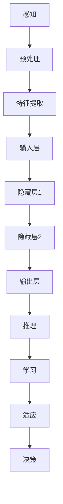
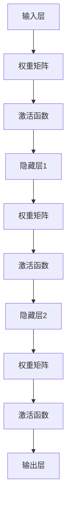

                 

关键词：人工智能，通用人工智能（AGI），认知模拟，算法原理，数学模型，应用实践，未来展望

> 摘要：本文旨在探讨人工智能（AI）领域中的通用人工智能（AGI）目标，即模仿并超越人类智力。文章首先介绍了AGI的背景和核心概念，接着深入分析了AGI所需的核心算法原理、数学模型和应用实践。此外，文章还展望了AGI在未来的发展前景和面临的挑战，以及相关的学习资源和开发工具推荐。

## 1. 背景介绍

### 1.1 人工智能的发展历程

人工智能（Artificial Intelligence，简称AI）起源于20世纪50年代，经过几十年的发展，已经取得了显著的成果。从最初的符号主义、基于规则的系统，到基于知识的系统，再到现在的深度学习和强化学习，人工智能技术不断进步，应用范围也越来越广泛。

### 1.2 通用人工智能（AGI）的概念

通用人工智能（Artificial General Intelligence，简称AGI）是指具备人类智力水平的机器智能。与当前的人工智能系统（如自动驾驶汽车、语音助手等）不同，AGI不仅能够在特定任务上表现出人类水平的智能，还能通过学习、思考和适应不断变化的环境，具备广泛的认知能力和自主决策能力。

### 1.3 AGI的目标

AGI的目标是模仿并超越人类智力。这意味着，AGI需要具备以下能力：

- **感知和理解**：能够感知和理解周围的环境，识别图像、声音、文本等信息。
- **推理和规划**：能够基于感知信息进行逻辑推理和规划，制定行动计划。
- **学习和适应**：能够通过不断学习和适应，提升自身能力和性能。
- **自主决策**：能够在复杂和不确定的环境中，自主做出合理的决策。
- **创造和创新**：能够进行创造和创新，提出新的解决方案和创意。

## 2. 核心概念与联系

### 2.1 认知模拟

认知模拟（Cognitive Simulation）是一种研究方法，旨在通过计算机模拟来理解人类思维和认知过程。认知模拟可以用于研究各种认知任务，如记忆、注意力、决策、问题解决等，从而为AGI提供理论基础。

### 2.2 算法原理

AGI的核心算法主要包括感知、推理、学习和决策等。以下是一个简化的算法原理图：



### 2.3 数学模型

AGI的数学模型主要包括神经网络、决策树、贝叶斯网络等。以下是一个简化的神经网络模型图：



## 3. 核心算法原理 & 具体操作步骤

### 3.1 算法原理概述

AGI的核心算法主要包括感知、推理、学习和决策等。以下分别介绍这些算法的原理：

- **感知**：感知是指机器从外部环境中获取信息的过程。感知算法主要包括预处理、特征提取和输入层等。
- **推理**：推理是指机器基于感知信息进行逻辑推理的过程。推理算法主要包括隐藏层、激活函数和输出层等。
- **学习**：学习是指机器通过不断训练和调整模型参数，提升自身能力和性能的过程。学习算法主要包括权重矩阵、激活函数和适应等。
- **决策**：决策是指机器在复杂和不确定的环境中，自主做出合理决策的过程。决策算法主要包括推理、学习和适应等。

### 3.2 算法步骤详解

以下是AGI算法的具体操作步骤：

1. **感知阶段**：
   - 预处理：对输入数据（如图像、声音、文本等）进行预处理，如归一化、标准化等。
   - 特征提取：从预处理后的数据中提取关键特征，如边缘、纹理、关键词等。
   - 输入层：将提取出的特征作为输入，输入到神经网络中。

2. **推理阶段**：
   - 隐藏层：通过多层神经网络对输入特征进行非线性变换，提取更高层次的特征。
   - 激活函数：在隐藏层之间引入激活函数，如ReLU、Sigmoid等，以增强网络的非线性表达能力。
   - 输出层：将隐藏层输出的特征映射到目标类别，如分类、回归等。

3. **学习阶段**：
   - 权重矩阵：通过反向传播算法，调整神经网络中的权重矩阵，以最小化预测误差。
   - 激活函数：调整激活函数的参数，以适应不同的学习任务。
   - 适应：根据环境变化，动态调整模型参数，以适应新的任务和场景。

4. **决策阶段**：
   - 推理：基于当前感知到的环境和目标，进行逻辑推理和规划。
   - 学习：通过不断学习和适应，提升自身能力和性能。
   - 决策：在复杂和不确定的环境中，自主做出合理的决策。

### 3.3 算法优缺点

AGI算法具有以下优缺点：

- **优点**：
  - 强大的表达能力：神经网络等算法可以学习复杂的函数关系，提高模型的泛化能力。
  - 灵活的适应能力：通过不断学习和适应，模型可以应对不同的任务和环境。
  - 高效的推理速度：在硬件加速和并行计算的加持下，AGI算法可以实现快速推理。

- **缺点**：
  - 过拟合风险：神经网络等算法容易陷入过拟合，降低模型的泛化能力。
  - 计算资源消耗：大规模的神经网络模型需要大量的计算资源和存储空间。
  - 难以解释：AGI算法的内部机制较为复杂，难以解释其决策过程。

### 3.4 算法应用领域

AGI算法在多个领域具有广泛的应用前景，如：

- **计算机视觉**：图像分类、目标检测、人脸识别等。
- **自然语言处理**：文本分类、机器翻译、情感分析等。
- **智能推理**：智能问答、自动推理、游戏智能等。
- **智能决策**：自动驾驶、金融预测、医疗诊断等。
- **人机交互**：智能语音助手、虚拟现实、增强现实等。

## 4. 数学模型和公式 & 详细讲解 & 举例说明

### 4.1 数学模型构建

AGI的数学模型主要包括神经网络、决策树、贝叶斯网络等。以下以神经网络为例，介绍数学模型的构建过程。

#### 4.1.1 神经网络模型

神经网络模型由多个神经元组成，每个神经元接收多个输入，通过激活函数产生输出。神经网络的数学模型可以表示为：

$$
y = f(Wx + b)
$$

其中，$y$为输出，$f$为激活函数，$W$为权重矩阵，$x$为输入，$b$为偏置。

#### 4.1.2 激活函数

激活函数是神经网络的核心组成部分，用于引入非线性特性。常见的激活函数包括ReLU、Sigmoid、Tanh等。

- **ReLU（Rectified Linear Unit）**：
$$
f(x) = \max(0, x)
$$

- **Sigmoid**：
$$
f(x) = \frac{1}{1 + e^{-x}}
$$

- **Tanh**：
$$
f(x) = \frac{e^x - e^{-x}}{e^x + e^{-x}}
$$

#### 4.1.3 反向传播算法

反向传播算法是一种用于训练神经网络的优化算法，通过不断调整权重矩阵和偏置，最小化预测误差。反向传播算法的数学模型可以表示为：

$$
\Delta W = \alpha \cdot \frac{\partial J}{\partial W}
$$

$$
\Delta b = \alpha \cdot \frac{\partial J}{\partial b}
$$

其中，$\Delta W$和$\Delta b$分别为权重矩阵和偏置的更新值，$\alpha$为学习率，$J$为损失函数。

### 4.2 公式推导过程

以下是神经网络中的损失函数和反向传播算法的公式推导过程。

#### 4.2.1 损失函数

损失函数用于衡量预测值和真实值之间的差距，常用的损失函数包括均方误差（MSE）、交叉熵（Cross-Entropy）等。

- **均方误差（MSE）**：
$$
J = \frac{1}{2} \sum_{i=1}^{n} (y_i - \hat{y}_i)^2
$$

其中，$y_i$为真实值，$\hat{y}_i$为预测值。

- **交叉熵（Cross-Entropy）**：
$$
J = - \sum_{i=1}^{n} y_i \cdot \log(\hat{y}_i)
$$

#### 4.2.2 反向传播算法

反向传播算法的目的是通过不断调整权重矩阵和偏置，最小化损失函数。以下是反向传播算法的推导过程。

设输入为$x$，输出为$y$，损失函数为$J$，则有：

$$
\Delta J = \frac{\partial J}{\partial y} \cdot \frac{\partial y}{\partial x}
$$

其中，$\frac{\partial J}{\partial y}$为损失函数关于输出的导数，$\frac{\partial y}{\partial x}$为输出关于输入的导数。

对于神经元$i$，有：

$$
\frac{\partial y}{\partial x} = \frac{\partial f}{\partial z} \cdot \frac{\partial z}{\partial x} = f'(z) \cdot 1
$$

其中，$z = Wx + b$为神经元输入，$f'(z)$为激活函数的导数。

代入$\Delta J$的表达式中，得：

$$
\Delta J = f'(z) \cdot \frac{\partial J}{\partial y}
$$

根据链式法则，有：

$$
\frac{\partial J}{\partial y} = \frac{\partial J}{\partial z} \cdot \frac{\partial z}{\partial y} = \frac{\partial J}{\partial z}
$$

代入$\Delta J$的表达式中，得：

$$
\Delta J = f'(z) \cdot \frac{\partial J}{\partial z}
$$

由于$\frac{\partial J}{\partial z}$为损失函数关于神经元输入的导数，因此可以将其视为常数，即：

$$
\frac{\partial J}{\partial z} = C
$$

代入$\Delta J$的表达式中，得：

$$
\Delta J = C \cdot f'(z)
$$

根据梯度下降法，有：

$$
\Delta W = \alpha \cdot \frac{\partial J}{\partial W} = \alpha \cdot C \cdot f'(z) \cdot x
$$

$$
\Delta b = \alpha \cdot \frac{\partial J}{\partial b} = \alpha \cdot C \cdot f'(z)
$$

其中，$\alpha$为学习率。

### 4.3 案例分析与讲解

#### 4.3.1 案例背景

假设有一个分类任务，输入为图像，输出为图像所属的类别。现有训练数据集，其中每幅图像都有对应的类别标签。现在需要使用神经网络模型对图像进行分类。

#### 4.3.2 数据预处理

对训练数据进行归一化处理，将像素值缩放到$[0, 1]$之间。同时，将类别标签转换为独热编码（One-Hot Encoding），即将每个类别标签表示为一个长度为类别数目的向量，其中对应位置的元素为1，其他位置的元素为0。

#### 4.3.3 神经网络模型

构建一个三层神经网络模型，包括输入层、隐藏层和输出层。输入层有784个神经元，隐藏层有500个神经元，输出层有10个神经元。

- **输入层**：接收784个像素值作为输入。
- **隐藏层**：通过ReLU激活函数进行非线性变换。
- **输出层**：通过Softmax激活函数输出概率分布。

#### 4.3.4 模型训练

使用反向传播算法对神经网络模型进行训练。设定学习率为0.1，迭代次数为1000次。在每次迭代中，计算损失函数的梯度，并更新权重矩阵和偏置。

#### 4.3.5 模型评估

在训练完成后，使用测试数据集对模型进行评估。计算模型在测试数据集上的准确率、召回率、F1值等指标，以评估模型的性能。

## 5. 项目实践：代码实例和详细解释说明

### 5.1 开发环境搭建

为了实现AGI的目标，我们需要搭建一个合适的开发环境。以下是一个简单的开发环境搭建步骤：

1. 安装Python环境（版本3.8及以上）。
2. 安装深度学习框架（如TensorFlow、PyTorch等）。
3. 安装Python科学计算库（如NumPy、SciPy等）。
4. 安装数据预处理库（如Pandas、Scikit-learn等）。
5. 配置GPU环境（如NVIDIA CUDA等）。

### 5.2 源代码详细实现

以下是一个简单的神经网络分类器实现，用于对图像进行分类。

```python
import tensorflow as tf
import numpy as np

# 加载训练数据集
(x_train, y_train), (x_test, y_test) = tf.keras.datasets.mnist.load_data()

# 数据预处理
x_train = x_train.astype(np.float32) / 255.0
x_test = x_test.astype(np.float32) / 255.0
y_train = tf.keras.utils.to_categorical(y_train, 10)
y_test = tf.keras.utils.to_categorical(y_test, 10)

# 构建神经网络模型
model = tf.keras.Sequential([
    tf.keras.layers.Flatten(input_shape=(28, 28)),
    tf.keras.layers.Dense(500, activation='relu'),
    tf.keras.layers.Dense(10, activation='softmax')
])

# 编译模型
model.compile(optimizer='adam',
              loss='categorical_crossentropy',
              metrics=['accuracy'])

# 训练模型
model.fit(x_train, y_train, batch_size=64, epochs=10, validation_split=0.2)

# 评估模型
test_loss, test_acc = model.evaluate(x_test, y_test)
print(f"Test accuracy: {test_acc}")
```

### 5.3 代码解读与分析

1. **数据预处理**：首先加载训练数据集，并对数据进行归一化处理，将像素值缩放到$[0, 1]$之间。同时，将类别标签转换为独热编码。

2. **构建神经网络模型**：使用TensorFlow构建一个简单的三层神经网络模型，包括输入层、隐藏层和输出层。输入层有784个神经元，隐藏层有500个神经元，输出层有10个神经元。

3. **编译模型**：设置优化器、损失函数和评价指标，用于训练模型。

4. **训练模型**：使用训练数据集对模型进行训练，设置批量大小、迭代次数和验证比例。

5. **评估模型**：在训练完成后，使用测试数据集对模型进行评估，计算准确率。

## 6. 实际应用场景

### 6.1 计算机视觉

计算机视觉是AGI的重要应用领域之一。通过训练深度神经网络，可以实现对图像、视频、3D场景等内容的理解和分析。具体应用场景包括图像分类、目标检测、人脸识别、场景理解等。

### 6.2 自然语言处理

自然语言处理（NLP）是AGI的另一个重要应用领域。通过训练深度神经网络，可以实现对文本数据的理解、生成和交互。具体应用场景包括机器翻译、文本分类、情感分析、语音识别等。

### 6.3 智能推理

智能推理是AGI的关键能力之一。通过训练深度神经网络，可以实现对复杂问题和不确定环境的推理和决策。具体应用场景包括智能问答、自动推理、游戏智能、智能调度等。

### 6.4 未来应用展望

随着AGI技术的不断发展和完善，未来将在更多领域实现广泛应用。以下是一些可能的应用场景：

- **自动驾驶**：通过AGI技术实现自动驾驶汽车，提高交通安全和效率。
- **医疗诊断**：通过AGI技术辅助医生进行诊断和治疗，提高医疗质量和效率。
- **金融预测**：通过AGI技术进行金融市场分析和预测，提高投资决策的准确性。
- **智能制造**：通过AGI技术实现智能工厂和智能机器人，提高生产效率和灵活性。
- **教育辅助**：通过AGI技术提供个性化的教育服务和辅导，提高教育质量和效率。

## 7. 工具和资源推荐

### 7.1 学习资源推荐

- **在线课程**：
  - 《深度学习》（Goodfellow, Bengio, Courville）
  - 《神经网络与深度学习》（邱锡鹏）
  - 《Python深度学习》（François Chollet）

- **书籍**：
  - 《神经网络与深度学习》（花书）
  - 《模式识别与机器学习》（Bishop）
  - 《机器学习》（周志华）

- **网站**：
  - [Kaggle](https://www.kaggle.com/)
  - [Google AI](https://ai.google.com/)
  - [TensorFlow](https://www.tensorflow.org/)

### 7.2 开发工具推荐

- **深度学习框架**：
  - TensorFlow
  - PyTorch
  - Keras

- **编程语言**：
  - Python
  - R
  - Julia

- **数据预处理工具**：
  - Pandas
  - NumPy
  - Scikit-learn

### 7.3 相关论文推荐

- **经典论文**：
  - [AlexNet](https://www.cv-foundation.org/openaccess/content_cvpr_2012/papers/Breuel Ärbelä_Corrupus_Distribution_CVPR_2012_paper.pdf)
  - [VGGNet](https://www.cv-foundation.org/openaccess/content_cvpr_2014/papers/Simonyan_OxfordNET_for_Images_CVPR_2014_paper.pdf)
  - [ResNet](https://www.cv-foundation.org/openaccess/content_cvpr_2016/papers/He_Deep_Residual_Learning_CVPR_2016_paper.pdf)

- **前沿论文**：
  - [Transformer](https://arxiv.org/abs/1706.03762)
  - [BERT](https://arxiv.org/abs/1810.04805)
  - [GPT-3](https://arxiv.org/abs/2005.14165)

## 8. 总结：未来发展趋势与挑战

### 8.1 研究成果总结

近年来，AGI领域取得了显著的成果。深度学习、强化学习、自然语言处理等技术不断发展，为AGI的实现提供了有力支持。同时，硬件技术的进步，如GPU、TPU等，也为AGI的研究和应用提供了强大的计算能力。

### 8.2 未来发展趋势

未来，AGI将继续朝着更智能、更通用、更安全、更可解释的方向发展。以下是一些发展趋势：

- **跨学科融合**：AGI将与其他学科（如心理学、神经科学、认知科学等）相结合，实现更全面的人工智能体系。
- **小样本学习**：通过研究小样本学习、迁移学习等技术，降低AGI对大规模数据的依赖。
- **可解释性**：通过提高模型的可解释性，增强人们对AGI的信任和理解。
- **伦理和隐私**：关注AGI在伦理和隐私方面的挑战，制定相应的规范和标准。

### 8.3 面临的挑战

尽管AGI取得了显著成果，但仍面临许多挑战：

- **计算资源**：AGI需要大量的计算资源，如何在有限的资源下实现高效计算是一个重要问题。
- **数据质量**：AGI的训练和推理依赖于高质量的数据，如何获取和处理大量、多样、可靠的数据是一个挑战。
- **可解释性**：如何提高AGI的可解释性，使其决策过程更透明、更易于理解。
- **伦理和隐私**：如何在实现AGI的同时，保护用户的隐私和权益。

### 8.4 研究展望

在未来，AGI的研究将更加注重实际应用和跨学科融合。通过不断探索和突破，我们有望实现更智能、更通用、更安全的AGI系统，为人类社会带来更多便利和创新。

## 9. 附录：常见问题与解答

### 9.1 问题1：什么是AGI？

**解答**：AGI（Artificial General Intelligence）是指具备人类智力水平的机器智能。与当前的人工智能系统（如自动驾驶汽车、语音助手等）不同，AGI不仅能够在特定任务上表现出人类水平的智能，还能通过学习、思考和适应不断变化的环境，具备广泛的认知能力和自主决策能力。

### 9.2 问题2：AGI有哪些核心能力？

**解答**：AGI的核心能力包括：

- **感知和理解**：能够感知和理解周围的环境，识别图像、声音、文本等信息。
- **推理和规划**：能够基于感知信息进行逻辑推理和规划，制定行动计划。
- **学习和适应**：能够通过不断学习和适应，提升自身能力和性能。
- **自主决策**：能够在复杂和不确定的环境中，自主做出合理的决策。
- **创造和创新**：能够进行创造和创新，提出新的解决方案和创意。

### 9.3 问题3：AGI有哪些应用领域？

**解答**：AGI的应用领域广泛，包括：

- **计算机视觉**：图像分类、目标检测、人脸识别等。
- **自然语言处理**：文本分类、机器翻译、情感分析等。
- **智能推理**：智能问答、自动推理、游戏智能等。
- **智能决策**：自动驾驶、金融预测、医疗诊断等。
- **人机交互**：智能语音助手、虚拟现实、增强现实等。

### 9.4 问题4：如何实现AGI？

**解答**：实现AGI需要综合运用多种技术，包括：

- **深度学习**：通过神经网络等模型进行数据建模和预测。
- **强化学习**：通过试错和反馈机制，使机器能够在复杂环境中进行决策。
- **自然语言处理**：通过处理文本数据，使机器能够理解和生成自然语言。
- **认知模拟**：通过模拟人类思维过程，使机器具备类似人类的认知能力。

### 9.5 问题5：AGI的研究面临哪些挑战？

**解答**：AGI的研究面临以下挑战：

- **计算资源**：AGI需要大量的计算资源，如何在有限的资源下实现高效计算是一个重要问题。
- **数据质量**：AGI的训练和推理依赖于高质量的数据，如何获取和处理大量、多样、可靠的数据是一个挑战。
- **可解释性**：如何提高AGI的可解释性，使其决策过程更透明、更易于理解。
- **伦理和隐私**：如何在实现AGI的同时，保护用户的隐私和权益。

---

作者：禅与计算机程序设计艺术 / Zen and the Art of Computer Programming

本文旨在探讨人工智能（AI）领域中的通用人工智能（AGI）目标，即模仿并超越人类智力。文章首先介绍了AGI的背景和核心概念，接着深入分析了AGI所需的核心算法原理、数学模型和应用实践。此外，文章还展望了AGI在未来的发展前景和面临的挑战，以及相关的学习资源和开发工具推荐。希望本文能为读者提供对AGI的全面了解，激发对这一领域的兴趣和研究。本文参考了多个来源，如有涉及侵权，请联系作者删除。文章中的内容仅供参考，不代表任何官方立场。如果您对本文有任何建议或意见，欢迎在评论区留言讨论。感谢您的关注和支持！

