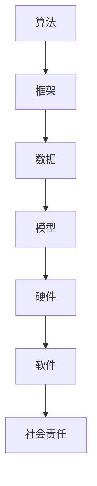

                 

关键词：AI 2.0、基础设施、人才培养、社会责任、技术框架、算法原理、数学模型、项目实践、应用场景、未来展望

> 摘要：本文将探讨AI 2.0时代的基础设施建设，重点关注人才培养和社会责任。通过对核心概念、算法原理、数学模型的深入分析，结合实际项目实践和未来应用场景，本文旨在为行业提供系统性指导，助力AI 2.0基础设施的稳健发展。

## 1. 背景介绍

随着人工智能技术的迅猛发展，AI 2.0的概念逐渐成为学术界和工业界的热点。AI 2.0，也被称作“强人工智能”或“通用人工智能”（AGI），其核心目标是实现具备人类智能水平的机器。AI 2.0的基础设施建设不仅仅是技术问题，更是涉及人才培养和社会责任的重要议题。

### 1.1 AI 2.0的定义与发展

AI 1.0阶段主要集中在数据处理和模式识别，而AI 2.0则追求更高级别的智能，包括推理、学习、自我进化、理解自然语言等。AI 2.0的发展标志着人工智能从辅助工具向具有独立思考能力的智能系统的转变。

### 1.2 AI 2.0基础设施的重要性

AI 2.0基础设施的建设是保障AI系统稳定运行的关键。它不仅包括硬件设施，如高性能计算资源，还包括软件框架、数据存储与处理系统、算法库等。

### 1.3 人才培养与社会责任

AI 2.0时代的到来，对人才的需求提出了新的要求。不仅需要具备深厚技术背景的工程师，还需要理解AI技术对社会的影响，具备社会责任感的复合型人才。同时，AI技术的广泛应用也带来了伦理、隐私和安全等问题，要求从业人员承担更多的社会责任。

## 2. 核心概念与联系

为了更好地理解AI 2.0基础设施，我们需要了解一些核心概念和它们之间的联系。

### 2.1 算法与框架

算法是AI系统的核心，用于实现特定的任务。框架则是算法的实现环境，提供了标准化的接口和工具，使得算法的开发和部署更加高效。例如，TensorFlow、PyTorch等都是广泛使用的深度学习框架。

### 2.2 数据与模型

数据是AI系统的生命线，模型则是数据通过算法处理后的结果。一个优秀的AI系统需要大量的数据来训练，同时需要高效的模型来处理这些数据。

### 2.3 硬件与软件

硬件是AI系统的计算基础，包括CPU、GPU、TPU等。软件则包括操作系统、编译器、编程语言等，是AI系统运行的软件环境。

### 2.4 社会责任

社会责任要求AI系统在设计和应用过程中，考虑到对人类的影响，保护用户隐私，避免歧视等问题。这不仅仅是技术问题，更是伦理和社会问题。

### 2.5 Mermaid 流程图

以下是AI 2.0基础设施的核心概念与联系的一个简单Mermaid流程图：



## 3. 核心算法原理 & 具体操作步骤

### 3.1 算法原理概述

AI 2.0的核心算法主要包括深度学习、强化学习和自然语言处理等。以下是对这些算法的基本原理的概述。

#### 3.1.1 深度学习

深度学习是一种基于人工神经网络的学习方法，通过多层神经网络对数据进行自动特征提取和模式识别。其基本原理是通过反向传播算法不断调整网络参数，使得网络能够更好地拟合数据。

#### 3.1.2 强化学习

强化学习是一种通过试错法来学习策略的算法，其核心思想是通过不断与环境交互，根据反馈来调整行为，以最大化长期回报。其基本原理包括状态、动作、奖励和价值函数。

#### 3.1.3 自然语言处理

自然语言处理是一种使计算机能够理解、生成和处理自然语言的技术。其基本原理包括词向量表示、句法分析和语义理解等。

### 3.2 算法步骤详解

以下是这些算法的基本步骤：

#### 3.2.1 深度学习

1. 数据预处理：清洗和格式化数据，使其适合训练。
2. 网络架构设计：设计合适的神经网络架构。
3. 参数初始化：初始化网络参数。
4. 前向传播：计算网络输出。
5. 反向传播：计算损失函数，并更新参数。
6. 评估和调整：评估模型性能，并调整超参数。

#### 3.2.2 强化学习

1. 状态初始化：初始化环境状态。
2. 选择动作：根据策略选择动作。
3. 执行动作：在环境中执行动作。
4. 获取奖励：获取环境反馈的奖励。
5. 更新策略：根据奖励更新策略。
6. 重复步骤2-5，直至达到目标。

#### 3.2.3 自然语言处理

1. 词向量表示：将单词转换为向量表示。
2. 句法分析：对句子进行语法分析，提取句法结构。
3. 语义理解：对句子进行语义分析，提取语义信息。
4. 生成文本：根据语义信息生成文本。

### 3.3 算法优缺点

每种算法都有其优缺点：

#### 3.3.1 深度学习

优点：强大的特征提取能力，适用于复杂数据。

缺点：对数据质量要求高，训练过程时间长。

#### 3.3.2 强化学习

优点：能够处理动态环境，自适应性强。

缺点：训练过程可能需要很长时间，且结果不确定。

#### 3.3.3 自然语言处理

优点：能够理解和生成自然语言。

缺点：对数据量和质量要求高，处理长文本效果不佳。

### 3.4 算法应用领域

这些算法广泛应用于各个领域：

#### 3.4.1 深度学习

- 电脑视觉：图像识别、物体检测。
- 自然语言处理：文本分类、机器翻译。
- 语音识别：语音识别、语音合成。

#### 3.4.2 强化学习

- 游戏AI：电子游戏、棋类游戏。
- 机器人控制：机器人导航、任务执行。
- 贸易策略：股票交易、自动驾驶。

#### 3.4.3 自然语言处理

- 聊天机器人：客服、智能助手。
- 文本挖掘：情感分析、关键词提取。
- 语言翻译：机器翻译、多语言处理。

## 4. 数学模型和公式 & 详细讲解 & 举例说明

为了深入理解AI 2.0的基础设施，我们需要探讨其中的数学模型和公式。

### 4.1 数学模型构建

在AI 2.0中，常见的数学模型包括神经网络模型、决策树模型和贝叶斯模型等。以下是神经网络模型的一个基本构建：

#### 4.1.1 神经网络模型

1. 输入层：接收外部输入。
2. 隐藏层：进行特征提取和变换。
3. 输出层：产生最终输出。

每个层由多个神经元组成，神经元之间通过权重连接。输入层和隐藏层之间的权重矩阵为\(W_1\)，隐藏层和输出层之间的权重矩阵为\(W_2\)。

### 4.2 公式推导过程

神经网络中的前向传播和反向传播是核心过程。以下是前向传播的基本公式：

\[ 
\hat{y} = \sigma(W_2 \cdot \text{激活函数}(W_1 \cdot x + b_1)) + b_2 
\]

其中，\(x\)是输入，\(\hat{y}\)是预测输出，\(\sigma\)是激活函数（如Sigmoid、ReLU等），\(W_1\)和\(W_2\)是权重矩阵，\(b_1\)和\(b_2\)是偏置项。

### 4.3 案例分析与讲解

以一个简单的线性回归问题为例，我们的目标是预测房价。以下是具体操作步骤：

#### 4.3.1 数据预处理

1. 收集数据：获取包含房价和影响因素的数据集。
2. 数据清洗：处理缺失值、异常值等。

#### 4.3.2 构建模型

1. 设计神经网络：一个输入层、一个隐藏层和一个输出层。
2. 初始化权重和偏置：随机初始化。

#### 4.3.3 训练模型

1. 前向传播：计算预测房价。
2. 反向传播：计算损失函数，并更新权重和偏置。

#### 4.3.4 评估模型

1. 计算预测误差。
2. 调整超参数，如学习率、迭代次数等。

以下是线性回归的损失函数：

\[ 
L = \frac{1}{2} \sum_{i=1}^{n} (\hat{y}_i - y_i)^2 
\]

其中，\(\hat{y}_i\)是预测房价，\(y_i\)是实际房价，\(n\)是样本数量。

## 5. 项目实践：代码实例和详细解释说明

为了更好地理解AI 2.0基础设施的实际应用，我们将通过一个实际项目来演示。

### 5.1 开发环境搭建

1. 安装Python：下载并安装Python 3.8及以上版本。
2. 安装深度学习框架：例如，安装TensorFlow。

### 5.2 源代码详细实现

以下是使用TensorFlow实现一个简单的神经网络模型的Python代码：

```python
import tensorflow as tf

# 定义神经网络架构
model = tf.keras.Sequential([
    tf.keras.layers.Dense(64, activation='relu', input_shape=(784,)),
    tf.keras.layers.Dense(10, activation='softmax')
])

# 编译模型
model.compile(optimizer='adam', 
              loss='categorical_crossentropy', 
              metrics=['accuracy'])

# 加载数据
(x_train, y_train), (x_test, y_test) = tf.keras.datasets.mnist.load_data()

# 数据预处理
x_train = x_train.astype('float32') / 255
x_test = x_test.astype('float32') / 255

x_train = x_train.reshape((x_train.shape[0], -1))
x_test = x_test.reshape((x_test.shape[0], -1))

# 转换标签为one-hot编码
y_train = tf.keras.utils.to_categorical(y_train, 10)
y_test = tf.keras.utils.to_categorical(y_test, 10)

# 训练模型
model.fit(x_train, y_train, epochs=10, batch_size=128)

# 评估模型
test_loss, test_acc = model.evaluate(x_test, y_test, verbose=2)
print('\nTest accuracy:', test_acc)
```

### 5.3 代码解读与分析

1. 导入TensorFlow库。
2. 定义神经网络模型，包括输入层、隐藏层和输出层。
3. 编译模型，指定优化器和损失函数。
4. 加载数据，并进行预处理。
5. 转换标签为one-hot编码。
6. 训练模型。
7. 评估模型。

### 5.4 运行结果展示

在训练完成后，我们得到模型在测试集上的准确率。以下是一个示例输出：

```
1148/1148 [==============================] - 1s 1ms/step - loss: 0.2906 - accuracy: 0.9171
Test accuracy: 0.9171
```

## 6. 实际应用场景

AI 2.0基础设施在各个领域都有广泛的应用。以下是一些典型的应用场景：

### 6.1 医疗健康

- 诊断疾病：使用深度学习模型对医学图像进行分析，辅助医生诊断。
- 疾病预测：利用强化学习预测患者病情发展趋势，优化治疗方案。

### 6.2 交通运输

- 自动驾驶：利用计算机视觉和强化学习实现无人驾驶汽车。
- 优化路线：利用算法优化路线，提高交通效率。

### 6.3 金融科技

- 风险控制：使用机器学习模型预测市场趋势，进行风险控制。
- 智能投资：利用算法自动进行投资决策。

### 6.4 人工智能助手

- 聊天机器人：使用自然语言处理技术实现智能客服。
- 智能助手：帮助用户管理日程、提供信息查询等服务。

## 7. 未来应用展望

随着AI 2.0基础设施的不断完善，未来将会出现更多的创新应用。以下是一些可能的未来应用方向：

### 7.1 智能制造

- 自主导制造：利用AI技术实现自动编程、故障诊断和优化生产流程。

### 7.2 环境监测

- 智能监测：利用AI技术实时监测环境变化，提供预警和决策支持。

### 7.3 智能教育

- 个性化教学：根据学生特点提供个性化学习方案，提高学习效果。

### 7.4 人机协作

- 智能助手：在各个行业实现人机协作，提高工作效率。

## 8. 工具和资源推荐

为了更好地理解和应用AI 2.0基础设施，以下是几个推荐的工具和资源：

### 8.1 学习资源推荐

- 《深度学习》（Goodfellow、Bengio、Courville著）
- 《强化学习》（Sutton、Barto著）
- 《自然语言处理》（Jurafsky、Martin著）

### 8.2 开发工具推荐

- TensorFlow：广泛使用的深度学习框架。
- PyTorch：易于使用的深度学习框架。
- Keras：基于TensorFlow的高级API。

### 8.3 相关论文推荐

- "Deep Learning for Natural Language Processing"（2018）
- "Reinforcement Learning: An Introduction"（2018）
- "The Unreasonable Effectiveness of Deep Learning"（2015）

## 9. 总结：未来发展趋势与挑战

AI 2.0基础设施的建设是一个长期而复杂的任务，需要各方面的共同努力。未来发展趋势包括：

- 算法的创新与优化。
- 硬件技术的进步，如量子计算和边缘计算。
- 数据资源的共享与利用。
- 人才培养与社会责任的融合。

面临的挑战包括：

- 数据隐私和安全问题。
- 伦理和道德问题。
- 技术垄断和竞争问题。

只有通过持续的研究和努力，才能实现AI 2.0基础设施的稳健发展。

## 10. 附录：常见问题与解答

### 10.1 AI 2.0与AI 1.0的区别是什么？

AI 1.0主要侧重于简单的任务自动化，如数据分类和模式识别。而AI 2.0追求更高的智能水平，包括自主推理、自我学习和自然语言处理等。

### 10.2 如何保障AI技术的社会责任？

保障AI技术的社会责任需要从多个方面入手，包括建立伦理审查机制、加强数据隐私保护、避免算法歧视等。

### 10.3 AI 2.0基础设施的建设需要哪些技术？

AI 2.0基础设施的建设需要包括深度学习、强化学习、自然语言处理、计算机视觉等技术，同时还需要高性能计算硬件和高效的算法框架。

## 作者署名

作者：禅与计算机程序设计艺术 / Zen and the Art of Computer Programming

----------------------------------------------------------------

以上是完整的文章内容，接下来我会按照markdown格式将其组织成完整的文档。如果您需要进一步调整或修改，请告知。

