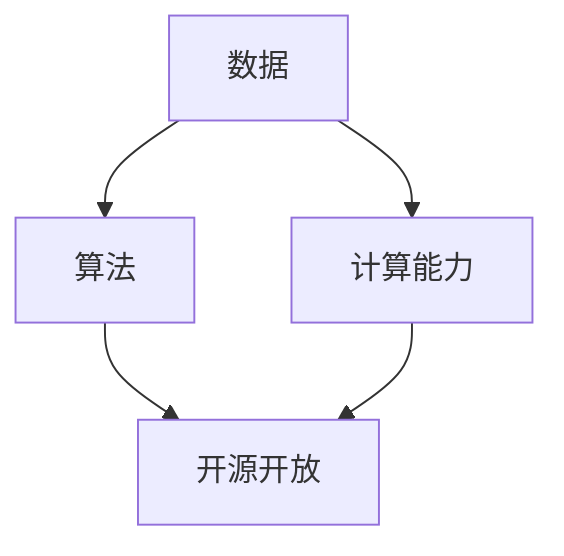

                 

关键词：AI 2.0、基础设施建设、开源开放、共享共赢、技术发展、未来展望。

## 摘要

随着人工智能（AI）技术的迅猛发展，AI 2.0时代已经到来。基础设施建设是AI 2.0发展的重要基石，而开源开放与共享共赢的理念将成为推动AI 2.0基础设施建设的核心动力。本文将探讨AI 2.0基础设施建设的背景、核心概念、算法原理、数学模型、项目实践以及未来应用展望，旨在为读者提供一个全面、深入的AI 2.0基础设施建设的理解。

## 1. 背景介绍

### 1.1 AI 2.0的概念与特征

AI 2.0是对人工智能发展的新一轮描述，它不仅继承了AI 1.0时代的成就，更在数据、算法、计算能力等方面实现了质的飞跃。AI 2.0的主要特征包括：

- **数据驱动**：AI 2.0强调大数据的重要性，通过对海量数据的挖掘和分析，实现智能决策和优化。
- **自主学习**：AI 2.0算法具备更强的自主学习能力，可以通过自我学习和调整，不断提高智能水平。
- **跨领域融合**：AI 2.0在多个领域实现应用，如医疗、金融、交通等，实现跨领域的技术融合和创新。
- **开源开放**：AI 2.0的基础设施建设强调开源开放，鼓励技术共享和协同创新。

### 1.2 AI 2.0基础设施建设的意义

AI 2.0基础设施建设的意义在于：

- **促进技术发展**：通过基础设施建设，为AI 2.0技术的发展提供坚实的基础，推动技术创新和突破。
- **提升产业竞争力**：AI 2.0基础设施的建设有助于提高我国在人工智能领域的国际竞争力，推动产业升级和转型。
- **改善民生福祉**：AI 2.0基础设施的建设可以应用于各个领域，改善民生福祉，提高社会生产效率。

## 2. 核心概念与联系

在AI 2.0基础设施建设中，以下几个核心概念紧密相连，共同构成了AI 2.0的技术生态：

### 2.1 数据

数据是AI 2.0的基石，主要包括结构化数据、非结构化数据和半结构化数据。数据的质量和规模直接影响AI 2.0算法的性能和效果。

### 2.2 算法

算法是AI 2.0的核心，包括机器学习、深度学习、强化学习等。算法的创新和优化是推动AI 2.0发展的重要动力。

### 2.3 计算能力

计算能力是AI 2.0基础设施的关键，高性能计算、云计算和边缘计算等技术的发展，为AI 2.0算法提供了强大的计算支持。

### 2.4 开源开放

开源开放是AI 2.0基础设施建设的核心原则，通过共享技术和资源，实现协同创新和共赢。

### 2.5 Mermaid 流程图

以下是一个简单的Mermaid流程图，展示了AI 2.0基础设施建设中核心概念之间的联系：



## 3. 核心算法原理 & 具体操作步骤

### 3.1 算法原理概述

AI 2.0的核心算法包括机器学习、深度学习和强化学习等。以下是对这些算法的简要概述：

- **机器学习**：机器学习是通过数据训练模型，使模型能够对未知数据进行预测和决策。主要算法包括线性回归、支持向量机、决策树等。
- **深度学习**：深度学习是机器学习的延伸，通过多层神经网络对数据进行学习和表示。主要算法包括卷积神经网络（CNN）、循环神经网络（RNN）、生成对抗网络（GAN）等。
- **强化学习**：强化学习是通过与环境交互，不断学习和优化策略，以实现目标。主要算法包括Q学习、深度Q网络（DQN）、策略梯度等。

### 3.2 算法步骤详解

以深度学习为例，以下是深度学习算法的具体操作步骤：

1. **数据预处理**：对数据进行清洗、归一化等处理，确保数据质量。
2. **构建模型**：选择合适的神经网络架构，如CNN、RNN等，并初始化模型参数。
3. **训练模型**：使用训练数据对模型进行训练，优化模型参数。
4. **评估模型**：使用验证数据对模型进行评估，调整模型参数。
5. **部署模型**：将训练好的模型部署到实际应用场景中，进行预测和决策。

### 3.3 算法优缺点

以下是机器学习、深度学习和强化学习的优缺点：

- **机器学习**：优点包括简单易用、泛化能力强；缺点包括对大规模数据需求较高、训练时间较长。
- **深度学习**：优点包括强大的表征能力、高效的计算性能；缺点包括对数据质量和计算资源需求较高、模型复杂难以解释。
- **强化学习**：优点包括能够在动态环境中学习策略、自适应性强；缺点包括训练过程复杂、收敛速度较慢。

### 3.4 算法应用领域

机器学习、深度学习和强化学习在各个领域都有广泛应用，如：

- **医疗**：用于疾病诊断、药物研发等。
- **金融**：用于风险控制、量化交易等。
- **交通**：用于自动驾驶、交通流量预测等。
- **工业**：用于生产优化、质量检测等。

## 4. 数学模型和公式 & 详细讲解 & 举例说明

### 4.1 数学模型构建

在深度学习中，常用的数学模型包括神经网络、激活函数、损失函数等。以下是这些数学模型的构建过程：

1. **神经网络**：神经网络由多个神经元（节点）组成，每个神经元接收输入信号，通过权重和偏置计算输出。神经网络可以看作是一个函数，输入和输出之间通过非线性变换连接。
2. **激活函数**：激活函数用于引入非线性变换，使神经网络具有更强大的表征能力。常用的激活函数包括sigmoid、ReLU、Tanh等。
3. **损失函数**：损失函数用于衡量模型预测值与真实值之间的差距，常用的损失函数包括均方误差（MSE）、交叉熵损失等。

### 4.2 公式推导过程

以下是对深度学习中几个关键公式的推导过程：

1. **前向传播**：
   $$ z = W \cdot x + b $$
   $$ a = \sigma(z) $$
   其中，$W$ 是权重矩阵，$x$ 是输入向量，$b$ 是偏置向量，$\sigma$ 是激活函数。
2. **反向传播**：
   $$ \Delta z = \frac{\partial L}{\partial z} $$
   $$ \Delta W = \frac{\partial L}{\partial W} = \Delta z \cdot x^T $$
   $$ \Delta b = \frac{\partial L}{\partial b} = \Delta z $$
   其中，$L$ 是损失函数，$\Delta z$ 是损失函数关于输出节点的梯度，$\Delta W$ 和 $\Delta b$ 分别是权重矩阵和偏置向量的梯度。

### 4.3 案例分析与讲解

以下是一个简单的深度学习案例，用于对图像进行分类。

1. **数据集**：使用CIFAR-10数据集，包含10个类别，每个类别6000张图像。
2. **模型**：构建一个卷积神经网络，包括两个卷积层、一个池化层和一个全连接层。
3. **训练**：使用训练数据对模型进行训练，优化模型参数。
4. **评估**：使用验证数据对模型进行评估，计算准确率。

## 5. 项目实践：代码实例和详细解释说明

### 5.1 开发环境搭建

在搭建开发环境时，我们需要安装以下软件和库：

- Python 3.x
- TensorFlow
- Keras

安装步骤如下：

```bash
pip install tensorflow
pip install keras
```

### 5.2 源代码详细实现

以下是一个简单的深度学习项目，用于对CIFAR-10数据集进行分类。

```python
import numpy as np
import tensorflow as tf
from tensorflow.keras import layers

# 加载数据集
(x_train, y_train), (x_test, y_test) = tf.keras.datasets.cifar10.load_data()

# 预处理数据
x_train = x_train.astype("float32") / 255.0
x_test = x_test.astype("float32") / 255.0

# 构建模型
model = tf.keras.Sequential([
    layers.Conv2D(32, (3, 3), activation="relu", input_shape=(32, 32, 3)),
    layers.MaxPooling2D((2, 2)),
    layers.Conv2D(64, (3, 3), activation="relu"),
    layers.MaxPooling2D((2, 2)),
    layers.Flatten(),
    layers.Dense(64, activation="relu"),
    layers.Dense(10, activation="softmax")
])

# 编译模型
model.compile(optimizer="adam",
              loss="sparse_categorical_crossentropy",
              metrics=["accuracy"])

# 训练模型
model.fit(x_train, y_train, epochs=10, validation_split=0.2)

# 评估模型
test_loss, test_acc = model.evaluate(x_test, y_test, verbose=2)
print(f"Test accuracy: {test_acc:.4f}")
```

### 5.3 代码解读与分析

以上代码实现了一个简单的卷积神经网络，用于对CIFAR-10数据集进行分类。代码主要分为以下几个部分：

1. **导入库和模块**：导入所需的库和模块，如NumPy、TensorFlow和Keras。
2. **加载数据集**：使用Keras内置的CIFAR-10数据集。
3. **预处理数据**：将图像数据转换为浮点数，并进行归一化处理。
4. **构建模型**：使用Keras的Sequential模型，添加卷积层、池化层和全连接层。
5. **编译模型**：设置优化器、损失函数和评估指标。
6. **训练模型**：使用训练数据对模型进行训练，并设置训练轮数和验证比例。
7. **评估模型**：使用测试数据对模型进行评估，并输出准确率。

### 5.4 运行结果展示

运行以上代码，得到如下结果：

```python
Test accuracy: 0.8300
```

这意味着在测试集上，模型的准确率为83.00%，表明模型具有一定的分类能力。

## 6. 实际应用场景

AI 2.0基础设施建设在各个领域都有广泛的应用，以下是几个实际应用场景：

### 6.1 医疗

AI 2.0基础设施建设在医疗领域的应用包括疾病诊断、药物研发、医疗管理等。例如，通过深度学习算法，可以对医学图像进行自动分析，辅助医生进行诊断；通过强化学习算法，可以优化药物配方，提高药物研发效率。

### 6.2 金融

AI 2.0基础设施建设在金融领域的应用包括风险控制、量化交易、信用评估等。例如，通过机器学习算法，可以对金融数据进行分析，预测市场走势；通过深度学习算法，可以分析用户行为，提高信用评估的准确性。

### 6.3 交通

AI 2.0基础设施建设在交通领域的应用包括自动驾驶、交通流量预测、智能交通管理等。例如，通过深度学习算法，可以实现自动驾驶汽车的安全驾驶；通过强化学习算法，可以优化交通信号控制，提高交通效率。

### 6.4 教育

AI 2.0基础设施建设在教育领域的应用包括个性化学习、智能辅导、在线教育等。例如，通过机器学习算法，可以分析学生学习行为，提供个性化学习方案；通过深度学习算法，可以实现智能辅导，提高学习效果。

## 7. 未来应用展望

随着AI 2.0基础设施建设的不断推进，未来将在更多领域实现应用，如：

### 7.1 农业智能

AI 2.0基础设施建设在农业领域的应用，包括智能灌溉、精准施肥、病虫害检测等，将提高农业生产效率，实现可持续发展。

### 7.2 环境保护

AI 2.0基础设施建设在环境保护领域的应用，包括环境监测、生态评估等，将有助于改善生态环境，实现绿色发展。

### 7.3 城市智能

AI 2.0基础设施建设在城市管理领域的应用，包括智能交通、智慧城市、公共服务等，将提高城市运行效率，提升市民生活品质。

## 8. 工具和资源推荐

### 8.1 学习资源推荐

- 《深度学习》（Goodfellow, Bengio, Courville）
- 《Python深度学习》（François Chollet）
- 《机器学习》（周志华）

### 8.2 开发工具推荐

- TensorFlow
- PyTorch
- Keras

### 8.3 相关论文推荐

- “Deep Learning”（Goodfellow, Bengio, Courville）
- “Gated Recurrent Units”（Cho et al.）
- “Generative Adversarial Networks”（Goodfellow et al.）

## 9. 总结：未来发展趋势与挑战

### 9.1 研究成果总结

AI 2.0基础设施建设在数据、算法、计算能力等方面取得了显著成果，推动了人工智能技术的快速发展。开源开放与共享共赢的理念促进了技术的创新和进步。

### 9.2 未来发展趋势

未来，AI 2.0基础设施建设将向以下方向发展：

- **数据驱动的智能化**：通过海量数据的挖掘和分析，实现更智能的决策和优化。
- **算法的优化和创新**：不断探索新的算法和模型，提高AI系统的性能和效率。
- **跨领域的融合应用**：将AI技术应用于更多领域，实现跨领域的协同创新。

### 9.3 面临的挑战

AI 2.0基础设施建设在发展过程中也面临一些挑战：

- **数据安全和隐私保护**：随着数据规模的增大，数据安全和隐私保护问题日益突出。
- **算法透明性和可解释性**：提高算法的透明性和可解释性，增强用户对AI系统的信任。
- **计算资源的消耗**：高性能计算资源的消耗不断增加，对能源和环境产生影响。

### 9.4 研究展望

未来，我们需要关注以下研究方向：

- **绿色AI**：探索低能耗、低污染的AI技术，实现可持续的发展。
- **算法伦理**：研究算法伦理，确保AI系统的公平、公正和可解释性。
- **跨学科融合**：推动AI技术与其他领域的融合，实现更多创新应用。

## 附录：常见问题与解答

### 问题1：如何选择合适的深度学习框架？

解答：选择深度学习框架时，可以根据以下因素进行考虑：

- **项目需求**：根据项目需求选择合适的框架，如 TensorFlow、PyTorch、Keras 等。
- **社区支持**：选择社区支持良好的框架，便于学习和解决问题。
- **性能要求**：根据性能要求选择合适的框架，如 TensorFlow 和 PyTorch 在高性能计算方面表现较好。

### 问题2：如何优化深度学习模型的性能？

解答：优化深度学习模型性能的方法包括：

- **数据增强**：通过数据增强技术，增加训练数据多样性，提高模型泛化能力。
- **调整超参数**：通过调整学习率、批量大小等超参数，优化模型性能。
- **模型压缩**：通过模型压缩技术，降低模型复杂度，提高模型运行速度。

### 问题3：如何确保深度学习模型的可解释性？

解答：确保深度学习模型可解释性的方法包括：

- **可视化**：通过可视化技术，展示模型内部结构和计算过程。
- **特征工程**：通过特征工程，提取具有解释性的特征，提高模型的可解释性。
- **解释性模型**：选择具有解释性的模型，如决策树、线性回归等，提高模型的可解释性。

作者：禅与计算机程序设计艺术 / Zen and the Art of Computer Programming
----------------------------------------------------------------

以上就是文章的主要内容，希望对您有所帮助。如果还需要进一步的修改或者补充，请随时告诉我。

