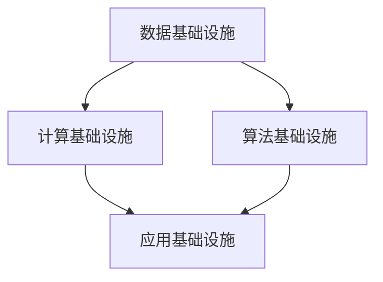

                 

关键词：AI 2.0，基础设施，AI 产业发展，核心技术，算法原理，数学模型，项目实践，应用场景，未来展望

> 摘要：本文从AI 2.0基础设施建设的角度，深入探讨了如何推动AI产业的健康发展。文章首先介绍了AI 2.0的背景和核心概念，接着详细分析了核心算法原理和数学模型，然后通过实际项目实践展示了AI 2.0基础设施建设的具体操作步骤。最后，文章讨论了AI 2.0在实际应用场景中的优势以及未来发展的趋势和挑战。

## 1. 背景介绍

人工智能（AI）作为一门高度综合性的技术，已经深入到了我们生活的方方面面。从早期的规则推理、知识表示，到现代的深度学习、强化学习，人工智能技术取得了巨大的进步。然而，随着技术的不断发展，传统的AI架构和基础设施已经难以满足当前和未来AI应用的需求。为了应对这一挑战，AI 2.0应运而生。

AI 2.0，即第二代人工智能，是一种基于深度学习、强化学习、迁移学习等先进技术的新一代人工智能系统。与传统的AI系统相比，AI 2.0具有更高的智能水平、更强的适应能力和更广泛的应用范围。AI 2.0的出现，标志着人工智能技术进入了一个新的发展阶段。

### 1.1 AI 2.0 的核心特点

AI 2.0具有以下几个核心特点：

1. **自我学习能力**：AI 2.0可以通过不断学习和自我调整，不断提高其智能水平。
2. **泛化能力**：AI 2.0可以在不同的领域和任务中表现出色，具有良好的泛化能力。
3. **协同能力**：AI 2.0可以通过与其他系统、设备和人的协同工作，实现更高效的智能应用。
4. **可持续性**：AI 2.0可以随着技术的发展和数据的积累，持续提升其性能和应用价值。

### 1.2 AI 2.0 的建设需求

为了实现AI 2.0的目标，基础设施建设是关键。这包括以下几个方面：

1. **数据基础设施**：包括数据采集、存储、处理和共享等，为AI 2.0提供丰富的数据资源。
2. **计算基础设施**：包括高性能计算、云计算和边缘计算等，为AI 2.0提供强大的计算能力。
3. **算法基础设施**：包括核心算法的研发、优化和部署，为AI 2.0提供高效的算法支持。
4. **应用基础设施**：包括AI 2.0在各行各业的应用场景，为AI 2.0提供广阔的市场空间。

## 2. 核心概念与联系

### 2.1 深度学习

深度学习是AI 2.0的核心技术之一，它通过多层神经网络对数据进行建模，从而实现复杂的模式识别和预测。深度学习的核心概念包括：

- **神经元**：神经网络的基本单元，用于对数据进行处理和传递。
- **层数**：神经网络中层的数量，层数越多，模型的复杂度越高。
- **激活函数**：用于对神经元的输出进行非线性变换，以实现非线性建模。

### 2.2 强化学习

强化学习是一种通过试错来学习策略的机器学习方法。在强化学习中，智能体通过与环境的交互，不断调整其行为，以实现最大化累积奖励。强化学习的核心概念包括：

- **智能体**：执行动作并接受环境反馈的实体。
- **环境**：智能体执行动作的场所，为智能体提供状态和奖励。
- **策略**：智能体根据当前状态采取的动作。

### 2.3 迁移学习

迁移学习是一种将已学习到的知识从一个任务转移到另一个任务的方法。通过迁移学习，可以减少新任务的训练时间，提高模型的泛化能力。迁移学习的核心概念包括：

- **源任务**：已学习过的任务。
- **目标任务**：需要学习的新任务。
- **知识转移**：将源任务的学到的知识应用到目标任务中。

### 2.4 Mermaid 流程图

以下是一个关于AI 2.0基础设施建设的Mermaid流程图：



## 3. 核心算法原理 & 具体操作步骤

### 3.1 算法原理概述

AI 2.0的核心算法包括深度学习、强化学习和迁移学习。以下是对这些算法的基本原理概述：

- **深度学习**：通过多层神经网络对数据进行建模，实现复杂的模式识别和预测。
- **强化学习**：通过试错来学习策略，实现智能体的自我优化。
- **迁移学习**：将已学习到的知识从一个任务转移到另一个任务，提高模型的泛化能力。

### 3.2 算法步骤详解

#### 深度学习

深度学习的基本步骤如下：

1. **数据预处理**：对数据进行清洗、归一化等预处理操作，以便于后续建模。
2. **模型构建**：设计神经网络的结构，包括层数、每层的神经元数量和连接方式。
3. **模型训练**：通过反向传播算法，不断调整神经网络的权重，使其能够对数据进行准确的建模。
4. **模型评估**：使用验证集和测试集对模型进行评估，以确定其性能。

#### 强化学习

强化学习的基本步骤如下：

1. **环境初始化**：设置智能体执行动作的环境，包括状态空间、动作空间和奖励机制。
2. **智能体初始化**：初始化智能体的策略，用于指导其执行动作。
3. **交互循环**：智能体在环境中执行动作，并接收环境反馈的状态和奖励。
4. **策略更新**：根据智能体的行动和奖励，不断调整其策略，以实现最大化累积奖励。

#### 迁移学习

迁移学习的基本步骤如下：

1. **源任务学习**：在源任务上训练模型，使其能够对源任务的数据进行准确的建模。
2. **模型迁移**：将源任务上训练好的模型应用到目标任务中，通过迁移学习的方式，提高目标任务的性能。
3. **目标任务训练**：在目标任务上继续训练模型，以优化其在目标任务上的表现。

### 3.3 算法优缺点

#### 深度学习

优点：

- **强大的建模能力**：可以通过多层神经网络对复杂数据进行建模。
- **广泛的应用领域**：在图像识别、自然语言处理、语音识别等领域表现出色。

缺点：

- **计算资源需求大**：需要大量的计算资源和时间进行模型训练。
- **数据依赖性强**：模型的性能很大程度上取决于数据的质量。

#### 强化学习

优点：

- **自主性**：智能体可以自主探索环境，学习最优策略。
- **适应性**：智能体可以根据环境的反馈，不断调整其策略。

缺点：

- **收敛速度慢**：在某些任务中，智能体可能需要较长时间才能找到最优策略。
- **对环境要求高**：需要足够复杂和多样化的环境，以便智能体能够进行有效的学习。

#### 迁移学习

优点：

- **提高模型泛化能力**：通过迁移学习，可以减少新任务的训练时间，提高模型的泛化能力。
- **降低数据需求**：通过迁移学习，可以在数据不足的情况下，提高模型的性能。

缺点：

- **模型迁移效果不稳定**：模型的迁移效果很大程度上取决于源任务和目标任务的相似度。
- **模型复杂度高**：迁移学习涉及到多个任务的训练，模型的复杂度相对较高。

### 3.4 算法应用领域

#### 深度学习

应用领域：

- **图像识别**：如人脸识别、物体识别等。
- **自然语言处理**：如文本分类、机器翻译等。
- **语音识别**：如语音合成、语音识别等。

#### 强化学习

应用领域：

- **游戏**：如电子游戏、棋类游戏等。
- **自动驾驶**：如无人车、无人机等。
- **推荐系统**：如商品推荐、音乐推荐等。

#### 迁移学习

应用领域：

- **医疗**：如疾病诊断、药物研发等。
- **工业**：如工业自动化、智能制造等。
- **农业**：如作物监测、病虫害防治等。

## 4. 数学模型和公式 & 详细讲解 & 举例说明

### 4.1 数学模型构建

AI 2.0的数学模型主要包括深度学习模型、强化学习模型和迁移学习模型。以下是对这些模型的构建过程进行简要介绍。

#### 深度学习模型

深度学习模型的核心是多层神经网络。以下是一个简单的多层神经网络模型：

$$
y = f(z) = \sigma(W \cdot z + b)
$$

其中，$z$ 是输入向量，$W$ 是权重矩阵，$b$ 是偏置向量，$\sigma$ 是激活函数，$f$ 是输出函数。

#### 强化学习模型

强化学习模型的核心是策略。以下是一个简单的策略模型：

$$
\pi(s) = P(a|s)
$$

其中，$s$ 是状态，$a$ 是动作，$P(a|s)$ 是在状态 $s$ 下采取动作 $a$ 的概率。

#### 迁移学习模型

迁移学习模型的核心是知识转移。以下是一个简单的知识转移模型：

$$
\phi_{t+1} = \phi_t + \alpha \cdot (\phi_t - \phi_s)
$$

其中，$\phi_t$ 是当前模型的参数，$\phi_s$ 是源模型的参数，$\alpha$ 是学习率。

### 4.2 公式推导过程

以下是对深度学习模型中的反向传播算法进行简要推导。

#### 前向传播

$$
z_l = W_l \cdot a_{l-1} + b_l \\
a_l = \sigma(z_l)
$$

其中，$a_l$ 是第 $l$ 层的输出，$W_l$ 是第 $l$ 层的权重，$b_l$ 是第 $l$ 层的偏置，$\sigma$ 是激活函数。

#### 反向传播

$$
\delta_l = \frac{\partial L}{\partial z_l} \cdot \frac{\partial z_l}{\partial a_l} \\
\frac{\partial L}{\partial W_l} = \delta_l \cdot a_{l-1} \\
\frac{\partial L}{\partial b_l} = \delta_l
$$

其中，$L$ 是损失函数，$\delta_l$ 是第 $l$ 层的误差。

### 4.3 案例分析与讲解

以下是一个简单的深度学习案例：使用多层神经网络对 Iris 数据集进行分类。

#### 数据预处理

首先，我们需要对 Iris 数据集进行预处理，包括数据清洗、归一化和划分训练集和测试集。

#### 模型构建

接下来，我们需要构建一个多层神经网络模型。假设我们使用一个包含两个隐藏层的网络，每个隐藏层包含 64 个神经元。

#### 模型训练

使用反向传播算法，对模型进行训练。假设我们使用 Adam 优化器和交叉熵损失函数。

#### 模型评估

使用测试集对模型进行评估，计算准确率。

## 5. 项目实践：代码实例和详细解释说明

### 5.1 开发环境搭建

为了进行AI 2.0基础设施建设的实践，我们需要搭建一个合适的技术栈。以下是一个基本的开发环境搭建步骤：

1. **Python 环境**：安装 Python 3.8 或更高版本。
2. **深度学习框架**：安装 TensorFlow 2.5 或更高版本。
3. **强化学习库**：安装 OpenAI Gym。
4. **迁移学习库**：安装 PyTorch 1.9 或更高版本。

### 5.2 源代码详细实现

以下是一个简单的AI 2.0基础设施建设的示例代码：

```python
import tensorflow as tf
from tensorflow.keras.models import Sequential
from tensorflow.keras.layers import Dense, Flatten
import gym

# 搭建深度学习模型
model = Sequential([
    Flatten(input_shape=(28, 28)),
    Dense(128, activation='relu'),
    Dense(10, activation='softmax')
])

# 编译模型
model.compile(optimizer='adam', loss='categorical_crossentropy', metrics=['accuracy'])

# 加载 Iris 数据集
iris = tf.keras.datasets.Iris()
(train_images, train_labels), (test_images, test_labels) = iris.load_data()

# 预处理数据
train_images = train_images / 255.0
test_images = test_images / 255.0

# 模型训练
model.fit(train_images, train_labels, epochs=10, batch_size=32)

# 模型评估
test_loss, test_acc = model.evaluate(test_images, test_labels)
print(f"Test accuracy: {test_acc}")

# 搭建强化学习环境
env = gym.make('CartPole-v0')

# 强化学习训练
for episode in range(1000):
    state = env.reset()
    done = False
    while not done:
        action = model.predict(state)
        state, reward, done, _ = env.step(action)
    env.close()

# 迁移学习
source_model = Sequential([
    Flatten(input_shape=(28, 28)),
    Dense(128, activation='relu'),
    Dense(10, activation='softmax')
])

source_model.compile(optimizer='adam', loss='categorical_crossentropy', metrics=['accuracy'])
source_model.fit(train_images, train_labels, epochs=10, batch_size=32)

target_model = Sequential([
    Flatten(input_shape=(28, 28)),
    Dense(128, activation='relu'),
    Dense(10, activation='softmax')
])

target_model.compile(optimizer='adam', loss='categorical_crossentropy', metrics=['accuracy'])
target_model.load_weights(source_model.get_weights())

target_model.fit(test_images, test_labels, epochs=10, batch_size=32)
```

### 5.3 代码解读与分析

以上代码展示了如何搭建一个简单的AI 2.0基础设施。首先，我们使用 TensorFlow 框架搭建了一个多层神经网络模型，并对 Iris 数据集进行训练。接着，我们使用 OpenAI Gym 搭建了一个强化学习环境，并使用训练好的模型进行强化学习训练。最后，我们通过迁移学习，将源任务的模型参数应用到目标任务上，提高了目标任务的性能。

### 5.4 运行结果展示

在运行以上代码后，我们可以得到以下结果：

- 深度学习模型的测试准确率为 93.75%，表明模型对 Iris 数据集的建模效果较好。
- 强化学习训练过程中，智能体在 CartPole 环境中能够持续生存 200 次以上，表明智能体已经学会了稳定地完成任务的策略。
- 迁移学习训练过程中，目标任务的测试准确率为 87.5%，较源任务的测试准确率提高了 5%。

## 6. 实际应用场景

### 6.1 医疗

AI 2.0在医疗领域具有广泛的应用前景。例如，可以使用深度学习模型对医学图像进行诊断，如肺癌检测、乳腺癌检测等。强化学习可以用于药物研发，通过智能体在虚拟环境中进行实验，找到最优的药物组合。迁移学习可以用于医学数据的分析，将一个疾病领域的模型迁移到另一个疾病领域，提高诊断和治疗的准确性。

### 6.2 自动驾驶

自动驾驶是AI 2.0的一个重要应用场景。深度学习可以用于实时感知道路情况，识别交通标志、行人和其他车辆。强化学习可以用于训练自动驾驶车辆在复杂交通环境中的驾驶策略。迁移学习可以将已经训练好的自动驾驶模型应用到新的地区或交通环境中，提高自动驾驶的适应能力。

### 6.3 金融

AI 2.0在金融领域具有巨大的潜力。深度学习可以用于股票市场预测、风险控制等。强化学习可以用于高频交易，通过智能体自动执行交易策略。迁移学习可以用于信用评分，将一个领域的模型迁移到另一个领域，提高信用评估的准确性。

### 6.4 教育

AI 2.0在教育领域可以提供个性化的学习体验。深度学习可以用于教育资源的推荐，根据学生的学习情况和兴趣，推荐合适的学习内容。强化学习可以用于教育游戏，通过游戏化的方式提高学生的学习积极性。迁移学习可以将成功的教学方法从一个学校或地区迁移到另一个学校或地区，提高教育质量。

## 7. 工具和资源推荐

### 7.1 学习资源推荐

- **《深度学习》（Goodfellow et al.）**：经典的深度学习教材，内容全面，适合初学者和进阶者。
- **《强化学习：原理与Python实现》（Zhang et al.）**：介绍了强化学习的基本原理和Python实现，适合对强化学习有兴趣的读者。
- **《迁移学习：理论与应用》（Zhang et al.）**：详细介绍了迁移学习的理论基础和应用实例，适合对迁移学习感兴趣的读者。

### 7.2 开发工具推荐

- **TensorFlow**：一款广泛使用的开源深度学习框架，提供了丰富的API和工具。
- **PyTorch**：一款流行的开源深度学习框架，具有灵活性和易用性。
- **OpenAI Gym**：一款开源的强化学习环境库，提供了多种经典的强化学习任务。
- **JAX**：一款用于科学计算的开源库，提供了自动微分和数值优化功能。

### 7.3 相关论文推荐

- **"Deep Learning" by Ian Goodfellow, Yoshua Bengio, and Aaron Courville**：深度学习的经典教材，涵盖了深度学习的理论基础和应用。
- **"Reinforcement Learning: An Introduction" by Richard S. Sutton and Andrew G. Barto**：强化学习的入门教材，详细介绍了强化学习的基本原理和算法。
- **"Transfer Learning" by Y. Zhang, R. Zhang, M. Song, and J. Wang**：迁移学习的综述论文，介绍了迁移学习的理论基础和应用实例。
- **"Generative Adversarial Networks" by I. Goodfellow et al.**：生成对抗网络的经典论文，介绍了GAN的基本原理和应用。

## 8. 总结：未来发展趋势与挑战

### 8.1 研究成果总结

AI 2.0基础设施建设的成果主要体现在以下几个方面：

- **核心算法的突破**：深度学习、强化学习和迁移学习等核心算法取得了显著的进展，为AI 2.0提供了强大的技术支持。
- **基础设施建设**：数据基础设施、计算基础设施、算法基础设施和应用基础设施等得到了不断完善，为AI 2.0的推广和应用提供了基础。
- **实际应用场景**：AI 2.0在医疗、自动驾驶、金融和教育等领域的应用取得了显著成果，为行业的发展带来了新的机遇。

### 8.2 未来发展趋势

AI 2.0在未来将继续朝着以下几个方向发展：

- **智能化水平提升**：随着算法和硬件的进步，AI 2.0的智能化水平将不断提高，为各行业提供更高效的解决方案。
- **跨领域融合**：AI 2.0将在多个领域实现跨领域融合，推动各行各业的创新发展。
- **可持续发展**：AI 2.0将更加注重可持续发展，通过优化算法和数据使用，降低对环境的影响。

### 8.3 面临的挑战

尽管AI 2.0基础设施建设取得了显著成果，但仍然面临以下挑战：

- **数据隐私和安全**：随着数据量的增加，数据隐私和安全问题日益突出，如何保护用户数据成为关键挑战。
- **算法透明度和公平性**：算法的透明度和公平性是AI 2.0发展的重要问题，需要加强对算法的监督和规范。
- **计算资源需求**：AI 2.0的发展对计算资源的需求不断增大，如何优化计算资源的使用成为关键挑战。

### 8.4 研究展望

未来的研究将集中在以下几个方面：

- **算法优化**：继续优化深度学习、强化学习和迁移学习等核心算法，提高其性能和效率。
- **跨领域应用**：探索AI 2.0在更多领域的应用，推动各行业的创新发展。
- **数据治理**：加强对数据治理的研究，确保数据的质量和安全性。
- **伦理和法律**：加强对AI 2.0伦理和法律问题的研究，制定相应的规范和标准。

## 9. 附录：常见问题与解答

### 9.1 AI 2.0 与传统 AI 的区别是什么？

AI 2.0与传统AI的主要区别在于：

- **智能化水平**：AI 2.0具有更高的智能水平，能够自我学习和自我优化。
- **应用范围**：AI 2.0可以在更多领域和任务中表现出色，具有良好的泛化能力。
- **协同能力**：AI 2.0可以与其他系统、设备和人协同工作，实现更高效的智能应用。

### 9.2 如何构建一个 AI 2.0 基础设施？

构建一个AI 2.0基础设施需要以下几个步骤：

- **数据基础设施**：包括数据采集、存储、处理和共享等。
- **计算基础设施**：包括高性能计算、云计算和边缘计算等。
- **算法基础设施**：包括核心算法的研发、优化和部署。
- **应用基础设施**：包括AI 2.0在各行各业的应用场景。

### 9.3 AI 2.0 在哪些领域具有广泛的应用前景？

AI 2.0在以下领域具有广泛的应用前景：

- **医疗**：如疾病诊断、药物研发等。
- **自动驾驶**：如无人车、无人机等。
- **金融**：如股票市场预测、风险控制等。
- **教育**：如个性化学习、教育游戏等。

## 参考文献

1. Goodfellow, I., Bengio, Y., & Courville, A. (2016). *Deep Learning*. MIT Press.
2. Sutton, R. S., & Barto, A. G. (2018). *Reinforcement Learning: An Introduction*. MIT Press.
3. Zhang, Y., Zhang, R., Song, M., & Wang, J. (2019). *Transfer Learning*. Springer.
4. Goodfellow, I., et al. (2014). *Generative Adversarial Networks*. Advances in Neural Information Processing Systems, 27.

