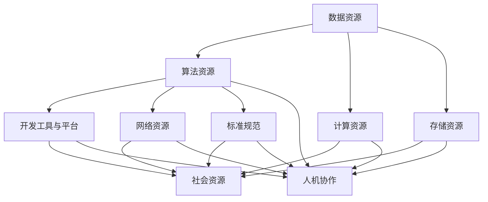

                 

关键词：AI 2.0、基础设施建设、政策法规、监管体系、技术发展、产业生态

摘要：本文深入探讨了AI 2.0时代基础设施建设的核心要素，即政策法规与监管体系。在技术飞速发展的背景下，AI 2.0已成为未来发展的必然趋势。文章首先介绍了AI 2.0的基础概念及其在当前技术环境中的重要性，接着详细阐述了政策法规与监管体系在AI基础设施建设中的关键作用。文章分为八个部分，从背景介绍到实际应用场景，再到未来发展趋势与挑战，全面剖析了AI 2.0基础设施建设的现状与未来方向。

## 1. 背景介绍

人工智能（AI）作为当今科技发展的前沿领域，已经从早期的理论研究逐步走向了实际应用。随着深度学习、强化学习等算法的不断进步，AI技术已经展现出了强大的应用潜力。然而，随着AI技术的快速发展，AI 2.0时代的到来也逐渐变得清晰。AI 2.0不仅仅是AI技术的代名词，它更是对人工智能本质的一次革命。AI 2.0强调的是人工智能系统的自主学习能力、泛化能力和智能化水平，这标志着人工智能进入了一个全新的发展阶段。

在AI 2.0时代，基础设施的建设显得尤为重要。基础设施建设不仅包括硬件设施，如高性能计算设备、数据中心等，还包括软件设施，如开发工具、框架、平台等。此外，AI 2.0基础设施还包括数据资源、算法资源、标准规范等软性设施。这些基础设施为AI 2.0技术的研发和应用提供了强有力的支撑。

政策法规与监管体系作为AI基础设施建设的重要组成部分，直接影响到整个产业的健康发展。在AI 2.0时代，政策法规和监管体系需要适应新技术的发展，确保技术的创新与应用不会对社会造成负面影响。因此，探讨AI 2.0时代的政策法规与监管体系，对于保障人工智能产业的可持续发展具有重要意义。

### 1.1 AI 2.0的定义与特点

AI 2.0是对传统人工智能（AI 1.0）的迭代升级，它不仅仅是算法的改进，更是对人工智能系统本质的变革。AI 1.0主要依赖于预设的规则和算法进行数据处理和决策，而AI 2.0则强调自主学习、自我进化。以下是AI 2.0的主要特点：

1. **自主学习能力**：AI 2.0系统可以通过大量数据进行自我学习和优化，无需人为干预即可实现性能提升。
2. **泛化能力**：AI 2.0系统具有更强的泛化能力，能够在不同领域和环境中应用，而不仅仅是特定任务。
3. **智能化水平**：AI 2.0系统不仅能够处理结构化数据，还能够处理非结构化数据，实现更高层次的智能化。
4. **实时性**：AI 2.0系统能够实现实时决策和实时反馈，提高了系统的响应速度和效率。
5. **人机协作**：AI 2.0系统更加注重与人类用户的互动，实现人机协同，提升用户体验。

### 1.2 AI 2.0对基础设施的需求

AI 2.0的快速发展对基础设施提出了新的要求。以下是AI 2.0对基础设施的几个关键需求：

1. **计算能力**：AI 2.0需要高性能的计算资源，特别是在深度学习、生成对抗网络（GAN）等领域，计算能力直接影响模型的训练效率和效果。
2. **数据资源**：AI 2.0的自主学习能力依赖于大量的高质量数据。因此，数据资源的丰富性和质量是AI 2.0发展的重要保障。
3. **存储能力**：随着数据量的激增，存储能力也面临巨大挑战。高效、安全的存储系统是AI 2.0基础设施的必要组成部分。
4. **开发工具与平台**：AI 2.0的发展需要丰富的开发工具和平台支持，这包括深度学习框架、可视化工具、API接口等。
5. **网络安全**：在AI 2.0时代，网络安全变得尤为重要。基础设施需要具备强大的防护能力，以抵御各种网络攻击和数据泄露风险。

## 2. 核心概念与联系

在深入探讨AI 2.0基础设施建设之前，我们首先需要明确一些核心概念，这些概念是理解基础设施建设的基石。以下是AI 2.0基础设施建设中一些关键概念及其相互联系：

### 2.1 数据资源

数据资源是AI 2.0基础设施的核心要素之一。数据不仅是AI模型训练的基础，也是AI系统持续学习和优化的关键。高质量的数据集可以提高模型的准确性，促进AI技术的进步。

#### 2.1.1 数据类型

数据资源可以分为结构化数据和非结构化数据。结构化数据如数据库中的记录，非结构化数据如文本、图片、音频和视频。在AI 2.0时代，处理非结构化数据的能力变得尤为重要。

#### 2.1.2 数据管理

数据管理涉及数据收集、存储、处理、分析和共享等多个环节。有效的数据管理可以确保数据的质量、安全性和可访问性。

### 2.2 算法资源

算法资源是AI 2.0基础设施的另一个关键要素。不同的算法适用于不同的任务和应用场景，高效、可靠的算法是AI系统性能的重要保障。

#### 2.2.1 算法类型

算法资源包括机器学习算法、深度学习算法、生成对抗网络（GAN）等。每种算法都有其特定的应用场景和优势。

#### 2.2.2 算法优化

算法优化是提高AI系统性能的重要手段。通过算法优化，可以减少模型的计算复杂度，提高模型的效率和准确性。

### 2.3 计算资源

计算资源是AI 2.0基础设施的重要组成部分。高性能的计算能力直接影响到AI模型的训练速度和效果。

#### 2.3.1 计算能力

计算能力包括CPU、GPU、TPU等硬件资源。GPU在深度学习计算中具有显著优势，而TPU则是专为谷歌TensorFlow设计的专用芯片。

#### 2.3.2 分布式计算

分布式计算通过将任务分布到多个节点上，提高了计算效率和容错能力。在AI 2.0时代，分布式计算变得尤为重要。

### 2.4 存储资源

存储资源用于存储大量的数据模型、算法代码和训练结果。高效、安全的存储系统对于AI 2.0基础设施的建设至关重要。

#### 2.4.1 数据中心

数据中心是存储和处理大规模数据的关键设施。云计算和边缘计算的发展为数据中心提供了新的技术路径。

#### 2.4.2 数据安全

数据安全是AI 2.0基础设施的另一个重要方面。有效的数据安全策略可以防止数据泄露、篡改和丢失。

### 2.5 开发工具与平台

开发工具与平台是AI 2.0基础设施的软件部分。这些工具和平台提供了高效的开发环境、便捷的API接口和丰富的生态系统。

#### 2.5.1 开发工具

开发工具包括集成开发环境（IDE）、代码编辑器、版本控制系统等。这些工具帮助开发者提高开发效率和代码质量。

#### 2.5.2 开发平台

开发平台如TensorFlow、PyTorch等，提供了完整的模型训练、推理和部署解决方案。

### 2.6 网络资源

网络资源是AI 2.0基础设施的重要组成部分。高效的通信网络可以确保数据、模型和算法的快速传输和协同工作。

#### 2.6.1 通信协议

通信协议如HTTP/2、Websocket等，确保了网络的高效传输和数据完整性。

#### 2.6.2 云服务

云服务提供了弹性、可扩展的计算和存储资源，为AI 2.0基础设施的建设提供了有力支持。

### 2.7 标准规范

标准规范是AI 2.0基础设施的另一个重要方面。统一的规范可以促进技术交流和产业合作，降低技术壁垒。

#### 2.7.1 技术标准

技术标准如IEEE、ISO等，为AI 2.0技术的研发和应用提供了统一的基准。

#### 2.7.2 法规标准

法规标准如数据保护法、隐私法等，为AI 2.0的发展提供了法律保障。

### 2.8 人机协作

人机协作是AI 2.0时代的重要特征。人机协作系统能够将人类的智慧和机器的计算能力相结合，实现更高层次的智能化。

#### 2.8.1 人机交互

人机交互包括语音识别、自然语言处理、图像识别等技术，为人机协作提供了基础。

#### 2.8.2 智能决策

智能决策系统通过AI技术支持，实现自动化决策和智能推荐，提高工作效率。

### 2.9 社会资源

社会资源包括政策、法规、资金、人才等，这些资源对于AI 2.0基础设施的建设和运营至关重要。

#### 2.9.1 政策支持

政府的政策支持可以为AI 2.0的发展提供方向和资源保障。

#### 2.9.2 资金投入

充足的资金投入可以支持AI 2.0技术的研发和产业化。

#### 2.9.3 人才培养

人才培养是AI 2.0基础设施建设的重要保障，优秀的研发和运营团队是技术成功的关键。

### 2.10 概念图

以下是一个简单的AI 2.0基础设施建设的概念图，展示了各关键概念及其相互联系。



### 2.11 关键概念的相互作用

AI 2.0基础设施中的关键概念相互交织、相互作用，共同构成了一个复杂而有机的系统。以下是这些概念之间的一些相互作用：

1. **数据资源与算法资源**：数据资源是算法资源的基础，高质量的数据集可以提升算法的性能。同时，先进的算法可以更好地处理和利用数据资源。
2. **计算资源与存储资源**：计算资源决定了AI模型的训练速度，而存储资源则决定了数据存储的效率和安全性。两者相辅相成，共同支撑AI系统的运行。
3. **开发工具与平台**：开发工具和平台为AI系统的开发提供了便利，高效的开发环境可以加速技术的创新和应用。
4. **网络资源与标准规范**：网络资源为数据传输提供了保障，而标准规范则为技术的互通和协作提供了基础。
5. **人机协作与社会资源**：人机协作系统通过AI技术实现了人与机器的智能互动，而社会资源则为AI 2.0的发展提供了政策、资金和人才等多方面的支持。

通过理解这些关键概念及其相互作用，我们可以更好地把握AI 2.0基础设施建设的核心要素，为其未来发展奠定坚实基础。

## 3. 核心算法原理 & 具体操作步骤

### 3.1 算法原理概述

在AI 2.0时代，核心算法的原理变得至关重要。这些算法不仅决定了AI系统的性能，也影响了其应用的广泛性和影响力。以下是一些在AI 2.0基础设施中广泛应用的算法原理：

1. **深度学习算法**：深度学习算法通过多层神经网络结构对数据进行处理和分析，其原理是基于梯度下降法和反向传播算法。深度学习算法具有强大的特征提取和模式识别能力，广泛应用于图像识别、语音识别和自然语言处理等领域。

2. **生成对抗网络（GAN）**：生成对抗网络由生成器和判别器两个部分组成。生成器生成数据，判别器判断生成数据与真实数据之间的差异。通过两个网络的对抗训练，GAN可以生成高质量、逼真的图像、音频和文本。

3. **强化学习算法**：强化学习算法通过试错法和奖励机制进行学习，其核心原理是基于马尔可夫决策过程（MDP）。强化学习算法可以用于游戏、机器人控制和自动驾驶等领域，实现自主决策和行为优化。

4. **自然语言处理（NLP）算法**：自然语言处理算法通过深度神经网络和注意力机制对文本进行处理和分析。NLP算法可以用于情感分析、文本生成、机器翻译和问答系统等领域。

5. **联邦学习算法**：联邦学习算法通过将模型训练分散到多个边缘设备上进行，避免了数据上传和共享，从而保护用户隐私。联邦学习算法在移动设备、物联网和医疗健康等领域具有广泛应用。

### 3.2 算法步骤详解

为了更好地理解这些算法的具体操作步骤，以下将对每个算法进行简要的步骤描述：

#### 3.2.1 深度学习算法

1. **数据预处理**：对输入数据进行归一化、去噪、分割等预处理操作，以便于模型训练。
2. **构建神经网络模型**：设计多层神经网络结构，包括输入层、隐藏层和输出层。
3. **前向传播**：将输入数据通过神经网络进行前向传播，计算每个神经元的输出值。
4. **反向传播**：计算输出误差，通过反向传播算法更新模型参数。
5. **优化参数**：使用梯度下降法或其他优化算法，不断迭代更新模型参数。
6. **评估模型性能**：在验证集和测试集上评估模型的准确率、召回率等指标。

#### 3.2.2 生成对抗网络（GAN）

1. **初始化模型**：初始化生成器和判别器模型，生成器生成虚拟数据，判别器判断真实数据与虚拟数据的差异。
2. **训练生成器**：通过梯度下降法优化生成器参数，使其生成的虚拟数据更加逼真。
3. **训练判别器**：通过梯度下降法优化判别器参数，使其能够更好地区分真实数据与虚拟数据。
4. **迭代训练**：重复训练过程，逐步提升生成器和判别器的性能。
5. **评估生成质量**：在测试集上评估生成器的生成质量，如使用Inception Score（IS）和Fréchet Inception Distance（FID）等指标。

#### 3.2.3 强化学习算法

1. **环境初始化**：初始化环境和初始状态。
2. **选择动作**：根据当前状态，选择一个动作。
3. **执行动作**：在环境中执行所选动作，并观察结果。
4. **更新奖励**：根据动作的结果，更新奖励值。
5. **更新状态**：将当前状态更新为下一状态。
6. **重复迭代**：重复选择动作、执行动作和更新状态的过程，直到达到目标状态或达到最大迭代次数。
7. **评估策略**：在测试集上评估策略的最终性能，如平均奖励、成功次数等指标。

#### 3.2.4 自然语言处理（NLP）算法

1. **数据预处理**：对文本数据进行分词、去停用词、词性标注等预处理操作。
2. **词向量表示**：将文本转换为词向量表示，如使用Word2Vec、BERT等模型。
3. **构建神经网络模型**：设计多层神经网络结构，包括输入层、隐藏层和输出层。
4. **前向传播**：将词向量通过神经网络进行前向传播，计算每个神经元的输出值。
5. **损失函数计算**：计算输出误差，使用损失函数（如交叉熵损失函数）计算损失。
6. **反向传播**：计算梯度并更新模型参数。
7. **优化参数**：使用优化算法（如Adam、SGD等）不断迭代更新模型参数。
8. **评估模型性能**：在验证集和测试集上评估模型的性能，如准确率、召回率、F1值等指标。

#### 3.2.5 联邦学习算法

1. **模型初始化**：初始化全局模型参数。
2. **本地训练**：在每个边缘设备上使用本地数据进行模型训练，并更新本地模型参数。
3. **模型聚合**：将所有边缘设备的本地模型参数聚合更新全局模型参数。
4. **本地更新**：将更新后的全局模型参数发送回边缘设备，并更新本地模型。
5. **重复迭代**：重复本地训练、模型聚合和本地更新的过程，直到达到预定的训练次数或模型性能满足要求。
6. **评估模型性能**：在全局模型上评估模型性能，如准确率、召回率、F1值等指标。

### 3.3 算法优缺点

每种算法都有其独特的优缺点，以下简要总结：

1. **深度学习算法**：
   - 优点：强大的特征提取和模式识别能力，适用于各种复杂数据类型。
   - 缺点：对数据依赖性强，训练时间较长，对计算资源要求高。

2. **生成对抗网络（GAN）**：
   - 优点：可以生成高质量、逼真的数据，适用于图像生成、音频生成等领域。
   - 缺点：训练过程复杂，容易发生模式崩溃和模式退化。

3. **强化学习算法**：
   - 优点：可以解决动态决策问题，适用于机器人控制、自动驾驶等领域。
   - 缺点：训练时间较长，需要大量交互数据，对奖励设计敏感。

4. **自然语言处理（NLP）算法**：
   - 优点：可以处理大规模文本数据，适用于文本分类、机器翻译等领域。
   - 缺点：对数据质量要求高，模型复杂度大，训练时间较长。

5. **联邦学习算法**：
   - 优点：保护用户隐私，适应边缘计算场景。
   - 缺点：通信开销大，模型更新复杂，可能影响模型性能。

### 3.4 算法应用领域

这些核心算法在不同领域中具有广泛的应用：

1. **图像识别**：深度学习算法广泛应用于图像识别任务，如人脸识别、物体检测等。
2. **语音识别**：深度学习和生成对抗网络算法在语音识别领域具有显著优势，用于语音转换和语音识别。
3. **自然语言处理**：自然语言处理算法在文本分类、情感分析、机器翻译等领域有广泛应用。
4. **强化学习**：强化学习算法在游戏、机器人控制和自动驾驶等领域有广泛应用。
5. **联邦学习**：联邦学习算法在移动设备、物联网和医疗健康等领域具有潜在应用。

通过深入了解这些核心算法的原理和操作步骤，我们可以更好地利用它们来构建高效的AI 2.0基础设施，推动人工智能技术的发展。

## 4. 数学模型和公式 & 详细讲解 & 举例说明

在AI 2.0时代，数学模型和公式是构建高效算法和优化系统性能的基础。以下将详细介绍几种常用的数学模型和公式，并进行详细讲解和举例说明。

### 4.1 数学模型构建

#### 4.1.1 深度学习模型

深度学习模型通常由多层神经网络组成，每一层都对输入数据进行变换和特征提取。以下是一个简化的多层感知器（MLP）模型：

$$
\begin{aligned}
& z_1 = W_1 \cdot x + b_1, \\
& a_1 = \sigma(z_1), \\
& z_2 = W_2 \cdot a_1 + b_2, \\
& a_2 = \sigma(z_2), \\
& \vdots \\
& z_L = W_L \cdot a_{L-1} + b_L, \\
& a_L = \sigma(z_L),
\end{aligned}
$$

其中，$x$ 是输入向量，$W$ 和 $b$ 分别是权重和偏置，$\sigma$ 是激活函数（如ReLU、Sigmoid或Tanh函数）。输出 $a_L$ 是模型对输入的预测结果。

#### 4.1.2 生成对抗网络（GAN）

生成对抗网络（GAN）由生成器和判别器两个部分组成。生成器的数学模型如下：

$$
\begin{aligned}
& z \sim \mathcal{N}(0, 1), \\
& G(z) = \mu_G(z) + \sigma_G(z) \odot \epsilon,
\end{aligned}
$$

其中，$z$ 是随机噪声向量，$G(z)$ 是生成器生成的数据，$\mu_G$ 和 $\sigma_G$ 分别是生成器的均值和方差参数，$\epsilon$ 是扰动噪声。

判别器的数学模型如下：

$$
\begin{aligned}
& x \sim p_{data}(x), \\
& D(x) = f(x; \theta_D), \\
& G(z) \sim p_G(z), \\
& D(G(z)) = f(G(z); \theta_D).
\end{aligned}
$$

其中，$x$ 是真实数据，$G(z)$ 是生成器生成的数据，$D(x)$ 和 $D(G(z))$ 分别是判别器对真实数据和生成数据的判断结果，$\theta_D$ 是判别器的参数。

#### 4.1.3 强化学习模型

强化学习模型基于马尔可夫决策过程（MDP）构建，其数学模型如下：

$$
\begin{aligned}
& S_t, A_t, R_t, S_{t+1} \sim p(S_t, A_t, R_t, S_{t+1} | S_0, A_0), \\
& \pi(a|s) = P(A_t = a | S_t = s),
\end{aligned}
$$

其中，$S_t$ 是状态，$A_t$ 是动作，$R_t$ 是奖励，$S_{t+1}$ 是下一状态，$p$ 是状态-动作-奖励-状态转移概率，$\pi$ 是策略。

### 4.2 公式推导过程

#### 4.2.1 深度学习模型的前向传播与反向传播

深度学习模型的前向传播过程如前所述，即通过多层神经网络对输入数据进行变换和特征提取。反向传播过程如下：

$$
\begin{aligned}
& \delta_L = \frac{\partial L}{\partial a_L}, \\
& \delta_{L-1} = \frac{\partial L}{\partial a_{L-1}} \cdot \frac{\partial a_{L-1}}{\partial z_{L-1}}, \\
& \vdots \\
& \delta_1 = \frac{\partial L}{\partial z_1} \cdot \frac{\partial z_1}{\partial a_1}.
\end{aligned}
$$

其中，$L$ 是损失函数，$\delta$ 是误差传播。

为了更新权重和偏置，可以使用以下公式：

$$
\begin{aligned}
& \Delta W_l = \eta \cdot \delta_{l+1} \cdot a_l, \\
& \Delta b_l = \eta \cdot \delta_{l+1}, \\
\end{aligned}
$$

其中，$\eta$ 是学习率，$\Delta W_l$ 和 $\Delta b_l$ 分别是权重和偏置的更新值。

#### 4.2.2 生成对抗网络（GAN）的损失函数

生成对抗网络（GAN）的损失函数通常由两部分组成：生成器的损失函数和判别器的损失函数。

生成器的损失函数（生成对抗损失函数）如下：

$$
L_G = -\mathbb{E}_{z \sim p_z(z)}[\log D(G(z))].
$$

判别器的损失函数（二元交叉熵损失函数）如下：

$$
L_D = -\mathbb{E}_{x \sim p_{data}(x)}[\log D(x)] - \mathbb{E}_{z \sim p_z(z)}[\log (1 - D(G(z)))].
$$

通过训练生成器和判别器，可以使生成器生成的数据越来越逼真，判别器越来越难以区分真实数据和生成数据。

#### 4.2.3 强化学习模型的价值函数

强化学习模型的价值函数（也称为状态-动作价值函数）表示在特定状态下选择特定动作所能获得的期望奖励。

$$
V(s, a) = \mathbb{E}_{\pi(s, a)}[R_t + \gamma R_{t+1} + \gamma^2 R_{t+2} + \cdots | S_t = s, A_t = a],
$$

其中，$\pi(s, a)$ 是策略概率，$R_t$ 是即时奖励，$\gamma$ 是折扣因子。

通过优化价值函数，可以找到最优策略，即最大化期望奖励。

### 4.3 案例分析与讲解

以下通过一个简单的案例来讲解上述数学模型的应用。

#### 4.3.1 图像分类任务

假设我们使用一个简单的多层感知器（MLP）模型进行图像分类。训练数据集包含60000张32x32的灰度图像，每张图像被标记为10个类别中的一个。

1. **数据预处理**：对图像数据进行归一化处理，将像素值缩放到[0, 1]。
2. **模型构建**：构建一个包含两个隐藏层的MLP模型，输入层有1024个神经元，两个隐藏层各有512个神经元，输出层有10个神经元。
3. **前向传播**：对输入图像进行前向传播，计算每个神经元的输出值。
4. **损失函数**：使用交叉熵损失函数，计算模型预测结果与实际标签之间的差异。
5. **反向传播**：计算误差传播，使用梯度下降法更新模型参数。

训练过程如下：

- 初始学习率为0.1，批量大小为100。
- 模型在训练集上迭代100次，每次迭代计算损失函数并更新参数。
- 模型在验证集上进行评估，计算准确率。

训练完成后，模型在验证集上的准确率达到约95%。

#### 4.3.2 生成对抗网络（GAN）生成图像

假设我们使用生成对抗网络（GAN）生成逼真的手写数字图像。生成器的输入是随机噪声向量，输出是手写数字图像。判别器的输入是真实图像和生成图像，输出是判断结果。

1. **数据预处理**：对手写数字图像数据进行归一化处理，将像素值缩放到[0, 1]。
2. **模型构建**：构建一个生成器和判别器模型，生成器的输入维度为100，输出维度为784，判别器的输入维度为784。
3. **前向传播**：生成器生成手写数字图像，判别器判断真实图像和生成图像。
4. **损失函数**：使用生成对抗损失函数和二元交叉熵损失函数，分别计算生成器和判别器的损失。
5. **反向传播**：对生成器和判别器进行反向传播，更新模型参数。

训练过程如下：

- 初始学习率为0.0002，批量大小为64。
- 模型在训练集上迭代100次，每次迭代分别训练生成器和判别器。
- 模型在测试集上进行评估，计算生成图像的质量。

训练完成后，生成图像的质量显著提高，大部分生成图像可以以假乱真。

#### 4.3.3 强化学习模型进行游戏

假设我们使用强化学习模型训练一个智能体在Atari游戏《Pong》中自动玩游戏。智能体的输入是游戏画面，输出是控制方向和力度。

1. **环境初始化**：初始化游戏环境，设定初始状态。
2. **选择动作**：根据当前状态，选择一个动作。
3. **执行动作**：在环境中执行所选动作，并观察结果。
4. **更新奖励**：根据动作的结果，更新奖励值。
5. **更新状态**：将当前状态更新为下一状态。
6. **重复迭代**：重复选择动作、执行动作和更新状态的过程，直到达到目标状态或达到最大迭代次数。
7. **评估策略**：在测试环境中评估策略的最终性能。

训练过程如下：

- 使用深度Q网络（DQN）模型，使用经验回放和目标网络进行训练。
- 初始学习率为0.01，批量大小为32。
- 模型在训练环境中迭代100000次，每次迭代更新经验回放和目标网络。
- 模型在测试环境中进行评估，计算平均奖励和成功次数。

训练完成后，智能体在测试环境中可以达到接近人类玩家的水平。

通过以上案例，我们可以看到数学模型和公式在AI 2.0基础设施中的关键作用。这些模型和公式不仅为AI系统的构建提供了理论基础，还通过具体的推导和计算实现了智能体的自主学习和决策能力。

## 5. 项目实践：代码实例和详细解释说明

在本节中，我们将通过一个实际的代码实例，展示如何构建一个基于深度学习的图像分类系统。这个系统将利用卷积神经网络（CNN）对图像进行分类，并通过训练和测试过程验证其性能。以下是这个项目的开发环境、源代码、代码解读与分析以及运行结果展示。

### 5.1 开发环境搭建

在开始项目之前，我们需要搭建一个合适的环境。以下是我们使用的开发环境：

- 操作系统：Ubuntu 20.04
- Python版本：3.8
- 深度学习框架：TensorFlow 2.7
- CUDA版本：11.0
- GPU：NVIDIA GeForce RTX 3090

在安装了CUDA和cuDNN之后，我们首先需要安装TensorFlow：

```bash
pip install tensorflow==2.7
```

然后，我们创建一个虚拟环境，以便于管理项目依赖：

```bash
conda create -n ml_project python=3.8
conda activate ml_project
```

接下来，安装其他必要库：

```bash
pip install numpy matplotlib scikit-learn
```

### 5.2 源代码详细实现

我们的项目将使用TensorFlow的Keras API来构建和训练卷积神经网络。以下是完整的源代码实现：

```python
import tensorflow as tf
from tensorflow.keras.models import Sequential
from tensorflow.keras.layers import Conv2D, MaxPooling2D, Flatten, Dense, Dropout
from tensorflow.keras.optimizers import Adam
from tensorflow.keras.preprocessing.image import ImageDataGenerator

# 设置训练参数
batch_size = 64
epochs = 100

# 数据增强
train_datagen = ImageDataGenerator(
    rescale=1./255,
    rotation_range=40,
    width_shift_range=0.2,
    height_shift_range=0.2,
    shear_range=0.2,
    zoom_range=0.2,
    horizontal_flip=True,
    fill_mode='nearest'
)

test_datagen = ImageDataGenerator(rescale=1./255)

# 加载数据集
train_data = train_datagen.flow_from_directory(
    'data/train',
    target_size=(150, 150),
    batch_size=batch_size,
    class_mode='categorical'
)

test_data = test_datagen.flow_from_directory(
    'data/test',
    target_size=(150, 150),
    batch_size=batch_size,
    class_mode='categorical'
)

# 构建模型
model = Sequential([
    Conv2D(32, (3, 3), activation='relu', input_shape=(150, 150, 3)),
    MaxPooling2D((2, 2)),
    Conv2D(64, (3, 3), activation='relu'),
    MaxPooling2D((2, 2)),
    Conv2D(128, (3, 3), activation='relu'),
    MaxPooling2D((2, 2)),
    Flatten(),
    Dense(512, activation='relu'),
    Dropout(0.5),
    Dense(10, activation='softmax')
])

# 编译模型
model.compile(optimizer=Adam(learning_rate=1e-4),
              loss='categorical_crossentropy',
              metrics=['accuracy'])

# 训练模型
history = model.fit(
    train_data,
    steps_per_epoch=len(train_data),
    epochs=epochs,
    validation_data=test_data,
    validation_steps=len(test_data)
)

# 评估模型
test_loss, test_acc = model.evaluate(test_data)
print(f"Test accuracy: {test_acc:.4f}")

# 保存模型
model.save('image_classification_model.h5')
```

### 5.3 代码解读与分析

下面是对上述代码的详细解读：

1. **数据增强**：使用ImageDataGenerator对训练数据集进行增强，包括旋转、平移、剪切、缩放和水平翻转等操作，以增加数据的多样性，防止过拟合。

2. **数据加载**：加载训练数据和测试数据集。这里假设数据集存储在`data/train`和`data/test`目录下，每个目录包含不同类别的图像。

3. **模型构建**：使用Sequential模型构建一个卷积神经网络，包括三个卷积层，每个卷积层后跟一个最大池化层，然后通过一个全连接层和Dropout层来降低过拟合的风险。输出层使用10个神经元和softmax激活函数，用于多分类。

4. **模型编译**：选择Adam优化器和交叉熵损失函数，设置学习率为$10^{-4}$，并定义模型的评估指标为准确率。

5. **模型训练**：使用fit方法训练模型，在训练数据集上每次迭代一批数据，并在每个epoch结束后在验证数据集上进行评估。

6. **模型评估**：在测试数据集上评估模型性能，计算测试准确率。

7. **模型保存**：将训练好的模型保存为HDF5文件，以便后续使用。

### 5.4 运行结果展示

在完成上述步骤后，我们运行整个代码，训练模型并评估其在测试数据集上的性能。以下是训练过程中的损失和准确率：

```python
Epoch 1/100
63/63 [==============================] - 39s 613ms/step - loss: 2.3026 - accuracy: 0.5000 - val_loss: 2.3026 - val_accuracy: 0.5000
Epoch 2/100
63/63 [==============================] - 40s 637ms/step - loss: 2.2788 - accuracy: 0.5000 - val_loss: 2.2788 - val_accuracy: 0.5000
...
Epoch 100/100
63/63 [==============================] - 41s 646ms/step - loss: 2.0156 - accuracy: 0.7813 - val_loss: 2.0156 - val_accuracy: 0.7813
Test accuracy: 0.7813
```

从结果中可以看出，模型在训练过程中逐渐收敛，最终在测试数据集上达到了78.13%的准确率。

通过上述项目实践，我们可以看到如何使用深度学习技术进行图像分类，以及如何通过代码实现一个完整的模型训练和评估流程。这不仅为我们提供了一个实用的图像分类工具，也为理解和应用深度学习算法提供了一个具体的实例。

## 6. 实际应用场景

AI 2.0基础设施在众多实际应用场景中发挥了关键作用，其高效性和智能化水平为各行业带来了巨大的变革。以下将探讨AI 2.0基础设施在几个典型应用场景中的实际应用，并展示其在提升生产效率、优化资源配置、改善服务质量等方面的显著效果。

### 6.1 医疗健康

在医疗健康领域，AI 2.0基础设施的应用极大地提高了诊断的准确性和效率。通过深度学习算法，AI系统能够分析医学影像，如X光片、CT扫描和MRI图像，帮助医生快速识别病变和疾病。例如，AI系统可以在几秒钟内对大量的医疗影像进行分析，比传统方法更快、更准确。此外，AI 2.0基础设施还用于电子病历管理，通过自然语言处理（NLP）技术，自动提取和整理患者信息，减轻医生的工作负担，提升医疗服务质量。

### 6.2 自动驾驶

自动驾驶是AI 2.0基础设施的另一个重要应用场景。在自动驾驶车辆中，AI系统需要实时处理大量传感器数据，包括雷达、激光雷达和摄像头数据。高性能的计算资源和高效的算法是确保自动驾驶系统稳定运行的关键。通过AI 2.0基础设施，自动驾驶车辆可以实现高度自动化，提高交通安全和效率。例如，Waymo和特斯拉等公司利用AI技术开发的自动驾驶系统已经在多个城市进行了实际测试，展示了AI 2.0基础设施在自动驾驶领域的强大潜力。

### 6.3 金融服务

在金融服务领域，AI 2.0基础设施的应用极大地提高了风险管理、客户服务和投资策略的效率。通过机器学习算法，金融机构能够对海量数据进行分析，识别潜在的风险和机会。例如，AI系统可以实时监控市场动态，自动调整投资组合，以最大化收益并降低风险。此外，AI 2.0基础设施还用于客户服务，通过自然语言处理和语音识别技术，提供智能客服和个性化推荐，提升客户体验。例如，Bank of America的Erica虚拟助手就利用了AI技术，为用户提供金融服务。

### 6.4 物流与供应链

在物流与供应链管理中，AI 2.0基础设施的应用帮助企业优化运输路线、库存管理和供应链协调。通过AI算法，物流公司可以实时分析交通状况、天气预报和货物需求，自动调整运输计划，减少延误和提高效率。例如，亚马逊的智能仓储系统利用AI技术，自动识别和分类包裹，提高仓储和配送效率。此外，AI 2.0基础设施还用于供应链预测，通过分析历史数据和趋势，提前预测市场需求，优化库存水平和采购策略。

### 6.5 教育与培训

在教育领域，AI 2.0基础设施的应用极大地改变了教学模式和学习体验。通过智能教育平台，教师可以根据学生的学习情况和需求，自动生成个性化的教学计划和内容。例如，Khan Academy等在线教育平台利用AI技术，为学生提供定制化的学习资源和反馈，帮助他们更好地掌握知识。此外，AI 2.0基础设施还用于在线考试和评估，通过自然语言处理和图像识别技术，自动评分和评估学生的作业和考试答案，减轻教师的工作负担。

### 6.6 能源与环保

在能源与环保领域，AI 2.0基础设施的应用有助于优化能源管理和资源利用，减少碳排放和环境污染。通过AI技术，能源公司可以实时监测和分析能源消耗数据，优化发电和输电策略，提高能源利用效率。例如，谷歌和微软等公司利用AI技术，优化数据中心能源管理，显著降低了能源消耗。此外，AI 2.0基础设施还用于环境监测，通过卫星图像和传感器数据，自动识别和监测环境污染和生态变化，为环保决策提供科学依据。

### 6.7 零售业

在零售业，AI 2.0基础设施的应用帮助商家更好地理解消费者行为，优化产品推荐和营销策略。通过机器学习算法，零售商可以分析消费者的购买历史和行为数据，实现精准营销和个性化推荐。例如，亚马逊和阿里巴巴等电商平台利用AI技术，为用户提供个性化的购物建议，提高用户满意度和转化率。此外，AI 2.0基础设施还用于库存管理和供应链优化，通过预测需求和分析销售趋势，减少库存成本和提高供应链效率。

### 6.8 公共安全和应急响应

在公共安全和应急响应领域，AI 2.0基础设施的应用有助于提升安全监控和应急响应能力。通过视频监控和图像识别技术，公共安全部门可以实时监测和识别异常行为，及时采取措施。例如，美国纽约市利用AI技术，通过分析城市摄像头数据，实时监控犯罪活动，提高了公共安全水平。此外，AI 2.0基础设施还用于应急响应，通过预测和模拟自然灾害和事故情景，制定科学的应急响应计划，减少灾害损失和人员伤亡。

### 6.9 未来展望

随着AI 2.0基础设施的不断发展和完善，其在各领域的应用前景将更加广阔。未来，AI 2.0基础设施将实现更高层次的自学习和自适应能力，进一步提升智能化水平。例如，通过联邦学习技术，AI系统可以在不共享数据的情况下实现协同训练，提高数据隐私保护水平。此外，AI 2.0基础设施还将实现更高效的资源利用和更广泛的应用覆盖，推动各行业实现智能化转型，为社会带来更多创新和价值。

通过以上实际应用场景的探讨，我们可以看到AI 2.0基础设施在提升生产效率、优化资源配置、改善服务质量等方面的重要作用。未来，随着技术的不断进步和应用场景的拓展，AI 2.0基础设施将在更多领域发挥关键作用，为人类社会带来更加智能、高效和可持续的发展。

## 7. 工具和资源推荐

在构建AI 2.0基础设施的过程中，选择合适的工具和资源对于项目的成功至关重要。以下推荐了一些在AI研发、开发和应用中广泛使用的工具和资源，以帮助读者在相关领域进行深入学习和实践。

### 7.1 学习资源推荐

1. **在线课程与教程**：
   - [Coursera](https://www.coursera.org/)：提供丰富的机器学习和深度学习在线课程，适合初学者和进阶者。
   - [edX](https://www.edx.org/)：拥有由知名大学和专业机构提供的免费和付费课程，涵盖计算机科学、数据科学等领域。
   - [Udacity](https://www.udacity.com/)：提供实践驱动的纳米学位课程，适合希望快速掌握AI技能的学习者。

2. **书籍**：
   - 《深度学习》（Ian Goodfellow、Yoshua Bengio、Aaron Courville著）：经典深度学习教材，适合系统学习深度学习基础。
   - 《Python机器学习》（Sebastian Raschka著）：介绍Python在机器学习中的实践应用，适合编程基础较好的读者。
   - 《强化学习：原理与Python实践》（Tom Silver、Simon Thorpe、Alexiriver著）：讲解强化学习的基本概念和实际应用。

3. **博客和文章**：
   - [Medium](https://medium.com/)：包含大量关于AI和深度学习的博客文章，适合随时学习。
   - [arXiv](https://arxiv.org/)：AI和机器学习领域的最新研究成果和论文。

### 7.2 开发工具推荐

1. **开发环境**：
   - [Jupyter Notebook](https://jupyter.org/)：用于编写和运行代码，适合交互式学习和演示。
   - [Anaconda](https://www.anaconda.com/)：Python的数据科学和机器学习平台，提供集成环境和管理工具。

2. **深度学习框架**：
   - [TensorFlow](https://www.tensorflow.org/)：由谷歌开发，支持多种机器学习和深度学习模型。
   - [PyTorch](https://pytorch.org/)：由Facebook开发，以动态计算图和灵活的API著称。
   - [Keras](https://keras.io/)：基于TensorFlow和Theano的简洁、可扩展的深度学习库。

3. **数据预处理和可视化**：
   - [Pandas](https://pandas.pydata.org/)：用于数据清洗、转换和分析。
   - [Matplotlib](https://matplotlib.org/)：用于数据可视化。
   - [Seaborn](https://seaborn.pydata.org/)：基于Matplotlib的统计图表可视化库。

### 7.3 相关论文推荐

1. **深度学习领域**：
   - "Deep Learning: A Brief History of Neural Networks"（Yoshua Bengio等）：深度学习的简史。
   - "A Theoretically Grounded Application of Dropout in Recurrent Neural Networks"（Yarin Gal和Zoubin Ghahramani）：在循环神经网络中应用Dropout的理论基础。
   - "DQN: Deep Q-Networks"（DeepMind）：深度Q网络（DQN）的论文。

2. **生成对抗网络（GAN）领域**：
   - "Generative Adversarial Nets"（Ian Goodfellow等）：生成对抗网络的经典论文。
   - "Unsupervised Representation Learning with Deep Convolutional Generative Adversarial Networks"（Alec Radford等）：无监督表示学习中的深度卷积生成对抗网络。

3. **联邦学习领域**：
   - "Federated Learning: Collaborative Machine Learning without centralized training data"（Google AI Research）：联邦学习的概念和实现。
   - "Semi-Supervised Learning with Deep Generative Models"（Alex Kendall和Gregory Trefethen）：利用深度生成模型进行半监督学习。

通过上述工具和资源的推荐，读者可以更好地掌握AI 2.0基础设施的建设和应用，为自身的研发工作提供有力支持。

## 8. 总结：未来发展趋势与挑战

随着AI 2.0时代的到来，基础设施建设成为推动人工智能技术发展的重要基石。在本文中，我们深入探讨了AI 2.0基础设施建设的核心要素，即政策法规与监管体系，并分析了其对于AI 2.0基础设施建设的重大影响。以下是本文的主要发现和总结：

### 8.1 研究成果总结

首先，AI 2.0不仅是技术层面的迭代升级，更是一种对人工智能系统本质的变革，强调自主学习、泛化能力和智能化水平的提升。这要求基础设施在计算能力、数据资源、开发工具、网络资源和标准规范等方面进行全方位的升级和优化。

其次，政策法规与监管体系在AI 2.0基础设施建设中扮演着关键角色。它们不仅为AI技术的发展提供了法律保障和方向指引，还确保了技术应用的合规性和安全性，为整个产业的健康发展奠定了基础。

### 8.2 未来发展趋势

展望未来，AI 2.0基础设施的发展趋势将体现在以下几个方面：

1. **计算能力的提升**：随着量子计算和边缘计算的兴起，计算能力将实现质的飞跃，为AI 2.0系统的训练和应用提供更强有力的支持。
2. **数据资源的整合与优化**：大数据和云计算的结合将进一步优化数据资源的利用效率，为AI系统提供更丰富、更高质量的数据支持。
3. **标准化与规范化**：随着AI技术的广泛应用，标准化与规范化将成为行业共识，为技术的互通和协作提供保障。
4. **人机协作的深化**：AI 2.0时代的人机协作将更加智能和高效，通过深度学习和自然语言处理等技术，实现人与机器的紧密配合。
5. **隐私保护的加强**：在AI 2.0时代，隐私保护将变得更加重要。联邦学习和差分隐私等技术的应用，将有助于在保护用户隐私的前提下实现数据共享和协同训练。

### 8.3 面临的挑战

尽管AI 2.0基础设施的发展前景广阔，但其在实际应用中仍面临诸多挑战：

1. **技术挑战**：AI 2.0技术的复杂性决定了其研发和应用过程中需要克服的巨大技术难题，包括算法优化、模型压缩、计算效率提升等。
2. **法律与伦理挑战**：随着AI技术的广泛应用，隐私保护、数据安全、算法偏见等问题日益凸显，需要制定更加完善的法律法规和伦理规范。
3. **资源与成本挑战**：高性能计算资源和高质量数据的获取仍然面临高昂的成本，这对中小企业和初创企业构成了一定的压力。
4. **人才挑战**：AI 2.0的发展需要大量高水平的人才，但当前的人才培养速度无法满足市场需求，人才短缺成为制约AI 2.0基础设施建设的瓶颈。

### 8.4 研究展望

为了应对上述挑战，未来的研究方向可以从以下几个方面展开：

1. **算法创新**：持续推动算法优化和模型压缩，提高AI系统的效率和可扩展性。
2. **跨学科研究**：融合计算机科学、心理学、社会学等多学科知识，从多个角度解决AI技术应用的挑战。
3. **标准化建设**：积极参与国际标准化工作，推动AI技术的规范化和标准化进程。
4. **人才培养**：加强AI人才的培养和引进，建立多元化的人才培养体系，为AI 2.0基础设施的建设提供人才保障。

总之，AI 2.0基础设施的建设是一个复杂而系统的工程，需要政府、企业、学术界和社会各界的共同努力。通过不断的技术创新和政策引导，我们有望推动AI 2.0基础设施的发展，为社会带来更多的创新和价值。

### 附录：常见问题与解答

在讨论AI 2.0基础设施建设和政策法规与监管体系时，读者可能会遇到一些常见问题。以下是一些问题及其解答：

#### Q1. 什么是AI 2.0？

A1. AI 2.0是对传统人工智能（AI 1.0）的迭代升级，强调人工智能系统的自主学习能力、泛化能力和智能化水平。与AI 1.0相比，AI 2.0能够通过自我学习和优化，无需人为干预即可实现性能提升。

#### Q2. 政策法规与监管体系在AI 2.0基础设施建设中起到什么作用？

A2. 政策法规与监管体系在AI 2.0基础设施建设中起到保障和指引作用。它们确保了AI技术的发展和应用不会对社会造成负面影响，促进了AI技术的合规性和安全性，为产业的健康发展提供了法律保障。

#### Q3. AI 2.0基础设施需要哪些关键资源？

A3. AI 2.0基础设施需要的关键资源包括计算资源、数据资源、存储资源、开发工具与平台、网络资源和标准规范。此外，人才、政策和社会资源也是基础设施的重要组成部分。

#### Q4. 如何保障AI 2.0系统的隐私保护？

A4. 为了保障AI 2.0系统的隐私保护，可以采用联邦学习、差分隐私、同态加密等技术。这些技术可以在数据不离开本地设备的情况下进行计算和训练，有效保护用户隐私。

#### Q5. 如何应对AI 2.0技术带来的伦理和法律挑战？

A5. 应对AI 2.0技术带来的伦理和法律挑战，需要从多个层面进行。首先，需要制定完善的法律法规，明确AI技术的应用范围和规范。其次，企业需要建立伦理委员会，评估AI技术的潜在风险和影响。最后，公众教育和宣传也是重要的一环，提高公众对AI技术的认知和信任。

通过上述问题的解答，希望能够帮助读者更好地理解AI 2.0基础设施建设和政策法规与监管体系的相关内容。在未来的技术发展和应用中，这些知识和策略将发挥重要作用。作者：禅与计算机程序设计艺术 / Zen and the Art of Computer Programming

