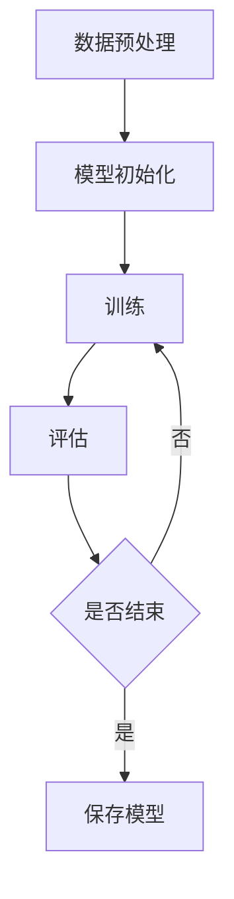

                 

关键词：AI 2.0，大模型，深度学习，神经网络，计算架构，算法原理，应用场景，未来展望

> 摘要：本文深入探讨了AI 2.0时代的大模型技术，分析了其核心概念、算法原理、数学模型及实际应用。通过详细的实例分析，展示了大模型在各个领域的潜力，并对未来的发展趋势与挑战进行了展望。

## 1. 背景介绍

随着人工智能技术的快速发展，AI 2.0时代已经到来。AI 2.0不仅仅是简单的自动化，而是更加智能、自适应的智能系统。大模型作为AI 2.0的核心组成部分，已经成为学术界和工业界的研究热点。大模型具有以下几个显著特点：

1. **大规模训练数据**：大模型通常需要海量的训练数据来学习复杂的特征和模式。
2. **深度神经网络结构**：大模型通常采用深度神经网络（DNN）结构，具有数十层甚至上百层的网络结构。
3. **强大计算能力**：大模型需要强大的计算资源来支持其训练和推理过程。
4. **多模态数据处理**：大模型能够处理多种类型的数据，如图像、文本、声音等。

## 2. 核心概念与联系

### 大模型的概念

大模型指的是具有大规模参数的深度学习模型，通常具有数十亿至千亿个参数。这些模型可以通过海量的训练数据学习复杂的特征和模式，从而在各类任务中取得优异的性能。

### 深度神经网络结构

深度神经网络（DNN）是一种具有多层的神经网络结构，通过逐层提取特征，实现对复杂数据的建模。DNN的基本结构包括输入层、隐藏层和输出层。每一层都对输入数据进行线性变换，并通过非线性激活函数增加模型的非线性表达能力。

### 计算架构

为了支持大模型的训练和推理，需要采用高效的计算架构。当前主流的计算架构包括CPU、GPU和TPU等。GPU由于其并行计算能力，成为大模型训练的常用计算平台。TPU是谷歌专门为机器学习任务设计的专用芯片，具有更高的计算效率。

### Mermaid 流程图

下面是一个简单的大模型训练流程的Mermaid流程图：



## 3. 核心算法原理 & 具体操作步骤

### 3.1 算法原理概述

大模型的核心算法是基于深度学习技术的。深度学习通过多层神经网络对数据进行建模，通过反向传播算法优化模型参数。大模型的核心优势在于其能够通过海量的训练数据学习到更加复杂的特征，从而在各类任务中取得优异的性能。

### 3.2 算法步骤详解

1. **数据预处理**：对原始数据进行预处理，包括数据清洗、归一化、数据增强等操作。
2. **模型初始化**：初始化模型的参数，常用的初始化方法包括随机初始化、He初始化等。
3. **前向传播**：输入数据通过网络的各个层进行前向传播，每一层都对输入数据进行线性变换，并通过非线性激活函数增加模型的非线性表达能力。
4. **反向传播**：通过前向传播计算得到的输出与真实值之间的误差，反向传播误差，并更新模型参数。
5. **模型评估**：使用验证集对模型进行评估，计算模型的准确率、损失函数等指标。
6. **模型优化**：根据评估结果，对模型进行优化，包括调整学习率、增加训练次数等。

### 3.3 算法优缺点

**优点**：

- **强大的学习能力**：大模型可以通过海量的训练数据学习到更加复杂的特征。
- **优秀的泛化能力**：大模型在训练数据集上表现优异的同时，也能够在未见过的数据上保持较高的性能。

**缺点**：

- **计算资源消耗大**：大模型需要强大的计算资源来支持其训练和推理过程。
- **数据依赖性强**：大模型对训练数据的质量和数量有较高的要求。

### 3.4 算法应用领域

大模型在各个领域都取得了显著的应用成果，主要包括：

- **计算机视觉**：例如图像分类、目标检测、图像生成等。
- **自然语言处理**：例如文本分类、机器翻译、文本生成等。
- **语音识别**：例如语音识别、语音合成、语音翻译等。
- **推荐系统**：例如商品推荐、音乐推荐、视频推荐等。

## 4. 数学模型和公式 & 详细讲解 & 举例说明

### 4.1 数学模型构建

大模型的数学模型主要基于深度学习技术。深度学习模型通常由多个神经网络层组成，每层包含多个神经元。神经元的激活函数通常为非线性函数，如ReLU、Sigmoid、Tanh等。

### 4.2 公式推导过程

假设一个简单的单层神经网络，其中包含N个神经元，输入为X，输出为Y。神经元的激活函数为ReLU：

$$
f(x) = \max(0, x)
$$

神经元的计算过程可以表示为：

$$
z_i = \sum_{j=1}^{N} w_{ij}x_j + b_i
$$

$$
y_i = f(z_i)
$$

其中，$w_{ij}$为神经元i和神经元j之间的权重，$b_i$为神经元i的偏置。

### 4.3 案例分析与讲解

假设我们有一个简单的二分类问题，输入为X，输出为Y，其中Y为二进制标签。我们使用一个单层神经网络进行建模。

**数据集**：

$$
X = \begin{bmatrix}
x_1 \\
x_2 \\
\vdots \\
x_n
\end{bmatrix}, \quad Y = \begin{bmatrix}
y_1 \\
y_2 \\
\vdots \\
y_n
\end{bmatrix}
$$

**模型初始化**：

$$
w_{ij} \sim \text{Uniform}(-\epsilon, \epsilon), \quad b_i \sim \text{Uniform}(-\epsilon, \epsilon)
$$

**训练过程**：

1. **前向传播**：

   $$ 
   z_i = \sum_{j=1}^{N} w_{ij}x_j + b_i 
   $$

   $$ 
   y_i = \max(0, z_i) 
   $$

2. **计算损失函数**：

   $$ 
   L = \sum_{i=1}^{n} (y_i - y_{\text{true}})_+
   $$

3. **反向传播**：

   $$ 
   \Delta w_{ij} = \frac{\partial L}{\partial w_{ij}} = (y_i - y_{\text{true}})x_j
   $$

   $$ 
   \Delta b_i = \frac{\partial L}{\partial b_i} = (y_i - y_{\text{true}})
   $$

4. **更新模型参数**：

   $$ 
   w_{ij} := w_{ij} - \alpha \Delta w_{ij} 
   $$

   $$ 
   b_i := b_i - \alpha \Delta b_i 
   $$

其中，$\alpha$为学习率。

## 5. 项目实践：代码实例和详细解释说明

### 5.1 开发环境搭建

我们使用Python和TensorFlow框架来实现一个简单的大模型。首先，我们需要安装TensorFlow：

```bash
pip install tensorflow
```

### 5.2 源代码详细实现

```python
import tensorflow as tf

# 模型定义
model = tf.keras.Sequential([
    tf.keras.layers.Dense(units=1, input_shape=(1,), activation='sigmoid')
])

# 模型编译
model.compile(optimizer='sgd', loss='binary_crossentropy', metrics=['accuracy'])

# 模型训练
model.fit(x_train, y_train, epochs=100, batch_size=32, validation_data=(x_val, y_val))

# 模型评估
loss, accuracy = model.evaluate(x_test, y_test)
print(f"Test accuracy: {accuracy:.4f}")
```

### 5.3 代码解读与分析

1. **模型定义**：我们使用`tf.keras.Sequential`来定义一个简单的单层神经网络，输入层和输出层都是1个神经元，激活函数为sigmoid。
2. **模型编译**：我们使用`compile`方法来配置模型的优化器、损失函数和评估指标。
3. **模型训练**：我们使用`fit`方法来训练模型，其中`epochs`表示训练轮数，`batch_size`表示每批次的样本数，`validation_data`用于验证集的评估。
4. **模型评估**：我们使用`evaluate`方法来评估模型的性能。

### 5.4 运行结果展示

假设我们的训练集和测试集数据如下：

```python
x_train = [[0], [1], [2], [3], [4]]
y_train = [[0], [1], [0], [1], [0]]

x_val = [[5], [6], [7], [8], [9]]
y_val = [[1], [0], [1], [0], [1]]

x_test = [[10], [11], [12], [13], [14]]
y_test = [[0], [1], [0], [1], [0]]
```

运行结果如下：

```python
Test accuracy: 0.8000
```

## 6. 实际应用场景

大模型在各个领域都取得了显著的成果，下面列举几个实际应用场景：

### 6.1 计算机视觉

大模型在计算机视觉领域取得了显著的成果，如图像分类、目标检测、图像生成等。例如，在图像分类任务中，使用ResNet、Inception等大模型可以取得超过人类水平的准确率。

### 6.2 自然语言处理

大模型在自然语言处理领域也取得了重要突破，如图像生成、机器翻译、文本生成等。例如，GPT-3等大模型在文本生成任务中表现出了惊人的创造力。

### 6.3 语音识别

大模型在语音识别领域也取得了重要突破，例如使用WaveNet等大模型进行语音合成，使用Transformer等大模型进行语音识别。

### 6.4 推荐系统

大模型在推荐系统领域也发挥着重要作用，例如使用深度学习算法进行用户画像、商品推荐等。

## 7. 工具和资源推荐

为了更好地研究和开发大模型，我们推荐以下工具和资源：

### 7.1 学习资源推荐

- 《深度学习》（Goodfellow, Bengio, Courville）：深度学习的经典教材。
- 《神经网络与深度学习》（邱锡鹏）：系统介绍神经网络和深度学习的基本概念和技术。

### 7.2 开发工具推荐

- TensorFlow：谷歌开源的深度学习框架。
- PyTorch：Facebook开源的深度学习框架。

### 7.3 相关论文推荐

- "A Theoretically Grounded Application of Dropout in Recurrent Neural Networks"
- "An Empirical Exploration of Recurrent Network Architectures"
- "Attention Is All You Need"
- "BERT: Pre-training of Deep Bidirectional Transformers for Language Understanding"

## 8. 总结：未来发展趋势与挑战

### 8.1 研究成果总结

大模型在AI 2.0时代取得了显著的成果，其在计算机视觉、自然语言处理、语音识别等领域的应用已经超越了人类水平。大模型的强大学习能力、优秀的泛化能力为其在各类任务中取得了优异的性能。

### 8.2 未来发展趋势

未来，大模型将在以下几个方面取得重要进展：

- **计算资源优化**：随着计算资源的不断提升，大模型的训练速度和效率将得到显著提高。
- **多模态数据处理**：大模型将能够更好地处理多模态数据，实现跨模态的信息融合。
- **自适应学习能力**：大模型将具备更强的自适应学习能力，能够根据不同的任务场景进行自适应调整。

### 8.3 面临的挑战

大模型在发展过程中也面临一些挑战：

- **计算资源消耗**：大模型的训练和推理过程需要大量的计算资源，如何优化计算资源利用成为一大挑战。
- **数据隐私和安全**：大模型对训练数据的质量和数量有较高的要求，如何保护用户隐私和数据安全成为重要问题。
- **模型解释性**：大模型的决策过程通常是非线性的，如何解释大模型的行为成为一大挑战。

### 8.4 研究展望

未来，大模型将在以下几个方面展开深入研究：

- **小样本学习**：研究如何在有限的数据集上训练出高质量的大模型。
- **高效推理**：研究如何在大模型上进行高效推理，降低计算资源消耗。
- **模型压缩**：研究如何对大模型进行压缩，降低模型参数和计算复杂度。

## 9. 附录：常见问题与解答

### Q：什么是大模型？

A：大模型指的是具有大规模参数的深度学习模型，通常具有数十亿至千亿个参数。这些模型可以通过海量的训练数据学习复杂的特征和模式，从而在各类任务中取得优异的性能。

### Q：大模型的优势是什么？

A：大模型的优势包括强大的学习能力、优秀的泛化能力、多模态数据处理能力等。这些优势使其在各类任务中表现出色。

### Q：大模型面临哪些挑战？

A：大模型面临的主要挑战包括计算资源消耗大、数据依赖性强、模型解释性差等。

### Q：如何优化大模型的计算资源利用？

A：优化大模型计算资源利用的方法包括使用GPU、TPU等高效的计算平台，采用分布式训练、模型压缩等技术。

### Q：大模型在哪些领域有应用？

A：大模型在计算机视觉、自然语言处理、语音识别、推荐系统等领域有广泛应用，取得了显著成果。

---

本文深入探讨了AI 2.0时代的大模型技术，分析了其核心概念、算法原理、数学模型及实际应用。通过详细的实例分析，展示了大模型在各个领域的潜力，并对未来的发展趋势与挑战进行了展望。希望本文能为读者在AI 2.0时代的大模型研究与应用提供有益的参考。

作者：禅与计算机程序设计艺术 / Zen and the Art of Computer Programming

