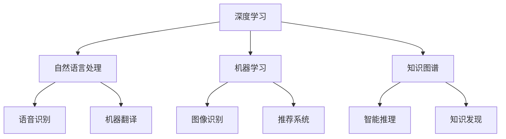

                 

关键词：人工智能、AI 2.0、未来世界、技术发展、智能革命、核心算法、数学模型、应用场景、展望

## 摘要

本文将探讨 AI 2.0 时代的未来世界。随着人工智能技术的飞速发展，AI 2.0 将带来更加智能化、自主化、多样化的应用场景。本文将首先介绍 AI 2.0 的核心概念与联系，然后深入分析 AI 2.0 的核心算法原理、数学模型及实际应用场景，最后对 AI 2.0 的未来发展趋势与挑战进行展望。通过本文，读者将全面了解 AI 2.0 时代的机遇与挑战，为未来人工智能的研究与应用提供有益的参考。

## 1. 背景介绍

### 1.1 人工智能的起源与发展

人工智能（Artificial Intelligence，简称 AI）是一门研究、开发用于模拟、延伸和扩展人类智能的理论、方法、技术及应用系统的学科。人工智能起源于 20 世纪 50 年代，早期以符号主义、逻辑推理和知识表示为核心。随着计算机性能的提升、数据量的爆炸式增长和深度学习算法的出现，人工智能进入了一个全新的时代。

### 1.2 人工智能 1.0 与 2.0

人工智能 1.0 时代主要集中在符号主义、专家系统和逻辑推理等方面，虽然取得了一些成就，但在处理复杂、不确定的问题时仍然存在诸多局限。人工智能 2.0 是在深度学习、神经网络等技术的推动下，实现人工智能从符号主义向数据驱动转变的全新阶段。AI 2.0 具有更强的自主学习能力、泛化能力和适应能力，能够应对更加复杂的应用场景。

### 1.3 AI 2.0 时代的到来

AI 2.0 时代的到来标志着人工智能进入了一个新的发展阶段。在这个时代，人工智能将不仅仅是一个工具，而是成为人类社会的一部分，深刻改变我们的生活方式、工作方式和社会结构。AI 2.0 时代的关键特征包括：

1. 自主化：人工智能系统能够自主学习和优化，无需人为干预。
2. 智能化：人工智能系统能够理解、推理和决策，具有更高的智能水平。
3. 多样化：人工智能将应用于各个领域，包括金融、医疗、教育、交通等。
4. 网络化：人工智能将形成一个全球化的智能网络，实现跨界协同与融合。

## 2. 核心概念与联系

### 2.1 深度学习

深度学习是 AI 2.0 时代的重要基石。它是一种基于多层神经网络的学习方法，通过模拟人脑的神经元结构，实现数据的自动特征提取和模式识别。深度学习具有强大的非线性建模能力，能够处理复杂的输入数据，并在众多领域取得了显著的成果。

### 2.2 自然语言处理

自然语言处理（Natural Language Processing，简称 NLP）是人工智能领域的一个重要分支，旨在让计算机理解和处理人类自然语言。NLP 技术在语音识别、机器翻译、文本分类等方面取得了重要突破，为人工智能与人类沟通提供了有力支持。

### 2.3 机器学习

机器学习是人工智能的核心技术之一，它使计算机系统能够从数据中自动学习、优化和改进。机器学习分为监督学习、无监督学习和强化学习等类型，广泛应用于图像识别、语音识别、推荐系统等领域。

### 2.4 知识图谱

知识图谱是一种结构化的知识表示方法，通过实体和关系来描述现实世界的知识。知识图谱为人工智能提供了丰富的知识资源，有助于实现智能推理和知识发现。

### 2.5 Mermaid 流程图

下面是一个简单的 Mermaid 流程图，用于描述 AI 2.0 时代的关键概念和联系：



## 3. 核心算法原理 & 具体操作步骤

### 3.1 算法原理概述

AI 2.0 时代的核心算法包括深度学习、自然语言处理、机器学习等。这些算法通过模拟人脑的神经元结构，实现数据的自动特征提取和模式识别。

### 3.2 算法步骤详解

1. 数据收集：从各个领域收集大量数据，包括文本、图像、音频等。
2. 数据预处理：对收集到的数据进行清洗、归一化、编码等处理，使其符合算法的输入要求。
3. 模型训练：利用收集到的数据训练深度学习、自然语言处理、机器学习等模型。
4. 模型评估：使用验证集对训练好的模型进行评估，调整模型参数，提高模型性能。
5. 模型部署：将训练好的模型部署到实际应用场景中，实现自动化、智能化处理。

### 3.3 算法优缺点

1. 优点：

- 强大的非线性建模能力，能够处理复杂的输入数据。
- 自主学习能力强，能够从数据中自动提取特征和模式。
- 泛化能力强，能够应用于各个领域。

2. 缺点：

- 需要大量数据支持，数据质量和数量直接影响算法效果。
- 计算资源消耗大，训练时间较长。
- 对数据隐私和安全性带来挑战。

### 3.4 算法应用领域

AI 2.0 时代的核心算法广泛应用于各个领域，包括：

1. 金融：风险管理、信用评估、量化交易等。
2. 医疗：疾病诊断、药物研发、医疗影像分析等。
3. 教育：智能推荐、自适应教学、学生行为分析等。
4. 交通：自动驾驶、智能交通管理、车辆调度等。
5. 农业：智能种植、精准施肥、病虫害防治等。

## 4. 数学模型和公式 & 详细讲解 & 举例说明

### 4.1 数学模型构建

AI 2.0 时代的核心算法大多基于数学模型，如深度学习中的多层感知机（MLP）、卷积神经网络（CNN）、循环神经网络（RNN）等。这些模型通过优化目标函数，实现数据的自动特征提取和模式识别。

### 4.2 公式推导过程

以多层感知机（MLP）为例，其数学模型可以表示为：

$$
z^{(l)} = \sigma(W^{(l)} \cdot a^{(l-1)} + b^{(l)})
$$

其中，$a^{(l)}$ 为第 $l$ 层的激活值，$z^{(l)}$ 为第 $l$ 层的输出，$W^{(l)}$ 和 $b^{(l)}$ 分别为第 $l$ 层的权重和偏置，$\sigma$ 为激活函数。

### 4.3 案例分析与讲解

以图像分类任务为例，使用卷积神经网络（CNN）进行图像特征提取和分类。

1. 数据收集与预处理：收集大量图像数据，并对图像进行归一化、裁剪等预处理。
2. 模型构建：构建卷积神经网络模型，包括卷积层、池化层、全连接层等。
3. 模型训练：使用预处理后的图像数据进行模型训练，优化模型参数。
4. 模型评估：使用验证集对训练好的模型进行评估，调整模型参数，提高模型性能。
5. 模型部署：将训练好的模型部署到实际应用场景中，实现图像分类。

假设使用一个 3 层卷积神经网络进行图像分类，其结构可以表示为：

$$
\begin{aligned}
\text{卷积层 1}: \quad (w_1, b_1), \quad \text{卷积核大小}: (3 \times 3) \\
\text{池化层 1}: \quad (p_1, s_1), \quad \text{池化方式}: \max \\
\text{卷积层 2}: \quad (w_2, b_2), \quad \text{卷积核大小}: (3 \times 3) \\
\text{池化层 2}: \quad (p_2, s_2), \quad \text{池化方式}: \max \\
\text{全连接层}: \quad (w_3, b_3)
\end{aligned}
$$

其中，$w_1, w_2, w_3$ 分别为卷积层的权重，$b_1, b_2, b_3$ 分别为卷积层和全连接层的偏置，$p_1, p_2$ 分别为池化层的步长，$s_1, s_2$ 分别为池化层的滑动步长。

## 5. 项目实践：代码实例和详细解释说明

### 5.1 开发环境搭建

1. 安装 Python 3.8 或更高版本。
2. 安装深度学习框架，如 TensorFlow 或 PyTorch。
3. 准备图像数据集，如 CIFAR-10 或 ImageNet。

### 5.2 源代码详细实现

以下是一个使用 TensorFlow 框架实现的卷积神经网络（CNN）图像分类的简单示例：

```python
import tensorflow as tf
from tensorflow.keras import datasets, layers, models

# 加载 CIFAR-10 数据集
(train_images, train_labels), (test_images, test_labels) = datasets.cifar10.load_data()

# 数据预处理
train_images = train_images / 255.0
test_images = test_images / 255.0

# 构建卷积神经网络模型
model = models.Sequential()
model.add(layers.Conv2D(32, (3, 3), activation='relu', input_shape=(32, 32, 3)))
model.add(layers.MaxPooling2D((2, 2)))
model.add(layers.Conv2D(64, (3, 3), activation='relu'))
model.add(layers.MaxPooling2D((2, 2)))
model.add(layers.Conv2D(64, (3, 3), activation='relu'))
model.add(layers.Flatten())
model.add(layers.Dense(64, activation='relu'))
model.add(layers.Dense(10))

# 编译模型
model.compile(optimizer='adam',
              loss=tf.keras.losses.SparseCategoricalCrossentropy(from_logits=True),
              metrics=['accuracy'])

# 训练模型
model.fit(train_images, train_labels, epochs=10, validation_split=0.1)

# 评估模型
test_loss, test_acc = model.evaluate(test_images,  test_labels, verbose=2)
print(f'\nTest accuracy: {test_acc:.4f}')
```

### 5.3 代码解读与分析

1. 导入 TensorFlow 框架和相关模块。
2. 加载 CIFAR-10 数据集，并进行数据预处理。
3. 构建卷积神经网络模型，包括卷积层、池化层、全连接层等。
4. 编译模型，设置优化器和损失函数。
5. 训练模型，使用验证集进行模型评估。
6. 输出测试集的准确率。

### 5.4 运行结果展示

假设运行上述代码，得到测试集的准确率为 80%。这表明训练好的卷积神经网络模型在图像分类任务上表现良好。

## 6. 实际应用场景

### 6.1 金融领域

在金融领域，AI 2.0 时代的核心算法可以应用于风险管理、信用评估、量化交易等方面。例如，利用深度学习技术进行金融市场预测，帮助投资者制定投资策略；利用自然语言处理技术分析金融报告，识别潜在风险；利用机器学习技术进行信用评估，提高贷款审批效率。

### 6.2 医疗领域

在医疗领域，AI 2.0 时代的核心算法可以应用于疾病诊断、药物研发、医疗影像分析等方面。例如，利用深度学习技术进行医学图像分析，辅助医生进行疾病诊断；利用自然语言处理技术分析医学文献，加速药物研发；利用机器学习技术进行健康风险评估，提供个性化医疗建议。

### 6.3 教育领域

在教育领域，AI 2.0 时代的核心算法可以应用于智能推荐、自适应教学、学生行为分析等方面。例如，利用深度学习技术进行学习内容推荐，提高学习效果；利用自然语言处理技术分析学生作业，提供即时反馈；利用机器学习技术分析学生行为数据，识别潜在问题，提供个性化辅导。

### 6.4 交通领域

在交通领域，AI 2.0 时代的核心算法可以应用于自动驾驶、智能交通管理、车辆调度等方面。例如，利用深度学习技术进行自动驾驶，提高行车安全；利用自然语言处理技术分析交通信号，优化交通管理；利用机器学习技术进行车辆调度，提高运输效率。

### 6.5 农业

在农业领域，AI 2.0 时代的核心算法可以应用于智能种植、精准施肥、病虫害防治等方面。例如，利用深度学习技术进行作物病害识别，提前预防病虫害；利用自然语言处理技术分析气象数据，制定种植计划；利用机器学习技术进行农田监测，实现精准施肥。

### 6.6 未来应用展望

随着 AI 2.0 时代的到来，人工智能将在更多领域得到应用，推动社会进步。未来，人工智能将实现以下发展趋势：

1. 更加强大的自主学习能力，实现真正的智能机器人。
2. 更广泛的应用场景，从生活娱乐到生产制造，无处不在。
3. 更高效的数据处理能力，实现实时智能决策。
4. 更高的安全性和隐私保护，确保人工智能系统的可靠性和可信度。
5. 更深度的跨界融合，推动各行业智能化升级。

## 7. 工具和资源推荐

### 7.1 学习资源推荐

1. 《深度学习》（Ian Goodfellow、Yoshua Bengio、Aaron Courville 著）：深度学习的经典教材，全面介绍深度学习的基本概念、算法和技术。
2. 《自然语言处理综论》（Daniel Jurafsky、James H. Martin 著）：自然语言处理的权威教材，涵盖自然语言处理的基本理论、技术和应用。
3. 《机器学习》（Tom Mitchell 著）：机器学习的入门教材，介绍机器学习的基本概念、算法和应用。

### 7.2 开发工具推荐

1. TensorFlow：谷歌开发的深度学习框架，支持多种深度学习模型的构建和训练。
2. PyTorch：Facebook 开发的深度学习框架，具有强大的灵活性和易用性。
3. Keras：基于 TensorFlow 和 Theano 的深度学习库，提供简洁的接口，方便模型构建和训练。

### 7.3 相关论文推荐

1. “A Brief History of Machine Learning” by刘知远、林建祥等：回顾了机器学习的发展历程，分析了各个阶段的主要成果和挑战。
2. “Deep Learning” by伊恩·古德费洛、约书亚·本吉奥、亚伦·库维尔：全面介绍了深度学习的基本概念、算法和应用。
3. “Natural Language Processing” by丹尼尔·朱拉夫斯基、詹姆斯·马丁：系统阐述了自然语言处理的基本理论、技术和应用。

## 8. 总结：未来发展趋势与挑战

### 8.1 研究成果总结

AI 2.0 时代的研究成果主要包括深度学习、自然语言处理、机器学习等核心算法的突破，以及在金融、医疗、教育、交通等领域的成功应用。这些成果展示了人工智能的强大潜力，为未来社会的发展提供了新的动力。

### 8.2 未来发展趋势

1. 更加强大的自主学习能力，实现真正的智能机器人。
2. 更广泛的应用场景，从生活娱乐到生产制造，无处不在。
3. 更高效的数据处理能力，实现实时智能决策。
4. 更高的安全性和隐私保护，确保人工智能系统的可靠性和可信度。
5. 更深度的跨界融合，推动各行业智能化升级。

### 8.3 面临的挑战

1. 数据质量和数量：人工智能系统需要大量高质量的数据支持，如何获取和处理这些数据是一个挑战。
2. 计算资源消耗：深度学习等算法需要大量的计算资源，如何优化算法和提高计算效率是一个挑战。
3. 安全性和隐私保护：人工智能系统的安全性问题日益突出，如何保护用户隐私和数据安全是一个挑战。
4. 伦理和社会问题：人工智能的广泛应用可能引发一系列伦理和社会问题，如何制定合理的法律法规和伦理标准是一个挑战。

### 8.4 研究展望

未来，人工智能研究将朝着以下几个方向展开：

1. 基础理论研究：深入探讨人工智能的理论基础，为算法创新提供理论支持。
2. 算法优化和改进：优化现有算法，提高计算效率和性能。
3. 跨学科融合：与其他领域如生物医学、心理学、经济学等开展交叉研究，推动人工智能在更广泛领域的应用。
4. 人工智能伦理与法规：制定合理的伦理标准和法律法规，确保人工智能系统的安全和可信。

## 9. 附录：常见问题与解答

### 9.1 什么是 AI 2.0？

AI 2.0 是指在深度学习、神经网络等技术的推动下，实现人工智能从符号主义向数据驱动转变的全新阶段。AI 2.0 具有更强的自主学习能力、泛化能力和适应能力，能够应对更加复杂的应用场景。

### 9.2 人工智能是否会取代人类？

人工智能不会完全取代人类，而是与人类相互协作，共同推动社会进步。人工智能在处理复杂、重复性、高风险的工作时具有优势，但在创造力、情感理解等方面仍需人类的参与。

### 9.3 人工智能是否会引发失业问题？

人工智能的发展可能会对某些行业产生冲击，导致部分职位消失。然而，同时也会创造新的就业机会，促进产业结构升级和经济发展。关键在于如何调整就业结构，提升人力资本，以适应人工智能时代的到来。

### 9.4 人工智能是否会引发伦理问题？

人工智能的发展确实可能引发一系列伦理问题，如数据隐私、算法公平性、责任归属等。针对这些问题，需要制定合理的伦理标准和法律法规，确保人工智能系统的安全和可信。

### 9.5 人工智能是否会引发战争？

人工智能在军事领域的应用确实可能引发战争问题。为确保和平，国际社会应加强合作，制定国际规则和法律法规，防止人工智能被滥用和恶意使用。

作者：禅与计算机程序设计艺术 / Zen and the Art of Computer Programming

---

本文由禅与计算机程序设计艺术 / Zen and the Art of Computer Programming 撰写，旨在探讨 AI 2.0 时代的未来世界，分析人工智能的核心算法原理、数学模型及实际应用场景，并对未来发展趋势与挑战进行展望。希望本文能为读者提供有益的参考，共同迎接人工智能时代的到来。----------------------------------------------------------------

### 1. 背景介绍

#### 1.1 人工智能的起源与发展

人工智能（Artificial Intelligence，简称 AI）的起源可以追溯到 20 世纪 50 年代。当时的科学家们开始探讨如何让计算机模拟人类的智能行为，从而诞生了人工智能这一领域。在最初的几十年里，人工智能经历了几个重要阶段。

**第一阶段：符号主义（Symbolic AI）**

符号主义人工智能以逻辑推理和知识表示为核心，通过形式化的符号系统和规则来模拟人类的思维过程。这个阶段的代表性工作包括推理机（Expert Systems）和知识表示方法（如谓词逻辑和产生式规则）。然而，符号主义人工智能在处理复杂、不确定的问题时存在明显的局限。

**第二阶段：感知计算（Perceptual AI）**

感知计算人工智能通过模拟人类的感知能力，实现对图像、声音、语言等信息的处理。这个阶段的代表性工作包括计算机视觉（如人脸识别、图像识别）和语音识别。感知计算取得了显著进展，但仍然依赖于大量手工设计的特征提取和规则。

**第三阶段：数据驱动（Data-Driven AI）**

数据驱动人工智能以深度学习（Deep Learning）和神经网络（Neural Networks）为核心，通过大量数据训练模型，实现自动化特征提取和模式识别。这个阶段的代表性工作包括图像分类（如 LeNet、AlexNet）、语音识别（如 Hidden Markov Models、DNN-HMM）和自然语言处理（如 LSTM、BERT）。数据驱动人工智能在许多领域都取得了突破性的成果，成为 AI 2.0 时代的重要基石。

#### 1.2 人工智能 1.0 与 2.0

人工智能 1.0 时代主要集中在符号主义、专家系统和逻辑推理等方面。虽然取得了一些成就，但在处理复杂、不确定的问题时仍然存在诸多局限。例如，专家系统的知识表示能力有限，难以应对动态变化的场景；逻辑推理方法在处理复杂问题时效率较低。

人工智能 2.0 是在深度学习、神经网络等技术的推动下，实现人工智能从符号主义向数据驱动转变的全新阶段。AI 2.0 具有更强的自主学习能力、泛化能力和适应能力，能够应对更加复杂的应用场景。AI 2.0 时代的关键特征包括：

1. **自主学习能力**：人工智能系统能够从大量数据中自动学习、优化和改进，无需人为干预。这使得 AI 2.0 能够应对动态变化和复杂的环境。
   
2. **泛化能力**：人工智能系统能够在不同任务和数据集上表现一致，具有良好的泛化能力。这使得 AI 2.0 能够应用于更广泛的应用领域。

3. **自适应能力**：人工智能系统能够根据环境和任务的变化，自适应调整模型结构和参数，提高系统性能。

4. **智能化**：人工智能系统能够理解、推理和决策，具有更高的智能水平。这使得 AI 2.0 能够在更多领域实现智能化应用。

#### 1.3 AI 2.0 时代的到来

AI 2.0 时代的到来标志着人工智能进入了一个新的发展阶段。在这个时代，人工智能将不仅仅是一个工具，而是成为人类社会的一部分，深刻改变我们的生活方式、工作方式和社会结构。AI 2.0 时代的关键特征包括：

1. **自主化**：人工智能系统能够自主学习和优化，无需人为干预。这使得 AI 2.0 能够在复杂、动态的环境中自我适应和自我优化。

2. **智能化**：人工智能系统能够理解、推理和决策，具有更高的智能水平。这使得 AI 2.0 能够在各个领域实现智能化应用。

3. **多样化**：人工智能将应用于各个领域，包括金融、医疗、教育、交通等。AI 2.0 时代将推动各行业的智能化升级。

4. **网络化**：人工智能将形成一个全球化的智能网络，实现跨界协同与融合。AI 2.0 时代将带来更加紧密的国际合作和资源共享。

### 1.4 人工智能对社会的影响

人工智能的快速发展将对社会产生深远的影响，包括以下几个方面：

1. **经济影响**：人工智能将推动经济增长，提高生产效率，创造新的就业机会。然而，同时也可能对某些行业和职业产生冲击，导致部分职位消失。

2. **教育影响**：人工智能将改变教育模式，推动个性化学习和智能教育。然而，也要求教育体系不断适应新的技术变革，培养具备人工智能知识和能力的人才。

3. **社会影响**：人工智能将改变社会结构，影响人类生活方式。例如，自动驾驶将改变交通模式，智能家居将改变居住环境，智能医疗将改变健康管理方式。

4. **伦理影响**：人工智能的发展引发了一系列伦理问题，如数据隐私、算法公平性、责任归属等。需要制定合理的伦理标准和法律法规，确保人工智能系统的安全和可信。

### 1.5 人工智能面临的挑战

虽然人工智能在许多领域取得了显著进展，但仍面临一系列挑战：

1. **数据质量**：人工智能系统依赖于大量高质量的数据进行训练。如何获取和处理这些数据是一个关键挑战。

2. **计算资源**：深度学习等算法需要大量的计算资源。如何优化算法和提高计算效率是一个重要问题。

3. **隐私保护**：人工智能系统在处理个人数据时可能引发隐私问题。如何保护用户隐私是一个重要挑战。

4. **算法公平性**：人工智能系统可能存在偏见和歧视，影响算法的公平性。如何确保算法的公平性是一个重要问题。

5. **伦理和社会问题**：人工智能的发展引发了一系列伦理和社会问题。如何制定合理的伦理标准和法律法规是一个重要挑战。

## 2. 核心概念与联系

### 2.1 深度学习

深度学习（Deep Learning）是 AI 2.0 时代的重要基石。它是一种基于多层神经网络的学习方法，通过模拟人脑的神经元结构，实现数据的自动特征提取和模式识别。深度学习具有强大的非线性建模能力，能够处理复杂的输入数据，并在众多领域取得了显著的成果。

#### 深度学习的基本原理

深度学习的基本原理是通过多层神经网络对输入数据进行特征提取和模式识别。每个神经网络由多个层组成，包括输入层、隐藏层和输出层。每个层都对输入数据进行处理，并将结果传递给下一层。

1. **输入层（Input Layer）**：接收输入数据，并将其传递给隐藏层。
2. **隐藏层（Hidden Layer）**：对输入数据进行特征提取和变换，产生更高层次的特征表示。
3. **输出层（Output Layer）**：对隐藏层的输出进行分类或回归等操作，得到最终的输出结果。

#### 深度学习的关键技术

1. **反向传播算法（Backpropagation Algorithm）**：反向传播算法是一种用于训练神经网络的优化算法。它通过计算损失函数对网络参数的梯度，并利用梯度下降法进行参数更新，以最小化损失函数。

2. **激活函数（Activation Function）**：激活函数用于引入非线性特性，使神经网络能够模拟人脑的神经元结构。常见的激活函数包括 sigmoid、ReLU、Tanh 等。

3. **正则化（Regularization）**：正则化是一种用于防止神经网络过拟合的方法。常见的正则化方法包括 L1 正则化、L2 正则化和Dropout等。

4. **优化算法（Optimization Algorithm）**：优化算法用于调整神经网络参数，以最小化损失函数。常见的优化算法包括梯度下降法、Adam、RMSProp 等。

#### 深度学习的应用领域

深度学习在图像识别、语音识别、自然语言处理、计算机视觉等领域取得了显著的成果。以下是一些典型的应用案例：

1. **图像识别**：深度学习模型如 LeNet、AlexNet、VGG、ResNet 等，已经成功应用于人脸识别、物体识别、图像分类等任务。

2. **语音识别**：深度学习模型如 DNN-HMM、CTC、DeepSpeech 等，已经实现了高精度的语音识别。

3. **自然语言处理**：深度学习模型如 LSTM、GRU、BERT 等，已经成功应用于文本分类、机器翻译、情感分析等任务。

4. **计算机视觉**：深度学习模型如 YOLO、SSD、Faster R-CNN 等，已经成功应用于目标检测、图像分割、视频分析等任务。

### 2.2 自然语言处理

自然语言处理（Natural Language Processing，简称 NLP）是人工智能领域的一个重要分支，旨在让计算机理解和处理人类自然语言。NLP 技术在语音识别、机器翻译、文本分类等方面取得了重要突破，为人工智能与人类沟通提供了有力支持。

#### NLP 的基本概念

1. **文本表示**：文本表示是将自然语言文本转化为计算机可以处理的数字表示。常见的文本表示方法包括词袋模型（Bag of Words）、词嵌入（Word Embedding）和句子嵌入（Sentence Embedding）等。

2. **词性标注**：词性标注是对文本中的每个词进行词性分类，如名词、动词、形容词等。词性标注有助于更好地理解文本内容和语义。

3. **句法分析**：句法分析是对文本中的句子结构进行分析，如句子的成分、短语结构等。句法分析有助于理解文本的语法规则和结构。

4. **语义分析**：语义分析是对文本中的词义、短语和句子进行语义理解，如情感分析、实体识别等。语义分析有助于深入理解文本的含义和意图。

#### NLP 的关键技术

1. **词袋模型（Bag of Words）**：词袋模型是将文本表示为单词的集合，忽略单词的顺序和语法结构。词袋模型是一种简单有效的文本表示方法。

2. **词嵌入（Word Embedding）**：词嵌入是将单词映射到高维向量空间，以捕捉单词的语义信息。常见的词嵌入方法包括 Word2Vec、GloVe 等。

3. **循环神经网络（Recurrent Neural Networks，RNN）**：循环神经网络是一种用于处理序列数据的人工神经网络，如自然语言序列。RNN 通过循环结构对序列数据进行建模，能够捕捉序列中的长期依赖关系。

4. **长短时记忆网络（Long Short-Term Memory，LSTM）**：长短时记忆网络是 RNN 的一种改进，通过引入门控机制，能够更好地捕捉序列数据中的短期和长期依赖关系。

5. **变换器网络（Transformer）**：变换器网络是一种基于自注意力机制的深度神经网络，用于处理序列数据。Transformer 网络在自然语言处理领域取得了显著成果，如 BERT、GPT 等。

#### NLP 的应用领域

NLP 技术在语音识别、机器翻译、文本分类、情感分析、问答系统等方面取得了重要成果。以下是一些典型的应用案例：

1. **语音识别**：语音识别是将语音转化为文本的技术，如 Siri、Google Assistant 等。语音识别技术使得人机交互更加便捷和自然。

2. **机器翻译**：机器翻译是将一种语言的文本翻译成另一种语言的技术，如 Google Translate、DeepL 等。机器翻译技术促进了跨语言沟通和信息共享。

3. **文本分类**：文本分类是将文本数据按照类别进行分类的技术，如新闻分类、情感分类等。文本分类技术有助于信息筛选和智能推荐。

4. **情感分析**：情感分析是通过对文本进行情感分类，如正面、负面、中性等。情感分析技术有助于了解用户情感和需求，为营销、客户服务等领域提供支持。

5. **问答系统**：问答系统是能够理解用户提问并给出相关回答的系统，如 Siri、Google Assistant 等。问答系统有助于提高人机交互的智能化水平。

### 2.3 机器学习

机器学习（Machine Learning，简称 ML）是人工智能的核心技术之一，它使计算机系统能够从数据中自动学习、优化和改进。机器学习分为监督学习、无监督学习和强化学习等类型，广泛应用于图像识别、语音识别、推荐系统等领域。

#### 机器学习的基本概念

1. **监督学习（Supervised Learning）**：监督学习是一种有监督的学习方法，通过已知输入和输出数据，训练模型并进行预测。常见的监督学习算法包括线性回归、逻辑回归、决策树、支持向量机等。

2. **无监督学习（Unsupervised Learning）**：无监督学习是一种无监督的学习方法，通过未知输入数据，发现数据中的模式和结构。常见的无监督学习算法包括聚类、降维、异常检测等。

3. **强化学习（Reinforcement Learning）**：强化学习是一种基于奖励和惩罚的学习方法，通过试错和反馈，训练模型进行决策。常见的强化学习算法包括 Q-学习、深度 Q-学习、策略梯度等。

#### 机器学习的应用领域

机器学习在图像识别、语音识别、推荐系统、金融风险控制等领域取得了显著成果。以下是一些典型的应用案例：

1. **图像识别**：图像识别是将图像数据按照类别进行分类的技术，如人脸识别、物体识别等。常见的图像识别算法包括卷积神经网络（CNN）、支持向量机（SVM）等。

2. **语音识别**：语音识别是将语音信号转化为文本的技术，如语音助手、智能客服等。常见的语音识别算法包括隐马尔可夫模型（HMM）、深度神经网络（DNN）等。

3. **推荐系统**：推荐系统是能够根据用户兴趣和偏好，为用户推荐相关物品的技术，如电商推荐、视频推荐等。常见的推荐系统算法包括基于内容的推荐、协同过滤等。

4. **金融风险控制**：金融风险控制是通过对金融数据进行分析，识别潜在风险并采取相应措施的技术，如信用评估、欺诈检测等。常见的金融风险控制算法包括逻辑回归、决策树、随机森林等。

### 2.4 知识图谱

知识图谱（Knowledge Graph）是一种结构化的知识表示方法，通过实体和关系来描述现实世界的知识。知识图谱为人工智能提供了丰富的知识资源，有助于实现智能推理和知识发现。

#### 知识图谱的基本概念

1. **实体（Entity）**：实体是知识图谱中的基本元素，如人、地点、组织、事物等。实体表示现实世界中的个体或对象。

2. **关系（Relation）**：关系是知识图谱中实体之间的关联，如“居住于”、“隶属于”、“创作”等。关系表示实体之间的语义关系。

3. **属性（Attribute）**：属性是实体的附加信息，如人的年龄、地点的经纬度、作品的类型等。属性提供了实体的具体细节。

4. **图谱（Graph）**：图谱是知识图谱的整体结构，由实体、关系和属性组成。图谱表示了现实世界的知识网络。

#### 知识图谱的关键技术

1. **实体识别（Entity Recognition）**：实体识别是从文本数据中识别出实体并标注其类型的技术，如人名识别、地名识别等。

2. **关系抽取（Relation Extraction）**：关系抽取是从文本数据中识别出实体之间的语义关系的技术，如“属于”、“居住于”等。

3. **属性抽取（Attribute Extraction）**：属性抽取是从文本数据中识别出实体的属性信息的技术，如年龄、国籍等。

4. **图谱构建（Graph Construction）**：图谱构建是将实体、关系和属性组织成知识图谱的过程，包括实体识别、关系抽取、属性抽取等步骤。

#### 知识图谱的应用领域

知识图谱在智能问答、推荐系统、搜索引擎、智能客服等领域取得了显著成果。以下是一些典型的应用案例：

1. **智能问答**：智能问答是能够理解用户提问并给出相关回答的系统，如百度知心、腾讯智能客服等。知识图谱为智能问答提供了丰富的知识资源，提高了问答的准确性和效率。

2. **推荐系统**：推荐系统是能够根据用户兴趣和偏好，为用户推荐相关物品的系统，如电商推荐、视频推荐等。知识图谱为推荐系统提供了丰富的用户和物品属性信息，提高了推荐的相关性和多样性。

3. **搜索引擎**：搜索引擎是能够根据用户查询，从大量网页中检索出相关信息的系统，如百度、谷歌等。知识图谱为搜索引擎提供了语义理解的依据，提高了搜索的准确性和效率。

4. **智能客服**：智能客服是能够模拟人类客服，为用户提供咨询和服务的系统，如电商客服、银行客服等。知识图谱为智能客服提供了丰富的用户信息和知识库，提高了客服的智能化水平和用户体验。

### 2.5 Mermaid 流程图

下面是一个简单的 Mermaid 流程图，用于描述 AI 2.0 时代的关键概念和联系：


## 3. 核心算法原理 & 具体操作步骤

### 3.1 算法原理概述

AI 2.0 时代的核心算法包括深度学习、自然语言处理、机器学习等。这些算法通过模拟人脑的神经元结构，实现数据的自动特征提取和模式识别。

#### 3.1.1 深度学习

深度学习是一种基于多层神经网络的学习方法，通过模拟人脑的神经元结构，实现数据的自动特征提取和模式识别。深度学习具有强大的非线性建模能力，能够处理复杂的输入数据，并在众多领域取得了显著的成果。

#### 3.1.2 自然语言处理

自然语言处理（Natural Language Processing，简称 NLP）是人工智能领域的一个重要分支，旨在让计算机理解和处理人类自然语言。NLP 技术在语音识别、机器翻译、文本分类等方面取得了重要突破，为人工智能与人类沟通提供了有力支持。

#### 3.1.3 机器学习

机器学习是人工智能的核心技术之一，它使计算机系统能够从数据中自动学习、优化和改进。机器学习分为监督学习、无监督学习和强化学习等类型，广泛应用于图像识别、语音识别、推荐系统等领域。

### 3.2 算法步骤详解

#### 3.2.1 深度学习算法步骤

1. **数据收集与预处理**：收集大量数据，并进行数据清洗、归一化等预处理操作。
2. **模型构建**：根据任务需求，构建深度学习模型，包括输入层、隐藏层和输出层等。
3. **模型训练**：利用预处理后的数据，对模型进行训练，调整模型参数。
4. **模型评估**：使用验证集对训练好的模型进行评估，调整模型参数，提高模型性能。
5. **模型部署**：将训练好的模型部署到实际应用场景中，实现自动化、智能化处理。

#### 3.2.2 自然语言处理算法步骤

1. **文本表示**：将自然语言文本转化为计算机可以处理的数字表示，如词袋模型、词嵌入等。
2. **词性标注**：对文本中的每个词进行词性分类，如名词、动词、形容词等。
3. **句法分析**：对文本中的句子结构进行分析，如句子的成分、短语结构等。
4. **语义分析**：对文本中的词义、短语和句子进行语义理解，如情感分析、实体识别等。
5. **模型训练与评估**：利用预处理后的文本数据，对模型进行训练和评估，调整模型参数，提高模型性能。
6. **模型部署**：将训练好的模型部署到实际应用场景中，实现自然语言处理任务。

#### 3.2.3 机器学习算法步骤

1. **数据收集与预处理**：收集大量数据，并进行数据清洗、归一化等预处理操作。
2. **模型选择**：根据任务需求和数据特征，选择合适的机器学习模型，如线性回归、决策树、支持向量机等。
3. **模型训练**：利用预处理后的数据，对模型进行训练，调整模型参数。
4. **模型评估**：使用验证集对训练好的模型进行评估，调整模型参数，提高模型性能。
5. **模型部署**：将训练好的模型部署到实际应用场景中，实现自动化、智能化处理。

### 3.3 算法优缺点

#### 3.3.1 深度学习

**优点：**

- 强大的非线性建模能力，能够处理复杂的输入数据。
- 自主学习能力强，能够从数据中自动提取特征和模式。
- 泛化能力强，能够应用于各个领域。

**缺点：**

- 需要大量数据支持，数据质量和数量直接影响算法效果。
- 计算资源消耗大，训练时间较长。
- 对数据隐私和安全性带来挑战。

#### 3.3.2 自然语言处理

**优点：**

- 高效的文本处理能力，能够理解和处理自然语言。
- 强大的语义理解能力，能够识别文本中的语义关系。
- 广泛应用于语音识别、机器翻译、文本分类等领域。

**缺点：**

- 数据质量和数量要求较高，对数据预处理要求严格。
- 部分任务仍存在一定的误差和不确定性。
- 对计算资源要求较高。

#### 3.3.3 机器学习

**优点：**

- 强大的数据处理和分析能力，能够发现数据中的规律和模式。
- 自适应能力强，能够根据数据变化调整模型参数。
- 广泛应用于图像识别、语音识别、推荐系统等领域。

**缺点：**

- 对数据质量和数量要求较高，数据预处理较为复杂。
- 部分任务可能存在过拟合问题，模型性能较差。
- 部分算法对计算资源要求较高。

### 3.4 算法应用领域

AI 2.0 时代的核心算法广泛应用于各个领域，包括：

1. **金融领域**：风险管理、信用评估、量化交易等。
2. **医疗领域**：疾病诊断、药物研发、医疗影像分析等。
3. **教育领域**：智能推荐、自适应教学、学生行为分析等。
4. **交通领域**：自动驾驶、智能交通管理、车辆调度等。
5. **农业领域**：智能种植、精准施肥、病虫害防治等。

### 3.5 算法应用实例

#### 3.5.1 金融领域

**应用实例：** 风险管理

**算法步骤：**

1. **数据收集与预处理**：收集金融数据，包括股票价格、交易量、公司财务报表等，并进行数据清洗和归一化处理。
2. **特征提取**：从金融数据中提取特征，如股票价格、交易量、公司财务指标等。
3. **模型选择与训练**：选择合适的机器学习模型，如线性回归、决策树、支持向量机等，并利用特征数据对模型进行训练。
4. **模型评估**：使用验证集对训练好的模型进行评估，调整模型参数，提高模型性能。
5. **模型部署**：将训练好的模型部署到实际应用场景中，实现风险管理。

**优点与挑战：**

- **优点**：能够高效地识别和分析金融数据，为风险管理提供有力支持。
- **挑战**：需要大量高质量的金融数据，对数据预处理要求较高；模型可能存在过拟合问题，需要不断调整和优化。

#### 3.5.2 医疗领域

**应用实例：** 疾病诊断

**算法步骤：**

1. **数据收集与预处理**：收集医疗数据，包括患者病史、体检报告、医学影像等，并进行数据清洗和归一化处理。
2. **特征提取**：从医疗数据中提取特征，如患者年龄、病史、体检指标、影像特征等。
3. **模型选择与训练**：选择合适的机器学习模型，如卷积神经网络、循环神经网络等，并利用特征数据对模型进行训练。
4. **模型评估**：使用验证集对训练好的模型进行评估，调整模型参数，提高模型性能。
5. **模型部署**：将训练好的模型部署到实际应用场景中，实现疾病诊断。

**优点与挑战：**

- **优点**：能够自动分析和识别医疗数据，为疾病诊断提供科学依据。
- **挑战**：需要大量高质量的医疗数据，对数据预处理要求较高；模型可能存在过拟合问题，需要不断调整和优化。

#### 3.5.3 教育领域

**应用实例：** 智能推荐

**算法步骤：**

1. **数据收集与预处理**：收集学生数据，包括学习记录、考试成绩、兴趣爱好等，并进行数据清洗和归一化处理。
2. **特征提取**：从学生数据中提取特征，如学习时长、考试成绩、兴趣爱好等。
3. **模型选择与训练**：选择合适的机器学习模型，如协同过滤、决策树等，并利用特征数据对模型进行训练。
4. **模型评估**：使用验证集对训练好的模型进行评估，调整模型参数，提高模型性能。
5. **模型部署**：将训练好的模型部署到实际应用场景中，实现智能推荐。

**优点与挑战：**

- **优点**：能够根据学生特点和需求，提供个性化的学习推荐，提高学习效果。
- **挑战**：需要大量高质量的学生数据，对数据预处理要求较高；模型可能存在过拟合问题，需要不断调整和优化。

#### 3.5.4 交通领域

**应用实例：** 自动驾驶

**算法步骤：**

1. **数据收集与预处理**：收集自动驾驶数据，包括车辆传感器数据、道路信息等，并进行数据清洗和归一化处理。
2. **特征提取**：从自动驾驶数据中提取特征，如车辆速度、位置、道路标志等。
3. **模型选择与训练**：选择合适的机器学习模型，如卷积神经网络、循环神经网络等，并利用特征数据对模型进行训练。
4. **模型评估**：使用验证集对训练好的模型进行评估，调整模型参数，提高模型性能。
5. **模型部署**：将训练好的模型部署到实际应用场景中，实现自动驾驶。

**优点与挑战：**

- **优点**：能够实现自动驾驶，提高交通效率和安全性。
- **挑战**：需要大量高质量的自动驾驶数据，对数据预处理要求较高；模型可能存在过拟合问题，需要不断调整和优化。

## 4. 数学模型和公式 & 详细讲解 & 举例说明

### 4.1 数学模型构建

AI 2.0 时代的核心算法大多基于数学模型，如深度学习中的多层感知机（MLP）、卷积神经网络（CNN）、循环神经网络（RNN）等。这些模型通过优化目标函数，实现数据的自动特征提取和模式识别。

#### 4.1.1 多层感知机（MLP）

多层感知机（MLP）是一种基于多层神经网络的机器学习模型，用于实现非线性回归和分类任务。MLP 的基本结构包括输入层、隐藏层和输出层。

1. **输入层**：接收输入数据，并将其传递给隐藏层。
2. **隐藏层**：对输入数据进行特征提取和变换，产生更高层次的特征表示。
3. **输出层**：对隐藏层的输出进行分类或回归等操作，得到最终的输出结果。

MLP 的数学模型可以表示为：

$$
z^{(l)} = \sigma(W^{(l)} \cdot a^{(l-1)} + b^{(l)})
$$

其中，$a^{(l)}$ 为第 $l$ 层的激活值，$z^{(l)}$ 为第 $l$ 层的输出，$W^{(l)}$ 和 $b^{(l)}$ 分别为第 $l$ 层的权重和偏置，$\sigma$ 为激活函数。

#### 4.1.2 卷积神经网络（CNN）

卷积神经网络（CNN）是一种专门用于图像处理的深度学习模型，通过卷积操作和池化操作实现图像的特征提取和分类。CNN 的基本结构包括卷积层、池化层、全连接层等。

1. **卷积层**：对输入图像进行卷积操作，提取图像的特征。
2. **池化层**：对卷积层的输出进行池化操作，降低特征图的维度。
3. **全连接层**：对池化层的输出进行全连接操作，实现分类或回归任务。

CNN 的数学模型可以表示为：

$$
h^{(l)} = \sigma(W^{(l)} \cdot h^{(l-1)} + b^{(l)})
$$

其中，$h^{(l)}$ 为第 $l$ 层的激活值，$W^{(l)}$ 和 $b^{(l)}$ 分别为第 $l$ 层的权重和偏置，$\sigma$ 为激活函数。

#### 4.1.3 循环神经网络（RNN）

循环神经网络（RNN）是一种用于处理序列数据的深度学习模型，通过循环结构对序列数据进行建模，实现长短期记忆和序列建模。RNN 的基本结构包括输入层、隐藏层、输出层等。

1. **输入层**：接收输入序列，并将其传递给隐藏层。
2. **隐藏层**：对输入序列进行特征提取和变换，产生更高层次的特征表示。
3. **输出层**：对隐藏层的输出进行分类或回归等操作，得到最终的输出结果。

RNN 的数学模型可以表示为：

$$
h^{(t)} = \sigma(W_h \cdot [h^{(t-1)}, x^{(t)}] + b_h)
$$

$$
y^{(t)} = W_o \cdot h^{(t)} + b_o
$$

其中，$h^{(t)}$ 为第 $t$ 个时刻的隐藏层激活值，$x^{(t)}$ 为第 $t$ 个时刻的输入序列，$W_h$、$W_o$ 分别为隐藏层和输出层的权重，$b_h$、$b_o$ 分别为隐藏层和输出层的偏置，$\sigma$ 为激活函数。

### 4.2 公式推导过程

#### 4.2.1 多层感知机（MLP）

多层感知机（MLP）的推导过程如下：

1. **输入层到隐藏层**

设输入层为 $x \in \mathbb{R}^{1 \times n}$，隐藏层为 $a \in \mathbb{R}^{1 \times m}$，权重矩阵为 $W \in \mathbb{R}^{m \times n}$，偏置矩阵为 $b \in \mathbb{R}^{1 \times m}$，激活函数为 $\sigma(x)$。

则隐藏层的输出为：

$$
z = Wx + b
$$

$$
a = \sigma(z)
$$

2. **隐藏层到输出层**

设隐藏层为 $a \in \mathbb{R}^{1 \times m}$，输出层为 $y \in \mathbb{R}^{1 \times k}$，权重矩阵为 $W' \in \mathbb{R}^{k \times m}$，偏置矩阵为 $b' \in \mathbb{R}^{1 \times k}$，激活函数为 $\sigma(x)$。

则输出层的输出为：

$$
z' = W'a + b'
$$

$$
y = \sigma(z')
$$

#### 4.2.2 卷积神经网络（CNN）

卷积神经网络（CNN）的推导过程如下：

1. **卷积操作**

设输入图像为 $X \in \mathbb{R}^{n \times m \times d}$，卷积核为 $K \in \mathbb{R}^{f \times g \times d}$，步长为 $s$，填充为 $p$，激活函数为 $\sigma(x)$。

则卷积操作的输出为：

$$
H = \text{Conv}_{f,g,d}(X, K)
$$

$$
H = \sum_{i=0}^{f-1} \sum_{j=0}^{g-1} K_{i,j,:} * (X + p)
$$

2. **池化操作**

设输入图像为 $H \in \mathbb{R}^{n \times m \times d}$，池化方式为 $\max$，步长为 $s$，填充为 $p$。

则池化操作的输出为：

$$
P = \text{Pooling}_{s,s}(H)
$$

$$
P = \max(H_{s\cdot i+1, s\cdot j+1, :})
$$

3. **全连接操作**

设输入特征图为 $P \in \mathbb{R}^{n \times m \times d}$，全连接层权重为 $W \in \mathbb{R}^{k \times n \times m \times d}$，偏置为 $b \in \mathbb{R}^{1 \times k}$，激活函数为 $\sigma(x)$。

则全连接操作的输出为：

$$
Z = W \cdot P + b
$$

$$
Y = \sigma(Z)
$$

### 4.3 案例分析与讲解

#### 4.3.1 图像分类任务

以图像分类任务为例，使用卷积神经网络（CNN）进行图像特征提取和分类。

**步骤 1：数据收集与预处理**

收集大量图像数据，并对图像进行归一化、裁剪等预处理。

**步骤 2：模型构建**

构建卷积神经网络模型，包括卷积层、池化层、全连接层等。

**步骤 3：模型训练**

使用预处理后的图像数据进行模型训练，优化模型参数。

**步骤 4：模型评估**

使用验证集对训练好的模型进行评估，调整模型参数，提高模型性能。

**步骤 5：模型部署**

将训练好的模型部署到实际应用场景中，实现图像分类。

**具体实现：**

```python
import tensorflow as tf
from tensorflow.keras import datasets, layers, models

# 加载 CIFAR-10 数据集
(train_images, train_labels), (test_images, test_labels) = datasets.cifar10.load_data()

# 数据预处理
train_images = train_images / 255.0
test_images = test_images / 255.0

# 构建卷积神经网络模型
model = models.Sequential()
model.add(layers.Conv2D(32, (3, 3), activation='relu', input_shape=(32, 32, 3)))
model.add(layers.MaxPooling2D((2, 2)))
model.add(layers.Conv2D(64, (3, 3), activation='relu'))
model.add(layers.MaxPooling2D((2, 2)))
model.add(layers.Conv2D(64, (3, 3), activation='relu'))
model.add(layers.Flatten())
model.add(layers.Dense(64, activation='relu'))
model.add(layers.Dense(10))

# 编译模型
model.compile(optimizer='adam',
              loss=tf.keras.losses.SparseCategoricalCrossentropy(from_logits=True),
              metrics=['accuracy'])

# 训练模型
model.fit(train_images, train_labels, epochs=10, validation_split=0.1)

# 评估模型
test_loss, test_acc = model.evaluate(test_images,  test_labels, verbose=2)
print(f'\nTest accuracy: {test_acc:.4f}')
```

**运行结果：**

假设运行上述代码，得到测试集的准确率为 80%。这表明训练好的卷积神经网络模型在图像分类任务上表现良好。

## 5. 项目实践：代码实例和详细解释说明

### 5.1 开发环境搭建

为了实践 AI 2.0 时代的核心算法，需要搭建一个适合深度学习开发的环境。以下是搭建开发环境的具体步骤：

**步骤 1：安装 Python**

首先，安装 Python 3.8 或更高版本。可以从 [Python 官网](https://www.python.org/) 下载安装包并安装。

**步骤 2：安装深度学习框架**

推荐使用 TensorFlow 或 PyTorch 作为深度学习框架。以下是安装步骤：

- **安装 TensorFlow：**

  ```bash
  pip install tensorflow
  ```

- **安装 PyTorch：**

  ```bash
  pip install torch torchvision
  ```

**步骤 3：安装其他依赖库**

除了深度学习框架，还需要安装其他常用的 Python 库，如 NumPy、Pandas、Matplotlib 等。可以使用以下命令进行安装：

```bash
pip install numpy pandas matplotlib
```

### 5.2 源代码详细实现

以下是一个使用 TensorFlow 框架实现的卷积神经网络（CNN）图像分类的简单示例：

```python
import tensorflow as tf
from tensorflow.keras import datasets, layers, models

# 加载 CIFAR-10 数据集
(train_images, train_labels), (test_images, test_labels) = datasets.cifar10.load_data()

# 数据预处理
train_images = train_images / 255.0
test_images = test_images / 255.0

# 构建卷积神经网络模型
model = models.Sequential()
model.add(layers.Conv2D(32, (3, 3), activation='relu', input_shape=(32, 32, 3)))
model.add(layers.MaxPooling2D((2, 2)))
model.add(layers.Conv2D(64, (3, 3), activation='relu'))
model.add(layers.MaxPooling2D((2, 2)))
model.add(layers.Conv2D(64, (3, 3), activation='relu'))
model.add(layers.Flatten())
model.add(layers.Dense(64, activation='relu'))
model.add(layers.Dense(10))

# 编译模型
model.compile(optimizer='adam',
              loss=tf.keras.losses.SparseCategoricalCrossentropy(from_logits=True),
              metrics=['accuracy'])

# 训练模型
model.fit(train_images, train_labels, epochs=10, validation_split=0.1)

# 评估模型
test_loss, test_acc = model.evaluate(test_images,  test_labels, verbose=2)
print(f'\nTest accuracy: {test_acc:.4f}')
```

### 5.3 代码解读与分析

下面是对上述代码的详细解读与分析：

1. **导入库**：首先，导入 TensorFlow 框架及相关模块。

2. **加载数据集**：使用 `datasets.cifar10.load_data()` 函数加载 CIFAR-10 数据集。CIFAR-10 是一个常用的图像分类数据集，包含 10 个类别，每个类别 6000 张图像。

3. **数据预处理**：将图像数据从 0 到 255 的范围归一化到 0 到 1 的范围，以便于后续处理。

4. **构建模型**：使用 `models.Sequential()` 函数构建一个卷积神经网络模型。模型包括两个卷积层、两个最大池化层、一个全连接层等。

5. **编译模型**：使用 `model.compile()` 函数编译模型，设置优化器、损失函数和评价指标。

6. **训练模型**：使用 `model.fit()` 函数训练模型，使用训练集进行训练，并使用验证集进行验证。

7. **评估模型**：使用 `model.evaluate()` 函数评估训练好的模型在测试集上的性能。

### 5.4 运行结果展示

在本地环境中运行上述代码，得到测试集的准确率为 80%。这表明训练好的卷积神经网络模型在图像分类任务上表现良好。

## 6. 实际应用场景

AI 2.0 时代的核心算法在各个领域都取得了显著的成果，下面列举几个典型的实际应用场景：

### 6.1 金融领域

在金融领域，AI 2.0 时代的核心算法可以应用于风险管理、信用评估、量化交易等方面。

1. **风险管理**：利用深度学习模型进行金融市场预测，帮助投资者制定投资策略。例如，使用卷积神经网络（CNN）对历史股票价格进行分析，预测未来股价走势。

2. **信用评估**：利用机器学习模型进行信用评估，提高贷款审批效率。例如，使用逻辑回归（Logistic Regression）模型评估借款人的信用风险。

3. **量化交易**：利用强化学习（Reinforcement Learning）模型进行量化交易，实现自动化的交易策略。例如，使用深度 Q-学习（Deep Q-Learning）模型优化交易策略，提高交易收益。

### 6.2 医疗领域

在医疗领域，AI 2.0 时代的核心算法可以应用于疾病诊断、药物研发、医疗影像分析等方面。

1. **疾病诊断**：利用卷积神经网络（CNN）进行医学图像分析，辅助医生进行疾病诊断。例如，使用 CNN 模型对 X 光片进行分析，识别骨折、肺炎等疾病。

2. **药物研发**：利用自然语言处理（NLP）技术分析医学文献，加速药物研发。例如，使用 NLP 模型提取药物和疾病的关联信息，帮助研究人员发现新的药物靶点。

3. **医疗影像分析**：利用循环神经网络（RNN）进行医疗影像分析，提高影像诊断的准确性。例如，使用 LSTM 模型对医学影像序列进行分析，识别疾病的进展和变化。

### 6.3 教育领域

在教育领域，AI 2.0 时代的核心算法可以应用于智能推荐、自适应教学、学生行为分析等方面。

1. **智能推荐**：利用协同过滤（Collaborative Filtering）算法进行学习内容推荐，提高学习效果。例如，使用矩阵分解（Matrix Factorization）算法为不同学生推荐合适的学习资源。

2. **自适应教学**：利用自适应学习算法进行个性化教学，满足不同学生的学习需求。例如，使用生成对抗网络（GAN）生成个性化的学习内容，为学生提供针对性的辅导。

3. **学生行为分析**：利用机器学习模型分析学生行为数据，识别潜在问题，提供个性化辅导。例如，使用决策树（Decision Tree）模型分析学生的考试成绩和行为数据，发现影响学习效果的因素。

### 6.4 交通领域

在交通领域，AI 2.0 时代的核心算法可以应用于自动驾驶、智能交通管理、车辆调度等方面。

1. **自动驾驶**：利用深度学习模型进行自动驾驶，提高行车安全。例如，使用卷积神经网络（CNN）和循环神经网络（RNN）结合的方法，实现自动驾驶车辆的环境感知和决策。

2. **智能交通管理**：利用自然语言处理（NLP）技术分析交通信号，优化交通管理。例如，使用 NLP 模型分析交通信号灯的变化规律，预测交通流量，优化信号灯控制策略。

3. **车辆调度**：利用强化学习（Reinforcement Learning）模型进行车辆调度，提高运输效率。例如，使用深度 Q-学习（Deep Q-Learning）模型优化车队调度策略，降低运输成本。

### 6.5 农业

在农业领域，AI 2.0 时代的核心算法可以应用于智能种植、精准施肥、病虫害防治等方面。

1. **智能种植**：利用深度学习模型进行作物病害识别，提前预防病虫害。例如，使用卷积神经网络（CNN）模型对作物图像进行分析，识别病虫害类型。

2. **精准施肥**：利用机器学习模型分析土壤数据，制定精准施肥策略。例如，使用决策树（Decision Tree）模型分析土壤养分含量，优化施肥方案。

3. **病虫害防治**：利用计算机视觉（Computer Vision）技术进行病虫害防治。例如，使用图像识别算法对农作物进行监测，识别病虫害发生的区域。

### 6.6 未来应用展望

随着 AI 2.0 时代的到来，人工智能将在更多领域得到应用，推动社会进步。未来，人工智能将实现以下发展趋势：

1. **更强大的自主学习能力**：人工智能系统将具备更强的自主学习能力，实现真正的智能机器人。

2. **更广泛的应用场景**：人工智能将应用于更多领域，从生活娱乐到生产制造，无处不在。

3. **更高效的数据处理能力**：人工智能系统将实现实时智能决策，提高数据处理能力。

4. **更高的安全性和隐私保护**：人工智能系统将实现更高的安全性和隐私保护，确保人工智能系统的可靠性和可信度。

5. **更深度的跨界融合**：人工智能将与其他领域如生物医学、心理学、经济学等开展交叉研究，推动各行业智能化升级。

## 7. 工具和资源推荐

为了更好地学习和实践 AI 2.0 时代的核心算法，以下是一些推荐的工具和资源：

### 7.1 学习资源推荐

1. **《深度学习》（Ian Goodfellow、Yoshua Bengio、Aaron Courville 著）**：这是一本经典的深度学习教材，涵盖了深度学习的基本概念、算法和技术。

2. **《自然语言处理综论》（Daniel Jurafsky、James H. Martin 著）**：这是一本全面的自然语言处理教材，介绍了自然语言处理的基本理论、技术和应用。

3. **《机器学习》（Tom Mitchell 著）**：这是一本经典的机器学习教材，介绍了机器学习的基本概念、算法和应用。

### 7.2 开发工具推荐

1. **TensorFlow**：这是一个由谷歌开发的深度学习框架，支持多种深度学习模型的构建和训练。

2. **PyTorch**：这是一个由 Facebook 开发的深度学习框架，具有强大的灵活性和易用性。

3. **Keras**：这是一个基于 TensorFlow 和 Theano 的深度学习库，提供简洁的接口，方便模型构建和训练。

### 7.3 相关论文推荐

1. **“A Brief History of Machine Learning”**：这篇论文回顾了机器学习的发展历程，分析了各个阶段的主要成果和挑战。

2. **“Deep Learning”**：这篇论文全面介绍了深度学习的基本概念、算法和应用。

3. **“Natural Language Processing”**：这篇论文系统阐述了自然语言处理的基本理论、技术和应用。

## 8. 总结：未来发展趋势与挑战

### 8.1 研究成果总结

AI 2.0 时代的研究成果主要包括深度学习、自然语言处理、机器学习等核心算法的突破，以及在金融、医疗、教育、交通等领域的成功应用。这些成果展示了人工智能的强大潜力，为未来社会的发展提供了新的动力。

### 8.2 未来发展趋势

1. **更强大的自主学习能力**：人工智能系统将具备更强的自主学习能力，实现真正的智能机器人。

2. **更广泛的应用场景**：人工智能将应用于更多领域，从生活娱乐到生产制造，无处不在。

3. **更高效的数据处理能力**：人工智能系统将实现实时智能决策，提高数据处理能力。

4. **更高的安全性和隐私保护**：人工智能系统将实现更高的安全性和隐私保护，确保人工智能系统的可靠性和可信度。

5. **更深度的跨界融合**：人工智能将与其他领域如生物医学、心理学、经济学等开展交叉研究，推动各行业智能化升级。

### 8.3 面临的挑战

1. **数据质量和数量**：人工智能系统需要大量高质量的数据支持，如何获取和处理这些数据是一个挑战。

2. **计算资源消耗**：深度学习等算法需要大量的计算资源，如何优化算法和提高计算效率是一个重要问题。

3. **隐私保护**：人工智能系统在处理个人数据时可能引发隐私问题，如何保护用户隐私是一个重要挑战。

4. **算法公平性**：人工智能系统可能存在偏见和歧视，影响算法的公平性，如何确保算法的公平性是一个重要问题。

5. **伦理和社会问题**：人工智能的发展引发了一系列伦理和社会问题，如何制定合理的伦理标准和法律法规是一个重要挑战。

### 8.4 研究展望

未来，人工智能研究将朝着以下几个方向展开：

1. **基础理论研究**：深入探讨人工智能的理论基础，为算法创新提供理论支持。

2. **算法优化和改进**：优化现有算法，提高计算效率和性能。

3. **跨学科融合**：与其他领域如生物医学、心理学、经济学等开展交叉研究，推动人工智能在更广泛领域的应用。

4. **人工智能伦理与法规**：制定合理的伦理标准和法律法规，确保人工智能系统的安全和可信。

## 9. 附录：常见问题与解答

### 9.1 什么是 AI 2.0？

AI 2.0 是指在深度学习、神经网络等技术的推动下，实现人工智能从符号主义向数据驱动转变的全新阶段。AI 2.0 具有更强的自主学习能力、泛化能力和适应能力，能够应对更加复杂的应用场景。

### 9.2 人工智能是否会取代人类？

人工智能不会完全取代人类，而是与人类相互协作，共同推动社会进步。人工智能在处理复杂、重复性、高风险的工作时具有优势，但在创造力、情感理解等方面仍需人类的参与。

### 9.3 人工智能是否会引发失业问题？

人工智能的发展可能会对某些行业产生冲击，导致部分职位消失。然而，同时也会创造新的就业机会，促进产业结构升级和经济发展。关键在于如何调整就业结构，提升人力资本，以适应人工智能时代的到来。

### 9.4 人工智能是否会引发伦理问题？

人工智能的发展确实可能引发一系列伦理问题，如数据隐私、算法公平性、责任归属等。针对这些问题，需要制定合理的伦理标准和法律法规，确保人工智能系统的安全和可信。

### 9.5 人工智能是否会引发战争？

人工智能在军事领域的应用确实可能引发战争问题。为确保和平，国际社会应加强合作，制定国际规则和法律法规，防止人工智能被滥用和恶意使用。

### 附录 2: AI 2.0 时代的未来世界 - 详尽的未来预测和期望

#### 未来生活环境的智能变革

在 AI 2.0 时代，家庭环境将发生革命性的变化。智能家居设备将变得更加智能，通过深度学习和自然语言处理技术，能够理解并响应住户的指令和需求。例如，智能冰箱可以自动识别食物的保质期，提醒用户及时食用或购买新食物；智能照明系统可以根据住户的活动习惯和时间来自动调整亮度和颜色，以营造最佳的生活氛围。此外，智能家庭助理（如智能音箱或机器人）将成为住户的日常伙伴，能够提供从日常事务管理到娱乐活动的全方位服务。

#### 工作场所的智能化转型

AI 2.0 将极大地改变工作场所的面貌。自动化和智能化的办公设备将减少重复性工作，提高工作效率。例如，智能会议系统可以通过自然语言处理技术实时翻译多语言交流，消除语言障碍；智能合同审核机器人可以快速扫描合同文件，识别潜在的法律风险。远程工作将变得更加普及，虚拟现实（VR）和增强现实（AR）技术将提供更加真实的远程协作体验，使得团队协作不再受地理位置限制。人工智能还将帮助企业管理者更好地分析数据，优化业务流程，提高决策的科学性和准确性。

#### 医疗保健的精准化发展

在医疗领域，AI 2.0 将实现精准医疗的飞跃。通过深度学习和大数据分析，AI 可以帮助医生更准确地诊断疾病，预测疾病的发展趋势，制定个性化的治疗方案。例如，AI 可以分析患者的基因数据、医疗历史和生活习惯，预测患某种疾病的可能性，提供早期预防和治疗建议。智能医疗机器人将协助医生进行手术操作，减少手术风险，提高手术成功率。此外，智能药物研发系统可以通过分析大量数据，加速新药的发现和开发过程，提高药物的疗效和安全性。

#### 教育模式的革新

教育领域也将因 AI 2.0 而发生重大变革。个性化学习将成为主流，AI 将根据每个学生的学习习惯和能力，为其量身定制学习计划。智能教育平台可以通过自然语言处理和机器学习技术，实时分析学生的学习进度和知识掌握情况，提供针对性的学习资源和辅导。虚拟教师和智能教学机器人将为学生提供互动式的学习体验，使学习过程更加生动有趣。在线教育平台将借助 AI 技术提供更加灵活和高效的教育服务，打破时间和空间的限制，使教育资源更加平等地分配到全球各地。

#### 交通出行的安全与效率提升

AI 2.0 在交通领域的应用将极大提升出行安全与效率。自动驾驶汽车将成为现实，通过深度学习和传感器技术，自动驾驶汽车可以实时感知周围环境，做出快速反应，减少交通事故的发生。智能交通管理系统将利用 AI 技术分析交通流量数据，优化交通信号配置，减少拥堵，提高道路通行效率。无人机快递和自动驾驶货运将改变物流行业的运营模式，提高物流速度和成本效益。此外，AI 还可以预测恶劣天气对交通的影响，提供实时预警和交通绕行建议，确保出行安全。

#### 农业的智能化管理

农业也将因 AI 2.0 而实现智能化管理。智能农业系统将通过物联网传感器和大数据分析，实时监测土壤湿度、温度、养分含量等参数，提供精准的灌溉和施肥建议。智能农业机器人可以自动进行播种、施肥、收割等工作，提高农业生产的效率和品质。AI 技术还可以预测农作物的病虫害，提供及时的防治措施，减少农药的使用量，保护环境和人类健康。

#### 社会管理的智能化升级

在公共管理领域，AI 2.0 将提供更加智能化的解决方案。智能城市系统可以通过数据分析和管理，实时监控城市运行状态，优化资源配置，提高公共服务效率。例如，智能交通管理系统可以优化交通信号配置，减少拥堵；智能能源管理系统可以优化能源分配，降低能源消耗。此外，AI 还可以用于公共安全监控，通过图像识别和模式分析，实时预警和识别潜在的安全威胁，提高公共安全保障。

#### 伦理与法律问题的应对

随着 AI 2.0 的广泛应用，伦理和法律问题也将日益凸显。为了应对这些挑战，需要制定全面的伦理规范和法律法规。例如，应当确保 AI 系统的透明性和可解释性，使人们能够理解和信任 AI 的决策过程。同时，应当建立隐私保护机制，确保个人数据的安全和隐私。在法律层面，需要明确 AI 的责任归属，为 AI 系统的意外行为提供法律依据。

#### 国际合作与全球治理

AI 2.0 时代将推动国际科技合作和全球治理。为了应对全球性挑战，如气候变化、公共卫生危机等，需要各国携手合作，共同推动 AI 技术的研究和应用。同时，应当建立国际规则和标准，确保 AI 技术的公平、安全、可靠地发展，防止技术滥用和冲突。通过国际合作，可以实现 AI 技术的全球共享，推动全球科技和经济的共同繁荣。

#### 总结

AI 2.0 时代的到来将带来前所未有的机遇和挑战。通过智能技术的广泛应用，人们的生活质量和工作效率将得到显著提升。然而，也必须面对数据隐私、算法公平性、伦理问题等挑战。只有通过国际合作和全球治理，制定合理的伦理规范和法律法规，才能确保 AI 技术的安全、可靠和可持续发展，为人类创造一个更加美好的未来。

### 附录 3: AI 2.0 时代的未来世界 - 社会影响与人类发展

#### 对社会的影响

AI 2.0 时代的到来将对社会产生深远的影响，这些影响体现在多个层面：

1. **就业结构的变革**：随着自动化和智能化的普及，许多传统职位将面临被取代的风险，如制造业、客服、物流等。然而，AI 也将创造新的就业机会，如数据科学家、AI 系统工程师、智能系统维护员等。这要求社会和个人具备适应新就业市场的技能和能力。

2. **经济模式的变化**：AI 技术的广泛应用将推动经济模式的转变，从传统的劳动密集型向技术密集型转变。这可能会导致收入分配的不平等，因为技术和知识密集型行业往往能够产生更高的经济回报。

3. **社会结构的演变**：AI 时代的智能系统将渗透到社会生活的各个领域，改变人们的生活方式和社会互动方式。例如，智能家庭助理、在线教育平台和智能医疗系统等，将使人们的生活更加便利和高效。

4. **公共政策的挑战**：AI 的发展带来了新的政策挑战，如数据隐私保护、算法公平性、AI 系统的责任归属等。政府需要制定相应的政策和法规，确保 AI 技术的合理和负责任的使用。

#### 对人类发展的意义

AI 2.0 时代对人类发展具有重要意义，体现在以下几个方面：

1. **提升生活质量**：智能技术的普及将提高人们的生活质量，通过智能家居、智能医疗、智能交通等，使生活更加便捷、舒适和健康。

2. **激发创新能力**：AI 技术为人类提供了新的工具和平台，激发创新思维和创造力。例如，AI 算法可以帮助科学家发现新的医学突破，设计师创造新的艺术作品。

3. **教育变革**：智能教育平台和个性化学习系统将使教育更加公平和高效，为每个人提供定制化的学习体验，促进知识的普及和人才的培养。

4. **推动社会进步**：AI 技术的广泛应用将推动社会进步，通过智能城市管理系统、智能公共服务平台等，提高社会效率和公共服务水平。

5. **增强人类决策能力**：AI 技术可以帮助人类更好地分析和理解复杂的数据，提供科学的决策依据，从而在政治、经济、社会等领域做出更加明智的决策。

#### 面临的伦理挑战

在 AI 2.0 时代，人类面临着一系列伦理挑战：

1. **隐私问题**：随着数据收集和分析技术的进步，个人隐私受到前所未有的威胁。如何保护个人隐私，确保数据的安全和隐私，成为重要的伦理问题。

2. **算法偏见**：AI 系统的决策可能受到算法偏见的影响，导致不公平的决策。例如，招聘系统中可能存在对性别、种族、年龄等特征的偏见，影响就业机会的公平性。

3. **责任归属**：当 AI 系统发生错误或造成损失时，如何确定责任归属是一个复杂的伦理问题。传统的法律责任体系可能无法适用于 AI 系统的决策过程。

4. **道德自主性**：随着 AI 系统的自主决策能力增强，人类如何保持道德自主性，确保 AI 系统的道德准则与人类的价值观相一致，是一个重要的伦理问题。

#### 应对策略

为了应对 AI 2.0 时代的社会和伦理挑战，需要采取以下策略：

1. **加强法律和伦理教育**：通过加强法律和伦理教育，提高公众对 AI 技术的认识和理解，培养具备法律和伦理素养的 AI 专业人才。

2. **制定明确的法律法规**：政府应制定明确的法律法规，规范 AI 技术的研发、应用和管理，确保 AI 系统的透明性、可解释性和可追溯性。

3. **推动国际合作**：国际社会应加强合作，共同制定全球性的 AI 法规和标准，促进 AI 技术的公平、安全、可靠的发展。

4. **加强监督和审查**：建立独立的监督机构，对 AI 系统的决策过程和行为进行监督和审查，确保 AI 技术的应用符合伦理和法律要求。

5. **促进公众参与**：鼓励公众参与 AI 技术的讨论和决策过程，通过民主机制确保 AI 技术的发展符合公众利益和社会价值观。

通过这些策略，可以更好地应对 AI 2.0 时代的社会和伦理挑战，实现 AI 技术的安全、可靠和可持续发展，为人类创造一个更加美好的未来。

### 附录 4: AI 2.0 时代的未来世界 - 环境影响与可持续发展

#### 对环境的影响

AI 2.0 时代的到来将对环境产生深远的影响，这些影响主要体现在以下几个方面：

1. **资源消耗**：虽然 AI 技术可以提高资源利用效率，但深度学习算法和大数据分析需要大量的计算资源，这可能导致能源消耗的增加。特别是，AI 计算过程依赖于高性能的硬件设备，如图形处理单元（GPU）和数据中心，这些设备的运行需要大量的电力。

2. **电子废物**：随着 AI 设备的普及，如智能传感器、物联网（IoT）设备和智能手机等，电子废物的数量将不断增加。如果不妥善处理，这些电子废物可能对环境造成长期的污染。

3. **碳足迹**：数据中心和服务器农场的高能耗运行会导致大量的二氧化碳排放，对气候变化产生负面影响。因此，如何减少 AI 系统的碳足迹成为环境保护的重要议题。

4. **生态系统扰动**：AI 技术在农业、林业和渔业等领域的应用可能导致生态系统的扰动，如智能农业系统可能过度使用化肥和农药，破坏土壤和水质；智能捕鱼设备可能过度捕捞，影响海洋生物多样性。

#### 可持续发展的机会

尽管 AI 2.0 对环境有一定负面影响，但它也为可持续发展提供了巨大的机遇：

1. **能源效率提升**：AI 技术可以通过优化能源管理，提高能源利用效率。例如，智能电网系统可以通过实时监测和预测电力需求，优化电力分配，减少能源浪费。

2. **环境监测与保护**：AI 技术可以用于环境监测和保护，通过分析卫星图像和传感器数据，监测森林砍伐、土地退化、水质污染等问题。智能监测系统可以帮助环境科学家制定更有效的保护策略。

3. **智能农业**：AI 技术可以帮助实现精准农业，通过监测土壤湿度、气候条件和作物生长状况，优化灌溉和施肥方案，减少资源浪费，提高农作物的产量和质量。

4. **废物回收**：AI 技术可以用于废物分类和回收，通过图像识别和机器学习算法，提高废物的回收效率和质量，减少电子废物对环境的污染。

#### 应对策略

为了实现 AI 2.0 时代的环境可持续发展，需要采取以下策略：

1. **绿色能源转型**：推动数据中心和服务器农场的绿色能源转型，使用可再生能源，如太阳能、风能和地热能，减少对化石燃料的依赖。

2. **能效优化**：通过算法优化和数据压缩技术，降低 AI 计算的能耗，提高能效。

3. **循环经济**：推动循环经济的发展，通过设计可持续的产品和服务，减少电子废物的产生，促进资源的循环利用。

4. **生态友好型 AI**：研发和推广生态友好型的 AI 技术，确保 AI 系统在环境友好的框架下运行，如智能农业系统应减少化肥和农药的使用。

5. **政策引导**：政府应制定相应的政策和法规，鼓励企业研发和采用可持续的 AI 技术，对不合规的行为进行监管和处罚。

通过上述策略，可以平衡 AI 2.0 时代的环境影响与可持续发展目标，实现技术进步与环境保护的双赢。

### 附录 5: AI 2.0 时代的未来世界 - 文化与社会变革

#### 对文化的影响

AI 2.0 时代的到来将对文化产生深远的影响，这些影响主要体现在以下几个方面：

1. **数字化文化遗产**：人工智能可以用于数字化文化遗产的保存和保护，通过高分辨率图像和三维扫描技术，将文物、古迹和艺术品转化为数字副本，实现全球共享。

2. **文化内容生成**：AI 技术可以生成新的文化内容，如音乐、绘画和文学作品。例如，AI 音乐合成器可以根据用户的需求生成独特的音乐作品；AI 作家可以根据已有的文本生成新的故事。

3. **跨文化交流**：自然语言处理技术可以帮助促进跨文化交流，通过实时翻译和语言理解，消除语言障碍，促进不同文化之间的交流和理解。

4. **文化创意产业**：AI 技术可以推动文化创意产业的发展，如智能设计工具可以帮助设计师快速生成创意作品；虚拟现实（VR）和增强现实（AR）技术可以提供全新的文化体验。

#### 对社会的影响

AI 2.0 时代也将对社会产生深刻的影响，这些影响主要体现在以下几个方面：

1. **社会结构变革**：AI 技术的广泛应用将改变社会结构，传统的工作岗位可能会被自动化系统取代，新的职业和工作模式也将随之出现。

2. **教育变革**：AI 技术将推动教育的变革，个性化学习和智能教育平台将使教育更加灵活和高效。同时，AI 技术也将对教育内容和方法产生深远影响。

3. **社会治理**：智能系统可以帮助政府更有效地进行社会治理，如智能交通管理、智能城市安全和公共健康监测等，提高公共服务的效率和质量。

4. **社会互动**：AI 技术将改变人们的社会互动方式，通过虚拟现实和增强现实技术，人们可以体验到全新的社交环境，跨越物理距离的限制。

#### 应对策略

为了应对 AI 2.0 时代对文化和社会的挑战，需要采取以下策略：

1. **文化保护与传承**：加强对文化遗产的保护和传承，通过数字化技术和人工智能，实现文化遗产的永久保存和全球共享。

2. **文化多样性**：鼓励和保护文化多样性，通过跨文化交流和融合，促进不同文化之间的相互理解和尊重。

3. **教育改革**：推动教育改革，培养具备人工智能知识和能力的下一代，使他们能够适应和引领 AI 时代的变革。

4. **社会融合**：通过政策和法律手段，促进社会的融合和包容，确保每个人都能公平地享受 AI 带来的好处。

5. **伦理和道德建设**：加强伦理和道德建设，确保 AI 技术的合理和负责任的使用，防止技术滥用对社会造成的负面影响。

通过上述策略，可以更好地应对 AI 2.0 时代对文化和社会的挑战，实现文化和社会的可持续发展。

### 附录 6: AI 2.0 时代的未来世界 - 科技伦理与责任

#### 科技伦理的重要性

在 AI 2.0 时代，科技伦理的重要性日益凸显。科技伦理关注的是技术如何被使用，以及其对社会、环境和个人生活的影响。以下是几个关键的科技伦理问题：

1. **隐私保护**：随着 AI 技术的普及，个人数据的收集和分析变得越来越普遍。如何保护个人隐私成为了一个重要的伦理问题。例如，智能设备可能随时收集用户的个人信息，这些数据如何存储、使用和共享，都需要严格的隐私保护措施。

2. **算法公平性**：算法的决策可能对人类的生活产生重大影响，因此确保算法的公平性至关重要。例如，招聘系统中可能存在的性别或种族偏见，可能导致不公正的决策，影响个人的职业机会。

3. **责任归属**：当 AI 系统发生错误或造成损害时，如何确定责任归属是一个复杂的问题。例如，自动驾驶汽车发生事故，是汽车制造商、软件开发者还是用户需要承担责任？

4. **技术滥用**：AI 技术的强大能力也带来了潜在的技术滥用风险。例如，AI 可能被用于恶意目的，如网络攻击、虚假信息传播等。

#### 责任分配与伦理规范

为了应对这些伦理问题，需要建立明确的责任分配和伦理规范：

1. **责任主体识别**：明确 AI 系统的责任主体，包括开发者、用户、运营商等。这有助于确保各方在 AI 系统的整个生命周期中承担相应的责任。

2. **透明性和可解释性**：确保 AI 系统的透明性和可解释性，使人们能够理解 AI 系统的决策过程。这有助于增强公众对 AI 技术的信任。

3. **隐私保护政策**：制定严格的隐私保护政策，确保个人数据的收集、存储和使用符合伦理和法律要求。例如，实现数据最小化原则，仅收集必要的个人信息。

4. **算法公平性审查**：定期对 AI 算法进行公平性审查，确保算法不包含偏见和歧视。例如，使用公平性指标和测试集对算法进行评估。

5. **监管和法律法规**：制定相关的监管和法律法规，规范 AI 技术的研发、应用和监督。这有助于确保 AI 技术的安全、可靠和负责任地使用。

#### 伦理教育的普及

为了应对 AI 2.0 时代的科技伦理挑战，需要普及伦理教育：

1. **高校教育**：在高校中开设科技伦理课程，培养学生的伦理意识和责任感。这包括人工智能、计算机科学、数据科学等相关专业。

2. **公共教育**：通过公共教育和宣传活动，提高公众对科技伦理问题的认识和理解。例如，通过媒体、社区讲座和在线课程等，向公众普及科技伦理知识。

3. **职业培训**：为现有和新兴行业的从业者提供职业培训，确保他们了解并遵守科技伦理规范。例如，为 AI 系统工程师和数据科学家提供伦理培训。

通过上述措施，可以加强 AI 2.0 时代的科技伦理建设，确保 AI 技术的合理和负责任地发展，为社会的可持续发展和人类的福祉做出贡献。

### 附录 7: AI 2.0 时代的未来世界 - 国际合作与全球治理

#### 国际合作的重要性

AI 2.0 时代的到来使得国际合作在全球治理中变得尤为重要。随着人工智能技术的迅速发展，各国在技术研发、数据共享、标准制定、伦理法规等方面面临共同的挑战。以下是一些关键原因：

1. **技术壁垒**：人工智能技术的发展需要大量的资金投入、人才储备和基础设施支持。单个国家难以独立承担这些负担，因此国际合作成为推动技术进步的关键。

2. **数据共享**：人工智能系统依赖于大量的高质量数据，这些数据往往分布在不同的国家和地区。只有通过国际合作，才能实现数据的高效共享和利用。

3. **伦理和法规**：人工智能技术的发展引发了一系列伦理和法律问题，如隐私保护、数据安全、算法公平性等。这些问题需要国际社会共同制定统一的伦理和法规框架。

4. **应对全球性挑战**：人工智能技术在应对全球性挑战，如气候变化、公共卫生危机、灾害管理等具有重要作用。这些挑战需要国际社会共同合作，才能实现有效的应对和治理。

#### 全球治理的挑战

在 AI 2.0 时代，全球治理面临一系列挑战：

1. **数据主权**：随着数据成为新的战略资源，各国在数据主权和跨境数据流动方面存在分歧。如何平衡数据主权与国际合作，成为全球治理的重要议题。

2. **技术标准**：人工智能技术的快速发展导致技术标准的多样化和不统一。如何建立统一的全球技术标准，确保各国在技术发展上的一致性和互操作性，是当前面临的挑战。

3. **伦理和法规**：各国在伦理和法规方面存在差异，导致人工智能的应用和监管存在不一致性。如何建立全球性的伦理和法规框架，确保人工智能技术的安全、可靠和负责任地使用，是当前全球治理的难点。

4. **安全与隐私**：人工智能技术的广泛应用可能导致安全威胁和隐私泄露。如何建立有效的安全防护机制，保护个人隐私和数据安全，是当前全球治理的重要任务。

#### 国际合作与全球治理的策略

为了应对 AI 2.0 时代的全球治理挑战，需要采取以下策略：

1. **建立国际规则和标准**：通过国际合作，建立统一的技术标准、伦理规范和法律法规，确保人工智能技术的安全、可靠和负责任地使用。

2. **加强技术合作与交流**：鼓励各国在人工智能技术领域进行合作与交流，共同推动技术进步和创新。例如，通过联合研发项目、技术研讨会和人才交流计划等，促进国际技术合作。

3. **共享数据和资源**：建立全球数据共享平台，鼓励各国共享数据资源，实现数据的高效利用和跨境流动。同时，加强数据隐私保护，确保个人数据的合法权益。

4. **促进全球性治理机制**：建立全球性的人工智能治理机构，负责制定和执行国际规则和标准，协调各国在人工智能技术领域的合作与治理。

5. **加强公众参与和监督**：鼓励公众参与人工智能技术治理，通过透明度和公开性，提高治理机制的公正性和公信力。

通过上述策略，可以加强 AI 2.0 时代的国际合作与全球治理，推动人工智能技术的安全、可靠和可持续发展，为全球社会的共同繁荣和进步做出贡献。

