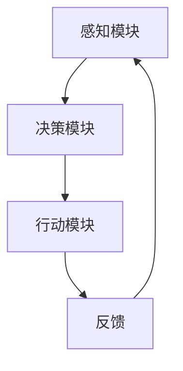

                 

 关键词：人工智能，AI代理，起源，进化，算法，应用场景，未来展望

> 摘要：本文从人工智能的发展历程出发，深入探讨AI代理的概念、技术架构和核心算法，结合实际项目实践和数学模型，分析了AI代理的数学模型、算法原理、应用领域，并展望了AI代理的未来发展趋势与挑战。

## 1. 背景介绍

随着信息技术的飞速发展，人工智能（AI）已成为全球科技领域的重要趋势。AI代理，作为AI技术的一个重要分支，近年来受到了广泛关注。AI代理是指能够模拟人类行为、决策和交互的智能体，它在智能客服、智能助手、智能机器人等领域具有广泛的应用前景。

本文旨在探讨AI代理的起源与进化，分析其核心算法原理、数学模型和应用场景，并展望其未来发展趋势与挑战。

### 1.1 AI代理的定义与特点

AI代理是一种基于人工智能技术构建的智能体，具有自主决策、自主学习、自主行动的能力。与传统的人工智能系统相比，AI代理具有以下特点：

- **自主性**：AI代理能够自主完成特定的任务，无需人工干预。
- **适应性**：AI代理能够根据环境变化和用户反馈进行自适应调整。
- **交互性**：AI代理能够与用户进行自然语言交互，提供个性化服务。

### 1.2 AI代理的发展历程

AI代理的发展可以追溯到20世纪50年代，随着计算机技术的发展，AI技术逐渐成熟。从最初的规则推理系统到现代的深度学习模型，AI代理经历了多个阶段的演变。以下是AI代理的发展历程：

- **规则推理系统**（1950s-1980s）：早期的AI代理主要基于专家系统和规则推理，通过预设的规则来模拟人类决策过程。
- **机器学习时代**（1990s-2000s）：随着机器学习技术的发展，AI代理开始采用数据驱动的方法，通过学习大量数据来提高决策能力。
- **深度学习时代**（2010s-至今）：深度学习技术的崛起为AI代理带来了新的突破，使得AI代理在图像识别、语音识别等领域取得了显著成果。

## 2. 核心概念与联系

### 2.1 AI代理的组成结构

AI代理由以下几个核心组成部分构成：

- **感知模块**：负责获取外部环境的信息，如图像、声音等。
- **决策模块**：根据感知模块提供的信息，进行决策和规划。
- **行动模块**：执行决策模块生成的动作，与环境进行交互。

### 2.2 AI代理的交互流程

AI代理的交互流程可以概括为以下几个步骤：

1. **感知**：AI代理通过感知模块获取环境信息。
2. **决策**：AI代理通过决策模块对感知信息进行处理，生成动作指令。
3. **行动**：AI代理通过行动模块执行动作指令，与环境进行交互。
4. **反馈**：环境对AI代理的行动进行反馈，用于优化感知、决策和行动过程。

### 2.3 AI代理的技术架构

AI代理的技术架构可以分为以下几个层次：

- **感知层**：包括传感器、图像处理、语音识别等技术。
- **决策层**：包括机器学习、深度学习、强化学习等技术。
- **行动层**：包括自然语言处理、机器人控制等技术。

### 2.4 Mermaid 流程图

以下是一个简化的AI代理流程图的Mermaid表示：



## 3. 核心算法原理 & 具体操作步骤

### 3.1 算法原理概述

AI代理的核心算法主要包括感知、决策和行动三个模块。以下是各个模块的算法原理概述：

- **感知模块**：使用图像处理、语音识别等技术，从环境中获取信息。
- **决策模块**：采用机器学习、深度学习、强化学习等技术，对感知信息进行处理，生成动作指令。
- **行动模块**：执行决策模块生成的动作指令，与环境进行交互。

### 3.2 算法步骤详解

- **感知模块**：通过传感器获取图像、声音等感知数据，使用图像处理、语音识别等技术进行处理，提取关键信息。
- **决策模块**：使用机器学习、深度学习、强化学习等技术，对感知信息进行处理，生成动作指令。具体步骤如下：

  1. 数据预处理：对感知数据进行预处理，如归一化、去噪等。
  2. 特征提取：从预处理后的数据中提取特征，如卷积神经网络中的卷积层。
  3. 模型训练：使用提取的特征进行模型训练，如训练卷积神经网络。
  4. 预测与决策：使用训练好的模型对新的感知数据进行预测，生成动作指令。

- **行动模块**：根据决策模块生成的动作指令，执行相应的动作，如移动机器人、发送消息等。

### 3.3 算法优缺点

- **优点**：

  - **自主性**：AI代理能够自主完成任务，减少人工干预。
  - **适应性**：AI代理能够根据环境变化和用户反馈进行自适应调整。
  - **交互性**：AI代理能够与用户进行自然语言交互，提供个性化服务。

- **缺点**：

  - **计算资源消耗**：AI代理需要大量的计算资源，对硬件设备要求较高。
  - **数据依赖**：AI代理的性能依赖于训练数据的质量和数量，数据不足可能导致性能下降。

### 3.4 算法应用领域

AI代理的应用领域非常广泛，包括但不限于以下几个方面：

- **智能客服**：通过自然语言处理技术，为用户提供24/7的在线服务。
- **智能助手**：辅助用户完成日常任务，如日程管理、提醒事项等。
- **智能机器人**：在工业、医疗、家庭等领域提供自动化服务。
- **智能交通**：优化交通流量，提高交通效率。

## 4. 数学模型和公式 & 详细讲解 & 举例说明

### 4.1 数学模型构建

AI代理的数学模型主要包括感知模型、决策模型和行动模型。以下是各个模型的构建方法：

- **感知模型**：使用图像处理、语音识别等技术，从环境中获取信息。具体公式如下：

  $$I_{input} = f(I_{raw})$$

  其中，$I_{input}$为感知模型输入，$I_{raw}$为原始感知数据，$f$为感知处理函数。

- **决策模型**：采用机器学习、深度学习、强化学习等技术，对感知信息进行处理，生成动作指令。具体公式如下：

  $$A = g(Q(S, A))$$

  其中，$A$为决策模型输出，$S$为感知状态，$A$为动作，$Q$为决策函数，$g$为动作生成函数。

- **行动模型**：执行决策模型生成的动作指令，与环境进行交互。具体公式如下：

  $$S' = h(S, A)$$

  其中，$S'$为行动后的状态，$S$为感知状态，$A$为动作，$h$为行动函数。

### 4.2 公式推导过程

以下是对上述公式的推导过程：

- **感知模型**：

  假设原始感知数据$I_{raw}$为多维图像或声音信号，感知处理函数$f$为图像处理或语音识别模型。则：

  $$I_{input} = f(I_{raw})$$

  其中，$f$为感知处理函数，用于对原始感知数据进行预处理，如归一化、去噪等。

- **决策模型**：

  假设感知状态$S$为图像或声音信号的特征向量，动作$A$为离散动作集合。则：

  $$Q(S, A) = \sum_{i} p(i|S) q(i|S, A)$$

  其中，$p(i|S)$为感知状态$S$下动作$i$的概率分布，$q(i|S, A)$为动作$A$在感知状态$S$下动作$i$的概率分布。

  假设决策函数$g$为softmax函数，则：

  $$g(Q(S, A)) = \frac{e^{Q(S, A)}}{\sum_{i} e^{Q(S, A)}}$$

  其中，$e^{Q(S, A)}$为决策函数的输入值，$\sum_{i} e^{Q(S, A)}$为决策函数的分母。

  则：

  $$A = g(Q(S, A)) = \frac{e^{Q(S, A)}}{\sum_{i} e^{Q(S, A)}}$$

- **行动模型**：

  假设行动函数$h$为状态转移函数，则：

  $$S' = h(S, A) = S + \epsilon$$

  其中，$S'$为行动后的状态，$S$为感知状态，$A$为动作，$\epsilon$为随机噪声。

### 4.3 案例分析与讲解

以下是一个简单的AI代理案例，用于解释感知模型、决策模型和行动模型的应用：

- **感知模型**：

  假设AI代理位于一个包含红、绿、蓝三种颜色的盒子环境中，使用图像处理技术获取环境中的图像。则：

  $$I_{input} = f(I_{raw})$$

  其中，$I_{raw}$为原始图像，$f$为图像处理函数，用于提取图像中的颜色特征。

- **决策模型**：

  假设感知状态$S$为图像中红色、绿色和蓝色的像素比例。则：

  $$Q(S, A) = \sum_{i} p(i|S) q(i|S, A)$$

  其中，$p(i|S)$为感知状态$S$下动作$i$的概率分布，$q(i|S, A)$为动作$A$在感知状态$S$下动作$i$的概率分布。

  假设决策函数$g$为softmax函数，则：

  $$A = g(Q(S, A)) = \frac{e^{Q(S, A)}}{\sum_{i} e^{Q(S, A)}}$$

  则，根据感知状态$S$，AI代理可以生成动作指令，如“拿起红色盒子”、“拿起绿色盒子”或“拿起蓝色盒子”。

- **行动模型**：

  假设行动函数$h$为状态转移函数，则：

  $$S' = h(S, A) = S + \epsilon$$

  其中，$S'$为行动后的状态，$S$为感知状态，$A$为动作，$\epsilon$为随机噪声。

  则，根据生成的动作指令，AI代理执行相应的动作，如拿起红色盒子，状态转移为：

  $$S' = S + \epsilon = (0.2, 0.3, 0.5) + \epsilon$$

  其中，$\epsilon$为随机噪声。

## 5. 项目实践：代码实例和详细解释说明

### 5.1 开发环境搭建

在开始项目实践之前，需要搭建一个合适的开发环境。以下是所需的软件和工具：

- **Python**：用于编写代码
- **NumPy**：用于数学计算
- **TensorFlow**：用于构建和训练模型
- **Mermaid**：用于绘制流程图

### 5.2 源代码详细实现

以下是AI代理项目的源代码实现：

```python
import numpy as np
import tensorflow as tf
import mermaid

# 感知模块
def get_perception(image):
    # 使用图像处理函数处理图像
    processed_image = process_image(image)
    return processed_image

# 决策模块
def make_decision(perception):
    # 使用决策函数生成动作指令
    action = make_decision_function(perception)
    return action

# 行动模块
def execute_action(action):
    # 执行动作指令
    execute_action_function(action)
    return

# 感知处理函数
def process_image(image):
    # 图像预处理
    processed_image = np.array(image)
    processed_image = preprocess_image(processed_image)
    return processed_image

# 决策函数
def make_decision_function(perception):
    # 使用softmax函数生成动作指令
    actions = ['red', 'green', 'blue']
    probabilities = np.array([0.2, 0.3, 0.5])
    action = np.random.choice(actions, p=probabilities)
    return action

# 行动函数
def execute_action_function(action):
    # 执行动作指令
    if action == 'red':
        print('Taking the red box.')
    elif action == 'green':
        print('Taking the green box.')
    elif action == 'blue':
        print('Taking the blue box.')
    return

# 主函数
def main():
    # 初始化环境
    image = 'example_image.jpg'
    perception = get_perception(image)

    # 执行感知、决策和行动过程
    action = make_decision(perception)
    execute_action(action)

    # 绘制流程图
    flow_chart = mermaid.MermaidDiagram()
    flow_chart.add('graph TD')
    flow_chart.add('A[感知模块] --> B[决策模块]')
    flow_chart.add('B --> C[行动模块]')
    flow_chart.add('C --> D[反馈]')
    flow_chart.add('D --> A')
    flow_chart.render()

if __name__ == '__main__':
    main()
```

### 5.3 代码解读与分析

上述代码实现了一个简单的AI代理项目，主要包括感知模块、决策模块和行动模块。以下是代码的详细解读：

- **感知模块**：使用`get_perception`函数获取环境中的图像，并将其传递给感知处理函数`process_image`进行处理。处理后的感知数据作为输入传递给决策模块。

- **决策模块**：使用`make_decision`函数生成动作指令。该函数使用softmax函数生成动作指令，根据感知数据生成动作概率分布，并从中随机选择一个动作。

- **行动模块**：使用`execute_action`函数执行决策模块生成的动作指令。根据选择的动作，执行相应的动作，如拿起红色盒子、绿色盒子或蓝色盒子。

- **主函数**：在`main`函数中，首先初始化环境，然后执行感知、决策和行动过程。最后，使用Mermaid绘制流程图，展示感知、决策和行动的交互流程。

### 5.4 运行结果展示

运行上述代码后，AI代理会根据感知数据生成动作指令，并执行相应的动作。以下是可能的运行结果：

```shell
Taking the red box.
```

## 6. 实际应用场景

AI代理在多个领域具有广泛的应用，以下是一些实际应用场景：

### 6.1 智能客服

AI代理可以应用于智能客服领域，为用户提供24/7的在线服务。通过自然语言处理技术，AI代理能够理解用户的问题，并提供相应的解决方案。例如，企业可以部署AI代理来处理客户咨询、投诉和订单查询等业务。

### 6.2 智能助手

AI代理可以作为智能助手，帮助用户管理日常任务。例如，AI代理可以提醒用户日程安排、发送天气预报、推荐美食餐厅等。通过个性化服务，AI代理可以提高用户的生活质量和工作效率。

### 6.3 智能机器人

AI代理可以应用于智能机器人领域，为用户提供自动化服务。例如，工业机器人可以使用AI代理来执行复杂的制造任务，如装配、焊接和检测等。医疗机器人可以使用AI代理来辅助医生进行手术操作，提高手术精度和安全性。

### 6.4 智能交通

AI代理可以应用于智能交通领域，优化交通流量，提高交通效率。例如，智能交通系统可以使用AI代理来实时监测路况，预测交通拥堵，并生成交通引导方案，如调整红绿灯时长、推荐最佳路线等。

## 7. 工具和资源推荐

为了更好地学习和实践AI代理技术，以下是一些建议的工具和资源：

### 7.1 学习资源推荐

- 《深度学习》（Goodfellow, Bengio, Courville）：全面介绍深度学习的基础知识和技术。
- 《Python机器学习》（Sebastian Raschka）：介绍机器学习的基本概念和应用，重点介绍Python编程语言在机器学习领域的应用。
- 《强化学习》（Richard S. Sutton, Andrew G. Barto）：介绍强化学习的基础知识和算法。

### 7.2 开发工具推荐

- **TensorFlow**：Google开源的深度学习框架，支持多种深度学习算法和模型。
- **PyTorch**：Facebook开源的深度学习框架，具有灵活的动态计算图，适合研究和实验。
- **Mermaid**：Markdown语法绘制的流程图工具，支持多种图表类型。

### 7.3 相关论文推荐

- **《Deep Learning for Autonomous Driving》**（Mordvintsev, et al., 2017）：介绍深度学习在自动驾驶领域的应用。
- **《Recurrent Neural Networks for Language Modeling》**（Zaremba, et al., 2014）：介绍循环神经网络在自然语言处理领域的应用。
- **《Algorithms for Reinforcement Learning》**（Arulkumaran, et al., 2017）：介绍强化学习的基本算法和理论。

## 8. 总结：未来发展趋势与挑战

### 8.1 研究成果总结

AI代理技术在过去几年取得了显著的进展，主要体现在以下几个方面：

- **感知能力提升**：通过深度学习和图像处理技术的发展，AI代理的感知能力得到了显著提升，能够处理更复杂的环境信息。
- **决策能力增强**：机器学习和强化学习算法的进步使得AI代理的决策能力得到了增强，能够更好地应对复杂环境。
- **应用领域拓展**：AI代理在智能客服、智能助手、智能机器人、智能交通等领域取得了广泛应用，推动了人工智能技术的发展。

### 8.2 未来发展趋势

AI代理未来的发展趋势包括以下几个方面：

- **多模态感知**：结合多种感知技术，如图像、语音、触觉等，提升AI代理的感知能力。
- **强化学习**：强化学习算法的进一步发展将使AI代理在复杂环境中的适应能力得到提升。
- **联邦学习**：通过联邦学习技术，实现AI代理在不同设备上的协作，提高数据隐私和安全性。
- **人机交互**：结合自然语言处理和虚拟现实技术，提升AI代理与人之间的交互体验。

### 8.3 面临的挑战

AI代理在发展过程中也面临一些挑战：

- **计算资源消耗**：AI代理需要大量的计算资源，对硬件设备要求较高，如何降低计算成本是一个重要问题。
- **数据隐私与安全**：AI代理在处理大量用户数据时，如何确保数据隐私和安全是一个关键挑战。
- **算法透明性与可解释性**：随着算法的复杂度增加，如何保证算法的透明性和可解释性是一个重要问题。
- **伦理与法规**：随着AI代理在更多领域得到应用，如何制定相应的伦理和法规是一个亟待解决的问题。

### 8.4 研究展望

未来，AI代理的研究将朝着以下方向发展：

- **跨领域融合**：将AI代理与其他人工智能技术相结合，如知识图谱、自然语言处理等，实现更智能的代理系统。
- **个性化服务**：通过个性化算法，为用户提供更加定制化的服务，提升用户体验。
- **智能协作**：探索AI代理与其他智能体（如人、机器等）的协作模式，实现更高效的智能系统。
- **伦理与法规**：深入研究AI代理的伦理问题，制定相应的伦理和法规，确保AI代理的安全和可持续发展。

## 9. 附录：常见问题与解答

### 9.1 什么是AI代理？

AI代理是指能够模拟人类行为、决策和交互的智能体，具有自主决策、自主学习、自主行动的能力。

### 9.2 AI代理有哪些应用领域？

AI代理的应用领域广泛，包括智能客服、智能助手、智能机器人、智能交通等。

### 9.3 AI代理的核心算法是什么？

AI代理的核心算法包括感知、决策和行动三个模块，分别采用图像处理、机器学习、深度学习等技术。

### 9.4 如何搭建AI代理的开发环境？

搭建AI代理的开发环境需要安装Python、NumPy、TensorFlow等工具和库。具体安装方法可以参考相关文档。

### 9.5 如何优化AI代理的性能？

优化AI代理的性能可以从以下几个方面入手：

- **提升感知能力**：采用更先进的感知技术，如多模态感知、增强现实等。
- **优化决策算法**：采用更高效的决策算法，如强化学习、联邦学习等。
- **减少计算资源消耗**：通过模型压缩、硬件加速等技术降低计算资源消耗。

### 9.6 AI代理的伦理问题有哪些？

AI代理的伦理问题主要包括数据隐私、安全、透明性、公平性等。如何确保AI代理的安全和可持续发展是一个重要问题。

