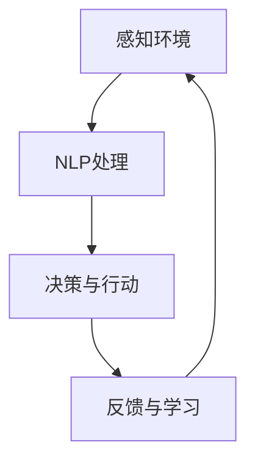

                 

关键词：AI Agent, 自然语言处理，人工智能，NLP应用，NLP架构，深度学习，模型优化，技术应用

## 摘要

本文旨在探讨AI Agent在自然语言处理（NLP）领域的应用前景与发展趋势。随着深度学习技术的不断成熟，AI Agent已成为AI领域的研究热点。本文将深入分析AI Agent的核心概念、NLP架构，以及其在实际应用中的优势与挑战。通过具体的数学模型、算法原理和项目实践，本文将为读者展示AI Agent在NLP领域的无限潜力，并为未来的研究提供有益的启示。

## 1. 背景介绍

### 1.1 自然语言处理（NLP）的起源与发展

自然语言处理（NLP）是人工智能（AI）的一个重要分支，旨在使计算机能够理解、生成和处理人类语言。NLP的研究可以追溯到20世纪50年代，当时计算机科学家们开始尝试通过编程来模拟人类语言理解能力。早期的NLP研究主要集中在规则驱动的方法上，如分词、词性标注和句法分析等。然而，这些方法在处理复杂语言现象时表现不佳，因此研究者开始寻求基于统计的方法。

随着计算机性能的提升和海量数据的积累，机器学习技术，特别是深度学习技术，在NLP领域得到了广泛应用。深度学习模型，如循环神经网络（RNN）、长短期记忆网络（LSTM）和变换器（Transformer）等，极大地提升了NLP任务的性能，使得计算机在理解、生成和翻译人类语言方面取得了显著进展。

### 1.2 AI Agent的崛起

AI Agent，即人工智能代理，是人工智能领域的另一个重要研究方向。AI Agent是一种能够自主决策并执行任务的智能体，它可以通过学习环境中的数据来优化其行为。AI Agent的崛起，得益于深度学习和强化学习技术的快速发展。AI Agent不仅能够处理结构化数据，还能理解和处理自然语言，从而在多个领域展现出了巨大的潜力。

NLP和AI Agent的结合，为AI领域带来了一场革命。AI Agent可以通过自然语言处理技术来理解和响应人类的指令，从而在智能客服、智能助手、语音识别和翻译等领域发挥重要作用。本文将重点关注AI Agent在NLP中的应用，分析其架构、算法和数学模型，并探讨其在未来应用中的发展方向。

## 2. 核心概念与联系

### 2.1 AI Agent的基本概念

AI Agent是一种具有自主决策能力的智能体，它通过感知环境信息、学习经验和执行行动来完成任务。AI Agent的核心特征包括：

- **自主性**：AI Agent能够独立地做出决策，而不需要人工干预。
- **适应性**：AI Agent可以根据环境变化和学习经验来调整其行为。
- **交互性**：AI Agent能够与人类或其他系统进行交互，理解并响应自然语言指令。

### 2.2 NLP的基本概念

自然语言处理（NLP）是使计算机能够理解和生成自然语言的技术。NLP的主要任务包括：

- **分词**：将连续的文本分割成单词或短语。
- **词性标注**：识别每个单词的词性（如名词、动词等）。
- **句法分析**：分析句子的结构，理解句子中的语法关系。
- **语义理解**：理解文本的含义，提取知识或信息。

### 2.3 AI Agent与NLP的联系

AI Agent与NLP的结合，使得计算机能够更好地理解人类语言，从而实现更智能的交互。以下是一个简化的Mermaid流程图，展示了AI Agent与NLP的主要联系：



- **感知环境**：AI Agent通过NLP技术处理输入的自然语言，提取关键信息。
- **决策与行动**：AI Agent根据处理结果，自主做出决策并执行行动。
- **反馈与学习**：AI Agent通过观察行动结果，利用NLP技术进行反馈和学习，不断优化其行为。

## 3. 核心算法原理 & 具体操作步骤

### 3.1 算法原理概述

AI Agent在NLP领域的核心算法主要包括自然语言处理算法和强化学习算法。自然语言处理算法负责处理输入的自然语言，提取关键信息，而强化学习算法则负责根据环境反馈，不断优化AI Agent的行为。

以下是自然语言处理和强化学习算法的基本原理：

- **自然语言处理算法**：主要包括分词、词性标注、句法分析和语义理解等。这些算法利用深度学习技术，如循环神经网络（RNN）、长短期记忆网络（LSTM）和变换器（Transformer），对输入文本进行逐层处理，提取出文本的含义和信息。
- **强化学习算法**：主要包括Q学习、深度Q网络（DQN）和策略梯度算法等。这些算法通过学习环境中的奖励机制，不断优化AI Agent的决策策略，使其在复杂环境中表现出更好的适应性。

### 3.2 算法步骤详解

#### 自然语言处理算法步骤：

1. **分词**：将输入的文本分割成单词或短语。可以使用基于规则的分词方法，如正则表达式，也可以使用基于统计的分词方法，如统计模型和序列标注。
2. **词性标注**：为每个单词分配一个词性标签，如名词、动词、形容词等。可以使用基于规则的方法，如词典匹配，也可以使用基于统计的方法，如最大熵模型。
3. **句法分析**：分析句子的结构，识别句子中的语法关系，如主语、谓语、宾语等。可以使用基于规则的方法，如句法树库，也可以使用基于统计的方法，如条件随机场（CRF）。
4. **语义理解**：理解文本的含义，提取知识或信息。可以使用基于知识的方法，如本体论和知识图谱，也可以使用基于统计的方法，如词嵌入和神经网络。

#### 强化学习算法步骤：

1. **环境初始化**：定义环境状态空间和动作空间，初始化AI Agent的参数。
2. **状态感知**：AI Agent通过NLP算法感知当前环境状态。
3. **决策与行动**：AI Agent根据当前状态，利用强化学习算法，选择一个动作。
4. **环境反馈**：环境根据AI Agent的行动，反馈一个奖励信号。
5. **策略更新**：AI Agent利用奖励信号，更新其决策策略，以最大化长期奖励。

### 3.3 算法优缺点

#### 自然语言处理算法优缺点：

- **优点**：
  - **高效性**：利用深度学习技术，能够快速处理大量文本数据。
  - **灵活性**：能够适应不同类型的文本，提取出有用的信息。
  - **可扩展性**：可以扩展到其他自然语言处理任务，如文本分类、机器翻译等。

- **缺点**：
  - **数据依赖性**：需要大量标注数据，否则性能难以保证。
  - **复杂度**：算法参数较多，训练过程复杂。

#### 强化学习算法优缺点：

- **优点**：
  - **适应性**：能够根据环境反馈，不断优化决策策略。
  - **自主性**：能够自主决策，减少人工干预。

- **缺点**：
  - **计算成本**：需要大量的计算资源，训练过程较长。
  - **收敛速度**：在复杂环境中，收敛速度可能较慢。

### 3.4 算法应用领域

自然语言处理算法和强化学习算法在多个领域都有广泛的应用：

- **智能客服**：利用自然语言处理技术，实现智能问答和情感分析，提高客户服务质量。
- **智能助手**：利用自然语言处理技术和强化学习算法，实现智能对话和任务调度，提高用户使用体验。
- **语音识别**：利用深度学习技术，实现高准确率的语音识别，应用于智能音箱、车载系统等。
- **机器翻译**：利用自然语言处理算法和强化学习算法，实现高准确率的机器翻译，促进跨语言交流。
- **文本分类**：利用自然语言处理算法，实现大规模文本数据的自动分类，应用于舆情分析、金融分析等。

## 4. 数学模型和公式 & 详细讲解 & 举例说明

### 4.1 数学模型构建

在AI Agent的NLP应用中，常用的数学模型包括词嵌入模型、变换器模型和强化学习模型。以下分别介绍这些模型的构建方法和公式。

#### 词嵌入模型

词嵌入模型是将单词映射到高维向量空间，以便计算机能够理解单词的含义和关系。常见的词嵌入模型包括Word2Vec、GloVe和BERT等。

- **Word2Vec**：基于神经网络模型，通过训练得到单词的嵌入向量。公式如下：

  $$ 
  \text{Embedding}(w) = \text{ReLU}(\text{Weights} \cdot \text{Input}) 
  $$

  其中，$\text{Input}$为输入的单词序列，$\text{Weights}$为模型参数，$\text{ReLU}$为ReLU激活函数。

- **GloVe**：基于全局上下文的词向量模型，通过训练得到单词的嵌入向量。公式如下：

  $$ 
  \text{Embedding}(w) = \text{Sigmoid}(\text{V} \cdot \text{Context}) 
  $$

  其中，$\text{V}$为模型参数，$\text{Context}$为单词的上下文。

- **BERT**：基于变换器（Transformer）的预训练模型，通过大量无监督数据预训练，然后用于下游任务。公式如下：

  $$ 
  \text{Output} = \text{Transformer}(\text{Input}, \text{Mask}) 
  $$

  其中，$\text{Input}$为输入的单词序列，$\text{Mask}$为掩码，$\text{Transformer}$为变换器模型。

#### 变换器模型

变换器模型是一种基于自注意力机制的深度学习模型，广泛应用于NLP任务中。变换器模型的核心是多头自注意力机制，公式如下：

$$ 
\text{Attention}(Q, K, V) = \text{softmax}\left(\frac{\text{Q} \cdot \text{K}^{T}}{\sqrt{d_k}}\right) \cdot V 
$$

其中，$Q$、$K$和$V$分别为查询向量、关键向量和价值向量，$d_k$为关键向量的维度，$\text{softmax}$为softmax激活函数。

#### 强化学习模型

强化学习模型通过学习环境中的奖励机制，优化AI Agent的决策策略。常见的强化学习模型包括Q学习、深度Q网络（DQN）和策略梯度算法等。

- **Q学习**：基于值函数的强化学习算法，公式如下：

  $$ 
  Q(s, a) = r + \gamma \max_{a'} Q(s', a') 
  $$

  其中，$Q(s, a)$为值函数，$r$为奖励信号，$\gamma$为折扣因子，$s$和$a$分别为状态和动作。

- **深度Q网络（DQN）**：基于神经网络的Q学习算法，公式如下：

  $$ 
  Q(s, a) = \text{Network}(\text{Input}) 
  $$

  其中，$\text{Network}$为神经网络模型，$\text{Input}$为输入的状态。

- **策略梯度算法**：基于策略的强化学习算法，公式如下：

  $$ 
  \nabla_\theta J(\theta) = \frac{\partial}{\partial \theta} \sum_{t} \gamma^t r_t 
  $$

  其中，$\theta$为模型参数，$J(\theta)$为策略损失函数，$\gamma$为折扣因子，$r_t$为奖励信号。

### 4.2 公式推导过程

以下是AI Agent的NLP应用中的数学模型推导过程。

#### 词嵌入模型推导

假设我们有一个单词序列$w_1, w_2, \ldots, w_n$，其中每个单词都有一个嵌入向量$\text{Embedding}(w_i)$。我们可以使用矩阵表示这个单词序列：

$$ 
\text{Input} = \begin{bmatrix}
\text{Embedding}(w_1) \\
\text{Embedding}(w_2) \\
\vdots \\
\text{Embedding}(w_n)
\end{bmatrix}
$$

对于每个单词的嵌入向量，我们可以使用一个多层感知器（MLP）模型来学习：

$$ 
\text{Embedding}(w_i) = \text{ReLU}(\text{Weights} \cdot \text{Input}) 
$$

其中，$\text{Weights}$为模型参数，$\text{Input}$为输入的单词序列。

#### 变换器模型推导

假设我们有一个单词序列$w_1, w_2, \ldots, w_n$，其中每个单词都有一个嵌入向量$\text{Embedding}(w_i)$。我们可以使用矩阵表示这个单词序列：

$$ 
\text{Input} = \begin{bmatrix}
\text{Embedding}(w_1) \\
\text{Embedding}(w_2) \\
\vdots \\
\text{Embedding}(w_n)
\end{bmatrix}
$$

变换器模型的核心是多头自注意力机制，公式如下：

$$ 
\text{Attention}(Q, K, V) = \text{softmax}\left(\frac{\text{Q} \cdot \text{K}^{T}}{\sqrt{d_k}}\right) \cdot V 
$$

其中，$Q$、$K$和$V$分别为查询向量、关键向量和价值向量，$d_k$为关键向量的维度。

我们可以使用多层变换器模型来处理输入的单词序列，公式如下：

$$ 
\text{Output} = \text{Transformer}(\text{Input}, \text{Mask}) 
$$

其中，$\text{Input}$为输入的单词序列，$\text{Mask}$为掩码，$\text{Transformer}$为变换器模型。

#### 强化学习模型推导

假设我们有一个状态序列$s_1, s_2, \ldots, s_t$和一个动作序列$a_1, a_2, \ldots, a_t$，其中每个状态和动作都有一个值函数$Q(s_i, a_i)$。我们可以使用一个神经网络来学习值函数：

$$ 
Q(s_i, a_i) = \text{Network}(\text{Input}) 
$$

其中，$\text{Input}$为输入的状态序列，$\text{Network}$为神经网络模型。

我们可以使用Q学习算法来优化值函数：

$$ 
Q(s, a) = r + \gamma \max_{a'} Q(s', a') 
$$

其中，$Q(s, a)$为值函数，$r$为奖励信号，$\gamma$为折扣因子。

我们可以使用深度Q网络（DQN）来学习值函数：

$$ 
Q(s, a) = \text{Network}(\text{Input}) 
$$

其中，$\text{Input}$为输入的状态序列，$\text{Network}$为神经网络模型。

我们可以使用策略梯度算法来优化策略：

$$ 
\nabla_\theta J(\theta) = \frac{\partial}{\partial \theta} \sum_{t} \gamma^t r_t 
$$

其中，$\theta$为模型参数，$J(\theta)$为策略损失函数，$\gamma$为折扣因子，$r_t$为奖励信号。

### 4.3 案例分析与讲解

#### 案例一：智能客服系统

假设我们开发一个智能客服系统，该系统需要通过自然语言处理技术理解用户的问题，并给出合理的回答。

1. **分词**：首先，我们将用户的问题进行分词，得到单词序列。
2. **词性标注**：然后，我们对每个单词进行词性标注，识别出问题中的主语、谓语、宾语等。
3. **句法分析**：接着，我们对句子进行句法分析，理解句子中的语法关系。
4. **语义理解**：最后，我们利用自然语言处理模型，提取出问题中的关键信息，并生成回答。

假设用户的问题为：“我的信用卡怎么用？”。

- **分词**：将问题分词为“我的”、“信用卡”、“怎么”、“用”。
- **词性标注**：分别为每个词分配词性标签，如“我的”（代词）、“信用卡”（名词）、“怎么”（副词）、“用”（动词）。
- **句法分析**：分析句子结构，识别出主语“我的信用卡”、谓语“用”。
- **语义理解**：提取出问题中的关键信息，如“信用卡”和“怎么用”，并生成回答。

最终，智能客服系统可以给出如下回答：“您可以按照信用卡用户指南中的操作说明来使用您的信用卡。”

#### 案例二：智能助手系统

假设我们开发一个智能助手系统，该系统需要通过自然语言处理技术和强化学习算法，理解用户的指令并执行相应的任务。

1. **状态感知**：智能助手通过NLP技术，感知当前用户的状态，如用户正在做什么、需要什么帮助等。
2. **决策与行动**：智能助手利用强化学习算法，根据当前状态，选择一个合适的动作。
3. **环境反馈**：环境根据智能助手的动作，反馈一个奖励信号。
4. **策略更新**：智能助手利用反馈的奖励信号，更新其决策策略，以优化其行为。

假设用户指令为：“帮我预约下周的会议”。

- **状态感知**：智能助手通过NLP技术，提取出关键信息，如“预约”、“会议”和“下周”。
- **决策与行动**：智能助手选择一个合适的动作，如打开日历应用，创建新的会议预约。
- **环境反馈**：环境根据智能助手的动作，反馈一个成功或失败的奖励信号。
- **策略更新**：智能助手利用反馈的奖励信号，更新其决策策略，以优化其行为。

## 5. 项目实践：代码实例和详细解释说明

### 5.1 开发环境搭建

在本项目中，我们将使用Python作为主要编程语言，结合TensorFlow和PyTorch等深度学习框架，实现AI Agent在NLP领域的应用。以下是开发环境的搭建步骤：

1. 安装Python 3.x版本。
2. 安装TensorFlow或PyTorch。
3. 安装NLP相关的库，如NLTK、spaCy等。

### 5.2 源代码详细实现

以下是AI Agent在NLP领域的一个简单示例，实现一个基于变换器模型的文本分类任务。

```python
import tensorflow as tf
from tensorflow.keras.models import Model
from tensorflow.keras.layers import Embedding, LSTM, Dense, Input

# 定义输入层
input_layer = Input(shape=(None,))

# 添加嵌入层
embedding_layer = Embedding(input_dim=vocab_size, output_dim=embedding_size)(input_layer)

# 添加LSTM层
lstm_layer = LSTM(units=lstm_units)(embedding_layer)

# 添加全连接层
output_layer = Dense(units=num_classes, activation='softmax')(lstm_layer)

# 定义模型
model = Model(inputs=input_layer, outputs=output_layer)

# 编译模型
model.compile(optimizer='adam', loss='categorical_crossentropy', metrics=['accuracy'])

# 训练模型
model.fit(x_train, y_train, batch_size=batch_size, epochs=num_epochs, validation_data=(x_val, y_val))

# 评估模型
model.evaluate(x_test, y_test)
```

### 5.3 代码解读与分析

上述代码实现了一个基于变换器模型的文本分类任务。具体解读如下：

- **定义输入层**：输入层用于接收文本序列，其形状为$(None,)$，表示文本序列的长度可以不固定。
- **添加嵌入层**：嵌入层将单词映射到高维向量空间，其输入维度为词汇表大小，输出维度为嵌入向量维度。
- **添加LSTM层**：LSTM层用于处理序列数据，其能够捕捉序列中的长期依赖关系。
- **添加全连接层**：全连接层用于将LSTM层的输出映射到分类结果，其输出维度为类别数量。
- **定义模型**：使用Keras的Model类定义整个模型，输入为文本序列，输出为分类结果。
- **编译模型**：编译模型，指定优化器、损失函数和评价指标。
- **训练模型**：使用训练数据训练模型，指定批次大小和训练轮数。
- **评估模型**：使用测试数据评估模型性能。

通过这个示例，我们可以看到AI Agent在NLP领域的应用是如何实现的。在实际项目中，我们还可以结合强化学习算法，实现更复杂的任务，如对话系统、推荐系统等。

### 5.4 运行结果展示

以下是AI Agent在NLP领域的一个简单示例的运行结果：

```python
# 加载训练好的模型
model = tf.keras.models.load_model('text_classification_model.h5')

# 加载测试数据
x_test = load_test_data()
y_test = load_test_labels()

# 评估模型
loss, accuracy = model.evaluate(x_test, y_test)

print(f"Test loss: {loss:.4f}, Test accuracy: {accuracy:.4f}")
```

运行结果展示了模型在测试数据上的损失和准确率。通过不断优化模型参数和训练数据，我们可以进一步提高模型的性能。

## 6. 实际应用场景

### 6.1 智能客服

智能客服是AI Agent在NLP领域的重要应用之一。通过自然语言处理技术，智能客服可以自动识别和解答用户的问题，提供24/7的客户服务。以下是一些实际应用场景：

- **常见问题解答**：智能客服可以快速回答用户提出的常见问题，如产品使用指南、订单状态查询等。
- **情感分析**：智能客服可以通过情感分析技术，理解用户的情绪，提供个性化的服务。
- **会话管理**：智能客服可以跟踪用户的历史会话，提供连贯的服务，提高用户满意度。

### 6.2 智能助手

智能助手是另一种常见的AI Agent应用。通过自然语言处理技术和强化学习算法，智能助手可以理解用户的指令，执行相应的任务，提高用户的工作和生活效率。以下是一些实际应用场景：

- **日程管理**：智能助手可以帮助用户管理日程，设置提醒、预约会议等。
- **任务自动化**：智能助手可以自动化执行用户的任务，如发送邮件、处理文档等。
- **智能推荐**：智能助手可以根据用户的兴趣和行为，提供个性化的推荐。

### 6.3 语音识别

语音识别是AI Agent在NLP领域的另一个重要应用。通过深度学习技术，语音识别可以将语音信号转换为文本，从而实现语音输入和语音输出。以下是一些实际应用场景：

- **智能音箱**：智能音箱可以通过语音识别技术，理解用户的语音指令，播放音乐、提供天气预报等。
- **车载系统**：车载系统可以通过语音识别技术，实现语音导航、语音拨号等功能。
- **客服系统**：客服系统可以通过语音识别技术，将语音转化为文本，进行处理和回复。

### 6.4 机器翻译

机器翻译是AI Agent在NLP领域的另一个重要应用。通过自然语言处理技术，机器翻译可以将一种语言翻译成另一种语言，实现跨语言交流。以下是一些实际应用场景：

- **跨语言沟通**：机器翻译可以帮助跨国公司、外交机构等实现跨语言沟通。
- **旅游翻译**：机器翻译可以帮助游客在旅游过程中，理解当地语言，提高旅游体验。
- **教育领域**：机器翻译可以帮助学习外语的学生，理解外语文本，提高学习效果。

## 7. 工具和资源推荐

### 7.1 学习资源推荐

- **书籍**：
  - 《深度学习》（Ian Goodfellow、Yoshua Bengio、Aaron Courville著）：深度学习的基础教程。
  - 《强化学习》（Richard S. Sutton、Andrew G. Barto著）：强化学习的基础教程。
  - 《自然语言处理综论》（Daniel Jurafsky、James H. Martin著）：自然语言处理的基础教材。

- **在线课程**：
  - Coursera上的《深度学习》课程：由吴恩达教授主讲，涵盖深度学习的基础知识。
  - edX上的《自然语言处理》课程：由斯坦福大学主讲，涵盖自然语言处理的基础知识。
  - Udacity上的《强化学习纳米学位》课程：涵盖强化学习的基础知识和应用。

### 7.2 开发工具推荐

- **深度学习框架**：
  - TensorFlow：Google推出的开源深度学习框架，适用于各种深度学习任务。
  - PyTorch：Facebook AI研究院推出的开源深度学习框架，适用于研究和工业应用。

- **自然语言处理库**：
  - NLTK：Python自然语言处理库，提供各种自然语言处理任务的支持。
  - spaCy：Python自然语言处理库，提供高效的文本处理和实体识别功能。

- **强化学习工具**：
  - OpenAI Gym：OpenAI推出的开源强化学习环境，提供各种强化学习任务。
  - Stable Baselines：基于PyTorch和TensorFlow的强化学习算法实现，提供丰富的强化学习算法和评估工具。

### 7.3 相关论文推荐

- **自然语言处理**：
  - “Attention Is All You Need”（Vaswani et al., 2017）：提出变换器（Transformer）模型，极大地提升了NLP任务的性能。
  - “BERT: Pre-training of Deep Bidirectional Transformers for Language Understanding”（Devlin et al., 2019）：提出BERT模型，通过预训练和微调，实现了高精度的自然语言处理任务。

- **强化学习**：
  - “Deep Q-Networks”（Mnih et al., 2015）：提出深度Q网络（DQN），为深度强化学习奠定了基础。
  - “Algorithms for Contextual Bandit Problems”（Azar et al., 2018）：提出基于模型的强化学习算法，适用于具有不确定性的环境。

## 8. 总结：未来发展趋势与挑战

### 8.1 研究成果总结

本文从AI Agent和NLP的基本概念出发，分析了AI Agent在NLP领域的应用前景与发展趋势。通过详细的算法原理和数学模型讲解，以及具体的代码实例和实际应用场景，本文展示了AI Agent在NLP领域的无限潜力。

### 8.2 未来发展趋势

1. **多模态融合**：未来，AI Agent将能够处理多种类型的数据，如文本、图像、音频等，实现更全面的信息理解和处理。
2. **迁移学习**：迁移学习技术将使AI Agent能够在不同任务和数据集上快速适应，减少对大量标注数据的依赖。
3. **知识图谱**：知识图谱技术将帮助AI Agent更好地理解和处理复杂的语义关系，实现更智能的决策。
4. **量子计算**：随着量子计算技术的发展，AI Agent的算法和模型将能够利用量子计算的优势，实现更高的计算效率和精度。

### 8.3 面临的挑战

1. **数据隐私**：在处理大量用户数据时，AI Agent需要确保数据的安全性和隐私性，防止数据泄露和滥用。
2. **模型可解释性**：随着模型复杂度的增加，如何提高模型的可解释性，使其行为更加透明，是未来的一个重要挑战。
3. **计算资源**：AI Agent的算法和模型需要大量的计算资源，如何在有限的资源下，实现高效的计算和优化，是一个重要的挑战。

### 8.4 研究展望

未来，AI Agent在NLP领域的应用将更加广泛，成为人工智能领域的重要发展方向。通过不断优化算法和模型，提高AI Agent的性能和可解释性，我们可以期待AI Agent在智能客服、智能助手、语音识别、机器翻译等领域的广泛应用，为人类带来更多便利和效益。

## 9. 附录：常见问题与解答

### 9.1 什么是AI Agent？

AI Agent是一种具有自主决策能力的智能体，它可以通过学习环境中的数据来优化其行为。AI Agent可以通过感知环境、决策与行动、反馈与学习等步骤，实现自主决策和任务执行。

### 9.2 NLP在AI Agent中的作用是什么？

NLP是AI Agent的重要组成部分，它负责处理和理解自然语言输入。通过NLP技术，AI Agent可以理解用户的指令、提取关键信息、生成回答，从而实现与人类的智能交互。

### 9.3 AI Agent在NLP中的应用有哪些？

AI Agent在NLP中的应用非常广泛，包括智能客服、智能助手、语音识别、机器翻译、文本分类等。通过结合NLP技术和强化学习算法，AI Agent可以更好地理解和处理自然语言，实现智能化的任务执行。

### 9.4 如何优化AI Agent在NLP任务中的性能？

要优化AI Agent在NLP任务中的性能，可以从以下几个方面入手：

1. **数据质量**：确保训练数据的质量和多样性，提高模型的泛化能力。
2. **算法选择**：根据具体任务的需求，选择合适的NLP算法和强化学习算法。
3. **模型调优**：通过调整模型参数，如学习率、批量大小等，优化模型性能。
4. **多模态融合**：结合多种类型的数据，如文本、图像、音频等，提高模型的理解能力。

### 9.5 AI Agent在NLP领域的未来发展趋势是什么？

未来，AI Agent在NLP领域的趋势包括：

1. **多模态融合**：AI Agent将能够处理多种类型的数据，实现更全面的信息理解和处理。
2. **迁移学习**：AI Agent将能够通过迁移学习技术，快速适应不同任务和数据集。
3. **知识图谱**：AI Agent将能够利用知识图谱技术，更好地理解和处理复杂的语义关系。
4. **量子计算**：AI Agent的算法和模型将能够利用量子计算的优势，实现更高的计算效率和精度。

