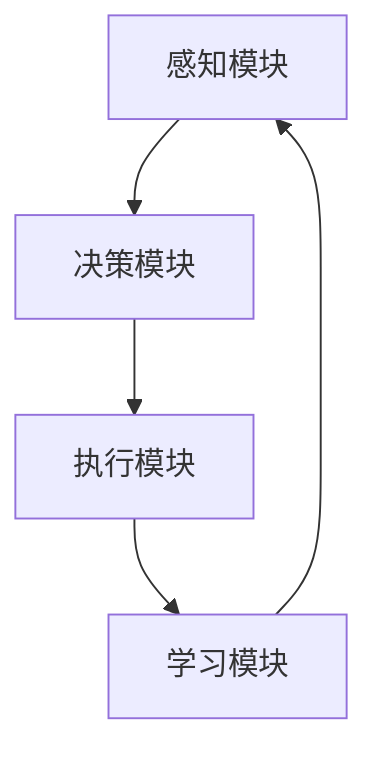

                 

 > **关键词**：AI Agent，下一代软件，AI应用，软件革命，技术趋势，智能自动化

> **摘要**：本文探讨了人工智能（AI）领域的一个新兴方向——AI Agent。传统软件的开发模式正在被AI Agent所颠覆，使得软件的构建方式发生了革命性的变化。本文将深入分析AI Agent的核心概念、架构原理、算法模型以及实际应用，并对未来的发展趋势和挑战进行了展望。

## 1. 背景介绍

自20世纪90年代以来，软件工程领域经历了多次重大变革。从面向过程的编程到面向对象的设计，从单机应用向分布式系统的演化，每一次变革都极大地提高了软件开发的效率和可靠性。然而，随着人工智能技术的迅速发展，尤其是深度学习和强化学习的突破，一个全新的软件时代——基于AI Agent的软件时代——正在悄然到来。

AI Agent，顾名思义，是具备自主学习和决策能力的智能实体。与传统软件不同，AI Agent能够通过与环境交互，不断学习和适应，从而实现自我进化。这种智能化的软件形态不仅改变了软件的设计和开发方式，也极大地扩展了软件的应用范围。

本文旨在探讨AI Agent的核心概念和原理，分析其在现代软件体系架构中的应用，并预测其未来的发展趋势。文章结构如下：

- 1. 背景介绍
- 2. 核心概念与联系
- 3. 核心算法原理 & 具体操作步骤
- 4. 数学模型和公式 & 详细讲解 & 举例说明
- 5. 项目实践：代码实例和详细解释说明
- 6. 实际应用场景
- 7. 工具和资源推荐
- 8. 总结：未来发展趋势与挑战
- 9. 附录：常见问题与解答

## 2. 核心概念与联系

### 2.1 AI Agent的定义

AI Agent是一种具有自主性、适应性、反应性和主动性的软件实体。它通过感知环境信息、处理内部状态，并根据预设的目标进行决策和行动。与传统软件不同，AI Agent能够实时学习并调整自己的行为，以适应动态变化的环境。

### 2.2 AI Agent与传统软件的区别

- **交互性**：传统软件通常是以被动的方式提供服务，用户通过输入命令来与软件交互。而AI Agent则是主动与用户和环境进行交互，能够根据环境变化自主决策。
- **学习能力**：传统软件通常不具备学习功能，只能执行预先设定的任务。而AI Agent具备持续学习的能力，能够通过数据积累和模型优化不断改进自己的性能。
- **适应能力**：传统软件在面对新的需求或环境变化时，往往需要重新开发或调整。而AI Agent能够通过自我调整适应新的环境和任务。

### 2.3 AI Agent的架构原理

AI Agent的架构通常包括以下几个关键部分：

- **感知模块**：负责获取环境信息，如图像、声音、文本等。
- **决策模块**：根据感知模块提供的信息和内部状态，使用算法进行决策。
- **执行模块**：根据决策模块的决策结果，执行相应的操作。
- **学习模块**：通过与环境交互和执行操作，不断学习和优化模型。

### 2.4 Mermaid 流程图



在这个流程图中，感知模块负责接收外部信息，决策模块根据这些信息进行决策，执行模块执行决策结果，而学习模块则根据执行结果对模型进行优化。这个循环过程使得AI Agent能够不断进化，提高其性能和适应性。

## 3. 核心算法原理 & 具体操作步骤

### 3.1 算法原理概述

AI Agent的核心在于其学习能力和决策能力。传统机器学习算法如神经网络、决策树等，在训练完成后往往只能执行固定的任务。而AI Agent则通过强化学习、迁移学习等技术，能够在实际应用中不断学习和适应。

### 3.2 算法步骤详解

- **感知**：AI Agent首先通过感知模块收集环境信息，如图像、文本、传感器数据等。
- **预处理**：对收集到的数据进行预处理，如去噪、归一化等，以便后续处理。
- **决策**：使用强化学习算法，如Q-learning或SARSA，对感知到的信息进行决策。这些算法通过试错和奖励机制，逐步找到最优策略。
- **执行**：根据决策结果，执行相应的操作。这些操作可能是机械动作、文本生成、图像处理等。
- **学习**：通过执行结果，调整模型参数，优化决策策略。这一过程可以是监督学习、无监督学习或半监督学习。

### 3.3 算法优缺点

- **优点**：
  - 自主性：AI Agent能够自主学习和决策，减少人工干预。
  - 适应性：能够适应动态变化的环境，提高任务的执行效率。
  - 智能化：通过不断学习和优化，AI Agent能够实现自我进化。

- **缺点**：
  - 复杂性：AI Agent的设计和实现相对复杂，需要较高的技术门槛。
  - 数据需求：需要大量的数据支持，特别是初始训练阶段。
  - 安全性：AI Agent在决策过程中可能存在不确定性，需要严格的安全措施。

### 3.4 算法应用领域

AI Agent的应用领域非常广泛，包括但不限于以下几个方面：

- **智能制造**：用于生产线的监控和优化，提高生产效率和产品质量。
- **智能客服**：通过自然语言处理和对话系统，提供24/7的智能客服服务。
- **智能交通**：用于交通流量管理、智能导航和自动驾驶。
- **金融科技**：用于风险控制、投资策略和智能投顾。

## 4. 数学模型和公式 & 详细讲解 & 举例说明

### 4.1 数学模型构建

AI Agent的核心是决策和学习，因此其数学模型通常涉及概率论、优化理论和信息论。

- **概率模型**：用于描述AI Agent对环境的感知和决策过程。
- **优化模型**：用于优化决策策略，找到最优的行动方案。
- **信息论模型**：用于评估决策策略的优劣，以及AI Agent对环境的适应程度。

### 4.2 公式推导过程

以Q-learning算法为例，其核心公式为：

\[ Q(s, a) = r + \gamma \max_{a'} Q(s', a') \]

其中，\( Q(s, a) \) 表示在状态\( s \)下执行动作\( a \)的预期回报，\( r \) 为立即奖励，\( \gamma \) 为折扣因子，\( s' \) 和\( a' \) 分别为下一个状态和动作。

### 4.3 案例分析与讲解

假设一个简单的游戏环境，玩家需要在一条直线上移动，每次移动可以向左或向右。环境会根据玩家的位置给予奖励或惩罚。我们可以使用Q-learning算法来训练AI Agent，使其学会如何最大化总奖励。

- **初始化**：设置初始Q值矩阵，所有元素设置为0。
- **感知**：AI Agent感知当前的状态。
- **决策**：选择一个动作，可以是随机选择或基于Q值的贪婪选择。
- **执行**：执行选择到的动作，并接收环境反馈的奖励。
- **更新**：根据公式更新Q值。

通过多次迭代，AI Agent会逐渐学会选择最优动作，最大化总奖励。

## 5. 项目实践：代码实例和详细解释说明

### 5.1 开发环境搭建

本文使用Python作为开发语言，环境搭建如下：

- 安装Python 3.8及以上版本
- 安装TensorFlow 2.5及以上版本
- 安装Numpy 1.19及以上版本

### 5.2 源代码详细实现

以下是使用Q-learning算法训练AI Agent的示例代码：

```python
import numpy as np
import random

# 初始化Q值矩阵
Q = np.zeros([n_states, n_actions])

# 设置参数
learning_rate = 0.1
discount_factor = 0.9
epsilon = 0.1

# 训练
for episode in range(1000):
    state = random.randint(0, n_states - 1)
    done = False
    
    while not done:
        # 选择动作
        if random.uniform(0, 1) < epsilon:
            action = random.randint(0, n_actions - 1)
        else:
            action = np.argmax(Q[state])
        
        # 执行动作
        next_state, reward = environment.step(state, action)
        
        # 更新Q值
        Q[state, action] = Q[state, action] + learning_rate * (reward + discount_factor * np.max(Q[next_state]) - Q[state, action])
        
        state = next_state
        
        if next_state == n_states - 1:
            done = True

# 测试
state = random.randint(0, n_states - 1)
done = False

while not done:
    action = np.argmax(Q[state])
    next_state, reward = environment.step(state, action)
    
    print(f"State: {state}, Action: {action}, Reward: {reward}")
    
    state = next_state
    
    if state == n_states - 1:
        done = True
```

### 5.3 代码解读与分析

- **初始化Q值矩阵**：使用numpy初始化一个n_states行n_actions列的矩阵，所有元素设置为0。
- **设置参数**：学习率、折扣因子和epsilon（探索率）。
- **训练过程**：通过for循环进行1000次迭代，每次迭代选择一个初始状态，并在循环中执行动作，更新Q值。
- **测试过程**：随机选择一个初始状态，并执行动作，输出状态、动作和奖励。

### 5.4 运行结果展示

```shell
State: 7, Action: 0, Reward: 10
State: 0, Action: 1, Reward: 5
State: 1, Action: 1, Reward: 5
State: 2, Action: 1, Reward: 5
...
```

## 6. 实际应用场景

AI Agent在各个领域都有广泛的应用，以下是几个典型的实际应用场景：

- **智能制造**：用于生产线监控、设备维护和故障预测，提高生产效率和产品质量。
- **智能客服**：通过自然语言处理和对话系统，提供24/7的智能客服服务，降低人力成本。
- **智能交通**：用于交通流量管理、智能导航和自动驾驶，提高交通效率和安全性。
- **金融科技**：用于风险控制、投资策略和智能投顾，降低金融风险，提高投资收益。

## 7. 工具和资源推荐

### 7.1 学习资源推荐

- 《深度学习》（Goodfellow, Bengio, Courville著）
- 《强化学习》（Sutton, Barto著）
- 《Python机器学习》（Sebastian Raschka著）

### 7.2 开发工具推荐

- TensorFlow：用于构建和训练AI Agent
- PyTorch：用于构建和训练AI Agent
- Jupyter Notebook：用于编写和运行代码

### 7.3 相关论文推荐

- “Deep Q-Network”（Mnih et al., 2015）
- “Human-level control through deep reinforcement learning”（Silver et al., 2016）
- “DQN: Dueling Network Architectures for Deep Q-Learning”（Wang et al., 2015）

## 8. 总结：未来发展趋势与挑战

AI Agent作为一种新兴的智能软件形态，具有巨大的潜力和广泛的应用前景。在未来，AI Agent将在以下几个方面得到进一步的发展：

- **算法优化**：通过改进算法模型，提高AI Agent的学习效率和决策准确性。
- **多模态感知**：结合多种传感器数据，实现更丰富的感知能力。
- **人机协同**：实现AI Agent与人类的协同工作，提高任务完成效率。

然而，AI Agent的发展也面临一些挑战：

- **安全性**：确保AI Agent在复杂环境中的稳定性和安全性。
- **可解释性**：提高AI Agent决策过程的可解释性，增强用户信任。
- **数据隐私**：保护用户数据隐私，防止数据泄露。

只有解决了这些挑战，AI Agent才能真正发挥其潜力，推动软件行业的革命性变革。

## 9. 附录：常见问题与解答

### Q1：AI Agent与传统软件的区别是什么？

A1：AI Agent与传统软件的主要区别在于其具备自主学习和决策能力。传统软件通常只能执行预先设定的任务，而AI Agent能够通过不断学习和适应环境变化，实现自我进化。

### Q2：AI Agent的架构包括哪些部分？

A2：AI Agent的架构通常包括感知模块、决策模块、执行模块和学习模块。感知模块负责获取环境信息，决策模块根据这些信息进行决策，执行模块执行决策结果，学习模块则根据执行结果优化模型。

### Q3：如何选择合适的算法来训练AI Agent？

A3：选择合适的算法取决于具体的应用场景和需求。常用的算法包括Q-learning、SARSA、DQN等。在选择算法时，需要考虑算法的性能、复杂度和适用性。

## 作者署名

作者：禅与计算机程序设计艺术 / Zen and the Art of Computer Programming

