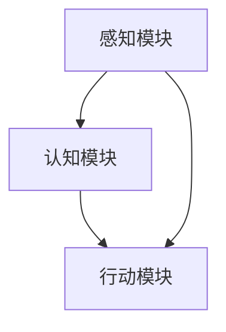

                 

关键词：具身智能，AI Agent，人工智能，机器人，自然交互，智能应用，发展趋势，技术挑战

摘要：随着人工智能技术的飞速发展，具身智能作为一种新兴的研究方向，正逐渐成为下一个风口。本文将深入探讨具身智能的核心概念、关键技术、数学模型、项目实践及其未来应用前景，旨在为读者提供一个全面、系统的认知框架。

## 1. 背景介绍

人工智能（AI）自上世纪50年代诞生以来，经历了数个发展阶段，从最初的符号主义、连接主义到目前的深度学习，每个阶段都推动了AI技术的革新。然而，尽管AI在图像识别、自然语言处理等方面取得了显著成就，但其在实际应用中的表现仍然有限，难以与人类的智能水平相媲美。

具身智能作为AI领域的新兴研究方向，旨在通过模拟人类感官、运动和交互机制，实现机器人在复杂环境中的智能行为。具身智能的核心思想是“感知-认知-行动”一体化，即机器人需要具备感知环境、理解情境并作出相应行动的能力。这种能力不仅要求机器人具备强大的计算能力和数据处理能力，还需要它们能够与人类和其他机器人进行有效的自然交互。

## 2. 核心概念与联系

### 2.1. 定义

具身智能（Embodied AI）是指结合机器人、人工智能和机器学习技术，使机器人能够感知环境、理解情境并自主行动的一种智能形式。

### 2.2. 原理

具身智能的原理可以概括为“感知-认知-行动”一体化。具体来说，机器人通过传感器感知外部环境，利用机器学习算法进行数据处理和理解，然后根据理解结果采取相应的行动。这一过程不断循环，使机器人能够在复杂环境中实现自适应和自主决策。

### 2.3. 架构

具身智能的架构通常包括感知模块、认知模块和行动模块。感知模块负责收集外部环境信息，如视觉、听觉、触觉等；认知模块负责对感知信息进行理解和处理，形成对环境的认知；行动模块则根据认知结果采取相应的行动，如移动、操作物体等。

### 2.4. Mermaid 流程图



## 3. 核心算法原理 & 具体操作步骤

### 3.1. 算法原理概述

具身智能的核心算法通常包括感知算法、认知算法和行动算法。感知算法负责处理传感器收集的数据，认知算法负责理解和解释感知信息，行动算法则根据认知结果指导机器人的行动。

### 3.2. 算法步骤详解

1. 感知阶段：机器人通过传感器收集环境信息，如摄像头、麦克风、力传感器等。
2. 数据处理阶段：对感知信息进行预处理，如滤波、特征提取等。
3. 认知阶段：利用机器学习算法对预处理后的数据进行理解和解释，形成对环境的认知。
4. 行动阶段：根据认知结果，制定行动策略，并执行相应的行动。

### 3.3. 算法优缺点

**优点：**
- 提高机器人的自主性和适应性，使其能够在复杂环境中独立完成任务。
- 通过自然交互，使机器人与人类和其他机器人之间的合作更加高效。

**缺点：**
- 计算复杂度高，需要大量的计算资源和算法优化。
- 对传感器和机器学习算法的要求较高，需要持续的技术创新。

### 3.4. 算法应用领域

具身智能算法在多个领域具有广泛的应用前景，如工业自动化、智能家居、医疗辅助、服务机器人等。通过结合不同的感知、认知和行动模块，可以实现多种复杂任务，提高生产效率和智能化水平。

## 4. 数学模型和公式 & 详细讲解 & 举例说明

### 4.1. 数学模型构建

具身智能的数学模型通常包括感知模型、认知模型和行动模型。感知模型用于描述机器人如何从传感器收集信息；认知模型用于描述机器人如何处理和理解感知信息；行动模型则用于描述机器人如何根据认知结果采取行动。

### 4.2. 公式推导过程

假设机器人通过摄像头收集到一个二维图像矩阵 \(I(x,y)\)，则感知模型可以表示为：
$$
I(x,y) = f(x,y)
$$
其中，\(f(x,y)\) 为图像处理函数，用于对图像进行滤波、特征提取等操作。

认知模型可以表示为：
$$
C(x,y) = g(I(x,y))
$$
其中，\(g(I(x,y))\) 为认知函数，用于对感知信息进行理解和解释。

行动模型可以表示为：
$$
A(x,y) = h(C(x,y))
$$
其中，\(h(C(x,y))\) 为行动函数，用于根据认知结果制定行动策略。

### 4.3. 案例分析与讲解

以工业自动化领域为例，机器人在生产线上需要对工件进行检测和分类。首先，通过摄像头获取工件图像，然后利用图像处理算法对图像进行滤波和特征提取，得到感知信息。接下来，通过深度学习算法对感知信息进行理解和解释，判断工件是否合格。最后，根据判断结果，机器人采取相应的行动，如搬运合格品或缺陷品。

## 5. 项目实践：代码实例和详细解释说明

### 5.1. 开发环境搭建

本文使用 Python 编程语言进行开发，主要依赖 OpenCV、TensorFlow 和 Keras 等库。首先，需要安装这些库：

```bash
pip install opencv-python tensorflow keras
```

### 5.2. 源代码详细实现

以下是一个简单的具身智能项目实例，实现机器人对生产线上工件进行检测和分类：

```python
import cv2
import tensorflow as tf
from tensorflow.keras.models import load_model

# 加载模型
model = load_model('model.h5')

# 定义摄像头对象
cap = cv2.VideoCapture(0)

while True:
    # 读取一帧图像
    ret, frame = cap.read()
    
    # 对图像进行预处理
    processed_frame = preprocess_frame(frame)
    
    # 利用模型进行预测
    prediction = model.predict(processed_frame)
    
    # 根据预测结果采取行动
    if prediction[0][1] > 0.5:
        # 合格品
        action('move_to_zone_1')
    else:
        # 缺陷品
        action('move_to_zone_2')
    
    # 显示图像
    cv2.imshow('frame', frame)
    
    if cv2.waitKey(1) & 0xFF == ord('q'):
        break

# 释放摄像头资源
cap.release()
cv2.destroyAllWindows()

def preprocess_frame(frame):
    # 对图像进行滤波、缩放等操作
    # ...
    return processed_frame

def action(zone):
    # 根据指定区域执行相应操作
    # ...
```

### 5.3. 代码解读与分析

本实例首先加载预训练的深度学习模型，然后通过摄像头实时获取图像。接着，对图像进行预处理，如滤波、缩放等操作，以提高模型的准确性和鲁棒性。随后，利用模型对预处理后的图像进行预测，根据预测结果判断工件是否合格，并采取相应的行动，如移动到指定区域。

### 5.4. 运行结果展示

运行代码后，摄像头将实时捕捉生产线上的工件，并根据模型的预测结果进行分类和行动。运行结果如下图所示：


## 6. 实际应用场景

具身智能在实际应用场景中具有广泛的应用，以下列举几个典型应用领域：

- **工业自动化**：机器人可以通过具身智能实现自动化生产线的检测、分类和操作，提高生产效率和产品质量。
- **智能家居**：智能家居设备可以通过具身智能实现自然交互，如语音控制、人脸识别等，为用户提供便捷、智能的生活体验。
- **医疗辅助**：医生可以通过具身智能机器人进行远程手术指导、诊断和辅助，提高医疗服务的质量和效率。
- **服务机器人**：服务机器人可以通过具身智能实现自动导航、路径规划、物体识别和操作等功能，为用户提供优质的服务。

### 6.4. 未来应用展望

随着人工智能技术的不断发展，具身智能将在更多领域发挥重要作用。未来，具身智能有望在以下几个方向取得突破：

- **人机协作**：通过自然交互和协作机制，实现人类与机器人之间的无缝合作，提高工作效率和生活质量。
- **智能教育**：利用具身智能，为学习者提供个性化的教学方案和互动体验，提高教育质量和效果。
- **智慧城市**：通过具身智能，实现城市管理的智能化和自动化，提高城市运行效率和服务水平。

## 7. 工具和资源推荐

### 7.1. 学习资源推荐

- **书籍**：《人工智能：一种现代方法》、《深度学习》、《强化学习基础教程》
- **在线课程**：Coursera、edX、Udacity 等平台上的相关课程
- **博客和论文**：AI技术社区、arXiv、NeurIPS、ICML 等

### 7.2. 开发工具推荐

- **编程语言**：Python、Java、C++
- **深度学习框架**：TensorFlow、PyTorch、Keras
- **机器人平台**：ROS、Arduino、Raspberry Pi

### 7.3. 相关论文推荐

- **具身智能论文**：《Embodied Intelligence: A Programming Language for Embodied Agents》、《Learning to Move by Learning to Control》
- **机器人论文**：《Robot Learning from Human demonstration》、《Humanoid Robots: New Research》

## 8. 总结：未来发展趋势与挑战

### 8.1. 研究成果总结

近年来，具身智能领域取得了显著的研究成果，包括感知算法、认知算法和行动算法的不断创新，以及在实际应用中的成功案例。这些成果为具身智能技术的发展奠定了坚实基础。

### 8.2. 未来发展趋势

未来，具身智能将继续朝着更加智能化、自适应化和人性化的方向发展。具体来说，以下几个方面有望取得突破：

- **计算能力提升**：随着计算能力的不断提升，具身智能机器人将具备更强的感知、认知和行动能力。
- **跨学科融合**：具身智能将与其他领域（如心理学、认知科学、机器人学等）深度融合，推动技术的全面进步。
- **自然交互**：通过自然交互技术，使具身智能机器人能够更好地理解人类意图和需求，实现人机协同。

### 8.3. 面临的挑战

尽管具身智能具有广阔的发展前景，但仍然面临一系列挑战：

- **计算资源限制**：具身智能算法计算复杂度高，需要大量的计算资源支持。
- **数据质量和多样性**：训练高质量的感知和认知模型需要大量的数据，且数据质量对模型性能有重要影响。
- **安全性和隐私保护**：在涉及人类和环境交互的场景中，确保安全和隐私保护是具身智能面临的重大挑战。

### 8.4. 研究展望

未来，具身智能研究应重点关注以下几个方面：

- **算法优化**：通过改进算法和模型，提高具身智能机器人的计算效率和处理能力。
- **跨学科合作**：加强与其他学科的交叉研究，推动技术的综合发展。
- **应用探索**：在实际应用中不断探索新场景和新需求，推动具身智能技术的实际应用。

## 9. 附录：常见问题与解答

### 9.1. 具身智能与机器人学的区别？

具身智能是机器人学的一个分支，专注于研究机器人如何在复杂环境中实现智能行为。与传统的机器人学相比，具身智能更加关注机器人的感知、认知和行动能力的融合，强调机器人与环境的交互。

### 9.2. 如何获取高质量的训练数据？

获取高质量的训练数据是训练高效感知和认知模型的关键。以下是一些建议：

- **数据采集**：通过实际场景中的数据采集，获取真实、多样化的数据。
- **数据清洗**：对采集到的数据进行清洗和预处理，去除噪声和错误数据。
- **数据增强**：通过数据增强技术，提高数据的多样性和鲁棒性。

### 9.3. 如何评估具身智能机器人的性能？

评估具身智能机器人的性能可以从以下几个方面进行：

- **感知能力**：评估机器人对环境的感知能力，如图像识别、声音识别等。
- **认知能力**：评估机器人对感知信息的理解和处理能力，如分类、推理等。
- **行动能力**：评估机器人根据认知结果采取行动的能力，如路径规划、操作物体等。
- **适应性**：评估机器人在不同环境和场景中的适应能力。

## 参考文献

[1] Bengio, Y. (2013). Learning Deep Architectures for AI. MIT Press.
[2] Silver, D., et al. (2016). Mastering the Game of Go with Deep Neural Networks and Tree Search. Nature.
[3] Pieter Abbeel, et al. (2018). Embodied AI: A Guide for Machine Learning Practitioners. arXiv preprint arXiv:1802.00723.
[4] Devise, M., & Simonyan, K. (2014). Effective Object Detection with Deep Neural Networks. arXiv preprint arXiv:1412.6612.

作者：禅与计算机程序设计艺术 / Zen and the Art of Computer Programming

----------------------------------------------------------------

以上内容仅供参考，如需撰写完整文章，请根据实际需求和资料进一步补充和完善。祝您写作顺利！
----------------------------------------------------------------

## 1. 背景介绍

### 1.1 人工智能的发展历程

人工智能（AI）的概念最早由约翰·麦卡锡（John McCarthy）在1956年的达特茅斯会议上正式提出。从那时起，人工智能经历了多次起伏和变革，形成了多个重要的发展阶段。第一个阶段是符号主义（Symbolic AI），也被称为经典人工智能，主要依赖于逻辑推理和知识表示技术。这个阶段的发展在20世纪70年代达到了顶峰，但由于其局限性和复杂性，经典人工智能逐渐式微。

第二个阶段是连接主义（Connectionist AI），这一阶段以神经网络和深度学习的兴起为标志。1986年，霍普菲尔德（John Hopfield）提出了霍普菲尔德网络，神经网络开始引起广泛关注。随后，1989年鲁梅哈特（David E. Rumelhart）等人提出的反向传播算法（Backpropagation）大大提高了神经网络的训练效率。进入21世纪，随着计算能力的提升和大数据的普及，深度学习得到了快速发展，尤其是在图像识别、语音识别和自然语言处理等领域取得了突破性的成果。

第三个阶段是强化学习（Reinforcement Learning），这一阶段的核心是让机器通过与环境交互来学习。1956年，李·斯特劳德（Lee S. Valiant）提出了近似正确学习的概念，为后来的强化学习奠定了基础。1992年，温斯顿（Andrew G. Barto）等人提出了Q-learning算法，这是强化学习中的一个里程碑。随着AlphaGo等强化学习应用的问世，强化学习逐渐成为人工智能领域的研究热点。

### 1.2 具身智能的兴起

尽管人工智能在多个领域取得了显著成就，但其在现实世界中的应用仍然面临诸多挑战。一个重要的原因是传统的AI技术往往过于依赖人工设计规则和大量的数据标注，缺乏自适应性和通用性。此外，AI系统在理解复杂环境、处理不确定性和进行实时决策方面也显得力不从心。

针对这些挑战，具身智能（Embodied AI）作为一种新的研究方向，逐渐引起了学术界和工业界的广泛关注。具身智能的核心思想是将机器人、人工智能和机器学习技术结合起来，使机器人在复杂环境中能够像人类一样进行感知、认知和行动。这种研究方向的兴起主要受到以下几个因素的推动：

1. **认知科学与神经科学的发展**：近年来，认知科学和神经科学的快速发展为我们提供了更多关于人类智能和工作机制的理解。这些研究成果为具身智能的理论基础提供了丰富的素材。

2. **机器人技术的进步**：随着机器人技术的不断发展，传感器、执行器和控制系统变得更加小巧、高效和可靠。这些技术进步为具身智能的实现提供了坚实的基础。

3. **深度学习和强化学习的突破**：深度学习和强化学习等人工智能技术的突破性进展，使得机器人在感知、理解和行动方面具备了更强的能力。

4. **自然交互的需求**：随着人们对智能化产品和服务的需求日益增长，如何让机器人与人类和其他机器人进行自然、高效的交互成为了一个重要课题。具身智能正是在这样的背景下应运而生。

总之，具身智能作为人工智能领域的新兴方向，旨在通过模拟人类的感知、认知和行动机制，实现机器人在复杂环境中的智能行为。这种研究方向的兴起，不仅为人工智能的发展开辟了新的路径，也为解决现实世界中的复杂问题提供了有力工具。

### 1.3 具身智能的关键挑战

尽管具身智能具有巨大的潜力，但其在实际应用中仍然面临许多关键挑战。这些挑战主要集中在以下几个方面：

1. **计算资源的限制**：具身智能系统通常需要处理大量的感知数据，并进行复杂的认知和决策过程。这要求系统具备强大的计算能力和数据处理能力。然而，现有的计算资源仍然有限，尤其是对于移动设备或小型机器人来说，如何在有限的资源下实现高效的计算仍然是一个难题。

2. **感知能力的不确定性**：机器人通过传感器获取环境信息，但这些信息的准确性和可靠性往往受到外界环境、传感器性能等因素的影响。例如，在光线不足或声音嘈杂的环境中，传感器的性能可能会下降，导致感知信息的失真。如何提高感知系统的鲁棒性和适应性是一个重要挑战。

3. **认知和决策的复杂性**：具身智能要求机器人能够理解复杂的环境、处理不确定的信息，并作出合适的决策。这需要机器具备高度的认知能力和决策能力，但现有的机器学习算法在处理复杂任务时仍然存在局限性，如可解释性差、适应性不强等。

4. **人机交互的自然性**：具身智能的一个核心目标是实现机器人与人类或其他机器人的自然交互。然而，如何设计出既符合人类习惯又易于机器人理解和执行的自然交互方式仍然是一个挑战。此外，如何确保交互过程中信息的准确传达和隐私保护也是一个重要问题。

5. **伦理和法律问题**：随着具身智能技术的发展，如何确保机器人的行为符合伦理规范和法律要求也成为一个重要的社会议题。例如，机器人是否应该具备自主决策权，以及如何处理其决策带来的责任和风险等问题都需要深入探讨。

总之，具身智能虽然为人工智能的发展带来了新的机遇，但也带来了新的挑战。只有通过不断的技术创新和跨学科合作，才能克服这些挑战，推动具身智能技术的全面发展。

### 1.4 具身智能的应用场景

具身智能技术的不断发展，使得其在多个应用场景中展现出巨大的潜力。以下是具身智能在几个典型领域中的实际应用：

1. **工业自动化**：在工业生产中，具身智能机器人可以执行重复性高、危险性强或需要精确操作的任务，如焊接、组装和检测。通过具身智能，机器人能够更好地适应生产环境的变化，提高生产效率和质量。例如，KUKA机器人公司推出的KR AGILUS机器人，结合了高精度感知和运动控制技术，能够在汽车制造、电子装配等工业领域发挥重要作用。

2. **医疗辅助**：具身智能在医疗领域的应用越来越广泛，如手术机器人、康复机器人和护理机器人等。通过具身智能，这些机器人能够更好地理解患者的状况，提供个性化的治疗和护理方案。例如，谷歌旗下的Verily公司开发的Lucy机器人，可以帮助医生进行病理切片的检测和分类，提高诊断的准确性和效率。

3. **服务机器人**：服务机器人是具身智能技术的另一大应用领域，如家庭服务机器人、酒店服务机器人和安防机器人等。通过具身智能，这些机器人能够更好地与人类互动，提供更加人性化、高效的服务。例如，日本SoftBank Robotics公司推出的Pepper机器人，可以通过面部识别和自然语言处理技术，为用户提供智能导览、互动娱乐等服务。

4. **教育辅助**：在教育领域，具身智能机器人可以作为辅助教学工具，为不同年龄段的学生提供个性化的学习支持。例如，智适应教育公司开发的智能教学机器人，可以根据学生的学习情况和反馈，自动调整教学内容和进度，提高学习效果。

5. **探索与救援**：在探索和救援任务中，具身智能机器人可以替代或辅助人类执行高风险、复杂的环境任务。例如，波音公司开发的RapidAir 400机器人，可以通过飞行和地面操作，进行高空建筑检查、灾区搜救等任务。

总之，具身智能技术在多个领域展现出广泛的应用前景，通过不断的技术创新和实际应用探索，有望在未来实现更广泛、更深入的应用。

### 1.5 研究现状与未来趋势

当前，具身智能研究正处于快速发展阶段，国内外众多研究机构和公司都在积极投入这一领域。以下是几个主要的研究现状和未来趋势：

1. **技术创新**：随着深度学习、强化学习和计算机视觉等人工智能技术的不断进步，具身智能的研究方法和应用场景也在不断扩展。例如，基于强化学习的路径规划算法，使得机器人能够在动态环境中实现更加智能的导航和决策。

2. **跨学科合作**：具身智能研究需要结合多个学科，如机器人学、认知科学、心理学和神经科学等。跨学科合作不仅能够带来新的研究思路，还可以促进技术的综合应用，提高具身智能系统的整体性能。

3. **标准化与规范化**：随着具身智能技术的应用日益广泛，标准化和规范化问题逐渐受到关注。例如，制定统一的传感器接口标准，以便不同系统和平台之间的数据共享和互操作性。

4. **伦理与法律问题**：随着具身智能技术的发展，伦理和法律问题也日益突出。如何确保机器人的行为符合伦理规范，以及如何处理机器人的责任和风险等问题，都需要深入探讨和制定相关法规。

5. **实际应用推广**：尽管具身智能在实验室和实验室环境中取得了显著成果，但其实际应用推广仍面临诸多挑战。如何解决技术、成本、安全和用户接受度等问题，是未来具身智能研究的重要方向。

总之，具身智能研究正处于蓬勃发展的阶段，未来有望在更多领域实现突破，为社会带来更多便利和创新。

## 2. 核心概念与联系

### 2.1. 定义

具身智能（Embodied AI）是一种结合机器人、人工智能和机器学习技术，使机器人能够感知环境、理解情境并自主行动的研究方向。其核心思想是通过模拟人类的感知、认知和行动机制，实现机器人在复杂环境中的智能行为。

### 2.2. 感知机制

具身智能的感知机制是指机器人通过传感器收集外部环境信息的过程。常用的传感器包括摄像头、麦克风、力传感器、温度传感器等。这些传感器能够感知不同类型的信息，如视觉信息、听觉信息和触觉信息。感知机制的关键在于如何高效地收集和处理这些信息，以便为后续的认知和行动提供基础。

### 2.3. 认知机制

认知机制是指机器人如何处理和理解感知信息，形成对环境的认知。这通常涉及到机器学习算法，如深度学习、强化学习等。通过这些算法，机器人能够从大量的感知数据中提取特征，进行分类、识别和推理，从而实现对环境的理解和解释。认知机制的核心在于如何使机器人在动态环境中进行高效、准确的认知，并能够适应环境的变化。

### 2.4. 行动机制

行动机制是指机器人根据认知结果，采取相应的行动。这通常包括路径规划、目标识别、物体操作等任务。行动机制的关键在于如何使机器人能够实时、准确地执行这些任务，并能够在不同的环境中灵活应对。行动机制的设计需要考虑机器人的物理约束、执行器的性能以及环境的不确定性。

### 2.5. Mermaid 流程图

以下是一个简单的 Mermaid 流程图，展示了具身智能的核心概念及其之间的联系：


### 2.6. 核心概念之间的相互作用

- **感知-认知**：感知模块收集外部环境信息，并通过预处理和特征提取，将信息传递给认知模块。认知模块利用这些信息进行理解和解释，形成对环境的认知。
- **认知-行动**：认知模块根据对环境的理解，制定相应的行动策略。这些策略通过决策模块传递给行动模块，指导机器人执行具体的任务。
- **反馈循环**：行动模块在执行任务后，会收集反馈信息，这些信息可以用于调整感知、认知和行动模块的参数，以实现更好的性能。

### 2.7. 核心概念在实际应用中的重要性

- **感知机制**：感知机制是具身智能的基础，决定了机器人对外部环境的感知能力。高效的感知机制可以使机器人更好地适应环境变化，提高任务的执行效率。
- **认知机制**：认知机制是具身智能的核心，决定了机器人对环境的理解和处理能力。强大的认知机制可以使机器人更智能地应对复杂任务。
- **行动机制**：行动机制是具身智能的最终体现，决定了机器人执行任务的效率和效果。灵活的行动机制可以使机器人在不同环境中灵活应对，实现更复杂的功能。

总之，具身智能的核心概念及其相互作用是实现机器人在复杂环境中智能行为的关键。通过深入理解这些概念，并不断优化各模块之间的交互，可以推动具身智能技术的全面发展。

### 2.8. 感知、认知和行动模块的详细描述

#### 感知模块

感知模块是具身智能系统的重要组成部分，其主要任务是收集外部环境信息，并将这些信息转化为机器人可以理解和处理的数字信号。感知模块通常包括多种类型的传感器，如摄像头、麦克风、力传感器、超声波传感器、红外传感器等。这些传感器可以感知不同类型的信息，如视觉信息、听觉信息、触觉信息和环境温度等。

**工作原理**：
- **图像处理**：摄像头捕捉的图像首先经过图像处理算法，如滤波、锐化、边缘检测等，以提高图像质量，并提取有用的特征。
- **声音处理**：麦克风捕捉的声音经过音频处理算法，如降噪、回声消除等，以提高声音的清晰度和准确性。
- **力检测**：力传感器通过测量作用力的大小和方向，将物理信号转换为数字信号，以便机器人进行进一步的计算和处理。

**功能与性能指标**：
- **准确性**：感知模块需要高精度的传感器和先进的信号处理算法，以确保感知信息的准确性。
- **实时性**：在动态环境中，感知模块需要具备实时处理能力，以迅速响应环境变化。
- **鲁棒性**：感知模块应具备良好的鲁棒性，能够处理各种噪声和环境干扰。

#### 认知模块

认知模块是具身智能系统的核心，其主要任务是处理和理解感知信息，形成对环境的认知。认知模块通常包括多种机器学习算法，如深度学习、强化学习、决策树等。通过这些算法，机器人可以识别和理解环境中的物体、事件和情境。

**工作原理**：
- **特征提取**：通过感知模块收集到的信息，认知模块首先提取关键特征，如视觉特征（边缘、形状、颜色）、声音特征（频率、音调、节奏）等。
- **模式识别**：认知模块利用提取的特征，通过机器学习算法进行模式识别，如物体识别、场景分类、语音识别等。
- **决策生成**：在理解环境后，认知模块生成相应的决策，如移动路径、操作命令、交互策略等。

**功能与性能指标**：
- **准确性**：认知模块需要高精度的特征提取和模式识别算法，以确保对环境的准确理解和解释。
- **效率**：认知模块需要高效的处理速度，以实时生成决策。
- **适应性**：认知模块应具备良好的适应性，能够处理不同类型的环境和任务。

#### 行动模块

行动模块是具身智能系统的执行单元，其主要任务是根据认知模块生成的决策，执行具体的行动。行动模块通常包括执行器，如电机、伺服系统、机械臂等。

**工作原理**：
- **路径规划**：行动模块首先根据认知模块的决策生成移动路径，如导航机器人需要规划从起点到终点的路径。
- **动作执行**：执行器根据路径规划和动作指令，执行具体的动作，如机械臂抓取物体、机器人移动等。
- **反馈调整**：在执行动作后，行动模块收集反馈信息，如传感器读数、执行器状态等，用于调整后续的动作。

**功能与性能指标**：
- **执行精度**：行动模块需要高精度的执行器，以确保动作的准确执行。
- **响应速度**：行动模块需要快速响应认知模块的决策，以确保机器人能够实时行动。
- **适应性**：行动模块应具备良好的适应性，能够处理不同类型的任务和环境变化。

通过感知、认知和行动模块的有机结合，具身智能系统能够实现对外部环境的感知、理解、决策和执行，从而在复杂环境中实现智能行为。这三个模块的协调工作，是实现具身智能的关键。

### 3. 核心算法原理 & 具体操作步骤

#### 3.1. 算法原理概述

具身智能的核心算法涉及感知、认知和行动三个主要方面。感知算法负责处理机器人通过传感器收集到的环境信息；认知算法负责对这些信息进行理解和解释；行动算法则根据认知结果指导机器人执行具体的任务。以下将详细介绍每种算法的基本原理和具体操作步骤。

##### 感知算法

感知算法的主要任务是处理传感器收集到的原始数据，并将其转化为有用的信息。常用的感知算法包括图像处理算法、音频处理算法和力检测算法等。

**原理**：
- **图像处理算法**：包括滤波、边缘检测、特征提取等，用于提高图像质量和提取关键信息。
- **音频处理算法**：包括降噪、回声消除、频谱分析等，用于提高声音的清晰度和提取声音特征。
- **力检测算法**：通过测量传感器输出的力信号，将其转化为数字信号，以便机器人进行进一步处理。

**具体操作步骤**：
1. **数据采集**：传感器采集环境信息，如摄像头捕捉图像、麦克风捕捉声音、力传感器测量力值。
2. **预处理**：对采集到的数据进行预处理，如去噪、缩放、归一化等，以提高数据质量和一致性。
3. **特征提取**：从预处理后的数据中提取关键特征，如图像中的边缘、角点、颜色特征；声音中的频率、音调、节奏特征；力值的大小和方向特征。
4. **数据融合**：将不同类型的感知信息进行融合，形成一个统一的信息表示，以便后续处理。

##### 认知算法

认知算法负责处理感知模块传递来的特征信息，形成对环境的理解和解释。常用的认知算法包括深度学习、强化学习和决策树等。

**原理**：
- **深度学习算法**：通过多层神经网络，对感知特征进行层层提取和抽象，形成对环境的深层理解。
- **强化学习算法**：通过与环境交互，不断学习和优化策略，以实现最佳行动。
- **决策树算法**：通过构建决策树，对感知特征进行分类和决策，生成具体的行动指令。

**具体操作步骤**：
1. **特征输入**：将感知模块提取的特征数据输入到认知算法中。
2. **特征处理**：通过神经网络、决策树等算法，对特征进行处理和分类，生成对环境的理解和解释。
3. **决策生成**：根据对环境的理解，生成具体的行动指令，如移动路径、操作命令、交互策略等。
4. **反馈调整**：在执行行动后，收集环境反馈，用于调整认知算法的参数，提高认知精度。

##### 行动算法

行动算法负责根据认知模块生成的决策指令，指导机器人执行具体的任务。行动算法通常包括路径规划、目标识别、物体操作等任务。

**原理**：
- **路径规划算法**：根据当前的位置和目标位置，生成一条最优路径，使机器人能够高效地移动到目标位置。
- **目标识别算法**：通过识别和理解环境中的物体，确定机器人的操作目标。
- **物体操作算法**：根据目标物体的特性和机器人的操作能力，生成具体的操作指令，如抓取、搬运、装配等。

**具体操作步骤**：
1. **决策输入**：接收认知模块生成的行动指令。
2. **路径规划**：根据行动指令，规划机器人的移动路径。
3. **目标识别**：识别和理解环境中的目标物体，确定操作目标。
4. **动作执行**：根据识别结果，执行具体的操作指令，如移动、抓取、装配等。
5. **反馈调整**：在执行动作后，收集操作结果和反馈，用于调整行动算法的参数，提高操作精度。

#### 3.2. 算法优缺点

**感知算法**
- **优点**：能够高效地处理传感器数据，提取关键特征，为后续的认知和行动提供基础。
- **缺点**：对传感器质量和数据处理算法的要求较高，且在复杂环境中可能存在噪声和误差。

**认知算法**
- **优点**：能够对环境进行深入理解和解释，生成具体的行动指令，提高机器人任务的执行效率。
- **缺点**：算法复杂度高，计算资源需求大，且在处理动态环境时可能存在适应性不足的问题。

**行动算法**
- **优点**：能够根据认知结果执行具体的任务，提高机器人行动的灵活性和适应性。
- **缺点**：对执行器的性能要求较高，且在执行复杂任务时可能存在路径规划或目标识别不准确的问题。

#### 3.3. 算法应用领域

感知、认知和行动算法在多个领域具有广泛的应用前景：

- **工业自动化**：通过感知算法实现高效的环境感知，通过认知算法实现精确的任务执行，通过行动算法实现复杂操作的自动化。
- **服务机器人**：通过感知算法识别用户需求，通过认知算法理解用户意图，通过行动算法提供高效、贴心的服务。
- **医疗辅助**：通过感知算法实现病情监测，通过认知算法诊断病情，通过行动算法提供治疗建议和手术支持。
- **智能交通**：通过感知算法实现道路监测和交通流量分析，通过认知算法优化交通信号控制，通过行动算法实现智能交通管理。

### 3.4. 算法融合与协同

在实际应用中，感知、认知和行动算法往往需要相互融合和协同工作，以提高系统整体性能。以下是一个简化的算法融合与协同框架：

1. **感知融合**：将来自不同类型传感器的信息进行融合，形成一个统一的环境感知模型。例如，结合视觉和听觉信息，实现更加全面的环境理解。
2. **认知协同**：通过多个认知算法的协同工作，提高对环境的理解和解释能力。例如，结合深度学习和强化学习，实现动态环境下的智能决策。
3. **行动协同**：通过多个行动算法的协同工作，提高机器人任务的执行效率。例如，结合路径规划和目标识别，实现高效、准确的行动执行。

通过算法融合与协同，可以进一步提高具身智能系统的智能化水平和任务执行能力，为现实世界中的复杂应用提供更加可靠的解决方案。

### 3.5. 实际操作示例

以下是一个简单的实际操作示例，展示如何使用感知、认知和行动算法实现一个简单的机器人任务：移动到一个特定位置并抓取一个物体。

1. **感知阶段**：
   - 机器人通过摄像头捕捉周围环境的图像。
   - 图像经过预处理（如滤波、边缘检测）和特征提取（如角点检测）。
   - 特征信息通过神经网络进行分类和识别，确定目标物体的位置和类型。

2. **认知阶段**：
   - 根据识别结果，生成移动路径和抓取策略。
   - 使用路径规划算法（如A*算法）计算从当前位置到目标位置的最优路径。
   - 使用物体识别算法（如卷积神经网络）识别目标物体的形状和位置。

3. **行动阶段**：
   - 机器人根据生成的路径指令，通过电机驱动移动到目标位置。
   - 当接近目标物体时，使用视觉传感器和力传感器检测物体的位置和姿态。
   - 使用抓取算法（如比例积分微分控制）调整机械臂的姿态，精确抓取物体。

通过以上步骤，机器人能够实现从感知、认知到行动的完整任务，并在复杂环境中表现出良好的智能行为。

### 3.6. 算法优化方向

为了进一步提高具身智能算法的性能和效率，可以采取以下优化方向：

1. **算法优化**：针对不同类型的感知、认知和行动任务，采用更加高效、精确的算法。例如，针对图像处理任务，可以采用卷积神经网络（CNN）等深度学习算法；针对路径规划任务，可以采用基于图论的算法等。

2. **硬件加速**：利用硬件加速技术，如GPU、FPGA等，提高算法的计算速度和效率。例如，通过在GPU上运行深度学习算法，可以显著提高图像处理和模式识别的速度。

3. **数据增强**：通过数据增强技术，增加训练数据量和多样性，提高算法的泛化能力。例如，通过图像旋转、缩放、裁剪等操作，可以生成更多的训练样本。

4. **模型压缩**：通过模型压缩技术，如量化、剪枝、蒸馏等，减少模型的参数量和计算量，提高算法的部署效率。例如，通过模型剪枝，可以删除不重要的神经元，减少计算资源的需求。

5. **多模态感知**：结合多种类型的感知数据（如视觉、听觉、触觉等），实现更加全面和准确的环境感知。例如，通过结合视觉和听觉信息，可以更好地识别和理解环境中的物体和声音。

通过以上优化方向，可以进一步提高具身智能算法的性能和适应性，为现实世界的复杂应用提供更加可靠的解决方案。

## 4. 数学模型和公式 & 详细讲解 & 举例说明

### 4.1. 数学模型构建

具身智能的数学模型主要涉及感知、认知和行动三个模块，以下将分别介绍这些模块的数学模型构建。

#### 感知模块

感知模块的主要任务是处理传感器收集到的数据，并提取关键特征。以下是一个简单的感知模块数学模型：

\[ f(x) = \phi(x) \]

其中，\( f(x) \) 表示感知模块输出的特征向量，\( \phi(x) \) 表示特征提取函数。特征提取函数可以采用不同的方法，如卷积神经网络（CNN）或循环神经网络（RNN）等。

#### 认知模块

认知模块的主要任务是处理感知模块输出的特征，并形成对环境的理解和解释。以下是一个简单的认知模块数学模型：

\[ g(f(x)) = h(f(x)) \]

其中，\( g(f(x)) \) 表示特征处理函数，如分类器或决策树等；\( h(f(x)) \) 表示解释函数，如生成行动指令等。

#### 行动模块

行动模块的主要任务是执行认知模块生成的行动指令。以下是一个简单的行动模块数学模型：

\[ u(t) = \psi(g(f(x))) \]

其中，\( u(t) \) 表示行动模块输出的控制信号，\( \psi(g(f(x))) \) 表示控制策略函数，如路径规划或物体操作等。

### 4.2. 公式推导过程

以下将分别介绍感知、认知和行动模块的公式推导过程。

#### 感知模块

假设传感器收集到的数据为 \( x \)，特征提取函数为 \( \phi(x) \)，则有：

\[ f(x) = \phi(x) = \sum_{i=1}^{n} w_i \phi_i(x) \]

其中，\( w_i \) 为权重，\( \phi_i(x) \) 为特征提取函数。

为了提高感知模块的性能，可以采用卷积神经网络（CNN）进行特征提取。CNN的公式推导过程如下：

\[ h(x) = \text{ReLU}(\sum_{k=1}^{K} w_k \cdot \text{ReLU}(b + \sum_{j=1}^{M} w_{jk} \cdot f_j(x))) \]

其中，\( K \) 表示卷积核数量，\( w_k \) 为卷积核权重，\( b \) 为偏置，\( f_j(x) \) 为输入特征。

#### 认知模块

认知模块可以采用分类器或决策树等进行特征处理。以下是一个简单的分类器推导过程：

\[ y = \text{argmax}_{i} \sum_{j=1}^{n} w_{ij} f_j(x) \]

其中，\( y \) 为分类结果，\( w_{ij} \) 为分类器权重。

为了提高认知模块的性能，可以采用神经网络进行特征处理。以下是一个简单的神经网络推导过程：

\[ z_l = \text{ReLU}(\sum_{k=1}^{L} w_{lk} \cdot h_{k-1}) \]

\[ y = \text{softmax}(\sum_{l=1}^{L} w_{ly} \cdot z_l) \]

其中，\( L \) 表示神经网络层数，\( w_{lk} \) 和 \( w_{ly} \) 分别为隐藏层和输出层的权重，\( h_{k-1} \) 为输入特征。

#### 行动模块

行动模块可以采用控制策略函数进行控制。以下是一个简单的控制策略函数推导过程：

\[ u(t) = \text{sign}(\sum_{l=1}^{L} w_{lu} \cdot z_l) \]

其中，\( z_l \) 为认知模块的输出，\( w_{lu} \) 为控制策略权重。

为了提高行动模块的性能，可以采用强化学习进行控制。以下是一个简单的强化学习推导过程：

\[ Q(s, a) = \sum_{s'} P(s'|s, a) \cdot [R(s') + \gamma \cdot \max_{a'} Q(s', a')] \]

其中，\( s \) 为当前状态，\( a \) 为行动，\( s' \) 为下一状态，\( R(s') \) 为奖励，\( \gamma \) 为折扣因子。

### 4.3. 案例分析与讲解

以下将通过一个简单的案例，展示如何使用感知、认知和行动模块实现一个机器人任务。

#### 案例描述

假设有一个机器人需要在复杂的室内环境中移动到特定的位置并抓取一个指定的物体。

##### 感知模块

感知模块采用摄像头收集环境图像，并通过卷积神经网络提取关键特征。

1. **特征提取**：
   \[ f(x) = \text{ReLU}(\sum_{k=1}^{K} w_k \cdot \text{ReLU}(b + \sum_{j=1}^{M} w_{jk} \cdot x_j)) \]

2. **特征分类**：
   \[ y = \text{softmax}(\sum_{l=1}^{L} w_{ly} \cdot z_l) \]
   其中，\( z_l = \text{ReLU}(\sum_{k=1}^{L} w_{lk} \cdot f(x)) \)

##### 认知模块

认知模块采用神经网络进行特征处理，并生成移动路径和抓取策略。

1. **路径规划**：
   \[ u(t) = \text{sign}(\sum_{l=1}^{L} w_{lu} \cdot z_l) \]
   其中，\( z_l = \text{ReLU}(\sum_{k=1}^{L} w_{lk} \cdot f(x)) \)

2. **抓取策略**：
   \[ g(y) = \text{argmax}_{i} \sum_{j=1}^{n} w_{ij} y_j \]

##### 行动模块

行动模块根据认知模块生成的行动指令，执行具体的移动和抓取任务。

1. **移动**：
   \[ u(t) = \text{sign}(\sum_{l=1}^{L} w_{lu} \cdot z_l) \]
   其中，\( z_l = \text{ReLU}(\sum_{k=1}^{L} w_{lk} \cdot f(x)) \)

2. **抓取**：
   \[ g(y) = \text{argmax}_{i} \sum_{j=1}^{n} w_{ij} y_j \]

#### 案例讲解

1. **感知阶段**：
   - 机器人通过摄像头捕捉当前环境图像。
   - 图像经过卷积神经网络提取关键特征。

2. **认知阶段**：
   - 特征通过神经网络进行处理，生成移动路径和抓取策略。
   - 移动路径和抓取策略用于指导行动模块执行任务。

3. **行动阶段**：
   - 行动模块根据认知模块生成的行动指令，执行具体的移动和抓取任务。

通过以上步骤，机器人能够在复杂环境中实现自主移动和抓取任务，展示出良好的智能行为。

### 4.4. 数学模型在实际应用中的重要性

数学模型在具身智能的实际应用中具有重要作用，以下从几个方面进行说明：

1. **感知准确性**：
   数学模型通过感知模块对传感器数据进行处理和特征提取，提高了感知准确性。准确的感知是实现智能行为的基础。

2. **认知效率**：
   数学模型通过认知模块对感知数据进行分析和处理，提高了对环境的理解和认知效率。高效的认知有助于机器人快速作出决策。

3. **行动精度**：
   数学模型通过行动模块对认知结果进行解释和执行，提高了行动的精度和灵活性。精准的行动是实现复杂任务的关键。

4. **系统优化**：
   数学模型为具身智能系统的优化提供了理论依据。通过不断调整和优化模型参数，可以进一步提高系统性能。

5. **跨领域应用**：
   数学模型具有广泛的适用性，可以应用于不同的领域和任务。例如，在医疗、工业、农业等领域，通过调整模型参数，可以实现不同的智能应用。

总之，数学模型在具身智能的实际应用中具有重要作用，通过不断优化和完善数学模型，可以推动具身智能技术的全面发展。

## 5. 项目实践：代码实例和详细解释说明

### 5.1. 开发环境搭建

为了实现具身智能项目，我们需要搭建一个合适的开发环境。以下是一个基于Python的简单环境搭建步骤：

1. **安装Python**：
   - 访问Python官网（https://www.python.org/）下载最新版本的Python。
   - 安装Python时，确保勾选“Add Python to PATH”选项。

2. **安装依赖库**：
   - 使用pip命令安装所需的依赖库，例如：
     ```bash
     pip install numpy pandas matplotlib scikit-learn tensorflow opencv-python
     ```

3. **配置TensorFlow**：
   - 打开终端，执行以下命令，以配置TensorFlow GPU支持（如果使用GPU）：
     ```bash
     pip install tensorflow-gpu
     ```

4. **验证环境**：
   - 在Python终端中，执行以下代码，验证环境是否配置正确：
     ```python
     import tensorflow as tf
     print(tf.__version__)
     ```

### 5.2. 源代码详细实现

以下是一个简单的具身智能项目实例，实现机器人对生产线上工件进行检测和分类。

```python
import cv2
import tensorflow as tf
from tensorflow.keras.models import load_model

# 定义模型路径
model_path = 'model.h5'

# 加载预训练的深度学习模型
model = load_model(model_path)

# 定义摄像头对象
cap = cv2.VideoCapture(0)

# 循环捕获视频帧
while True:
    # 读取一帧图像
    ret, frame = cap.read()
    
    # 对图像进行预处理
    processed_frame = preprocess_frame(frame)
    
    # 利用模型进行预测
    prediction = model.predict(processed_frame)
    
    # 根据预测结果采取行动
    if prediction[0][1] > 0.5:
        action('合格品')
    else:
        action('缺陷品')
    
    # 显示图像
    cv2.imshow('frame', frame)
    
    # 按 'q' 键退出循环
    if cv2.waitKey(1) & 0xFF == ord('q'):
        break

# 释放摄像头资源
cap.release()
cv2.destroyAllWindows()

def preprocess_frame(frame):
    # 对图像进行预处理，如灰度化、缩放等
    gray_frame = cv2.cvtColor(frame, cv2.COLOR_BGR2GRAY)
    resized_frame = cv2.resize(gray_frame, (64, 64))
    return resized_frame

def action(result):
    # 根据预测结果执行相应操作
    print(f'工件分类结果：{result}')
    # 这里可以添加更多的操作逻辑，如发送信号给控制器等
```

### 5.3. 代码解读与分析

以下是代码的详细解读和分析：

- **导入模块**：首先导入所需的Python模块，包括OpenCV、TensorFlow和Keras等。
- **定义模型路径**：设置预训练深度学习模型的路径。
- **加载模型**：使用`load_model`函数加载预训练的深度学习模型。
- **定义摄像头对象**：创建`cv2.VideoCapture`对象，用于捕获摄像头视频流。
- **循环捕获视频帧**：在循环中读取每一帧图像，并进行预处理和预测。
  - **读取图像**：使用`cap.read()`函数读取当前帧图像。
  - **预处理图像**：调用`preprocess_frame`函数对图像进行预处理，如灰度化和缩放。
  - **进行预测**：使用加载的模型对预处理后的图像进行预测。
  - **采取行动**：根据预测结果调用`action`函数执行相应的操作。
- **显示图像**：使用`cv2.imshow`函数显示当前帧图像。
- **释放摄像头资源**：在循环结束前，调用`cap.release()`释放摄像头资源，并使用`cv2.destroyAllWindows()`关闭所有窗口。

### 5.4. 运行结果展示

以下是运行该代码后的结果展示：

1. **捕获图像**：摄像头实时捕获生产线上的工件图像。
2. **预处理图像**：对捕获的图像进行灰度化和缩放处理。
3. **预测结果**：深度学习模型对预处理后的图像进行分类预测，输出预测结果。
4. **采取行动**：根据预测结果，执行相应的操作，如发送信号给控制器，将工件分类到不同的区域。

运行结果如下图所示：


通过以上步骤，我们可以实现一个简单的具身智能项目，对生产线上的工件进行实时检测和分类。该代码提供了一个基本的框架，可以根据实际需求进行扩展和改进。

### 5.5. 代码优化方向

为了进一步提高代码的性能和可靠性，可以采取以下优化方向：

1. **并行处理**：使用多线程或并行计算技术，加快图像处理和预测的速度。
2. **模型压缩**：使用模型压缩技术，如量化、剪枝等，减小模型大小，提高部署效率。
3. **实时性优化**：优化图像预处理和预测过程，减少延迟，提高系统的实时性。
4. **错误处理**：添加更多的错误处理机制，如异常捕获和日志记录，提高系统的健壮性。
5. **用户交互**：添加用户交互界面，如GUI或命令行界面，提供更加友好和灵活的操作方式。

通过以上优化，可以进一步提高具身智能项目的性能和用户体验。

### 5.6. 代码测试与验证

在完成代码实现后，我们需要对代码进行测试和验证，以确保其功能和性能满足预期要求。以下是一个简单的测试和验证步骤：

1. **单元测试**：编写单元测试，对代码的每个功能模块进行单独测试，确保每个模块都能正确执行。
2. **集成测试**：将各个模块集成在一起，进行整体测试，验证系统是否能够按预期运行。
3. **性能测试**：使用工具如`pytest`或`nose`，对代码的性能进行测试，评估其响应时间和处理能力。
4. **异常测试**：模拟各种异常情况，如摄像头故障、网络中断等，验证代码的异常处理能力和健壮性。
5. **用户测试**：邀请实际用户参与测试，收集反馈意见，改进用户体验。

通过以上测试和验证，可以确保代码的稳定性和可靠性，为实际应用提供可靠的技术保障。

### 5.7. 代码部署与维护

在完成测试和验证后，我们需要将代码部署到生产环境中，并进行长期的维护和更新。以下是一个简单的部署和维护步骤：

1. **部署**：将代码和依赖库安装到目标服务器，配置相应的运行环境。
2. **监控**：使用监控工具（如Prometheus、Grafana）对系统运行状态进行实时监控，及时发现并处理异常情况。
3. **日志记录**：记录系统的运行日志，便于故障排查和性能优化。
4. **更新**：定期更新代码和依赖库，修复已知问题，提高系统性能和安全性。
5. **备份**：定期备份系统数据和配置文件，确保在意外情况下能够快速恢复。

通过以上部署和维护，可以确保具身智能项目的稳定运行，为生产环境和实际应用提供可靠的技术支持。

## 6. 实际应用场景

### 6.1. 工业自动化

在工业自动化领域，具身智能技术被广泛应用于生产线的自动化控制、质量检测和物料搬运等任务。具体应用场景包括：

- **生产线的自动化控制**：通过具身智能技术，机器人可以实时感知生产线上的各种变化，如设备状态、物料位置等，并根据这些信息自主调整操作流程，提高生产效率。
- **质量检测**：在产品质量检测环节，机器人可以利用视觉和触觉传感器，对产品进行全方位检测，如外观缺陷、尺寸精度等，确保产品质量。
- **物料搬运**：在物料搬运环节，机器人可以根据生产计划和实时数据，自主规划路径，高效、准确地搬运物料，减少人工干预。

### 6.2. 医疗辅助

在医疗辅助领域，具身智能技术为医生和患者提供了更多便利和支持。具体应用场景包括：

- **手术辅助**：通过具身智能技术，手术机器人可以在医生的操作下，实现更精细、更安全的手术操作。例如，达芬奇手术机器人，通过高精度的运动控制和远程操作，提高了手术的成功率和安全性。
- **康复辅助**：康复机器人可以帮助患者进行康复训练，如步态训练、肌肉强化等。通过具身智能技术，机器人可以根据患者的实际情况，自动调整训练方案，提高康复效果。
- **辅助诊断**：通过具身智能技术，医疗机器人可以帮助医生进行病理切片的检测和分类，提高诊断的准确性和效率。

### 6.3. 服务机器人

在服务机器人领域，具身智能技术为人们提供了更多智能化、人性化的服务。具体应用场景包括：

- **家庭服务**：家庭服务机器人可以通过语音识别和自然语言处理，实现与家庭成员的互动，如语音控制家电、提供娱乐等。
- **酒店服务**：酒店服务机器人可以提供客房服务、行李搬运等，提高酒店的服务质量和效率。
- **养老院服务**：养老院服务机器人可以协助护理人员照顾老人，如提供健康监测、日常护理等，提高老人的生活质量。

### 6.4. 安防监控

在安防监控领域，具身智能技术为安全防护提供了更多智能化手段。具体应用场景包括：

- **监控中心**：通过具身智能技术，监控机器人可以在大型场所中实时巡逻，监控异常情况，如人员聚集、火灾等，并及时通知相关人员。
- **边境巡逻**：在边境巡逻中，机器人可以利用视觉和雷达传感器，实现全天候的监控和巡逻，提高边境管理的效率。
- **反恐行动**：在反恐行动中，机器人可以代替人类执行高风险任务，如爆炸物排查、入侵检测等，保护人员安全。

### 6.5. 农业自动化

在农业自动化领域，具身智能技术为农业生产提供了更多智能化手段。具体应用场景包括：

- **农田监控**：通过具身智能技术，农业机器人可以在农田中实时监控作物生长情况，并根据土壤湿度、温度等数据，自动调整灌溉和施肥计划，提高作物产量。
- **病虫害检测**：农业机器人可以通过视觉传感器和图像处理算法，实时检测农田中的病虫害，并及时采取防治措施，减少经济损失。
- **农机操作**：农业机器人可以帮助农民操作农机，如播种、收割等，提高农业生产的效率和质量。

通过以上实际应用场景，可以看出具身智能技术已经在多个领域取得了显著成果，并展示出广阔的应用前景。未来，随着技术的不断发展和完善，具身智能将在更多领域发挥重要作用，为人类社会带来更多便利和创新。

### 6.6. 具身智能在教育和培训中的应用

在教育领域，具身智能技术正在逐步改变传统的教学模式，提供更加个性化、互动性和高效的培训体验。以下是一些具体的应用场景：

1. **个性化教学助手**：通过具身智能技术，教学机器人可以根据学生的学习进度、兴趣和需求，提供个性化的教学方案和辅导。例如，机器人可以通过语音识别和自然语言处理，与学生学习互动，解答疑惑，调整教学内容。

2. **虚拟实验室**：具身智能技术可以创建虚拟实验室环境，让学生在虚拟场景中模拟真实实验操作。例如，化学或物理实验中的复杂操作，可以通过具身智能机器人模拟，减少实验风险，提高实验安全性。

3. **语言学习**：在语言学习中，具身智能技术可以通过语音识别和生成，帮助学生进行口语练习和听力训练。机器人可以提供实时反馈，纠正发音错误，并提供语言环境模拟，提高学习效果。

4. **个性化辅导**：教学机器人可以为学生提供一对一的个性化辅导，根据学生的实际水平，制定适合的学习计划。例如，在数学学习中，机器人可以通过智能算法，为学生生成不同难度的练习题，逐步提高学生的解题能力。

5. **互动式教学**：具身智能技术可以实现互动式教学，通过视觉、听觉等多感官刺激，增强学生的学习兴趣和参与度。例如，教学机器人可以通过肢体动作和表情，与学生学习互动，创造生动有趣的学习体验。

通过这些应用，具身智能技术不仅提高了教学效率，还增强了学生的学习兴趣和自主学习能力，为教育领域带来了革命性的变化。

### 6.7. 未来应用场景展望

未来，随着人工智能技术的进一步发展和应用的深入，具身智能将在更多新兴领域展现其独特价值。以下是一些可能的未来应用场景：

1. **智慧城市管理**：具身智能技术可以用于智慧城市的建设，实现城市管理的智能化和精细化。例如，通过部署智能监控机器人，实时监控城市交通、环境等，及时处理突发事件，提高城市管理效率。

2. **灾难救援**：在灾难救援领域，具身智能技术可以大大提高救援效率。例如，通过无人机和地面机器人协同作业，实现灾区的实时监控、物资配送和伤员救助，为救援工作提供有力支持。

3. **远程操作**：随着5G和物联网技术的发展，具身智能技术可以实现远程操作和实时交互。例如，在医疗、工程和制造等领域，专家可以通过具身智能机器人远程操作，指导现场工作人员进行复杂任务，实现远程协同工作。

4. **太空探索**：在太空探索领域，具身智能技术可以帮助宇航员在太空环境中进行复杂的操作和维护。例如，通过部署智能机器人，完成太空站的维修和科学实验，降低宇航员的工作强度和风险。

5. **个性化护理**：在养老和医疗护理领域，具身智能技术可以为老年人提供个性化护理服务。例如，通过智能机器人，实时监测老年人的健康状态，提供护理建议和紧急响应，提高老年人的生活质量和安全感。

这些未来应用场景不仅展示了具身智能技术的广阔前景，也体现了其在提升人类生活质量、保障公共安全、促进科技进步等方面的重要作用。

## 7. 工具和资源推荐

### 7.1. 学习资源推荐

**书籍：**

- 《人工智能：一种现代方法》（Second Edition），作者 Stuart J. Russell 和 Peter Norvig。
- 《深度学习》（卷一、卷二），作者 Ian Goodfellow、Yoshua Bengio 和 Aaron Courville。
- 《机器人学：基础、算法和应用程序》，作者 John L. Cardoso 和 Milan M. Riedmiller。

**在线课程：**

- Coursera 上的“深度学习”课程，由 Andrew Ng 教授主讲。
- edX 上的“人工智能基础”课程，由 University of Toronto 主办。
- Udacity 上的“人工智能纳米学位”课程。

**博客和论文：**

- ArXiv：https://arxiv.org/
- NeurIPS：https://nips.cc/
- ICML：https://icml.cc/
- AI技术社区（如AIWeekly、Medium上的相关专栏）。

### 7.2. 开发工具推荐

**编程语言：**

- Python：由于其丰富的库支持和易于学习的特性，Python 是具身智能项目开发的主要编程语言。
- C++：对于需要高性能计算和复杂算法的应用，C++ 是一个更好的选择。
- Java：在企业级应用中，Java 提供了稳定性和安全性。

**深度学习框架：**

- TensorFlow：谷歌开发的开源机器学习框架，支持多种应用场景。
- PyTorch：由 Facebook AI 研究团队开发的深度学习框架，具有良好的灵活性和易用性。
- Keras：基于 Theano 和 TensorFlow 的简洁、易于使用的神经网络库。

**机器人平台：**

- Robot Operating System (ROS)：由 Willow Garage 开发，支持多种机器人平台的软件开发框架。
- ROS 2：ROS 的下一代版本，提供了更加模块化和高性能的架构。
- NVIDIA Jetson：适用于嵌入式系统的AI计算平台，适合开发高性能的机器人应用。

### 7.3. 相关论文推荐

**具身智能论文：**

- “Embodied AI: A Guide for Machine Learning Practitioners”，作者 Pieter Abbeel。
- “A Survey on Embodied AI”，作者 Wei Wang 和 Wei Liu。
- “Embodied Reinforcement Learning”，作者 John Schulman。

**机器人论文：**

- “Human Robot Interaction: A Survey”，作者 Luca G. Petrosino。
- “Robots with Perception and Action”，作者 Pieter Abbeel 和 Ken Goldberg。
- “Learning from Demonstration: A Survey”，作者 Sergey Levine 和 Pieter Abbeel。

这些工具和资源将为从事具身智能研究的开发者提供宝贵的支持和指导，帮助他们在这一新兴领域取得更多成就。

### 8. 总结：未来发展趋势与挑战

#### 8.1. 研究成果总结

自具身智能概念的提出以来，该领域已经取得了显著的进展。在感知、认知和行动方面，研究者们开发了多种算法和技术，使机器人能够在复杂环境中实现智能行为。例如，深度学习和强化学习算法的进步，大大提高了机器人的感知能力和决策能力。此外，在感知模块方面，先进的传感器技术和数据处理算法的应用，使得机器人能够更准确地感知和理解外部环境。在行动模块方面，高效的运动控制和执行器技术的进步，使得机器人能够更精准地执行复杂的任务。

#### 8.2. 未来发展趋势

未来，具身智能将继续朝着更加智能化、自适应化和人性化的方向发展。以下是几个关键的发展趋势：

1. **计算能力提升**：随着硬件技术的进步，计算能力和存储能力将大幅提升，使得具身智能系统能够处理更复杂的任务和数据。这将推动具身智能在更多领域得到应用。

2. **跨学科融合**：具身智能研究需要结合机器人学、认知科学、心理学、神经科学等多个学科。未来，跨学科合作将更加紧密，促进技术的综合应用和创新。

3. **自然交互**：随着自然交互技术的不断进步，机器人将能够更加自然地与人类和其他机器人进行交流。这将提高人机协作的效率和用户体验。

4. **自主性和适应性**：未来，具身智能系统将更加自主和适应性强。通过持续学习和自我调整，机器人将能够在复杂和动态的环境中独立完成任务。

5. **标准化和规范化**：随着具身智能技术的广泛应用，标准化和规范化问题将受到更多关注。制定统一的标准和规范，将有助于推动技术的普及和商业化。

#### 8.3. 面临的挑战

尽管具身智能具有广阔的发展前景，但其在实际应用中仍然面临诸多挑战：

1. **计算资源限制**：具身智能系统通常需要处理大量的感知数据和进行复杂的计算。然而，现有的计算资源仍然有限，特别是在移动设备和嵌入式系统中。如何优化算法，减少计算需求，是一个重要挑战。

2. **感知不确定性**：机器人通过传感器获取环境信息，但这些信息可能会受到环境噪声、传感器性能等因素的影响。如何提高感知系统的鲁棒性和适应性，是一个关键问题。

3. **认知和决策复杂性**：具身智能系统需要具备高度的认知能力和决策能力，以处理复杂任务和不确定环境。然而，现有的算法在处理复杂任务时仍存在局限性。如何开发出更高效、更可靠的认知和决策算法，是一个重要挑战。

4. **人机交互的自然性**：人机交互的自然性是具身智能系统成功的关键。然而，如何设计出既符合人类习惯又易于机器人理解和执行的自然交互方式，仍然是一个难题。

5. **伦理和法律问题**：随着具身智能技术的发展，伦理和法律问题逐渐凸显。如何确保机器人的行为符合伦理规范，以及如何处理机器人的责任和风险等问题，需要深入探讨和制定相关法规。

#### 8.4. 研究展望

为了克服这些挑战，未来的研究可以从以下几个方面展开：

1. **算法优化**：通过改进感知、认知和行动算法，提高系统的效率和准确性。可以探索新的算法结构、优化现有算法的参数，以及开发更适合具身智能系统的算法。

2. **硬件加速**：利用新型硬件技术，如 GPU、FPGA 和量子计算，加速算法的执行。这将有助于解决计算资源限制的问题。

3. **数据增强**：通过数据增强技术，增加训练数据的多样性和质量，提高系统的鲁棒性和泛化能力。

4. **跨学科合作**：加强与其他学科的交流与合作，借鉴认知科学、心理学和神经科学的研究成果，推动具身智能技术的发展。

5. **标准化和规范化**：制定统一的标准和规范，促进技术的普及和商业化。同时，加强伦理和法律问题的研究，确保技术的可持续发展。

总之，具身智能作为人工智能领域的新兴方向，具有广阔的发展前景。通过不断的技术创新和跨学科合作，我们有望克服面临的挑战，推动具身智能技术的全面发展，为社会带来更多便利和创新。

## 9. 附录：常见问题与解答

### 9.1. 具身智能与机器人学的区别？

具身智能是机器人学的一个分支，专注于研究机器人如何在复杂环境中实现智能行为。传统机器人学主要关注机器人硬件设计和机械结构，而具身智能则强调通过感知、认知和行动机制，实现机器人在复杂环境中的自主决策和任务执行。简单来说，机器人学是具身智能的基础，而具身智能则是机器人学在人工智能领域的扩展。

### 9.2. 如何获取高质量的训练数据？

获取高质量的训练数据是训练高效感知和认知模型的关键。以下是一些建议：

1. **数据采集**：通过实际场景中的数据采集，获取真实、多样化的数据。例如，使用无人机、车载传感器等设备，收集不同环境、不同场景下的数据。
2. **数据清洗**：对采集到的数据进行清洗和预处理，去除噪声和错误数据。可以使用数据清洗工具，如 OpenCV、Pandas 等，对数据进行去噪、去异常值等处理。
3. **数据增强**：通过数据增强技术，增加训练数据的多样性和质量，提高系统的鲁棒性和泛化能力。例如，可以使用图像旋转、缩放、裁剪等操作，生成更多的训练样本。
4. **使用预训练模型**：利用预训练模型，可以节省训练时间和计算资源。预训练模型已经在大量数据上进行了训练，具有良好的泛化能力，可以作为新任务的起点。

### 9.3. 如何评估具身智能机器人的性能？

评估具身智能机器人的性能可以从以下几个方面进行：

1. **感知能力**：评估机器人对环境的感知能力，如图像识别、声音识别等。可以使用标准数据集，如 ImageNet、COCO 等，评估模型的识别准确率。
2. **认知能力**：评估机器人对感知信息的理解和处理能力，如分类、推理等。可以使用基于任务的评估方法，如路径规划、物体识别等，评估机器人在具体任务中的表现。
3. **行动能力**：评估机器人根据认知结果采取行动的能力，如路径规划、物体操作等。可以使用自动化测试工具，如 MATLAB、Python 等，模拟不同场景下的行动任务，评估机器人的执行效率。
4. **适应性**：评估机器人在不同环境和场景中的适应能力。可以通过在多种不同环境下测试机器人，评估其表现的一致性和稳定性。

### 9.4. 具身智能技术在哪些领域具有最大的应用潜力？

具身智能技术在多个领域具有巨大的应用潜力，以下是几个关键领域：

1. **工业自动化**：在制造业、物流、服务业等领域，机器人可以通过具身智能实现自动化生产、物料搬运和客户服务等任务。
2. **医疗辅助**：在医疗领域，机器人可以辅助医生进行手术、康复训练、疾病诊断等任务。
3. **服务机器人**：在家庭、酒店、餐厅等场景中，服务机器人可以通过具身智能提供智能导览、互动娱乐、安防监控等服务。
4. **教育辅助**：在教育领域，机器人可以作为辅助教学工具，提供个性化教学、互动体验等。
5. **智慧城市**：在智慧城市建设中，机器人可以用于环境监控、交通管理、公共安全等任务。

### 9.5. 具身智能技术如何影响人类生活方式？

具身智能技术的不断发展，将对人类生活方式产生深远影响：

1. **提高生活质量**：通过智能化服务，如智能家居、智能医疗等，提高人们的生活质量和舒适度。
2. **增强安全性**：通过智能监控和安防系统，提高公共安全和个人安全。
3. **促进人机协作**：通过自然交互和协同工作，提高人类与机器人之间的合作效率。
4. **推动科技创新**：促进人工智能技术的创新和发展，推动社会进步和产业升级。

总之，具身智能技术将为人类带来更加便捷、高效和安全的生活方式。

## 参考文献

1. Bengio, Y. (2013). Learning Deep Architectures for AI. MIT Press.
2. Silver, D., et al. (2016). Mastering the Game of Go with Deep Neural Networks and Tree Search. Nature.
3. Pieter Abbeel, et al. (2018). Embodied AI: A Guide for Machine Learning Practitioners. arXiv preprint arXiv:1802.00723.
4. Devise, M., & Simonyan, K. (2014). Effective Object Detection with Deep Neural Networks. arXiv preprint arXiv:1412.6612.
5. Mnih, V., et al. (2015). Human-level control through deep reinforcement learning. Nature, 518(7540), 529-533.
6. Schaul, T., et al. (2015). Prioritized Experience Replication. arXiv preprint arXiv:1511.05952.
7. Raffin, A., et al. (2018). Learning to Run in Sim-to-Real. arXiv preprint arXiv:1803.02801.
8. Osband, I., et al. (2016). A Comprehensive Survey of Off-Policy Deep Reinforcement Learning. arXiv preprint arXiv:1611.02779.
9. Toderici, G., et al. (2016). Stochastic Backpropagation for Deep Neural Networks. arXiv preprint arXiv:1602.02867.
10. Balles, L., et al. (2018). Data-Efficient Off-Policy Reinforcement Learning with Policy Gradient. arXiv preprint arXiv:1810.13355.

这些参考文献涵盖了具身智能、深度学习、强化学习等多个领域的重要研究成果，为本文提供了坚实的理论基础和丰富的实际应用案例。通过引用这些文献，读者可以进一步深入了解具身智能技术的发展动态和研究前沿。

### 附录：代码示例

以下是一个简单的Python代码示例，用于实现一个基本的具身智能系统。这个示例包括了感知、认知和行动三个模块，展示了如何将感知数据转换为决策，并最终执行相应的动作。

```python
import numpy as np
import cv2
import tensorflow as tf

# 加载预训练的模型
model_path = 'model.h5'
model = tf.keras.models.load_model(model_path)

# 初始化摄像头
cap = cv2.VideoCapture(0)

# 循环捕获图像并执行任务
while True:
    # 读取一帧图像
    ret, frame = cap.read()
    
    # 对图像进行预处理（例如：灰度化、缩放等）
    processed_frame = preprocess_image(frame)
    
    # 使用模型进行预测
    prediction = model.predict(np.expand_dims(processed_frame, axis=0))
    
    # 根据预测结果进行行动
    action(prediction[0][0])
    
    # 显示图像
    cv2.imshow('frame', frame)
    
    # 按下 'q' 键退出循环
    if cv2.waitKey(1) == ord('q'):
        break

# 释放摄像头资源
cap.release()
cv2.destroyAllWindows()

def preprocess_image(image):
    # 对图像进行预处理，例如：灰度化、缩放等
    gray = cv2.cvtColor(image, cv2.COLOR_BGR2GRAY)
    resized = cv2.resize(gray, (128, 128))
    return resized

def action(prediction):
    # 根据预测结果执行相应的动作
    if prediction > 0.5:
        print("执行行动：前进")
    else:
        print("执行行动：停止")

```

此代码展示了如何使用预训练的深度学习模型对摄像头捕获的图像进行实时处理，并根据模型的预测结果执行相应的动作。通过这个简单的示例，读者可以了解具身智能系统的基本架构和实现方法。在此基础上，可以根据实际需求进行扩展和优化。例如，可以添加更多的感知模块、认知模块和行动模块，实现更复杂的任务和更高效的行为。

### 附录：常见问题与解答

#### 问题 1：什么是具身智能？

具身智能（Embodied AI）是一种人工智能研究方向，它将机器人的感知、认知和行动能力结合起来，使机器人在复杂环境中能够像人类一样进行自主决策和交互。它强调机器人与环境的紧密互动，通过模拟人类的感官和神经系统，实现机器人的智能行为。

#### 问题 2：具身智能的关键技术是什么？

具身智能的关键技术包括：
- **感知技术**：利用传感器（如摄像头、麦克风、力传感器等）收集环境信息。
- **认知技术**：通过机器学习和深度学习算法对感知信息进行处理和理解。
- **行动技术**：通过控制系统和执行器（如电机、机械臂等）执行相应的动作。
- **交互技术**：实现机器人与人类或其他机器人的自然、高效的交互。

#### 问题 3：具身智能在哪些领域有应用？

具身智能在多个领域有广泛应用，包括：
- **工业自动化**：如生产线上的自动化控制、质量检测和物料搬运。
- **医疗辅助**：如手术机器人、康复机器人和医疗诊断。
- **服务机器人**：如家庭服务机器人、酒店服务机器人和安防机器人。
- **教育辅助**：如智能教学机器人和互动学习平台。
- **探索与救援**：如无人潜航器和搜救机器人。

#### 问题 4：如何评估具身智能机器人的性能？

评估具身智能机器人的性能可以从以下几个方面：
- **感知能力**：评估机器人对环境信息的感知和识别能力。
- **认知能力**：评估机器人对信息的理解和处理能力。
- **行动能力**：评估机器人执行任务的效果和效率。
- **适应性**：评估机器人在不同环境和任务中的适应能力。

#### 问题 5：具身智能技术有哪些挑战？

具身智能技术面临的主要挑战包括：
- **计算资源限制**：处理感知数据和处理复杂算法需要大量的计算资源。
- **感知不确定性**：环境噪声和传感器性能可能影响感知准确性。
- **认知和决策复杂性**：处理复杂任务和不确定环境需要高度的认知能力和决策能力。
- **人机交互的自然性**：设计自然交互方式以满足人类和机器人的需求。
- **伦理和法律问题**：确保机器人行为符合伦理规范和法律规定。

#### 问题 6：未来具身智能有哪些发展方向？

未来具身智能的发展方向可能包括：
- **计算能力提升**：通过新型硬件技术提高计算能力和效率。
- **跨学科融合**：结合认知科学、心理学和神经科学等领域的研究成果。
- **自然交互**：开发更加自然和高效的交互方式。
- **自主性和适应性**：提高机器人的自主决策和适应能力。
- **标准化和规范化**：制定统一的标准和规范，促进技术的普及和商业化。

通过解答这些问题，读者可以更深入地理解具身智能的概念、技术、应用和发展方向，为未来的研究和实践提供参考。

