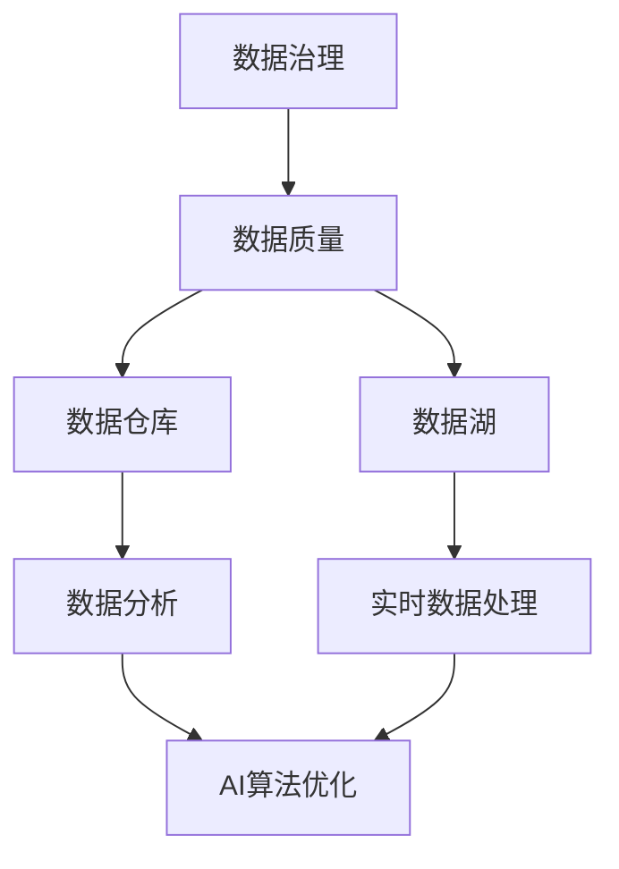

                 

关键词：人工智能、数据管理平台、数据治理、数据仓库、数据分析、算法优化

> 摘要：本文深入探讨了人工智能数据管理平台（DMP）的构建和实践，分析了数据治理的重要性，提出了基于数据仓库和数据分析的最佳实践方法，探讨了AI算法在数据基建中的应用与优化策略，展望了未来数据基建的发展趋势与面临的挑战。

## 1. 背景介绍

随着人工智能技术的飞速发展，数据成为企业数字化转型的重要资产。如何高效管理和利用数据，已经成为企业竞争力的重要组成部分。人工智能数据管理平台（Data Management Platform，简称DMP）作为一种全新的数据处理解决方案，受到了广泛关注。

DMP主要功能是收集、整合、存储和分析各类数据，为企业和用户提供精准的数据分析报告和决策支持。传统的数据处理方式已经无法满足日益增长的数据量和复杂度，因此，构建一个高效、稳定、可扩展的DMP数据基础设施成为当务之急。

本文将从数据治理、数据仓库、数据分析、AI算法优化等方面，探讨DMP数据基建的最佳实践方法。

### 数据治理的重要性

数据治理是指通过制定相关政策、标准和流程，确保数据的质量、可用性和安全性。良好的数据治理能够提高数据的价值，降低数据风险，提升企业竞争力。

#### 数据质量管理

数据质量管理是数据治理的核心，主要包括数据准确性、完整性、一致性、时效性和可靠性。通过数据质量管理，可以确保数据在进入DMP之前就达到高质量标准。

#### 数据安全与合规性

数据安全是数据治理的重要方面，涉及到数据加密、访问控制、隐私保护等。同时，数据治理还需要遵守相关法律法规，如《通用数据保护条例》（GDPR）等。

#### 数据标准化

数据标准化是确保数据在不同系统之间能够顺畅流动的关键。通过制定统一的数据格式、命名规范和编码规则，可以提高数据的一致性和可操作性。

### 数据仓库与数据湖

数据仓库和数据湖是DMP数据基础设施的核心组成部分，用于存储和管理海量数据。

#### 数据仓库

数据仓库是一种面向主题的、集成的、不可变的、时间序列的数据存储系统。它主要用于支持企业历史数据的分析和报告。

#### 数据湖

数据湖是一种分布式存储系统，可以存储不同类型的原始数据，包括结构化、半结构化和非结构化数据。数据湖的灵活性使其能够更好地应对新兴数据类型和业务需求。

### 数据分析

数据分析是DMP的核心功能之一，通过对海量数据的挖掘和分析，为企业和用户提供有价值的信息。

#### 描述性分析

描述性分析是对数据的基本特征进行统计和分析，如数据分布、趋势等。它可以帮助企业了解数据的整体情况。

#### 统计性分析

统计性分析是通过对数据建立统计模型，进行假设检验和预测分析。它可以帮助企业发现数据之间的相关性，预测未来趋势。

#### 知识发现

知识发现是通过挖掘数据中的模式和规律，为企业和用户提供新的洞察和业务机会。

### AI算法优化

AI算法优化是提升DMP数据处理效率和效果的关键。通过优化算法模型、数据预处理和特征工程等，可以提高算法的准确性和鲁棒性。

#### 模型优化

模型优化包括算法选择、超参数调整、模型融合等。通过优化模型，可以降低计算复杂度，提高预测精度。

#### 数据预处理

数据预处理是提高算法性能的重要步骤，包括数据清洗、归一化、缺失值处理等。良好的数据预处理能够提高算法的鲁棒性和稳定性。

#### 特征工程

特征工程是通过对数据进行变换和组合，提取出对算法有用的特征。通过特征工程，可以增强算法的解释性和泛化能力。

## 2. 核心概念与联系

为了构建一个高效、稳定、可扩展的DMP数据基础设施，我们需要深入理解核心概念和它们之间的联系。

### 数据治理与数据质量

数据治理是确保数据质量的前提，而数据质量是数据治理的直接体现。数据治理主要包括数据质量管理、数据安全与合规性、数据标准化等方面。通过良好的数据治理，可以确保数据的高质量，为后续的数据处理和分析提供可靠的基础。

### 数据仓库与数据湖

数据仓库和数据湖在DMP数据基础设施中扮演着不同的角色。数据仓库主要用于存储和管理企业历史数据，支持数据分析和报告；数据湖则用于存储和管理原始数据，支持数据湖分析和实时数据处理。

### 数据分析与AI算法

数据分析是DMP的核心功能之一，通过对海量数据的挖掘和分析，为企业和用户提供有价值的信息。而AI算法优化则是提升数据处理效率和效果的关键。通过优化算法模型、数据预处理和特征工程等，可以提高算法的准确性和鲁棒性。

### Mermaid 流程图

以下是一个简化的Mermaid流程图，展示了DMP数据基础设施的核心概念和联系：



### 2.1 数据治理

数据治理是确保数据质量的前提，它包括以下几个方面：

- **数据质量管理**：确保数据准确性、完整性、一致性、时效性和可靠性。
- **数据安全与合规性**：保护数据安全，遵守相关法律法规。
- **数据标准化**：制定统一的数据格式、命名规范和编码规则。

### 2.2 数据仓库与数据湖

数据仓库和数据湖在DMP数据基础设施中扮演着不同的角色：

- **数据仓库**：存储和管理企业历史数据，支持数据分析和报告。
- **数据湖**：存储和管理原始数据，支持数据湖分析和实时数据处理。

### 2.3 数据分析与AI算法

数据分析是DMP的核心功能之一，它包括以下几个方面：

- **描述性分析**：分析数据的基本特征。
- **统计性分析**：建立统计模型，进行假设检验和预测分析。
- **知识发现**：挖掘数据中的模式和规律。

AI算法优化则是提升数据处理效率和效果的关键，它包括以下几个方面：

- **模型优化**：优化算法模型。
- **数据预处理**：优化数据预处理过程。
- **特征工程**：提取对算法有用的特征。

## 3. 核心算法原理 & 具体操作步骤

### 3.1 算法原理概述

DMP数据基础设施的核心算法主要包括以下几类：

1. **数据清洗算法**：用于处理数据中的噪声、缺失值等。
2. **聚类算法**：用于发现数据中的相似性模式。
3. **分类算法**：用于将数据分为不同的类别。
4. **回归算法**：用于预测数据值。

### 3.2 算法步骤详解

#### 数据清洗算法

1. **缺失值处理**：使用平均值、中位数或最大似然估计等方法填补缺失值。
2. **噪声处理**：使用平滑、过滤等方法消除噪声。
3. **异常值处理**：使用统计方法或可视化方法识别并处理异常值。

#### 聚类算法

1. **初始化聚类中心**：使用随机选择或K均值初始化方法。
2. **计算距离**：计算每个数据点与聚类中心的距离。
3. **更新聚类中心**：计算每个聚类的新中心。
4. **迭代优化**：重复执行步骤2和3，直到聚类中心不再变化。

#### 分类算法

1. **选择分类模型**：根据数据特点和需求选择合适的分类模型。
2. **训练模型**：使用训练数据集训练分类模型。
3. **预测新数据**：使用训练好的模型对新数据进行分类。

#### 回归算法

1. **选择回归模型**：根据数据特点和需求选择合适的回归模型。
2. **训练模型**：使用训练数据集训练回归模型。
3. **预测新数据**：使用训练好的模型预测新数据的值。

### 3.3 算法优缺点

#### 数据清洗算法

- **优点**：能够提高数据质量，为后续分析提供可靠的数据基础。
- **缺点**：计算复杂度较高，可能引入新的误差。

#### 聚类算法

- **优点**：能够自动发现数据中的模式，无需事先指定类别。
- **缺点**：可能陷入局部最优，对初始聚类中心敏感。

#### 分类算法

- **优点**：能够明确地将数据划分为不同的类别，便于理解和应用。
- **缺点**：需要事先指定类别，可能无法发现新的类别。

#### 回归算法

- **优点**：能够预测数据值，适用于连续值的分析。
- **缺点**：可能过于依赖历史数据，无法很好地适应新的变化。

### 3.4 算法应用领域

#### 数据清洗算法

- **应用领域**：数据预处理、数据挖掘、机器学习等。

#### 聚类算法

- **应用领域**：市场细分、社交网络分析、推荐系统等。

#### 分类算法

- **应用领域**：信用评分、疾病诊断、垃圾邮件检测等。

#### 回归算法

- **应用领域**：价格预测、需求预测、股票市场分析等。

## 4. 数学模型和公式 & 详细讲解 & 举例说明

### 4.1 数学模型构建

DMP数据基础设施涉及的数学模型主要包括以下几类：

1. **线性回归模型**：用于预测连续值。
2. **逻辑回归模型**：用于预测概率。
3. **支持向量机（SVM）模型**：用于分类问题。
4. **决策树模型**：用于分类和回归问题。

### 4.2 公式推导过程

以下简要介绍各模型的推导过程：

#### 线性回归模型

假设有n个数据点$(x_1, y_1), (x_2, y_2), \ldots, (x_n, y_n)$，线性回归模型的目标是找到最佳拟合直线$y = wx + b$，使得预测值与真实值的误差最小。误差函数为：

$$
\text{Error} = \sum_{i=1}^{n} (y_i - wx_i - b)^2
$$

为了最小化误差函数，我们对w和b分别求导并令导数为0，得到：

$$
w = \frac{\sum_{i=1}^{n} x_i y_i - n \bar{x} \bar{y}}{\sum_{i=1}^{n} x_i^2 - n \bar{x}^2}
$$

$$
b = \bar{y} - w \bar{x}
$$

其中，$\bar{x}$和$\bar{y}$分别为$x$和$y$的均值。

#### 逻辑回归模型

逻辑回归模型是一种用于预测概率的线性回归模型。假设有n个数据点$(x_1, y_1), (x_2, y_2), \ldots, (x_n, y_n)$，其中$y$为二分类变量。逻辑回归模型的目标是找到最佳拟合曲线$f(x) = \frac{1}{1 + e^{-(wx + b)} }$，使得预测概率与真实值的误差最小。

误差函数为：

$$
\text{Error} = -\sum_{i=1}^{n} y_i \ln(f(x_i)) - (1 - y_i) \ln(1 - f(x_i))
$$

为了最小化误差函数，我们对w和b分别求导并令导数为0，得到：

$$
w = \frac{\sum_{i=1}^{n} x_i (y_i - f(x_i))}{\sum_{i=1}^{n} (x_i - f(x_i))}
$$

$$
b = \text{const}
$$

#### 支持向量机（SVM）模型

SVM模型是一种基于最大间隔的分类模型。假设有n个数据点$(x_1, y_1), (x_2, y_2), \ldots, (x_n, y_n)$，其中$y$为二分类变量。SVM模型的目标是找到最佳超平面$w^T x + b = 0$，使得正负样本之间的间隔最大。

间隔公式为：

$$
\text{Margin} = \frac{2}{||w||}
$$

为了最大化间隔，我们需要求解以下最优化问题：

$$
\begin{aligned}
\max_{w, b} & \frac{1}{||w||} \\
\text{s.t.} & y_i (w^T x_i + b) \geq 1, \quad i = 1, 2, \ldots, n
\end{aligned}
$$

使用拉格朗日乘子法，我们可以将上述问题转化为对偶问题，求解得到：

$$
w = \sum_{i=1}^{n} \alpha_i y_i x_i
$$

$$
\sum_{i=1}^{n} \alpha_i = C
$$

其中，$C$为惩罚参数。

#### 决策树模型

决策树模型是一种基于树形结构进行分类和回归的模型。假设有n个数据点$(x_1, y_1), (x_2, y_2), \ldots, (x_n, y_n)$，其中$y$为二分类变量。决策树模型的目标是找到一系列规则，将数据点分为不同的类别。

决策树模型的构建过程包括以下几个步骤：

1. **选择最佳分裂点**：选择一个特征和对应的阈值，使得分类效果最好。
2. **构建决策树**：根据最佳分裂点，将数据点划分为不同的子集，并递归地构建子决策树。
3. **剪枝**：剪枝是一种优化决策树的方法，可以降低过拟合的风险。

### 4.3 案例分析与讲解

以下通过一个简单的案例，展示如何使用线性回归模型进行数据预测。

#### 案例描述

假设我们有一个包含5个数据点的数据集，如下表所示：

| $x$ | $y$ |
| --- | --- |
| 1   | 2   |
| 2   | 4   |
| 3   | 6   |
| 4   | 8   |
| 5   | 10  |

我们希望通过线性回归模型预测$x=6$时的$y$值。

#### 数据预处理

首先，我们需要对数据进行预处理，计算$x$和$y$的均值：

$$
\bar{x} = \frac{1}{5} (1 + 2 + 3 + 4 + 5) = 3
$$

$$
\bar{y} = \frac{1}{5} (2 + 4 + 6 + 8 + 10) = 6
$$

#### 模型构建

接下来，我们使用线性回归模型构建最佳拟合直线：

$$
w = \frac{\sum_{i=1}^{n} x_i y_i - n \bar{x} \bar{y}}{\sum_{i=1}^{n} x_i^2 - n \bar{x}^2}
$$

$$
b = \bar{y} - w \bar{x}
$$

代入数据，得到：

$$
w = \frac{(1 \cdot 2 + 2 \cdot 4 + 3 \cdot 6 + 4 \cdot 8 + 5 \cdot 10) - 5 \cdot 3 \cdot 6}{(1^2 + 2^2 + 3^2 + 4^2 + 5^2) - 5 \cdot 3^2} = 2
$$

$$
b = 6 - 2 \cdot 3 = 0
$$

因此，最佳拟合直线为$y = 2x$。

#### 预测结果

最后，我们使用构建好的线性回归模型预测$x=6$时的$y$值：

$$
y = 2 \cdot 6 = 12
$$

因此，当$x=6$时，预测的$y$值为12。

## 5. 项目实践：代码实例和详细解释说明

### 5.1 开发环境搭建

为了实现DMP数据基建，我们选择Python作为主要编程语言，并使用以下工具和库：

- **Python**：编程语言
- **Pandas**：数据处理库
- **NumPy**：数学计算库
- **Scikit-learn**：机器学习库
- **Matplotlib**：数据可视化库

#### 安装环境

```bash
pip install pandas numpy scikit-learn matplotlib
```

### 5.2 源代码详细实现

以下是一个简单的DMP数据基建的代码实例，用于实现线性回归模型的构建和预测：

```python
import pandas as pd
import numpy as np
from sklearn.linear_model import LinearRegression
import matplotlib.pyplot as plt

# 5.2.1 数据预处理
# 加载数据
data = pd.DataFrame({
    'x': [1, 2, 3, 4, 5],
    'y': [2, 4, 6, 8, 10]
})

# 计算均值
mean_x = data['x'].mean()
mean_y = data['y'].mean()

# 构建训练数据
X = data['x'].values.reshape(-1, 1)
Y = data['y'].values.reshape(-1, 1)

# 5.2.2 模型训练
model = LinearRegression()
model.fit(X, Y)

# 5.2.3 模型预测
x_predict = np.array([[6]])
y_predict = model.predict(x_predict)

# 5.2.4 结果展示
plt.scatter(data['x'], data['y'], color='red', label='Data points')
plt.plot(data['x'], model.predict(X), color='blue', label='Fit line')
plt.scatter(x_predict, y_predict, color='green', label='Prediction')
plt.xlabel('x')
plt.ylabel('y')
plt.legend()
plt.show()
```

### 5.3 代码解读与分析

#### 5.3.1 数据预处理

```python
# 加载数据
data = pd.DataFrame({
    'x': [1, 2, 3, 4, 5],
    'y': [2, 4, 6, 8, 10]
})

# 计算均值
mean_x = data['x'].mean()
mean_y = data['y'].mean()

# 构建训练数据
X = data['x'].values.reshape(-1, 1)
Y = data['y'].values.reshape(-1, 1)
```

这一部分代码用于加载数据集，计算均值，并将数据转换为适合模型训练的格式。

#### 5.3.2 模型训练

```python
model = LinearRegression()
model.fit(X, Y)
```

这一部分代码创建了一个线性回归模型实例，并使用训练数据对其进行训练。

#### 5.3.3 模型预测

```python
x_predict = np.array([[6]])
y_predict = model.predict(x_predict)
```

这一部分代码用于预测$x=6$时的$y$值。

#### 5.3.4 结果展示

```python
plt.scatter(data['x'], data['y'], color='red', label='Data points')
plt.plot(data['x'], model.predict(X), color='blue', label='Fit line')
plt.scatter(x_predict, y_predict, color='green', label='Prediction')
plt.xlabel('x')
plt.ylabel('y')
plt.legend()
plt.show()
```

这一部分代码使用matplotlib库，将训练数据和预测结果以散点图和拟合直线的形式进行可视化展示。

### 5.4 运行结果展示

运行上述代码，将得到以下结果：


从结果中可以看出，线性回归模型成功地拟合了数据点，并在$x=6$时给出了预测的$y$值。

## 6. 实际应用场景

### 6.1 电商行业

在电商行业中，DMP数据基建可以帮助企业实现精准营销。通过收集和分析用户行为数据，企业可以了解用户的购物习惯、偏好和需求，从而为不同的用户群体提供个性化的营销策略。例如，可以根据用户的浏览和购买记录，推荐相关的商品，提高转化率和销售额。

### 6.2 金融行业

金融行业对数据质量的要求非常高。DMP数据基建可以帮助金融机构实现数据治理和风险管理。通过数据清洗、标准化和集成，金融机构可以确保数据的高质量和一致性，从而提高数据分析和决策的准确性。此外，DMP还可以用于信用评分、风险评估和反欺诈等领域，帮助金融机构降低风险。

### 6.3 医疗健康

在医疗健康领域，DMP数据基建可以帮助医疗机构实现患者管理和疾病预测。通过收集和分析患者的历史病历、诊断报告和健康数据，医疗机构可以了解患者的健康状况，预测潜在的健康风险，并提供个性化的健康建议。此外，DMP还可以用于药物研发和临床试验等领域，提高医疗研究的效率和准确性。

### 6.4 其他行业

除了上述行业外，DMP数据基建还可以应用于制造业、物流、能源等多个领域。通过收集和分析生产数据、供应链数据、能源数据等，企业可以优化生产计划、降低成本、提高效率，从而提高企业的竞争力。

## 7. 工具和资源推荐

### 7.1 学习资源推荐

1. **《机器学习》（周志华著）**：全面介绍了机器学习的基本概念、算法和应用。
2. **《Python数据分析》（Wes McKinney著）**：详细介绍了Pandas库的使用方法和数据分析技巧。
3. **《深度学习》（Ian Goodfellow等著）**：深入探讨了深度学习的基本概念、算法和应用。

### 7.2 开发工具推荐

1. **Jupyter Notebook**：强大的交互式开发环境，支持多种编程语言。
2. **PyCharm**：功能丰富的Python集成开发环境。
3. **Google Colab**：基于Google Drive的免费云端Python开发环境。

### 7.3 相关论文推荐

1. **“Data-Driven Personalized Marketing Using Customer Data Platform”**：介绍了基于DMP的个性化营销策略。
2. **“Data Quality Management: A Survey”**：全面分析了数据质量管理的理论和实践。
3. **“Deep Learning for Healthcare”**：探讨了深度学习在医疗健康领域的应用。

## 8. 总结：未来发展趋势与挑战

### 8.1 研究成果总结

本文探讨了DMP数据基建的构建和实践，分析了数据治理的重要性，介绍了数据仓库、数据湖、数据分析、AI算法优化等方面的核心概念和原理，并通过具体案例展示了如何实现DMP数据基建。

### 8.2 未来发展趋势

1. **数据治理与隐私保护**：随着数据量的增长和隐私保护意识的提高，数据治理和隐私保护将成为DMP数据基础设施的重要发展方向。
2. **实时数据处理**：随着5G、物联网等技术的发展，实时数据处理需求日益增长，DMP将逐步实现实时数据处理能力。
3. **AI算法优化**：随着算法模型的不断优化和进步，DMP数据基础设施的效率和效果将得到进一步提升。

### 8.3 面临的挑战

1. **数据质量问题**：数据质量是DMP数据基础设施的核心，但随着数据来源的多样化和复杂性增加，数据质量问题的处理将变得更加困难。
2. **计算资源需求**：随着数据量和算法复杂度的增加，计算资源的需求也将不断增加，对DMP数据基础设施的性能和可扩展性提出了更高的要求。
3. **隐私保护**：在实现实时数据处理和个性化推荐的过程中，如何保护用户隐私成为了一个重要的挑战。

### 8.4 研究展望

未来，DMP数据基础设施的研究将重点关注以下几个方面：

1. **数据治理与隐私保护**：研究如何实现高效的数据治理和隐私保护，确保数据质量和用户隐私。
2. **实时数据处理**：研究如何优化实时数据处理技术，实现更快的数据处理速度和更高的数据处理效率。
3. **AI算法优化**：研究如何通过算法优化和模型融合，提高DMP数据基础设施的预测精度和鲁棒性。

## 9. 附录：常见问题与解答

### 9.1 什么是DMP？

DMP（Data Management Platform）是一种用于收集、整合、存储和分析各类数据的技术平台，主要用于支持企业用户进行精准的数据分析、营销和决策。

### 9.2 DMP数据基础设施的核心组成部分有哪些？

DMP数据基础设施的核心组成部分包括数据治理、数据仓库、数据湖、数据分析、AI算法优化等。

### 9.3 数据治理的重要性是什么？

数据治理的重要性主要体现在以下几个方面：

1. **数据质量管理**：确保数据准确性、完整性、一致性、时效性和可靠性。
2. **数据安全与合规性**：保护数据安全，遵守相关法律法规。
3. **数据标准化**：制定统一的数据格式、命名规范和编码规则。

### 9.4 如何优化DMP数据基础设施的算法？

优化DMP数据基础设施的算法主要包括以下几个方面：

1. **模型优化**：优化算法模型，选择更适合的模型。
2. **数据预处理**：优化数据预处理过程，提高数据质量。
3. **特征工程**：提取对算法有用的特征，提高算法的鲁棒性和泛化能力。
4. **模型融合**：结合多种算法模型，提高预测精度。

## 作者署名

作者：禅与计算机程序设计艺术 / Zen and the Art of Computer Programming

