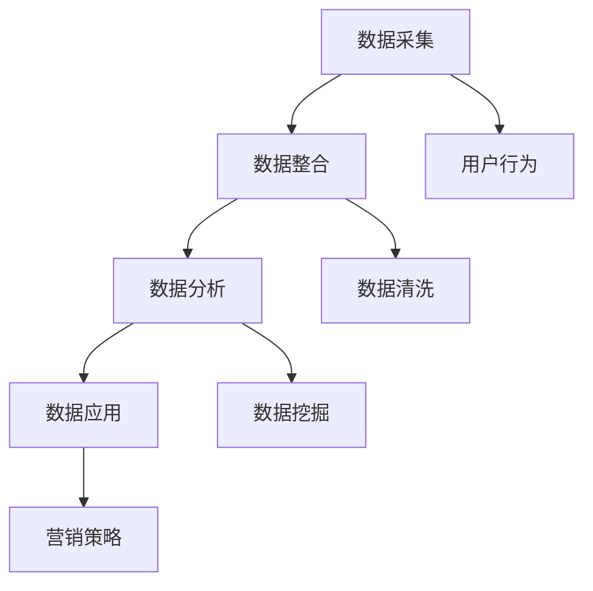

                 

### 关键词 Keywords ###
- AI DMP
- 数据基础设施
- 营销效率
- 客户数据管理
- 数据分析

<|assistant|>### 摘要 Abstract ###
本文将探讨人工智能（AI）在数据管理平台（DMP）中的应用，分析如何构建一个高效的数据基础设施，以提升营销效率和精准度。我们将深入讨论核心概念、算法原理、数学模型、项目实践，并展望未来的发展趋势与挑战。

## 1. 背景介绍

在当今数字化时代，数据成为企业最宝贵的资产。然而，如何有效管理和利用这些数据，已成为企业竞争力的重要因素。客户数据管理平台（DMP）作为一种新兴的数据管理技术，旨在帮助企业收集、整合和分析来自多个渠道的客户数据，从而实现精准营销和个性化服务。

DMP不仅能够收集用户的基本信息，如年龄、性别、地理位置，还能捕捉用户的在线行为，如浏览记录、搜索习惯、社交媒体活动。通过这些数据，企业可以更好地了解目标客户，制定更有效的营销策略。

### 1.1 数据基础设施的重要性

数据基础设施是DMP能够发挥作用的关键。一个高效的数据基础设施包括数据采集、存储、处理、分析和展示等多个环节。这些环节的协同工作，确保了数据的准确性和实时性，为营销决策提供了有力支持。

### 1.2 营销效率提升的挑战

在营销实践中，提升效率面临诸多挑战。首先，数据量巨大，如何快速处理和分析这些数据成为难题。其次，数据来源多样化，如何整合和统一数据格式是关键。此外，营销目标的多样化也要求DMP具备强大的灵活性和适应性。

## 2. 核心概念与联系

要理解DMP的工作原理，我们需要明确几个核心概念：数据采集、数据整合、数据分析、数据应用。

### 2.1 数据采集

数据采集是DMP的基础环节。数据来源包括网站、APP、社交媒体、在线广告等。通过安装跟踪代码、SDK等技术手段，企业可以实时捕捉用户行为数据。

### 2.2 数据整合

数据整合是将来自不同渠道的数据进行统一处理和存储。这要求DMP具备强大的数据处理能力，能够处理结构化数据和非结构化数据，并实现实时更新。

### 2.3 数据分析

数据分析是DMP的核心功能。通过对用户数据的挖掘和分析，企业可以了解用户需求和行为模式，从而制定精准的营销策略。

### 2.4 数据应用

数据应用是将分析结果转化为实际营销行动。通过个性化推荐、精准广告投放、用户画像等手段，企业可以提升用户满意度和转化率。

### 2.5 Mermaid 流程图



## 3. 核心算法原理 & 具体操作步骤

### 3.1 算法原理概述

DMP的核心算法包括用户画像构建、用户行为分析、协同过滤等。这些算法基于大数据技术和机器学习算法，实现对海量数据的深度挖掘和分析。

### 3.2 算法步骤详解

#### 3.2.1 用户画像构建

用户画像构建是DMP的基础。它通过整合用户的基本信息和行为数据，构建一个多维度的用户画像。具体步骤如下：

1. 数据采集：从多个渠道收集用户数据。
2. 数据清洗：去除重复数据、缺失数据和异常数据。
3. 数据整合：将结构化数据和非结构化数据统一处理。
4. 特征工程：提取用户行为的特征，如浏览时长、页面跳转次数等。
5. 用户画像构建：将特征数据转化为用户画像。

#### 3.2.2 用户行为分析

用户行为分析是对用户在网站、APP等平台上的行为进行深入挖掘。具体步骤如下：

1. 数据预处理：对用户行为数据进行清洗和预处理。
2. 数据分析：使用统计分析方法，分析用户行为模式。
3. 特征提取：提取用户行为的特征，如活跃时间、浏览页面等。
4. 用户行为分析：根据特征数据，分析用户行为趋势和偏好。

#### 3.2.3 协同过滤

协同过滤是一种基于用户行为的数据挖掘技术，旨在发现用户之间的相似性和兴趣相似性。具体步骤如下：

1. 数据采集：从多个渠道收集用户行为数据。
2. 数据预处理：对用户行为数据进行清洗和预处理。
3. 用户相似度计算：计算用户之间的相似度，如基于用户行为的相似度、基于兴趣的相似度等。
4. 推荐系统：根据用户相似度，为用户推荐相关的商品或服务。

### 3.3 算法优缺点

#### 优点

- 高效性：基于大数据技术和机器学习算法，能够快速处理和分析海量数据。
- 精准性：通过用户画像和用户行为分析，能够实现精准营销和个性化服务。
- 灵活性：DMP系统具备强大的灵活性，能够适应不同的营销场景和需求。

#### 缺点

- 复杂性：DMP系统涉及多个环节和算法，设计和实施较为复杂。
- 数据隐私：大量用户数据的收集和分析，可能引发数据隐私和安全问题。

### 3.4 算法应用领域

DMP算法在多个领域具有广泛应用，如电子商务、金融、医疗等。通过DMP，企业可以：

- 提升用户满意度：通过个性化推荐和精准广告投放，提升用户满意度和转化率。
- 优化营销策略：通过用户行为分析和用户画像，优化营销策略和投入。
- 降低营销成本：通过高效的数据处理和分析，降低营销成本和风险。

## 4. 数学模型和公式 & 详细讲解 & 举例说明

### 4.1 数学模型构建

DMP的数学模型主要包括用户画像模型、用户行为分析模型和协同过滤模型。以下是一个简单的用户画像模型：

$$
User\ Profile = f(User\ Attributes, User\ Behavior, User\ Context)
$$

其中，User Attributes表示用户的基本信息，如年龄、性别、地理位置；User Behavior表示用户的行为数据，如浏览时长、页面跳转次数；User Context表示用户的上下文信息，如时间、天气等。

### 4.2 公式推导过程

用户画像模型的推导过程如下：

1. 数据采集：收集用户的基本信息、行为数据和上下文信息。
2. 数据清洗：去除重复、缺失和异常数据。
3. 数据整合：将结构化数据和非结构化数据统一处理。
4. 特征工程：提取用户行为的特征，如浏览时长、页面跳转次数等。
5. 特征选择：选择对用户画像构建有重要影响的特征。
6. 用户画像构建：将特征数据转化为用户画像。

### 4.3 案例分析与讲解

假设一个电商企业，希望为用户提供个性化的商品推荐。首先，企业需要收集用户的基本信息、行为数据和上下文信息。通过数据清洗和特征工程，企业可以构建一个多维度的用户画像。然后，企业可以使用协同过滤算法，根据用户画像和用户行为数据，为用户推荐相关的商品。例如，如果用户经常浏览服饰类商品，系统可以推荐类似的商品。

## 5. 项目实践：代码实例和详细解释说明

### 5.1 开发环境搭建

为了实践DMP，我们使用Python作为开发语言，主要依赖以下库：

- pandas：用于数据处理和分析。
- numpy：用于数值计算。
- sklearn：用于机器学习算法。
- matplotlib：用于数据可视化。

### 5.2 源代码详细实现

以下是一个简单的用户画像构建代码示例：

```python
import pandas as pd
import numpy as np
from sklearn.preprocessing import LabelEncoder

# 读取用户数据
data = pd.read_csv('user_data.csv')

# 数据清洗
data = data.dropna()

# 特征工程
label_encoder = LabelEncoder()
data['age'] = label_encoder.fit_transform(data['age'])
data['gender'] = label_encoder.fit_transform(data['gender'])

# 用户画像构建
user_profile = data.groupby('user_id').agg({'age': 'mean', 'gender': 'first'})

# 输出用户画像
print(user_profile)
```

### 5.3 代码解读与分析

这段代码首先读取用户数据，并进行数据清洗。然后，使用LabelEncoder将分类特征（年龄和性别）转化为数值特征。最后，使用pandas的groupby和agg函数，计算每个用户的平均年龄和首次出现的性别，构建用户画像。

### 5.4 运行结果展示

运行结果将显示每个用户的平均年龄和性别。通过这个简单的示例，我们可以看到DMP的基本原理和应用。

## 6. 实际应用场景

### 6.1 电子商务

在电子商务领域，DMP可以帮助企业：

- 为用户提供个性化推荐，提升用户满意度和转化率。
- 根据用户行为数据，优化商品陈列和搜索结果。
- 通过精准广告投放，降低营销成本，提高投资回报率。

### 6.2 金融

在金融领域，DMP可以帮助金融机构：

- 分析客户行为，识别潜在的高风险客户。
- 个性化金融产品推荐，提升客户满意度和忠诚度。
- 优化营销策略，提高客户转化率和留存率。

### 6.3 医疗

在医疗领域，DMP可以帮助医疗机构：

- 分析患者行为数据，预测疾病风险，实现精准医疗。
- 个性化健康建议，提升患者满意度和生活质量。
- 优化医疗服务流程，提高运营效率。

## 7. 工具和资源推荐

### 7.1 学习资源推荐

- 《Python数据分析实战》
- 《机器学习实战》
- 《数据挖掘：概念与技术》

### 7.2 开发工具推荐

- Jupyter Notebook：用于数据分析和机器学习实验。
- Docker：用于容器化部署和应用管理。
- AWS S3：用于大规模数据存储和访问。

### 7.3 相关论文推荐

- "Building Customer Data Platforms: The Future of Data-Driven Marketing"
- "A Survey on Customer Data Platforms: Architecture, Applications, and Challenges"
- "Data-Driven Marketing: Data, Models, and Applications"

## 8. 总结：未来发展趋势与挑战

### 8.1 研究成果总结

DMP作为一种新兴的数据管理技术，已经在多个领域取得了显著成果。通过用户画像、用户行为分析和协同过滤等算法，DMP能够实现精准营销和个性化服务，提升营销效率和用户体验。

### 8.2 未来发展趋势

随着大数据和人工智能技术的发展，DMP将继续朝着智能化、自动化和高效化的方向演进。未来的DMP将具备更强大的数据处理和分析能力，支持更复杂的营销场景和需求。

### 8.3 面临的挑战

DMP在发展过程中也面临诸多挑战，如数据隐私和安全、算法透明度和解释性、跨渠道数据整合等。如何解决这些问题，将是未来研究的重要方向。

### 8.4 研究展望

未来，DMP将在以下几个方面取得突破：

- 数据隐私保护：采用差分隐私、联邦学习等技术，保护用户数据隐私。
- 算法透明度和解释性：提高算法的透明度和解释性，增强用户信任。
- 跨渠道数据整合：实现跨渠道、跨平台的数据整合和分析，提升营销效果。

## 9. 附录：常见问题与解答

### 9.1 DMP和CRM的区别是什么？

DMP主要关注数据的收集、整合和分析，用于实现精准营销和个性化服务。而CRM（客户关系管理）侧重于客户关系的维护和提升，通过销售管理、客户服务和营销自动化等手段，提升客户满意度和忠诚度。

### 9.2 DMP需要哪些技术支持？

DMP需要大数据技术、机器学习算法、数据存储和数据处理技术等多方面的支持。具体来说，包括Hadoop、Spark、TensorFlow、PyTorch等大数据和机器学习框架，以及MySQL、HDFS、Kafka等数据存储和处理技术。

### 9.3 如何保证DMP的数据质量和准确性？

为了保证DMP的数据质量和准确性，需要在数据采集、数据清洗、数据整合等各个环节严格把控。具体措施包括：

- 数据采集：使用可靠的技术手段，确保数据的完整性和准确性。
- 数据清洗：去除重复、缺失和异常数据，提高数据的纯净度。
- 数据整合：统一数据格式和标准，确保数据的兼容性和一致性。
- 数据验证：对数据进行实时监控和验证，及时发现和纠正数据问题。

---

作者：禅与计算机程序设计艺术 / Zen and the Art of Computer Programming

