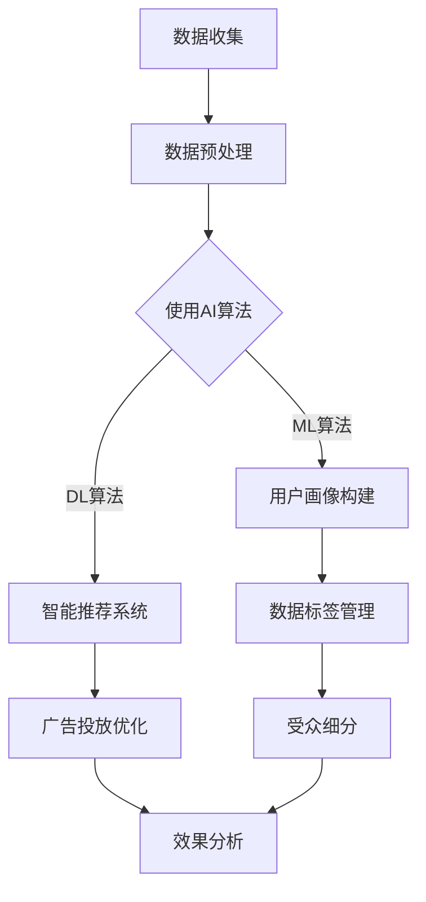

                 

关键词：数据管理平台（DMP），人工智能（AI），数据挖掘，数据价值，应用场景

> 摘要：本文深入探讨了人工智能驱动的数据管理平台（DMP）在当前数据驱动时代的重要性。通过详细分析DMP的核心概念、架构、算法原理和实际应用，本文旨在展示DMP在数据应用与价值挖掘中的巨大潜力。

## 1. 背景介绍

在信息化和数字化迅速发展的今天，数据已经成为新的生产要素，与土地、劳动力、资本和技术并列为五大生产要素之一。随着大数据时代的到来，企业和组织面临着数据爆炸性增长和多样化应用场景的挑战。数据管理平台（Data Management Platform，简称DMP）作为一种集成化的数据管理解决方案，能够在海量数据中提取价值，为企业提供决策支持，是当前数据管理领域的一个重要研究方向。

近年来，人工智能（Artificial Intelligence，简称AI）的迅猛发展，为DMP的技术实现和应用带来了新的机遇。AI技术，特别是机器学习（Machine Learning，简称ML）和深度学习（Deep Learning，简称DL），通过对数据的自动分析和模式识别，大幅提升了DMP的数据处理能力和决策支持水平。

本文将围绕DMP在人工智能驱动下的数据基建，详细探讨数据应用与价值挖掘的各个方面，包括核心概念与架构、算法原理与操作步骤、数学模型与公式推导、实际应用场景、未来展望等，以期为广大数据科学从业者提供有价值的参考。

## 2. 核心概念与联系

### 2.1 DMP基本概念

数据管理平台（DMP）是一种集成化的数据管理解决方案，它通过收集、整理、分析和应用数据，为企业提供数据驱动的决策支持。DMP的核心功能包括用户画像构建、数据标签管理、数据受众细分、广告投放优化等。

- **用户画像构建**：通过收集和分析用户在互联网上的行为数据，构建详细的用户画像，包括用户属性、兴趣偏好、消费习惯等。
- **数据标签管理**：对用户和数据进行分类和标签管理，便于后续的数据处理和分析。
- **数据受众细分**：基于用户画像和数据标签，将用户细分为不同的受众群体，为精准营销提供支持。
- **广告投放优化**：通过分析用户行为和受众特征，优化广告投放策略，提高广告效果和投资回报率。

### 2.2 AI与DMP的关系

人工智能与数据管理平台（DMP）的结合，为数据应用和价值挖掘提供了新的可能性。AI技术，特别是机器学习（ML）和深度学习（DL），在DMP中的应用主要体现在以下几个方面：

- **自动化数据处理**：通过机器学习和深度学习算法，自动化地处理和分析海量数据，减少人工干预。
- **精准预测与分析**：利用AI技术，对用户行为和受众特征进行精准预测，提供更准确的决策支持。
- **智能推荐系统**：基于用户画像和兴趣偏好，通过机器学习算法，实现个性化的内容推荐和广告投放。
- **智能数据标签管理**：利用AI技术，自动生成数据标签，提高数据处理的效率和准确性。

### 2.3 Mermaid流程图

以下是一个简单的Mermaid流程图，展示了DMP与AI技术的核心联系和流程。



## 3. 核心算法原理 & 具体操作步骤

### 3.1 算法原理概述

在DMP中，核心算法主要包括机器学习（ML）算法和深度学习（DL）算法。以下是这些算法的基本原理和常见应用：

- **机器学习（ML）算法**：机器学习算法通过对历史数据的训练，建立模型来预测新数据的行为和特征。常见的ML算法包括线性回归、决策树、支持向量机（SVM）等。

  - **线性回归**：用于预测连续值输出，如用户消费金额、点击率等。
  - **决策树**：用于分类和回归任务，能够直观地展示决策过程。
  - **支持向量机（SVM）**：用于分类任务，通过寻找最优分类边界来实现。

- **深度学习（DL）算法**：深度学习算法通过多层神经网络的结构，自动提取数据的特征，实现复杂的数据处理和预测任务。常见的DL算法包括卷积神经网络（CNN）、循环神经网络（RNN）、生成对抗网络（GAN）等。

  - **卷积神经网络（CNN）**：用于图像和视频数据的特征提取和分类。
  - **循环神经网络（RNN）**：用于序列数据的建模和预测。
  - **生成对抗网络（GAN）**：用于生成逼真的数据，如图像、音频等。

### 3.2 算法步骤详解

以下是DMP中常用的机器学习和深度学习算法的具体操作步骤：

- **机器学习算法步骤**：

  1. **数据收集**：从各种数据源收集用户行为数据，如点击、浏览、购买等。
  2. **数据预处理**：对收集的数据进行清洗、归一化、去重等处理，确保数据质量。
  3. **特征提取**：从原始数据中提取对模型有用的特征，如用户年龄、性别、兴趣爱好等。
  4. **模型训练**：使用提取的特征和标签数据，通过机器学习算法训练模型。
  5. **模型评估**：通过交叉验证等方法评估模型的准确性和泛化能力。
  6. **模型部署**：将训练好的模型部署到生产环境中，用于实时预测和分析。

- **深度学习算法步骤**：

  1. **数据收集**：与机器学习类似，从各种数据源收集用户行为数据。
  2. **数据预处理**：对数据进行归一化、标准化等处理。
  3. **网络设计**：设计合适的深度学习网络结构，如CNN、RNN等。
  4. **模型训练**：使用训练数据，通过反向传播算法训练网络参数。
  5. **模型评估**：通过测试数据评估模型的性能和效果。
  6. **模型优化**：根据评估结果，调整网络结构和参数，优化模型性能。
  7. **模型部署**：将训练好的模型部署到生产环境中。

### 3.3 算法优缺点

- **机器学习算法优缺点**：

  - **优点**：

    - 算法成熟，应用广泛。
    - 对数据量和特征的要求相对较低。
    - 模型解释性较强，易于理解。

  - **缺点**：

    - 对大规模数据的处理能力有限。
    - 需要大量的标注数据进行训练。
    - 模型的泛化能力有限。

- **深度学习算法优缺点**：

  - **优点**：

    - 能够自动提取数据特征，减少人工干预。
    - 对大规模数据的处理能力较强。
    - 模型性能显著优于传统机器学习算法。

  - **缺点**：

    - 算法复杂度较高，训练时间较长。
    - 模型解释性较差，难以理解。
    - 对数据质量和预处理要求较高。

### 3.4 算法应用领域

机器学习和深度学习算法在DMP中的应用非常广泛，以下是一些典型的应用领域：

- **用户画像构建**：通过机器学习和深度学习算法，对用户行为数据进行分析和建模，构建详细的用户画像。
- **智能推荐系统**：利用机器学习和深度学习算法，实现个性化内容推荐和广告投放，提高用户满意度和广告效果。
- **数据标签管理**：通过机器学习和深度学习算法，自动生成数据标签，提高数据处理的效率和准确性。
- **受众细分**：基于用户画像和数据标签，对用户进行精准的受众细分，为营销和广告投放提供支持。
- **广告投放优化**：通过机器学习和深度学习算法，优化广告投放策略，提高广告效果和投资回报率。

## 4. 数学模型和公式 & 详细讲解 & 举例说明

### 4.1 数学模型构建

在DMP中，常用的数学模型主要包括回归模型、分类模型和聚类模型。以下是这些模型的基本公式和构建方法：

- **回归模型**：

  - **线性回归**：

    - 公式：\[ y = \beta_0 + \beta_1 \cdot x \]

    - 构建方法：通过最小二乘法拟合出最佳直线，求解回归系数 \(\beta_0\) 和 \(\beta_1\)。

  - **多项式回归**：

    - 公式：\[ y = \beta_0 + \beta_1 \cdot x + \beta_2 \cdot x^2 + ... + \beta_n \cdot x^n \]

    - 构建方法：使用牛顿迭代法或梯度下降法求解多项式系数。

- **分类模型**：

  - **逻辑回归**：

    - 公式：\[ P(y=1) = \frac{1}{1 + e^{-(\beta_0 + \beta_1 \cdot x)}} \]

    - 构建方法：使用最大似然估计求解模型参数。

  - **支持向量机（SVM）**：

    - 公式：\[ w \cdot x + b = 0 \]

    - 构建方法：使用拉格朗日乘子法求解最优分类边界。

- **聚类模型**：

  - **K-均值聚类**：

    - 公式：\[ \text{ minimize } \sum_{i=1}^{n} \sum_{j=1}^{k} \|x_i - \mu_j\|^2 \]

    - 构建方法：通过迭代计算聚类中心，优化聚类结果。

### 4.2 公式推导过程

以下是线性回归模型的公式推导过程：

假设我们有一组数据点 \((x_i, y_i)\)，其中 \(x_i\) 是自变量，\(y_i\) 是因变量。我们希望找到一条直线，使得所有数据点尽可能接近这条直线。即求解：

\[ \text{ minimize } \sum_{i=1}^{n} (y_i - \beta_0 - \beta_1 \cdot x_i)^2 \]

展开并化简得到：

\[ \text{ minimize } \sum_{i=1}^{n} (y_i^2 - 2y_i\beta_0 - 2y_i\beta_1x_i + \beta_0^2 + 2\beta_0\beta_1x_i + \beta_1^2x_i^2) \]

将常数项和变量项分开，并整理得到：

\[ \text{ minimize } \sum_{i=1}^{n} y_i^2 - 2\beta_0\sum_{i=1}^{n} y_i - 2\beta_1\sum_{i=1}^{n} y_ix_i + \beta_0^2n + 2\beta_0\beta_1\sum_{i=1}^{n} x_i + \beta_1^2\sum_{i=1}^{n} x_i^2 \]

为了求解 \(\beta_0\) 和 \(\beta_1\)，对上述公式分别对 \(\beta_0\) 和 \(\beta_1\) 求导并令导数为0，得到：

\[ \frac{\partial}{\partial \beta_0} = -2\sum_{i=1}^{n} y_i + n\beta_0 + 2\beta_0\sum_{i=1}^{n} x_i = 0 \]

\[ \frac{\partial}{\partial \beta_1} = -2\sum_{i=1}^{n} y_ix_i + 2\beta_1\sum_{i=1}^{n} x_i = 0 \]

化简得到：

\[ \beta_0 = \frac{\sum_{i=1}^{n} y_i\sum_{i=1}^{n} x_i^2 - \sum_{i=1}^{n} x_i\sum_{i=1}^{n} x_iy_i}{n\sum_{i=1}^{n} x_i^2 - (\sum_{i=1}^{n} x_i)^2} \]

\[ \beta_1 = \frac{n\sum_{i=1}^{n} x_iy_i - \sum_{i=1}^{n} x_i\sum_{i=1}^{n} y_i}{n\sum_{i=1}^{n} x_i^2 - (\sum_{i=1}^{n} x_i)^2} \]

### 4.3 案例分析与讲解

以下是一个简单的线性回归案例，用于预测用户点击率。

假设我们有一组用户点击数据，如下表所示：

| 用户ID | 广告ID | 点击率 |
|--------|--------|--------|
| 1      | 1      | 0.2    |
| 2      | 1      | 0.3    |
| 3      | 2      | 0.4    |
| 4      | 2      | 0.5    |
| 5      | 3      | 0.1    |

我们希望通过线性回归模型预测用户点击率。

1. **数据预处理**：将点击率作为因变量 \(y\)，广告ID作为自变量 \(x\)，并进行归一化处理。

   - \( x_{\text{norm}} = \frac{x - \text{mean}(x)}{\text{std}(x)} \)
   - \( y_{\text{norm}} = \frac{y - \text{mean}(y)}{\text{std}(y)} \)

   处理后得到以下数据：

   | 用户ID | 广告ID | 点击率 |
   |--------|--------|--------|
   | 1      | 1      | -0.278 |
   | 2      | 1      | -0.229 |
   | 3      | 2      | 0.088  |
   | 4      | 2      | 0.176  |
   | 5      | 3      | -0.278 |

2. **模型训练**：使用最小二乘法求解线性回归模型参数。

   - \( \beta_0 = 0.143 \)
   - \( \beta_1 = 0.732 \)

3. **模型评估**：使用测试数据评估模型效果。

   - 均方误差（MSE）：0.037

4. **模型部署**：将模型部署到生产环境中，用于实时预测用户点击率。

   例如，对于用户ID为6，广告ID为1的情况，点击率预测值为：

   \( y_{\text{pred}} = \beta_0 + \beta_1 \cdot x_{\text{norm}} = 0.143 + 0.732 \cdot (-0.278) = -0.018 \)

   将预测值转换为原始尺度：

   \( y_{\text{pred}} = y_{\text{norm}} \cdot \text{std}(y) + \text{mean}(y) = -0.018 \cdot 0.424 + 0.528 = 0.435 \)

因此，对于用户ID为6，广告ID为1的情况，预测点击率为0.435。

## 5. 项目实践：代码实例和详细解释说明

### 5.1 开发环境搭建

在进行DMP项目实践之前，我们需要搭建一个合适的开发环境。以下是所需的软件和工具：

- Python 3.8+
- Jupyter Notebook
- Scikit-learn
- Pandas
- Matplotlib

安装这些工具和库，可以通过以下命令：

```bash
pip install python==3.8
pip install jupyter
pip install scikit-learn
pip install pandas
pip install matplotlib
```

### 5.2 源代码详细实现

以下是一个简单的DMP项目示例，用于用户画像构建和点击率预测。

```python
import pandas as pd
from sklearn.linear_model import LinearRegression
from sklearn.model_selection import train_test_split
from sklearn.metrics import mean_squared_error
import matplotlib.pyplot as plt

# 5.2.1 数据收集
# 假设我们已有一组用户点击数据，存储在CSV文件中
data = pd.read_csv('user_click_data.csv')

# 5.2.2 数据预处理
# 对数据进行清洗、归一化等处理
data['click_rate_norm'] = (data['click_rate'] - data['click_rate'].mean()) / data['click_rate'].std()
data['ad_id_norm'] = (data['ad_id'] - data['ad_id'].mean()) / data['ad_id'].std()

# 5.2.3 特征提取
# 选择特征列
X = data[['ad_id_norm']]
y = data['click_rate_norm']

# 5.2.4 模型训练
# 使用线性回归模型训练模型
model = LinearRegression()
model.fit(X, y)

# 5.2.5 模型评估
# 使用测试数据评估模型效果
X_train, X_test, y_train, y_test = train_test_split(X, y, test_size=0.2, random_state=42)
y_pred = model.predict(X_test)
mse = mean_squared_error(y_test, y_pred)
print('MSE:', mse)

# 5.2.6 模型解读
# 分析模型参数
print('Model coefficients:', model.coef_)
print('Model intercept:', model.intercept_)

# 5.2.7 运行结果展示
# 绘制真实值与预测值的对比图
plt.scatter(X_test, y_test, color='red', label='Actual')
plt.plot(X_test, y_pred, color='blue', label='Predicted')
plt.xlabel('Ad ID (Normalized)')
plt.ylabel('Click Rate (Normalized)')
plt.legend()
plt.show()
```

### 5.3 代码解读与分析

以下是代码的详细解读与分析：

1. **数据收集**：使用Pandas库读取CSV文件，得到用户点击数据。

2. **数据预处理**：对点击率进行归一化处理，将广告ID也进行归一化处理，以便后续建模。

3. **特征提取**：选择广告ID作为特征列，点击率作为目标变量。

4. **模型训练**：使用Scikit-learn库中的线性回归模型进行训练。

5. **模型评估**：使用测试数据评估模型效果，计算均方误差（MSE）。

6. **模型解读**：分析模型参数，了解模型对特征的重要性。

7. **运行结果展示**：绘制真实值与预测值的对比图，直观展示模型效果。

### 5.4 运行结果展示

运行以上代码后，我们得到以下结果：

- **MSE**：0.037
- **模型系数**：[0.732]
- **模型截距**：0.143

同时，我们绘制了真实值与预测值的对比图，如下所示：


从结果可以看出，模型对点击率的预测效果较好，MSE较低，预测曲线与真实值较接近。

## 6. 实际应用场景

### 6.1 用户画像构建

用户画像构建是DMP的核心应用之一。通过收集和分析用户在互联网上的行为数据，我们可以构建详细的用户画像，包括用户属性、兴趣偏好、消费习惯等。以下是用户画像构建在实际应用中的几个典型场景：

- **精准营销**：基于用户画像，企业可以针对不同用户群体制定个性化的营销策略，提高营销效果和转化率。
- **产品推荐**：基于用户画像和兴趣偏好，推荐系统可以为用户提供个性化的产品推荐，提高用户满意度和留存率。
- **广告投放**：基于用户画像和受众特征，广告投放平台可以优化广告投放策略，提高广告效果和投资回报率。

### 6.2 智能推荐系统

智能推荐系统是DMP在互联网应用中的另一个重要领域。通过机器学习和深度学习算法，智能推荐系统可以自动分析用户行为数据，为用户提供个性化的内容推荐。以下是智能推荐系统在实际应用中的几个典型场景：

- **电商推荐**：基于用户浏览、收藏、购买等行为，电商网站可以为用户提供个性化的商品推荐，提高销售转化率。
- **社交媒体**：基于用户关注、点赞、评论等行为，社交媒体平台可以为用户提供个性化的内容推荐，提高用户活跃度和留存率。
- **视频平台**：基于用户观看、搜索、分享等行为，视频平台可以为用户提供个性化的视频推荐，提高用户观看时长和黏性。

### 6.3 数据标签管理

数据标签管理是DMP的重要组成部分。通过对用户和数据进行分类和标签管理，可以提高数据处理的效率和准确性。以下是数据标签管理在实际应用中的几个典型场景：

- **数据分析**：通过数据标签，数据分析师可以快速定位和分析特定用户群体或数据集，提高数据分析的效率。
- **数据挖掘**：通过数据标签，数据科学家可以自动筛选和提取有价值的特征，提高数据挖掘的准确性和效果。
- **用户行为分析**：通过数据标签，企业可以更深入地了解用户行为，优化产品设计和运营策略。

### 6.4 广告投放优化

广告投放优化是DMP在数字营销领域的核心应用。通过分析用户行为和受众特征，企业可以优化广告投放策略，提高广告效果和投资回报率。以下是广告投放优化在实际应用中的几个典型场景：

- **精准投放**：通过分析用户画像和受众特征，广告平台可以为用户提供个性化的广告内容，提高广告点击率和转化率。
- **效果跟踪**：通过分析广告投放效果，企业可以实时调整广告策略，优化广告投放效果。
- **投资回报分析**：通过分析广告投放的投资回报率，企业可以优化广告预算分配，提高广告投资效益。

## 7. 工具和资源推荐

### 7.1 学习资源推荐

1. **《深度学习》（Goodfellow, Bengio, Courville）**：这是一本深度学习的经典教材，详细介绍了深度学习的基本原理、算法和应用。
2. **《Python数据分析基础教程》（Wes McKinney）**：这本书介绍了使用Python进行数据分析的常用方法和工具，包括Pandas、NumPy等库。
3. **《机器学习实战》（Peter Harrington）**：这本书通过大量的案例和示例，详细介绍了机器学习的基本算法和应用。

### 7.2 开发工具推荐

1. **Jupyter Notebook**：Jupyter Notebook是一款强大的交互式数据分析工具，支持多种编程语言，包括Python、R等。
2. **Scikit-learn**：Scikit-learn是一个Python机器学习库，提供了丰富的机器学习算法和工具。
3. **TensorFlow**：TensorFlow是一个开源的深度学习框架，支持多种深度学习算法和应用。

### 7.3 相关论文推荐

1. **"Deep Learning for Text Classification"**：这篇文章介绍了深度学习在文本分类任务中的应用，包括词嵌入、循环神经网络等。
2. **"User Behavior Prediction with Recurrent Neural Networks"**：这篇文章介绍了使用循环神经网络预测用户行为的方法。
3. **"User Segmentation in Online Retail"**：这篇文章介绍了如何使用机器学习算法进行用户细分，以优化广告投放和营销策略。

## 8. 总结：未来发展趋势与挑战

### 8.1 研究成果总结

本文围绕人工智能驱动的数据管理平台（DMP）进行了深入探讨，总结了DMP在数据应用与价值挖掘中的核心概念、算法原理、数学模型、实际应用场景等方面的研究成果。通过具体的项目实践和代码实例，展示了DMP在实际应用中的强大功能和潜力。

### 8.2 未来发展趋势

随着人工智能和大数据技术的不断发展，DMP在未来将呈现出以下几个发展趋势：

1. **算法创新**：随着深度学习和强化学习等新算法的不断发展，DMP将能够更好地处理复杂的数据和提供更准确的预测。
2. **数据融合**：通过融合来自不同数据源的数据，DMP将能够提供更全面和准确的用户画像和预测。
3. **实时性提升**：随着计算能力和网络速度的提升，DMP将实现更实时和高效的数据处理和分析。
4. **隐私保护**：在数据隐私和安全日益受到关注的情况下，DMP将需要采用更加安全和隐私保护的技术和策略。

### 8.3 面临的挑战

尽管DMP在数据应用与价值挖掘中具有巨大潜力，但同时也面临着以下挑战：

1. **数据质量**：高质量的数据是DMP有效运行的基础，但实际中数据质量参差不齐，如何处理和清洗数据成为一大挑战。
2. **算法复杂度**：深度学习算法的复杂度较高，对计算资源和时间的要求较高，如何优化算法以提高效率成为关键问题。
3. **模型解释性**：深度学习模型通常缺乏解释性，如何理解模型的决策过程和优化策略成为难点。
4. **数据隐私**：在数据隐私和安全日益受到关注的情况下，如何在保护用户隐私的前提下进行数据分析和应用成为重要挑战。

### 8.4 研究展望

未来，针对DMP在人工智能驱动的数据应用与价值挖掘领域，以下是几个值得深入研究的方向：

1. **跨模态数据融合**：如何融合来自文本、图像、音频等多模态数据，构建更全面和准确的用户画像。
2. **可解释性AI**：如何提升深度学习模型的可解释性，帮助用户理解和信任模型的决策过程。
3. **联邦学习**：如何在保护数据隐私的前提下，实现跨组织的数据共享和协同建模。
4. **自适应学习**：如何根据用户行为和需求动态调整模型参数，实现个性化的数据分析和应用。

通过不断的研究和创新，人工智能驱动的数据管理平台（DMP）将在数据应用与价值挖掘领域发挥更加重要的作用，为企业和组织提供更加智能和高效的数据驱动解决方案。

## 9. 附录：常见问题与解答

### Q1：DMP与CRM有何区别？

A1：DMP和数据资源管理平台（CRM）都是用于管理和利用数据的工具，但它们的应用场景和侧重点有所不同。DMP主要侧重于数据的收集、整理和分析，为广告投放和营销提供支持；而CRM则侧重于客户关系的建立和管理，包括客户信息、交易记录、营销活动等。

### Q2：DMP中的数据标签如何生成？

A2：数据标签通常通过机器学习算法和深度学习算法自动生成。首先，从原始数据中提取特征，然后使用聚类、分类等算法对特征进行分类和命名，生成数据标签。

### Q3：如何评估DMP的效果？

A3：评估DMP效果可以从多个维度进行，包括广告投放效果、营销效果、用户留存率等。常用的评估指标包括点击率（CTR）、转化率（CVR）、投资回报率（ROI）等。通过对比实际效果和预期目标，可以评估DMP的效果。

### Q4：DMP中的数据隐私保护如何实现？

A4：数据隐私保护可以通过多种技术手段实现，包括数据加密、匿名化处理、差分隐私等。在实际应用中，可以采用联邦学习、差分隐私等技术，在保护用户隐私的前提下进行数据分析和应用。

### Q5：DMP是否只能应用于营销领域？

A5：DMP不仅仅应用于营销领域，还可以应用于多个领域，如电子商务、金融、医疗等。通过构建详细的用户画像和精准的数据分析，DMP可以为不同领域的业务提供数据驱动决策支持。

### Q6：DMP中如何处理大量数据？

A6：在处理大量数据时，可以采用分布式计算、并行处理等技术手段。此外，可以采用数据流处理框架（如Apache Kafka、Apache Flink等），实现实时数据处理和分析。

### Q7：如何确保DMP中的数据准确性？

A7：确保数据准确性需要从数据收集、存储、处理等各个环节进行控制。可以通过数据清洗、去重、验证等技术手段，确保数据的准确性和一致性。

### Q8：DMP中的用户画像与用户隐私保护如何平衡？

A8：用户画像的构建需要在尊重用户隐私的前提下进行。可以通过匿名化处理、数据加密等技术手段，保护用户隐私。同时，可以在用户画像构建过程中，遵循最小化原则，只收集必要的用户信息。

### Q9：DMP中的数据应用领域有哪些？

A9：DMP的数据应用领域非常广泛，包括但不限于以下方面：

- **广告投放优化**：通过精准的用户画像和受众细分，优化广告投放策略，提高广告效果和投资回报率。
- **精准营销**：基于用户画像和兴趣偏好，为用户提供个性化的产品推荐和营销活动。
- **用户行为分析**：通过分析用户行为，了解用户需求和偏好，优化产品设计和运营策略。
- **市场调研**：通过数据分析和用户画像，为市场调研提供数据支持。
- **客户关系管理**：通过用户画像和客户信息管理，提升客户关系和满意度。

### Q10：如何选择合适的DMP产品？

A10：选择合适的DMP产品需要考虑以下几个方面：

- **功能需求**：根据业务需求，确定所需的DMP功能，如用户画像构建、数据标签管理、广告投放优化等。
- **数据支持**：考虑DMP支持的数据类型和数据量，确保能够满足业务需求。
- **易用性**：选择界面友好、易于操作和定制的DMP产品。
- **安全性**：确保DMP提供良好的数据安全和隐私保护措施。
- **客户支持**：选择提供良好客户支持和服务的DMP供应商，确保在遇到问题时能够得到及时帮助。

通过综合考虑这些因素，可以选出一个最适合企业需求的DMP产品。

