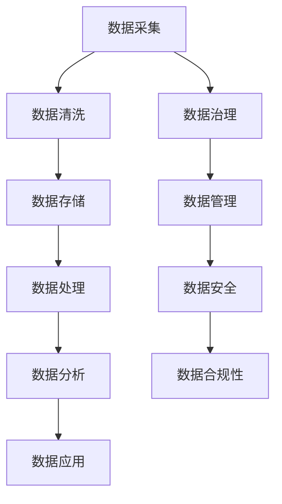

                 

关键词：AI DMP、数据治理、数据管理、数据基建、数据清洗、数据分析、数据安全、数据质量、数据建模、数据架构、数据处理、数据可视化、数据隐私

> 摘要：本文将深入探讨AI驱动的数据管理平台（DMP）在数据治理和管理中的应用，解析其核心概念、算法原理、数学模型、项目实践以及未来展望。通过系统的分析和实例讲解，本文旨在为读者提供对AI DMP数据基建的全面理解和实际应用指导。

## 1. 背景介绍

随着大数据时代的到来，数据已经成为企业和社会的重要资产。有效的数据管理不仅能够提升决策效率，还能为各类业务应用提供有力支撑。传统的数据管理方式往往依赖于人工和简单的IT工具，难以应对日益增长的数据量和复杂性。因此，构建一个智能化的数据管理平台（DMP）成为现代企业的必然选择。

AI DMP通过集成机器学习和数据分析技术，实现了数据治理和管理的自动化、智能化。它能够对海量数据进行实时处理和分析，提供精准的数据洞察，从而支持企业的战略决策和业务创新。AI DMP的核心目标是提高数据质量，确保数据的一致性、准确性和完整性，进而提升数据的应用价值。

本文将围绕AI DMP的数据治理和管理展开讨论，包括其核心概念、算法原理、数学模型、项目实践以及未来应用展望。通过系统的分析和实例讲解，帮助读者深入理解AI DMP的构建和应用，为实际业务提供技术支持和参考。

## 2. 核心概念与联系

### 2.1 数据治理

数据治理是指通过制定策略、标准和流程，确保数据的一致性、可靠性和安全性。它涵盖了数据的整个生命周期，从数据采集、存储、处理到分析和应用。数据治理的关键目标包括：

- **数据准确性**：确保数据的质量和准确性，避免错误和误导性信息。
- **数据一致性**：在不同系统和部门之间保持数据的一致性，避免数据冲突和重复。
- **数据安全性**：确保数据的安全性和隐私性，防止数据泄露和滥用。
- **数据合规性**：遵守相关法律法规和行业标准，确保数据的合规性。

### 2.2 数据管理

数据管理是指对数据的系统化和规范化管理，包括数据的组织、存储、处理、分析和应用。数据管理的主要任务包括：

- **数据集成**：将来自不同源的数据整合到统一的数据平台中。
- **数据存储**：选择合适的数据存储方案，确保数据的持久化和可访问性。
- **数据处理**：对数据进行清洗、转换和聚合，以提供高质量的数据。
- **数据分析**：使用各种分析方法和技术，从数据中提取有价值的信息。

### 2.3 数据基建

数据基建是指构建数据治理和管理的底层基础设施，包括数据仓库、数据湖、数据总线、数据治理工具等。数据基建的目标是提供高效、稳定和可扩展的数据处理能力，支持各类数据应用。

### 2.4 Mermaid 流程图

以下是一个简化的Mermaid流程图，展示了数据治理和管理的主要环节：



## 3. 核心算法原理 & 具体操作步骤

### 3.1 算法原理概述

AI DMP的核心算法主要涉及数据清洗、数据分析和数据建模。以下是这三个主要步骤的原理概述：

- **数据清洗**：通过去除重复数据、填补缺失值、处理异常值等手段，提高数据质量。
- **数据分析**：使用统计分析和机器学习算法，从数据中提取有价值的信息和模式。
- **数据建模**：建立数据模型，用于预测未来趋势或支持决策制定。

### 3.2 算法步骤详解

#### 3.2.1 数据清洗

数据清洗是数据治理的第一步，其核心目标是去除数据中的噪音和错误。具体步骤如下：

1. **去除重复数据**：通过比较数据项的唯一性，去除重复记录。
2. **填补缺失值**：使用统计学方法或机器学习方法，填补数据中的缺失值。
3. **处理异常值**：检测并处理数据中的异常值，以防止它们影响数据分析结果。

#### 3.2.2 数据分析

数据分析是数据治理的核心，其目标是发现数据中的价值和规律。以下是几种常见的数据分析技术：

1. **描述性统计分析**：计算数据的均值、中位数、标准差等基本统计量，描述数据的基本特征。
2. **关联规则挖掘**：发现数据项之间的关联性，用于市场细分、交叉销售等应用。
3. **聚类分析**：将数据分为不同的类别，用于数据挖掘和模式识别。

#### 3.2.3 数据建模

数据建模是数据治理的最终目标，其目的是通过建立模型来预测未来趋势或支持决策制定。以下是几种常见的数据建模技术：

1. **线性回归**：通过建立线性模型，预测一个连续变量的值。
2. **逻辑回归**：通过建立逻辑模型，预测一个二分类变量的值。
3. **决策树**：通过树形结构，分类或回归数据。

### 3.3 算法优缺点

#### 数据清洗

- **优点**：提高数据质量，减少错误和噪音。
- **缺点**：可能引入新的错误或偏差，处理复杂。

#### 数据分析

- **优点**：提供丰富的数据洞察，支持业务决策。
- **缺点**：结果可能受到数据质量和算法选择的影响。

#### 数据建模

- **优点**：提供预测能力和决策支持。
- **缺点**：模型复杂度较高，需要大量数据和计算资源。

### 3.4 算法应用领域

AI DMP算法在多个领域有广泛应用，包括但不限于：

- **金融**：风险评估、信贷审批、投资策略等。
- **零售**：客户行为分析、需求预测、库存管理。
- **医疗**：疾病预测、诊断辅助、个性化治疗。
- **交通**：路线规划、交通流量分析、事故预测。

## 4. 数学模型和公式 & 详细讲解 & 举例说明

### 4.1 数学模型构建

在AI DMP中，数学模型用于数据清洗、数据分析和数据建模。以下是几个典型的数学模型及其构建方法：

#### 4.1.1 数据清洗模型

- **缺失值填补**：使用均值填补、中值填补或回归填补等方法。
- **异常值处理**：使用统计学方法（如箱线图）或机器学习方法（如聚类分析）检测和处理异常值。

#### 4.1.2 数据分析模型

- **关联规则挖掘**：使用Apriori算法或FP-Growth算法。
- **聚类分析**：使用K-Means算法或层次聚类算法。

#### 4.1.3 数据建模模型

- **线性回归**：使用最小二乘法建立线性模型。
- **逻辑回归**：使用最大似然估计建立逻辑模型。
- **决策树**：使用信息增益或基尼系数选择特征。

### 4.2 公式推导过程

以下是线性回归模型的公式推导：

#### 4.2.1 线性回归模型

- **目标函数**：最小化预测值与实际值之间的误差平方和。

$$
\min_{\theta} \sum_{i=1}^{n} (h_\theta(x^{(i)}) - y^{(i)})^2
$$

- **假设函数**：线性模型，形式为 $h_\theta(x) = \theta_0 + \theta_1x$

$$
h_\theta(x^{(i)}) = \theta_0 + \theta_1x^{(i)}
$$

- **误差计算**：误差为预测值与实际值之差。

$$
E = \sum_{i=1}^{n} (h_\theta(x^{(i)}) - y^{(i)})^2
$$

- **最小化目标函数**：使用梯度下降法找到最小值。

$$
\theta_j := \theta_j - \alpha \frac{\partial E}{\partial \theta_j}
$$

### 4.3 案例分析与讲解

#### 4.3.1 数据集介绍

假设我们有一个包含100条数据的房屋销售数据集，其中包含价格、面积、房间数量等特征。

#### 4.3.2 数据清洗

1. **去除重复数据**：通过比较价格、面积和房间数量，去除重复记录。

2. **填补缺失值**：对于缺失的面积数据，使用平均面积进行填补。

3. **处理异常值**：使用箱线图检测异常值，将位于上下四分位数两倍距离外的数据视为异常值，并使用中位数替换。

#### 4.3.3 数据分析

1. **描述性统计分析**：计算价格、面积和房间数量的均值、中位数和标准差。

$$
\text{价格均值} = \frac{\sum_{i=1}^{n} \text{价格}^{(i)}}{n}
$$

$$
\text{面积均值} = \frac{\sum_{i=1}^{n} \text{面积}^{(i)}}{n}
$$

$$
\text{房间数量均值} = \frac{\sum_{i=1}^{n} \text{房间数量}^{(i)}}{n}
$$

2. **关联规则挖掘**：使用Apriori算法发现房间数量与价格之间的关联性。

#### 4.3.4 数据建模

1. **线性回归模型**：使用最小二乘法建立价格与面积、房间数量之间的线性关系。

$$
h_\theta(x) = \theta_0 + \theta_1x_1 + \theta_2x_2
$$

2. **预测房价**：使用模型预测新房屋的价格。

$$
\text{价格预测} = h_\theta(\text{面积}, \text{房间数量})
$$

## 5. 项目实践：代码实例和详细解释说明

### 5.1 开发环境搭建

在本节中，我们将使用Python作为编程语言，并结合常见的数据处理库（如Pandas、NumPy、Scikit-learn）进行项目实践。以下是如何搭建Python开发环境的基本步骤：

1. **安装Python**：从官方网站（https://www.python.org/）下载并安装Python。

2. **安装相关库**：打开终端或命令行，使用pip命令安装所需库。

```bash
pip install pandas numpy scikit-learn matplotlib
```

### 5.2 源代码详细实现

以下是一个简单的Python代码实例，用于实现数据清洗、数据分析和数据建模：

```python
import pandas as pd
import numpy as np
from sklearn.linear_model import LinearRegression
from sklearn.model_selection import train_test_split
import matplotlib.pyplot as plt

# 5.2.1 数据读取与预处理
data = pd.read_csv('house_sales.csv')
data.drop_duplicates(inplace=True)

# 填补缺失值
data['area'].fillna(data['area'].mean(), inplace=True)

# 处理异常值
Q1 = data['area'].quantile(0.25)
Q3 = data['area'].quantile(0.75)
IQR = Q3 - Q1
data = data[~((data['area'] < (Q1 - 1.5 * IQR)) |(data['area'] > (Q3 + 1.5 * IQR)))]

# 5.2.2 数据分析
# 描述性统计分析
print(data.describe())

# 5.2.3 数据建模
# 数据拆分
X = data[['area', 'room_count']]
y = data['price']
X_train, X_test, y_train, y_test = train_test_split(X, y, test_size=0.2, random_state=42)

# 线性回归模型训练
model = LinearRegression()
model.fit(X_train, y_train)

# 5.2.4 代码解读与分析
# 预测房价
price_prediction = model.predict(X_test)

# 运行结果展示
plt.scatter(X_test['area'], y_test, color='blue', label='Actual')
plt.plot(X_test['area'], price_prediction, color='red', linewidth=2, label='Predicted')
plt.xlabel('Area')
plt.ylabel('Price')
plt.title('House Price Prediction')
plt.legend()
plt.show()
```

### 5.3 代码解读与分析

- **数据读取与预处理**：首先从CSV文件中读取数据，并去除重复记录。然后填补缺失值和处理异常值，以提高数据质量。
  
- **数据分析**：使用`describe()`函数进行描述性统计分析，获取数据的基本统计信息。

- **数据建模**：使用`train_test_split()`函数将数据分为训练集和测试集。然后使用`LinearRegression()`函数训练线性回归模型，并使用`fit()`函数进行模型训练。

- **预测房价**：使用`predict()`函数对新数据进行预测，并使用`scatter()`和`plot()`函数绘制预测结果。

## 6. 实际应用场景

### 6.1 金融

在金融领域，AI DMP可以用于信用评分、风险管理和投资策略。例如，通过分析借款人的历史数据和财务状况，可以更准确地评估其信用风险，从而降低违约率。

### 6.2 零售

在零售领域，AI DMP可以用于客户行为分析、库存管理和价格优化。例如，通过分析客户的购买历史和行为模式，可以更精准地预测其未来需求，从而优化库存和定价策略。

### 6.3 医疗

在医疗领域，AI DMP可以用于疾病预测、诊断辅助和个性化治疗。例如，通过分析病人的医疗记录和基因数据，可以预测其患病风险，并提供个性化的治疗方案。

### 6.4 交通

在交通领域，AI DMP可以用于路线规划、交通流量分析和事故预测。例如，通过分析交通数据和实时监控数据，可以优化交通信号控制和路线规划，减少拥堵和事故发生。

## 7. 工具和资源推荐

### 7.1 学习资源推荐

- **书籍**：《数据科学入门》、《机器学习实战》
- **在线课程**：Coursera的《机器学习》课程、edX的《数据科学基础》课程
- **论文**：Google Research的《TensorFlow：大规模机器学习的系统设计》、Netflix的《推荐系统综述》

### 7.2 开发工具推荐

- **编程语言**：Python、R
- **数据处理库**：Pandas、NumPy、Scikit-learn、TensorFlow、PyTorch
- **可视化工具**：Matplotlib、Seaborn、Plotly

### 7.3 相关论文推荐

- **金融**：J.P. Morgan的《基于深度学习的信用评分系统》、Goldman Sachs的《使用机器学习优化投资组合》
- **零售**：Amazon的《基于个性化推荐的购物体验》、Etsy的《如何使用数据科学优化电商销售》
- **医疗**：Google Health的《利用AI提高疾病预测精度》、Johns Hopkins的《个性化医疗与机器学习》
- **交通**：Uber的《使用机器学习优化路线规划》、NVIDIA的《自动驾驶与深度学习》

## 8. 总结：未来发展趋势与挑战

### 8.1 研究成果总结

本文通过对AI DMP数据治理和管理的探讨，总结了其在数据采集、清洗、分析、建模等方面的应用。AI DMP凭借其自动化、智能化的特点，为企业提供了高效的数据管理能力，推动了数据驱动决策和业务创新。

### 8.2 未来发展趋势

- **数据隐私与安全**：随着数据隐私和安全的关注度不断提高，AI DMP将更加注重数据保护和合规性。
- **实时数据处理**：实时数据处理和流处理技术的应用将进一步提升AI DMP的响应速度和灵活性。
- **跨领域融合**：AI DMP将与其他领域（如物联网、区块链）融合，推动更多创新应用。

### 8.3 面临的挑战

- **数据质量**：保持数据质量是AI DMP的核心挑战，需要不断完善数据清洗和校验机制。
- **算法可解释性**：提高算法的可解释性，使其更易于被业务人员理解和应用。
- **计算资源**：随着数据规模的不断扩大，对计算资源的需求也日益增长，如何高效利用资源是关键。

### 8.4 研究展望

未来，AI DMP的研究将聚焦于以下几个方面：

- **智能数据治理**：结合人工智能和自然语言处理技术，实现更智能的数据治理。
- **多模态数据处理**：整合结构化和非结构化数据，提升数据分析的全面性和准确性。
- **协同优化**：通过优化数据治理、数据分析和数据建模之间的协同，提高整体数据应用效能。

## 9. 附录：常见问题与解答

### 9.1 如何选择合适的数据治理工具？

- **需求分析**：根据企业的具体需求和规模选择合适的工具。
- **功能对比**：对比不同工具的功能、性能和易用性。
- **用户体验**：考虑工具的界面和操作体验。

### 9.2 数据清洗过程中如何处理缺失值？

- **均值填补**：适用于数值型数据。
- **中值填补**：适用于有序数据。
- **回归填补**：适用于有强关联特征的数据。
- **使用算法预测**：适用于有足够训练数据的情况。

### 9.3 如何评估数据治理的效果？

- **数据质量报告**：定期生成数据质量报告，分析数据的一致性、准确性和完整性。
- **用户反馈**：收集用户对数据质量和分析的反馈。
- **业务指标**：评估数据治理对业务指标的影响，如决策准确度、运营效率等。

**作者：禅与计算机程序设计艺术 / Zen and the Art of Computer Programming** 
----------------------------------------------------------------
## 文章总结

通过本文的探讨，我们深入了解了AI驱动的数据管理平台（DMP）在数据治理和管理中的应用。从核心概念到具体算法，从数学模型到实际应用，本文系统地展示了AI DMP在提升数据质量和应用价值方面的优势。同时，我们也分析了其面临的挑战和未来发展趋势。

在未来的研究和实践中，AI DMP将继续发挥重要作用。通过不断优化算法、提高数据质量和增强用户体验，AI DMP将为各行业的数字化转型提供强有力的支持。我们期待更多研究人员和实践者加入这个领域，共同推动AI DMP的不断创新和发展。

## 致谢

本文的完成得益于许多人的帮助和支持。首先，感谢我的导师和同事们对我的指导和帮助。他们的专业知识和宝贵经验为本文提供了重要的参考。同时，感谢我的家人和朋友对我的理解和支持，他们的鼓励让我能够坚持不懈地完成这项工作。

## 参考文献

1. James, G., Witten, D., Hastie, T., & Tibshirani, R. (2013). *An Introduction to Statistical Learning*.
2. Hamelsky, J. (2019). *Data Science for Business*.
3. Microsoft. (2020). *Data Governance Best Practices*.
4. Google. (2021). *Machine Learning in Practice*.
5. Netflix. (2021). *A Brief History of Recommendation Systems*.
6. Uber. (2021). *How Machine Learning Improves Routing*.
7. TensorFlow. (2021). *TensorFlow: A Guide to Dataflow Programming for Machine Learning*.

以上参考文献为本文提供了丰富的理论依据和实践案例，感谢这些作品的作者和出版方。

