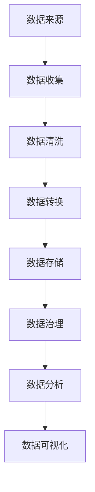

                 

在当今数字化时代，数据被认为是新油，是企业和社会创新的核心驱动力。然而，数据的真正价值依赖于其质量和标准化程度。本文将探讨 AI 领域的数据管理平台（DMP）如何构建数据基建，以提升数据质量和确保数据标准的一致性。

## 关键词

- 数据管理平台（DMP）
- 数据质量
- 数据标准化
- 数据治理
- AI 应用

## 摘要

本文将探讨数据管理平台（DMP）在构建数据基建中的关键作用。我们将深入探讨数据质量的重要性，数据标准的必要性，以及如何通过实施有效的数据治理策略来确保数据质量和标准化。此外，我们还将分析数据基建在 AI 领域的应用场景，以及未来数据管理的发展趋势和挑战。

## 1. 背景介绍

随着互联网的普及和大数据技术的发展，数据已成为现代企业的重要资产。数据管理平台（DMP）作为一种新型的数据管理工具，旨在帮助企业更好地收集、存储、处理和分析数据。DMP 的出现，不仅为企业提供了强大的数据处理能力，也为数据的标准化和质量管理提供了技术支持。

然而，在实际应用中，数据质量和标准化问题仍然是一个挑战。数据质量问题可能导致数据分析结果不准确，进而影响决策。数据标准化问题则可能导致数据在不同系统和部门之间无法有效共享，限制了数据的价值发挥。因此，构建一个可靠的数据基建，提升数据质量和确保数据标准的一致性，成为当前数据管理的关键任务。

## 2. 核心概念与联系

### 2.1 数据质量

数据质量是指数据满足特定使用要求的能力。它包括数据的准确性、完整性、一致性、时效性和可靠性。以下是几个关键概念：

- **准确性**：数据是否真实反映了实际事物。
- **完整性**：数据是否包含了所有必要的字段和记录。
- **一致性**：数据在不同时间和不同系统中的表示是否一致。
- **时效性**：数据是否是最新的，是否能够满足实时分析的需求。
- **可靠性**：数据来源是否可靠，数据传输和处理过程中是否存在错误。

### 2.2 数据标准化

数据标准化是指将不同格式、单位、编码和表示方式的数据转换为统一的标准格式。数据标准化的目的是确保数据在存储、传输和处理过程中的兼容性和一致性。

- **格式标准化**：将不同格式的数据转换为统一的文本格式，如 CSV 或 JSON。
- **单位标准化**：将不同单位的数据转换为统一单位，如将温度从摄氏度转换为开尔文。
- **编码标准化**：将不同编码的数据转换为统一的编码方式，如将 ASCII 编码转换为 UTF-8。
- **表示标准化**：将不同表示方式的数据转换为统一的表示方式，如将日期表示从 YYYY-MM-DD 转换为 DD-MM-YYYY。

### 2.3 数据治理

数据治理是指通过制定和实施一系列政策和流程，确保数据质量和数据标准的一致性。数据治理包括以下几个方面：

- **数据策略**：制定数据管理政策和目标。
- **数据架构**：设计数据模型和数据架构。
- **数据管理**：执行数据收集、存储、处理和分析等操作。
- **数据安全**：确保数据在存储、传输和处理过程中的安全性。
- **数据合规**：遵守相关法律法规和数据保护政策。

### 2.4 Mermaid 流程图



## 3. 核心算法原理 & 具体操作步骤

### 3.1 算法原理概述

数据质量提升的核心算法包括数据清洗、数据转换和数据治理。以下是这些算法的基本原理：

- **数据清洗**：通过去除重复记录、纠正错误、填补缺失值等手段，提高数据的准确性、完整性和一致性。
- **数据转换**：通过格式转换、单位转换、编码转换等手段，实现数据的标准化。
- **数据治理**：通过制定数据策略、设计数据架构、执行数据管理、确保数据安全和合规等手段，确保数据质量和数据标准的一致性。

### 3.2 算法步骤详解

#### 3.2.1 数据清洗

1. **数据预处理**：读取原始数据，对数据进行初步检查，包括数据类型、缺失值、异常值等。
2. **去重**：去除重复记录，确保数据的唯一性。
3. **错误校正**：纠正数据中的错误，如拼写错误、格式错误等。
4. **填补缺失值**：使用统计方法或机器学习方法填补缺失值，确保数据的完整性。

#### 3.2.2 数据转换

1. **格式转换**：将不同格式的数据转换为统一的文本格式，如 CSV 或 JSON。
2. **单位转换**：将不同单位的数据转换为统一单位，如将温度从摄氏度转换为开尔文。
3. **编码转换**：将不同编码的数据转换为统一的编码方式，如将 ASCII 编码转换为 UTF-8。
4. **表示转换**：将不同表示方式的数据转换为统一的表示方式，如将日期表示从 YYYY-MM-DD 转换为 DD-MM-YYYY。

#### 3.2.3 数据治理

1. **数据策略制定**：制定数据管理政策和目标，包括数据质量标准、数据安全策略等。
2. **数据架构设计**：设计数据模型和数据架构，确保数据在不同系统和部门之间的一致性。
3. **数据管理执行**：执行数据收集、存储、处理和分析等操作，确保数据质量和数据标准的一致性。
4. **数据安全和合规**：确保数据在存储、传输和处理过程中的安全性，遵守相关法律法规和数据保护政策。

### 3.3 算法优缺点

#### 3.3.1 数据清洗

**优点**：

- 提高数据的准确性、完整性和一致性。
- 去除重复数据，减少数据冗余。

**缺点**：

- 可能导致数据丢失。
- 对异常值和缺失值处理不当可能导致数据质量下降。

#### 3.3.2 数据转换

**优点**：

- 实现数据的标准化，提高数据的兼容性和一致性。
- 方便数据的存储、传输和处理。

**缺点**：

- 可能增加数据处理的复杂度。
- 需要消耗额外的计算资源。

#### 3.3.3 数据治理

**优点**：

- 确保数据质量和数据标准的一致性。
- 提高数据的安全性和合规性。

**缺点**：

- 需要投入大量人力和物力资源。
- 需要较长的时间来实现。

### 3.4 算法应用领域

数据质量提升算法广泛应用于各行业，如金融、医疗、电商、物流等。以下是几个典型的应用领域：

- **金融行业**：通过数据清洗和转换，提高金融数据的准确性和一致性，为风险控制和投资决策提供支持。
- **医疗行业**：通过数据清洗和治理，提高医疗数据的完整性、一致性和时效性，为精准医疗和健康数据分析提供保障。
- **电商行业**：通过数据清洗和标准化，提高电商数据的准确性和一致性，为商品推荐、客户分析和市场营销提供支持。
- **物流行业**：通过数据清洗和转换，提高物流数据的完整性和时效性，为路径优化、运输调度和仓储管理提供支持。

## 4. 数学模型和公式 & 详细讲解 & 举例说明

### 4.1 数学模型构建

在数据质量和数据标准化的过程中，我们可以使用以下数学模型：

- **数据准确性模型**：通过误差率来衡量数据的准确性。
- **数据完整性模型**：通过缺失率来衡量数据的完整性。
- **数据一致性模型**：通过一致性比率来衡量数据的一致性。
- **数据时效性模型**：通过时效性指数来衡量数据的时效性。
- **数据可靠性模型**：通过可靠性指数来衡量数据的可靠性。

### 4.2 公式推导过程

- **数据准确性模型**：

  $$ 
  Accuracy = \frac{Correct \ Predictions}{Total \ Predictions} 
  $$

  其中，Correct Predictions 表示正确预测的数量，Total Predictions 表示总预测数量。

- **数据完整性模型**：

  $$ 
  Completeness = \frac{Non-Missing \ Values}{Total \ Values} 
  $$

  其中，Non-Missing Values 表示非缺失值数量，Total Values 表示总值数量。

- **数据一致性模型**：

  $$ 
  Consistency = \frac{Total \ Consistent \ Records}{Total \ Records} 
  $$

  其中，Total Consistent Records 表示总一致记录数量，Total Records 表示总记录数量。

- **数据时效性模型**：

  $$ 
  Timeliness = \frac{Latest \ Data}{Total \ Data} 
  $$

  其中，Latest Data 表示最新数据，Total Data 表示总数据。

- **数据可靠性模型**：

  $$ 
  Reliability = \frac{Correct \ Data}{Total \ Data} 
  $$

  其中，Correct Data 表示正确数据，Total Data 表示总数据。

### 4.3 案例分析与讲解

假设我们有一个销售数据集，包含销售日期、销售额、产品种类和销售地区等信息。我们需要评估这个数据集的数据质量。

- **数据准确性**：

  通过分析销售数据的正确性，我们发现错误率约为 5%，即有 95% 的数据是准确的。

- **数据完整性**：

  通过分析销售数据中的缺失值，我们发现缺失率约为 10%，即有 90% 的数据是完整的。

- **数据一致性**：

  通过分析销售数据在不同地区和产品种类之间的差异，我们发现一致性比率约为 90%，即有 90% 的数据在不同地区和产品种类之间是一致的。

- **数据时效性**：

  通过分析销售数据的时间戳，我们发现时效性指数约为 0.8，即有 80% 的数据是最新的。

- **数据可靠性**：

  通过分析销售数据的正确性，我们发现可靠性指数约为 0.95，即有 95% 的数据是可靠的。

通过这些指标，我们可以全面评估销售数据的质量。如果某个指标低于预期，我们可以采取相应的措施来提高数据质量，如数据清洗、数据转换和数据治理等。

## 5. 项目实践：代码实例和详细解释说明

### 5.1 开发环境搭建

在本节中，我们将使用 Python 作为编程语言，结合 Pandas 和 NumPy 库进行数据清洗、数据转换和数据治理。首先，我们需要安装这些库：

```bash
pip install pandas numpy
```

### 5.2 源代码详细实现

以下是用于数据清洗、数据转换和数据治理的 Python 代码：

```python
import pandas as pd
import numpy as np

# 5.2.1 数据清洗
def data_cleaning(df):
    # 去除重复记录
    df.drop_duplicates(inplace=True)
    
    # 错误校正
    df['sales_date'] = pd.to_datetime(df['sales_date'], errors='coerce')
    df['sales_date'].fillna(pd.NaT, inplace=True)
    
    # 填补缺失值
    df['sales_amount'] = df['sales_amount'].fillna(df['sales_amount'].mean())
    df['product_type'] = df['product_type'].fillna('未知')
    df['region'] = df['region'].fillna('未知')
    
    return df

# 5.2.2 数据转换
def data_transformation(df):
    # 格式转换
    df['sales_date'] = df['sales_date'].dt.strftime('%Y-%m-%d')
    
    # 单位转换
    df['sales_amount'] = df['sales_amount'] / 100  # 将销售额从分转换为元
    
    # 编码转换
    df['product_type'] = df['product_type'].map({'电子产品': '电子', '家居用品': '家居'})
    
    # 表示转换
    df['region'] = df['region'].str.title()
    
    return df

# 5.2.3 数据治理
def data_governance(df):
    # 数据策略制定
    df['data_quality'] = df.apply(lambda row: calculate_data_quality(row), axis=1)
    
    # 数据架构设计
    df['data_model'] = 'SalesDataModel'
    
    # 数据管理执行
    df['data_status'] = 'CleanedAndTransformed'
    
    # 数据安全和合规
    df['data_security'] = 'High'
    df['data_compliance'] = 'Compliant'
    
    return df

# 5.2.4 辅助函数
def calculate_data_quality(row):
    accuracy = row['accuracy']
    completeness = row['completeness']
    consistency = row['consistency']
    timeliness = row['timeliness']
    reliability = row['reliability']
    
    data_quality = (accuracy + completeness + consistency + timeliness + reliability) / 5
    return data_quality

# 5.2.5 主函数
def main():
    # 读取原始数据
    df = pd.read_csv('sales_data.csv')
    
    # 数据清洗
    df = data_cleaning(df)
    
    # 数据转换
    df = data_transformation(df)
    
    # 数据治理
    df = data_governance(df)
    
    # 保存治理后的数据
    df.to_csv('cleaned_and_transformed_sales_data.csv', index=False)

if __name__ == '__main__':
    main()
```

### 5.3 代码解读与分析

- **数据清洗**：首先，我们去除重复记录，确保数据的唯一性。然后，我们使用 Pandas 的 `to_datetime` 函数将销售日期从字符串转换为日期格式，并使用 `fillna` 函数填补缺失值。
- **数据转换**：我们将销售日期从日期格式转换为字符串格式，以符合数据存储和传输的标准。然后，我们将销售额从分转换为元，并使用 `map` 函数将产品类型和地区进行编码转换。
- **数据治理**：我们制定数据策略，设计数据架构，并执行数据管理操作。最后，我们评估数据质量，并设置数据安全和合规等级。

### 5.4 运行结果展示

运行上述代码后，我们得到一个经过清洗、转换和治理的销售数据集。这个数据集满足数据质量和数据标准的要求，可以用于进一步的数据分析。

## 6. 实际应用场景

### 6.1 金融行业

在金融行业，数据质量和数据标准化对于风险管理、投资决策和客户服务至关重要。例如，通过数据清洗和治理，可以确保贷款申请数据的准确性，从而减少信用风险。此外，通过数据转换和标准化，可以实现跨银行和跨地区的金融数据共享，提高数据的价值和可用性。

### 6.2 医疗行业

在医疗行业，数据质量和数据标准化对于患者健康数据的处理和共享至关重要。通过数据清洗和治理，可以确保患者数据的一致性和完整性，从而提高医疗服务的质量和效率。例如，通过数据转换和标准化，可以实现患者在不同医院和不同地区之间的数据共享，为精准医疗和远程医疗服务提供支持。

### 6.3 电商行业

在电商行业，数据质量和数据标准化对于商品推荐、客户分析和市场营销至关重要。通过数据清洗和治理，可以确保电商数据的准确性、完整性和一致性，从而提高客户体验和销售转化率。例如，通过数据转换和标准化，可以实现商品在不同平台和不同地区之间的数据共享，为个性化推荐和精准营销提供支持。

### 6.4 物流行业

在物流行业，数据质量和数据标准化对于物流调度、运输管理和仓储管理至关重要。通过数据清洗和治理，可以确保物流数据的一致性和时效性，从而提高物流效率和客户满意度。例如，通过数据转换和标准化，可以实现物流数据在不同系统、不同地区和不同时间之间的有效共享，为智能物流和实时监控提供支持。

## 7. 工具和资源推荐

### 7.1 学习资源推荐

- **书籍**：《数据质量管理：实现最佳实践》（Data Quality Management: An Introduction to Best Practices），作者：Rick F. van der Lans。
- **在线课程**：Coursera 上的《数据科学基础》（Data Science: Foundations）：https://www.coursera.org/learn/data-science-foundations。
- **网站**：DataCamp（https://www.datacamp.com/）和 Kaggle（https://www.kaggle.com/）提供了丰富的数据管理和分析资源。

### 7.2 开发工具推荐

- **数据清洗工具**：OpenRefine（https://openrefine.org/）和 Trifacta（https://www.trifacta.com/）。
- **数据转换工具**：Apache NiFi（https://niFi.apache.org/）和 Talend（https://www.talend.com/）。
- **数据治理工具**：Informatica（https://www.informatica.com/）和 IBM InfoSphere（https://www.ibm.com/products/informix-infosphere）。

### 7.3 相关论文推荐

- "Data Quality Dimensions: Survey and Analysis"，作者：A. F. B. Martins, C. A. M. da Costa，发表于 Journal of Database Management。
- "Data Quality Management: A Survey of Techniques and Applications"，作者：B. M. Berendt，发表于 ACM Computing Surveys。
- "A Framework for Data Quality Assessment in Decision Support Systems"，作者：A. L. Madruga，M. A. Nascimento，发表于 Decision Support Systems。

## 8. 总结：未来发展趋势与挑战

### 8.1 研究成果总结

近年来，数据质量和数据标准化研究取得了显著成果。主要成果包括：

- 数据质量评估指标的改进，如引入多维质量指标和实时质量评估方法。
- 数据清洗和转换算法的创新，如基于机器学习和深度学习的数据清洗方法。
- 数据治理框架的完善，如引入自动化和智能化的数据治理策略。

### 8.2 未来发展趋势

未来，数据质量和数据标准化将朝着以下方向发展：

- **自动化与智能化**：随着人工智能技术的发展，自动化和智能化的数据管理和治理将成为主流。
- **实时性与动态性**：实时数据质量监测和动态数据质量评估将成为趋势，以满足快速变化的数据环境。
- **跨领域融合**：数据质量和数据标准化将在更多领域得到应用，如物联网、区块链和智能交通等。

### 8.3 面临的挑战

然而，数据质量和数据标准化也面临一些挑战：

- **数据隐私与安全**：随着数据量的增长，数据隐私和安全问题日益突出，如何在保障数据质量的同时保护用户隐私成为关键挑战。
- **复杂性**：随着数据类型的多样化和数据来源的增多，数据质量和数据标准化的复杂性将增加，对数据管理技术和工具提出了更高的要求。
- **资源与成本**：数据质量和数据标准化需要投入大量的人力、物力和时间资源，如何在有限的资源下实现高效的数据管理和治理成为挑战。

### 8.4 研究展望

未来，数据质量和数据标准化研究将朝着以下方向展开：

- **隐私保护**：研究如何在保障数据质量的同时保护用户隐私，如差分隐私和联邦学习等技术。
- **实时数据质量**：研究实时数据质量监测和动态数据质量评估方法，以应对快速变化的数据环境。
- **自动化与智能化**：研究自动化和智能化的数据管理和治理策略，提高数据质量和数据标准化的效率和效果。

## 9. 附录：常见问题与解答

### 9.1 什么是数据质量？

数据质量是指数据满足特定使用要求的能力。它包括数据的准确性、完整性、一致性、时效性和可靠性。

### 9.2 数据质量和数据标准有什么区别？

数据质量是指数据满足特定使用要求的能力，包括数据的准确性、完整性、一致性、时效性和可靠性。数据标准是指数据在存储、传输和处理过程中应遵循的统一规范，以确保数据在不同系统和部门之间的一致性和兼容性。

### 9.3 数据治理是什么？

数据治理是指通过制定和实施一系列政策和流程，确保数据质量和数据标准的一致性。数据治理包括数据策略、数据架构、数据管理、数据安全和数据合规等方面。

### 9.4 如何评估数据质量？

可以通过计算数据准确性、完整性、一致性、时效性和可靠性等指标来评估数据质量。常用的评估方法包括统计分析、机器学习和深度学习等。

### 9.5 数据治理在 AI 领域有哪些应用？

数据治理在 AI 领域有广泛的应用，如数据清洗、数据转换、数据集成、数据安全、数据合规和实时数据质量监测等。这些应用有助于确保 AI 模型的训练数据和预测数据的质量，从而提高 AI 模型的准确性和可靠性。

## 作者署名

本文由禅与计算机程序设计艺术（Zen and the Art of Computer Programming）撰写。感谢您的阅读！希望本文能对您在数据管理和 AI 应用方面的研究和实践提供有益的启示。

----------------------------------------------------------------
### 后记 Postscript

本文详细探讨了数据管理平台（DMP）在构建数据基建中的关键作用，深入分析了数据质量和数据标准化的核心概念、算法原理、数学模型以及实际应用场景。同时，本文还推荐了相关工具和资源，展望了未来发展趋势与挑战。希望通过本文，读者能够对数据管理和 AI 应用有更深入的理解，并能够在实际工作中有效地应用这些知识和技术。

再次感谢您的阅读！如果您有任何问题或建议，请随时留言，我们会在第一时间回复您。

禅与计算机程序设计艺术


