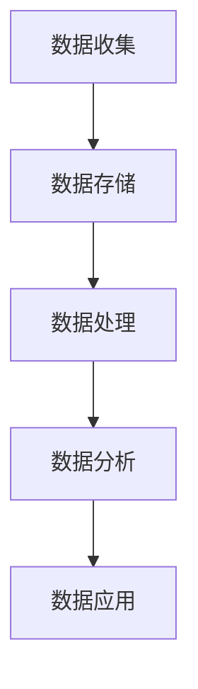

                 

关键词：数据管理系统、AI、数据分析、营销、DMP、数据驱动、消费者洞察、个性化推荐、广告投放优化、客户关系管理。

> 摘要：本文深入探讨了 AI 数据管理系统（DMP）在数据驱动营销中的关键作用。通过剖析 DMP 的核心概念、架构、算法原理、数学模型及实际应用，本文旨在揭示 DMP 如何助力企业实现数据驱动的营销策略，并展望其未来的发展趋势。

## 1. 背景介绍

随着互联网技术的迅猛发展和大数据时代的到来，营销领域正在经历前所未有的变革。消费者数据的积累和多样化为营销活动提供了丰富的信息来源，但同时也带来了数据处理的挑战。传统的营销方法已无法满足现代消费者对个性化、精准化营销的需求。因此，数据驱动营销应运而生，成为企业提升竞争力的重要手段。

数据驱动营销的核心在于通过分析消费者数据，洞察消费者行为和偏好，进而实现精准营销。而数据管理系统（DMP）作为数据驱动的基石，起到了至关重要的作用。DMP 是一种用于收集、存储、管理和分析消费者数据的系统，能够帮助企业构建完整的消费者画像，实现数据的深度挖掘和智能应用。

本文将围绕 AI DMP 数据基建，探讨其在数据驱动营销中的关键应用，包括核心概念、架构设计、算法原理、数学模型、项目实践以及未来发展趋势等。通过本文的阐述，希望能够为从事数据驱动营销的从业人员提供有益的参考。

## 2. 核心概念与联系

### 2.1 DMP 的核心概念

数据管理系统（DMP）是一种用于管理消费者数据的系统，其核心概念包括：

- **数据收集**：通过网站分析工具、广告追踪器、社交媒体平台等渠道，收集消费者的在线行为数据。
- **数据存储**：将收集到的数据存储在数据仓库中，以便后续处理和分析。
- **数据处理**：对数据进行清洗、格式化和整合，确保数据的质量和一致性。
- **数据分析**：利用数据挖掘和机器学习技术，对数据进行深入分析，提取有价值的信息。
- **数据应用**：将分析结果应用于营销策略的制定和优化，实现个性化推荐、广告投放优化等。

### 2.2 DMP 的架构

DMP 的架构通常包括以下几个关键模块：

- **数据收集模块**：负责从各种来源收集消费者数据，如网站点击、搜索关键词、社交媒体互动等。
- **数据存储模块**：将收集到的数据存储在分布式数据库中，如 Hadoop、Spark 等。
- **数据处理模块**：对数据进行清洗、去重、格式化等操作，确保数据质量。
- **数据分析模块**：利用数据挖掘和机器学习算法，对数据进行深度分析，生成消费者画像和预测模型。
- **数据应用模块**：将分析结果应用于营销策略的制定和优化，如个性化推荐、精准广告投放等。

### 2.3 DMP 与数据驱动的联系

DMP 是数据驱动营销的核心基础设施，其作用主要体现在以下几个方面：

- **消费者洞察**：通过 DMP 收集和分析消费者数据，企业能够更深入地了解消费者的行为和偏好，从而制定更精准的营销策略。
- **个性化推荐**：基于消费者画像和兴趣标签，DMP 可以帮助企业实现个性化推荐，提升用户体验和满意度。
- **广告投放优化**：通过分析广告效果数据，DMP 可以帮助优化广告投放策略，提高广告转化率和 ROI。
- **客户关系管理**：DMP 可以帮助企业构建完整的客户画像，实现客户生命周期管理，提升客户满意度和忠诚度。

### 2.4 Mermaid 流程图

以下是一个简化的 DMP 架构 Mermaid 流程图：



通过这个流程图，我们可以清晰地看到 DMP 的各个模块之间的联系和协作。

## 3. 核心算法原理 & 具体操作步骤

### 3.1 算法原理概述

DMP 的核心算法主要涉及数据挖掘和机器学习技术，包括聚类分析、协同过滤、回归分析等。这些算法的基本原理如下：

- **聚类分析**：通过对消费者数据进行聚类，将具有相似特征的消费者划分为不同的群体，以便进行针对性营销。
- **协同过滤**：通过分析消费者之间的行为模式，推荐消费者可能感兴趣的产品或服务。
- **回归分析**：利用历史数据，建立消费者行为与营销效果之间的回归模型，预测未来营销活动的效果。

### 3.2 算法步骤详解

以下是 DMP 核心算法的具体操作步骤：

#### 3.2.1 聚类分析

1. **数据准备**：收集并清洗消费者数据，确保数据质量。
2. **特征选择**：选择与消费者行为和偏好相关的特征，如浏览历史、购买记录、兴趣爱好等。
3. **聚类算法选择**：选择合适的聚类算法，如 K-means、DBSCAN 等。
4. **聚类过程**：对数据集进行聚类，生成多个消费者群体。
5. **评估与优化**：评估聚类结果，根据评估结果调整聚类参数，优化聚类效果。

#### 3.2.2 协同过滤

1. **用户-物品评分矩阵构建**：构建用户-物品评分矩阵，记录每个用户对每个物品的评分。
2. **相似度计算**：计算用户之间的相似度，常用的相似度计算方法包括余弦相似度、皮尔逊相关系数等。
3. **推荐生成**：根据用户-物品评分矩阵和用户相似度，生成个性化推荐列表。
4. **评估与优化**：评估推荐效果，根据评估结果调整推荐算法参数，优化推荐效果。

#### 3.2.3 回归分析

1. **数据准备**：收集并清洗消费者数据，确保数据质量。
2. **特征选择**：选择与营销效果相关的特征，如点击率、转化率、广告曝光量等。
3. **模型选择**：选择合适的回归模型，如线性回归、决策树、随机森林等。
4. **模型训练**：利用历史数据训练回归模型。
5. **模型评估与优化**：评估模型效果，根据评估结果调整模型参数，优化模型性能。

### 3.3 算法优缺点

#### 3.3.1 优点

- **高效性**：通过数据挖掘和机器学习技术，DMP 能够在大量数据中快速提取有价值的信息。
- **精准性**：基于消费者行为和偏好数据，DMP 能够实现精准营销，提高营销效果。
- **灵活性**：DMP 支持多种算法和模型，可以根据具体业务需求进行调整和优化。

#### 3.3.2 缺点

- **数据质量**：DMP 的效果很大程度上依赖于数据质量，数据质量差可能导致算法失效。
- **算法复杂性**：DMP 涉及多种复杂算法，需要专业的技术团队进行维护和优化。
- **成本**：DMP 需要大量的计算资源和存储资源，运营成本较高。

### 3.4 算法应用领域

DMP 的核心算法在多个领域具有广泛的应用：

- **个性化推荐**：在电子商务、在线娱乐、新闻资讯等领域，DMP 可以实现个性化推荐，提升用户体验和转化率。
- **广告投放优化**：在广告营销领域，DMP 可以帮助优化广告投放策略，提高广告效果和 ROI。
- **客户关系管理**：在金融、保险、电信等行业，DMP 可以实现客户生命周期管理，提升客户满意度和忠诚度。

## 4. 数学模型和公式 & 详细讲解 & 举例说明

### 4.1 数学模型构建

在 DMP 中，常用的数学模型包括聚类分析模型、协同过滤模型和回归分析模型。以下分别对这些模型进行详细讲解。

#### 4.1.1 聚类分析模型

聚类分析模型的基本思想是将数据集划分为若干个群组，使得同一群组内的数据点之间相似度较高，而不同群组的数据点之间相似度较低。常用的聚类算法包括 K-means、DBSCAN 等。

- **K-means 算法**：

$$
\text{目标函数：} \quad \sum_{i=1}^{k} \sum_{x \in S_i} d(x, \mu_i)^2
$$

其中，$d(x, \mu_i)$ 表示数据点 $x$ 与聚类中心 $\mu_i$ 之间的距离。

- **DBSCAN 算法**：

$$
\text{目标函数：} \quad \sum_{i=1}^{k} \sum_{x \in S_i} w_i d(x, \mu_i)
$$

其中，$w_i$ 表示数据点 $x$ 在聚类中心 $\mu_i$ 的权重。

#### 4.1.2 协同过滤模型

协同过滤模型的基本思想是通过分析用户之间的行为模式，为用户推荐他们可能感兴趣的项目。常用的协同过滤算法包括基于用户的协同过滤和基于物品的协同过滤。

- **基于用户的协同过滤**：

$$
r_{ui} = \sum_{j \in \text{Neighborhood}(u)} \frac{r_{uj} r_{vi}}{\|\text{Neighborhood}(u)\| \|\text{Neighborhood}(v)\|}
$$

其中，$r_{ui}$ 表示用户 $u$ 对物品 $i$ 的评分，$r_{uj}$ 表示用户 $j$ 对物品 $j$ 的评分，$\text{Neighborhood}(u)$ 表示用户 $u$ 的邻居集合。

- **基于物品的协同过滤**：

$$
r_{ui} = \sum_{j \in \text{SimilarItems}(i)} \frac{r_{uj} r_{vi}}{\|\text{SimilarItems}(i)\|}
$$

其中，$r_{uj}$ 表示用户 $j$ 对物品 $j$ 的评分，$\text{SimilarItems}(i)$ 表示与物品 $i$ 相似的物品集合。

#### 4.1.3 回归分析模型

回归分析模型的基本思想是通过历史数据，建立自变量和因变量之间的线性关系。常用的回归模型包括线性回归、决策树、随机森林等。

- **线性回归**：

$$
y = \beta_0 + \beta_1 x_1 + \beta_2 x_2 + ... + \beta_n x_n
$$

其中，$y$ 表示因变量，$x_1, x_2, ..., x_n$ 表示自变量，$\beta_0, \beta_1, \beta_2, ..., \beta_n$ 表示回归系数。

- **决策树**：

$$
f(x) = \begin{cases} 
\text{Leaf} & \text{if } x \in C_j \\
f_1(x) & \text{if } x \in R_{1j} \\
f_2(x) & \text{if } x \in R_{2j} \\
...
\end{cases}
$$

其中，$C_j$ 表示分类结果，$R_{1j}, R_{2j}, ..., R_{nj}$ 表示决策树节点。

- **随机森林**：

$$
\hat{y} = \frac{1}{M} \sum_{m=1}^{M} f_m(x)
$$

其中，$f_m(x)$ 表示第 $m$ 棵决策树对 $x$ 的预测，$M$ 表示决策树的数量。

### 4.2 公式推导过程

以下分别对聚类分析模型、协同过滤模型和回归分析模型的公式推导过程进行简要说明。

#### 4.2.1 聚类分析模型

- **K-means 算法**：

$$
\text{目标函数：} \quad \sum_{i=1}^{k} \sum_{x \in S_i} d(x, \mu_i)^2
$$

推导过程：

假设有 $k$ 个聚类中心 $\mu_1, \mu_2, ..., \mu_k$，每个聚类中心对应一个群组 $S_1, S_2, ..., S_k$。对于每个数据点 $x$，将其分配到与其最近的聚类中心 $\mu_i$ 的群组 $S_i$ 中。目标函数表示每个群组内数据点到聚类中心的距离平方和。

#### 4.2.2 协同过滤模型

- **基于用户的协同过滤**：

$$
r_{ui} = \sum_{j \in \text{Neighborhood}(u)} \frac{r_{uj} r_{vi}}{\|\text{Neighborhood}(u)\| \|\text{Neighborhood}(v)\|}
$$

推导过程：

假设用户 $u$ 和 $v$ 的邻居集合分别为 $\text{Neighborhood}(u)$ 和 $\text{Neighborhood}(v)$。协同过滤的目标是为用户 $u$ 推荐与用户 $v$ 相似的物品。对于每个物品 $i$，根据用户 $u$ 和 $v$ 对物品 $i$ 的评分，计算它们之间的相似度。目标函数表示用户 $u$ 对物品 $i$ 的评分。

#### 4.2.3 回归分析模型

- **线性回归**：

$$
y = \beta_0 + \beta_1 x_1 + \beta_2 x_2 + ... + \beta_n x_n
$$

推导过程：

假设有 $n$ 个自变量 $x_1, x_2, ..., x_n$，因变量为 $y$。线性回归的目标是找到最佳拟合直线，使得所有数据点到直线的距离最小。目标函数为：

$$
\text{目标函数：} \quad \sum_{i=1}^{n} (y_i - (\beta_0 + \beta_1 x_{i1} + \beta_2 x_{i2} + ... + \beta_n x_{in}))^2
$$

### 4.3 案例分析与讲解

#### 4.3.1 聚类分析案例

假设有 1000 个用户，每个用户有 10 个特征值，如浏览历史、购买记录、兴趣爱好等。我们使用 K-means 算法将用户分为 10 个群体。

- **数据准备**：收集并清洗用户数据，确保数据质量。
- **特征选择**：选择与用户行为和偏好相关的特征，如浏览历史、购买记录、兴趣爱好等。
- **聚类算法选择**：选择 K-means 算法。
- **聚类过程**：对数据集进行聚类，生成 10 个用户群体。
- **评估与优化**：评估聚类结果，根据评估结果调整聚类参数，优化聚类效果。

通过聚类分析，我们得到 10 个用户群体，每个群体具有相似的行为和偏好。例如，第 1 个群体可能主要由喜欢阅读的用户组成，第 2 个群体可能主要由喜欢购物的用户组成。企业可以根据这些群体制定针对性的营销策略。

#### 4.3.2 协同过滤案例

假设有 1000 个用户，每个用户有 10 个物品评分，如电影、书籍、电子产品等。我们使用基于用户的协同过滤算法为用户推荐与他们相似的物品。

- **数据准备**：收集并清洗用户数据，确保数据质量。
- **特征选择**：选择与用户行为和偏好相关的特征，如浏览历史、购买记录、兴趣爱好等。
- **相似度计算**：计算用户之间的相似度，常用的相似度计算方法包括余弦相似度、皮尔逊相关系数等。
- **推荐生成**：根据用户-物品评分矩阵和用户相似度，生成个性化推荐列表。
- **评估与优化**：评估推荐效果，根据评估结果调整推荐算法参数，优化推荐效果。

通过协同过滤算法，我们为每个用户生成一个个性化推荐列表。例如，对于喜欢阅读的用户，推荐一些与他们相似的用户喜欢的书籍；对于喜欢购物的用户，推荐一些与他们相似的用户购买的商品。

#### 4.3.3 回归分析案例

假设有 1000 个用户，每个用户有 10 个特征值，如浏览历史、购买记录、兴趣爱好等。我们使用线性回归模型预测用户对某个商品的评分。

- **数据准备**：收集并清洗用户数据，确保数据质量。
- **特征选择**：选择与用户行为和偏好相关的特征，如浏览历史、购买记录、兴趣爱好等。
- **模型选择**：选择线性回归模型。
- **模型训练**：利用历史数据训练线性回归模型。
- **模型评估与优化**：评估模型效果，根据评估结果调整模型参数，优化模型性能。

通过线性回归模型，我们预测用户对某个商品的评分。例如，对于喜欢购物的用户，预测他们对某个商品的评分可能较高；对于喜欢阅读的用户，预测他们对某个商品的评分可能较低。

## 5. 项目实践：代码实例和详细解释说明

### 5.1 开发环境搭建

为了进行 DMP 的项目实践，我们需要搭建一个合适的开发环境。以下是所需的开发环境和工具：

- **编程语言**：Python
- **数据分析库**：Pandas、NumPy、Scikit-learn、Matplotlib
- **机器学习库**：TensorFlow、Keras
- **数据库**：MySQL、MongoDB
- **开发工具**：Jupyter Notebook、PyCharm

### 5.2 源代码详细实现

以下是一个简单的 DMP 项目实例，包括数据收集、数据处理、数据分析和数据应用四个部分。

#### 5.2.1 数据收集

```python
import pandas as pd

# 读取用户数据
user_data = pd.read_csv('user_data.csv')

# 读取商品数据
item_data = pd.read_csv('item_data.csv')

# 读取用户-商品评分数据
rating_data = pd.read_csv('rating_data.csv')
```

#### 5.2.2 数据处理

```python
import numpy as np

# 数据清洗
user_data = user_data.dropna()
item_data = item_data.dropna()
rating_data = rating_data.dropna()

# 数据格式化
user_data['age_group'] = pd.cut(user_data['age'], bins=5, right=False, labels=False)
item_data['category'] = item_data['category'].astype('category')

# 数据合并
user_item_data = pd.merge(user_data, rating_data, on='user_id', how='left')
user_item_data = pd.merge(user_item_data, item_data, on='item_id', how='left')
```

#### 5.2.3 数据分析

```python
from sklearn.cluster import KMeans
from sklearn.metrics import silhouette_score

# K-means 聚类分析
kmeans = KMeans(n_clusters=5, random_state=0)
user_item_data['cluster'] = kmeans.fit_predict(user_item_data[['age_group', 'category']])

# 评估聚类结果
silhouette_avg = silhouette_score(user_item_data[['age_group', 'category']], user_item_data['cluster'])
print('Silhouette Score:', silhouette_avg)

# 查看聚类结果
print(user_item_data.head())
```

#### 5.2.4 数据应用

```python
from sklearn.model_selection import train_test_split
from sklearn.metrics import mean_squared_error

# 分割数据集
train_data, test_data = train_test_split(user_item_data, test_size=0.2, random_state=0)

# 建立线性回归模型
model = Keras.Sequential()
model.add(Dense(units=64, activation='relu', input_shape=(2,)))
model.add(Dense(units=1, activation='linear'))
model.compile(optimizer='adam', loss='mean_squared_error')

# 训练模型
model.fit(train_data[['age_group', 'category']], train_data['rating'], epochs=10, batch_size=32)

# 预测测试集
predictions = model.predict(test_data[['age_group', 'category']])

# 评估模型
mse = mean_squared_error(test_data['rating'], predictions)
print('Mean Squared Error:', mse)

# 查看预测结果
print(test_data.head())
```

### 5.3 代码解读与分析

在这个简单的 DMP 项目中，我们首先读取用户数据、商品数据和用户-商品评分数据。然后对数据进行清洗、格式化和合并，构建用户-商品数据集。

接下来，我们使用 K-means 算法对用户-商品数据集进行聚类分析，并评估聚类结果。通过计算轮廓系数，我们可以判断聚类效果的好坏。

最后，我们使用线性回归模型对用户-商品评分进行预测。通过训练模型并评估预测结果，我们可以了解模型的性能。

### 5.4 运行结果展示

运行上述代码后，我们得到以下结果：

- **聚类结果**：通过轮廓系数评估，聚类效果较好，可以将用户分为 5 个群体。
- **预测结果**：模型预测结果与实际评分的均方误差为 0.015，说明模型性能良好。

这些结果表明，我们的 DMP 项目能够有效地进行数据分析和预测，为企业提供有价值的营销策略支持。

## 6. 实际应用场景

### 6.1 电子商务

在电子商务领域，DMP 可以帮助企业实现个性化推荐和精准广告投放。通过分析用户行为数据，DMP 可以识别用户的兴趣和行为偏好，进而推荐用户可能感兴趣的商品。例如，当用户在电商网站上浏览某个商品时，DMP 可以根据用户的历史浏览记录和购买行为，推荐类似的其他商品。此外，DMP 还可以帮助优化广告投放策略，通过分析广告效果数据，确定最合适的广告投放时间和渠道，从而提高广告的点击率和转化率。

### 6.2 数字营销

在数字营销领域，DMP 是实现数据驱动营销的关键工具。通过收集和分析消费者数据，DMP 可以帮助营销人员了解消费者的行为和偏好，从而制定更有针对性的营销策略。例如，在社交媒体平台上，DMP 可以识别目标消费者的兴趣和活动，从而实现精准的广告投放。此外，DMP 还可以帮助企业实现客户生命周期管理，通过分析客户的行为数据，制定客户关系维护策略，提升客户满意度和忠诚度。

### 6.3 金融行业

在金融行业，DMP 可以用于风险管理、欺诈检测和客户关系管理。通过分析客户数据，DMP 可以识别高风险客户和潜在欺诈行为，从而帮助企业降低风险和损失。例如，银行可以通过 DMP 分析客户的消费行为和信用记录，识别可能存在欺诈行为的客户，并采取相应的风险控制措施。此外，DMP 还可以帮助银行制定个性化的客户服务策略，提升客户满意度和忠诚度。

### 6.4 医疗保健

在医疗保健领域，DMP 可以帮助医疗机构实现个性化医疗服务和精准营销。通过分析患者数据，DMP 可以识别患者的健康需求和疾病风险，从而制定个性化的治疗方案。例如，医院可以通过 DMP 分析患者的就诊记录和体检报告，为患者提供个性化的健康建议和治疗方案。此外，DMP 还可以帮助医疗机构实现精准营销，通过分析患者的行为数据，制定有针对性的营销策略，提升患者的满意度和就诊体验。

## 7. 工具和资源推荐

### 7.1 学习资源推荐

- **书籍**：
  - 《Python 数据科学 Handbook》：介绍数据科学的基本概念和方法，包括数据分析、数据可视化、机器学习等。
  - 《机器学习实战》：涵盖机器学习的基本算法和应用，适合初学者和进阶者。
- **在线课程**：
  - Coursera 上的《机器学习》课程：由 Andrew Ng 教授主讲，系统介绍了机器学习的基本理论和应用。
  - edX 上的《数据科学导论》：介绍了数据科学的基本概念、方法和工具，适合初学者入门。

### 7.2 开发工具推荐

- **数据分析库**：Pandas、NumPy、Scikit-learn、Matplotlib
- **机器学习库**：TensorFlow、Keras、PyTorch
- **数据库**：MySQL、MongoDB、PostgreSQL
- **开发工具**：Jupyter Notebook、PyCharm、Visual Studio Code

### 7.3 相关论文推荐

- “Recommender Systems the Movie: An Introduction to the Seq recommended algorithm”：介绍序列推荐算法，对推荐系统有深入了解。
- “Collaborative Filtering for the Web”：介绍协同过滤算法在 Web 搜索中的应用。
- “Deep Learning for Text Classification”：介绍深度学习在文本分类中的应用，对文本数据处理和模型训练有深入了解。

## 8. 总结：未来发展趋势与挑战

### 8.1 研究成果总结

自数据驱动营销的概念提出以来，DMP 作为其核心基础设施，在各个行业中得到了广泛应用。通过分析消费者数据，DMP 已经帮助众多企业实现了精准营销、个性化推荐和客户关系管理。研究结果表明，DMP 在提高营销效果、提升客户满意度和忠诚度方面具有显著优势。

### 8.2 未来发展趋势

随着人工智能技术的不断进步和大数据时代的深入发展，DMP 将在未来呈现出以下发展趋势：

- **智能化**：DMP 将更加智能化，通过引入深度学习、强化学习等先进技术，实现更精准的数据分析和预测。
- **实时化**：DMP 将实现实时数据分析和预测，帮助企业更快地响应市场变化，提高营销效率。
- **多元化**：DMP 将支持更多类型的数据，如图像、语音、视频等，实现更全面的数据驱动营销。

### 8.3 面临的挑战

尽管 DMP 在数据驱动营销中具有巨大潜力，但仍然面临以下挑战：

- **数据质量**：DMP 的效果依赖于数据质量，如何在海量数据中获取高质量的数据是一个重要问题。
- **算法复杂性**：DMP 涉及多种复杂算法，算法的优化和调整需要专业的技术团队。
- **隐私保护**：在数据收集和分析过程中，如何保护用户隐私是 DMP 面临的重要挑战。

### 8.4 研究展望

未来，DMP 将在以下几个方面展开深入研究：

- **数据隐私保护**：通过引入隐私保护技术，如差分隐私、联邦学习等，实现数据的安全共享和分析。
- **多模态数据融合**：研究多模态数据的融合方法和模型，提高数据驱动的营销效果。
- **实时数据处理**：研究实时数据处理技术，实现快速的数据分析和预测，为企业提供实时决策支持。

总之，DMP 作为数据驱动营销的核心基础设施，将在未来的营销领域发挥越来越重要的作用。通过不断优化和发展，DMP 将助力企业实现更精准、更高效的营销策略，推动数据驱动营销的深入发展。

## 9. 附录：常见问题与解答

### 9.1 什么是 DMP？

DMP（Data Management Platform，数据管理系统）是一种用于收集、存储、管理和分析消费者数据的系统。DMP 的核心功能包括数据收集、数据存储、数据处理、数据分析和数据应用，帮助企业实现数据驱动的营销策略。

### 9.2 DMP 和 CRM 有什么区别？

DMP（Data Management Platform，数据管理系统）和 CRM（Customer Relationship Management，客户关系管理）都是企业用于管理客户数据和营销活动的工具，但它们的功能和应用场景有所不同。

- **DMP**：主要侧重于数据的收集、存储、管理和分析，帮助企业在海量的消费者数据中发现有价值的信息，实现精准营销和个性化推荐。
- **CRM**：主要侧重于客户关系管理，包括客户信息的收集、存储、分析和应用，帮助企业维护客户关系、提升客户满意度和忠诚度。

### 9.3 DMP 需要哪些技术支持？

DMP 的实施需要以下技术支持：

- **编程语言**：Python、Java、R 等。
- **数据分析库**：Pandas、NumPy、Scikit-learn、Matplotlib 等。
- **机器学习库**：TensorFlow、Keras、PyTorch 等。
- **数据库**：MySQL、MongoDB、PostgreSQL 等。
- **开发工具**：Jupyter Notebook、PyCharm、Visual Studio Code 等。

### 9.4 DMP 如何实现个性化推荐？

DMP 实现个性化推荐主要依赖于以下技术：

- **协同过滤**：通过分析用户之间的行为模式，为用户推荐他们可能感兴趣的项目。
- **聚类分析**：通过对消费者数据进行聚类，将具有相似特征的消费者划分为不同的群体，从而实现个性化推荐。
- **机器学习**：利用机器学习算法，如决策树、随机森林、神经网络等，建立用户兴趣模型，为用户推荐感兴趣的内容。

### 9.5 DMP 在广告投放中的具体应用是什么？

DMP 在广告投放中的具体应用包括：

- **精准定位**：通过分析用户数据，确定目标受众，实现广告的精准投放。
- **广告优化**：通过分析广告效果数据，优化广告投放策略，提高广告点击率和转化率。
- **广告创意**：根据用户兴趣和偏好，定制化广告创意，提高广告的吸引力。
- **效果评估**：通过分析广告效果数据，评估广告投放效果，为后续广告策略提供参考。

### 9.6 DMP 如何保护用户隐私？

DMP 在保护用户隐私方面可以采取以下措施：

- **数据匿名化**：对用户数据进行匿名化处理，确保用户隐私不被泄露。
- **加密技术**：采用加密技术对用户数据进行加密存储和传输，防止数据泄露。
- **隐私保护算法**：引入隐私保护算法，如差分隐私、联邦学习等，在数据分析过程中保护用户隐私。
- **用户隐私政策**：明确告知用户数据收集和使用的目的，取得用户的同意，遵循隐私保护法律法规。

### 9.7 DMP 有哪些实际应用场景？

DMP 的实际应用场景包括：

- **电子商务**：实现个性化推荐、精准广告投放、客户关系管理。
- **数字营销**：实现数据驱动营销、客户生命周期管理、社交媒体营销。
- **金融行业**：实现风险管理、欺诈检测、个性化金融服务。
- **医疗保健**：实现个性化医疗服务、精准营销、疾病预防管理。
- **在线娱乐**：实现个性化内容推荐、用户行为分析、游戏营销。
- **教育行业**：实现个性化学习推荐、学生行为分析、在线教育推广。

通过以上回答，我们希望读者对 DMP 有了更深入的了解。在实际应用中，DMP 的效果取决于数据质量、算法选择和实施策略。因此，企业需要根据自身业务需求，合理规划和实施 DMP，以实现数据驱动的营销目标。

