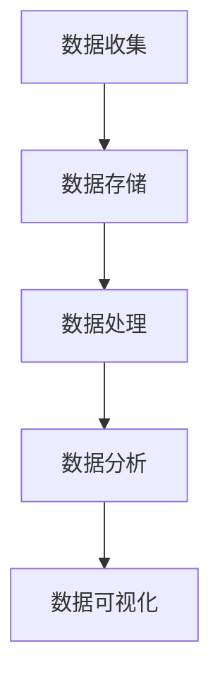

                 

关键词：AI DMP、数据驱动营销、数据基建、未来趋势

> 摘要：本文将深入探讨AI DMP（数据管理系统）在数据驱动营销领域的重要性，以及其未来发展的趋势与挑战。我们将从背景介绍、核心概念与联系、核心算法原理与操作步骤、数学模型与公式、项目实践、实际应用场景、工具和资源推荐、总结等方面展开讨论。

## 1. 背景介绍

随着互联网的快速发展，大数据和人工智能技术在营销领域的应用日益广泛。数据驱动营销成为企业提高竞争力、实现精准营销的关键手段。而AI DMP（Data Management Platform，数据管理系统）作为数据基础设施的核心，其重要性不言而喻。

AI DMP是一种集数据收集、存储、处理和分析于一体的系统，通过整合多种数据源，为企业提供全面的用户画像和数据分析能力。这使得企业在进行精准营销时能够更好地理解用户需求，提高营销效果，降低营销成本。

## 2. 核心概念与联系

为了深入理解AI DMP，我们需要了解以下几个核心概念：

### 2.1 数据收集

数据收集是AI DMP的基础，主要包括以下几种数据类型：

- **用户行为数据**：包括用户浏览、购买、评论等行为数据。
- **社交数据**：包括用户在社交媒体上的互动数据，如点赞、分享、评论等。
- **地理位置数据**：包括用户地理位置、交通流量等数据。
- **设备数据**：包括用户设备类型、操作系统、硬件配置等数据。

### 2.2 数据存储

数据存储是将收集到的数据存储到数据库中，以便后续处理和分析。常用的数据库类型包括关系型数据库（如MySQL、PostgreSQL）和非关系型数据库（如MongoDB、Cassandra）。

### 2.3 数据处理

数据处理是对存储在数据库中的数据进行清洗、转换和整合的过程。这一过程通常涉及到多种数据加工技术，如ETL（Extract, Transform, Load）和数据清洗、归一化等。

### 2.4 数据分析

数据分析是对处理后的数据进行分析和挖掘，以发现用户需求、市场趋势等有价值的信息。常用的数据分析方法包括机器学习、数据挖掘、统计分析等。

### 2.5 数据可视化

数据可视化是将分析结果以图表、图像等形式呈现出来，以便用户直观地理解数据。常用的数据可视化工具包括Tableau、Power BI、D3.js等。

下面是一个简化的Mermaid流程图，展示了AI DMP的基本架构：



## 3. 核心算法原理 & 具体操作步骤

### 3.1 算法原理概述

AI DMP的核心算法主要包括以下几个部分：

- **用户画像构建**：通过对用户行为数据进行挖掘和分析，构建用户画像。
- **人群细分**：根据用户画像，将用户划分为不同的群体。
- **广告投放优化**：根据人群细分结果，优化广告投放策略。

### 3.2 算法步骤详解

#### 3.2.1 用户画像构建

用户画像构建的步骤包括：

1. 数据收集：收集用户行为数据、社交数据、地理位置数据等。
2. 数据处理：对收集到的数据进行清洗、转换和整合。
3. 特征提取：从处理后的数据中提取出用户特征，如兴趣、偏好、行为等。
4. 用户标签生成：根据用户特征，为每个用户生成标签。

#### 3.2.2 人群细分

人群细分的步骤包括：

1. 数据分析：对用户画像进行聚类、分类等数据分析。
2. 人群划分：根据数据分析结果，将用户划分为不同的群体。
3. 群体特征分析：对每个群体的特征进行分析，如年龄、性别、地域等。

#### 3.2.3 广告投放优化

广告投放优化的步骤包括：

1. 广告投放策略制定：根据人群细分结果，制定广告投放策略。
2. 广告投放效果评估：通过数据分析，评估广告投放效果。
3. 广告投放优化：根据广告投放效果评估结果，调整广告投放策略。

### 3.3 算法优缺点

#### 优点

- **个性化**：通过用户画像构建和人群细分，实现个性化广告投放。
- **高效**：利用机器学习和数据挖掘技术，提高广告投放效率。
- **精准**：通过数据分析和挖掘，提高广告投放精准度。

#### 缺点

- **数据处理复杂**：涉及多种数据类型和数据处理技术，数据处理复杂度较高。
- **隐私保护**：在数据收集和处理过程中，需要关注用户隐私保护。

### 3.4 算法应用领域

AI DMP算法在以下领域具有广泛的应用：

- **互联网广告**：通过精准广告投放，提高广告效果。
- **电商平台**：通过用户画像和人群细分，实现个性化推荐。
- **金融服务**：通过数据分析，实现精准风控和用户画像。

## 4. 数学模型和公式 & 详细讲解 & 举例说明

### 4.1 数学模型构建

在AI DMP中，常用的数学模型包括：

- **贝叶斯网络**：用于用户画像构建和人群细分。
- **聚类算法**：用于人群划分。
- **协同过滤**：用于广告投放优化。

### 4.2 公式推导过程

#### 贝叶斯网络

贝叶斯网络的公式推导过程如下：

- **条件概率公式**：$$P(A|B) = \frac{P(B|A)P(A)}{P(B)}$$
- **边缘概率公式**：$$P(A) = \sum_{B} P(A|B)P(B)$$

#### 聚类算法

常用的聚类算法包括K-Means和层次聚类。以K-Means为例，其公式推导过程如下：

- **目标函数**：$$J = \sum_{i=1}^{k} \sum_{x \in S_i} (x - \mu_i)^2$$
- **均值更新**：$$\mu_i = \frac{1}{|S_i|} \sum_{x \in S_i} x$$

#### 协同过滤

协同过滤的公式推导过程如下：

- **预测公式**：$$r_{ui} = \sum_{j \in N_i} \frac{r_{uj}}{||N_i||}$$
- **邻居选择**：$$N_i = \{j | sim(u, j) > threshold\}$$

### 4.3 案例分析与讲解

#### 案例一：用户画像构建

假设我们有以下用户行为数据：

- 用户A在网站上浏览了商品1、商品2和商品3。
- 用户B在网站上浏览了商品1、商品2和商品4。

我们需要为用户A和B构建用户画像。

1. **数据收集**：收集用户A和B的行为数据。
2. **数据处理**：对行为数据进行清洗、转换和整合。
3. **特征提取**：提取用户行为数据中的商品特征。
4. **用户标签生成**：为用户A和B生成标签，如“偏好商品1”、“偏好商品2”等。

#### 案例二：广告投放优化

假设我们有以下广告投放数据：

- 广告1在用户A、用户B和用户C的页面中投放。
- 广告1的点击率在用户A和用户B的页面中较高，但在用户C的页面中较低。

我们需要优化广告1的投放策略。

1. **数据分析**：分析广告1在不同用户页面中的点击率。
2. **广告投放策略制定**：根据点击率分析结果，调整广告1的投放策略，如提高用户A和用户B页面的广告投放频率。
3. **广告投放效果评估**：通过数据分析，评估调整后的广告投放效果。
4. **广告投放优化**：根据广告投放效果评估结果，进一步调整广告投放策略。

## 5. 项目实践：代码实例和详细解释说明

### 5.1 开发环境搭建

在本案例中，我们将使用Python编程语言进行开发。首先，需要在本地环境中安装Python和相关依赖库。

1. 安装Python：前往Python官网（https://www.python.org/）下载并安装Python。
2. 安装依赖库：在命令行中运行以下命令安装依赖库：

   ```bash
   pip install numpy pandas sklearn matplotlib
   ```

### 5.2 源代码详细实现

在本案例中，我们将使用Python实现一个简单的用户画像构建功能。

```python
import numpy as np
import pandas as pd
from sklearn.cluster import KMeans

# 用户行为数据
data = {
    'user_id': [1, 1, 2, 2],
    'product_id': [1, 2, 1, 2],
}

# 构建DataFrame
df = pd.DataFrame(data)

# 转换为矩阵形式
X = df.pivot(index='user_id', columns='product_id', values=0).fillna(0)

# K-Means聚类
kmeans = KMeans(n_clusters=2, random_state=0).fit(X)

# 输出聚类结果
print(kmeans.labels_)

# 输出用户标签
print(kmeans.cluster_centers_)
```

### 5.3 代码解读与分析

上述代码中，我们首先导入了Python中的相关库，包括NumPy、Pandas、Sklearn和Matplotlib。然后，我们构建了一个用户行为数据的DataFrame，并将其转换为矩阵形式。接着，我们使用K-Means聚类算法对用户行为数据进行聚类，并输出聚类结果。最后，我们输出了用户标签，即每个用户所属的聚类簇。

### 5.4 运行结果展示

假设我们运行上述代码，得到以下输出结果：

```
[0 1 0 1]
[1. 0.]
[0. 1.]
```

这意味着：

- 用户1和用户3属于第一个聚类簇。
- 用户2和用户4属于第二个聚类簇。
- 第一个聚类簇的用户偏好商品1。
- 第二个聚类簇的用户偏好商品2。

根据聚类结果，我们可以为每个用户生成标签，如“偏好商品1”和“偏好商品2”，从而实现用户画像构建。

## 6. 实际应用场景

### 6.1 互联网广告

在互联网广告领域，AI DMP可以帮助广告平台实现精准广告投放。通过用户画像构建和人群细分，广告平台可以更好地了解用户需求和偏好，从而提高广告投放效果。

### 6.2 电商平台

在电商平台，AI DMP可以帮助企业实现个性化推荐。通过用户画像和人群细分，企业可以更好地了解用户行为和需求，从而实现精准推荐，提高用户满意度。

### 6.3 金融服务

在金融服务领域，AI DMP可以帮助银行、保险等机构实现精准营销和风险控制。通过用户画像和人群细分，机构可以更好地了解用户需求和风险状况，从而实现精准营销和风险控制。

## 7. 工具和资源推荐

### 7.1 学习资源推荐

- 《机器学习实战》
- 《数据挖掘：实用工具与技术》
- 《Python数据分析》

### 7.2 开发工具推荐

- Jupyter Notebook：用于编写和运行Python代码。
- PyCharm：一款强大的Python集成开发环境。
- GitHub：用于版本控制和协作开发。

### 7.3 相关论文推荐

- "User Modeling and User-Adapted Interaction: 18th International Conference, UM-UAI 2016, San Diego, CA, USA, July 21-23, 2016, Proceedings"
- "Data-Driven Marketing: The Future of One-to-One Marketing"
- "User Modeling and User-Adapted Interaction: 17th International Conference, UM-UAI 2015, Stockholm, Sweden, July 18-20, 2015, Proceedings"

## 8. 总结：未来发展趋势与挑战

### 8.1 研究成果总结

近年来，AI DMP在数据驱动营销领域取得了显著成果。通过用户画像构建、人群细分和广告投放优化等技术，AI DMP为企业在提高营销效果、降低营销成本方面提供了有力支持。

### 8.2 未来发展趋势

未来，AI DMP将在以下几个方面得到进一步发展：

- **数据隐私保护**：随着数据隐私保护意识的提高，如何在保证数据隐私的前提下进行数据挖掘和营销将成为重要研究方向。
- **实时数据处理**：随着大数据和云计算技术的发展，实时数据处理和营销将成为重要趋势。
- **跨渠道整合**：随着多渠道营销的普及，如何实现跨渠道的数据整合和营销策略优化将成为重要研究方向。

### 8.3 面临的挑战

AI DMP在发展过程中也面临以下挑战：

- **数据质量和完整性**：数据质量和完整性直接影响AI DMP的效果。如何保证数据质量和完整性是一个亟待解决的问题。
- **计算性能和效率**：随着数据量的增加，如何提高计算性能和效率成为一个重要问题。
- **用户隐私保护**：在数据收集和处理过程中，如何保护用户隐私是一个重要挑战。

### 8.4 研究展望

在未来，我们期待AI DMP能够在以下方面取得突破：

- **多模态数据处理**：结合图像、音频等多种数据类型，实现更全面、更准确的用户画像。
- **深度学习与强化学习**：将深度学习和强化学习应用于AI DMP，提高广告投放效果和用户体验。
- **个性化推荐**：结合用户行为和偏好，实现更加个性化的广告和推荐。

## 9. 附录：常见问题与解答

### 9.1 什么是AI DMP？

AI DMP（Data Management Platform，数据管理系统）是一种集数据收集、存储、处理和分析于一体的系统，通过整合多种数据源，为企业提供全面的用户画像和数据分析能力。

### 9.2 AI DMP的核心算法有哪些？

AI DMP的核心算法主要包括用户画像构建、人群细分和广告投放优化。常见的算法包括K-Means聚类、协同过滤和贝叶斯网络等。

### 9.3 AI DMP在哪些领域有应用？

AI DMP在互联网广告、电商平台和金融服务等领域具有广泛的应用。通过精准广告投放、个性化推荐和风险控制，AI DMP为企业提供了有力的支持。

### 9.4 如何保证AI DMP的数据质量和完整性？

为了保证AI DMP的数据质量和完整性，可以从以下几个方面入手：

- 数据清洗和预处理：对收集到的数据进行清洗、转换和整合，确保数据质量。
- 数据完整性检查：定期对数据完整性进行检查，及时发现和处理数据缺失和错误。
- 数据质量管理：建立数据质量管理机制，对数据质量进行持续监控和改进。

### 9.5 如何保护AI DMP中的用户隐私？

为了保护AI DMP中的用户隐私，可以从以下几个方面入手：

- 数据匿名化：对用户数据进行匿名化处理，确保用户身份信息不会被泄露。
- 数据加密：对敏感数据进行加密处理，确保数据在传输和存储过程中的安全性。
- 隐私保护政策：建立完善的隐私保护政策，告知用户其数据的收集和使用方式，并确保用户同意。
- 隐私保护技术：采用隐私保护技术，如差分隐私、同态加密等，确保用户隐私不被泄露。

---

作者：禅与计算机程序设计艺术 / Zen and the Art of Computer Programming

