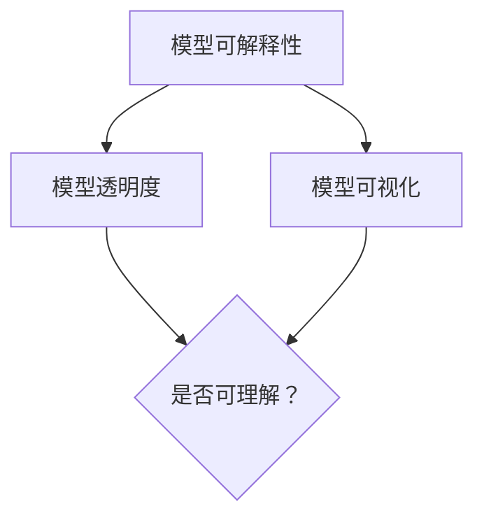

                 

AI领域的快速发展带来了许多令人瞩目的应用，但随之而来的是模型的可解释性问题。在许多应用场景中，用户对模型的透明度和可解释性有着强烈的需求。为了满足这一需求，AI Interpretability（AI可解释性）应运而生。本文将深入探讨AI Interpretability的原理，并提供具体的代码实例，帮助读者更好地理解这一概念。

## 1. 背景介绍

AI可解释性是指使人工智能系统（尤其是黑盒模型）的可操作性和决策过程更容易理解的技术。随着深度学习模型在医疗、金融、自动驾驶等关键领域的应用日益广泛，其透明度和可解释性变得尤为重要。以下是一些背景信息：

- **医疗领域**：医生需要理解AI模型如何为患者提供诊断建议，以确保模型的决策符合临床标准。
- **金融领域**：投资者和监管机构希望了解模型的决策逻辑，以便更好地评估风险。
- **自动驾驶**：汽车驾驶员需要信任自动驾驶系统，了解系统在特定情况下的决策过程。

## 2. 核心概念与联系

为了理解AI可解释性，我们需要了解几个核心概念：

- **模型可解释性**：模型的可解释性是指用户能够理解模型的决策过程。
- **模型透明度**：模型的透明度是指用户能够访问模型的内部结构和参数。
- **模型可视化**：模型可视化是将模型的内部结构以图形化的方式呈现。

下面是一个Mermaid流程图，展示了这些概念之间的联系：



## 3. 核心算法原理 & 具体操作步骤

### 3.1 算法原理概述

AI可解释性的核心是揭示模型的决策过程。常用的方法包括：

- **模型解释器**：例如，使用LIME（Local Interpretable Model-agnostic Explanations）和SHAP（SHapley Additive exPlanations）。
- **模型可视化**：例如，使用TensorFlow的`tensorboard`工具。
- **特征重要性**：评估每个特征对模型决策的影响。

### 3.2 算法步骤详解

1. **选择解释方法**：根据应用场景选择合适的解释方法。
2. **数据预处理**：对输入数据进行标准化和处理。
3. **模型训练**：使用适当的算法训练模型。
4. **解释模型**：使用选择的方法解释模型。
5. **可视化结果**：将解释结果以图表或图形形式呈现。

### 3.3 算法优缺点

- **优点**：提高模型的透明度和可信度，有助于用户理解模型决策。
- **缺点**：解释方法可能依赖于特定模型，且解释结果可能不完全准确。

### 3.4 算法应用领域

AI可解释性在医疗、金融、自动驾驶等领域都有广泛应用。例如，在医疗领域，医生可以使用可解释性工具来验证AI模型的诊断建议。

## 4. 数学模型和公式 & 详细讲解 & 举例说明

### 4.1 数学模型构建

AI可解释性的核心是理解模型的决策过程。我们可以使用以下公式来表示：

$$
\text{预测} = f(\text{特征向量}) + \epsilon
$$

其中，$f$ 是模型函数，$\epsilon$ 是误差项。

### 4.2 公式推导过程

$$
f(\text{特征向量}) = \text{权重} \times \text{特征向量} + \text{偏置}
$$

### 4.3 案例分析与讲解

假设我们有一个简单的人工神经网络，其决策过程可以表示为：

$$
\text{预测} = \text{ReLU}(w_1 \cdot x_1 + w_2 \cdot x_2 + b)
$$

其中，$w_1$ 和 $w_2$ 是权重，$x_1$ 和 $x_2$ 是特征，$b$ 是偏置。

通过分析这个公式，我们可以理解每个特征对模型决策的影响。

## 5. 项目实践：代码实例和详细解释说明

### 5.1 开发环境搭建

我们使用Python和Scikit-Learn库来构建一个简单的线性回归模型，并使用LIME进行解释。

### 5.2 源代码详细实现

```python
from sklearn.linear_model import LinearRegression
from sklearn.datasets import load_iris
from lime import lime_tabular

# 加载数据集
iris = load_iris()
X = iris.data
y = iris.target

# 训练模型
model = LinearRegression()
model.fit(X, y)

# 创建LIME解释器
explainer = lime_tabular.LimeTabularExplainer(X, feature_names=iris.feature_names, class_names=iris.target_names)

# 选择一个样本进行解释
idx = 0
exp = explainer.explain_instance(X[idx], model.predict, num_features=5)

# 可视化解释结果
exp.show_in_notebook(show_table=True)
```

### 5.3 代码解读与分析

这段代码首先加载数据集，然后训练了一个线性回归模型。接着，使用LIME解释了模型对一个特定样本的预测。

### 5.4 运行结果展示

运行上述代码后，我们将看到一个表格，显示了每个特征对该样本预测的影响。

## 6. 实际应用场景

AI可解释性在医疗、金融、自动驾驶等领域都有广泛应用。例如，在医疗领域，医生可以使用可解释性工具来验证AI模型的诊断建议。

## 7. 工具和资源推荐

- **学习资源**：《深度学习》（Goodfellow, Bengio, Courville）是一本经典的深度学习教材。
- **开发工具**：TensorFlow和PyTorch是常用的深度学习框架。
- **相关论文**：LIME和SHAP的相关论文是理解AI可解释性的重要参考资料。

## 8. 总结：未来发展趋势与挑战

AI可解释性是当前研究的热点之一，未来发展趋势包括：

- **更好的解释方法**：开发更加准确和可解释性更好的模型。
- **跨领域应用**：将可解释性技术应用于更多领域。

然而，也面临着以下挑战：

- **模型复杂性**：随着模型变得越来越复杂，解释模型可能变得困难。
- **数据隐私**：解释模型时可能涉及敏感数据。

## 9. 附录：常见问题与解答

- **Q：什么是LIME？**
  A：LIME（Local Interpretable Model-agnostic Explanations）是一种可解释性方法，用于为特定输入样本提供解释。

- **Q：什么是SHAP？**
  A：SHAP（SHapley Additive exPlanations）是一种基于博弈论的可解释性方法，用于评估每个特征对模型预测的影响。

作者：禅与计算机程序设计艺术 / Zen and the Art of Computer Programming
----------------------------------------------------------------

以上是本文的完整内容。希望这篇文章能够帮助读者更好地理解AI可解释性的原理和应用。随着AI技术的不断发展，AI可解释性将变得更加重要，为用户带来更多的信任和透明度。

